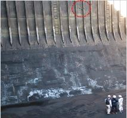
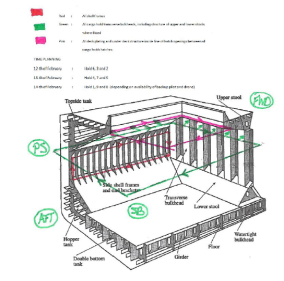

# Remote Inspection Techniques

> OTHER RULES AND GUIDANCE / GC-39-E / 2025 / EN / Guidance

## Chapter 1 General

### 101. Definitions

#### 1. Remote Inspection Techniques (RIT) is a means of survey that enables examination of any part of the structure without the need for direct physical access of the surveyor. For surveys conducted by use of a remote inspection technique, one or more of the following means for access, acceptable to the Surveyor, is to be provided.

- **(1)** Unmanned Aerial Vehicles (UAV) / Drones

  |  |  |
  | --- | --- |
  | Close-up Survey using Drone | Photo taken by Drone while Close-up Survey |
- **(2)** Unmanned robot arm
- **(3)** Remotely Operated Vehicles, ROV
- **(4)** Climbers
- **(5)** Other means acceptable to the Society

  |  |
  | --- |
  | Thickness measurement carried out by a crawler |

#### 2. Close-up Survey means a survey where the details of structural components are within the close visual inspection range of the Surveyor, i.e. normally within reach of hand.

#### 3. Service Supplier means a person or company, not employed by an IACS Member, who at the request of an equipment manufacturer, shipyard, vessel’s owner or other client acts in connection with inspection work and provides services for a ship or a mobile offshore unit such as measurements, tests or maintenance of safety systems and equipment, the results of which are used by surveyors in making decisions affecting classification or statutory certification and services.

#### 4. the Owner means including Charterer, representatives of Owner, Representatives of Charterer and master of ship.

#### 5. Unmanned Aviation/Aerial Vehicle (UAV) / Drone means a pilot-free aircraft capable of remote control or autonomous flight based on pre-programmed flight routes and/or dynamic automation systems.

#### 6. Operators mean Operators (pilot mission) who directly controls the flight of the drone.

#### 7. Hazardous Areas mean areas where flammable or explosive gases, vapors, or dust are generally present or may be present.

#### 8. Survey plans means plans for the survey of various hull compartments, including an appropriate flight plan, if unmanned aerial vehicles are used, are recommended to be developed based on the extent of survey, requirements and the drawings of the dangerous areas of the ship.

#### 9. Flight Plan: for safe flight, activities performed by flight personnel, such as supervisors, operators, and assistants, before take-off, in accordance with all applicable standards and regulations relating to flight, including weather, flight paths, flight zones, equipment composition, supporting personnel, communication requirements and other factors.

|  |
| --- |
| Example of flight plan |
