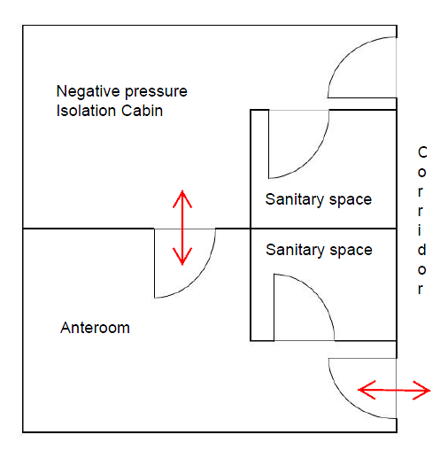
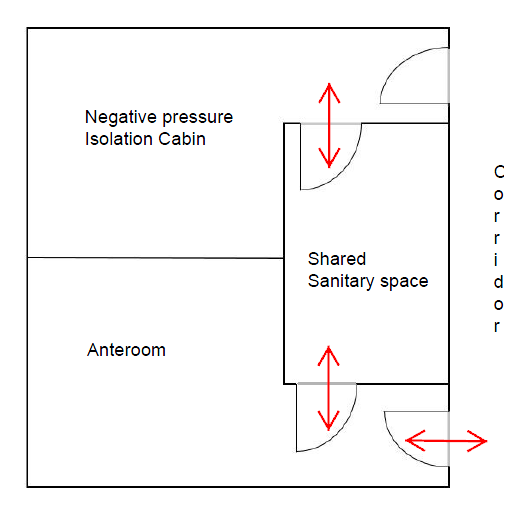
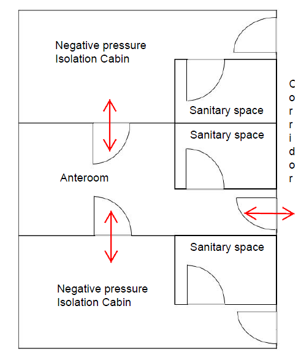

# Guidance for Ships designed to Prevent the spread of Infectious Disease

> OTHER RULES AND GUIDANCE / GC-40-E / 2025 / EN / Guidance

## Section 3 Design Requirements

### 301. General

#### 1. This section provides the requirements for construction, arrangement, materials, and ventilation for negative pressure isolation cabins, anterooms, hospital rooms, sanitary spaces and offices designated for shore personnel and visitors, storage space of infectious solid waste and laundry rooms related to the design to prevent the spread of infectious disease in the event of an outbreak.

#### 2. The ventilation requirements given in this section are only required in the event of an outbreak. The ventilation system is to provide normal operation mode and outbreak operation mode, and it is possible to easily being switched to outbreak operation mode in the event of an outbreak.

#### 3. When small pipes are installed as a means to check the differential pressure in negative pressure isolation cabins, anterooms, and hospital rooms, at least one portable differential pressure manometer is to be provided on board.

### 302. Negative pressure isolation cabins

#### 1. General

- **(1)** Negative pressure isolation cabins are to be single room and to be able to accommodate at least 5% of the total complement.
- **(2)** Normal cabins satisfying the requirements of **302.** are able to converted into negative pressure isolation cabins in the event of an outbreak, and are included in the number of negative pressure isolation cabins in (1) above.
- **(3)** When negative pressure isolation cabins are in use due to an outbreak, it is to be clearly marked as "Negative pressure isolation cabin" so that it can be easily identified from the outside.
- **(4)** Negative pressure isolation cabins is to have windows that provide an adequate view to the outside. For open type windows it is to be closed to maintain the negative pressure and to be constructed to maintain air tightness in the cabins in the event of an outbreak. Negative pressure isolation cabins and anterooms are not to have balconies.
- **(5)** Negative pressure isolation cabins are to have a sanitary space with separate toilet and shower facility, and non-contact automatic faucet is to be installed in the wash basin.

#### 2. Interior construction and materials

The interior construction and materials of negative pressure isolation cabins, anterooms, and sanitary spaces related to the design to prevent the spread of infectious disease are to satisfy the following requirements.

- **(1)** For indoor materials such as walls and ceilings, materials with good sealing performance are to be used to maintain negative pressure. The connections of walls, ceilings, and floors are to be constructed to maintain air tightness.
- **(2)** Attached devices such as sockets and switches, and joints such as air conditioning, sanitation, electric, and piping are to be constructed to maintain airtightness so as not to become a path for air leakage.
- **(3)** Finishing materials such as walls, ceilings, and floors are to have strong impermeability and chemical resistance, and not to be perforated or corrugated for easy cleaning. The use of unfinished wood as a surface material is to be avoided.
- **(4)** All corners, such as the corners where floors and walls meet, are to be rounded as much as possible to avoid dust and make it easy to clean.
- **(5)** Textiles and fabrics that are difficult to wash are not to be used on floors, walls and furniture. Mattresses are to have an impermeable cover.

#### 3. Arrangement

- **(1)** Negative pressure isolation cabins are to be located near the corridor or stair with direct exit to the outside spaces that lead to the embarkation and disembarkation station, and are installed together in one place as possible.
- **(2)** An anteroom is to be installed between a negative pressure isolation cabin and a corridor. A normal room may be converted and used to an anterooms in the event of an outbreak. In this case, a door that allows direct access to the negative pressure isolation cabin from the anteroom is to be installed. Refer to **Fig 1** and **Fig 2** as examples related to the arrangement of negative pressure isolation cabins and anterooms.
- **(3)** Doors of negative pressure isolation cabins and anterooms are to comply with the requirements of **Table 1**.

  |  |  * In this case, shared sanitary space is treated as a sanitary space belonging to negative pressure isolation cabin. |
  | --- | --- |
  | **Fig 1 Example of arrangement of negative pressure isolation cabins and anterooms (in case of one negative pressure isolation cabin and one anteroom)** |   |

  |  |
  | --- |
  | **Fig 2 Example of arrangement of negative pressure isolation cabins and anterooms (in case of two negative pressure isolation cabins and one anteroom)** |

  **Table 1 Doors of negative pressure isolation cabins and anterooms**

  | Requirements for door | Door location |   |   |
  | --- | --- | --- | --- |
  | Requirements for door | between the corridor and anteroom | between the anteroom and the negative pressure isolation cabin | between the negative pressure isolation cabin and corridor |
  | Maintaining air-tightness | O | O | O |
  | Installing hold back device | X | X | - |
  | Installing self closing device | O | O | - |
  | Warning notice that two doors must not open at the same time | O | O | - |
  | Doors swing into the anteroom | - | O | - |
  | Louvers to be closed, if installed, in the event of an outbreak | O | O | O |
  | Warning notice for the prohibition of use in the event of an outbreak | - | - | O |
  | NOTES O : required X : prohibited - : not applicable |   |   |   |

#### 4. Ventilation system

The requirements for ventilation system of negative pressure isolation cabins (including associated sanitary spaces) and anterooms (including associated sanitary spaces) are in accordance with the following.

- **(1)** The air changes per hour in negative pressure isolation cabins (including associated sanitary spaces) and anterooms (including associated sanitary spaces) is to be at least 6 times, and 12 or more times is recommended.
- **(2)** Anterooms are to maintain the negative pressure of at least –2.5 Pa compared to the corridor, and negative pressure isolation cabins are to maintain the negative pressure of at least –2.5 Pa compared to the anteroom. As shown in **Fig 1**, when the negative pressure isolation cabin and anteroom have a shared sanitary space, the boundary of the negative pressure is to be between the shared sanitary space and anteroom.
- **(3)** Exhaust air from negative pressure isolation cabins (including associated sanitary spaces) and anterooms (including associated sanitary spaces) are not to be recirculated to other spaces even if filtered with HEPA filter or equivalent filter.
- **(4)** In order to prevent contaminated air from flowing back in the event of a shutdown or failure of the ventilation system, a HEPA filter or equivalent filter is to be installed, or a non return damper or flap is to be installed in the duct of air supply into negative pressure isolation cabins and anterooms. However, when a common air supply duct is used, a HEPA filter or equivalent filter is to be installed, or a non return damper or flap is to be installed in the duct branch connected to each room.
- **(5)** Exhaust air inlets in negative pressure isolation cabins are to be placed as close to the bed as possible.
- **(6)** Exhaust ducts from negative pressure isolation cabins (including associated sanitary spaces) and anterooms (including associated sanitary spaces) are to be separated from exhaust ducts of other spaces. In addition, exhaust fans of exhaust ducts are to be installed outdoor as applicable, and if installed indoor, the downstream of the duct after the exhaust fan is to be welded or sealed.
- **(7)** Exhaust ducts from each of the negative pressure isolation cabin (including the associated sanitary space) and anterooms (including the associated sanitary space) are to be exhausted independently. However, if a HEPA filter or equivalent filter is installed, or a non return damper or flap is installed in exhaust duct branch in each space, a common exhaust duct may be used in downstream of the filter, damper or flap.
- **(8)** Exhaust outlets from negative pressure isolation cabins (including associated sanitary spaces) and anterooms (including associated sanitary spaces) are to be located on the highest deck of the accommodation and to be not less than 8 m away from the intakes, natural ventilation openings, doors and open windows. However, if all contaminated air from each space is discharged to the outside through a HEPA filter or equivalent filter, exhaust outlets may be located on the adjacent deck and the above distance may be reduced to 2m. Appropriate means are to be taken so that the wind direction from the exhaust outlets is not directed toward adjacent passageway, intakes, natural ventilation openings, doors and open windows.
- **(9)** The warning notice indicating contaminated air is to be attached to the exhaust outlets from each of the negative pressure isolation cabin (including the associated sanitary space) and the anteroom (including the associated sanitary space).
- **(10)** Means are to be provided to check the differential pressure between the negative pressure isolation cabin and the anteroom, and between the anteroom and corridor. This may be a differential pressure indicator displayed up to the unit of 0.1 Pa (however, a differential pressure indicator displayed up to 1 Pa unit may be installed where the differential pressure is secured over 4 Pa) or a small pipe installed through a door or wall to measure the differential pressure. This pipe must be sealed when not in use.

### 303. Hospital rooms

#### 1. Interior construction and materials

- **(1)** The interior construction and materials of hospital rooms are to satisfy the requirements in **302. 2**.

#### 2. Arrangement

- **(1)** Hospital rooms are to be located near the corridor or stair with direct exit to the outside spaces that lead to the embarkation and disembarkation station.
- **(2)** Where the space inside the hospital rooms satisfies the requirements of **302.**, this space may be used as a negative pressure isolation cabin in the event of an outbreak.
- **(3)** Entrance doors of hospital rooms are to comply with the requirements of **Table 2**.

  **Table 2 Entrance doors of hospital rooms**

  | Requirements for door | Application |
  | --- | --- |
  | Maintaining air-tightness | O |
  | Installing hold back device | X |
  | Installing self closing device | O |
  | Louvers to be closed, if installed, in the event of an outbreak | O |
  | NOTES O : required X : prohibited |   |

#### 3. Ventilation system

The requirements for ventilation system of hospital rooms are in accordance with the following.

- **(1)** The air changes per hour in hospital rooms is to be at least 6 times, and 12 or more times is recommended.
- **(2)** Hospital rooms are to maintain the negative pressure of at least –2.5 Pa compared to the corridor or other spaces directly accessible to the hospital room.
- **(3)** Each separate space with a door in the hospital room is to have an air supply and an air exhaust.
- **(4)** A HEPA filter or equivalent filter is to be installed, or a non return damper or flap is to be installed in the supply air duct into the hospital room.
- **(5)** Exhaust ducts from hospital rooms are to be separated from exhaust ducts of other spaces.
- **(6)** Exhaust outlets from hospital rooms are to be not less than 8 m away from the intakes, natural ventilation openings, doors and open windows. However, if all contaminated air from each space is discharged to the outside through a HEPA filter or equivalent filter, the above distance may be reduced to 2 m. Appropriate means are to be taken so that the wind direction from the exhaust outlets is not directed toward adjacent passageway, intakes, natural ventilation openings, doors and open windows.
- **(7)** Means are to be provided to check the differential pressure between the hospital and the corridor or other spaces directly accessible to the hospital room. This may be a differential pressure indicator displayed up to the unit of 0.1 Pa (however, a differential pressure indicator displayed up to 1 Pa unit may be installed where the differential pressure is secured over 4 Pa) or a small pipe installed through a door or wall to measure the differential pressure. This pipe must be sealed when not in use.

### 304. Sanitary spaces designated for shore personnel and visitors

At least one designated sanitary space that can be used by shore personnel and visitors in the event of an outbreak is to be installed, and the notice “Shore personnel and visitors use only” is to be posted at the entrance.

#### 1. Interior construction and materials

- **(1)** The interior construction and materials of sanitary spaces designated for shore personnel and visitors are to satisfy the requirements in **302. 2**.

#### 2. Arrangement

- **(1)** Sanitary spaces designated for shore personnel and visitors are to be arranged to minimize the possibility of contact with crew, and to be easily accessible from outside entrances.

#### 3. Ventilation system

- **(1)** The air changes per hour in sanitary spaces designated for shore personnel and visitors is to be at least 15 times.
- **(2)** Exhaust outlets from sanitary spaces designated for shore personnel and visitors are to be not less than 8 m away from the intakes, natural ventilation openings, doors and open windows. However, if all contaminated air from each space is discharged to the outside through a HEPA filter or equivalent filter, the above distance may be reduced to 2 m. Appropriate means are to be taken so that the wind direction from the exhaust outlets is not directed toward adjacent passageway, intakes, natural ventilation openings, doors and open windows.

### 305. Offices designated for shore personnel and visitors

At least one designated office that can be used by shore personnel and visitors in the event of an outbreak is to be installed.

#### 1. Interior construction and materials

- **(1)** The interior construction and materials of offices designated for shore personnel and visitors are to satisfy the requirements in **302. 2**.

#### 2. Arrangement

- **(1)** Offices designated for shore personnel and visitors are to be arranged to minimize the possibility of contact with crew, and to be easily accessible from outside entrances.

#### 3. Ventilation system

- **(1)** The air changes per hour in sanitary spaces designated for shore personnel and visitors is to be at least 12 times.
- **(2)** Exhaust outlets from offices designated for shore personnel and visitors are to be not less than 8 m away from the intakes, natural ventilation openings, doors and open windows. However, if all contaminated air from each space is discharged to the outside through a HEPA filter or equivalent filter, the above distance may be reduced to 2 m. Appropriate means are to be taken so that the wind direction from the exhaust outlets is not directed toward adjacent passageway, intakes, natural ventilation openings, doors and open windows.

### 306. Storage spaces of infectious solid waste

At least one designated storage space that stores infectious solid waste in the event of an outbreak is to be installed.

#### 1. Interior construction and materials

- **(1)** The interior construction and materials of storage spaces of infectious solid waste are to satisfy the requirements in **302. 2**.

#### 2. Arrangement

- **(1)** Storage spaces for infectious solid waste are to be independent from other space and to be arranged in a location that allows for safe disposal of waste. The warning notice indicating that it is infectious waste is to be posted at the entrance to the storage space of infectious solid waste. Doors are equipped with self closing device, and installation of hold back devices is not permitted. Storage spaces for infectious solid waste can be used as a non-infectious waste storage normally, not during an outbreak.

#### 3. Ventilation system

- **(1)** The air changes per hour in storage spaces for infectious solid waste is to be at least 10 times.
- **(2)** Exhaust air from storage spaces for infectious solid waste is to be discharged directly to the outside air and separated from exhaust ducts of other spaces.
- **(3)** Exhaust outlets from storage spaces for infectious solid waste are to be not less than 8 m away from the intakes, natural ventilation openings, doors and open windows. However, if all contaminated air from each space is discharged to the outside through a HEPA filter or equivalent filter, the above distance may be reduced to 2 m. Appropriate means are to be taken so that the wind direction from the exhaust outlets is not directed toward adjacent passageway, intakes, natural ventilation openings, doors and open windows.
