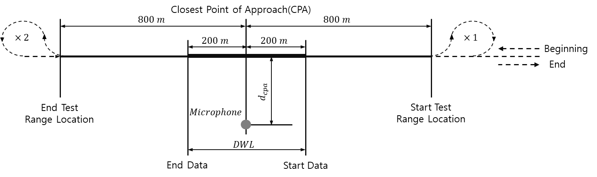

# External Airborne Noise from Ships

> OTHER RULES AND GUIDANCE / GC-42-E / 2025 / EN / Guidance

## CHAPTER 3 EXTERNAL AIRBORNE NOISE MEASUREMENT

### Section 1 General

#### 101. General

- **1.** The measurement and result analysis are to be performed in accordance with the requirements in **Sec 2** to **Sec 5** and the criteria specified in **Sec 6** are to be met.
- **2.** Measurement of EAN is to be performed by the service supplier registered with the Society.

#### 102. Sound source on board of the ships

- **1.** The overall sound emission radiated from each ship can be traced back to several individual sound sources on board of the ship. The most relevant noise sources to be measured are listed below but not limited to.
  - **(1)** The funnel outlet(s) of main and/or auxiliary engines
  - **(2)** The opening(s) of engine room ventilation inlets and outlets
  - **(3)** The opening(s) of the cargo holds ventilation and air-conditioning inlet(s) and outlet(s).
  - **(4)** The opening(s) of the ventilation and air-conditioning of passenger rooms
  - **(5)** Additional relevant ventilation openings (e.g., sanitary or galley exhaust).
  - **(6)** Cargo loading and unloading facilities
- **2.** The operation of cooled containers/reefers on container ships is strongly depending on several indicators such as (cooling) type of the container, type and size of the ship, ships load and port conditions. Furthermore, their operation is also belonging to the cargo handling process of a ship at berth. Therefore, the cooled containers/reefers are not considered for measurements and will not be considered for the calculation of the total sound power level of the measured ship in this Guidance.

### Section 2 Instrumentation

#### 201. General

- **1.** In order to quantify the EUN from ships, three main instrumentation components are required: (1) microphone and signal conditioning, (2) data acquisition, recording, processing and display system, and (3) distance measurement system.

#### 202. Measuring equipment

- **1.** The equipment for acoustic measurements must consist of the following equipment.
  - **(1)** Integrating sound level meter with a microphone, (cable) and windscreen, in compliance with IEC 61672-1 and IEC 61672-2, class 1.
  - **(2)** Acoustic calibrator in compliance with IEC 60942, class 1
- **2.** The microphones need to be equipped with a windscreen (diameter ≥ 6 cm) for each measurement.
- **3.** The calibration of the measuring system needs to be checked with the sound calibrator before and after each measurement series.
- **4.** For post processing, analysis software is required comprising the following methods.
  - **(1)** 1/3 octave band analysis according to IEC 61672-1.
  - **(2)** Frequency weighting, time weighting and averaging.
- **5.** During all measurements the time weighting fast (F) is to be used.
- **6.** Distance measuring system is to have an accuracy of 2 % with results from 0.1 to 600 m.
- **7.** Acoustic measuring system and distance measuring system are to be checked for calibration certificate and valid calibration status during measurement.

### Section 3 Measurement Location

#### 301. General

- **1.** Measurements are to be carried out taking into account the location of noise sources specified in **102. 2.** Additional measurements are to be carried out as required by the Society in case of excessive noise level is identified.
- **2.** Measurements are to be made at a distance of 100 m from the hull surface for at least 30 seconds. All measurement points are to be at least 4 m above sea surface or ground surface where the microphone is located.
- **3.** Distance measurement is necessary to determine the distance between the vessel surface and the measuring point. If the measured distance differs from 100 m, it should be recorded and corrected during the data post-processing.

#### 302. EAN for berthing

- **1.** The recommended distance between the hull side and the microphone is 100 m. If 100 m distance is not practical, measurement can be performed at a distance of 80 ~ 120 m from the vessel. The side of the vessel is to be directly exposed to the microphone, and there is to be no barrier or refecting surface between the noise source (vessel) and the receiver (microphone).
- **2.** At least 4 noise measurements is to be taken on each side of the vessel (starboard and port). One point corresponds to a point 100 m vertically from the position of the funnel outlet of auxiliary engines, and two points in the bow direction is to be at 1/4 and 1/2 points of the ship length (L), and one point at the 1/4 L point in the stern direction. However, in case of ships having a biased auxiliary engine outlet toward bow or midsection, the 1/2 L point in the bow direction may be adjusted to the 1/2 L point in the stern direction.
- **3.** Background noise is to be measured before and after measuring EAN for each side of the ship. The background noise is to be at least 3 dB lower than that of each measurement point.
  
  Figure 3.1 Measurement outline of EAN for berthing

#### 303. EAN for sailing

- **1.** The ship under test is to pass a straight course to achieve the required distance ($d _{CPA}$) at closet point of approach (CPA). $d _{CPA}$ which is the distance between hull surface and microphone is 100 m. To ensure the safety of ships and workers, if necessary, EAN may be measured at $d _{CPA}$ greater than 100 m.
- **2.** The data window length (DWL) is from 200 m before arrival (start data) to 200 m after passing (end data) based on the closest point of approach.
- **3.** The distance from the start test range location and the end test range location to the closest point of approach is to be 800m or more.
- **4.** Unless otherwise required by the ship's test plan, the ship under test is to maintain a constant speed, fixed engine conditions and minimum use of helm to maintain course until it has passed the end test range location.
  - **(1)** At the start and the end of each measurement test run, the background noise measurement is to be carried out and recorded for at least 1 minute with the ship under test located at the farthest distance or at a distance of at least ≥ 2,000 m from the microphones, with the same microphone and data acquisition methods.
  - **(2)** During the recording of the background noise measurement, all main engines and generators are to operate only in idle conditions or not to be in operation.
  - **(3)** After the completion of the background noise measurement, the ship under test is to proceed to operate at the prescribed operating condition as specified in the approved measurement plan. The operating conditions such as the main and auxiliary engine output, ship speed, propeller RPM and nominal pitch, and loading condition are to be recorded accordingly.
  - **(4)** Before the acoustic center (funnel outlet of main engines) of the ship reaches the start test range location, the intended operating conditions of the ship under test are to be achieved. Between the start test range location and the end test range location, the direction and ship operating conditions are to remain the same.
  - **(5)** The data recording of the test measurement for the EAN (where the mechanical output signal of the microphones is sent to the data acquisition system) is only to commence when the acoustic center (funnel outlet of main engine) of the ship under test reaches the start test range location and is to terminate when the acoustic center of the ship under test reaches the end test range location as shown in **Figure 3.2**.
  - **(6)** Distance measurements are to be recorded for the ship under test. These include the distance ($d _{CPA}$) at the closest point of approach, horizontal distance from the hull surface of the ship to each microphone.
  - **(7)** The ship under test is to make a turn after passing the end test range location, where the ship will maneuver and prepare for the next set of runs on the alternate side of the ship repeating the measurement procedure from (1) to (6).
  - **(8)** A complete test course requires the ship under test to perform two (2) repeated runs (with alternating approach) each on the port and starboard side of the ship under the same operating conditions.
    
    Figure 3.2 Measurement outline of EAN for sailing

### Section 4 Measurement Condition

#### 401. General

- **1.** Sea trials are to be carried out with the ship in loaded or ballast condition. The actual condition during the measurements is to be recorded on the measurement report.
- **2.** The main propulsion and auxiliary machinery conditions are to be set up according to the conditions as specified in the approved measurement plan. The operating conditions are to be verified by the Surveyor.
- **3.** Measurements are to be taken under conditions of Sea State 3 or less. Wind velocity is to be below 7 m/s and measurements are to only be performed when no rain or snow is present.
- **4.** The microphone and measuring instruments used in the data acquisition system are to be calibrated prior to the EAN measurements. The relevant instrumentation reference calibration certificates, together with the results of the field setup and calibration check are to be provided to the Surveyor.
- **5.** The recognized service supplier for EAN measurement is to verify that all the measurement systems for carrying out the EAN measurement are put in place and are functioning correctly.
- **6.** Residual noise (or background noise) is to be avoided as far as possible in the vicinity of the measurement location, and measurements are not to be distorted by background noise and surroundings (eg. large reflecting surfaces).

#### 402. EAN for berthing

- **1.** During measurements, the ship is to be operating in the characteristic/normal load of the ship at berth. It must be ensured that the load condition during measurements is chosen in such a way that the measured sound emissions will not be exceeded at berth in any further calling port (in most cases during high / maximum load conditions of the ship). It is important that the electric load is kept as constant as possible during all measurements.
- **2.** To adjust the electric load of the auxiliary engine(s) to the representative load, consumers on board might need to be switched on or off. Consumers that (in most cases) can be controlled manually are as follows.
  - **(1)** cargo hold fans,
  - **(2)** engine room fans,
  - **(3)** fans and air-conditioning of passenger rooms and
  - **(4)** further fans on board.
- **3.** Furthermore, the operating conditions during all measurements need to be documented in detail.

#### 403. EAN for sailng

- **1.** During measurement, the propeller output is to be the normal seagoing speed of ship or at least 85 % of the maximum continuous rating (MCR) of the main engine.
- **2.** Notwithstanding **1** above, the case for ships confirmed to sail in sea areas within 1 km from inland or in smooth water areas under separately set operating conditions. In this case, the operational conditions are to be specified in the measurement plan. If the operating speed is not specified in the approved measurement plan, the operating speed is 12 knots for container ships and car carriers and 10 knots for other ship types.
- **3.** Ship’s course has to be kept constant, with rudder angle less than 2 degrees portside or starboard, for the duration of the measurement. If ship maneuvering is need, measurements are to be stopped until recovery of heading.
- **4.** All machinery essential for ship operation is to operate under normal conditions throughout the measurement period. The list of machinery and equipment that are to operate normally during the measurement period is limited to the installed equipment.
- **5.** **5**. Controllable pitch and Voith-Schneider propellers, if any, are to be in the normal seagoing position. For ships with special propulsion and power configurations, such as diesel-electric systems, the actual ship’s design or operating parameters as defined in the ship’s specifications will be used and are to be recorded on the measurement report.
- **6.** Any deviations from operating conditions specified in the approved measurement plan is to be recorded in the measurement report.

### Section 5 Data Post-processing

#### 501. General

- **1.** The measured EAN by a microphone is to be subjected to post-processing steps such as background noise adjustments and distance adjustments.
- **2.** The data post-processing described in **502.** through **504.** is to be performed per 1/3 octave band in the range of 31.5 ~ 8,000 Hz.

#### 502. Background noise adjustments

- **1.** The difference ($triangle L$) between the measured sound pressure level ($L _{p _{s+n}}$) and background noise level ($L _{p _{n}}$) for each 1/3 octave band is determined by the following equation.
  $\Delta L = L _{p _{s+n}} -L _{p _{n}} =10\log _{10} \left( \frac{p _{s+n}^{2}}{p _{n}^{2}} \right)$
  $triangle L$ : signal-plus-noise-to-noise level difference (dB) for each 1/3 octave band
  $p _{s+n}$ : root-mean-square sound pressure at the microphone (μPa). This value includes both the desired signal and undesired background noise
  $p _{n}$ : root-mean-square sound pressure of the background noise at the microphone (μPa)
  $L _{p _{s+n}}$ : root-mean-square sound pressure level (dB) with ship under test present for each run
  $L _{p _{n}}$ : background root-mean-square sound pressure level with the ship under test not influencing the measurement away 2,000 m from microphones (dB)
- **2.** The sound pressure level ($L ^{'} _{p}$) of the ship under test is determined as follows depending on the magnitude of $triangle L$.
  - **(1)** For $\Delta L$ $>$ 10 dB
    $L _{p}^{'} =L _{p _{s+n}}$
    $L _{p}^{'}$ : background noise adjusted root-mean-square sound pressure level of the ship under test (dB)
  - **(2)** For 3 dB $\leq$ $\Delta L$ $\leq$ 10 dB
    $L _{p}^{' } =10\log \left[ 10 ^{\left( \frac{L _{p _{s+n}}}{10} \right)} -10 ^{\left( \frac{L _{p _{n}}}{10} \right)} \right]$
  - **(3)** For $\Delta L$ $<$ 3 dB : The sound pressure level ($L ^{'} _{p}$) may be considered as the same as the background noise level($L _{p _{n}}$), and whether to use the data or re-measure EAN is to be discussed with the Society.

#### 503. Distance adjustments

- **1.** In order to obtain the EAN level at a reference distance of 100 m from the ship, the transmission loss ($TL$) due to sound wave transmission in the air should be considered.
  $L _{p} =L ' _{p} +TL$
  $TL=20\log \left( \frac{d}{d _{ref}} \right)$
  $d$ : the distance from the hull surface of the ship under test to the microphone (m)
  $d _{ref}$ : reference distance (=100 m)

#### 504. Determination of the final EAN level

- **1.** For the sound pressure level at the standard distance (100m) from the ship, EAN level per each 1/3 octave band is to be calculated according to the following procedure.
- **2.** Calculate the average sound pressure level per each 1/3 octave band of EAN for berthing.
  - **(1)** The average sound pressure levels on the port and starboard sides are determined by the following equation.
    $L _{p, P, avg} =10 \log \left( \frac{1}{n} \sum _{k=1} ^{n} 10 ^{\frac{L _{p, P} (k)}{10}} \right)$
    $L _{p, S, avg} =10 \log \left( \frac{1}{n} \sum _{k=1} ^{n} 10 ^{\frac{L _{p, S} (k)}{10}} \right)$
    $L _{p,P} (k)$ : the sound pressure level for each measuring point ($k$) on port side
    $L _{p,S} (k)$ : the sound pressure level for each measuring point ($k$) on starboard side
    $n$ : the number of measuring point ($k$) on each side
  - **(2)** The average sound pressure level of the ship is determined by the following equation.
    $L _{p,1/3 octave} =10\log \left[ \frac{1}{2} \left( 10 ^{\frac{L _{p,P,avg}}{10}} +10 ^{\frac{L _{p,S,avg}}{10}} \right) \right]$
    $L _{p,P, avg}$ : the average sound pressure level (dB) on port side
    $L _{p,S, avg}$ : the average sound pressure level (dB) on starboard side
- **3.** For average sound pressure level per each 1/3 octave band of EAN for sailing, the sound pressure level can be calculated by time averaging the measured sound pressure after background noise adjustments and distance adjustments, or vice versa.
- **4.** The frequency-weighted sound pressure level ($L _{Aeq}$ or $L _{Ceq}$) is calculated using the 1/3 octave band sound pressure level calculated according to paragraphs **2** and **3**.
- **5.** The broadband total EAN level ($L _{EAN \leq 8000}$) is calculated as the sum of sound pressure levels in the 1/3 octave band from 31.5 Hz to 8,000 Hz.

### Section 6 Criteria

#### 601. General

- **1.** The final EAN level of ship under test calculated in **504.** **5** are to meet the acceptance criteria of each EAN level depending on frequency ranges specified in **Table 3.1**. 

  | Frequency range | For sailing |   |   | For berthing |   |   |
  | --- | --- | --- | --- | --- | --- | --- |
  | Frequency range | EAN-SM[x](1) | EAN-S1 | EAN-S2 | EAN-BM[x](1) | EAN-B1 | EAN-B2 |
  | 31.5 Hz ~ 8,000 Hz | x | 63 | 58 | x | 50 | 45 |
  | note (1) M indicates that EAN was measured, and x indicates the broadband total EAN level(dB(A)) in the range of 31.5 ~ 8000 Hz. |   |   |   |   |   |   |

  |   |
  | --- |
  | **GUIDANCE FOR EXTERNAL AIRBORNE NOISE FROM SHIPS** Published by **KR** 36, Myeongji ocean city 9-ro, Gangseo-gu, BUSAN, KOREA TEL : +82 70 8799 7114 FAX : +82 70 8799 8999 Website : http://www.krs.co.kr |
  |   |

  | CopyrightⒸ 2023, KR Reproduction of this Rules and Guidance in whole or in parts is prohibited without permission of the publisher. |
  | --- |
