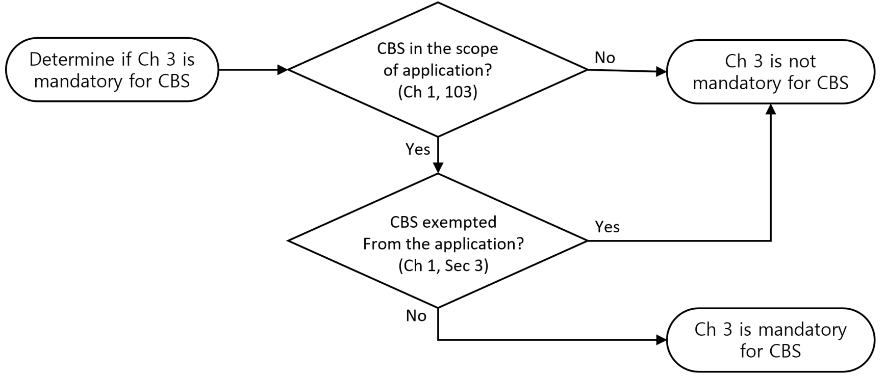
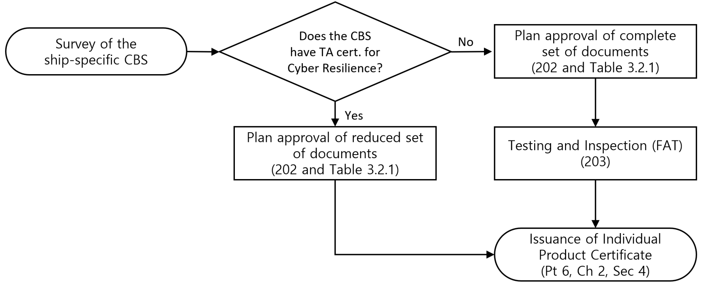

# Guidance for Cyber Resilience of Ships and Systems

> OTHER RULES AND GUIDANCE / GC-44-E / 2025 / EN / Guidance

## CHAPTER 3 Cyber Resilience of Systems and Equipment

### Section 1 General

#### 101. Introduction

Technological evolution of vessels, ports, container terminals, etc. and increased reliance upon Operational Technology (OT) and Information Technology (IT) has created an increased possibility of cyber-attacks to affect business, personnel data, human safety, the safety of the ship, and also possibly threaten the marine environment. Safeguarding shipping from current and emerging threats must involve a range of controls that are continually evolving which would require incorporating security features in the equipment and systems at design and manufacturing stage. It is therefore necessary to establish a common set of minimum requirements to deliver systems and equipment that can be described as cyber resilient.
This document specifies unified requirements for Cyber Resilience of on-board systems and equipment.

#### 102. Application

- **1.** The requirements in this Chapter apply to the computer-based system(CBS) in the application scope of this Guidance as specified in Ch 1, 103. 2.
- **2.** For navigation and radio communication systems, the application of IEC 61162-460 or other equivalent standards in lieu of the required security capabilities in Sec 4 may accepted by the Society, on the condition that relevant requirements in Ch 2 are complied with.
- **3.** Sec 4 specifies the required security capabilities for CBSs.
- **4.** The requirements in Sec 4 are based on the selected requirements in IEC 62443-3-3. Reference can be made to the standards referenced to determine the full content, rationale and relevant guidance for each requirement.

#### 103. Limitations

- **1.** This Chapter does not cover environmental performance for the system hardware and the functionality of the software. In addition to this Chapter, following the relevant Classification Technical Rules shall be applied:
  - **(1)** Ch 3, Sec 23 of Guidance for Approval of Manufacturing Process and Type Approval, etc. for environmental performance for the system hardware
  - **(2)** Pt 6, Ch 2, Sec 4 of the Rules for safety of equipment for the functionality of the software

#### 104. Security Philosophy

- **1.** **Systems and Equipment**
  - **(1)** A System can consist of group of hardware and software enabling safe, secure and reliable operation of a process. Typical example could be Engine control system, DP system, etc.
  - **(2)** Equipment may be one of the following.
    - **(A)** Network devices (i.e. routers, managed switches)
    - **(B)** Security devices (i.e. firewall, Intrusion Detection System)
    - **(C)** Computers (i.e. workstation, servers)
    - **(D)** Automation devices (i.e. Programmable Logic Controllers)
    - **(E)** Virtual machine cloud-hosted
- **2.** **Cyber Resilience**
  The Cyber Resilience requirements in Sec 4 will be applicable for all systems in the scope of Ch 1, 103 as applicable. Additional requirements related to interface with untrusted networks will only apply for systems where such connectivity is designed.
- **3.** **Essential Systems Availability**
  - **(1)** Security measures for Essential system shall not adversely affect the systems availability.
  - **(2)** Implementation of security measures shall not cause loss of safety functions, loss of control functions, loss of monitoring functions or loss of other functions which could result in health, safety and environmental consequences.
  - **(3)** The system shall be adequately designed to allow the ship to continue its mission critical operations in a manner that ensures the confidentiality, integrity, and availability of the data necessary for safety of the vessel, its systems, personnel and cargo.
- **4.** **Compensating Countermeasures**
  - **(1)** Compensating countermeasure may be employed in lieu of or in addition to inherent security capabilities to satisfy one or more security requirements.
  - **(2)** Compensating countermeasure(s) shall meet the intent and rigor of the original stated requirement considering the referenced standards as well as the differences between each requirement and the related items in the standards, and follow the principles specified in 301. 3.

### Section 2 Survey of Systems and Equipment

#### 201. General

- **1.** **Determination on the application of CBS**
  Suppliers shall in cooperation with the System integrator determine if this Chapter is mandatory for the CBS. (see Fig 3.2.1)
  
  **Fig 3.2.1 Determination on the application of CBS**
- **2.** **Type Approval(TA) for Cyber Resilience**
  - **(1)** The CBSs in the application scope of this Guidance shall be basically type-approved by this Society for Cyber Resilience according to the relevant requirements in this Chapter.
  - **(2)** The procedure and relevant matters related to the Type Approval for Cyber Resilience shall follow the Guidance for Approval of Manufacturing Process and Type Approval, etc.
- **3.** **Plan approval and inspection procedure for the ship-specific CBS**
  - **(1)** The survey requirements for the ship-specific CBSs shall satisfy with Pt 6, Ch 2, Sec 4 of the Class Rules in addition to the requirement in this Chapter.
  - **(2)** In general, the plan approval and inspection for the ship-specific CBSs shall follow the procedure as indicated in Fig 3.2.2.
    
    **Fig 3.2.2 Plan approval and inspection procedure for ship-specific CBS**
  - **(3)** Unless the CBS has the type approval certificate for Cyber Resilience, the CBS shall be tested and inspected including the plan approval of the completed set of documents as specified in Table 3.2.1. (see also Fig 3.2.2)
  - **(4)** Where IEC 61162-460 or other equivalent standards in lieu of the required security capabilities in Sec 4 are applied for navigation and radio communication systems in accordance with 102. 2, it shall be satisfactory to the following:
    - **(A)** The plan approval and inspection procedure shall demonstrated as indicated in Fig 3.2.2.
    - **(B)** Where considered necessary by the Society, additional plan approvals and inspections may be required to demonstrate correspondingly applied to the requirements in Ch 2.
  - **(5)** Where the CBSs, which do not require testing and inspection by Pt 6, Ch 2 of the Class Rules, have the Type Approval certificate for Cyber Resilience, testing and inspection along with the issuance of an individual product certificate according to 203 are not required for such CBSs.

#### 202. Plan approval

- **1.** Plan approval is assessment of documents of a CBS intended for a specific vessel. The documents in Sec 3 are required to be submitted by the supplier. The documents shall enable the Society to verify compliance with requirements in this Chapter.
- **2.** If the CBS holds a valid Type approval certificate covering the requirements of this Chapter, subject to approval by the Society, the supplier may submit a reduced set of vessel-specific documents to the Society. (see Table 3.2.1)
- **3.** The approved version of the documents shall be included in the delivery of the CBS to the system integrator.

  | **No.** | **Document** | **Requirements** | **TA** | **Drawing approval** |   |
  | --- | --- | --- | --- | --- | --- |
  | **No.** | **Document** | **Requirements** | **TA** | **with TA** | **withoutTA** |
  | 1 | CBS asset inventory | To be incorporated in Vessel asset inventory (**Ch 2, 401. 1**) | Approve | Approve | Approve |
  | 2 | Topology diagrams | Enabling System integrator to design security zones and conduits (**Ch 2, 402. 1**) | Approve | Approve | Approve |
  | 3 | Description of security capabilities | Required security capabilities (**Ch 3, 401.**) | Approve |   | Approve |
  | 3 | Description of security capabilities | Additional security capabilities, if applicable (**Ch 3, 402.**) | Approve |   | Approve |
  | 4 | Test procedure for security capabilities | Required security capabilities (**Ch 3, 401.**) | Approve |   | Approve |
  | 4 | Test procedure for security capabilities | Additional security capabilities, if applicable (**Ch 3, 402.**) | Approve |   | Approve |
  | 5 | Security configuration guidelines | Network and security configuration settings (**Ch 3, 401.** item no.29) | Info |   | Info |
  | 6 | Secure development lifecycle | SDLC requirements (**Ch 3, Sec 5**) | Approve |   | Approve |
  | 7 | Plans for maintenance and verification | Security functionality verification (**Pt 6, Ch 2 Sec 4** of the Rules) | Info |   | Info |
  | 8 | Information supporting incident response and recovery plans | Auditable events (**Ch 3, 401.** item no.13) | Info |   | Info |
  | 8 | Information supporting incident response and recovery plans | Deterministic output (**Ch 3, 401.** item no.20) | Info |   | Info |
  | 8 | Information supporting incident response and recovery plans | System backup (**Ch 3, 401.** item no.26) | Info |   | Info |
  | 8 | Information supporting incident response and recovery plans | System recovery and reconstitution (**Ch 3, 401.** item no.27) | Info |   | Info |
  | 9 | Management of change plan | Management of change process (**Pt 6, Ch 2 Sec 4 of the Class Rules**) | Info |   | Info |
  | 10 | Test reports | Configuration of security capabilities and hardening (**Ch 3, 301. 5**, **501. 7**) | Info | Info | Info |

#### 203. Testing and inspection

- **1.** **General**
  - **(1)** Testing and inspection is a vessel-specific verification activity required for CBSs that do not hold a valid Type Approval certificate covering the requirements of this Chapter.
  - **(2)** The objective of testing and inspection is to demonstrate by testing and/or analytic evaluation that the CBS complies with relevant requirements in this Chapter. The testing and inspection shall be carried out at the supplier’s premises or at other test site having the adequate apparatus for testing and inspection.
  - **(3)** After completed testing and inspection, this Society will issue an Individual product certificate and the supplier shall provide the certificate to the system integrator upon delivery of the CBS.
  - **(4)** Testing and inspection comply with the requirements specified in 203. 2 to 203. 5.
- **2.** **General survey items**
  - **(1)** The supplier shall demonstrate that design, construction, and internal testing has been completed.
  - **(2)** It shall also be demonstrated that the system to be delivered is correctly represented by the approved documentation. This shall be done by inspecting the system and comparing the components and arrangement/architecture with the asset inventory (301. 1) and the topology diagrams (301. 2).
- **3.** **Test of security capabilities**
  - **(1)** The supplier shall test the required security capabilities on the system to be delivered. The tests shall be carried out in accordance with the approved test procedure in 301. 4 and be witnessed/accepted by our Surveyor.
  - **(2)** The tests shall provide the Society’s surveyor with reasonable assurance that all requirements are met. This implies that testing of identical components is normally not required.
- **4.** **Correct configuration of security capabilities**
  - **(1)** The supplier shall test/demonstrate for the class surveyor that security settings in the system’s components have been configured in accordance with the configuration guidelines in 301. 5. This demonstration may be carried out in conjunction with testing of the security capabilities.
  - **(2)** The security settings shall be documented in a report, e.g. a ship-specific instance of the configuration guidelines.
- **5.** **Secure development lifecycle**
  The supplier shall, in accordance with documentation in **301. 6**, demonstrate compliance with requirements for secure development lifecycle in **Sec 5**.
  - **(1)** Controls for private keys (IEC 62443-4-1/SM-8)
    - **(A)** This requirement applies if the system includes software that is digitally signed for the purpose of enabling the user to verify its authenticity.
    - **(B)** The supplier shall present management system documentation substantiating that policies, procedures and technical controls are in place to protect generation, storage and use of private keys used for code signing from unauthorized access.
    - **(C)** The policies and procedures shall address roles, responsibilities and work processes. The technical controls shall include e.g. physical access restrictions and cryptographic hardware (e.g. Hardware security module) for storage of the private key.
  - **(2)** Security update documentation (IEC 62443-4-1/SUM-2)The supplier shall present management system documentation substantiating that a process is established in the organization to ensure security updates are informed to the users. The information to the users shall include the items listed in **502. 2**.
  - **(3)** Dependent component security update documentation (IEC 62443-4-1/SUM-3)The supplier shall present management system documentation, as required by 502. 3, substantiating that a process is established in the organization to ensure users are informed whether the system is compatible with updated versions of acquired software in the system (new versions/patches of operating system or firmware). The information shall address how to manage risks related to not applying the updated acquired software.
  - **(4)** Security update delivery (IEC 62443-4-1/SUM-4)The supplier shall present management system documentation, substantiating that a process is established in the organization ensuring that system security updates are made available to users, and describing how the user may verify the authenticity of the updated software.
  - **(5)** Product defence in depth (IEC 62443-4-1/SG-1)
    - **(A)** The supplier shall present management system documentation, as required by 502. 5, substantiating that a process is established in the organization to document a strategy for defence-in-depth measures to mitigate security threats to software in the CBS during installation, maintenance and operation.
    - **(B)** Examples of threats could be installation of unauthorised software, weaknesses in the patching process, tampering with software in the operational phase of the ship.
  - **(6)** Defence in depth measures expected in the environment (IEC 62443-4-1/SG-2)The supplier shall present management system documentation, substantiating that a process is established in the organization to document defence-in-depth measures expected to be provided by the external environment, such as physical arrangement, policies and procedures.
  - **(7)** Security hardening guidelines (IEC 62443-4-1/SG-3)
    - **(A)** The supplier shall present management system documentation, as required by 502. 7, substantiating that a process is established in the organization to ensure that hardening guidelines are produced for the system.
    - **(B)** The guidelines shall specify how to reduce vulnerabilities in the system by removal/prohibiting/disabling of unnecessary software, accounts, services, etc.

### Section 3 Approval documents and data

#### 301. Approval documents and data of CBS

The following documents shall be submitted to the society for review and approval in accordance with the requirements in this Chapter. (see also Sec 2)

- **1.** **CBS asset inventory**
  The CBS asset inventory shall include the information below.
  - **(1)** List of hardware components (e.g., host devices, embedded devices, network devices)
    - **(A)** Name
    - **(B)** Brand/manufacturer
    - **(C)** Model/type
    - **(D)** Short description of functionality/purpose
    - **(E)** Physical interfaces (e.g., network, serial)
    - **(F)** Name/type of system software (e.g., operating system, firmware)
    - **(G)** Version and patch level of system software
    - **(F)** Supported communication protocols
  - **(2)** List of software components (e.g., application software, utility software)
    - **(A)** The hardware component where it is installed
    - **(B)** Brand/manufacturer
    - **(C)** Model/type
    - **(D)** Short description of functionality/purpose
    - **(E)** Version of software
- **2.** **Topology diagram**
  - **(1)** The physical topology diagram shall illustrate the physical architecture of the system. It shall be possible to identify the hardware components in the CBS asset inventory. The diagram shall illustrate the following:
    - **(A)** All endpoints and network devices, including identification of redundant units
    - **(B)** Communication cables (networks, serial links), including communication with I/O units
    - **(C)** Communication cables to other networks or systems
  - **(2)** The logical topology diagram shall illustrate the data flow between components in the system. The diagram shall illustrate the following:
    - **(A)** Communication endpoints (e.g. workstations, controllers, servers)
    - **(B)** Network devices (switches, routers, firewalls)
    - **(C)** Physical and virtual computers
    - **(D)** Physical and virtual communication paths
    - **(E)** Communication protocols
  - **(3)** One combined topology diagram may be acceptable if all requested information can be clearly illustrated.
- **3.** **Description of security capabilities**
  - **(1)** This document shall describe how the CBS with its hardware and software components meets the required security capabilities in 401.
  - **(2)** Any network interfaces to other CBSs in the scope of applicability of Ch 2 shall be described. The description shall include destination CBS, data flows, and communication protocols. If the System integrator has allocated the destination CBS to another security zone, components providing protection of the security zone boundary (see Ch 2, 402. 2 (1)) shall be described in detail if delivered as part of the CBS.
  - **(3)** Any network interfaces to other systems or networks outside the scope of applicability of untrusted networks(see Ch 2) shall be described. The description shall specify compliance with the additional security capabilities in 402, and include relevant procedures or instructions for the crew. Components providing protection of the security zone boundary (see Ch 2, 402. 2 (1)) shall be described in detail if delivered as part of the CBS.
  - **(4)** A separate chapter shall be designated for each requirement. All hardware and software components in the system shall be addressed in the description, as relevant.
  - **(5)** If any requirement is not fully met, this shall be specified in the description, and compensating countermeasures shall be proposed. The compensating countermeasures should:
    - **(A)** Protect against the same threats as the original requirement
    - **(B)** Provide an equal level of protection as the original requirement
    - **(C)** Not be a security control that is required by other requirements in this Chapter.
    - **(D)** Not introduce higher security risk
  - **(6)** Any supporting documents (e.g. OEM information) necessary to verify compliance with the requirements shall be referenced in the description and submitted.
- **4.** **Test procedure of security capabilities**
  - **(1)** This document shall describe how to demonstrate by testing that the system complies with the requirements in 401 and 402, including any compensating countermeasures. Demonstration of compliance by analytic evaluation may be specially considered.
  - **(2)** The procedure shall include a separate chapter for each applicable requirement and describe:
    - **(A)** Necessary test setup (i.e. to ensure the test can be repeated with the same expected result)
    - **(B)** Test equipment
    - **(C)** Initial condition(s)
    - **(D)** Test methodology, detailed test steps
    - **(E)** Expected results and acceptance criteria
  - **(3)** The procedure shall also include means to update test results and record findings during the testing.
- **5.** **Security configuration guidelines**
  - **(1)** This document shall describe recommended configuration settings of the security capabilities and specify default values. The objective is to ensure the security capabilities are implemented in accordance with Ch 2 and any specifications by the System integrator (e.g. user accounts, authorisation, password policies, safe state of machinery, firewall rules, etc.)
  - **(2)** The document shall serve as basis for verification of 401 item no.29.
- **6.** **Secure development lifecycle documents**
  - **(1)** This documentation shall be submitted to the Society upon request and shall describe the supplier's processes and controls in accordance with requirements for secure development lifecycle in Sec 5.
  - **(2)** Software updates and patching shall be described.
  - **(3)** The document shall prepare the Society for survey as per 203. 5.
- **7.** **Plans for maintenance and verification of the CBS**
  This document shall be submitted to the Society upon request and shall include procedures for security-related maintenance and testing of the system. The document shall include instructions for how the user can verify correct operation of the system's security functions as required by 401, item no.19.
- **8.** **Information supporting the owner’s incident response and recovery plan**
  This document shall be submitted to the Society upon request and shall include procedures or instructions allowing the user to accomplish the following:
  - **(1)** Local independent control (see Ch 2, 404. 2)
  - **(2)** Network isolation (see Ch 2, 404. 3)
  - **(3)** Forensics by use of audit records (see 401. item no.13)
  - **(4)** Deterministic output (see 401. item no.20)
  - **(5)** Backup (see 401. item no.26)
  - **(6)** Restore (see 401. item no.27)
  - **(7)** Controlled shutdown, reset, roll-back and restart (see Ch 2, 405. 3)
- **9.** **Management of change plan**
  This document shall be submitted to the Society upon request. It is expected that this procedure is not specific for cyber security and is also required by Pt 6, Ch 2, Sec 4 of the Class Rule.
- **10.** **Test reports**
  CBSs with Type approval certificate covering the security capabilities of this Chapter may be exempted from survey by the Society. However, test reports signed by the supplier shall be submitted to the Society, demonstrating that the supplier has completed design, construction, testing, configuration, and hardening as would otherwise be verified by the Society in survey. (see 203.)

### Section 4 System Requirements

#### 401. Required security capabilities

- **1.** The following security capabilities are required for all CBSs in the scope specified in **Sec 1**.
  **Table 3.4.1 Required security capabilities**

  | Item no. | Objective | Requirements | Reference |
  | --- | --- | --- | --- |
  | ○ Protect against casual or coincidental access by unauthenticated entities |   |   |   |
  | 1 | Human user identification and authentication | The CBS shall identify and authenticate all human users who can access the system directly or through interfaces | IEC62443-3-3/SR1.1 |
  | 2 | Account management | The CBS shall provide the capability to support the management of all accounts by authorized users, including adding, activating, modifying, disabling and removing account | IEC62443-3-3/SR1.3 |
  | 3 | Identifier management | The CBS shall provide the capability to support the management of identifiers by user, group and role. | IEC62443-3-3/SR1.4 |
  | 4 | Authenticator management | The CBS shall provide the capability to: - Initialize authenticator content - Change all default authenticators upon control system installation - Change/refresh all authenticators - Protect all authenticators from unauthorized disclosure and modification when stored and transmitted. | IEC62443-3-3/SR1.5 |
  | 5 | Wireless access management | The CBS shall provide the capability to identify and authenticate all users (humans, software processes or devices) engaged in wireless communication. | IEC62443-3-3/SR1.6 |
  | 6 | Strength of password-based authentication | The CBS shall provide the capability to enforce configurable password strength based on minimum length and variety of character types. | IEC62443-3-3/SR1.7 |
  | 7 | Authenticator feedback | The CBS shall obscure feedback during the authentication process. | IEC62443-3-3/SR1.10 |
  | ○ Protect against casual or coincidental misuse |   |   |   |
  | 8 | Authorization enforcement | On all interfaces, human users shall be assigned authorizations in accordance with the principles of segregation of duties and least privilege. | IEC62443-3-3/SR2.1 |
  | 9 | Wireless use control | The CBS shall provide the capability to authorize, monitor and enforce usage restrictions for wireless connectivity to the system according to commonly accepted security industry practices. | IEC62443-3-3/SR2.2 |
  | 10 | Use control for portable and mobile devices | When the CBS supports use of portable and mobile devices, the system shall include the capability to Limit the use of portable and mobile devices only to those permitted by design Restrict code and data transfer to/from portable and mobile devices (Note) Port limits / blockers (and silicone) could be accepted for a specific system | IEC62443-3-3/SR2.3 |
  | 11 | Mobile code | The CBS shall control the use of mobile code such as java scripts, Active X and PDF. | IEC62443-3-3/SR2.4 |
  | 12 | Session lock | The CBS shall be able to prevent further access after a configurable time of inactivity or following activation of manual session lock. | IEC62443-3-3/SR2.5 |
  | 13 | Auditable events | The CBS shall generate audit records relevant to security for at least the following events: access control, operating system events, backup and restore events, configuration changes, loss of communication. | IEC62443-3-3/SR2.8 |
  | 14 | Audit storage capacity | The CBS shall provide the capability to allocate audit record storage capacity according to commonly recognized recommendations for log management. Auditing mechanisms shall be implemented to reduce the likelihood of such capacity being exceeded. | IEC62443-3-3/SR2.9 |
  | 15 | Response to audit processing failures | The CBS shall provide the capability to prevent loss of essential services and functions in the event of an audit processing failure. | IEC62443-3-3/SR2.10 |
  | 16 | Timestamps | The CBS shall timestamp audit records. | IEC62443-3-3/SR2.11 |
  | ○ Protect the integrity of the CBS against casual or coincidental manipulation |   |   |   |
  | 17 | Communication integrity | The CBS shall protect the integrity of transmitted information. (Note) Cryptographic mechanisms shall be employed for wireless networks. | IEC62443-3-3/SR3.1 |
  | 18 | Malicious code protection | The CBS shall provide capability to implement suitable protection measures to prevent, detect and mitigate the effects due to malicious code or unauthorized software. It hall have the feature for updating the protection mechanisms. | IEC62443-3-3/SR3.2 |
  | 19 | Security functionality verification | The CBS shall provide the capability to support verification of the intended operation of security functions and report\when anomalies occur during maintenance. | IEC62443-3-3/SR3.3 |
  | 20 | Deterministic output | The CBS shall provide the capability to set outputs to a predetermined state if normal operation cannot be maintained as a result of an attack. The predetermined state could be: - Unpowered state, - Last-known value, or - Fixed value | IEC62443-3-3/SR3.6 |
  | ○ Prevent the unauthorized disclosure of information via eavesdropping or casual exposure |   |   |   |
  | 21 | Information confidentiality | The CBS shall provide the capability to protect the confidentiality of information for which explicit read authorization is supported, whether at rest or in transit. Note: For wireless network, cryptographic mechanisms shall be employed to protect confidentiality of all information in transit. | IEC62443-3-3/SR4.1 |
  | 22 | Use of cryptography | If cryptography is used, the CBS shall use cryptographic algorithms, key sizes and mechanisms according to commonly accepted security industry practices and recommendations. | IEC62443-3-3/SR4.3 |
  | ○ Monitor the operation of the CBS and respond to incidents |   |   |   |
  | 23 | Audit log accessibility | The CBS shall provide the capability for accessing audit logs on read only basis by authorized humans and/or tools. | IEC62443-3-3/SR6.1 |
  | ○ Ensure that the control system operates reliably under normal production conditions |   |   |   |
  | 24 | Denial of service protection | The CBS shall provide the minimum capability to maintain essential functions during DoS events. Note: It is acceptable that the CBS may operate in a degraded mode upon DoS events, but it shall not fail in a manner which may cause hazardous situations. Overload- based DoS events should be considered, i.e. where the networks capacity is attempted flooded, and where the resources of a computer is attempted consumed. | IEC62443-3-3/SR7.1 |
  | 25 | Resource management | The CBS shall provide the capability to limit the use of resources by security functions to prevent resource exhaustion. | IEC62443-3-3/SR7.2 |
  | 26 | System backup | The identity and location of critical files and the ability to conduct backups of user-level and system-level information (including system state information) shall be supported by the CBS without affecting normal operations | IEC62443-3-3/SR7.3 |
  | 27 | System recovery and reconstitution | The CBS shall provide the capability to be recovered and reconstituted to a known secure state after a disruption or failure. | IEC62443-3-3/SR7.4 |
  | 28 | Alternative power source | The CBS shall provide the capability to switch to and from an alternative power source without affecting the existing security state or a documented degraded mode. | IEC62443-3-3/SR7.5 |
  | 29 | Network and security configuration settings | The CBS traffic shall provide the capability to be configured according to recommended network and security configurations as described in guidelines provided by the supplier. The CBS shall provide an interface to the currently deployed network and security configuration settings. | IEC62443-3-3/SR7.6 |
  | 30 | Least Functionality | The installation, the availability and the access rights of the following shall be limited to the strict needs of the functions provided by the CBS: - operating systems software components, processes and services - network services, ports, protocols, routes and hosts accesses and any software | IEC62443-3-3/SR7.7 |

#### 402. Additional security capabilities

- **1.** The following additional security capabilities are required for CBSs with network communication to untrusted networks (i.e. interface to any networks outside the scope of Ch 2)
- **2.** CBSs with communication traversing the boundaries of security zones shall also meet requirements for network segmentation and zone boundary protection in Ch 2, 402. 1, 402. 2.
  **Table 3.4.2 Additional security capabilities**

  | **Item no.** | **Objective** | **Requirements** | **Reference** |
  | --- | --- | --- | --- |
  | 31 | Multifactor authentication for human users | Multifactor authentication is required for human users when accessing the CBS from or via an untrusted network. | IEC62443-3-3/SR1.1, RE2 |
  | 32 | Software process and device identification and authentication | The CBS shall identify and authenticate software processes and devices. | IEC62443-3-3/SR1.2 |
  | 33 | Unsuccessful login attempts | The CBS shall enforce a limit of consecutive invalid login attempts from untrusted networks during a specified time period. | IEC62443-3-3/SR1.11 |
  | 34 | System use notification | The CBS shall provide the capability to display a system use notification message before authenticating. The system use notification message shall be configurable by authorized personnel. | IEC62443-3-3/SR1.12 |
  | 35 | Access via Untrusted Networks | Any access to the CBS from or via untrusted networks shall be monitored and controlled. | IEC62443-3-3/SR1.13 |
  | 36 | Explicit access request approval | The CBS shall deny access from or via untrusted networks unless explicitly approved by authorized personnel on board. | IEC62443-3-3/SR1.13, RE1 |
  | 37 | Remote session termination | The CBS shall provide the capability to terminate a remote session either automatically after a configurable time period of inactivity or manually by the user who initiated the session. | IEC62443-3-3/SR2.6 |
  | 38 | Cryptographic integrity protection | The CBS shall employ cryptographic mechanisms to recognize changes to information during communication with or via untrusted networks. | IEC62443-3-3/SR3.1, RE1 |
  | 39 | Input validation | The CBS shall validate the syntax, length and content of any input data via untrusted networks that is used as process control input or input that directly impacts the action of the CBS. | IEC62443-3-3/SR3.5 |
  | 40 | Session integrity | The CBS shall protect the integrity of sessions. Invalid session IDs shall be rejected. | IEC62443-3-3/SR3.8 |
  | 41 | Invalidation of session IDs after session termination | The system shall invalidate session IDs upon user logout or other session termination (including browser sessions). | IEC62443-3-3/SR3.8, RE1 |

### Section 5 Secure Development Lifecycle Requirements

#### 501. General

- **1.** A Secure Development Lifecycle (SDLC) broadly addressing security aspects in following stages shall be followed for the development of systems or equipment.
  - **(1)** Requirement analysis phase
  - **(2)** Design phase
  - **(3)** Implementation phase
  - **(4)** Verification phase
  - **(5)** Release phase
  - **(6)** Maintenance Phase
  - **(7)** End of life phase
- **2.** A document, shall be produced that records how the security aspects have been addressed in above phases and shall at minimum integrate controlled processes as set out in below 502. 1 to 7.
- **3.** The said document is required to be submitted to this Society for review and approval.

#### 502. Requirements

- **1.** **Controls for private keys (IEC 62443-4-1/SM-8)**
  The manufacturer shall have procedural and technical controls in place to protect private keys used for code signing, if applicable, from unauthorized access or modification.
- **2.** **Security update documentation (IEC 62443-4-1/SUM-2)**
  A process shall be employed to ensure that documentation about product security updates is made available to users (which could be through establishing a cyber security point of contact or periodic publication which can be accessed by the user) that includes but is not limited to:
  - **(1)** The product version number(s) to which the security patch applies;
  - **(2)** Instructions on how to apply approved patches manually and via an automated process;
  - **(3)** Description of any impacts that applying the patch to the product can have, including reboot;
  - **(4)** Instructions on how to verify that an approved patch has been applied; and
  - **(5)** Risks of not applying the patch and mediations that can be used for patches that are not approved or deployed by the asset owner.
- **3.** **Dependent component security update documentation (IEC 62443-4-1/SUM-3)**
  A process shall be employed to ensure that documentation about dependent component or operating system security updates is available to users that includes but is not limited to:
  - **(1)** Stating whether the product is compatible with the dependent component or operating system security update;
- **4.** **Security update delivery (IEC 62443-4-1/SUM-4)**
  A process shall be employed to ensure that security updates for all supported products and product versions are made available to product users in a manner that facilitates verification that the security patch is authentic. (Note) The manufacturer shall have QA process to test the updates before releasing.
- **5.** **Product defence in depth (IEC 62443-4-1/SG-1)**
  A process shall exist to create product documentation that describes the security defence in depth strategy for the product to support installation, operation and maintenance that includes:
  - **(1)** Security capabilities implemented by the product and their role in the defence in depth strategy;
  - **(2)** Threats addressed by the defence in depth strategy; and
  - **(3)** Product user mitigation strategies for known security risks associated with the product, including risks associated with legacy code.
- **6.** **Defence in depth measures expected in the environment (IEC 62443-4-1/SG-2)**
  A process shall be employed to create product user documentation that describes the security defence in depth measures expected to be provided by the external environment in which the product is to be used.
- **7.** **Security hardening guidelines (IEC 62443-4-1/SG-3)**
  A process shall be employed to create product user documentation that includes guidelines for hardening the product when installing and maintaining the product. The guidelines shall include, but are not limited to, instructions, rationale and recommendations for the following:
  - **(1)** Integration of the product, including third-party components, with its product security context
  - **(2)** Integration of the product’s application programming interfaces/protocols with user applications;
  - **(3)** Applying and maintaining the product’s defence in depth strategy
  - **(4)** Configuration and use of security options/capabilities in support of local security policies, and for each security option/capability:
    - **(A)** its contribution to the product’s defence in depth strategy
    - **(B)** descriptions of configurable and default values that include how each affects security along with any potential impact each has on work practices; and
    - **(C)** setting/changing/deleting its value;
  - **(5)** Instructions and recommendations for the use of all security-related tools and utilities that support administration, monitoring, incident handling and evaluation of the security of the product;
  - **(6)** Instructions and recommendations for periodic security maintenance activities;
  - **(7)** Instructions for reporting security incidents for the product to the supplier;
  - **(8)** Description of the security best practices for maintenance and administration of the product. 
