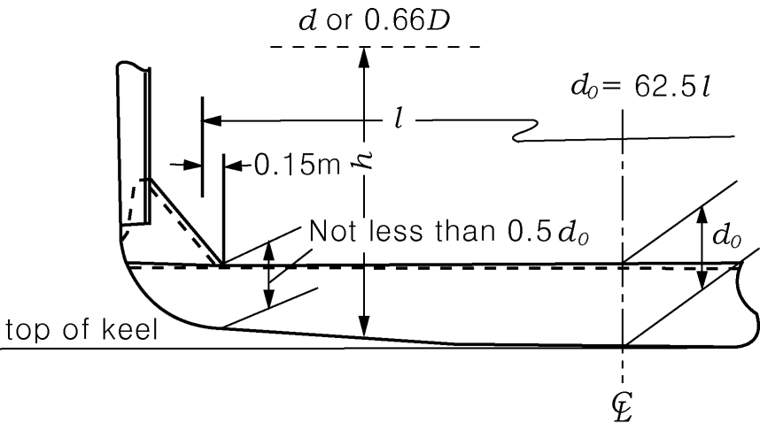

# Rules/Guidance for the Classification of Steel Barges

> OTHER RULES AND GUIDANCE / RB-03-E / 2025 / EN / Rules

## CHAPTER 7 SINGLE BOTTOMS

### Section 1 General

#### 101. Application

- **1.** The requirements in this chapter are framed for barges less than 90 m in length. The construction and scantlings of single bottoms in barges of greater length are to be in accordance with the discretion of the Society.
- **2.** Notwithstanding the requirements in this chapter, the construction and scantlings of single bottoms in Pontoon Barges are to be in accordance with the requirements in **Ch 21.**

### Section 2 Centre Keelsons

#### 201. Arrangements and construction

All single bottom barges are to have centre keelson composed of web plates and face plates and the centre keelsons are to extend as far forward and afterward as practicable.

#### 202. Web plates

- **1.** The thickness of web plates is not to be less than obtained from the following formula. Beyond the midship part, the thickness may be gradually reduced and it may be 0.85 times the midship value at the ends of the barge.
  $t = 0.065L+4.2$(mm)
- **2.** The height of web plates is not to be less than that off floors.

#### 203. Face plates

- **1.** The thickness of face plates is not to be less than that of web p1ate amidships and the face plates are to extend from the collision bulkhead to the after peak bulkhead.
- **2.** The sectional area of face plates is not to be less than obtained from the following formula. Beyond the midship part, the sectional area may be gradually reduced and it may be 0.85 times the midship value at the ends of the barge.
  $A = 0.6 L + 9$(cm^2)
- **3.** The breadth of face plates 1s not to be less than obtained from the following formula :
  $b = 2.3 L + 160$(mm)
- **4.** Where the pillars are provided above the face plates, the sectional area of face plates is to be increased or the face plates are to be suitably strengthened by other means.

### Section 3 Side Keelsons

#### 301. Arrangements

Side keelsons are to be so arranged that their spacing is not more than 2.5 m between the centre keelsons and the side shell plating.

#### 302. Construction

Side keelsons are to be composed of continuous web plates and face plates, and they are to extend as far forward and afterward as practicable.

#### 303. Web plates

The thickness of web plates is not to be less than obtained from the following formula for the midship part. But the thickness is not to be more than that specified in **202. 1.** Beyond the midship part, the thickness may be gradually reduced and it may be 0.85 times the midship value at the ends of the barge.
$t = 0.042 L + 4.8$(mm)

#### 304. Face plates

The thickness of face plates is not to be less than that required for the web plates, and the sectional area ($A$) of face plates amidships is not to be less than obtained from the following formula. Beyond the midship part, the sectional area may be gradually reduced and it may be 0.85 times the midship value at the ends of the barge.
$A = 0.45 L + 8.8$(cm^2)

### Section 4 Floor Plates

#### 401. Arrangements

- **1.** In barge with the bottom of transverse framing, the standard spacing of floors is to comply with the requirements in **Ch 9, 201.**
- **2.** In barges with the bottom of longitudinal framing, the floors are to be so arranged that their spacing is not more than a bout 3.5 m*.*

#### 402. Shapes

- **1.** Upper edges of floor plates at any part are not to be below the level of upper edge at the centre line.
- **2.** In the midship part, the depth of floors at the toe of frame brackets is to be not less than 0.5 times $d _{0}$ specified in **403. 1.** (See **Fig 7.1**)
- **3.** Face plates provided on the floor plates are to be continuous from the upper part of bilge at one side to the upper part of bilge at the opposite side in case of curved floors, and extending over the floor plate in case of floors connected by frame brackets.
  
  Fig 7.1. Shape of floors

#### 403. Scantlings

- **1.** The scantlings of floor plates are not to be less than obtained from the formula given in **Table** **7.1.**
- **2.** The thickness of face plates on the floor plates is not to be less than that required for the floor plates, and the breadth of face plates is to be adequate for lateral stability of the floors.
- **3.** Beyond 0.5$L$ amidships, the thickness of floor plates may be gradually reduced and at the end parts of the ship it may be 0.85 times the value specified in **Par** **1,** except for the forward flat bottom.

#### 404. Frame brackets

The scantlings of frame brackets are to be determined in accordance with the requirements of the following. The free edge of the bracket is to be flanged.

- **1.** The height of the bracket measured from the top of keel is not to be less than twice the required depth of the floor plate at the centreline of the barge. (See **Fig 7.1**)
- **2.** The arm of the bracket measured along the upper edge of the floor plate from the inner edge of frame is not to be less than the depth of the floor plate required at the centreline of the barge. (See **Fig 7.1**)
- **3.** The thickness of frame bracket is not to be less than that of floor plates. (See **Fig 7.1**)

#### 405. Drainage holes

Drainage holes are to be provided on floor plates on both sides of the centreline and for barges with flatbottom also at the low parts of the turn of bilge.

#### 406. Lightening holes

Lightening holes may be provided on floor plates. Where the holes are provided, appropriate strength compensation is to be made by increasing the floor depth or by some other suitable means.

#### 407. Floor plates forming part of bulkheads

Floor plates forming part of bulkheads are to be in accordance with the requirements in **Ch 14** and **15.**

| Items | Scantlings |
| --- | --- |
| (1) Depth at the centre line (2) Thickness (3) Section modulus | $d _{0} = 62.5 l$(mm) $t ^{(1)} = 0.01 d _{0} + 2.5$(mm) $Z = 4.27 Shl ^{2}$(cm^3) |
| $S$ : Spacing of floor (m) $h$ : $d$ or 0.66 $D$, Whichever is the greater (m) $l$ : Span between the toes of frame brackets measured at a midship plus 0.3 m*.* Where curved floors are provided, the length $l$ may be suitably modified. (See **Fig 7.1**) |   |
| NOTE: (1) The thickness of floor plates need not exceed 12 mm |   |

### Section 5 Longitudinals

#### 501. Spacing

The standard spacing of bottom longitudinals is obtained from the following formula:
$S = 2 L + 550$(mm)

#### 502. Scantlings

The section modulus of bottom longitudinals is not to be less than obtained from the following formula:
$Z _{b} = 9 Shl ^{2}$(cm^3)
where:
$l$ = Spacing of solid floors (m)
$S$ = Spacing of bottom longitudinals (m)
$h$ = Vertical distance from the longitudinals to a point of $d + 0.026 L$ above the top of keel (m)

### Section 6 Strengthened Bottom Forward

#### 601. Application

Strengthening of the forward bottom is to be in accordance with the requirements in **Ch 8, Sec 9.**

