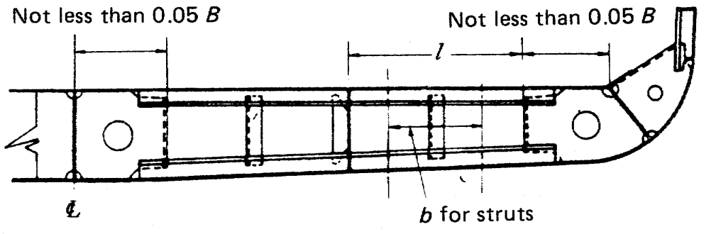

# Rules/Guidance for the Classification of Steel Barges

> OTHER RULES AND GUIDANCE / RB-03-E / 2025 / EN / Rules

## CHAPTER 8 DOUBLE BOTTOMS

### Section 1 General

#### 101. Application

- **1.** Barges of 90 m and above in length are to be provided with double bottoms. However, they may be provided with single bottoms subject to the approval by the Society.
- **2.** The requirements in this chapter may be suitably modified, where partial double bottoms are provided and where longitudinal bulkheads are made to reduce the unsupported breadth of double bottoms.
- **3.** Where the longitudinal system of framing is transformed into the transverse system, or depth of double bottom changes suddenly, special care is to be taken for the continuity of strength by means of additional intercostal girders or floors.
- **4.** Bottom structure of holds intended to carry heavy cargoes is to be subjected to special consideration.

#### 102. Manholes and lightening holes

- **1.** Manholes and lightening holes are to be provided in all non-watertight members to ensure accessibility and ventilation, except in way of widely spaced pillars and where such openings are not permitted by this rule.
- **2.** The number of manholes in tank tops is to be kept to the minimum compatible with securing free ventilation and ready access to all parts of the double bottom. Care is to be taken for locating the manholes to avoid the possibility of inter connection of main subdivision compartments through the double bottom so far as practicable.
- **3.** Covers of manholes specified in **Par 2** are to be of steel, and where no ceiling is provided in the cargo holds, the covers and their fittings are to be effectively protected against damages by cargoes.
- **4.** Air and drainage holes are to be provided in all non-watertight members of the double bottom structures. The proposed locations and sizes of manholes and lightening holes are to be indicated in the plans submitted for approval.
- **5.** The proposed location and size of manholes and lightening holes are to be indicated in the plans submitted for approval.

#### 103. Drainage

- **1.** Efficient arrangements are to be provided for draining water on the tank top.
- **2.** Where wells are provided for the foregoing purpose, such wells are not to extend for more than one-half depth of the double bottom nor less than 457 mm from the bottom shell, as far as practicable.

#### 104. Watertight girders

The thickness of watertight girders and floors, and the scantlings of stiffeners attached to them are to comply with the relevant requirements for girders and floors, as well as the requirements in **Ch 14, 202.** and **203.**

#### 105. Minimum thickness

No member of the double bottom structure is to be less than 6 mm in thickness.

### Section 2 Centre Girders

#### 201. Arrangement and construction

- **1.** Centre girder is to extend as far forward and afterward as practicable.
- **2.** Where double bottoms having non-watertight centre girder are used for carriage of fuel oil, fresh water or water ballast, the breadth of the compartments is to be less than 0.5$B$. However, the requirement may be suitably modified, in narrow tanks at the end parts of the barge or where deemed appropriate by the Society.

#### 202. Manholes

- **1.** Manholes may be provided on centre girders in every frame space outside 0.75$L$ amidships.
- **2.** Manholes may be provided on centre girders in alternate frame spaces for 0.75$L$ amidships in barges under 90 m in length, provided that the depth of holes does not exceed one-third the depth of centre girder.
- **3.** Where manholes are cut in the centre girder plates for 0.75$L$ amidships in barges 90 m in length and above, the girder plates are to be compensated.

#### 203. Depth of centre girder

The depth of centre girder is not to be less $B/16$ unless specially approved by the Society, but in no case is it to be less than 700 mm*.*

#### 204. Thickness of centre girder plate

The thickness of centre girder plate is not to be less than obtained from the following formula:
$t = 0.05 L + 5$(mm)

#### 205. Brackets

- **1.** Where longitudinal framing system is adopted in the double bottom, brackets are to be transversely provided between the solid floors with a spacing not more than 1.75 m connecting the centre girder to the bottom shell plating as well as the adjacent bottom longitudinals, and additional stiffeners are to be provided for the centre girder as may be required.
- **2.** The thickness of the brackets specified in **Par 1** is not to be less than obtained from the following formula. However, it needs not be greater than that of the solid floors at the same location.
  $t = 0.6 \sqrt {L} + 1.5$(mm)
- **3.** The thickness of stiffeners specified in **Par 1** is not to be less than that of a flat bar having the same thickness as that of girder plates and having the depth not less than 0.08$d _{0}$, where $d _{0}$ is the depth of centre girder (mm).

### Section 3 Side Girders

#### 301. Arrangement

- **1.** Side girders in 0.5$L$ amidships are to be so arranged that the distance from the centre girder to the first side girder, between girders or from the outermost girder to the Side shell plating does not exceed approximately 4.6 m*.*
- **2.** In the strengthened bottom forward and beyond that of barges, side girders and half-height girders are to be provided as required in **902.**

#### 302. Thickness of side girders

The thickness of side girder plates is not to be less than obtained from the following formula:
$t = 0.65 \sqrt {L} + 1.5$(mm)

#### 303. Thickness of half-height girders

The thickness of half-height girders is not to be less than obtained from the formula specified in **302.**

#### 304. Scantlings of vertical stiffeners and struts

- **1.** Vertical stiffeners are to be provided on side girders at every open floor, or at a suitable distance if the double bottom is framed longitudinally, and vertical struts are to be provided on half-height girders at every open floor.
- **2.** The thickness of vertical stiffeners required by **Par** **1** is not to be less than that of a flat bar having the same thickness as that of the girder plates and having the depth not less than 0.08$d _{0}$ (m), where $d _{0}$ is height of side girder (m).
- **3.** The sectional area of vertical struts required by **Par** **1** is not to be less than obtained from the formula in **503.** with necessary modifications.

#### 305. Lightening holes

Within 10 *%* of the length of a hold from its end bulk-heads, the diameter of lightening holes in the side girders is not to exceed one-third the depth of girders, this requirement may, however, be modified in a short hold and outside 0.75$L$ amidships and where suitable compensation is made to the girder plate.

### Section 4 Solid Floors

#### 401. Arrangement

- **1.** Solid floors are to be provided at a spacing not exceed-ing about 3.5 m*.*
- **2.** In addition to complying with the requirements in **Par** **1,** solid floors are to be provided at the following locations:
  - **(1)** Under transverse bulkheads.
  - **(2)** At the location specified in **902.,** between the collision bulkhead and the after end of the strengthened bottom forward.
- **3.** Watertight floors are to be so arranged that the sub-division of the double bottom generally corresponds to that of the barge.

#### 402. Thickness of solid floors

The thickness of solid floors is not to be less than obtained from the following formula:
Transverse framing: $t = 0.6 \sqrt {L} + 1.5$(mm)
Longitudinal framing: $t = 0.7 \sqrt {L} + 1.5$(mm)

#### 403. Vertical stiffeners

- **1.** Vertical stiffeners are to be provided on the solid floors at a suitable spacing in case of the double bottom framed transversely, and at every longitudinal in case of the double bottom framed longitudinally.
- **2.** The vertical stiffeners prescribed in **Par** **1** is to be aflat bar having the same thickness as that of the floor plate and the depth not less than 0.08 $d _{0}$ or the equivalent, where $d _{0}$ is the depth of the floor at the point under consideration (mm).

#### 404. Lightening holes

Within 0.l$B$ from side shell plating, the diameter of lightening holes provided in the solid floors in the middle half length of a hold is not to exceed about one-fifth the depth of floors. This requirement may, however, be suitably modified at the end parts of barge and in exceptionally short holds and where the solid floors are suitably compensated for.

### Section 5 Longitudinals

#### 501. Spacing

The standard spacing of longitudinals is obtained from the following formula:
$S = 2 L + 550$(mm)

#### 502. Scantlings

- **1.** The section modulus of bottom longitudinals is not to be less than obtained from the following formula, but in no case is it to be less than 30 cm^3.
  $Z _{b} = CShl ^{2}$(cm^3)
  where:
  $l$ = Spacing of solid floors (m)
  $S$ = Spacing of longitudinals (m)
  $h$ = Vertical distance from the longitudinals to a point of $d + 0.026 L$ above the top of keel (m)
  $C$ = Coefficient given in **Table** **8.1.**

  | Case |   | $C$ |
  | --- | --- | --- |
  | In case where no strut specified in **503**. is provided midway between floors |   | 8.6 |
  | In case where a strut specified in **503.** is provided midway between floors. | Lower part of deep tanks | 6.2 |
  | In case where a strut specified in **503.** is provided midway between floors. | Elsewhere | 4.1 |
- **2.** The section modules of inner bottom longitudinals is not to be less than obtained from the formula **Par 1** with $C$ equal to 0.85 times the value specified for bottom longitudinals in the same location. Where vertical struts are not provided to the longitudinals under deep tanks, the section modules of inner bottom longitudinals is to be as specified in **Ch** **15,** **202.**

#### 503. Vertical struts

- **1.** Where the spacing of solid floors exceeds 2.5 m*,* a strut is to be provided between floor plates. This strut is to be a rolled section other than a f1at bar or a bulb plate and to be sufficiently overlapped with the webs of bottom and inner bottom longitudinals.
- **2.** The sectional area of vertical struts is not to be less than obtained from the following formula:
  $A = 2.2 Sbh$(cm^2)
  where:
  $S$ = Spacing of longitudinals (m)
  $b$ = Breadth of the area supported by the strut (m). (See **Fig 8.1**)
  $h$ = As specified in **502.** **1.**
  
  Fig 8.1. Open floor

### Section 6 Inner Bottom Plating and Margin Plates

#### 601. Thickness of inner bottom plating

The thickness of inner bottom plating is not to be less than obtained from the following formula:
$t = 3.8 S \sqrt {d} + 1.5$(mm)
where:
$S$ = Spacing of inner bottom longitudinals for longitudinally framed inner bottom plating, or spacing of floor plates for transversely frame dinner bottom plating (m)

#### 602. Barge handling cargoes regularly by mechanical appliances such as grabs

In barges which regularly handle cargoes by grabs or similar mechanical appliances, the thickness of inner bottom plating is to be increased by 2.5 mm above that specified in **601.,** unless ceiling is provided.

#### 603. Arrangements of margin plates

It is recommended that the margin plates are to be of sufficient height to protect the bottom up to the turn of bilge and for forward 0.2$L$ from the stem the margin plates are to extend to the barge's sides horizontally as far as practicable.

#### 604. Thickness of margin plates

The thickness of margin plates is to be increased by 1.5 mm above that obtained from the formula in **601.**

#### 605. Breadth of margin plates

Margin plates are to be of adequate breadth and to extend well inside from the line of toes of frame end brackets.

#### 606. Brackets

- **1.** Where the double bottom is framed longitudinally, brackets are to be transversely provided at every hold frame extending from the margin plate to the adjacent bottom and inner bottom longitudinals.
- **2.** The thickness of brackets specified in **Par** **1** is not to be less than obtained from the formula in **205.** **2.**

### Section 7 Frame End Brackets

#### 701. Frame end brackets

- **1.** The thickness of brackets connecting hold frames to margin plates is to be increased by 1.5 mm above that obtained from the formula in **205.** **2.**
- **2.** The free edges of brackets are to be stiffened.

### Section 8 Open Floors

#### 801. Arrangements

Where the double bottom is framed transversely, open floors are to be provided at every hold frame between solid floors in accordance with the requirements in this section.

#### 802. Scantlings of frames and reverse frames

- **1.** The section modulus of frames is not to be less than obtained from the following formula, but in no case is it to be less than 30 cm^3.
  $Z _{b} = CShl ^{2}$(cm^3)
  where:
  $l$ = Distance between the brackets attached to the centre girder and the margin p1ate (m). Where side girders are provided, $l$ is the greatest distance between the vertical stiffeners on side girders and the brackets. (See **Fig 8.1**).
  $S$ = Spacing of frames (m).
  $h$ = As obtained from the following formula (m).
  $h = d + 0.026 L$(m)
  $C$ = As specified in **Table** **8.2.**

  | Case |   | $C$ |
  | --- | --- | --- |
  | In case where no vertical strut specified in **803.** is provided |   | 6.0 |
  | In case where vertical struts specified in **803.** are provided | Under deep tanks | 4.4 |
  | In case where vertical struts specified in **803.** are provided | Elsewhere | 2.9 |
- **2.** The section modulus of reverse frames is not to be less than obtained from the formula in **Par** **1** with $C$ equal to 0.85 times the value specified for frames at the same location. Where no vertical strut is provided to the open floors under deep tanks, the scantling of reverse frames is not to be less than required in **Ch** **15,** **202.** taking the frames as the stiffener of deep tank bulkhead.

#### 803. Vertical struts

- **1.** Vertical struts prescribed in **802.** are to be rolled sections other than flat bars and bulb plates and to be well overlapped with the webs of frames and reverse frames.
- **2.** The sectional area of vertical struts is not to be less than that specified in **503.** with necessary modifications.

#### 804. Brackets

- **1.** Frames and reverse frames are to be connected to the centre girder and margin plates by brackets of not less thickness than obtained from the formula in **205.** **2.**
- **2.** The breadth of brackets specified in **Par** **1** is not to be less than 0.05$B$ and the brackets are to be well over-lapped with frames and reverse frames. The free edges of brackets are to be properly stiffened.

### Section 9 Construction of Strengthened Bottom Forward

#### 901. Application

The requirements in this section are to be applied to barges having the bow draught less than 0.037$L$ at the ballast condition.

#### 902. Construction

- **1.** Between the collision bulkhead and 0.2$L$ abaft the fore end, side girders or half-height girders are to be provided in accordance with the requirements in **Table** **8.3.** Where transverse framing is adopted, however, the half-height girders may be provided between the collision bulkhead and 0.175$L$ abaft the fore end.

  |   |   | Side girders | Half-height girders or longitudinals shell stiffeners | Solid floors |
  | --- | --- | --- | --- | --- |
  | Transverse framing | Transverse framing | To be provided at interval within 2.5 m | To be provided between side girders | To be provided at every frame |
  | Transverse framing | Longitudinal framing | To be provided at interval within 2.5 m | To be provided between side girders | To be provided at intervals within 2.5 m |
  |   | Transverse framing | To be provided at interval within 2.5 m | - | To be provided at alternate frames |
  |   | Longitudinal framing | To be provided at interval within 2.5 m | - | To be provided at intervals within 2.5 m |
- **2.** Between the collision bulkhead and 0.15$L$ abaft the fore end, solid floors are to be provided in accordance with the requirements in **Table** **8.3.**
- **3.** In barges having the bow draught more than 0.025$L$ and less than 0.037$L$ at the ballast condition, of which structural arrangement of strengthened bottom forward is difficult to comply with the requirements, floor plates and side girders are to be reinforced properly. However, for barges of which speed is specially small compared with $L$ at the towed or pushed condition, this requirements may be suitably modified. 
