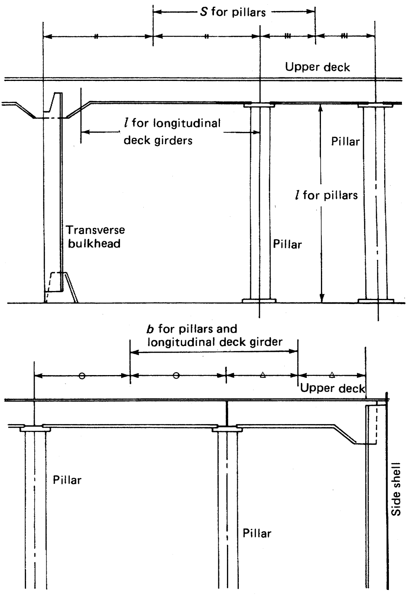

# Rules/Guidance for the Classification of Steel Barges

> OTHER RULES AND GUIDANCE / RB-03-E / 2025 / EN / Rules

## CHAPTER 12 PILLARS AND TRUSSES

### Section 1 General

#### 101. Arrangement

Pillars and trusses are to be provided in line with girders in single bottom or double bottom or as close thereto as practicable. And the structures under pillars and trusses are to be of sufficient strength to distribute the load effectively.

#### 102. End connection of pillars

The head and heel of pillars and trusses which may be subjected to tensile loads such as pillars and trusses supporting bulkhead recesses or deep tank tops are to be efficiently connected to withstand the tensile loads.

### Section 2 Scantling of Pillars

#### 201. Sectional area of pillars

The sectional area of pillars is not to be less than obtained from the following formula:
$A = \frac{0.223W}{2.72- \frac{l}{k}}$(cm^2)
where:
= Length of the pillars (m)
$k$ = Minimum radius of gyration of pillar, obtained from the following formula (cm)
$k = \sqrt {\frac{I}{A}}$
where:
$I$ = The least moment of inertia of the pillar (cm^4)
$A$ = Sectional area of the pillar (cm^2)
$W$ = Deck load (kN) supported by pillars as obtained from the following formula:
$W = Sbh$(kN)
where:
$S$ = Distance between the mid-points of two adjacent spans of girders supported by the pillars or the bulkhead stiffeners or bulkhead girders (m) (See **Fig. 12.1**).
$b$ = Mean distance between the midpoints of two adjacent spans of beams supported by the pillars or the frames (m) (See **Fig. 12.1**).
= Deck load specified in **Ch** **10,** **Sec** **2** for the deck supported (kN/m^2)

Fig 12.1 The way of measuring #eqnID-263*,* #eqnID-264 and for pillars, transverse and longitudinal girders.

#### 202. Thickness

- **1.** The plate thickness of tubular pillars is not to be less than obtained from the following formula. This requirement may, however, be suitably modified for the pillars provided in accommodation spaces.
  $t = 0.022 d _{p} + 3.6$(mm)
  where :
  $d _{p}$ = Outside diameter of the tubular pillar (mm)
- **2.** The thickness of web and flange plate of built-up pillars is to be sufficient for the prevention of local buckling.

#### 203. Outside diameters of round pillars

The outside diameter of solid round pillars and tubular pillars is not to be less than 50 mm*.*

#### 204. Pillars provided in deep tanks

- **1.** Pillars provided in deep tanks are not to be of tubular pillars.
- **2.** The sectional area of pi1lars is not to be less than specified in **201.** or obtained from the following formula, whichever is the greater.
  $A = 1.09 Sbh$(cm^2)
  where:
  $S$*,* $b$ = As specified in **201.**
  = 0.7 times the vertical distance from the top of deep tanks to the point of 2 m above the top of overflow pipe (m)

### Section 3 Trusses

#### 301. Scantling

The scantlings of pillars in the truss structure are to be in accordance with the requirements in **201.**

#### 302. Diagonals

- **1.** Diagonals in trusses are to be arranged so as to have angle of inclination of about 45 deg.
- **2.** The sectional area of diagonals is not to be less than 0.5 times the value specified in **201.** 
