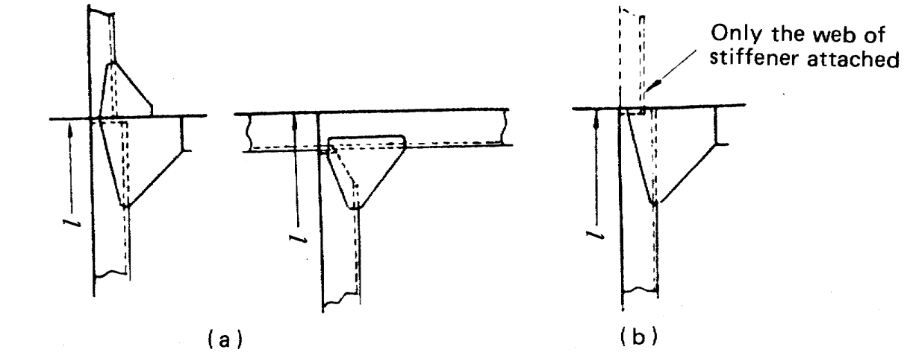

# Rules/Guidance for the Classification of Steel Barges

> OTHER RULES AND GUIDANCE / RB-03-E / 2025 / EN / Rules

## CHAPTER 14 WATERTIGHT BULKHEADS

### Section 1 Arrangement

#### 101. Collision bulkheads 【See Guidance】

The barges are to have a collision bulkhead located between 0.05$L_f$ and 0.08$L_f$ from the fore side of length of freeboard ($L_f$). However, in barges of 90 m and under in length, the maximum distance from the fore side of $L_f$ may be 0.13$L_f$. *(2022)*

#### 102. After peak bulkheads

The barges are to have an after peak bulkhead situated at a suitable position.

#### 103. Hold bulkheads

The barges are to have hold bulkheads so as to make the spacing of adjacent bulkheads to be under 30 m as possible, in addition to the bulkheads specified in **101.** and **102.**

#### 104. Height of watertight bulkheads

The watertight bulkheads required in **101.** to **103.** are to extend to the freeboard deck with the following exceptions:

#### 105. Chain lockers

Chain lockers are to be in accordance with the requirements in **Pt 3, Ch 14 207.** of the **Rules**.

### Section 2 Construction

#### 201. Thickness

The thickness of bulkhead plating is not to be less than obtained from the following formula:
$t = 3.2 S \sqrt {h} + 1.5$(m)
where:
$S$ = Spacing of stiffeners (m)
$h$ = Vertical distance measured from the lower edge of the plates to the bulkhead deck at the centre line of barge (m), but in no case is it to be less than 3.4 m*.*

#### 202. Increase of thickness

- **1.** The thickness of the lowest strake of bulkhead plating is to be at least l mm thicker than obtained from the formula in **201.**
- **2.** The lowest strake of bulkhead plating is to extend at least about 600 mm above the top of inner bottom plating in way of double bottom or about 900 mm above the top of keel in way of single bottom. Where the double bottom is provided only on one side of the bulkhead, the extension of the lowest strake is to be effected up to either height according to the preceding sentence, whichever is the greater.
- **3.** The bulkhead plating in bilge well is to be at least 2.5 mm thicker than given in **201.**
- **4.** The thickness of deck plating in way of bulkhead recesses is to be at least 1 mm greater than that given by **201.,** regarding the deck plating as bulkhead plating and the beams as stiffeners respectively. In no case is the thickness to be less than the required for deck plating in the location.

#### 203. Stiffeners

The section modulus of bulkhead stiffeners is not to be less than obtained from the following formula:
$Z = CShl ^{2}$(cm^3)
where:
$C$ = Coefficients given in **Table** **14.1** according to the type of end connection
$S$ = Spacing of stiffeners (m)
= Vertical distance measured from the mid-point of for vertical stiffeners, and from the midpoint of the distance between the adjacent stiffeners for horizontal stiffeners, to the top of bulkhead deck at the centre line of barge (m). Where the vertical distance is less than 6.0 m*,* is to be taken as 0.8 times the vertical distance plus 1.2 m
= Span measured between the adjacent supports of stiffeners including the length of connection (m). Where girders are provided, is the distance from the heel of end connection to the first girder or the distance between the girders.

#### 204. Collision bulkheads

For collision bulkheads, the plate thickness and section modulus of stiffeners are not to be less than those specified in **201.** and **203.** taking as 1.25 times the specified height.

#### 205. Girders supporting bulkhead stiffeners

- **1.** The section modules of girders not to be less than obtained from the following formula:
  $Z = 4.75 Shl ^{2}$(cm^3)
  where:
  $S$ = Breadth of the area supported by the girder (m)
  = Vertical distance measured from the mid-point of for vertical girders, and from the mid-point of *S* for horizontal girders, to the top of upper deck at the centre line of barge (m). Where the vertical distance is less than 6.0 m*,* is to be taken as 0.8 times the vertical distances plus 1.2 m*.*
  = Span between the supports of girders (m)
- **2.** The moment of inertia of girders is not to be less than that obtained from the following formula. In no case is the depth of girders to be less than 2.5 times the depth of slots for stiffeners.
  $I = 10 hl ^{4}$(cm^4)
  where:
  *,* = As specified in **Par** **1.**
- **3.** The thickness of web plates is not to be less than obtained from the following formula:
  $t = 0.01 S _{1} + 1.5$(mm)
  where:
  $S _{1}$ = Spacing of web stiffeners or depth of girders, whichever is the smaller (mm)

  | Vertical Stiffener | Upper end Lower end | Lug-connection, supported by girders or hard connection | Soft connection | End of stiffener unattached |
  | --- | --- | --- | --- | --- |
  | Vertical Stiffener | Lug-connection or supported by girders | 2.80 | 3.22 | 3.78 |
  | Vertical Stiffener | Bracketed | 2.24 | 2.52 | 2.80 |
  | Vertical Stiffener | Only the web of stiffener attached at end | 3.22 | 3.78 | 4.48 |
  | Vertical Stiffener | End of stiffener unattached | 3.78 | 4.48 | 5.60 |
  | Horizontal Stiffener | One end The other end | Lug-connection, supported by girders or Hard connection |   | End of stiffener unattached |
  | Horizontal Stiffener | Lug-connection bracketed or supported by brackets | 2.80 |   | 3.78 |
  | Horizontal Stiffener | End of stiffener unattached | 3.78 |   | 5.60 |
  | NOTES: 1. "Lug-connection" is such a connection as both web and face bar of stiffener are effectively attached to the bulkhead plating, decks or inner bottoms which are strengthened by effective supporting members on the opposite side of plating. 2. "Hard connection" of vertical stiffeners is a connection by bracket to the longitudinal members or to the adjacent members, in line with the stiffeners, of the same or larger section. (See **Fig 14.1** (a)). 3. "Soft connection" of vertical stiffeners is a connection by bracket to the transverse members such as beams, or other connections equivalent to the connections mentioned above. (See **Fig 14.1** (b)).  Fig 14.1 Types of end connection **Fig 14.1 Types of end connection** |   |   |   |   |
- **4.** Tripping brackets are to be provided at an interval of about 3 m, and these brackets are to be so arranged as to support the face plates. 
