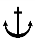

# Rules/Guidance for the Classification of Steel Barges

> OTHER RULES AND GUIDANCE / RB-03-E / 2025 / EN / Rules

## CHAPTER 18 BULWARKS, FREEING PORTS, VENTILATORS AND PERMANENT GANGWAYS

### Section 1 General

#### 101. Application

- **1.** The requirements of this chapter are to apply to the barges specified in **Ch 17, 101. 1.**
- **2.** The barges specified in **Ch 17, 101. 2** are to be in accordance with the requirements in **Pt 4, Ch** **4** of the **Rules**.

### Section 2 Bulwarks and Guardrails

#### 201. General 【See Guidance】

Efficient guardrails or bulwarks are to be provided on all exposed parts of the freeboard and superstructure deck and the top of similar deckhouses.

#### 202. Dimensions

The height of bulwarks or guardrails specified in **201.** is to be at least 1 m from the upper surface of deck. However, a less height than this may be accepted where this height would interfere with the normal operation of the barge, provided that other adequate protection means are provided to the satisfaction of the Society.

#### 203. Construction of bulwarks

- **1.** The bulwarks are to be strongly constructed and effectively stiffened on their upper edge.
- **2.** The thickness of bulwarks on the freeboard decks is not to be less than 6 mm.
- **3.** Bulwarks are to be supported by strong stays attached to deck in way of the beams and spaced not more than 1.8 m apart on freeboard deck.
- **4.** Bulwarks on the decks which are designed to carry timber deck cargoes are to be supported by specially strong stays spaced not more than 1.5 m apart.

### Section 3 Freeing Ports

#### 301. Freeing arrangements 【See Guidance】

On the weather parts of freeboard or superstructure deck, freeing arrangements are to be provided with in accordance with the requirements in **Pt 4, Ch 4** of the **Rules**.

### Section 4 Ventilators

#### 401. Height of ventilator coamings

The height of ventilator coamings above the upper surface of the deck is not to be less than given in the following **Table 18.1** corresponding $L$ and the position specified in **Ch 17, 103.** However, a lower height may be accepted where the barge has an specially large freeboard or where the ventilator serves the spaces within unenclosed superstructures.

#### 402. Thickness of coamings

The thickness of ventilator coamings is to be in accordance with the discretion of the Society.

| $L$ Position | $L$ ≥ 30 m | $L$〈 30 m |
| --- | --- | --- |
| I | 900 | 760 |
| II | 760 | 450 |

### Section 5 Permanent Gangways

#### 501. General

Satisfactory means are to be provided on the weather decks for the protection of the crew in getting to and from their quarters and other parts. 
