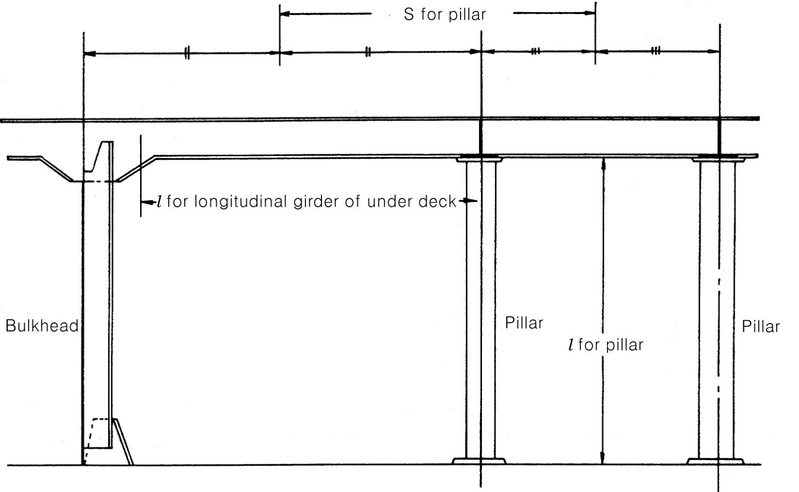
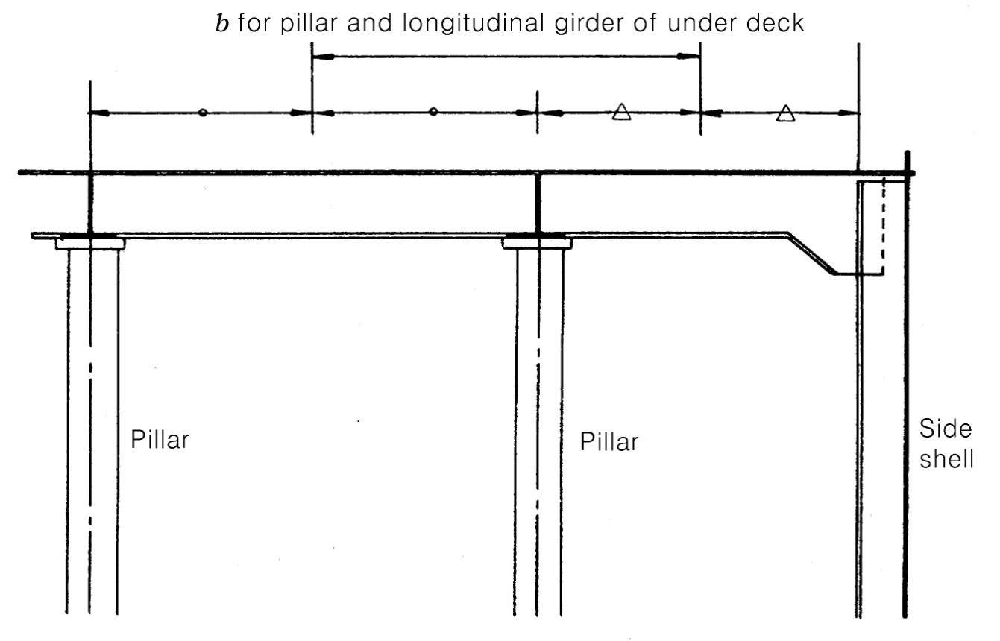

# Rules for the Classification of Dredgers

> OTHER RULES AND GUIDANCE / RB-04-E / 2025 / EN / Rules

## CHAPTER 6 PILLARS AND TRUSSES

### Section 1 General

#### 101. Arrangement

- **1.** The pillars and trusses are to be provided in line with the keelson or double bottom girders or as close as practicable, and the structure under the pillars is to be of sufficient strength to distribute the load effectively.
- **2.** Where the pillars and trusses which are subjected to tensile loads such as under bulkhead recesses or top of deep tank, the pillars and trusses are to be efficiently secured to withstand the tensile loads.

### Section 2 Scantling of Pillars

#### 201. Sectional area of pillars

The sectional area of pillars is not to be less than that obtained from the following formula.
$\frac{0.223 w}{2.72- \frac{l}{k}}$ ($\mathrm{cm} ^{2}$)
$l$ : length of pillar ($\mathrm{m}$)
$k$ : Minimum radius of gyration of pillar, obtained from the following formula (cm)
$k= \sqrt {\frac{I}{A}}$
$I$ : minimum moment of inertia of pillar ($\mathrm{cm} ^{4}$)
$A$ : sectional area of pillar ($\mathrm{cm} ^{2}$)
$w$ : deck load supported by pillar specified in **202.** ($kN/m ^{2}$)

#### 202. Load supported by pillar

Load($w$) supported by pillar is not less than that obtained the following formula.
$Sbh$ ($kN$)
$S$ : distance between the midpoints of two adjacent span of girders supported by the pillars or the bulkhead stiffeners or bulkhead girders ($\mathrm{m}$) (see **Fig 6.1**)
$b$ : distance between the midpoints of two adjacent span of girders supported by the pillars or inner side of brackets ($\mathrm{m}$) (see **Fig 6.1**)
$h$ : deck load specified in **Ch 4, 202.** for the deck supported ($kN/m ^{2}$)

#### 203. Thickness of pillars

- **1.** The thickness of tubular pillar is not to be less than that obtained from the following formula. However, this requirement may be suitably modified for the pillars provided in accommodation spaces.
  0.022 $dp$ + 3.6 ($\mathrm{mm}$)
  $dp$ : outside diameter of tubular pillar ($\mathrm{mm}$)
- **2.** The thickness of web and flange plates of built-up pillars is to be of sufficient for the prevention of local buckling.

#### 204. Outside diameter of tubular pillars

The outside diameter of solid round pillars and tubular one is not to be less than 50 $\mathrm{mm}$.

#### 205. Pillars provided in deep tank

- **1.** Pillars provided in deep tank are not to be of tubular one.
- **2.** The sectional area of pillars is not to be less than that specified in **201.** or that obtained from the following formula, whichever is the greater.
  $1.09Sbh$ ($\mathrm{cm} ^{2}$)
  $S$ and $b$ : specified in **202.**
  $h$ : 0.7 times the vertical distance from the top plate of deep tank to the point 2.0 $\mathrm{m}$ above the top of overflow pipe ($\mathrm{m}$)

### Section 3 Trusses

#### 301. Scantling

The scantling of pillars composing trusses is to complying with the requirements of **Sec 2.**

#### 302. Diagonals

- **1.** The angle of diagonal is to be of about 45° the horizontal line.
- **2.** The sectional area of diagonal is not to be less than 50 % of the value obtained from the formula specified in **Ch 8, 301.** 
  
  
  **Fig 6.1 Measurement of** $S$**,** $b$**,** $l$ **for pillar, and longitudinal and transverse girder**
