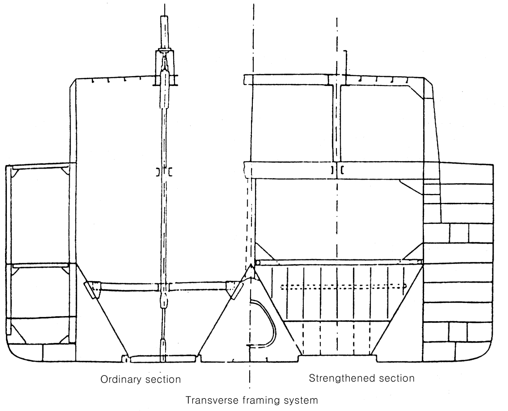
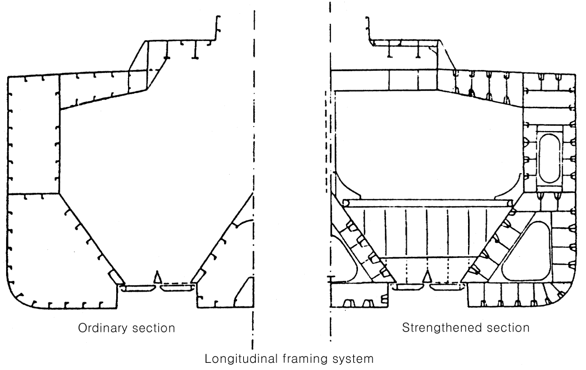
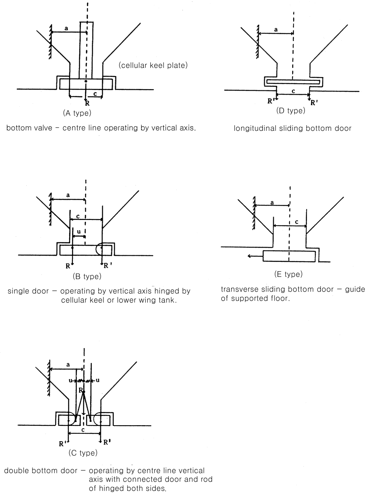

# Rules for the Classification of Dredgers

> OTHER RULES AND GUIDANCE / RB-04-E / 2025 / EN / Rules

## CHAPTER 10 HOPPER TYPE DREDGERS

### Section 1 General

#### 101. Application

- **1.** The requirements of this chapter are to apply to the dredger of which the holds are hopper type.
- **2.** Otherwise specified specially in this Chapter, the requirements of relevant Chapters are to apply to hopper type Dredgers.

### Section 2 Construction and Arrangement

#### 201. Construction

The hopper type structures are to be arranged with transverse or longitudinal framing system as **Fig 10.1** and classified with following types.

- **1.** one or two hopper hold type in midship
- **2.** bucket well type
  
  
  Fig 10.1 Hopper construction

#### 202. Arrangement

- **1.** **1**. The hopper type dredgers, since they have many structural discontinuities, are to be specially considered for the structural continuity.
- **2.** The hopper holds are to be provided with weirs for freeing the water or mud.
- **3.** In case, where the dredger is operating with hopper barges, the fenders are to be provided properly for the protection of shell plating. The places where the fenders are fitted are to be reinforced in accordance with the approval of the society.

#### 203. Discontinuity of transverse members

- **1.** The cellular keel is to be rigidly connected to the transverse ring.
- **2.** The upper parts of cellular keel are to be connected with decks or trunk structures by strong beams or centerline wash bulkhead.
- **3.** The structural continuity of hopper holds including longitudinal bulkhead and cellular keel is to be sufficiently considered.

#### 204. Discontinuity of longitudinal members

- **1.** The end of longitudinal bulkhead is to be extended by large brackets at forward and aftward of hopper holds.
- **2.** The ends of forward and aftward of cellular keel are to be provided with brackets which have the same depth of the keel.
- **3.** The both sides of trunk are to be extended with 1.5 times or more the height of trunk to the ends of hopper hold.
- **4.** Special attention is to be made for the other structural arrangements.

### Section 3 Longitudinal Strength

#### 301. Special consideration

Transverse section with high sheer stress especially the end parts of hopper holds, sheer stresses are to be specially considered.

### Section 4 Shell Plating and Deck

#### 401. Thickness of deck plating and stringer plating

- **1.** The upper deck and stringer platings are to be extended to the longitudinal bulkhead of hopper holds.
- **2.** The thickness of deck platings for storage of heavy dredging equipment is not to be less than that obtained from the following formula. However, exceptions may be considered for the deck platings specially protected.
  0.05 $L$ + 9 ($\mathrm{mm}$)
- **3.** The structural scantlings of horizontal plane of trunk which are used same purpose of deck are to comply with the requirements of decks.

#### 402. Openings in trunk

The cut-outs of trunk or weir are to have sufficient sectional area for the specific gravity of mud.

### Section 5 Transverse Framing System

#### 501. Floors

- **1.** In single bottom structures, the lower parts of hopper holds are to be provided with solid floors at every frame space.
- **2.** The inside of cellular keel is to be provided with transverse ring which have the same scantlings of solid floor at every frame space.
- **3.** The scantlings of large space in double bottom such as pump room are to be determined by approved direct calculation method.

#### 502. Frames

Where the stringers are supported by transverse ring, the section modulus of frames may be reduced. However, the scantlings of stringers are to be determined by approved direct calculation method.

#### 503. Deck beam

The scantlings of deck beams on deck areas for storage of heavy equipment are to be determined by direct calculation method.

### Section 6 Longitudinal Framing System

#### 601. Inner bottom longitudinal

The inner bottom longitudinals in double bottom structure outside hopper hold are to be specially considered.

#### 602. Deck longitudinal

The scantlings of deck longitudinals on deck areas where are subject to the high concentrated loads are to be determined by direct calculation method.

### Section 7 Transverse Ring

#### 701. Arrangement

- **1.** The transverse ring is to be provided on solid floors as strong beams in hopper hold inside or on deck parts.
- **2.** The transverse ring is to be provided in the double hull structures of hopper hold as the reinforcement ring.

#### 702. Deck structure without strong beam

Where, the strong beams are not provided on deck or provided only on trunk parts, the deck beams, sheer strakes and the top of wells are to be specially considered.

### Section 8 Hopper Well Structure

#### 801. General

- **1.** The ends of hopper hold are to be provided with transverse bulkhead in whole breadth or web ring with sufficient strength.
- **2.** It is recommended to provide the wear margin to each platings (wall of hopper hold, weir etc), where these margin might not interfere with dredging works.

#### 802. Bulkhead plating and cellular keel plating

- **1.** The thickness of bulkhead platings and cellular keel platings are not to be less than that obtained from the following formula.
  $4S \sqrt {8h} +1 rm$ $\mathrm{mm}$ (However, $t$ is not less that 10 $\mathrm{mm}$), $1.2 L ^{0.5} rm$ $\mathrm{mm}$
  $h=d+h _{0} +0.1b _{1} +0.03Lp$
  $S$ : spacing of stiffeners ($\mathrm{m}$)
  : distance between the lower edge of bulkhead or cellular keel plate and deck line ($\mathrm{m}$)
  : spacing from the top of weir to deck line ($\mathrm{m}$)
  (when the top of weir is located below deck line, becomes minus(-))
  : distance between longitudinal bulkheads ($\mathrm{m}$)
  $Lp$ : length of hopper hold ($\mathrm{m}$)
- **2.** The thickness of bulkhead platings of bucket well is to be determined with same thickness of shell platings.
- **3.** For the structures and scantlings of coaming, buckling is to be specially considered.

#### 803. Stiffeners

The scantlings of stiffeners of bulkhead and cellular keelson in hopper well are to be increased properly considering the specific gravity of mud.

#### 804. Floors

- **1.** The scantlings of open well with flap are to be determined by direct calculation method approved by this Society.
- **2.** There are generally 5 type of flaps such as **Fig 10.2** and the calculation sheet for the scantlings of flap is to be submitted and approved by this Society.

#### 805. Gusset stays for trunk

The transverse rings are to be provided with gusset stays supported by trunk and both ends of gusset stays are to be fitted rigidly.

#### 806. Girder supporting hydraulic equipment

The girders supporting hydraulic equipment in hopper holds are to have sufficient strength to the force transmitted by hydraulic equipment. 

Fig 10.2 Kind of flap
