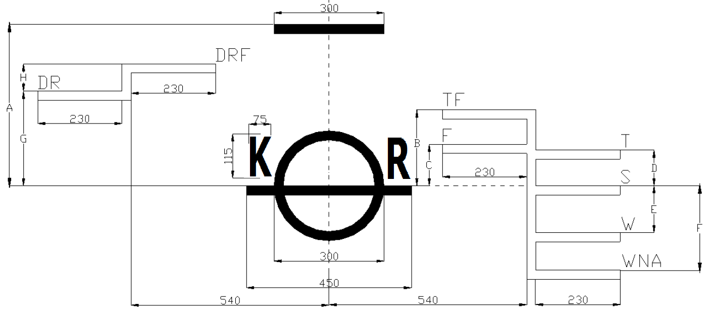

# Rules for the Classification of Dredgers

> OTHER RULES AND GUIDANCE / RB-04-E / 2025 / EN / Rules

## Annex 1 Guidance for the Assignment of Reduced Freeboards for Dredgers

### 1. General

#### (1) Purpose

The purpose of this Guidance is to specify design criteria, construction and survey standards, and operational safety measures for dredgers permitting safe operation at freeboards less than the minimum freeboards prescribed by the ICLL as amended. For dredgers verified to be in compliance with these Guidance, Additional Special Notation "Reduced Freeboard" is to be added.

#### (2) Application

- **(A)** This Guidance apply to dredgers of 500 gross tons (GT) as measured under the 1969 International Tonnage Convention (ITC).
- **(B)** Similar units such as (non self-propelled) hopper barges and stone dumping vessels etc., which are capable of discharging their cargo as required under **7.** (1) of this Guidance, may be treated as dredgers. Application of this Guidance to unmanned or non-self propelled vessels is addressed in section **10.** of this Guidance.
- **(C)** Nevertheless **Pt 4, Ch 2, 104.** of the Guidance, where the ships are in compliance with this Guidance, hatch covers may be dispensed with.
- **(D)** Nevertheless ICLL and Standard for Load Line, where the ships are in compliance with this Guidance, freeboards less than the minimum freeboards prescribed by the Convention and the Standard may be assigned with. In this case, it is subject to the approval by the flag state.

#### (3) Definitions

For the purpose of this Guidance, the following definitions apply:
- A dredger is a self-propelled, manned vessel capable of loading dredgings at sea and fitted with bottom doors or of split type. Similar means for discharging or dumping the dredgings to the sea shall be to the satisfaction of the Society.
- Dredgings are materials consisting of soil, sand, gravel, or rock.
- Cargo means dredgings and entrained water.
- Convention means International Convention on Load Lines, 1966, as modified by the 1988 Protocol relating thereto, as amended.

### 2. Load Line Marks

#### (1) In addition to the load line mark and load lines prescribed by the applicable provisions of the Convention, a dredger load line and dredger fresh water load line, corresponding to the reduced freeboard assigned in accordance with the provisions of this Guidance, shall be permanently marked on both sides of the dredger, extending aft and forward respectively of a vertical line joining the two.

#### (2) The vertical line shall be placed 540 mm aft of the centre of the load line mark. The vertical line and dredger load lines shall be 25 mm in width and the dredger load lines 230 mm in length.

#### (3) The dredger load line is indicated by the upper edge of that line to be marked DR, and the dredger fresh water load line by the upper edge of that line to be marked DRF. The lines should be painted in a colour contrasting with the colour of the hull.

#### (4) The assigned dredger load lines (DRF and DR) refer to the top of the freeboard deck regardless of any possible deck line correction as covered by Regulation 32 of the Convention.

#### (5) Appendix 1 to this Guidance provides a diagram that shows the particulars of the load line marks specified in this section.

### 3. Freeboard

#### (1) The dredger may be assigned a reduced freeboard for loading, carrying or discharging dredgings. The reduced freeboard is the summer freeboard calculated for a type B ship in accordance with Regulation 40 of the Convention, reduced by 2/3 of the resulting summer freeboard to be calculated without Regulation 39 (bow height and reserve buoyancy) of the Convention taken into account.

For calculating the dredger freeboard, the resulting summer freeboard as for a type B vessel without any reduction or addition shall be used.

#### (2) The minimum bow height at the dredger load line is the bow height provided by the Convention, Regulation 39(1), reduced by the reduction as calculated in (1).

The reserve buoyancy as required by Regulation 39.5 of the Convention need not be taken into account for the determination of the dredger freeboards.

#### (3) The minimum dredger freeboard in freshwater of unit density shall be obtained by deducting from the minimum dredger freeboard in salt water:

$\Delta /40 T$ centimetres
$\Delta$ : displacement in salt water in tons at the dredger load waterline
$T$ : tons per centimetre immersion in salt water at the dredger load waterline
For hopper dredgers where the hopper may be temporarily open to sea, the hopper is to be considered as closed for the purpose of calculating the ship's moulded displacement.

### 4. Specific Load Line Provisions

#### (1) No bulwarks shall be fitted along the ships’ sides abreast of any hopper which is an open hopper.

#### (2) A safe access from the fore end to the aft end of the dredger shall be provided for the protection of the crew. The safe access shall comply with the applicable provisions of the Convention, Regulation 25-1.

Where the access is located above the freeboard deck it shall be at least as high above the freeboard deck as the difference between the summer freeboard and the dredger load line freeboard.

#### (3) Means for overflow of process water shall be arranged as follows:

- **(A)** over the spill-out edge of the hopper coaming; or
- **(B)** through overflow ducts or spillways in the hopper walls; or
- **(C)** through adjustable overflows.
  The overflow arrangements prescribed at (B) and (C) shall have an area of at least:
  - $0.7 \left( L _{h} \right) ^{2} /1000 m ^{2}$, where $L _{h}$ is the maximum length of the hopper in metres, or
  - $Q / 3 m ^{2}$, in which $Q$ is the total maximum water capacity of the suction dredge pumps in $m ^{3} / \sec$; whichever is greater.

#### (4) A suitable hopper geometry shall consist of:

- **(A)** the height above the dredger load line of the spill-out edge of the hopper, exceeding at all points the minimum bow height value calculated according to section **3.** (2); or
- **(B)** freeing ports of sufficient area to ensure rapid outflow of sea water, the area of such ports being at least equivalent to the area required by regulation 24(1) of the annex to the Convention when hopper length and height above overflow ducts or spillways are substituted for bulwark length and height above deck; or
- **(C)** closed hopper.
  Subject to suitable hopper geometry, the content of the hopper at the dredger load line may be assumed to be cargo up to the lower edge of the overflow arrangement, and when dredging dense cargoes may be assumed to consist of a layer of seawater on top of the cargo up to the lower edge of the overflow arrangement; where no overflow arrangement is provided the layer of seawater on top of the cargo shall be assumed to extend to the spill-out edge of the hopper.

#### (5) For openings addressed by Regulations 21 (Cargo Ports and other similar Openings), 22 (Scuppers, Inlets and Discharges) and 23 (Side Scuttles, Windows and Skylights) of the Convention, the terms “uppermost load line”, “summer load line” and “load waterline” are to be replaced by the term “dredger load line.”

The minimum coaming height of air pipes and ventilators located on the freeboard deck shall be increased by the difference between the summer freeboard and the freeboard at the dredger load line.
The coaming of ventilators and airpipes on board of the ship shall not be lower above the waterline than calculated for the coaming height of air pipes and ventilator on the freeboard deck.

### 6. Stability

#### (1) Intact Stability

The intact stability of the ship is to be sufficient to comply with the criteria indicated in (C) for each of the loading conditions of (B) in accordance with the calculation method described in (A).

- **(A)** Calculation Method
  In addition to the provisions of paragraph **4.** (4) of this Guidance, the calculation of the righting lever curves shall take into account:
  - the change of trim due to heel
  - in the case of an open hopper the inflow of seawater or outflow of liquid cargo and sea water over the spill-out edge of the hopper,
  - the inflow of seawater through any overflow, spillway or freeing port, either at the lower edge of the opening or at the cargo/ seawater interface, whichever is the lower.
  - outflow of the cargo only occurs over the spill-out edge of the hopper where this edge has a length of at least 50 % of the maximum hopper length at a constant height above the freeboard deck on both sides of the hopper.
  The intact stability computer program shall be acceptable to the Classification Society.
- **(B)** Loading Conditions
  The following loading conditions considering the full range of cargo densities should be assumed for the calculations of the intact stability.
  - **(a)** State of cargo: liquid
    The calculations are to be carried out for each of the loading conditions ⅰ) and ⅱ) considering:
    - the ship loaded to the dredger load line,
    - the cargo as a liquid
    ⅰ) the hopper(s) fully loaded with a homogeneous cargo of density $\rho _{m}$ (kg/m^3) up to the spill-out edge of the hopper:
    $\rho _{m} = M _{1} /V _{1}$
    $M _{1}$ : mass of cargo in the hopper when loaded at the dredger load line, in kg.
    $V _{1}$ : volume of the hopper at the spill-out edge of the hopper, in m^3
    The stability calculations are made for the conditions of stores and fuel equal to 100% and 10% and an intermediate condition if such a condition is more critical than both 100% and 10%.
    ⅱ) the hopper(s) filled or partly filled with a homogeneous cargo of densities equal to 1000, 1200, 1400, 1600, 1800, 2000 kg/m^3.
    When the dredger load line cannot be reached due to the density of the cargo, the hopper is to be considered filled up to the spill-out edge of the hopper.
    The stability calculations are made for the condition of stores and fuel that is the most critical to meet the stability criteria in the stability calculations for density $\rho _{m}$ as described in ⅰ).
  - **(b)** State of cargo: solid
    The stability calculations are to be carried out for each of the conditions ⅰ) and ⅱ) considering:
    - the ship loaded to the dredger load line
    - the cargo as solid
    ⅰ) the hopper(s) fully loaded with a homogeneous cargo of density $\rho _{m}$ up to the spill-out edge of the hopper, as calculated in (a) ⅰ).
    The stability calculations are made for the conditions of stores and fuel equal to 100%, 10% and an intermediate condition if such a condition is more critical than both 100% and 10%.
    ⅱ) the hopper(s) filled or partly filled with a homogeneous cargo of densities equal to 1400, 1600, 1800, 2000, 2200 kg/m^3 which are greater than $\rho _{m}$
    The stability calculations are made for the condition of stores and fuel that is the most critical to meet the stability criteria in the stability calculations for density $\rho _{m}$ as described in ⅰ).
    ⅲ) for dredgers with bottom doors or similar means at port side and at starboard side, an additional calculation is to be made for asymmetric discharging as described below:
    The dredger is assumed to be loaded to the dredger load line with solid cargo of a density equal to 1900 kg/m^3; when discharging, 20% of the total hopper load is assumed to be discharging only at one side of the longitudinal centre line of the hopper, horizontally equally distributed at the discharging side.
    In this situation:
    - the angle of equilibrium should not exceed 25°
    - the righting lever GZ within the 30° range beyond the angle of equilibrium should be at least 0.10 m
    - the range of stability should not be less than 30°.
  - **(c)** No cargo.
    Stability calculations are to be carried out for the hopper(s) with no cargo, the bottom dumping system being open to sea, and with stores and fuel at each of 100 % and 10 % and an intermediate condition if such a condition is more critical than both 100 % and 10 %.
    For split hopper dredgers, an additional stability calculation is to be made in split hull configuration, with stores and fuel at each of 100 % and 10 % and an intermediate condition if such a condition is more critical than both 100 % and 10 %.
- **(C)** Intact Stability Criteria
  For the conditions of loading stipulated in (B), the dredger shall meet the following intact stability criteria, except loading conditions involving asymmetric discharge in which case the criteria contained in (B) (b) ⅲ) shall be met:
  - The area under the righting lever curve shall not be less than 0.07 m.rad up to an angle of 15° when the maximum righting lever GZ_max occurs at 15° and 0.055 m.rad up to an angle of 30° when the maximum righting lever GZ_max occurs at 30° or above;
  - Where the maximum righting lever GZ_max occurs at angles of between 15° and 30°, the corresponding area under the righting lever curve shall be 0.055 + 0.001($30- \theta _{\max} ^{} *$) m.rad;
  - The area under the righting lever curve between the angles of heel of 30° and 40°, or between 30° and $\theta _{f} ^{} **$ if this angle is less than 40°, shall not be less than 0.03 m.rad;
  - The righting lever GZ shall be at least 0.20 m at an angle of heel equal to or greater than 30°;
  - The maximum righting lever GZ_max shall occur at an angle of heel not less than 15°; and
  - The initial metacentric height GM_0 as corrected for the free surface effect of tanks and hopper(s) containing liquids, shall not be less than 0.15 m.
  $* \theta _{\max} ^{}$ is the angle of heel, in degrees, at which the righting lever curve reaches its maximum.
  $** \theta _{f} ^{}$ is the angle of heel, in degrees, at which openings in the hull, superstructure or deckhouses which cannot be closed weathertight immerse. In applying this criterion, small openings through which progressive flooding cannot take place need not be considered as open.
- **(D)** Weather Criterion
  The dredger shall comply with the weather criterion of the IMO Code on Intact Stability, as amended, at the summer load line taking into account the following loading condition:
  - state of the cargo: liquid
  - stores and fuel: 10 %
  - hopper(s) loaded with a homogeneous cargo up to the spill-out edge of the hopper where the density of such cargo equals or exceeds 1000 kg/m^3;
  where this condition implies a lighter cargo than 1000 kg/m^3 the hopper is considered to be partially filled with a cargo of density equal to 1000 kg/m^3.
  In addition to the weather criterion requirement at the summer load line, the dredger shall comply, for the conditions at the dredger load line calculated according (B) (a), (B) (b) and (B) (c) of this Guidance, with the weather criterion of the International Code on Intact Stability, 2008, as amended, assuming a reduced wind pressure of P = 270 N/m^2.

#### (2) Damage Stability

Provisions of Chapter II-1 of SOLAS 1974, as amended, relevant to damage stability and as further amended and modified by following (A), (B) and (C), shall be complied with. For a dredger with a subdivision length less than 80 metres, Subdivision Index (R) should be calculated using $L_s$ = 80 metres.

- **(A)** Calculation Method
  a) The calculation of the righting lever curves shall take into account:
  - the change of trim due to heel.
  - in the case of an open hopper the inflow of seawater or outflow of liquid cargo and sea water over the spill-out edge of the hopper.
  - the inflow of seawater through any overflow, spillway or freeing port, either at the lower edge of the opening or at the cargo/seawater interface, whichever is the lower. Adjustable overflows operated from the navigation bridge, may be considered to be located at the highest position.
  - outflow of the cargo only occurs over the spill-out edge of the hopper where this edge has a length of at least 50 % of the maximum hopper length at a constant height above the freeboard deck on both sides of the hopper.
  - the sliding of the cargo surface in the hopper, in transverse and longitudinal direction according to the following shifting law:
  The cargo surface is assumed to be plane, and
  $\theta _{r} = \theta _{g}$ for $\rho \leq 1400$ (liquid cargo)
  $\theta _{r} = \theta _{g} \left( 2000 - \rho \right) / 600$ for $1400 < \rho < 2000$ (sliding cargo)
  $\theta _{r} =0$ for $\rho \geq 2000$ (solid cargo)
  With:
  $\rho$ [kg/m^3] cargo density
  $\theta _{r}$ [degrees] shifting angle of the cargo surface
  $\theta _{g}$ [degrees] angle of heel or angle of trim
  b) The damage stability calculations shall take into account all the possible progressive floodings. A progressive flooding is an additional flooding of spaces interconnected with those assumed to be damaged.
  Such additional flooding may occur through openings or pipes as indicated in the following conditions:
  Internal progressive flooding via:
  - pipes and connected valves which are located within the assumed damage, where no valves are fitted outside the damage zone,
  - pipes, even if located outside the damage zone, where all the following conditions apply:
  - the pipe connects a damaged space to one or more intact spaces
  - the pipe is below a damage waterline at all points between the connected spaces
  - the pipe has no valves between the connected spaces
  - all internal doors other than
  - remotely operated sliding watertight doors
  - watertight access doors required to be normally closed at sea
  External progressive flooding via:
  - external openings where a damage waterline, taking into account sinkage heel and trim, immerses the lower edge of the sill or coaming and where the openings are not fitted with watertight means of closure. Such non watertight openings include air pipes whether or not fitted with automatic weathertight closure, ventilators, hatch covers whether or not fitted with weathertight means of closure. Openings which may be assumed watertight include manhole covers, flush scuttles and small watertight hatch covers which maintain the high integrity of the deck, side scuttles of the non opening type.
  c) The damage stability computer program shall be acceptable to the Classification Society.
  d) When calculating the damaged stability, only the loaded dredger draft ($d _{dL}$) and the light service draft ($d _{1}$) need to be taken into account.
- **(B)** Loading Conditions
  a) The attained subdivision index $A _{1}$ is to be calculated for the light service draft $d _{1}$ and corresponding trim, assuming the dredger is loaded with 50% stores and fuel, no cargo in the hopper(s), and the hopper(s) in direct communication with the sea.
  b) The attained subdivision index $A _{dL}$ is to be calculated for each cargo density defined in ⅰ) and ⅱ) assuming the dredger is loaded at dredger load line dL, with 50% stores and fuel.
  The damage stability calculations are to be performed taking into account the initial trim of the dredger load line and an assumed permeability of the cargo filled hopper space of 0 % and a permeability of the space above the cargo equal to 100%.
  In performing these calculations, the spoils are considered not to be porous and that any seawater that enters a partially full hopper due to damage ingresses only to the space above the upper surface of the spoils.
  ⅰ) the design density $\rho _{d}$ corresponding to the dredger load line where:
  $\rho _{d} = M _{2} / V _{2}$
  $M _{2}$ [kg] mass of cargo in the hopper when loaded at dredger load line with stores and fuel at 50%.
  $V _{2}$ [m^3] volume of the hopper at the highest overflow position
  ⅱ) each density $\rho _{i}$ greater than $\rho _{d}$, defined by:
  $\rho _{i}$ = 2200- 200(i) where i = [0, 1, 2, 3....6.]
- **(C)** Damage Stability Criteria
  The Required Subdivision Index R and the Attained Subdivision Index A are calculated according to SOLAS chapter II-1, as amended, except that instead of the formula set out in SOLAS Chapter II-1 regulation 7.1 the following shall be taken into account:
  $A \geq R$ for each cargo density defined in (B) b)
  $A _{1} \geq 0.7R$
  $A _{dL} \geq 0.7R$ for each cargo density defined in (B) b)
  Where:
  A = 0.5($A _{1}$ + $A _{dL}$)
  $A _{1}$ = attained subdivision index at light service draft $d _{1}$
  $A _{dL}$ = attained subdivision index at loaded dredger draft $d _{dL}$ and cargo densities defined in (B) b)

### 7. Equipment

#### (1) Dumping System

- **(A)** The cargo dumping system shall be capable of discharging the cargo by gravity, such that the dredger shall increase its freeboard from the dredger load line to the summer load line within 8 minutes using normal operation of the dumping system. Means of overflow and spillways shall not be regarded equivalent to a cargo dumping system.
- **(B)** Emergency devices, controlled from the navigating bridge, shall be fitted so that the discharge of cargo is also possible in case of failure of the main electric power supply and/or the main hydraulic unit and/or single failure of the normal control systems.
- **(C)** For the dumping system, the calculation or performance data for the cargo discharge time required by (A) shall be submitted for reference at the time of plan approval.
- **(D)** For the dumping systems, the validity of the cargo discharge time required by (A) is to be verified during dredging test and sea trial.

#### (2) Draught Gauges

An accurate draught indicator, capable of showing the corresponding position of the dredger draught, shall be fitted at the navigating bridge. This draught indicator shall also be capable of providing a record of draught as a function of time.

#### (3) Dredge valves emergency closing

Emergency closing devices shall be provided for dredge valves in piping systems penetrating the shell below the freeboard deck and which are normally open when loading cargo by dredging. The emergency closing devices shall be operable from the navigating bridge. They shall be capable of operation in case of failure of the main electric power supply and/or the main hydraulic unit and/or single failure of the normal control systems.

#### (4) Wave height information

During operations at dredger load line in operational areas defined by a limiting significant wave height, the master shall be provided with meteorological information and a forecast of the relevant seaway condition in terms of significant wave height.
Where such information may not be obtained, a wave measuring system, acceptable to the Society, shall be used.

### 8. Information to the Master

The master shall be provided with written information posted on the navigation bridge,
which may be supplemented by other media, as follows:

#### (1) Sufficient information, in a format approved by the Society, to enable the master to arrange for the loading and ballasting of the dredger so as to avoid the creation of any unacceptable stresses in the ship’s structure. The information shall define any sea state restrictions in terms of maximum significant wave height when operating at dredger load line.

#### (2) Sufficient information, in a format approved by the Society, to enable the master by rapid and simple means to ensure compliance with the intact and damage stability requirements of this Guidance. The following items shall be included:

• Hydrostatic data for a range of draughts from lightship to dredger load line.
• Tank and hopper filling calibrations detailing volumes, centroids and free surface inertia’s, and including the volumes of hoppers above spillways.
• Righting lever curves for the loading conditions as specified in section **6.** (1) (B) for each of the specified densities.
• The particulars of those loading conditions showing the fulfillment of the criteria in section **6.** (1) (C) of the Guidance.
• A summary of the required and attained subdivision indices resulting from the probabilistic damaged stability calculations in accordance with section **6.** (2) of the Guidance.
• Relevant information for the master for which damage cases of flooding of main compartments the dredger will remain afloat at the dredger draught and at the unloaded draught, described on a wheelhouse poster and derived from the calculations made in accordance with the Guidance.
• Instructions concerning the closure of watertight doors and valves.
• Instructions concerning the operation of cross-flooding arrangements where fitted.
• Instructions on maintaining dry bilge’s in void spaces.
• All other data and aids which might be necessary to maintain stability after damage.
Note: A curve of minimum operational metacentric heights (GM) against draught or of maximum allowable vertical centers of gravity (KG) against draught is not required if the dredger meets the relevant intact and damage stability requirements for all possible loading conditions as defined in paragraph **6.** (1) (B).

#### (3) Information on the adjustment of the overflow systems in order to avoid submergence of the dredger load line and to assure compliance with the intact stability requirements.

#### (4) Clear instructions for the operation of the dumping system, the dredge pumps and the dredge valves in case of emergency. A copy of these instructions shall be permanently posted at the navigating bridge.

#### (5) Clear instructions on sea state limitations to be observed and on procedures with regard to wave height prediction.

#### (6) Plans showing clearly for each deck and hold the boundaries of the watertight compartments, the openings therein with their means of closure and position of any associated controls, and the arrangements for the correction of any list due to flooding. Such plans shall also be made available to watchkeeping officers of the dredger and shall be permanently exhibited or readily available on the navigating bridge.

### 9. Equivalents

#### (1) Where this Guidance require that a particular fitting, material, appliance, apparatus or type thereof should be fitted or carried, or that any particular provision should be made, or any procedure or arrangement should be complied with the Society may allow any other fitting, material, appliance, apparatus or type thereof to be fitted or carried, or other provision made, or other procedure or arrangement complied with if it is satisfied by trial thereof or otherwise that such fitting, material, appliance, apparatus or type thereof or such provision, procedure or arrangement is at least as effective as that required by this Guidance.

#### (2) When the Society allows any substitution under paragraph (1), it should communicate for the information of the participants to the agreement for the Guidance, full particulars together with a report on the justification for such allowance.

#### (3) In any case in which the Society may allow a substitution of part or all of the dumping system required under paragraph 7. (1) of this Guidance, the Society must confirm that an equivalent level of safety is maintained.

### 10. Special considerations for unmanned or non-self propelled1) units similar to dredgers

#### (1) Freeboard:

An unmanned unit similar to a dredger is not required to meet the minimum bow height requirement as set forth in section **3.** (2) of this Guidance, as permitted by the Convention, Regulation 27(14). In those cases where the hopper geometry shall comply with 4. (4) (a) of this Guidance, the spill-out edge shall exceed the required bow height calculated for manned dredgers.

#### (2) Specific Load Line Provisions:

In complying with the provisions of section **4.** (2) of this Guidance, a unmanned unit similar to a dredger need not comply with the height of safe access requirement contained in section **4.** (2).

#### (3) Emergency Dumping Controls:

For an unmanned unit similar to a dredger, remotely operated emergency dumping controls fitted to comply with the requirements of section **7.** (1) of this Guidance, shall be remote controlled from a safe, permanently manned location within sight of the unmanned unit.

#### (4) Draught Gauges:

For an unmanned unit similar to a dredger, draft gauges fitted to comply with the requirements of section **7.** (2) of this Guidance, shall indicate the dredgers draft on a safe, permanently manned location within sight of the unmanned unit.
Appendix 1: Particulars for positioning of the load line marks
According to the calculation for the freeboard of “________”, building number:__________ the load line marks should be placed on both sides of the ship, as indicated below.
The length (L) as stated in Annex Ⅰ, Chapter Ⅰ, Regulation 3 ICLL is measured _______ meter.
The upper edge of the deckline is positioned ____ mm. below / above the ______deck at side.
The centre of the deckline is _____ mm. _____ frame no. ___

The distance A is : mm The distance B is : mm
The distance C is : mm The distance D is : mm
The distance E is : mm The distance F is : mm
The distance G is : mm The distance H is : mm
All lines have a thickness of 25 mm.
The international load lines shall be positioned forward of the ring on port side and starboard side. 

|   |
| --- |
| **RULES FOR THE CLASSIFICATION OF** **DREDGERS** Published by **KR** 36, Myeongji ocean city 9-ro, Gangseo-gu, BUSAN, KOREA TEL : +82 70 8799 7114 FAX : +82 70 8799 8999 Website : http://www.krs.co.kr |
|   |

| CopyrightⒸ 2023, KR Reproduction of this Rules and Guidance in whole or in parts is prohibited without permission of the publisher. |
| --- |
