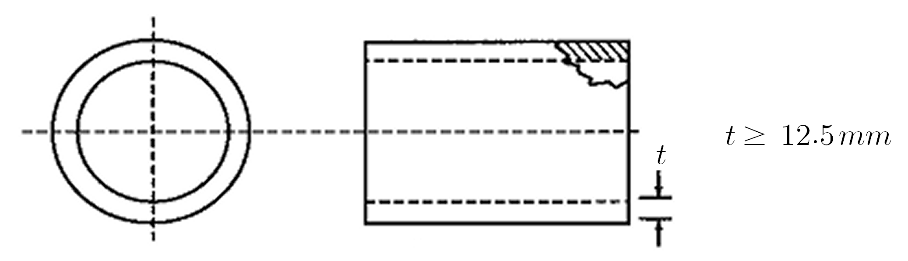
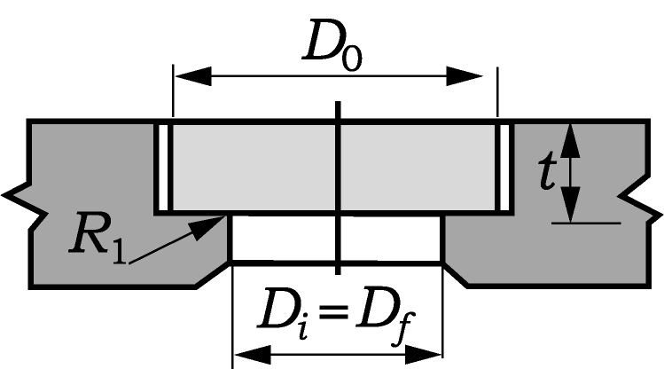

# Underwater Vehicles

> OTHER RULES AND GUIDANCE / RB-05-E / 2025 / EN / Guidance

## PART 1 SUBMERSIBLES

### CHAPTER 1 GENERAL

#### Section 1 General

- **101.** Application
  - **1.** In application to 101. 5 of the Rules, the design and the construction for submersible with GRP shall be complied with Annex 2 of this guidance.

#### Section 2 Drawings and Documents (2021)

- **205.** Diving and buoyancy tanks, trimming devices
  The mathematical proof described in 205. of the Rules is to be complied with the requirements in **Annex 3.**

#### Section 3 Test and trials

- **301.** General
  - **1.** In application to 301. 2 of the Rules, “recognized as equivalent by the Society" means the Guideline for Approval of Manufacturing and Process and Type Approval, Etc.
  - **2.** In application to 301. 3 of the Rules, “where necessary" means the following requirements;
    - **(1)** When the submersible is constructed by making each compartment or chamber of different materials, and
    - **(2)** In the case of the above (1), the watertightness scheme to the connecting parts and data to ensure the watertightness, materials used, technical documents of the connecting method and watertightness test. 

### CHAPTER 2 CLASSIFICATION OF SUBMERSIBLE

#### Section 1 Classification Registry

- **103.** Maintenance of registration
  In application to 103. 1 of the Rules, "the requirements specified by the Society" means Pt 1, Ch 3, Sec 1 of the Rules.

#### Section 2 Classification Survey during Construction

- **202.** Approval of plans
  In application to 202. of the Rules, "as provided separately" means Pt 1, Ch 1, 202. to 215. of the Rules.
- **205.** Tests
  In application to 205. of the Rules, "tests as deemed necessary by the Society" means the performance test to know the accuracy for control devices and measurements during sea trials

#### Section 3 Classification Survey after Construction

- **303.** Classification survey of submersibles classed by other classes
  In application to 303. of the Rules, "as provided separately" means as follows, and on the basis of the ship's particular and purpose, if deemed necessary by the Society, the owner shall send out an additional data to the Society
  - **1.** Submission of plans and documents
    - **(1)** Two(2) copies for drawings and documents specified in Pt 1, Ch 1, 202. to 215. of the Rules.
    - **(2)** Two(2) copies for results of sea trial and equipment performance tests or calculation data.
  - **2.** When the drawing and documents related to the above 1 are submitted to the Society, they may be accepted.
  - **3.** Notification of appraisal results for drawing and documents, etc.
    After the Society appraises the drawings and documents required in the above 1, the results shall be given to the owner. However, if it is difficult for these data to be appraised, the visual condition of the ship may be applied.
- **304.** Tests
  In application to 304. of the Rules, on the basis of the survey status given from the previous class, it is to be carried out for the survey regarding to the recommendation and overdue items. When unpracticable, it shall be implemented by the instruction from our Head office. For the submersible intended for classification survey after construction, in addition, the following tests and surveys shall be done according to the age.

### CHAPTER 4 DESIGN REQUIREMENTS

#### Section 2 Environmental Conditions

- **201.** General
  In application to 201. of the Rules, "particular areas" means that engaged for the limited voyage and it is required to consult with the Society respectively.
- **206.** Vibrations and shaking
  In application to 206. of the Rules, "the Rules separatedly provided by the Society" menas the instruction of vibrations and noises for ships" or the International Standards in common. 

### CHAPTER 5 PRESSURE HULL

#### Section 2 Design Principles

- **202.** Allocation of space
  In applying to 202. of the Rules, "when considered appropriately by the Society as provided separately." means as follows,

#### Section 3 Materials and Weldings

- **301.** General
  In applying to 301. 1 of the Rules, "recognized standards" means the recognized International Standards in commom or recognized National Standards.
- **302.** Approved materials
  In applying to 302. 3 of the Rules, "the requirements separatedly provided by the Society" means the following items. And the acrylic plastic viewports(or windows) means windows made of castings, unlaminated polymechyl methacrylate.
  - **1.** General
    
    Fig 1.5.1 Flat Disk Viewports 
    Fig 1.5.2 Conical Frustum Viewports
    
    Fig 1.5.3 Double Beveled Disk Viewports
    
    Fig 1.5.4 (a) Spherical Sector Viewports with Conical Edge
    
    Fig 1.5.4 (b) Hyperhemepherical Viewports
    
    Fig 1.5.4 (c) NEMO Viewports
    
    Fig 1.5.5 (a) Spherical Sector Viewports with Square Edge
    
    Fig 1.5.5 (b) Hemispherical Viewports with Equatorial Flange
    
    Fig 1.5.6 Cylinderical Viewports
    - **(1)** The design life of a window is a function of its geometry, conversion factor, $t/D _{i}$ ratio, and service environment. Windows that are expected to only compressive, or very low tensile stresses, have a longer design life than those that are exposed to high tensile stresses. The design life of windows in the first category shall be 20 years, while for the window in the latter category it shall be 10 years. The design life of windows under this standard shall be as follows,
      - **(A)** The design life of flat disk windows shown in Fig 1.5.1 shall be 10 years from the date of fabrication.
      - **(B)** The design life of conical frustum windows shown in Fig 1.5.2 and meeting the requirements of this Standard shall be 10 years from the date of fabrication for $t /D _{i} <0.5$ and 20 years for $t /D _{i} \geq 0.5$
      - **(C)** The design life of duble beveled disk windows shown in Fig 1.5.3 and meeting the requirements of this Standard shall be 10 years from the date of fabrication for $t /D _{i} <0.5$ and 20 years for $t /D _{i} \geq 0.5$
      - **(D)** The design life of spherical sector with conical edge, hyperhemisphere with conical edge, and NEMO-type windows with conical edge penetrations shown in Fig 1.5.4 and meeting the requirements of this Standard shall be 20 years from the date of fabrication.
      - **(E)** The design life of spherical sector windows with square edge and hemispherical windows with equatorial flange, shown in Fig 1.5.5 and meeting the requirements of this Standard, shall be 10 years from the date of fabrication.
      - **(F)** The design life of cylinderical windows for internal pressure applications shown in Fig 1.5.6 shall be 10 years from the date of fabrication.
      - **(G)** The design life of cylinderical windows for external pressure applications shown in Fig 1.5.6 shall be 20 years from the date of fabrication.
    - **(2)** The viewports(windows) other than Table 1.5.2 and 1.5.3 shall be complied with the requirements of International Standards, ASME 2.2.7.1
    - **(3)** The permissible temperature range for acrylic plastic viewports(or windows) : -18°C ~ 66°C
    - **(4)** Maximum pressure ratio for acrylic plastic viewports(or windows) : 10 bar/sec
    - **(5)** Maximum pressure cycle : 10,000
    - **(6)** Maximum using hours under pressure of acrylic plastic viewports(or windows) : 40,000 hours
    - **(7)** Maximum working pressure for acrylic plastic viewports(or windows) : 1,380 bar
  - **2.** Materials
    - **(1)** The materials used for acrylic plastic viewports(or windows) shall be complied with the Table 1.5.1.
    - **(2)** The manufacturer, when makes the acrylic plastic viewports(or windows) serially, shall issue the material certificates containing the following requirements.
      - **(A)** certificate number and dates issued
      - **(B)** maker's name and address
      - **(C)** type, design and application for casting
      - **(D)** a bundle number, quantity, shape and size for casting products
      - **(E)** marks of castings
      - **(F)** test results in Table 1.5.1
      - **(G)** endorse or signature
    - **(3)** If there is not the material certificate of acrylic plastic or it is unsatisfied, each test required by the Society shall be done.
    - **(4)** Each casting shall be made by marking at least on the position a manufacturing number, maker's name, dates constructed and a serial number.
  - **3.** Construction of viewports(or windows)
    - **(1)** After all viewports(or windows) are constructed by machining required and manufacturer processing, the heat treatment (tempering) shall be done in accordance with maker's specification.
    - **(2)** The viewport's surface shall be polished to be complied with the visual clarity required.
    - **(3)** The maker manufacturing viewports(or windows) shall get the an appropriate certificate about all matters in the process of cutting, joining, polishing, molding and heat treatments, and the certificate shall contain the manufacturing date, performance test and the results.
    - **(4)** At those edge not to be put under the stress, the viewports(or windows) shall be permanently marked with the following items, but not use of punching.
      - **(A)** a design pressure (bar)
      - **(B)** a design temperature (°C)
      - **(C)** an approved stamp by the Society
      - **(D)** a serial number and a manufactured date
  - **4.** Type and size for viewports(or windows)
    - **(1)** Type and size for viewports(or windows) shall be as same as Table 1.5.2 and 1.5.3, but for ones other than those viewports(or windows) the date shall be given independently to the Society, and then containing the purpose, the result of the function test and the manufacturing process.
    - **(2)** When constructing the viewports(or windows) the design temperature shall be ready to use the average of maximum inner temperature and outer one.
    - **(3)** When getting a pressure of viewports(or windows) inner and outer, the maximum of them shall be taken to design.
    - **(4)** In the case of the hemisphere type, the convex part shall be constructed to be pressurized.
    - **(5)** The thickness of the viewports(or windows) shall be equal to all the places, and are requested to comply with the Table 1.5.2 and 1.5.3.
    - **(6)** At the surface of viewports(or windows) with conical or convex type, the nominal external spherical radius shall be less than ± 0.5 % of the difference from ideal spherical sector.
    - **(7)** The surface roughness of viewports(or windows) shall be of 0.75 or less of the value.

#### Section 4 Principles of Manufacture and Construction

- **401.** Treatment
  In application to 401. 3 of the Rules, "the requirements separated provided" means the requirements of 302. of this guidance.
- **403.** Cutout sand viewports(or windows)
  In application to 403. 3 of the Rules, the seat dimensions for various standard windows shall be complied with the requirements of Table 1.5.1 to 1.5.3.

  **Table 1.5.1 Mechanical, Optical Characteristics for acrylic plastic**

  | Characteristics | Limitation | Test method |
  | --- | --- | --- |
  | Ultimate tensile strength Elongation at break Elastic modulus | ≥ 62 $\mathrm{N}/mm ^{2}$ ≥ 2 % ≥ 2760 $\mathrm{N}/mm ^{2}$ | ASTM D 638^1) |
  | Compression yield strength Elastic modulus | ≥ 103 $\mathrm{N}/mm ^{2}$ ≥ 2760 $\mathrm{N}/mm ^{2}$ | ASTM D 695^1) |
  | Compressive deformation at 4000 psi(27.6 *MPa* and 50°C, 24 hours | ≤ 1 % | ASME PVHO-1, para 2-3.7 (c) |
  | Ultraviolet transmittance(for 12.5 mm thickness) | ≤ 5 % | ASME PVHO-1, para 2-3.7 (d) |
  | Visual clarity | Clear print of size 7 lines per column inch(25mm) and 16 characters to the linear inch(25mm) shall ber clearly visible when viewed from a distance of 20 in(500mm) through the thickness of the casting with the opposite face polished | ASME PVHO-1, para 2-3.7 (e) |
  | Total residual monomer Methyl methacrylate Ethyl acrylate | ≤ 1.6 % | ASME PVHO-1, para 2-3.8 |
  | (Remarks) ^1) The mechanical characteristics shall be proved by at least two(2) specimens. |   |   |

  **Table 1.5.2 Standard size for rectangular flat viewports(or windows)**

  | Application Minimum thickness : $t \geq 12.5 \mathrm{mm}$ Thickness Ratio : $t /D _{0} \geq 0.125 \mathrm{mm}$ Edge radius : $1 \mathrm{mm} itLEQ R _{1} \leq 2 \mathrm{mm}$ Ratio to viewport : $1.25 \leq D _{0} /D _{f} \leq 1.5$ Maximum operating pressure : $P \leq 170$ bar |   |   |   |  |   |   |
  | --- | --- | --- | --- | --- | --- | --- |
  | Design Pressure ($P _{c}$)(bar) | Minimum thickness / Inner diameter of seat ($t /D _{i}$) |   |   |   |   |   |
  | Design Pressure ($P _{c}$)(bar) | 10°C | 24°C | 38°C |   | 52°C | 66°C |
  | 5 10 15 20 25 30 35 40 45 50 60 70 80 90 100 110 120 130 140 150 160 170 | 0.134 0.154 0.173 0.188 0.201 0.210 0.219 0.226 0.233 0.240 0.253 0.267 0.281 0.295 0.305 0.315 0.324 0.334 0.344 0.354 0.363 0.373 | 0.146 0.173 0.195 0.210 0.223 0.233 0.243 0.253 0.264 0.274 0.295 0.310 0.324 0.339 0.354 0.368 0.383 0.398 0.412 0.427 0.441 0.456 | 0.154 0.188 0.210 0.226 0.240 0.253 0.267 0.281 0.295 0.305 0.324 0.344 0.363 0.383 0.402 0.422 0.441 0.461 0.480 0.500 0.520 0.539 |   | 0.164 0.201 0.223 0.240 0.257 0.274 0.292 0.305 0.317 0.329 0.354 0.378 0.402 0.427 0.451 0.476 0.500 0.524 0.549 0.573 0.598 0.622 | 0.188 0.226 0.253 0.281 0.305 0.324 0.344 0.363 0.383 0.402 0.441 0.480 0.520 0.559 0.598 0.637 0.676 0.715 0.754 0.793 0.832 0.871 |

  **Table 1.5.3 Standards for spherical shell type viewports(or windows) having conical type seat.**

  | Application Opening angle : $\alpha \geq 60 {}^{\circ}$ Minimum thickness : $t \geq 12.5 \mathrm{mm}$ Minimum ratio ($t /D _{0}$) - when $\alpha \geq 60 {}^{\circ}$, 0.09 - when $\alpha \geq 90 {}^{\circ}$, 0.06 Ratio to viewport : $D _{i} /D _{f} \geq 1.02$ Maximum operating pressure : $P \leq 170$ bar |   |   |   |   |  |   |   |   |   |   |
  | --- | --- | --- | --- | --- | --- | --- | --- | --- | --- | --- |
  | Design pressure $P _{c}$ (bar) | Minimum thickness / inner diameter of seat ($t /D _{i}$) |   |   |   |   |   |   |   |   |   |
  | Design pressure $P _{c}$ (bar) | when $\alpha$ = 60° |   |   |   |   | when $\alpha$ = 90° |   |   |   |   |
  | Design pressure $P _{c}$ (bar) | 10°C | 24°C | 38°C | 52°C | 66°C | 10°C | 24°C | 38°C | 52°C | 66°C |
  | 5 10 15 20 25 30 35 40 45 50 60 70 80 90 100 110 120 130 140 150 160 170 | 0.090 0.090 0.090 0.090 0.090 0.097 0.104 0.112 0.119 0.126 0.140 0.153 0.166 0.179 0.191 0.203 0.215 0.227 0.238 0.248 0.259 0.269 | 0.090 0.090 0.090 0.097 0.108 0.119 0.129 0.140 0.150 0.160 0.179 0.197 0.215 0.232 0.248 0.264 0.279 0.293 0.307 0.320 0.332 0.344 | 0.090 0.090 0.097 0.112 0.126 0.140 0.153 0.166 0.179 0.191 0.215 0.238 0.259 0.279 0.298 0.315 0.332 0.348 0.363 0.377 0.391 0.404 | 0.090 0.090 0.108 0.126 0.143 0.160 0.176 0.191 0.206 0.221 0.248 0.274 0.298 0.320 0.340 0.359 0.377 0.394 0.410 0.425 0.439 0.452 | 0.090 0.112 0.140 0.166 0.191 0.215 0.238 0.259 0.279 0.298 0.332 0.363 0.391 0.416 0.439 0.460 0.480 | 0.042 0.042 0.043 0.049 0.054 0.060 0.065 0.070 0.075 0.080 0.089 0.098 0.107 0.116 0.124 0.133 0.142 0.151 0.160 0.168 0.177 0.185 | 0.042 0.043 0.052 0.060 0.067 0.075 0.082 0.089 0.095 0.102 0.116 0.128 0.142 0.155 0.168 0.181 0.194 0.206 0.218 0.230 0.242 0.254 | 0.042 0.049 0.060 0.070 0.080 0.089 0.098 0.107 0.116 0.124 0.142 0.160 0.177 0.194 0.210 0.226 0.242 0.257 0.272 0.287 0.300 0.314 | 0.042 0.054 0.067 0.080 0.091 0.102 0.113 0.124 0.135 0.146 0.168 0.190 0.210 0.230 0.250 0.269 0.287 0.304 0.320 0.336 0.651 0.365 | 0.049 0.070 0.089 0.107 0.124 0.142 0.160 0.177 0.194 0.210 0.242 0.272 0.300 0.327 0.351 0.373 0.393 0.411 |

#### Section 5 Calculations

- **501.** General
  - **1.** In application to 501. 1 of the Rules, "the relevant Rules of the Society" means the International Standards in common. And for pressure hulls and pressure vessels subjected to external overpressure, "guidances separatedly provided" means the requirement of Annex 1 of this guidance.
  - **2.** In application to 501. 4 of the Rules, the load factors for dynamic loads shall be complied with Annex 1 of the guidance. 

### CHAPTER 12 ELECTRIC EQUIPMENT

#### Section 2 Design Principles

- **202.** Materials and insulation
  In application to 202. 3 of the Rules, "recognized standard" means the International Electrotechnical Commission or the International Standards in common. 

### CHAPTER 13 AUTOMATION, COMMUNICATION, NAVIGATING AND LOCATING EQUIPMENT

#### Section 2 Automation Equipment

- **201.** Design principles
  In application to 201. 14 of the Rules, "recognized standard approved by the Society" means the International Electrotechnical Commission or the International Standards in common.
- **205.** Tests
  In application to 205. of the Rules, "the nature and scope of type approval" means the relevant requirements of Pt 6, Ch 2 of Rules for the Classification of Steel Ships. 

### CHAPTER 16 RESCUE SYSTEM

#### Section 1 General

- **101.** General
  - **1.** In application to 101. 1 of the Rules, "when deemed by the Society" means the following requirements.
    - **(1)** The submersibles engaged in coastal area or more and carrying passengers without supporting ships.
    - **(2)** The submersibles engaged in great coastal area or more and carrying the passengers.
    - **(3)** The submersibles engaged in great coastal area or more and intending for special purpose.
  - **2.** In the case of the above 1, the life saving equipments for crews and passengers (i.e. life buoy, life jackets and Immersion suits and anti-exposure suits shall be of type complied with the requirements of the International Convention, SOLAS. 
