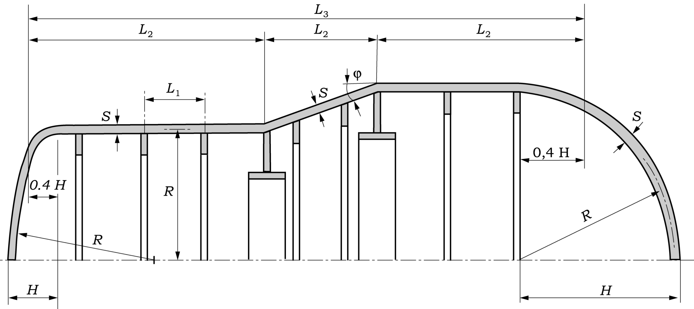
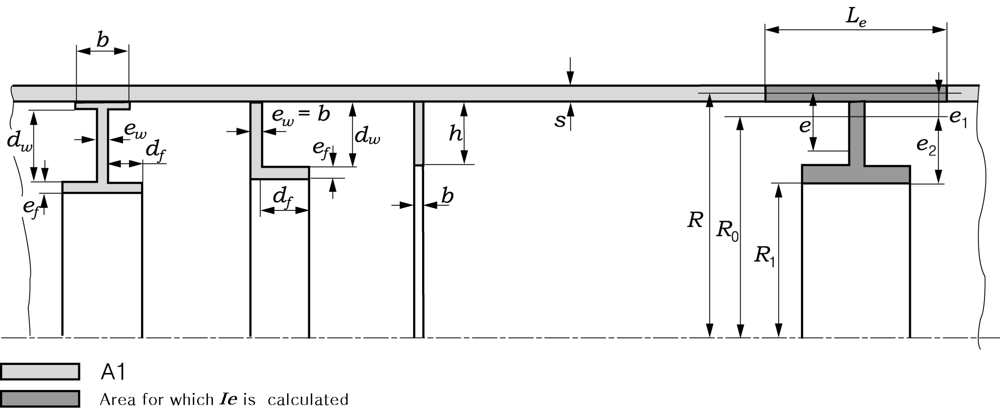
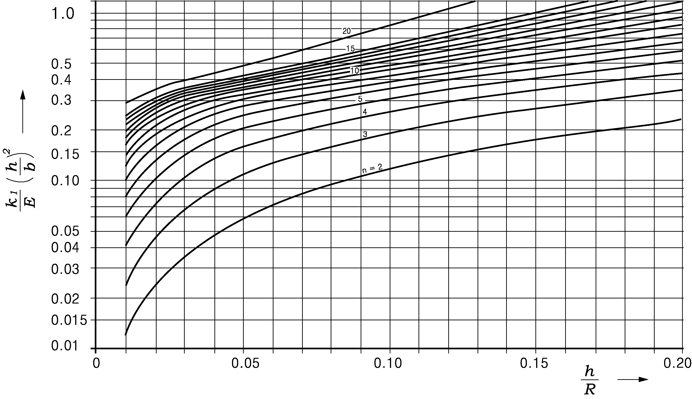
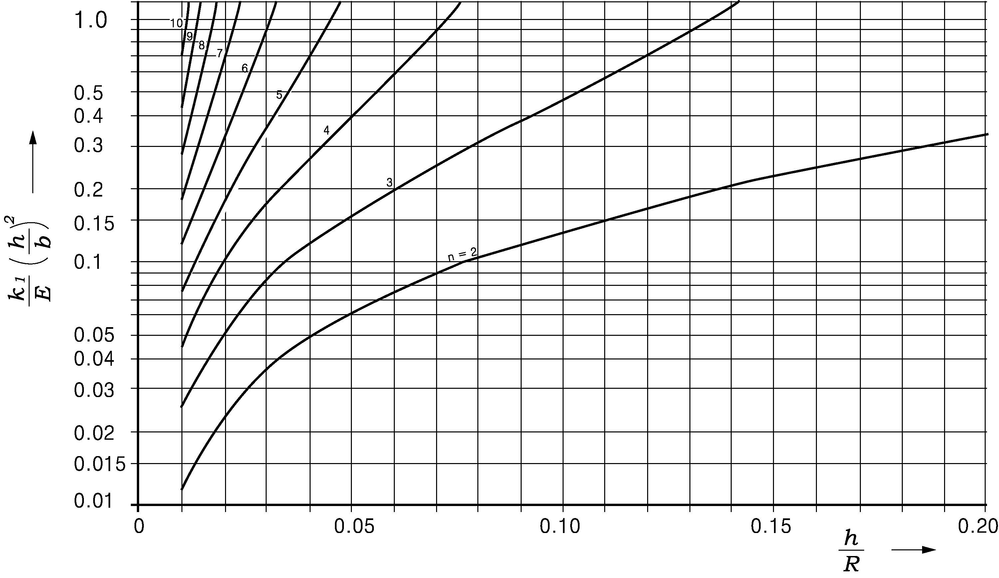
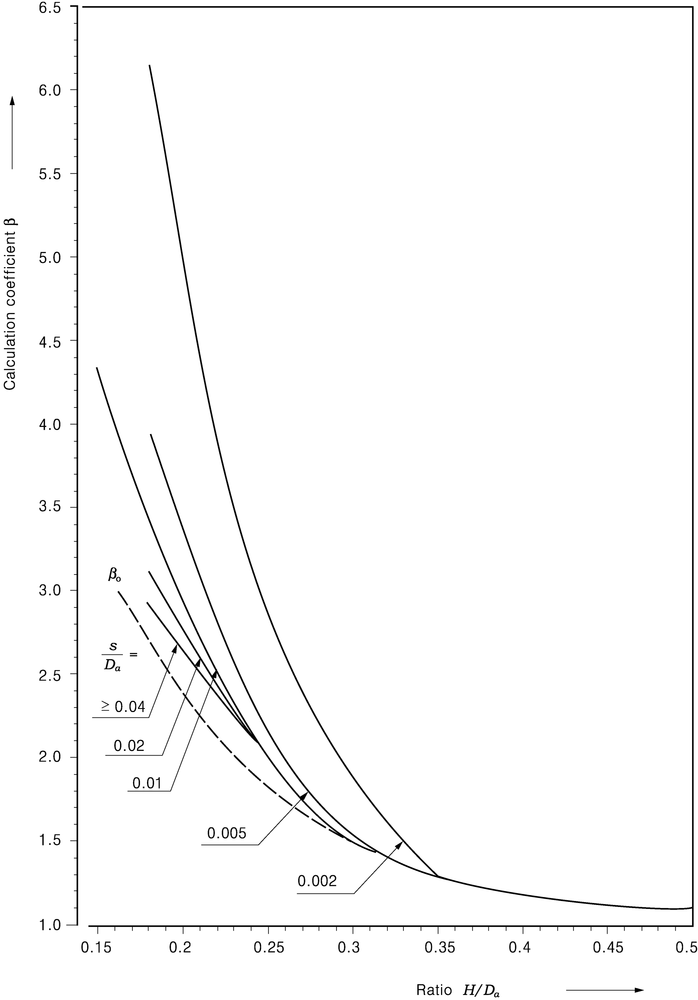
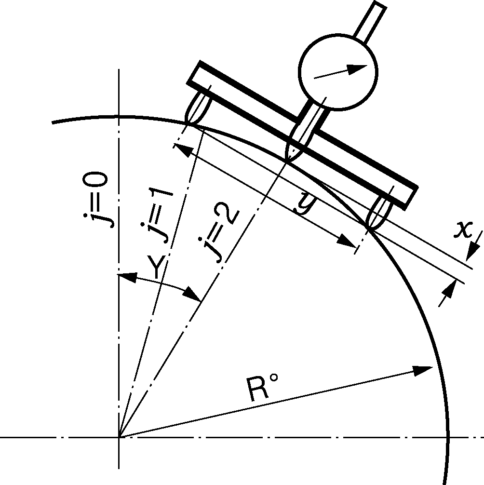
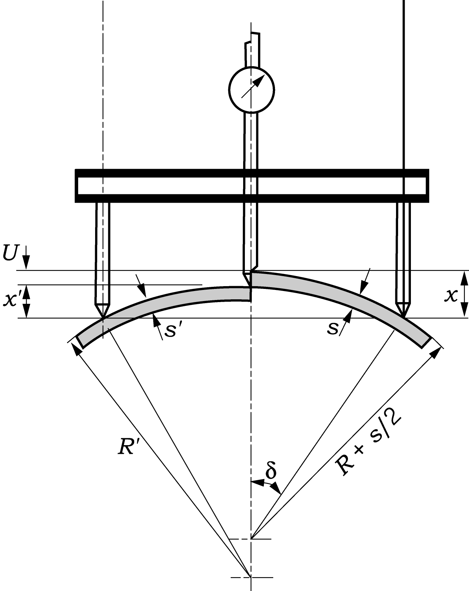
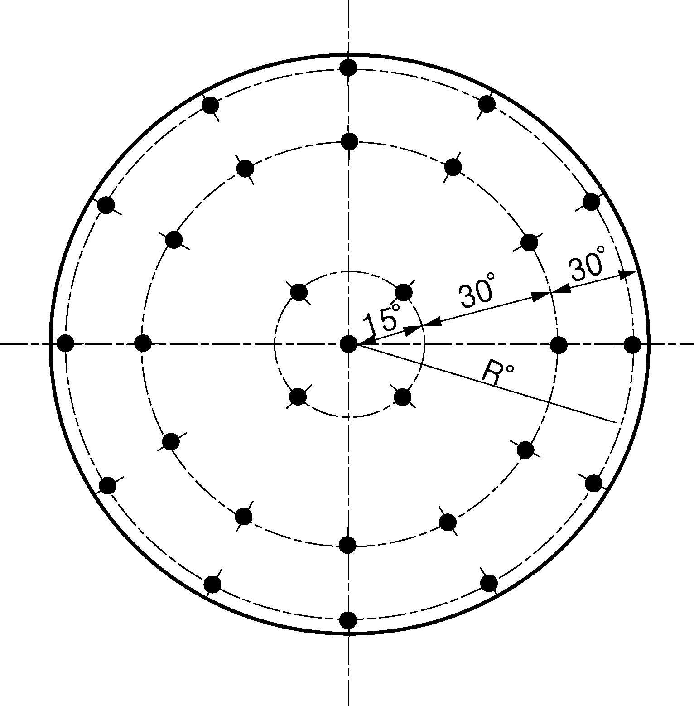

# Underwater Vehicles

> OTHER RULES AND GUIDANCE / RB-05-E / 2025 / EN / Guidance

## Annex 1 Calculation and Pressure Hulls under External Pressure

### 1. General

#### 1.1 Design and Calculation

- **(1)** A method of calculation for designing the pressure hulls of submersibles is described below, which can be used for the three loading conditions:
  - **(A)** nominal diving pressure $P _{N}$
  - **(B)** test pressure $P _{P}$
  - **(C)** collapse pressure $P _{Z}$
    to investigate the stresses in the pressure hull and the corresponding states of stability:
  - **(D)** asymmetric buckling between stiffeners (axial bucking)
  - **(E)** symmetric bucking between stiffeners (circular bucking)
  - **(F)** general instability of pressure hull design
  - **(G)** tripping of ring stiffeners
  - **(H)** buckling of dished ends
- **(2)** The method of calculation presented takes limited account of fabrication relevant deviations from the ideal shape of the shell (out-of-roundness). Methods of verifying the roundness of hull shells are also described.
- **(3)** Conical shells are calculated in sections, each of which is treated as a cylindrical shell.
- **(4)** Overall collapse of the design is regarded as buckling of the hull structure between bulkheads or dished ends.
- **(5)** With regards to the stresses in the pressure hull the permissible valves are those stated in Pt 1, Ch 5, Sec 5 of the Rules.
- **(6)** For the states of stability described, proof is required of sufficient safety in respect of the particular form of damage concerned.
- **(7)** When using the method of calculation it is to be remembered that both elastic and elastic-plastic behaviour can occur in the materials of the shell structure. It is generally the case that
  - **(A)** at nominal diving pressure, the stress is within the purely elastic range of the material; However, calculations relating to the permissible stress being exceeded can be based on the assumption that the behaviour of the material is elastic.
  - **(B)** at the collapse pressure, the stress may lie in the elastic or the elastic-plastic range of the material.
- **(8)** In the elastic-plastic range, use of the method requires the determination of value by a process of iteration. The modulus of elasticity $E$ and the Poisson's ratio $\nu$ shall be submitted by the values $E '$ and $\nu '$ according to 7.

### 2. Stiffened and unstiffened Cylindrical Shells

#### 2.1. General

- **(1)** For the loading conditions mentioned in 1.1 (1). Cylindrical shells are to be checked for excess stresses and asymmetric and symmetric buckling.
- **(2)** The method of calculation presented below is for stiffened cylindrical shells. In the case of unstiffened cylindrical shells with dished ends, the calculations are performed in a similar manner, the cross-sectional area of the ring stiffener being $A=A _{1} =0$ and the spacing between stiffeners being defined by the ends. Where the spacing between stiffeners is defined by dished ends 40% of the depth $H$ of each dished end is to be added to the cylindrical length (see Fig. 1.1).
  
  Fig. 1.1
- **(3)** For the calculation of buckling in the elastic-plastic range the modulus of elasticity $E$ and the poisson's $\nu$ is determined by applying formulae (65)-(68) and by means of the stress $\sigma _{i}$ formula (1) in the centre of the section and the centre of the plate.
- **(4)** The calculations allow for an out-of-roundness of the shell of maximum $\mu$ = 0.005. If larger tolerances are planned, or if the method of measurement described in 8.1 results in greater out-of-roundness values, then the permissible pressure is to be checked in accordance with 8.2

#### 2.2 Stresses in the cylindrical shell

The stress intensity (at the centre of the plate at midway position between ring stiffeners) is determined by applying formulae (1)-(14). In formulae (2a)-(2d) the centre of the bending component is expressed by the plus sign on top for the outside of the cylindrical shell and by the minus sign below for the inside. The stresses in the centre of the plate are determined by omitting of the expression after the plus/minus signs.
$\sigma _{i} = \sqrt {\sigma _{x} ^{2} + \sigma _{\phi } ^{2} - \sigma _{x} \times \sigma _{\phi }}$ (1)
$\sigma _{0} = - \frac{R \times P}{s}$ (2)
In the centre of the section the following applies;
$\sigma _{x} = \sigma _{0} \left( \frac{1}{2} ± C _{10} \times C _{11} \times F _{4} \right)$ (2a)
$\left. \sigma _{\phi } = \sigma _{0} (1-C _{10} \times F _{2} ± \nu \times C _{10} \times C _{11} \times F _{4} \right)$ (2b)
In the area of stiffening the following applies;
$\sigma _{x} = \sigma _{0} \left( \frac{1}{2} ±C _{10} \times C _{11} \times F _{3} \right)$ (2c)
$\left. \sigma _{\phi } = \sigma _{0} (1-C _{10} ± \nu \times C _{10} \times C _{11} \times F _{3} \right)$ (2d)
$F _{1} = \frac{4}{C _{5}} \left[ \frac{\cosh ^{2} C _{8} -\cos ^{2} C _{9}}{\frac{\cosh C _{8} \times \sin h C _{8}}{C _{6}} + \frac{\cos C _{9} \times \sin C _{9}}{C _{7}}} \right]$ (3a)
$F _{2} = \left[ \frac{\frac{\cosh C _{8} \times \sin C _{9}}{C _{7}} + \frac{\sinh C _{8} \times \cos C _{9}}{C _{6}}}{\frac{\cosh C _{8} \times \sinh C _{8}}{C _{6}} + \frac{\cos C _{9} \times \sin C _{9}}{C _{7}}} \right]$ (3b)
$F _{3} = \sqrt {\frac{3}{1-v ^{2}}} \left[ \frac{- \frac{\cosh C _{8} \times \sinh C _{8}}{C _{6}} + \frac{\cos C _{9} \times \sin C _{9}}{C _{7}}}{\frac{\cosh C _{8} \times \sinh C _{8}}{C _{6}} + \frac{\cos C _{9} \times \times \sin C _{9}}{C _{7}}} \right]$ (3c)
$F _{4} = \sqrt {\frac{3}{(1-v ^{2} )}} \left[ \frac{\frac{\cosh C _{8} \times \sin C _{9}}{C _{7}} + \frac{\sinh C _{8} \times \cos C _{9}}{C _{6}}}{\frac{\cosh C _{8} \times \sinh C _{8}}{C _{6}} + \frac{\cos C _{9} \times \sin C _{9}}{C _{7}}} \right]$ (3d)
$A = A _{1} \times \frac{R ^{2}}{R _{0} ^{2}}$ (4)
$C _{5} = \alpha \times L _{1}$ (5)
$C _{6} = \frac{1}{2} \sqrt {1-G}$ (6)
$C _{7} = \frac{1}{2} \sqrt {1+G}$ (7)
$C _{8} =C _{5} \times C _{6}$ (8)
$C _{9} =C _{5} \times C _{7}$ (9)
$C _{10} = \frac{\left( 1- \frac{\nu}{2} \right) \times \frac{A}{s \times L _{1}}}{\frac{A}{s \times L _{1}} + \frac{b}{L _{1}} + \left( 1- \frac{b}{L _{1}} \right) F _{1}}$ (10)
$C _{11} = \sqrt {\frac{0.91}{1- \nu ^{2}}}$ (11)
$P ^{*} = \frac{2 \times s ^{2} \times E}{R ^{2} \times \sqrt {3 \times (1- \nu ^{2} )}}$ (12)
$G= \frac{P}{P ^{*}}$ (13)
$\alpha = root {4} of {\frac{3 \times (1- \nu ^{2)}}{s ^{2} \times R ^{2}}}$ (14)
$K _{0} = \frac{\sigma _{\phi }}{\sigma _{x}}$ (15)
where,
$A$ : modified area of stiffener ring ($\mathrm{mm} ^{2}$)
$A _{1}$ : cross- sectional area of stiffener ring ($\mathrm{mm} ^{2}$)
$L _{1}$ : spacing between two "light" stiffeners (mm)
$b$ : width of stiffener ring in contact with shell (mm)
$\alpha$ : shape factor (1/mm)
$\sigma _{i}$ : stress intensity ($\mathrm{N}/mm ^{2}$)
$\sigma _{0}$ : stress (calculate value) ($\mathrm{N}/mm ^{2}$)
$\sigma _{\phi }$ : stress in circumferential direction ($\mathrm{N}/mm ^{2}$)
$\sigma _{x}$ : stress in longitudinal direction ($\mathrm{N}/mm ^{2}$)
$\nu$ : Poisson's ratio (elastic)
$R _{0}$ : radius of stiffener ring centroid including effective length
$R$ : mean radius of wall
$G$ : pressure ratio
$E$ : modulus of elasticity
$P$ : external design pressure ($\mathrm{N}/mm ^{2}$)
$P ^{*}$ : critical pressure ($\mathrm{N}/mm ^{2}$)
$K _{0}$ : stress ratio
$C _{5}$～$C _{11}$ : calculation factor for stress in cylindrical shell

#### 2.3 Provision against excess stresses

The stress intensity for the three loading conditions is contained from formula (1). Sufficient safety against exceeding the permissible stress is provided if the conditions (16a,b,c) are met. In formulae (2a) to (2d) where load $P$ = $P _{Z}$ the binding component can be disregarded.
$k \geq \sigma _{i} \times S$ (where $P$ = $P _{N}$ ) (16a)
$k \geq \sigma _{i} \times S '$ (where $P$ = $P _{P}$ ) (16b)
$k \geq \sigma _{i}$ (where $P$ = $P _{Z}$ ) (16c)
where,
$k$ : yield strength $R _{eH} _{20}$ ($\mathrm{N}/mm ^{2}$)
$S$ : safety factor applied to yield strength $R _{eH} _{20}$ at nominal pressure
$S '$ : safety factor applied to yield strength $R _{eH} _{20}$ at test diving pressure
$P_N$ : nominal diving pressure (1st load condition) ($\mathrm{N}/mm ^{2}$)
$P_P$ : test diving pressure (2nd load condition) ($\mathrm{N}/mm ^{2}$)
$P_Z$ : collapse pressure (3rd load condition) ($\mathrm{N}/mm ^{2}$)

#### 2.4 Asymmetric buckling

The buckling pressure $P _{n}$ is calculated with formulae (17)-(19) for the integer value n ≥ 2 corresponding to the lowest value of $P _{n}$. The relevant stresses of the centre of the plate are determined in accordance with 2.2
$P _{n} = \frac{E \times s \times \beta _{n1}}{R}$ (17)
$\left. \beta _{n1} = \left[ \frac{\left( \frac{n ^{2}}{\lambda _{1} ^{2}} +1 \right) ^{-2} + \frac{s ^{2} \times (n ^{2} -1+ \lambda _{1} ^{2} ) ^{2}}{12 \times R ^{2} \times (1- \nu ^{2} )}}{(n ^{2} -1+0.5 \lambda _{1} ^{2} )} \right] \right.$ (18)
$\lambda _{1} = \frac{\pi \times R}{L _{1}}$ (19)
where,
$P _{n}$ : buckling pressure, asymmetric buckling ($\mathrm{N}/mm ^{2}$)
$L _{1}$ : spacing between two "light" stiffeners (mm)
$\lambda _{1}$ : coefficient
$\beta _{n1}$ : coefficient
$s$ : thickness of shell/sphere without abrasion and corrosion (mm)

#### 2.5 Prevision against asymmetric buckling

The buckling pressure for the three loading conditions is obtained from formula (17). Sufficient safety against asymmetric buckling is provided if the conditions (20a,b,c) are met.
$P _{n} \geq P _{N} \times S _{k}$ (for the nominal diving pressure load condition) (20a)
$P _{n} \geq P _{P} \times S ' _{k} =P _{N} \times S _{1} \times S _{k} '$ (for the test diving pressure load condition) (20b)
$P _{n} \geq P _{Z} =P _{N} \times S _{2}$ (for the collapse pressure load condition) (20c)
where,
$S _{k}$ : safety factor against instability at nominal pressure
$S _{k} '$ : safety factor against instability at test diving pressure

#### 2.6 Symmetric buckling

The buckling pressure $P _{m}$ is calculated with formulae (21)-(33) and ((15) for the lowest integer value of $m$ at which conditions (33) is met. The values $E _{s}$ and $E _{t}$ are determined in accordance with 7. The relevant stresses if the centre of the plate are calculated in accordance with 2.2. In the elastic range $E _{s} =E _{t} =E$ and $\nu ' = \nu$.
$P _{m} =P ^{**} C _{0} \left[ \left( \frac{\alpha _{1} L _{1}}{\pi m} \right) ^{2} + \frac{1}{4} \left( \frac{\pi m}{\alpha _{1} L _{1}} \right) ^{2} \right]$ (21)
$P ^{**} = \frac{2 s ^{2} E _{s}}{R ^{2} \sqrt {3(1-v ' ^{2} )}}$ (22)
$C _{0} = \sqrt {\frac{C _{1} C _{2} - \nu ' ^{2} C _{3} ^{2}}{1- \nu ' ^{2}}}$ (23)
$C _{1} =1- \frac{H _{2} ^{2} H _{4}}{H _{1}}$ (24)
$C _{2} =1- \frac{H _{3} ^{2} H _{4}}{H _{1}}$ (25)
$C _{3} =1- \frac{H _{2} H _{3} H _{4}}{\nu ' H _{1}}$ (26)
$H _{1} =1+H _{4} \left[ H _{2} ^{2} -3 (1- \nu ' ^{2} ) \right]$ (27)
$H _{2} =(2- \nu ' )-(1-2 \nu ' ) K _{0}$ (28)
$H _{3} =(1-2v ' )-(2-v ' ) K _{0}$ (29)
$H _{4} = \frac{1- \frac{E _{t}}{E _{S}}}{4(1- \nu ' ^{2} ) K _{1}}$ (30)
$K _{1} =1-K _{0} +K _{0} ^{2}$ (31)
$\alpha 1 = root {eqalign{ 4\#
}} of {\frac{\left. \left. 3 \left\{ \frac{C 2}{C 1} -( \nu ' ) 2 RIGHT ( \frac{C 3}{C 1} \right) 2 \right\}}{s 2 R 2}}$ (32)
$\frac{\alpha _{1} L _{1}}{\pi} \leq \sqrt {\frac{m}{2} (m+1)}$ (33)
where,
$P _{m}$ : buckling pressure, symmetric ($\mathrm{N}/mm ^{2}$)
$P ^{**}$ : critical pressure, elastic-plastic ($\mathrm{N}/mm ^{2}$)
$H _{1}$～$H _{4}$ : calculation factors for symmetric buckling
$E _{s}$ : secant modulus

#### 2.7 provisions against symmetric buckling

The buckling pressure $P _{m}$ for the collapse pressure condition is obtained from formula (21). Sufficient safety against symmetric buckling is provided if the conditions (34a,b,c) are met.
$P _{m} \geq P _{N} \times S _{k}$ (for the nominal diving pressure load condition) (34a)
$P _{m} \geq P _{P} \times S _{k} ' =P _{N} \times S _{1} \times S _{k} '$ (for the test diving pressure load condition) (34b)
$P _{m} \geq P _{Z} =P _{N} \times S _{2}$ (for the collapse pressure load condition) (34c)

### 3. Ring Stiffeners

#### 3.1 General

- **(1)** It is the purpose of ring stiffeners to reduce the buckling length of cylindrical shells. A distinction is made between "heavy" and "light" ring stiffeners. "Heavy" ring stiffeners are stiffeners which are able to reduce the significant mathematical length of the pressure hull as this relates to the failure described in 3.2 (3) The dimensions of "heavy" stiffeners are not to be smaller than the "light" stiffeners. (see Fig. 1.2)
  
  Fig 1.2 Stiffeners
- **(2)** For a terminal section, the length to be used is that between the end and the stiffener. (In the case of dished ends, the buckling length is to take account of the instruction in 2.1 and Fig. 1.1) For the loading conditions mentioned (1), stiffeners are to be designed for safety against excess stresses, buckling and tripping. Unreinforced cut-outs in the girth or web are to be considered for calculation.

#### 3.2 "Light" stiffeners

- **(1)** Stresses in "light" stiffeners
  The stresses are calculated using formulae (4), (14), (35)-(37) and the values of $P _{n1}$ and $n$ according to 3.2 (3) If $n$ = 2 determined also $n$ = 3 has to be calculated. In formulae (37), $L=L _{1}$. Where the distances $L _{1}$ to the two adjoining stiffeners are unequal, the calculation shall make use of the arithmetic mean value of both distances. in the elastic-plastic range the value $E$ and $\nu$ are replaced by $E '$ and $\nu '$ respectively. The elasticity modulus $E '$ and the Poisson's ratio $\nu '$ are calculated in accordance with 7. in relation to stress $\sigma _{f}$.
  $\sigma _{f} = \frac{p R ^{2} \left( 1- \frac{\nu}{2} \right)}{R _{1} \left[ s+ \frac{A}{b+ \frac{2N}{\alpha}} \right]}$ (35)
  $\sigma _{fb} = +- \frac{P(n ^{2} -1)E e _{2} u}{(P _{n} -P) R _{0}^{2}}$ (36)
  $N= \frac{\cosh( \alpha L)-\cos( \alpha L)}{\sinh( \alpha L)-\sin( \alpha L)}$ (37a)
  $N=1$ for $\alpha \times L >5.5$ (37b)
  where,
  $\sigma _{f}$ : compression stress in girth ($\mathrm{N}/mm ^{2}$)
  $\sigma _{fb}$ : bending stress in girth ($\mathrm{N}/mm ^{2}$)
- **(2)** Provision against excess stresses
  For the three loading conditions, formulae(35) and (36) give the stresses $\sigma _{f}$ and $\sigma _{fb}$, the absolute values of which are related to the yield strength k in conditions (38a,b,c)
  $\left. \left. k \geq \left| \sigma _{f} \right| \times S+ \left| \sigma _{fb} \right| \times S _{k} RIGHT$ (for $P=P _{N}$) (38a)
  $k \geq \left| \sigma _{f} \right| \times S ' + \left| \sigma _{fb} \right| \times S _{k} '$ (for $P=P _{P}$) (38b)
  $k \geq \left| \sigma _{f} \right| + \left| \sigma _{fb} | \right.$ (for $P=P _{Z}$) (38c)
- **(3)** Buckling
  The "light" stiffeners are to be calculated using formulae (39)-(45) for the integer $n$ 󰀄 2 which produces the lowest value of $P _{n1}$. In formulae (41) $L=L _{2}$, and, in the absence of "heavy" stiffeners, $L=L _{3}$. In the elastic-plastic range, $E '$ according to 7, is to be substituted for $E$ in formulae (39) and (42). The necessary stress calculation is performed in accordance with 3.2. (1)
  $P _{0} = \frac{E s \beta _{n2}}{R}$ (39)
  $\beta _{n2} = \frac{\lambda _{2} ^{4}}{(n ^{2} -1+0.5 \lambda _{2} ^{2} )(n ^{2} + \lambda _{2} ^{2} ) ^{2}}$ (40)
  $\lambda _{2} = \frac{\pi R}{L}$ (41)
  $P _{1} = \frac{(n ^{2} -1) E I _{e}}{R ^{3} L _{1}}$ (42)
  $P _{n1} =P _{0} +P _{1}$ (43)
  $I _{e} = \frac{A _{1} e ^{2}}{1+ \frac{A _{1}}{L _{e} s}} +I _{1} + \frac{L _{e} s ^{3}}{12}$ (44)
  $L _{e} = \sqrt {2R s} +b$ (45a)
  In addition with light stiffeners
  $L _{e} \leq L _{1}$ (45b)
  where,
  $L _{e}$ : effective length of shell
  $\beta _{n2}$ : coefficient
  $\lambda _{2}$ : coefficient
  $P _{n1}$ : buckling pressure, asymmetric buckling "light" stiffener
- **(4)** Provision against buckling
  The calculation of the buckling pressure $P _{n1}$ for the three loading conditions is performed in accordance with 3.2 (3) Sufficient safety against buckling is provided if the conditions (46a,b,c) are met
  $P _{n1} \geq P _{N} \times S _{k}$ (for the nominal diving pressure load condition) (46a)
  $P _{n1} \geq P _{p} \times S _{k} ' =P _{N} \times S _{1} \times S _{k} '$ (for the test diving pressure load condition) (46b)
  $P _{n1} \geq P _{Z} =P _{N} \times S _{2}$ (for the collapse pressure load condition) (46c)

#### 3.3 "Heavy" stiffeners

- **(1)** Stresses in "heavy" stiffeners
  The stresses are calculated using formulae (35)-(37) and the values $P _{g}$ and $n$ according to 3.3 (3). In formulae (37) and (41) $L=L _{2}$. If the distances $L _{2}$ to the two adjoining stiffeners (or ends) are unequal, the calculation shall make use of the arithmetic mean value of both distances. In the elastic-plastic range the values $E$ and $\nu$ are replaced by $E '$ and $\nu '$. The elasticity modulus $E '$ and the Poisson's ratio $\nu '$ are calculated in accordance with 7. in the relation to the stress $\sigma _{f}$.
- **(2)** Provision against excess stresses
  For the three loading conditions, formulae (35) and (36) give the stresses $\sigma _{f}$ and $\sigma _{fb}$, the absolute values of which are related to the yield strength $k$ in conditions (38a,b,c)
- **(3)** Buckling (general stability)
  Using formulae (39)-(42) and (47)-(49), the overall stability of the design is to be calculated for the integer $n$ 󰀄 2 at which the buckling pressure $P _{g}$ attains its lowest value. The calculation factor $C _{4}$ in formulae (47) becomes $C _{4}$ = - 4 for internal stiffeners and $C _{4}$ = $n ^{2}$ for external stiffeners. Where only one "heavy" stiffener is located midway between two bulkheads, the total buckling pressure $P _{g}$ formulae (49) can be increased by a membrane stress element $P _{0}$ in accordance with formulae (39)-(41) where $L=L _{3}$. Where there are no "heavy" stiffeners, the buckling $P _{g}$ is obtained from formula (43)
  $P _{g} = P _{n1}$
  $P _{2} = \frac{(n ^{2} -1)E I _{e}}{R _{0} ^{2} (R+e _{1} C _{4} )L _{2}}$ (47)
  $P _{n2} = \frac{P _{0} \times P _{2}}{P _{0} +P _{2}}$ (48)
  $P _{g} =P _{1} +P _{n2}$ (49)
- **(4)** Provision against buckling
  The calculation of the total buckling pressure $P_g$ for the three loading conditions is performed in accordance with 3.3.3 Sufficient safety against buckling is provided if the conditions (50a,b,c) are met.
  $P _{g1} \geq P _{N} \times S _{k}$ (for the nominal diving pressure load condition) (50a)
  $P _{g1} \geq P _{p} \times S ' _{k} =P _{N} \times S _{1} \times S _{k} '$ (for the test diving pressure load condition) (50b)
  $P _{g1} \geq P _{Z} =P _{N} \times S _{2}$ (for the collapse pressure load condition) (50c)

#### 3.4 Tripping of ring stiffeners.

- **(1)** Tripping pressure and general conditions
  The tripping pressure $P _{k}$ of flat bar stiffeners is to be calculated using formulae (4), (14), (37) and (51) and Fig. 1.3 or 1.4. The value of $n$ is to be that used in 3.2 (3) or 3.3 (3) for calculations in the elastic-plastic range, $E$ and $\nu$ in the aforementioned formulae are to be replaced by $E '$ and $\nu '$ in accordance with 7. The necessary stress calculation is performed in accordance with 3.2 (1) or 3.3 (1) The maximum allowable value of $k _{1} /E (hb) ^{2}$ is 1.14 in each case. Calculation of the tripping pressure using the formulae referred to above necessitates maintaining the tolerances stated in 9.
  $P _{k} = \frac{k _{1} R _{1}}{R _{2} \left( 1- \frac{\nu}{2} \right)} \left( s+ \frac{A}{b+ \frac{2N}{\alpha}} \right)$ (51)
- **(2)** Resistance of tripping
  For flat bar stiffeners, the tripping pressure $P _{k}$ for the three loading conditions is obtained from formula (51). Sufficient resistance to tripping is provided if the conditions (52a,b,c) are met
  $P _{k1} \geq P _{N} \times S _{k}$ (for the nominal diving pressure load condition) (52a)
  $P _{k1} \geq P _{P} \times S _{k} ' =P _{N} \times S _{1} \times S _{k} '$ (for the test diving pressure load condition) (52b)
  $P _{k1} \geq P _{Z} =P _{N} \times S _{2}$ (for the collapse pressure load condition) (52c)
  Proof of the sufficient resistance to tripping of $L$-, $T$- and $I$-section stiffeners can be provided by applying formulae (53). Proof can be dispensed with if minimum seven of the following eight conditions are met:
  $e _{W} \geq s , e _{f} \geq e _{W} , e _{f} \leq 2s , d _{W} \leq 20e _{W} , d _{W} \leq \frac{R}{2} , d _{f} \leq 10e _{f} , \frac{d _{W}}{2} \geq d _{f} \geq \frac{d _{W}}{4}$, $k S _{k} \leq \frac{E I _{1} '}{A _{1} R e}$ (53)
  
  Fig 1.3
  
  Fig 1.4

### 5. Dished Ends and Spheres

#### 5.1 General

Dished ends and spheres are to be examined for excess stresses and buckling under the loading conditions stated in 1. In the case of dished ends, the stresses in the crown radius and in knuckle radius are to investigated. Spheres are to be treated in the same way as the crown radius of dished ends. The calculation allow for out-of-roundness of the shell up to a maximum of $\mu =0.04 \times s/R$. If larger tolerances are planned, or if the method of measurement described in 8.3 results in greater out-of-roundness values, then the permissible pressure is to be checked in accordance with 8.4.

#### 5.2 Stress

For the dished sections the stress is obtained by applying formulae (54). For the knuckle radius the stress is obtained with formulae (55), the radius $R$ being the radius of the adjoining cylindrical jacket. The coefficient $\beta$ are to be taken from Fig. 1.5. For hemispherical ends in the range of $0.5 \sqrt {s \cdot R}$ beside the transition to the cylinder a coefficient $\beta$ - 1.1 is valid.
$\sigma =- \frac{R p}{2 s}$ (54)
$\sigma =- \frac{p R 1.2 \beta}{2 s}$ (55)

Fig 1.5

#### 5.3 Provision against excess stresses

The stress for the three loading conditions is obtained by applying formulae (54) and (55). Sufficient safety against excess stresses is provided if the conditions (56a,b,c) are met, allowing for the absolute values of $\sigma$
$k \geq \left| \sigma \right| \times S$ (for $P=P _{N}$) (56a)
$k \geq \left| \sigma \right| \times S '$(for $P=P _{P}$ ) (56b)
$k \geq \left| \sigma \right|$ (for $P=P _{Z}$ ) (56c)

#### 5.4 Buckling

The buckling pressure $P _{n}$ in the dished section for the nominal diving pressure and test diving pressure load conditions is determined by applying formula (57)
$P _{n} =0.366 E \left( \frac{s}{R} \right) ^{2}$ (57)
The buckling pressure $P _{n}$ in the dished section for the collapse pressure load condition is calculated with formula (58). The elasticity moduli $E _{s}$ and $E _{t}$ are calculated in accordance with 7. allowing for the stress determined with formula (54)
$P _{n} =0.84 \sqrt {E _{s} E _{t}} \left( \frac{s}{R} \right) ^{2}$ (58)

#### 5.5 Provision against buckling

The buckling pressure for the nominal diving pressure and test diving pressure load conditions is calculated with formula (57). Sufficient safety is provided if the conditions (59a,b) are met. The buckling pressure for the collapse pressure load condition is calculated with formula (58). Sufficient safety is provided id conditions (59c) is met.
$P _{n} \geq P _{N} \times S _{k}$ (for the nominal diving pressure load condition) (59a)
$P _{n} \geq P _{P} \times S _{k} ' =P _{N} \times S _{1} \times S _{k} '$ (for the test diving pressure load condition) (59b)
$P _{n} \geq P _{Z} =P _{N} \times S _{2}$ (for the collapse pressure load condition) (59c)

### 6. Opening and Discontinuities

#### 6.1 Discontinuities

Discontinuities such as
- Connections between cylinders and conical segments
- Reinforcing rings (rings other than the ring stiffeners dealt with in 3)
- Flanges for fixing spherical shell windows
must be subjected to a stress and elongation analysis similar to that specified in「ASME Boiler Pressure Vessel Code, Division 2, Section, 1989」for the nominal diving pressure and test diving pressure load conditions. The comparison stress is determined by applying formula (1). Sufficient safety is provided if the conditions (16a,b) are met. In case of an interruption of stiffeners an adequate reinforcing has to be provided.

#### 6.2 Cylinder/cylinder penetrations

Cutouts in cylinders are to be made in accordance with the relevant requirements of Pt 5, Ch 5, Sec 3 of Rules for the Classification of Steel Ships and using as internal pressure a design pressure $P _{c}$ calculated by applying formulae (60)-(61) - minimum with the relevant pressure of the load case. Reinforcements are to be provided as integral reinforcements.
$P _{c} = \frac{2P _{N} ^{2} \times R \times S}{k \times F \times s _{A}}$ (60a)
$P _{c} = \frac{2P _{P} ^{2} \times R \times S '}{k \times F \times s _{A}}$ (60b)
$P _{c} = \frac{2P _{Z} ^{2} R}{k F s _{A}}$ (60c)
$F=1+3 \mu \left( 1- \frac{0.4R}{L _{1}} \right) \frac{R}{s _{A}}$ (for $\frac{L _{1}}{R} \geq 0.4$) (61a)
$F=1 (for \frac{L _{1}}{R} <0.4 )$ (61b)

#### 6.3 Sphere/ cylinder penetrations

Cutouts in spheres are to be made in accordance with the relevant requirements of Pt 5, Ch 5, Sec 3 of Rules for the Classification of Steel Ships and using as internal pressure an increased design pressure $P_c$ calculated by applying formulas (62)
$P _{c} =1.2 \times P _{N}$ (62a)
$P _{c} =1.2 \times P _{P}$ (62b)
$P _{c} =1.2 \times P _{Z}$ (62c)

### 8. Out-of-Roundness of cylinders and Spheres

Cylindrical shells and dished ends subjected to external pressure are to be checked for out-of-roundness. If the tolerances are exceeded, the permissible external pressure is to reduced to the value $P '$.

#### 8.1 Measuring the out-of-roundness of cylindrical shells

The number of planes used for measuring the out-of-roundness of cylindrical pressure vessels is to be agreed with the Society. For each plane, the number of measuring prints ($J$) shall be at least 24, and these shall be evenly distributed round the circumference. The height of arc $x (j)$ is measured with a bridge extending over a string length $y=4 \cdot \pi \cdot (R+s/w)/J$ (cf. Fig. 1.6). From the values $x (j)$ and the influence coefficients $C$, the out-of-roundness values can be calculated by applying formula (69). Table 1 gives the influence coefficients $C$ where $J$ = 24. If the out-of-roundness $U (j)$ at any measuring point exceeds a value of $U=0.005 \times R$, then a reduced permissible pressure $P '$ is to be determined in accordance with 8.3

**Table 1 Influence factor $C _{i}$ **where** $J$ = 24**

| $i-j$ | $C _{i-j}$ | $i-j$ | $C _{i-j}$ |
| --- | --- | --- | --- |
| 0 1 2 3 4 5 6 7 8 9 10 11 | 1.76100 0.85587 0.12834 -0.38800 -0.68359 -0.77160 -0.68487 -0.47097 -0.18614 0.11136 0.36793 0.54051 | 12 13 14 15 16 17 18 19 20 21 22 23 | 0.60124 0.54051 0.36793 0.11136 -0.18614 -0.47097 -0.68487 -0.77160 -0.68359 -0.38800 0.12834 0.85587 |

 
Fig 1.6
$U _{j} = \sum _{i=0} ^{j-1} x _{i} C _{\left. \left| \right. i-j \right|}$ (69)
Example of the out-of-roundness $U$ at measuring point $j$ = 2 where $j$ = 24
$U _{2} =x _{0} \times C _{2} \times x _{1} \times C _{1} +x _{2} \times C _{0} \times x _{3} \times C _{1} + …… + x _{21} \times C _{19} \times x _{22} \times C _{20} +x _{23} \times C _{21}$

#### 8.2 Calculation of permissible pressure for cylindrical shell with an out-of- roundness u>0.005

The bending stress is determined for all measuring points by the choice of a reduced permissible pressure $P '$ and by applying formula (70). The total stress is found with formula (74) and the reduced permissible pressure $P '$ with formula (75) by a process of iteration, the $n$-related value for formula (17) being substituted for the pressure $P _{n}$. The mean radius $R '$ is to be determined by measuring the circumference.
$\sigma _{b} = \frac{E \times s}{2R ^{2} (1- \nu ^{2} )} \sum _{n=2} ^{J/2} \left\{ (n ^{2} -1)+ \nu \left( \frac{\pi R}{L _{1}} \right) ^{2} \right\} \times \left\{ \frac{P '}{P _{n} -P '} \right\} \left\{ a _{n} \sin (n \gamma )+b _{n} \cos(n \gamma ) \right\}$ (70)
$\gamma = \frac{2 \pi}{J} i$ (71)
$a _{n} = \frac{2}{J} \sum _{i=0} ^{J-1} (R ' +U _{i} )+\sin (n \gamma )$ (72)
$b _{n} = \frac{2}{J} \sum _{i=0} ^{J-1} (R ' +U _{i} )+\cos (n \gamma ) (n= \frac{J}{2} )$ (73a)
$b _{n} = \frac{1}{J} \sum _{i=0} ^{J-1} (R ' +U _{i} )+\cos (n \gamma ) (n= \frac{J}{2} )$ (73b)
$k \geq \frac{P ' R}{s} + \sigma _{b}$ (74)
$P ' \geq \frac{P '}{S} + \left( p- \frac{P '}{S} \right) \frac{0.005R}{U _{\max}}$ (75)

#### 8.3 Measuring the out-of-roundness of spheres

The hight of arc $x '$ is measured with a bridge gauge (cf. Fig. 1.7), the string length $y$ being calculated with formulae (76) and (79). The out-of- roundness U is determined with formula (78). If the out-of-roundness is greater than $u=0.04 \cdot s/R$, a reduced permissible pressure $P '$ is to determined in accordance with 8.4
$y=2 \left( R+ \frac{s}{2} \right) \sin \delta$ (76)
$y= \left( R+ \frac{s}{2} \right) (1-\cos \delta )$ (77)
$U=x-x ' =u R$ (78)
$\delta = \frac{1.1}{(1- \nu ^{2} )} \sqrt {\frac{s}{\left( R+ \frac{s}{2} \right)}}$ (79)
where,
$\delta$ : angle used in measuring out-of-roundness of spheres (radian)
The distribution of the measuring points is shown in Fig. 1.8. Two measurements are to be made at each point: one in the plane of the central axis, the other at right angles to it.

Fig 1.7 
Fig 1.8

#### 8.4 Calculation of permissible pressure for spheres with an out-of- roundness u>0.04•s/R

The reduced permissible pressure $P '$ calculated with formula (80) allowing for the actual radius of curvature $R '$ and the minimum wall thickness occuring in the measuring range $y$ (taking account of any reductions for wear and corrosion). The radius of curvature $R '$ is determined with formula (81)
$P ' =P \left( \frac{R+ \frac{s}{2}}{R '} \right) ^{2} \left( \frac{s '}{s} \right) ^{2} \leq P$ (80)
$R ' = \frac{x '}{2} + \frac{y ^{2}}{8 x '}$ (81)
