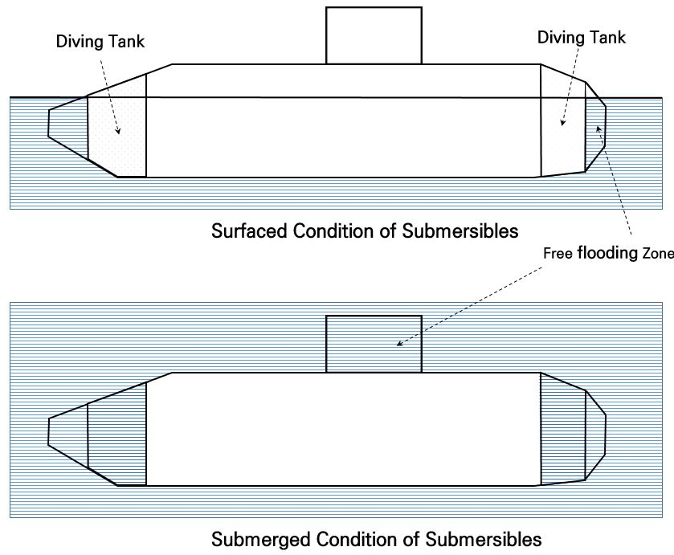
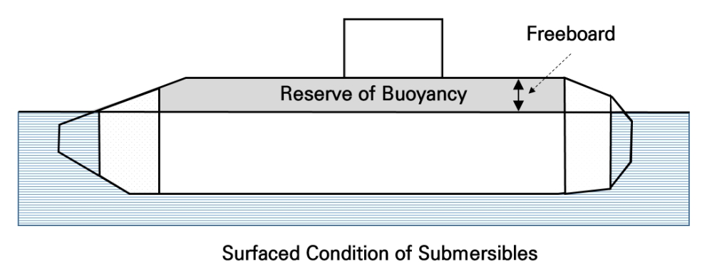
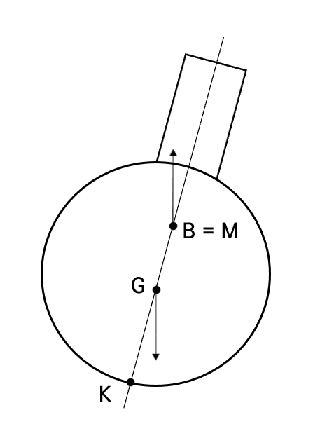
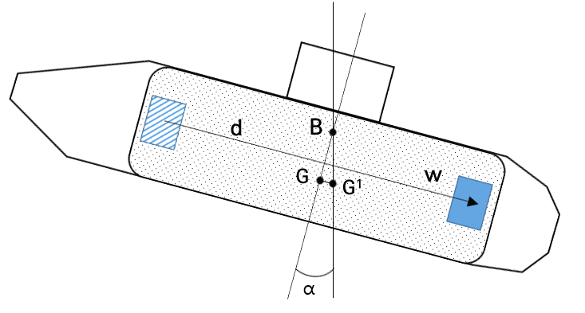
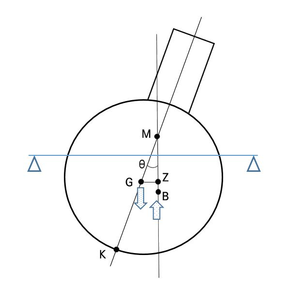
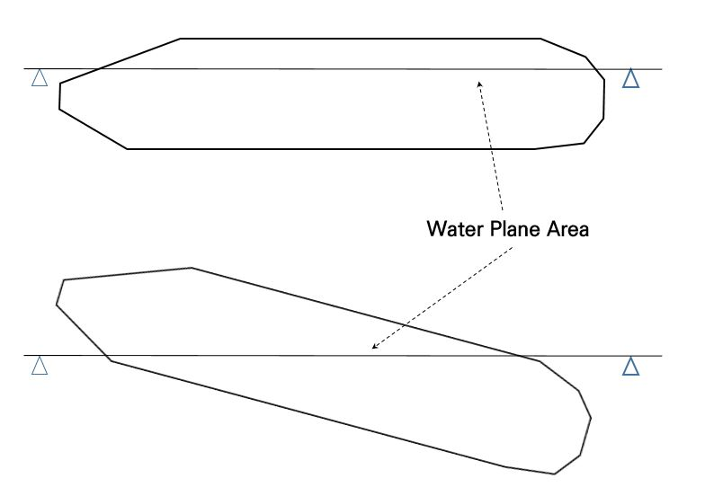
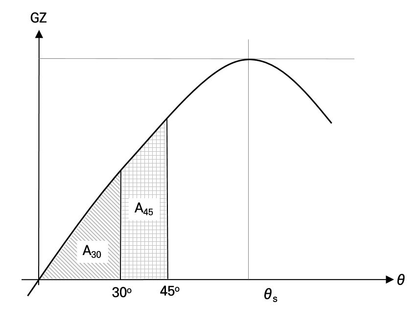
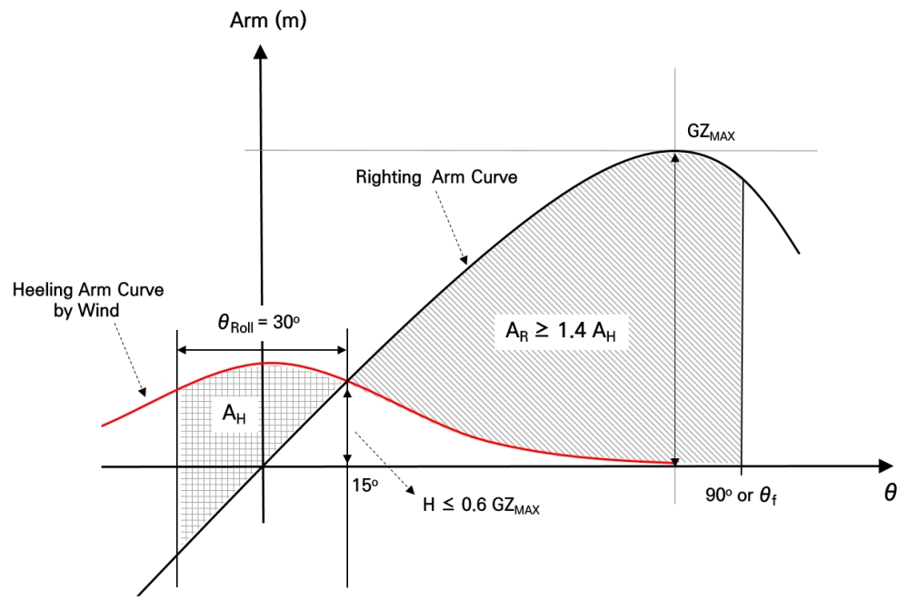
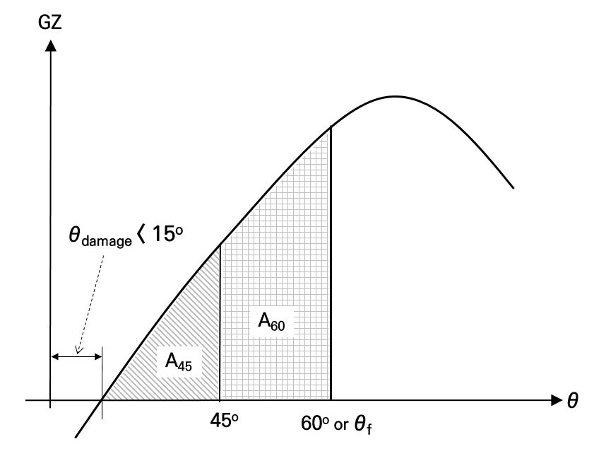
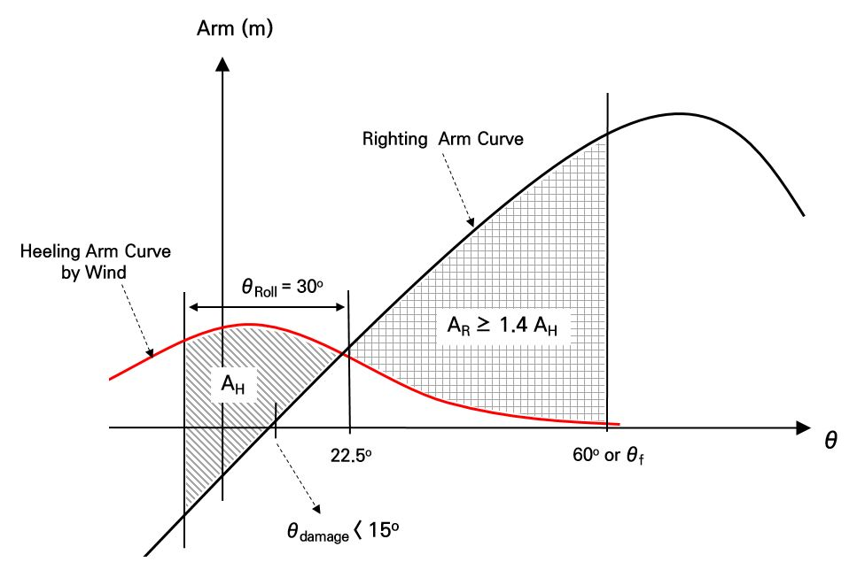

# Underwater Vehicles

> OTHER RULES AND GUIDANCE / RB-05-E / 2025 / EN / Guidance

## Annex 3 Stability of Submersibles (2021)

### 1. General

#### 1.1 Drawing and documents

This Annex shows the minimum requirements for drawings and documents described in 205. Sec.2**,** Ch.1, Part 1 of the Rules. After weight and inclination test, the Trim & stability report and Damage stability report should be submitted to the Society and located onboard always. The drawing and documents for the verification of stability should be included as following;
• general arrangement
• center of gravity and volume/capacity arrangement for all compartment and tanks
• lines plan
• hydrostatic curves.
• report of weight and inclining test
• trim and stability report
• damage stability report

#### 1.2 Definition

- **(1)** Surfaced displacement, $\Delta _{f}$, is the same as the displacement of common surfaced ships. For submersibles, the surface displacement is based on fully boarded crews and passengers or cargo, 50% of filling in trim tanks which controls longitudinal trim, full consumable items, empty compensating tanks and empty diving tanks.
- **(2)** Submerged displacement, $\Delta _{b}$, is resulted from adding a volume of diving tanks to surfaced displacement. Sea water in free flooded zones is not included to this displacement.
- **(3)** Free flooded zone as a part of hull compartments is admitted free inflow and ventilating of sea water.
- **(4)** Diving tanks known as soft ballast are ballast tanks to increase weight for diving. The capacity of diving tanks is to be designed to acquire the equilibrium of buoyancy and weight, known as neutral buoyancy, in submerged condition (refer to Fig. 1).
  
  Fig.1 Diving tanks in surface and submerged condition
- **(5)** Compensating tanks known as hard ballast are ballast tanks to increase or decrease weight for obtaining the equilibrium of buoyancy and weight when decrease of pressure hull volume due to external pressure or decrease of weight due to consumption of fuel and stocks in submerged condition.
- **(6)** Permanent ballast is a kind of fixed ballast in order to obtain the equilibrium of buoyancy and weight. For the case of lack of weight, permanent ballast using heavy material is to be attached to hull bottom. This ballast can be removable for emergency surfacing. For the case of lack of buoyancy, syntactic foam (reinforced glass foam) can be installed to hull in order to get sufficient buoyancy and is to be checked strength to endure the external pressure in the maximum target depth.
- **(7)** Freeboard of submersibles is vertical distance from waterline to freeboard deck which means the upperest deck of compartment to provide the reserve of buoyancy.
- **(8)** Reserve of buoyancy (ROB) means the volume of enclosed space above waterline. The size of ROB is to be designed to retain the sufficient height of freeboard to secure safety of loading/unloading and works on freeboard deck. Also, this ROB is main parameter to decide the capacity of diving tanks (refer to Fig. 2).
- **(9)** Angle of down flooding, $\theta _{f}$, is a heeling angle when flooding is starting at the whether-tight opening, with unavailable closing rapidly, installed superstructure, deck or hull.
  
  Fig. 2 Reserve of buoyancy and freeboard

### 2. Weighting and Inclining Test

#### 2.1 Weighting test

- **(1)** If weighting buoy is used, the buoy, connected vertically on the center of buoyancy of submersibles by cable, should have draught mark corresponding to traction force in submerged condition. Weighting test is to be performed at equilibrium of weight and buoyancy in submerged condition with zero velocity, zero heeling and trimming based on including all variable weights, which are crew, passenger, consumable weights, liquid in pipe and tanks. The weighting test depth is generally less than 30 m as it can be ignorable the volume shrinking of pressure hull due to external pressure.
- **(2)** The other method for weighting test can be applied under the Society approval when applicable.
- **(3)** Before weighting test, the location of each weight in way of longitudinal, transverse and vertical direction is to be reported in order to rearrange for inclining test.

#### 2.2 Inclining test

- **(1)** Generally, the inclining test is to verify LCG, VCG, surfaced and submerged displacement through measuring angle of heeling and trimming after moving of experimental weight in each way of longitudinal and transverse direction.
- **(2)** The test should be performed at protected calm area where is not influencing by the effect of wind and stream.
- **(3)** The specific gravity of water should be measured based on the samples collected from sufficient depth of test site including near surface and be corrected considering temperature of water at the same time if the site has not the certified specific gravity.
  4) The trim of submersibles is to be less than 0.1^o and the number of tanks filled with liquid should be minimized if possible. The free surface effect of tanks is to be considered precisely while test is progressing(refer to 3.3). The capacity and weight of all liquid tanks and compartments are to be checked and recorded. Especially, the bilge tank should be empty and rested air pocket in trimming and air pipes should be emptied.
- **(5)** The experimental weight for inclining must be sufficient to heel and trim 1 ~ 3 degree of angle in way of vessel’s longitudinal and transverse direction. If not available to use solid weight, liquid transference between two symmetric tanks located for each direction may be substituted under approval of the Society.
- **(6)** Several certificated clinometer or pendulums are to be used for correcting the error of measurement.
- **(7)** For verifying submerged displacement, diving tanks are to be fully filled and compensating tanks are to be partially filled to ensure staying in submerged condition with neutral buoyancy. Submerged inclining test must carry out under the condition below Sea-state 2.
- **(8)** For verifying surfaced displacement, the draught data measured from starboard and port sides at amid ship, stern and bow should be averaged. Especially, the capacity of unventilated water in diving tanks is to be reported. Also, all bilge and decks should be dried.
- **(9)** If the change of weight is occurred due to maintenance or conversion, weighting and inclining test should be carried out again in case that the change of weight can not be controlled by the weight compensation tank and affect to stability.

### 3. Intact stability

#### 3.1 Submerged intact stability

- **(1)** Heeling in submerged condition does not induce volumetric change and move the center of buoyancy of submersibles. Also, the location of metacenter is the same as center of buoyancy because water plane is not exist. As shown in below formulas, the height of metacenter, ${\bar{GM}}$, is the same as ${\bar{GB}}$ (refer to Fig. 3). In below formula, $I$ means 2^nd area moment of water plane and $\nabla$ is volume of displacement. The center of gravity is always to be below the center of buoyancy in order to maintain stable state in submerged condition.
  ${\bar{KM}} = {\bar{KB}} + \frac{I _{}}{\nabla } = {\bar{KB}} + \frac{0}{\nabla } = {\bar{KB}}$
  ${\bar{GM}} = {\bar{KM}} - {\bar{KG}} = {\bar{KB}} - {\bar{KG}} = {\bar{GB}}$

  |  |
  | --- |
  | Fig. 3 GB in submerged condition |
- **(2)** For all loading cases in submerged condition, ${\bar{GB}}$ is to be not less than the greater of 0.05 m or as following value (refer to Fig. 4);
  ${\bar{G 1 B}} = {\bar{GB}} \tan \alpha \#

   \#

  {\bar{GB}} \geq \frac{w d}{\Delta  \tan \alpha}$
  where;
  $w$ : moveable weight, in ton, generally 10% of total weight of boardable passengers (73kg/passenger) or cargo,
  $d$ : maximum transformable distance, in mm, in way of longitudinal direction in pressure hull for moveable weight,
  $\Delta$ : total weight, in ton, of submerged displacement with subtraction of water weight in diving tanks,
  $\alpha$ : maximum allowable trimming angle for normal operation of equipments installed in pressure hull, not greater than 25°.

  |  |
  | --- |
  | Fig. 4 Limitation of trimming angle due to moveable weight |

#### 3.2 Surfaced intact stability

- **(1)** The stability of submersibles in surfaced condition is based on ${\bar{GM}}$ in the same manner of surfaced ships. When submersibles is heeling on the surface, the center of buoyancy is moved to new location and the metacenter above center of gravity raises the righting moment (refer to Fig. 5).
  
  Fig. 5 GM in surfaced condition
- **(2)** The bow configuration of submersibles is very different from that of surfaced ships. The change of trim angle due to weight distribution in surfaced condition leads to rapid deceasing of water plane area. The longitudinal transformation of center of gravity should be minimized in surfaced condition (refer to Fig. 6).

  |  |
  | --- |
  | Fig. 6 The change of water plane area due to trimming |
- **(3)** The righting moment arm curve is to be provided from 0° to the angle which is lesser of 90°, angle of down flooding, $\theta _{f}$ or capsizing angle, $\theta _{c}$ for verification of intact stability. The maximum righting moment arm, ${\bar{GZ _{\max }}}$, is to be calculated at not less than 60° of heeling angle. $\theta _{s}$ corresponding to ${\bar{GZ _{\max }}}$ means the limitation of static stability and maximum righting moment. ${\bar{GM}}$ is to be always greater than 0.1m. The intact stability for submersibles should satisfy $A _{30} \geq 0.027 m-rad$ and $A _{45} \geq 0.034 m-rad$ as shown in Fig. 7.

  |  |
  | --- |
  | Fig 7. Requirements of intact stability at surfaced condition |
- **(4)** The effect of wind in way of transverse direction should be considered at the surfaced condition. The heeling moment arm, in m, due to wind is following;
  $H= \frac{0.0195 V ^{2} A h \cos ^{2} \theta}{1000 \Delta _{f}}$
  where;
  $V$ : wind speed, in knots, applied as 100 knots for North Atlantic sea and 80 knots for other areas. If the operation of submersibles is governed by environmental condition, the wind speed under 80 knots may be allowed to apply based on the Society approval.
  $h$ : vertical distance, in m, from the center of side projection area below waterline to the center of area exposed by wind pressure,
  $A$ : area, in m^2, exposed by wind above water line,
  $\theta$ : heeling angle, in radian,
  $\Delta _{f}$ : surfaced displacement, in ton.
  The intact stability against dynamic rolling due to wind should satisfy the requirements as shown in Fig. 8**.** When the total range of rolling is assumed as less than 30^o based on 15^o of heeling angle corresponding to static equilibrium, the area, $A _{R}$, is to be greater than 1.4 times of the area, $A _{H}$, and the heeling moment arm, $H$, is to be less than 60% of maximum righting moment arm.

  |  |
  | --- |
  | Fig. 8 Intact righting and heeling moment arm curve due to rolling by wind |
- **(5)** The icing on the deck and superstructure during winter time can introduce the increment of displacement, change of trim and rise of center of gravity. The submersibles considering the effect of icing are to be satisfied the requirements described in (3) and (4). However, 70% of wind speed required from (4) can be applied. The increment of weight due to icing is 140kg/m^2 for horizontal area and 70kg/m^2 for sloping area.

#### 3.3 Free surface effect

The verification of intact stability must include the free surface effect of liquid tanks in submersibles regardless of submerged or surfaced condition. This effect is to be reflected to correct initial ${\bar{GM}}$ and righting moment arm curve for each heeling angle and each filling level of tanks considering the density of liquid. The free surface effect is to be considered in condition that the filling level is under 100%. The small tank with less than 100L is not applicable to free surface effect. When submersibles stay on the surface, the free surface effect for rest of water in diving tanks is to be included.

### 4. Damaged stability

#### 4.1 General

- **(1)** When the damage is happened in submerged or surfaced state, the submersibles are to be surfacing immediately and stayed in surfaced condition. The damage stability is based on the assumption of staying in the surfaced condition.
- **(2)** The damage stability report is to be included as following;
  • based on the assumption of intact pressure hull for all damage conditions,
  • volume, center of gravity and permeability of ballast tanks,
  • location, closing and tightening type and operation method of opening installed at the bulkhead and deck,
  • detail bilge tank plan and accidental level,
  • calculation results of damage stability for all possible accidents.

#### 4.2 Calculation of damaged stability

- **(1)** Final heeling and trimming angle are to be less than 15^o and 10^o each by each before starting the damage control. The damage righting moment arm curve is to be provided from 0^o to the angle which is lesser of 60^o, or angle of down flooding, $\theta _{f}$. ${\bar{GM}}$ corrected by considering free surface effect is to be greater than 0.0 m. The damage stability for submersibles should satisfy $A _{45} \geq 0.019 m-rad$ and $A _{60} \geq 0.023 m-rad$ as shown in Fig. 9**.**

  |  |
  | --- |
  | Fig. 9 Damage righting moment arm curve of submersibles |
- **(2)** The damage stability against dynamic rolling due to wind should satisfy the requirements as shown in Fig. 10**.** When the total range of rolling is assumed as less than 30° from the 22.5° of heeling angle corresponding static equilibrium, the area, $A _{R}$, is to be greater than 1.4 times of the area, $A _{H}$. 

  |  |
  | --- |
  | Fig. 10 Damage righting and heeling moemnt arm curve due to rolling by wind |

  |   |
  | --- |
  | **RULES AND GUIDANCE FOR CLASSIFICATION OF UNDERWATER VEHICLES** Published by **KR** 36, Myeongji ocean city 9-ro, Gangseo-gu, BUSAN, KOREA TEL : +82 70 8799 7114 FAX : +82 70 8799 8999 Website : http://www.krs.co.kr |
  |   |

  | CopyrightⒸ 2023, **KR** Reproduction of this Rules and Guidance in whole or in parts is prohibited without permission of the publisher. |
  | --- |
