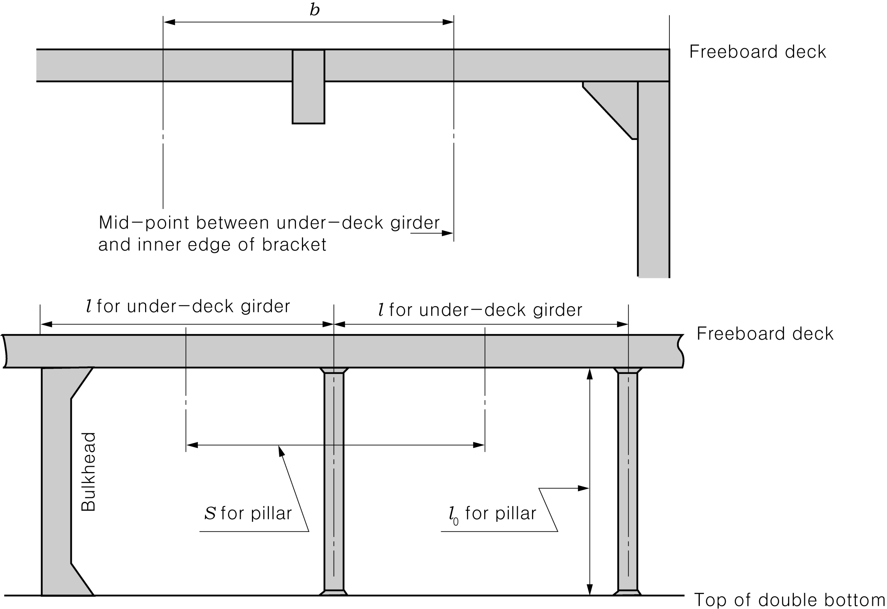

# Rules for the Classification of FRP Ships

> OTHER RULES AND GUIDANCE / RB-07-E / 2025 / EN / Rules

## CHAPTER 11 UNDER-DECK GIRDERS AND PILLARS

### Section 1 Under-deck Girders

#### 101. Arrangement

- **1.** At places where beams need to be supported, underdeck girders or equivalent structures are to be provided in accordance with the requirements in this chapter.
- **2.** Under-deck girders, etc. are to be provided, as necessary, under masts, derrick posts, deck machinery and other heavy concentrated loads.

#### 102. Construction of Girders

Under-deck girders are to be uniform in depth throughout the part between bulkheads and to have sufficient bending rigidity.

#### 103. Section Modulus of Girders

The section modulus of under-deck girders is not to be less than obtained from the following formula:
$Z = C b h l ^{2} \mathrm{cm ^{3} }$
where,
$b$ : Distance between the mid-points of spaces from the girder to the adjacent girders or the inner edges of brackets ($\mathrm{m}$). (See **Fig 11.1**)
$l$ : Distance between the supporting points of girders ($\mathrm{m}$). (See **Fig 11.1**)
$h$ : As specified in **Ch 7, 203.**($\mathrm{kN}/m ^{2}$). Where, however, $h$ is to be in accordance with the requirements in **Ch 7, 203. 3**, $h$ is to be as specified in the followings

#### 104. Supports and Connections at Ends

- **1.** The ends of under-deck girders are to be supported by bulkhead stiffeners. These stiffeners are to be properly strengthened.
- **2.** Where two adjacent under-deck girders or an underdeck girder and a longitudinal bulkhead are not in line in way of a transverse bulkhead, etc., each of them is to be extended beyond the transverse bulkhead, etc. for at least one frame space.
  
  Fig 11.1 Measurement of #eqnID-345, #eqnID-346, #eqnID-347, and #eqnID-348

#### 105. Hat-type Construction

The scantlings of under-deck girders of hat-type construction are to be in accordance with the requirements in **Ch 1, 305.** in addition to those in this chapter.

### Section 2 Pillars

#### 201. Application

Pillars supporting beams are to be in accordance with the requirements in this Chapter.

#### 202. Pillars under Concentrated Loads, etc.

Special supports, by providing pillars or by other suitable means, are to be arranged at the ends and corners of deckhouses, in machinery spaces, at the ends of partial superstructures and under heavy concentrated loads.

#### 203. Sectional Area of Pillars

- **1.** The sectional area of pillars which are made of steel, is not to be less than obtained from the following formula:
  $A= \frac{0.223S b h}{2.72- \frac{l _{0}}{k _{0}}} \mathrm{cm ^{2} }$
  where,
  $S$ : Distance between the mid-points of the spaces from the pillar to the adjacent pillars or to the bulkhead ($\mathrm{m}$). (See **Fig 11.1**)
  $b$ : Distance between the mid-points of the spaces from the pillar to the adjacent pillars or to the inner edges of brackets ($\mathrm{m}$). (See **Fig 11.1**)
  $h$ : As specified in **103.**
  $l _{0}$ : Distance from the lower end of pillar to the lower surface of girder or beam supported by the pillar ($\mathrm{m}$). (See **Fig 11.1**)
  $k _{0}$ : Value obtained from the following formula: $\sqrt {\frac{I}{A}}$
  $I$ : Minimum moment of inertia of pillar ($\mathrm{cm} ^{4}$).
  $A$ : Sectional area of pillars ($\mathrm{cm} ^{2}$).
- **2.** The sectional area of pillars which are made of wood, is not to be less than obtained from the following formula:
  $A= \frac{1.32S b h}{1.51- \frac{l _{0}}{k _{0}}} \mathrm{cm ^{2} }$
  where,
  $S$, $b$, $h$, $l _{0}$ and $k _{0}$ : As specified in the preceding **1.** 
