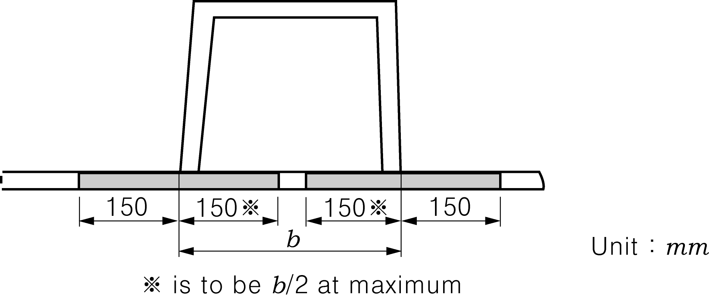

# Rules for the Classification of FRP Ships

> OTHER RULES AND GUIDANCE / RB-07-E / 2025 / EN / Guidance

## CHAPTER 1 GENERAL

### Section 1 General

#### 101. Application 【See Rules】

- **1.** Reductions in the scantlings of FRP Ships intended for Smooth Water Service are to be in accordance with the **Table 1.1.**
- **2.** Reductions in the scantlings other than those given in **Table 1.1** are to be in accordance with the discretion of the Society.

  | Item | Ratio of reduction |
  | --- | --- |
  | ㆍSection modulus of athwartship hull section ㆍThickness of shell laminates(including keel) ㆍMinimum thickness of deck laminates ㆍThickness of single bottom or double bottom members | 10 % |
  | ㆍSection modulus of frame ㆍSection modulus of beam ㆍSection modulus of deck girder | 15 % |
- **3.** Notwithstanding the requirements in **1** and **2**, the scantlings of beams of deck intended to carry cargo, inner bottom plating and inner bottom longitudinals intended to carry heavy cargo, structural members of deep tanks, etc. are not to be reduced exceeding the values specified in the requirements of the relevant chapter.
- **4.** Sill height of hatchway, access opening, etc. may be reduced to the values given in **Table 1.2.**

  | Location | Sill Height |   |   |
  | --- | --- | --- | --- |
  | Location | Small deck opening (area: 1.5 $\mathrm{m} ^{2}$ or below) | Companionway | Access opening in superstructure end bulkhead |
  | Upon upper deck and superstructure deck within fwd 0.25 $L$ | 380 | 300 | 300 |
  | Upon superstructure deck abaft the forward 0.25 $L$ | 230 | 100 | 100 |

#### 103. Direct strength calculations 【See Rules】

- **1.** Where scantlings of structural members are determined based on the direct strength calculation, **ANNEX 3-1 「Guidance for the Direct Strength Assessment」**of **Rules and Guidance for the Classification of High Speed and Light Crafts** should be followed. If the application of the Guidance is considered inappropriate, analysis method, loads and allowable stress as deemed appropriate by the Society may be applied.
- **2.** Based on the results according to the direct strength calculation, the buckling strength of the structural members are to be examined by using the method and allowable stress given in **ANNEX 3-2 「Guidance for the Buckling Strength Calculation」**of **Rules and Guidance for the Classification of High Speed and Light Crafts.**

### Section 2 Definitions

#### 215. Bonding 【See Rules】

Bonding is an operation of connecting the FRP already advanced in cure with other FRP members, timbers, hard plastic foams, etc. through scientific bonding procedure including the following (1) and (2).

#### 219. Hand Lay-Up Method 【See Rules】

The hand lay-up method is to include the method that resins spray is used in impregnating fibreglass reinforcements with resins.

### Section 3 Hull Construction and Equipment

#### 303. Passenger Ships 【See Rules】

Passenger ships are to be accordance with following for the safety.

#### 304. Scantlings 【See Rules】

The effective breadth of FRP laminates of Hat-type construction is to be as shown by hatched areas in **Fig 1.1.**

Fig 1.1 Effective Breath

#### 305. Hat-type Construction 【See Rules】

When the core for moulding of hat-type construction is reckoned in the section modulus, breadth of the core is to be calculated as $(E _{c} /E _{f} ) \cdot b$ as shown in **Fig 1.2**. $E _{c}$ and $E _{f}$ are the modulus of bending elasticity of the core and FRP laminates respectively.
Pine and lauan ----------- 1.0
Plywood for structure ----- 0.8
Other core material ------- To be determined by the test specified in **Ch 3, 209. 2** of the Rules.

Fig 1.2 Inclusion of Core in Calculation

#### 306. Sandwich Construction 【See Rules】

When the core of sandwich construction is reckoned in bending strength, coefficient $C _{2}$ prescribed in **Ch 6, 303. 1** of the Rules is to be determined by the following formula.
$C _{2} = \frac{1}{\sqrt {1- \frac{1- \frac{E _{c}}{E _{f}}}{(1+ \beta ) ^{3}}}}$
where
$E _{c}$ : Modulus of bending elasticity of the core of sandwich construction ($\mathrm{N}/mm ^{2}$).
$E _{f}$ : Modulus of bending elasticity of the outer laminates or inner laminates of FRP of sandwich construction ($\mathrm{N}/mm ^{2}$).
$\frac{E _{c}}{E _{f}}$ : as specified in **305.** of the Guidance.
$\beta$ : as specified in **Ch 6, 303. 1** of the Rules

#### 307. Weight of Fibreglass Reinforcements and thickness of Laminates 【See Rules】

To calculate the thickness of laminates for chopped mats or roving cloths, the following is to be described at the drawings submitted.
