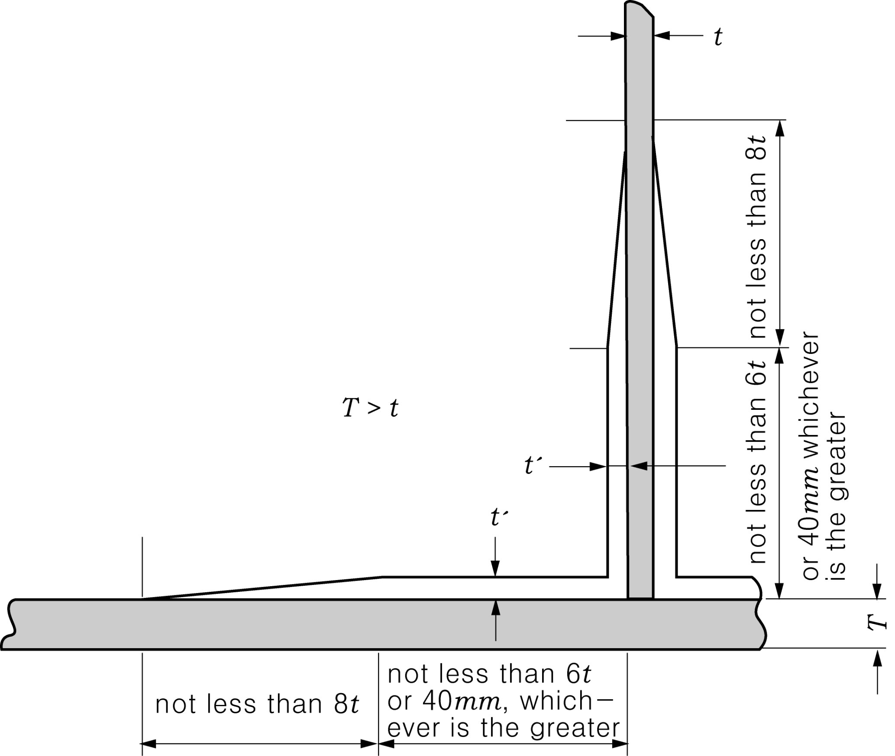

# Rules for the Classification of FRP Ships

> OTHER RULES AND GUIDANCE / RB-07-E / 2025 / EN / Guidance

## CHAPTER 3 MATERIALS

### Section 1 General

#### 102. Approval and Manufacturing Control

- **1.** **Approval**
  - **(1)** FRP ships applied for survey during construction are to be moulded at the workshop approved by Society in accordance with **Ch 2, Sec 13** of **Guidance for Approval of Manufacturing Process and Type Approval, Etc. 【See Rules】**
  - **(2)** FRP materials (fibre reinforcement, resigns and core, etc.) used for FRP ships applied for survey during construction are to be appropriate to **Pt 2, Annex 2-8** of **Rules for the Classification of Steel Ships** and are to be accordance with **Ch 3, Sec 28** of **Guidance for Approval of Manufacturing Process and Type Approval, etc. 【See Rules】**

### Section 2 FRP Materials

#### 202. Resins

- **1.** Test Methods prescribed in **Table 3.1**, Note (1) of the Rules are to be in accordance with **Annex 1, 2. 【See Rules】**
- **2.** Test Methods prescribed in **Table 3.1**, Note (2) of the Rules are to be in accordance with **Ch 3, Sec 28** of **Guidance for Approval of Manufacturing Process and Type Approval, Etc. 【See Rules】**

#### 203. Gelcoats

- **1.** Test Methods prescribed in **Table 3.2**, Note (1) of the Rules are accordance with **Annex 1, 2. 【See Rules】**
- **2.** Test Methods prescribed in Table 3.2, Note (2) of the Rules are accordance with **Ch 3, Sec 28.** of **Guidance for Approval of Manufacturing Process and Type Approval, etc. 【See Rules】**

#### 204. Fibre Reinforcements

- **1.** The regulation in **Table 3.3**, Acceptance criteria (1) of the Rules are to be in accordance with **Pt 2, Annex 2-8** of **Rules for the Classification of Steel Ships. 【See Rules】**
- **2.** Test methods prescribed in **Table 3.3**, Note (1) of the Rules are to be in accordance with **Annex 1, 3. 【See Rules】**
- **3.** Test Methods prescribed in **Table 3.3**, Note (2) and (3) of the Rules are accordance with **Ch 3, Sec 28** of **Guidance for Approval of Manufacturing Process and Type Approval, Etc. 【See Rules】**

#### 206. Core for Sandwich Constructions 【See Rules】

Test Methods prescribed in **Table 3.4**, and **3.5**, Note (1) of the Rules are to be in accordance with **Ch 3, Sec 28.** of **Guidance for Approval of Manufacturing Process and Type Approval, Etc.**

#### 209. Cores for Moulding 【See Rules】

Where the cores for moulding are reckoned in strength, tests are to be carried out on tensile strength and modulus of tensile elasticity or bending strength and modulus of bending elasticity in accordance with **Ch 3, Sec 28** of **Guidance for Approval of Manufacturing Process and Type Approval, Etc.**

### Section 3 FRP

#### 302. FRP Specimen Test 【See Rules】

- **1.** Test Methods for FRP laminating are to be in accordance with **Ch 3, Sec 28** of **Guidance for Approval of Manufacturing Process and Type Approval, etc.**
- **2.** Test methods for sandwich constructions plates are to be in accordance with **Annex 2.** However, those for FRP yachts are to be in accordance with **Ch 3, Sec 4** of **Guidance for Recreational Crafts.** 
