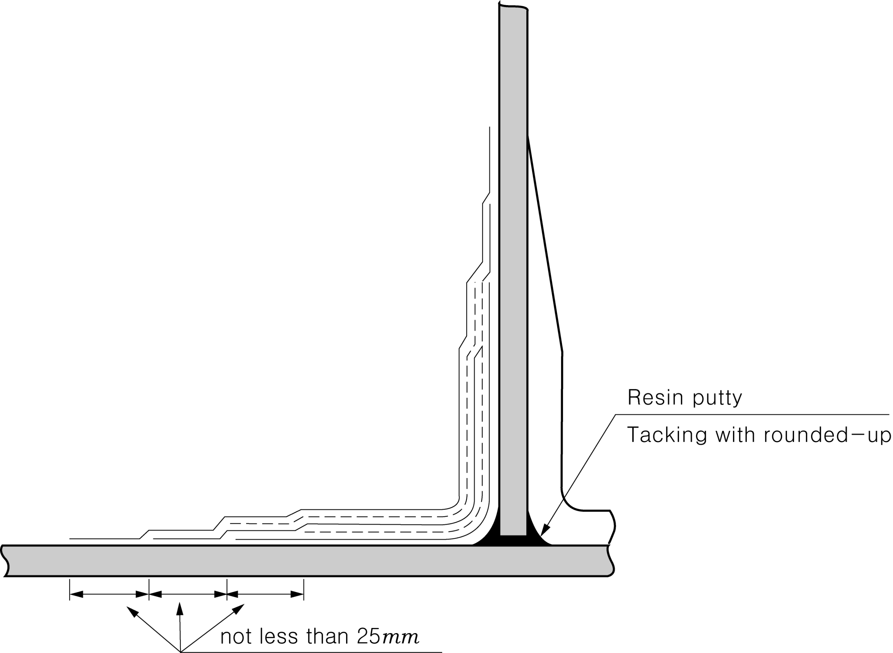

# Rules for the Classification of FRP Ships

> OTHER RULES AND GUIDANCE / RB-07-E / 2025 / EN / Guidance

## CHAPTER 4 MOULDING

### Section 6 Bonding and Fastening

#### 602. Bonding 【See Rules】

- **1.** In case that the surface to be bonded is either of gel coat layer or air cure type resins(paraffin containing type), sanding of the surface is to be carried out by removing at least 0.4 $\mathrm{mm}$ or more of the layer.
- **2.** The first layer of fibreglass reinforcements on the surface to be bonded are not to be of roving cloth but to be of chopped mat. The peripherals of bonded area of partial laminating such as the laminating for increased thickness or the secondary bond are to be so finished as to form smooth tapered ends as shown in **Fig 5.1** and **Fig 5.2** of the Rules.
- **3.** In case of matting-in connections, the number of matting-in layers is to be determined corresponding to the clearance between FRP laminates, and chopped mat impregnated with slightly larger amount of resins(glass content : 25 % or thereabout) is to be inserted in between and to be clamped by a pressure ranging from 300 to 350 $\mathrm{kg}/cm ^{2}$.

### Section 7 Bonded Connections

#### 702. L-Joints 【See Rules】

Where L-joints are used, the overlap thickness $t '$ is to be not less than $t$ for important parts, and not less than $\frac{2}{3} t$ for other parts. 
