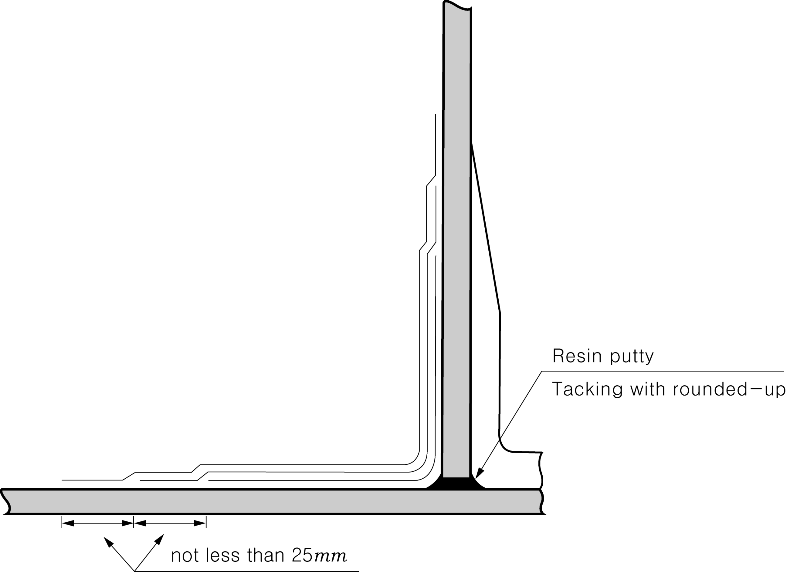

# Rules for the Classification of FRP Ships

> OTHER RULES AND GUIDANCE / RB-07-E / 2025 / EN / Guidance

## CHAPTER 5 LONGITUDINAL STRENGTH

### Section 1 Longitudinal Strength

#### 103. Calculation of Section Modulus of Athwartship Section 【See Rules】

- **1.** The ratios of timbers, structural plywoods and cores of sandwich construction to be reckoned in longitudinal strength are to be as follows.
  - **(1)** Pine and lauan ------------- 1.0
  - **(2)** Structural plywood ---------- 0.8
  - **(3)** Other core materials -------- The value obtained by the tests specified in **Ch 3, 206.** and **209.** of the Rules
- **2.** In case where the structural plywood reckoned in longitudinal strength are provided with scarf joints, the joint length is to be not less than 6 times the thickness as the standard. 
