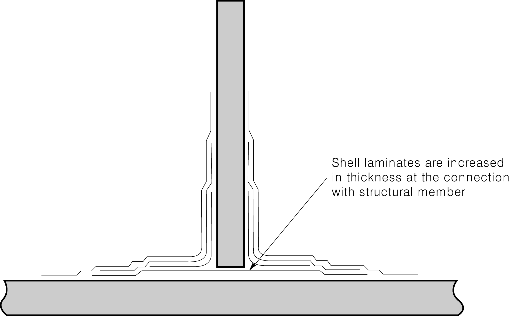

# Rules for the Classification of FRP Ships

> OTHER RULES AND GUIDANCE / RB-07-E / 2025 / EN / Guidance

## CHAPTER 7 DECKS

### Section 2 Minimum Thickness of Deck Laminates

#### 203. Deck Load 【See Rules】

In case where fish catches are carried on deck as in fishing vessels, the deck load $h$ is to be the value specified in **Ch 7, 203. 3** of the Rules or the value obtained from the following formula, whichever is the greater.
$h=0.22L+10 \mathrm{kN/m ^{2} }$ 
