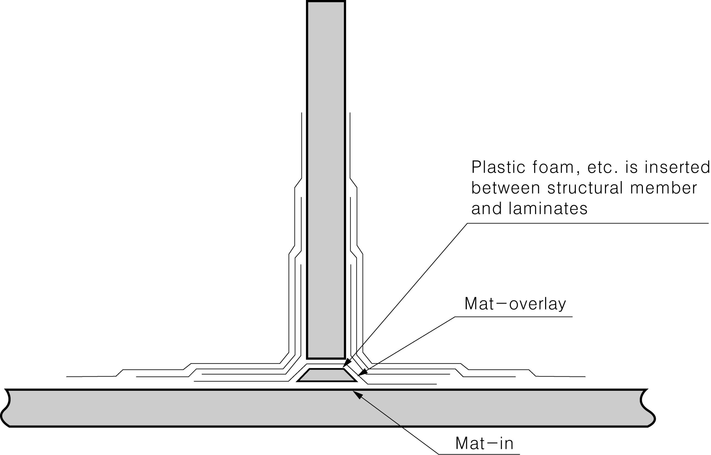

# Rules for the Classification of FRP Ships

> OTHER RULES AND GUIDANCE / RB-07-E / 2025 / EN / Guidance

## CHAPTER 10 BEAMS

### Section 1 Beams

#### 103. Section Modulus of Beams 【See Rules】

In case where fish catches are carried on deck as in fishing vessels, the deck load $h$ is to be of the value specified in **Ch 10, 103.** of the Rules or the value obtained from the following formula, whichever is the greater.
$h=0.15L+6.9 \mathrm{kN/m ^{2} }$ 
