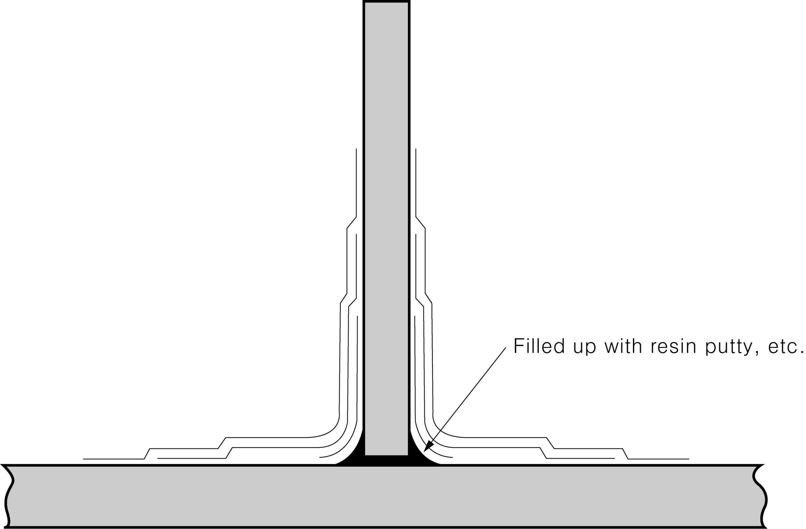

# Rules for the Classification of FRP Ships

> OTHER RULES AND GUIDANCE / RB-07-E / 2025 / EN / Guidance

## CHAPTER 12 WATERTIGHT BULKHEADS

### Section 2 Construction of Watertight Bulkheads

#### 203. Bulkhead Laminates of Structural Plywood 【See Rules】

The bending strength of plywoods may be of the value verified by the **Annex 3**. 
