# Rules/Guidance for the Classification of High Speed and Light Crafts

> OTHER RULES AND GUIDANCE / RB-11-E / 2025 / EN / Rules

## PART 3 HULL STRUCTURES

### CHAPTER 1 DESIGN PRINCIPLES

#### Section 1 Definitions

- **101.** **Application**
  The definitions of symbols and terms used in this part, except otherwise specified, are to be in accordance with this section. And, the symbols and terms, not defined in this rules, are to be in accordance with **Rules for the Classification of Steel Ships**.
- **102.** **Length**
  The length ($L$) of craft means the overall length of the underwater watertight envelope of the rigid hull, excluding appendages, at or below the design waterline in the displacement mode with no lift or propulsion machinery active.
- **103.** **Volume of displacement**
  Volume of displacement ($\nabla$) means volume of displacement corresponding to the design water line ($\mathrm{m} ^{3}$)
- **104.** **Breadth**
  The breadth ($B$) of craft means the breath of the broadest part of the moulded watertight envelope of the rigid hull, excluding appendages, at or below the design waterline in the displacement mode with no lift or propulsion machinery active.
- **105.** **Depth**
  The depth ($D$) of craft means the vertical distance at the middle of *L* measured from the baseline to the top of the freeboard deck beam at side. Where watertight bulkheads extend to a deck above the freeboard deck and are to be registered as effective to that deck, $D$ is the vertical distance to that bulkhead deck.
- **106.** **Load draught**
  The load draught ($d$) means the vertical distance ($\mathrm{m}$) from the top of keel to the load line measured at the middle of *L* with the craft floating at rest in calm water.
- **107.** **Full load displacement**
  The full load displacement ($\Delta$) is the displacement (including shell plating and appendage, etc.) ($\mathrm{t} o n s$) at the load line.
- **108.** **Block coefficient**
  The block coefficient ($C _{b}$) is in as the following formula.
  $C _{b} = \frac{\Delta }{1.025LB _{WL} d}$
  $B _{WL}$ = the breadth of craft at the load line, with the craft at rest. For multihull craft, $B _{WL}$ is the net sum of the waterline breadths.
- **109.** **Maximum speed**
  The maximum speed ($V$) of craft is the speed achieved at the maximum continuous propulsion power for which the craft is certified at maximum operational weight and in smooth water.
- **110.** **Freeboard deck**
  - **1.** The freeboard deck is normally the uppermost continuous deck. However, in cases where openings without permanent means of closing exist on the exposed part of the uppermost continuous deck, or where openings without permanent means of watertight closing exist on the side of the craft below that deck, the freeboard deck is the continuous deck below that deck.
  - **2.** In a craft having a discontinuous freeboard deck, the lowest line of the exposed deck, and the continuation of that line parallel to the upper part of the deck, is taken as the freeboard deck.
  - **3.** Where the designed load draught is less than the draught determined assuming the existing deck below the freeboard deck is the freeboard deck in accordance with the provision in **Pt 3, Ch 1,** **106.,** the existing lower deck is taken as the freeboard deck in the application of the rules. In this case, the lower deck is to be continuous at least between the machinery space and peak bulkheads and continuous athwartships. Where a lower deck is stepped, the lowest line of the deck and continuation of that line parallel to the upper part of the deck is taken as the freeboard deck.
- **111.** **Superstructure**
  The superstructure means a decked structure on the freeboard deck, extending from side to side of the craft or having its side walls at the position not farther than 0.04 $B$ from the side of craft. Raised quarter deck is to be considered as a superstructure.
- **112.** **Deckhouse**
  The deckhouse means a decked structure above the freeboard deck with the side plating being inboard of the shell plating more than 0.04 $B$ from the side of craft.
  long deckhouse : deckhouse having more than 0.2 $L$ of its length within 0.4 $L$ amidship
  short deckhouse : deckhouse, not defined as a long deckhouse
- **113.** **Strength deck**
  The strength deck means the uppermost continuous deck. A superstructure deck which, within 0.4 $L$ amidship, has a continuous length equal to or greater than $l _{D}$ is to be considered as the strength deck instead of the covered part of the uppermost continuous deck.
  For twinhull crafts $l _{D} = 3(L/15 + H) (\mathrm{m})$
  For monohull crafts $l _{D} = 3(B/2 + H) (\mathrm{m})$
  $H$ = height($\mathrm{m}$) between the uppermost continuous deck and the superstructure deck.
- **114.** **Bulkhead deck**
  The bulkhead deck means the highest deck to which the watertight transverse bulkheads except both peak bulkheads extend and are made effective.
- **115.** **Girder**
  The girder is a collective term for primary supporting members, usually a supporting stiffener. Other terms used are bottom, side and deck transverse, floor (a bottom transverse), stringer (a horizontal girder), web frame, and vertical web.
- **116.** **Stiffener**
  The stiffener is a collective term for secondary supporting members. Other terms used are beam, frame, reverse frame (inner bottom transverse stiffeners) and longitudinal.
- **117.** **Displacement mode**
  The displacement mode is the regime, whether at rest or in motion, where the weight of the craft is fully or predominantly supported by hydrostatic forces. Those also mean the states except that the hull is supported by hydrodynamic force for planning crafts and hydrofoil crafts and the hull is supported by air lifting force of pans for hovercrafts.
- **118.** **Non-displacement mode**
  The non-displacement mode is the normal operational regime of a craft when non-hydrostatic forces substantially or predominantly support the weight of craft.
- **119.** **Transitional mode**
  The transitional mode is the regime between displacement and non-displacement modes.
- **120.** **Critical design condition**
  The critical design condition is the limiting specified condition, chosen for design purposes, which the craft should keep in displacement mode. Such condition should be more severe than the worst intended condition by a suitable margin to provide for adequate safety in the survival condition.
- **121.** **Service area restriction notations**
  All high speed and light craft are to be given a service area restriction notations of SA followed by a number. Service area restrictions, ranging from SA0 to SA5, given in nautical miles and representing the maximum distance from nearest harbour of safe anchorage, are given in **Table 3.1.1.**

  | Condition Restriction notation | Summer (Nautical miles) | Winter (Nautical miles) | Tropical (Nautical miles) |
  | --- | --- | --- | --- |
  | SA0 | Unrestricted | 300 | Unrestricted |
  | SA1 | 300 | 100 | 300 |
  | SA2 | 100 | 50 | 250 |
  | SA3 | 50 | 20 | 100 |
  | SA4 | 20 | 5 | 20 |
  | SA5 | 2 | 1 | 5 |
  | NOTE : Seasonal service area restriction is in accordance with ICLL, 1966, Annex II |   |   |   |

#### Section 2 General

- **201.** **Application**
  The requirements in this part are to be applied to light craft, or high speed and light craft constructed in steel, aluminium or fiber composites (FRP) and satisfy relevant requirements given in **Pt 1, Ch 1, 103.**
- **202.** **Equivalency**
  - **1.** The requirements, not defined in these rules, are to be in accordance with **Rules for the Classification of Steel Ships**.
  - **2.** Alternative hull construction, equipment, arrangement and scantlings are to be accepted by the Society, provided that the Society is satisfied that such construction, equipment, arrangement and scantlings are equivalent to those required in rules.
- **203.** **Direct strength calculation 【See Guidance】**
  - **1.** Where approved by Society, scantlings of structure members may be determined based upon direct calculation. Where calculated scantlings based on direct calculation exceed the scantlings required in this part, the former is to be adopted.
  - **2.** Where the direct calculation specified in the **Par 1** is carried out, the data necessary for the calculation are to be submitted to the Society.

#### Section 3 Approval of Plans and Documents

- **301.** **Plans and documents for approval**
  - **1.** In planning the building of a craft which will comply with Classification requirements the following plans and documents are to be submitted for the approval of the Society prior to commencement of the work.
    - **(1)** Midship section
    - **(2)** Construction profile
    - **(3)** Shell expansion
    - **(4)** Watertight and oiltight bulkheads
    - **(5)** Deck plans
    - **(6)** Structure plans of stem, sternframe and rudder
    - **(7)** Superstructure and deckhouse plans
    - **(8)** Engine room structure plans
    - **(9)** Hatchways, hatch covers and coamings arrangements
    - **(10)** Structure plans of propeller shaft brackets(struts), foils and struts supporting foils
    - **(11)** Foundations and relevant structure plan of boilers, main engines, thrust bearings, intermediate shaft bearing, generators and other heavy weight auxiliary components
    - **(12)** Final stability data
    - **(13)** Other plans and documents specified by the Society
  - **2.** When craft are constructed in FRP, the lay-up procedures, joint details, secondary bondings details and materials list are to be submitted along with the approved plans and documents specified in **Par 1** above.
- **302.** **Plans and documents for reference**
  - **1.** In planning the building of a craft which will comply with Classification requirements, the following plans and documents for reference are to be submitted in addition to the plans and documents for approval in **301.**
    - **(1)** General arrangement
    - **(2)** Specifications
    - **(3)** Calculation sheets of longitudinal strength
    - **(4)** Calculation sheets for midship section modulus and scantlings
    - **(5)** Other plans and documents specified by the Society
  - **2.** The final lines, hydrostatic curves, capacity plans, sea trials records and various tests are to be submitted before delivery of the craft.
  - **3.** When the craft is constructed in FRP, moulding procedures and certificates of FRP material tests are to be submitted along with the plans and documents referenced in **Par 1** and **Par 2.**

#### Section 4 Subdivision and Arrangement

- **401.** **General**
  The hull is to be subdivided into watertight compartments as required for the requested service and type notation.
- **402.** **Transverse watertight bulkheads**
  - **1.** The following transverse watertight bulkheads are to be fitted in all craft :
    - **(1)** A collision bulkhead
    - **(2)** A bulkhead at each end of the machinery space(s)
  - **2.** The watertight bulkheads are in general to extend to the freeboard deck. Afterpeak bulkheads may, however, terminate at the first watertight deck above the load line.
  - **3.** The watertight bulkheads in way of the raised quarter or sunken forecastle deck is to extend to the side deck.
  - **4.** For craft with two continuous decks and a large freeboard to the uppermost deck, the following provisions apply.
    - **(1)** When the draught is less than the depth of the second deck, only the collision bulkhead need extend to the uppermost continuous deck. The remaining bulkheads may terminate at the second deck.
    - **(2)** When the draught is greater than the depth to the second deck, the machinery bulkheads, with the exception of the afterpeak bulkhead, are to be watertight to the uppermost continuous deck.
  - **5.** In craft with a raised quarter deck, the watertight bulkheads within the quarter deck region are to extend to this deck.
- **403.** **Collision bulkhead**
  - **1.** The distance $X _{c}$ from the forward perpendicular to the collision bulkhead is to be taken between the limits. However, for the wave piercer, the distance shall be in accordance with Society satisfactions.
    $X c ( \mathrm{\min} \mathrm{imum} it ) = 0.05 L (\mathrm{m})\#
    \#
    X c ( \mathrm{maximum}) it = 3.0 + 0.05 L (\mathrm{m})$
    $L$ = length ($RM m$) of the craft
  - **2.** Minor steps or recesses in the collision bulkhead are to be accepted, provided the requirements to minimum and maximum distances from the forward perpendicular comply with **Par 1.**
  - **3.** For craft having complete or long forward superstructures, the collision bulkhead is to extend to the deck above the freeboard deck. The extension need not be fitted directly over the bulkhead below, provided that the requirements to distances from the forward perpendicular are complied with, and that the part of the freeboard deck forming the step is watertight.
- **404.** **Openings and closing appliances**
  - **1.** Openings may be accepted in watertight bulkheads except in that part of the collision bulkhead situated below the freeboard deck.
  - **2.** Openings situated below the freeboard deck are to have watertight doors with signboards fitted on each door stipulating that the door be kept closed while the craft is at sea.
  - **3.** Openings in collision bulkhead above the freeboard deck are to have watertight doors or an equivalent arrangement. The number of openings in the bulkhead are to be the minimum that are compatible with the craft design and normal operation.
  - **4.** Doors in watertight bulkheads are to be complied with the followings :
    - **(1)** Doors may be hinged or sliding.
    - **(2)** They are to be shown by suitable testing to be capable of maintaining the watertight integrity of the bulkhead.
    - **(3)** Such testing is to be carried out for both sides of the door and shall apply a pressure head 10 % greater than that determined from the minimum permissible height of a down flooding opening.
    - **(4)** Testing may be carried out either before or after the door is fitted into the craft but, where shore testing is adopted, satisfactory installation in the craft is to be verified by inspection and hose testing.
  - **5.** Type approval may be accepted in lieu of testing individual doors, provided the approval process includes pressure testing to a head equal to, or greater, than the required head (refer to above 4.).
  - **6.** All watertight doors are to be capable of being operated when the craft is inclined up to 15¡ and fitted with means of indication in the operating compartment showing whether they are open or closed. All such doors are to be capable of being opened and closed locally from each side of the bulkhead.
  - **7.** Watertight doors are to remain closed when the craft is at sea, except that they may be opened for access. A notice shall be attached to each door to the effect that it is not to be left open.
  - **8.** Watertight doors are to be capable of being closed by remote control from the operating compartment in not less than 20 s and not more than 40 s, and are to be provided with an audible alarm, distinct from other alarms in the area, which will sound for at least 5s but no more than 10s before the doors begin to move whenever the door is closed remotely by power, and continue sounding until the door is completely closed.
  - **9.** The power, control and indicators are to be operable in the event of main power failure, as required by **Pt 6** of the Rules. In passenger areas and areas where the ambient noise exceeds 85 $\mathrm{dB}(A)$ the audible alarm is to be supplemented by an intermittent visual signal at the door.
  - **10.** If the Administration is satisfied that such doors are essential for the safe work of the craft, hinged watertight doors having only local control may be permitted for areas to which crew only have access, provided they are fitted with remote indicators as required by above mentioned **6**.
  - **11.** Where pipes, scuppers, electric cables, etc. are carried through watertight divisions, the arrangements for creating a watertight penetration are to be of a type which has been prototype tested under hydrostatic pressure equal to or greater than that required to be withstood for the actual location in the craft in which they are to be installed. The test pressure is to be maintained for at least 30 min with 10 % greater than that determined from the minimum permissible height of a downflooding opening and there should be no leakage through the penetration arrangement during this period.
  - **12.** Watertight bulkhead penetrations which are effected by continuous welding do not require prototype testing. Valves on scuppers from weathertight compartments, included in the stability calculations, are to have arrangements for remote closing from the operating station.
  - **13.** Where a ventilation trunk forms part of a watertight boundary, the trunk is to be capable of withstanding the water pressure that may be present taking into account the maximum inclination angle allowable during all stages of flooding.
- **405.** **Cofferdams**
  The installation of cofferdams is to be carried out in accordance with **Pt 3, Ch 15, 304. of Rules for the Classification of Steel ship**.
- **406.** **Hydrostatic and watertight tests**
  In the Classification Survey during Construction, hydrostatic and watertight tests are to be carried out in accordance with **Pt 1, Annex-16 Procedures for Testing Tanks and Tight Boundaries.**
- **407.** **Inner bow doors**
  - **1.** Where ro-ro craft are fitted with a bow loading openings, an inner bow door is to be fitted abaft such openings, to restrict the extent of flooding in the event of failure of the outer closure. This inner bow door, where fitted, is to be:
    - **(1)** weathertight to the deck above, which deck shall itself be weathertight forward to the bow loading opening;
    - **(2)** so arranged as to preclude the possibility of a bow loading door causing damage to it in the case of damage to, or detachment of, the bow loading door;
    - **(3)** forward of all positions on the vehicle deck in which vehicles are intended to be carried; and
    - **(4)** part of a boundary designed to prevent flooding into the remainder of the craft.
  - **2.** A craft is to be exempted from the requirement for such an inner bow door where one of the following applies:
    where :
    $A$ : the total area of freeing ports on each side of the deck in $\mathrm{m} ^{2}$ ; and
    $l$ : the length of the compartment in $\mathrm{m}$;
    - **(1)** the vehicle loading deck at the inner bow door position is above the design waterline by a height more than the significant wave height corresponding to the worst intended conditions;
    - **(2)** it can be demonstrated using model tests or mathematical simulations that when the craft is proceeding at a range of speeds up to the maximum attainable speed in the loaded condition at all headings in long crested seas of the greatest significant wave height corresponding to the worst intended conditions, either:
      - **(A)** the bow loading door is not reached by waves or having been tested with the bow loading door open to determine the maximum steady state volume of water which accumulates, it can be shown by static analysis that, with the same volume of water on the vehicle deck(s) the residual stability requirements of the HSC Code are satisfied. If the model tests or mathematical simulations are unable to show that the volume of water accumulated reaches a steady state, the craft shall be considered not to have satisfied the conditions of this exemption. Where mathematical simulations are employed they shall already have been verified against full-scale or model testing;
      - **(B)** bow loading openings lead to open ro-ro spaces provided with guard-rails or having freeing ports complying with the following (C).
      - **(C)** the deck of the lowest ro-ro space above the design waterline is fitted on each side of the deck with freeing ports evenly distributed along the sides of the compartment. These are either to be proven to be acceptable using tests according to (a) above or comply with the following:
        - **(a)** $A \geq 0.3 l$
        - **(b)** the craft is to maintain a residual freeboard to the deck of the ro-ro space of at least 1 $\mathrm{m}$ in the worst condition;
        - **(c)** such freeing ports are to be located within the height of 0.6 $\mathrm{m}$ above the deck of the ro-ro space, and the lower edge of the ports shall be within 0.02 $\mathrm{m}$ above the deck of the ro-ro space; and
        - **(d)** such freeing ports are to be fitted with closing devices or flaps to prevent water entering the deck of the ro-ro space whilst allowing water which may accumulate on the deck of the ro-ro space to drain.
- **408.** **Other provisions for ro-ro craft**
  - **1.** All accesses in the ro-ro space that lead to spaces below the deck shall have a lowest point which is not less than the height required from the tests conducted according to **407. 2** (2) or 3 $\mathrm{m}$ above the design waterline.
  - **2.** Where vehicle ramps are installed to give access to spaces below the deck of the ro-ro space, their openings are to be capable of being closed weathertight to prevent ingress of water below.
  - **3.** Accesses in the ro-ro space that lead to spaces below the ro-ro deck and having a lowest point which is less than the height required from the tests conducted according to **407. 2** (2) or 3 $\mathrm{m}$ above the design waterline may be permitted provided they are watertight and are closed before the craft leaves the berth on any voyage and remain closed until the craft is at its next berth.
  - **4.** The accesses referred to in the above mentioned in **2.** and **3.** are to be fitted with alarm indicators in the operating compartment.
  - **5.** Special category spaces and ro-ro spaces are to be patrolled or monitored by effective means, such as television surveillance, so that any movement of vehicles in adverse weather conditions and unauthorised access by passengers thereto can be detected whilst the craft is underway
- **409.** **Integrity of superstructure**
  - **1.** Where entry of water into structures above the datum would significantly influence the stability and buoyancy of the craft, such structures are to be one of the followings:
    - **(1)** of adequate strength to maintain the weathertight integrity and fitted with weathertight closing appliances; or
    - **(2)** provided with adequate drainage arrangements; or
    - **(3)** an equivalent combination of both measures.
  - **2.** Weathertight superstructures and deckhouses located above the datum are in the outside boundaries to have means of closing openings with sufficient strength such as to maintain weathertight integrity in all damage conditions where the space in question is not damaged. Furthermore, the means of closing are to be such as to maintain weathertight integrity in all operational conditions.
- **410.** **Doors, windows, etc., in boundaries of weathertight spaces**
  - **1.** Doors, windows, etc., and any associated frames and mullions in weathertight superstructures and deckhouses are to be weathertight and are not to leak or fail at a uniformly applied pressure less than that at which adjacent structure would experience permanent set or fail.
  - **2.** For doors in weathertight superstructures, hose tests are to be carried out with a water pressure which is in accordance with **Table 3.1.1** in **Pt 3, Ch 1** of **Rules for the Classification of Steel Ship**.
  - **3.** The height above the deck of sills to doorways leading to exposed decks are to be as high above the deck as is reasonable and practicable, particularly those located in exposed positions. Such sill heights are to in general not be less than 100 $\mathrm{mm}$ for doors to weathertight spaces on decks above the datum, and 250 $\mathrm{mm}$ elsewhere. For craft of 30 $\mathrm{m}$ in length and under, sill heights may be reduced to the maximum which is consistent with the safe working of the craft.
  - **4.** Windows are not to be permitted in the boundaries of special category spaces or ro-ro spaces or below the datum. If required by restrictions in the Permit to Operate, forward facing windows, or windows which may be submerged at any stage of flooding shall be fitted with hinged or sliding storm shutters ready for immediate use.
  - **5.** Side scuttles to spaces below the datum are to be fitted with efficient hinged deadlights arranged inside so that they can be effectively closed and secured watertight.
  - **6.** No side scuttle is to be fitted in a position so that its sill is below a line drawn parallel to and one metre above the design waterline.
- **411.** **Indicators and surveillance**
  - **1.** Indicators are to be provided in the operating compartment for all shell doors, loading doors and other closing appliances which, if left open or not properly secured, could lead to major flooding in the intact and damage conditions.
  - **2.** The indicator system is to be designed on the fail-safe principle and shall show by visual alarms if the door is not fully closed or if any of the securing arrangements are not in place and fully locked, and by audible alarms if such door or closing appliance becomes open or the securing arrangements become unsecured. The indicator panel in the operating compartment is to be equipped with a mode selection function 'harbour/sea voyage' so arranged that an audible alarm is given in the operating compartment if the craft leaves harbour with the bow doors, inner doors, stern ramp or any other side shell doors not closed or any closing device not in the correct position.
  - **3.** The power supply for the indicator systems is to be independent of the power supply for operating and securing the doors.
  - **4.** Television surveillance and a water leakage detection system are to be arranged to provide an indication to the operating compartment and to the engine control station of any leakage through inner and outer bow doors, stern doors or any other shell doors which could lead to major flooding. 

### CHAPTER 2 DESIGN LOADS

#### Section 1 General

- **101.** **General**
  - **1.** The requirements in this chapter apply to the crafts which comply with **Ch 1, 201.**
  - **2.** In cases where crafts are designed according to new concepts to the Society specifications, accelerations or design loads may be modified in consideration of sea conditions and design loads in full scale measurements.
  - **3.** The relationship between allowable speed and significant wave height as restricted is to be stated in the Operating Manual and a signboard stating is to be posted in the wheelhouse.
  - **4.** Installation of an accelerometer at the longitudinal center of gravity (LCG) may be required.

#### Section 2 Accelerations

- **201.** **General**
  - **1.** Accelerations in the craft's vertical, transverse and longitudinal axes are obtained by calculating the corresponding linear acceleration and relevant components of angular accelerations as statistically independent variables. The combined acceleration in each direction is as following formula.
    $a _{c} = \sqrt {\sum _{m=1} ^{n} a _{m} ^{2 _{}}}$
    $n$ : number of independent variables.
  - **2.** In **Par 1** above, transverse or longitudinal component of the angular acceleration is based on the assumption acts simultaneously in the same direction.
- **202.** **Design vertical acceleration**
  - **1.** Design vertical acceleration at the craft's center of gravity $a _{c g}$, is to be specified by the builder, and is normally not to be less than that derived from the formula in **3.**. However, $a _{c g}$ is not to be less than 1.0 $g _{o}$ for SA0 to SA4 and $a _{c g}$ is not to be less than 0.5 $g _{o}$ for SA5. *(2018)*
  - **1-2.** For ship with a speed and length ratio ($V/ \sqrt {L}$ ≥ 3.0), the significant wave height shall not be chosen smaller than given in **Table 3.2.1.** for respective ship types. *(2018)*
  - **2.** The design acceleration at different positions along the craft's length is, unless otherwise established, not to be less than :
    $a _{V} = k _{V} a _{ c g}$
    $k _{V}$ : longitudinal distribution factor taken from **Fig 3.2.1.**

    | Type | $H_S$ *(*$\mathrm{m}$*)* |
    | --- | --- |
    | Passenger, Car ferry, Cargo craft | 0.25 |
    | Patrol boats, naval and naval support vessels | $\mathrm{L} <20 m$ : 0.5 $\mathrm{L} >30 m$ : 1.5 $rm 20 m<= L <= 30 m$ : Linear interpolation |

     
    Fig 3.2.1 Longitudinal Distribution Factor for Vertical Design Acceleration #eqnID-102
  - **3.** The allowable speed corresponding to the design vertical acceleration $a _{c g}$ may be estimated from the formulas for the relationship between instantaneous values of $a _{c g}$, $V$ and $H _{S}$ given as :
    $a _{cg} = \frac{k _{h} g _{o}}{1650} \left( \frac{H _{s}}{B _{WL}} +0.084 \right) (50- \beta _{cg} ) \left( \frac{V}{\sqrt {L}} \right) ^{2} \frac{LB _{WL} ^{2}}{\Delta } (\mathrm{m}/s ^{2} )$
    $H _{S}$ : significant wave height ($\mathrm{m}$).
    $\beta _{c g}$ : deadrise angle at LCG (maximum 30° minimum 10°).
    $B _{W L}$ : waterline breadth at $L$*/*2 ($\mathrm{m}$), for multihull craft, the total breadth of each monohull (exclusive of tunnels) is to be used.
    $g _{o}$ : as given in **Par 1.**
    $k _{h}$ : hull type factor taken from **Table 3.2.2.**
    But, the design vertical acceleration, $a_cg$ needs not be taken greater than 6.0 $g_0$.*(2018)*
    $a _{cg} =6 \frac{H _{s}}{L} \left( 0.85+0.35 \frac{V}{\sqrt {L}} \right) g _{o} (\mathrm{m}/s ^{2} )$
    - **(1)** When $V/ \sqrt {L}$ ≥ 3.0 :
    - **(2)** When $V/ \sqrt {L}$ < 3.0
  - **4.** Unless other values are justified according to accepted theoretical calculations, model tests or full scale measurements, the speed reductions implied by **Par 3** are to be applied. For SWATH and craft with foil assisted hull, accelerations are normally to be determined in accordance with the direct methods above.
  - **5.** Relationships between allowable speed and significant wave height are to be stated in the Appendix to Classification Certificate or drawings.
- **203.** **Horizontal accelerations**
  - **1.** The longitudinal (surge) acceleration is not to be less than that obtained from the following formula:
    $a _{l} =2.5 \frac{C _{W}}{L} \left( 0.85+0.25 \frac{V}{\sqrt {L}} \right) ^{2} g _{o} (\mathrm{m}/s ^{2} )$
    $V/ \sqrt {L}$ : need not be taken greater than 4.0.
    $C _{W}$ : wave coefficient taken from **Fig 3.2.2.** In cases of craft having unrestricted service area restriction notations, the $C _{W}$ is to be determined by the formula below.
    Reduction of $C _{W}$ for restricted service is taken from **Table 3.2.3.**
  - **0.** 08 $L$ : $L$ ≤ 100 $\mathrm{m}$
    6 + 0.02 $L$ : $L$ > 100 $\mathrm{m}$

    | Hull type ; k Monohull, Catamaran ; 1.0 Wave piercer ; 0.9 SES, ACV ; 0.8 Foil assisted hull ; 0.7 SWATH ; 0.7 **Table 3.2.2 Hull Type Factor (**$k _{h}$**)** Hull type k Monohull, Catamaran 1.0 Wave piercer 0.9 SES, ACV 0.8 Foil assisted hull 0.7 SWATH 0.7 |  Fig 3.2.2 Wave Coefficient (#eqnID-134) **Fig 3.2.2 Wave Coefficient (**$C _{W}$**)** |   |
    | --- | --- | --- |
    | Hull type |   | k |
    | Monohull, Catamaran | 1.0 |   |
    | Wave piercer | 0.9 |   |
    | SES, ACV | 0.8 |   |
    | Foil assisted hull | 0.7 |   |
    | SWATH | 0.7 |   |
    | Class notation ; Reduction SA0 ; 0 SA1 SA2 ; 10 *%* SA3 ; 20 *%* SA4 ; 40 *%* SA5 ; 60 *%* **Table 3.2.3 Reduction of** $C _{W}$ Class notation Reduction SA0 0 SA1 SA2 10 *%* SA3 20 *%* SA4 40 *%* SA5 60 *%* |   |   |
    | Class notation | Reduction |   |
    | SA0 | 0 |   |
    | SA1 | 0 |   |
    | SA2 | 10 *%* |   |
    | SA3 | 20 *%* |   |
    | SA4 | 40 *%* |   |
    | SA5 | 60 *%* |   |
  - **2.** Transverse acceleration is not to be less than in the formula below. However, when above the axis of roll, the static component $g _{o} \sin \theta _{r}$ is to be added.
    $a _{t} = \left( 2 \frac{\pi}{T _{R}} \right) ^{2} \theta _{r} r _{r} (\mathrm{m}/s ^{2} )$
    $T _{R}$ : roll period, taken from following formula. However $V/ \sqrt {L}$ need not be taken as greater than 4.0.
    $T _{R} = \frac{\sqrt {L}}{1.05+0.175 \frac{V}{\sqrt {L}}} (s)$
    $\theta _{r}$ = maximum roll inclination, taken from the following formula:
    $\theta _{r} = \frac{\pi h _{W}}{2L} (\mathrm{rad}.)$
    $h _{W}$ : maximum wave height in which 70 % of maximum service speed will be maintained, minimum 0.6 $C _{W}$.
    $r _{r}$ : height above axis of roll, however, axis of roll is to be taken as given for :
    - Axis of roll = waterline (twinhull crafts)
    - Axis of roll = 0.5 $D$ (monohull crafts) *(2020)*

#### Section 3 Sea Pressures

- **301.** **Slamming pressure on bottom**
  - **1.** **Bottom slamming pressure**
    $P _{sl} =1.3k _{l} \left( \frac{\Delta }{nA} \right) ^{0.3} d _{o} ^{0.7} \frac{50- \beta _{X}}{50- \beta _{cg}} a _{cg} ( \mathrm{kN}/m ^{2} )$
    $k _{l}$ : longitudinal distribution factor, taken from **Fig 3.2.3.**
    $n$ : Nos. of hull, (Mono hull craft = 1, Twin hull craft = 2)
    $A$ : design load area ($\mathrm{m} ^{2}$) for element considered, however, A need not for any structure be taken less than 0.002($\Delta /d$).
    $S$ : stiffener spacing ($\mathrm{m}$)
    $l$ : stiffener or girder span ($\mathrm{m}$)
    $d _{0}$ : draft at $L$/2 ($\mathrm{m}$) at normal operation condition at service speed.
    $\beta _{X}$ : deadrise angle at transverse section considered. (maximum 30° minimum 10°)
    $\beta _{c g} , a _{c g}$ : as given in **202. Par 3.**
    
    Fig 3.2.3 Longitudinal Slamming Pressure Distribution Factor (#eqnID-168)

    | 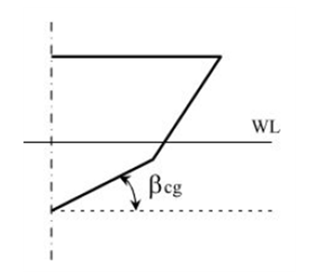 | 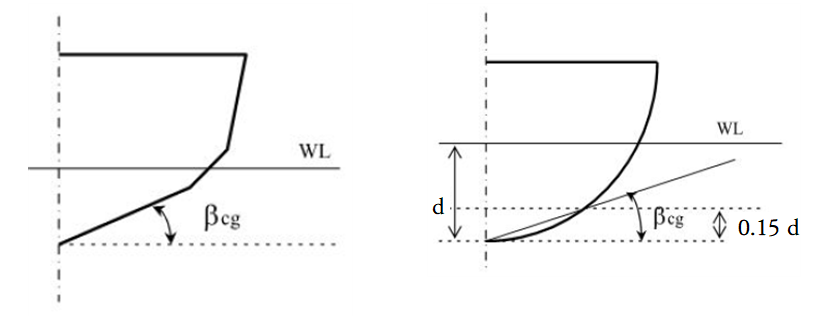 |
    | --- | --- |

    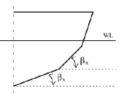
    (a) 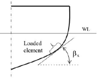
    (b)
    **Fig 3.2.4-1** $\beta_X$
    - **(1)** Slamming pressure on the bottom of craft with speed $V/ \sqrt {L}$ ≥ 3 is to be as following formula :
      - **(A)** plating : $A$ is not to be taken greater than 2.5 $S ^{2}$
      - **(B)** stiffener and girder : $A = S l$
    - **(2)** The bottom slamming pressure need not be applied to craft with no significant hydrodynamic or air cushion lift in normal operating conditions.
    - **(3)** The bottom slamming pressure is to be applied on elements within the area extending from the keel line to chine, upper turn of bilge or pronounced sprayrail.
    - **(4)** Deadrise angle, $\beta _{c g}$ may be estimated according to **Fig.3.2.4***.* *(2018)*
    - **(5)** $\beta_X$ shall be determined as the angle of the tangent of the hull shell at the centre of the element as shown in **Fig 3.2.4-1.** *(2018)*
  - **2.** **Pitching slamming pressure on bottom**
    $P _{sl} = \frac{21}{\tan( \beta _{X} )} k _{a} k _{b} C _{W} \left( 1- \frac{20d _{L}}{L} \right) (0.3/A) ^{0.3} ( \mathrm{kN}/m ^{2} )$
    $k _{a}$ : factor taken from belows.
    Platings : $k _{a}$ = 1.0
    Stiffeners and girders : $k _{a} =1.1-20 \frac{l _{A}}{L}$
    $l _{A}$ : Longitudinal extend of load area.
    $k _{a}$*,max.* = 1.0, $k _{a}$*,min* = 0.35
    $k _{b}$ : factor taken from belows
    plates, longitudinal stiffener and girder : $k _{b}$ = 1.0
    Transverse stiffeners and girders : $k _{b} = \frac{L}{40 l} +0.5$
    $l$ : Span of a stiffener and girder, $k _{b}$*,max.* = 1.0
    $d _{L}$ : lowest service speed draught ($\mathrm{m}$) at F.P. measured vertically from waterline to keel line or extended keel line.
    $\beta _{X}$ : as given in **301, Par 1.**
    $C _{W}$ : as given in **203, Par 1.**
    $l _{P} = \left( 0.1+0.15 \frac{V}{\sqrt {L}} \right) L$
    However, $V/ \sqrt {L}$ need not be taken as greater than 3.0, $l _{P}$ is to be gradually reduced to zero at 0.175 $L$ aft of the above length.
    - **(1)** The pitching slamming pressure on bottom is to be taken following formula.
    - **(2)** Above pressure is to extend within a length from FP and within **Par 1.** (3)
    - **(3)** Pressure on the bottom structure given in **Par 1** and **Par 2** is not to be less than sea pressure as given in **304.**
    - **(4)** Pitching slamming pressure is to be exposed on elements within the area, extending from the keel line to chine, upper turn of bilge or pronounced sprayrail.
- **302.** **Forebody side and bow impact pressure**
  - **1.** Forebody side and bow impact pressure is to be taken as in the following formula. However, $V/ \sqrt {L}$ need not be taken greater than 3.0.
    $P _{sl} = \frac{0.7LC _{L} C _{H}}{A ^{0.3}} \left[ 0.6+0.4 \frac{V}{\sqrt {L}} \sin \gamma \cos(90 {}^{\circ} - \alpha )+ \frac{2.1a _{o}}{C _{B}} \sqrt {0.4 \frac{V}{\sqrt {L}} +0.6} \sin(90 {}^{\circ} - \alpha ) \left( \frac{x}{L} -0.4 \right) \right] ^{2} (\mathrm{kN}/m ^{2} )$
    $A$ : load area for element considered ($\mathrm{m} ^{2}$), however A is not to be taken greater than 2.5 $S ^{2} (\mathrm{m} ^{2} )$. In general, A need not be taken smaller than $LB _{WL} /1000$.
    - plates : A is not to be taken greater than 2.5 $S ^{2} (\mathrm{m} ^{2} )$
    - stiffeners and girders : A need not be taken smaller than $e ^{2} (\mathrm{m} ^{2} )$
    $C _{H}$ : correction factor for length of craft : $C _{H} =1- \frac{0.5}{C _{W}} h _{o}$
    $C _{W}$ may reduced according to **Table 3.2.3.**
    $h _{0}$ : vertical distance in m from waterline at draught $d$ to the load point.
    $e$ : vertical extent of load area, measured along shell perpendicular to the waterline, refer to **Fig 3.2.5.** *(2019).*
    $x$ : distance ($\mathrm{m}$) from $AP$ to position considered.
    $C _{L}$ : correction factor for length of craft, however, $L$ not be taken greater than 100 $\mathrm{m}$
    $C _{L} = \frac{250L-L ^{2}}{15000}$
    $\alpha$ : flare angle taken as the angle between the side plating and a horizontal line, measured at the point considered, refer to **Fig 3.2.6.**
    $\gamma$ : angle between the waterline and a longitudinal line at the point considered, refer to **Fig 3.2.7.**
    $a _{o}$ : acceleration factor : $a _{o} =3 \frac{C _{W}}{L} +C _{V} \frac{V}{\sqrt {L}}$
    $C _{V}$ : as in the following formula, however, not be taken as greater than 0.2
    $C _{V} = \frac{\sqrt {L}}{50}$
    $S$ : as given in **301, Par 1.**
    $C _{W}$ : as given in **203, Par 1.**
    
    **Fig 3.2.5 Vertical extent of load area** ***(2019)***
    
    Fig 3.2.6 Angle #eqnID-222 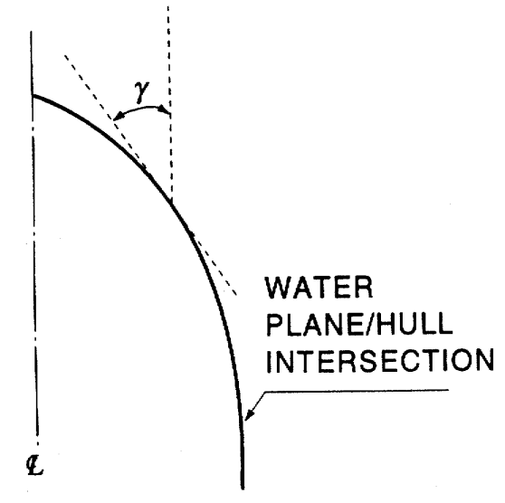
    Fig 3.2.7 Angle #eqnID-223
  - **2.** Forebody side and bow impact pressure given in **304.** shall not be less than the sea pressure.
  - **3.** The impact pressure given in **Par 1** is to extend a length as follows :
    - **(1)** The bow and 0.4 $L$ from FP
    - **(2)** In vertical direction, the impact pressure is to extend from the bottom chine or upper turn of bilge to main deck or vertical part of craft side. The upper turn of bilge is to be taken at a position where the deadrise angle reaches 70° but not higher than the waterline.
    - **(3)** If no pronounced bottom chine or upper turn of bilge is given (v-shape), the impact pressure is to extend from the keel to main deck or from the vertical part of craft side.
- **303.** **Slamming pressure on flat cross structures**
  - **1.** The slamming pressure on flat cross structures (catamaran tunnel top) is to be as following formula :
    $P _{sl} =2.6k _{t } \left( \frac{\Delta }{A} \right) ^{0.3} a _{cg} \left( 1- \frac{H _{C}}{H _{L}} \right) (\mathrm{kN}/m ^{2} )$
    $A$ : as given in **301. 1.**
    $H _{C}$ : minimum vertical distance ($\mathrm{m}$) from WL to load point in operating condition.
    $k _{t}$ : longitudinal pressure distribution factor, refer to **Fig 3.2.8.**
    $H _{L}$ : necessary vertical clearance ($\mathrm{m}$) from WL to load point to avoid slamming, as following formula.
    $H _{L } = 0.22 L (k _{c} - 0.0008 L )$
    $k _{c}$ : hull type clearance factor, refer to **Table 3.2.4.**
  - **2.** Slamming pressure given in **Par 1** is not to be less than sea pressure, as given in **304.**

    | Hull type | Clearance factor |
    | --- | --- |
    | Catamaran | 0.3 |
    | Wave piercer | 0.3 |
    | SES, ACV | 0.3 |
    | Hydrofoil, foil catamaran | 0.3 |
    | SWATH | 0.5 |
- **304.** **Sea pressures**
  - **1.** Pressure acting on the craft's bottom, side (including superstructure side) and weather decks is to be taken as below formulae :
    $P=10h _{o} + \left( k _{s} -1.5 \frac{h _{o}}{d} \right) C _{W} (\mathrm{kN}/m ^{2} )$
    $P = a k _{s} (C _{W} - 0.67 h _{o} ) (\mathrm{kN}/m ^{2} )$
    $h _{o}$ : vertical distance($\mathrm{m}$) from the load line to the load point.
    $k _{s}$ : longitudinal sea pressure distribution factor, refer to **Fig 3.2.9.**
    = 7.5, aft of amidship.
    = 5/$C _{b}$, forward of FP, between specified areas $k _{s}$ shall be varied linearly.
    $a$ = 1.0, for craft's sides and open freeboard deck.
    = 0.8, for weather decks above freeboard deck.
    $C _{W}$ : as given in **203, Par 1.**
    
    Fig 3.2.8 Flat Cross Structure SlammingDistribution Factor (#eqnID-244) 
    Fig 3.2.9 Sea Load Distribution Factor (#eqnID-245)

    | Notation | Sides | Weather decks | Roofs higher than 0.1 $L$ above $WL$ |
    | --- | --- | --- | --- |
    | SA0, SA1, SA2, SA3 | 6.5 | 5 | 3 |
    | SA4 | 5 | 4 | 3 |
    | SA5 | 4 | 3 | 3 |
    - **(1)** For load point below load line :
    - **(2)** For load point above load line. :
    - **(3)** In no case is the value of sea pressure to be less than the value given in **Table 3.2.5.**
  - **2.** The pressure on superstructure end bulkheads and deckhouses is not to be less than following formulae. However, it should not be less than $P _{\min}$.
    $P = a k _{s} (C _{W} - 0.67 h _{o} ) (\mathrm{kN}/m ^{2} )$
    $P _{\min} = 5 + 0.025 L \sin \alpha (\mathrm{kN}/m ^{2} )$
    $\alpha$ : the angle between the bulkhead and deck.
    $a$ = 2.0, for lowest tier of unprotected front.
    = 1.5, for deckhouse fronts.
    = 1.0, for deckhouse sides.
    = 0.8, elsewhere.
    - **(1)** For the lowest tier of unprotected front : $P _{\min} = 5 + (5 + 0.05 L ) \sin \alpha (\mathrm{kN}/m ^{2} )$
    - **(2)** Elsewhere :
  - **3.** The pressure on watertight bulkheads (compartment flooded) is to be taken less than as following formula :
    $P = 10 h _{b} (\mathrm{kN}/m ^{2} )$
    $h _{b}$ : vertical distance ($\mathrm{m}$) from the load point to the top of bulkhead or to the flooded waterline, if deeper
- **305.** **Liquids**
  - **1.** The pressure in deep tanks is to be taken as the greater of the following formulae.
    $P _{1} = \rho (g _{o} + 0.5 a _{V} ) h _{S } (\mathrm{kN}/m ^{2} )$
    $P _{2} = 0.67 \rho g _{o} h _{P} (\mathrm{kN}/m ^{2} )$
    $P _{3} = \rho g _{o} h _{S} + 10 (\mathrm{kN}/m ^{2} )$, for $L$ ≤ 50 $\mathrm{m}$
    $P _{3} = \rho g _{o} h _{S} + 0.3 L - 5 (\mathrm{kN}/m ^{2} )$, for $L$ ＞ 50 $\mathrm{m}$
    $a _{V}$ : as given in **202, Par 2.**
    $h _{S}$ : vertical distance ($\mathrm{m}$) from the load point to the top of tank
    $h _{P}$ : vertical distance ($\mathrm{m}$) from the load point to the top of air pipe or filling station
    $\rho$ : density of liquid ($\mathrm{t}/m ^{3}$), however not to be taken as less than 1.025
  - **2.** The pressure on wash bulkheads is to be as following formula :
    $P = 3.5 l _{t} (\mathrm{kN}/m ^{2} )$
    $l _{t}$ : the greater distance ($\mathrm{m}$) to the next bulkhead forward or aft
- **306.** **Dry cargo, stores and equipment**
  - **1.** The pressure on inner bottom, decks or hatch covers is to be taken as following formula :
    $P = \rho H (g _{o} + 0.5 a _{V} ) (\mathrm{kN}/m ^{2} )$
    $a _{V}$ : as given in **202, Par. 2.**
    $H$ : stowage height ($\mathrm{m}$)
    $\rho$ : density of cargo ($\mathrm{t}/m ^{3}$)
  - **2.** Standard values of $\rho H$ are given in **Table 3.2.6**

    | Decks | Parameters ($\mathrm{kN} \cdot m$) |
    | --- | --- |
    | Weather deck and weather deck hatch covers for cargo | $\rho H = 1.0 \mathrm{t}/m ^{2}$ |
    | Sheltered deck, Sheltered hatch covers and inner bottom for cargo | $\rho = 0.7 \mathrm{t}/m ^{2}$ $H$ : Vertical distance form the load point to the deck above. For load points below hatchways, $H$ is to be measured to the top of coaming |
    | Platform deck in machinery space (s) | $\rho H = 1.6 \mathrm{t}/m ^{2}$ |
    | Accommodation decks | $\rho H = 0.35 \mathrm{t}/m ^{2}$ |
- **307.** **Heavy units**
  The vertical force acting on supporting structures from rigid units of cargo, equipment or other structural components is to be as following formula :
  $P = (g _{o} + 0.5 a _{V} ) M (\mathrm{kN})$
  $a _{V}$ : as given in **202, Par 2**
  $M$ : mass of unit ($\mathrm{t}$)

#### Section 4 Hull Girder Loads

- **401.** **Longitudinal bending, shearing and axial loads**
  - **1.** **General**
    - **(1)** For craft of ordinary hull form with $L/D$ less than 12, with length less than 50 $\mathrm{m}$, the minimum strength standard is normally satisfied for scantlings obtained from local strength requirements.
    - **(2)** For other types of craft, with $L/D$ greater than 12, and for craft with length greater than 50 $\mathrm{m}$, the longitudinal strength is to be calculated as described below.
  - **2.** **Bending moment from slamming pressure**
    $A _{R} =k \Delta \frac{\left( 1+0.2 \frac{a _{cg}}{g _{o}} \right)}{d} (\mathrm{m} ^{2} )$
    $g _{o} , a _{c g}$ : as given in **202, Par 2**
    $k$ = 0.7 for crest landing
    - **(1)** For craft $V/ \sqrt {L}$≥3.0, a slamming pressure is acting on an area equal to the reference area, $A _{R}$:
  - **0.** 6 for hollow landing
    $M _{B} = \frac{\Delta }{2} (g _{o} + a _{cg} ) (e _{w} - 0.25 l _{s} ) (\mathrm{kN} \cdot m)$
    $g _{o} , a _{c g}$ : as given in **202, Par 2.**
    $e _{w}$ : one half of the distance ($\mathrm{m}$) from LCG of the fore half body to the LCG of aft half body of the craft. If not known, $e _{w}$ = 0.25 $L$ (0.2 $L$ for hollow landing).
    $l _{s}$ : longitudinal extension of slamming reference area as :
    $l _{s=} \frac{A _{R}}{b _{S}}$
    $b _{S}$ : breadth of the slamming reference area, refer to **Fig 3.2.12.**
    
    Fig 3.2.10 Crest Landing
    Hollow landing is similar to crest landing except that the reference area $A _{R}$ is situated towards AP and FP, refer to **Fig 3.2.11.** However, ($e _{r} - e _{w}$) is not to be taken as less than 0.04 $L$. The longitudinal midship bending moment is to be as following formula :
    $M _{B} = \frac{\Delta }{2} (g _{o} + a _{cg} ) (e _{r} - e _{w} ) (\mathrm{kN} \cdot m)$
    $g _{o} , a _{c g}$ *:* as given in **202, Par 2.**
    $e _{r}$ : mean distance ($\mathrm{m}$) from the center of $A _{R}$/2 end areas to craft LCG
    $e _{w}$ : as given in preceding (2)
    
    Fig 3.2.11 Hollow Landing 
    Fig 3.2.12 Breadth of Midship Slamming Reference Area
    - **(2)** Crest landing moment
      - **(A)** The load combination illustrated in **Fig 3.2.10** is to be required with actual weight distribution along the hull beam. The longitudinal midship bending moment is to be as below. However, ($e _{w} - 0.25 l _{s}$) is not to be taken as less than 0.04 $L$.
      - **(B)** The reduction of $M _{B}$ towards ends will be determined by weight distribution and the extent of $A _{R}$*.*
    - **(3)** Hollow landing moment
  - **3.** **Planning moment of hydrofoils**
    Hydrofoils longitudinal strength is to be calculated for the most severe conditions. As a rule, this will consider the craft as sustained above the water surface by the foils, and stationary in the navigation condition, taking into account vertical acceleration as well as vertical components of the hydrodynamic action of the water on the foils.
  - **4.** **Hogging and sagging bending moments**
    Investigation of sagging and hogging bending moment (still water + wave), taking into account any immersed/emerged structures, may be required for all craft.
    $M _{hog} = M _{sw} + 0.19 C _{W} L ^{2} B C _{b} (\mathrm{kN} \cdot m)$
    $M _{sag} = M _{sw} + 0.14 C _{W } L ^{2} B (C _{b} + 0.7) (\mathrm{kN} \cdot m)$
    $C _{W}$ : as given in **203, Par 1.**
    $M _{sw}$ : still water bending moment in the most unfavourable loading condition ($\mathrm{kN} \cdot m$)${} ^{1)}$
    if hogging is not known = $0.11 C _{W } L ^{2} B C _{b} (\mathrm{kN} \cdot m)$
    if sagging is not known = 0${} ^{2)}$
    NOTES :
    1) Documentation of the most unfavourable still water condition is normally to be submitted for information.
    2) If still water bending moment is hogging moment, 50 % of this moment may be deducted where the design sagging moment ($M _{sag}$) is calculated.
    $M _{hog} = M _{sw} + 0.19 C _{W} L ^{2} (B _{WL} + k _{2} B _{ t n} ) C _{b} (\mathrm{kN} \cdot m)$
    $M _{sag} = M _{sw} + 0.14 C _{W} L ^{2} (B _{WL} + k _{3} B _{t n} ) (C _{b} + 0.7) (\mathrm{kN} \cdot m)$
    $M _{sw}$ : still water bending moment in the most unfavourable loading condition ($\mathrm{kN} \cdot m$)${} ^{1)}$
    if hogging is not known = 0.5 $\Delta L$ ($\mathrm{kN} \cdot m$)
    if sagging is not known = 0${} ^{2)}$
    NOTES :
    1) Documentation of the most unfavourable still water condition is normally to be submitted for information.
    2) If still water bending moment is hogging moment, 50 % of this moment may be deducted where the design sagging moment ($M _{sag}$) is calculated.
    $B _{tn}$ : breadth of cross structure ($\mathrm{m}$).
    $k _{2}$ and $k _{3}$ : factors for the effect of cross structure immersion in hogging and sagging wave as below. however, not to be taken as less than 0.0
    $k 2 =1- \frac{z-0.5 d}{0.5 d+2 C W}\#
    \#
    k 3 =1- \frac{z-0.5 d}{0.5 d+2.5 C W}$
    $z$ : height ($\mathrm{m}$) from base line to wet deck (top of the tunnel)
    - **(1)** Monohull craft
    - **(2)** Twin hull craft
  - **5.** **Shear forces from longitudinal bending**
    Shear forces of vertical hull girder is to be as following formula :
    $Q _{b} = \frac{M _{B}}{0.25L} (\mathrm{kN})$
    $M _{B}$ : bending moment ($\mathrm{kN} \cdot m$) as given in preceding **Par 2.** (2) and (3).
  - **6.** **Axial loads**
    Axial loads ($Surge = \Delta \cdot a _{l}$), thrust and sea end pressure are to be considered in exposed areas.
    $a _{l}$ : maximum surge acceleration is not to be less than following formulas
    $0.4 g _{o} , \frac{V}{\sqrt {L}} \geq 5$
    $0.2 g _{o} , \frac{V}{\sqrt {L}} \leq 3$
    with linear interpolation for intermediate $V/ \sqrt {L}$
- **402.** **Twin hull loads**
  - **1.** **General**
    - **(1)** The transverse strength of the twinhull connecting structure is to be analysed for moments and forces as specified below.
    - **(2)** Design forces and moments are to be used unless other values are verified by model tests or full scale measurements, or if similar structures provided are satisfactory in service.
    - **(3)** Superstructure is normally not to be included in the structure for transverse strength.
  - **2.** **Transverse bending moment and shear force**
    $M _{S} = \frac{\Delta a _{cg} b}{s} (\mathrm{kN} \cdot m)$
    $b$ : transverse distance ($\mathrm{m}$) between the centerlines of the two hulls.
    $s$ : factor given in **Table 3.2.7.**
    
    Fig 3.2.13 Transverse Vertical Bending Moment and Shear Force
    $M _{S} = M _{SO} (1+a _{cg} / g _{o } ) ( \mathrm{kN} \cdot m)$
    $M _{S} = M _{SO} + F _{y} (z - 0.5 d) ( \mathrm{kN} \cdot m)$
    $M _{SO}$ : transverse bending moment in still water ($\mathrm{kN} \cdot m$) **【See Guidance】**
    $F _{y}$ : horizontal split force on immersed hull, as following formula.
    $F _{y} =3.25 \left( 1+0.0172 \frac{V}{\sqrt {L}} \right) L ^{1.05} d ^{1.3} (0.5B _{WL} ) ^{0.146} \left( 1- \frac{L _{BMAX}}{L} + \frac{L _{BMAX}}{L} ( \frac{B _{\max }}{B _{WL}} ) ^{2.1} \right) H _{1} ( \mathrm{kN})$
    $H _{1}$ = minimum of 0.143B and $H _{(S, \max )}$
    $B _{WL}$ = maximum width (m) in water line (sum of both hulls)
    $B _{\max }$ = maximum width (m) of submerged part (sum of both hulls)
    $L _{BMAX}$ = length in metres where $B _{\max }$/$B _{WL}$ > 1
    $H _{(S, \max )}$ = maximum significant wave height in which the vessel is allowed
    to operate (m)
    $B$ = beam over all (m)
    $z$ : height from base line to neutral axis of cross structure (m).
    $\frac{V}{\sqrt {L}}$need not to be taken greater than 3.
    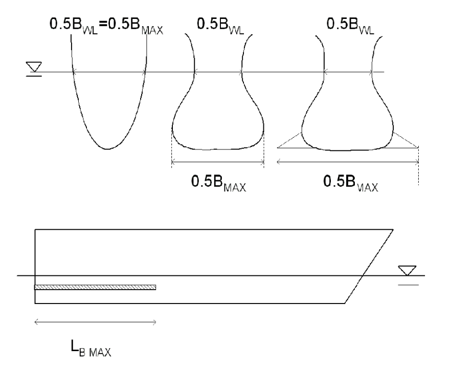
    Definition of parameters in case of different sectional shapes
    $S= \frac{\Delta a _{cg}}{q} (\mathrm{kN})$
    $q$ : factor given in **Table 3.2.7**
    - **(1)** For the twinhull transverse bending moment of craft with $V/ \sqrt {L}$ ≥ 3.0 and $L < 50 \mathrm{m}$, refer to **Fig 3.2.13,** is to be as following formula :
    - **(2)** For craft with $L \geq 50 \mathrm{m}$, the twinhull transverse bending moment is to be the greater of following formula. $B _{WL}$ can here be taken as the waterline breadth at $L/2$ and $V/ \sqrt {L}$ needs not to be taken greater than 3. *(2023)*
    - **(3)** The vertical shear force in centerline between twinhull is to be as following formula :
  - **3.** **Pitch connecting moment**
    The twinhull pitch connecting moment is, refer to **Fig 3.2.14** to be as following formula :
    $M _{p} = \frac{\Delta a _{cg} L}{8} (\mathrm{kN} \cdot m)$

    | Service restriction | $s$ | $q$ |
    | --- | --- | --- |
    | SA4 | 8.0 | 6.0 |
    | SA3 | 7.5 | 5.5 |
    | SA2 | 6.5 | 5.0 |
    | SA1 | 5.5 | 4.0 |
    | SA0 | 4.0 | 3.0 |

     
    Fig 3.2.14 Pitch Connecting Moment on Twinhull Connection
  - **4.** **Twinhull torsional moment**
    The twinhull torsional moment is to be as following formula
    $M _{t} = \frac{\Delta a _{cg} b}{4} (\mathrm{kN} \cdot m)$
    $b$ : as given in **Par 2** 

### CHAPTER 3 STRUCTURE PRINCIPLES IN STEEL

#### Section 1 General

- **101.** **Application**
  - **1.** Hull structures, constructed in materials complying with the requirements in **Sec 2,** are to be comply with requirements in this chapter.
  - **2.** Requirements, not included in this chapter, are to be in accordance with those in **Rules for the Classification of Steel Ships**.
- **102.** **The scantling reduction**
  Scantling reductions for high speed and light craft structures, when compared with ordinary steel ship rules, are based on the following :
  $S _{r} = 0.002(240 + L) (\mathrm{m})$, deep tank bulkheads
  $= 0.76 (\mathrm{m})$, other bulkheads
- **103.** **Bottom, side and deck structures**
  This chapter applies to single skin structures. Based on the changes in total stress pattern, it may also apply to double bottom and other cofferdam type structure adjustments.
- **104.** **Flat cross structure**
  - **1.** A flat cross structure is a horizontal structure above the waterline, such as the bridge connecting structure between twinhulls.
  - **2.** A flat cross structure is normally to be longitudinally stiffened.
  - **3.** The stiffening of the central part of the upper deck is to result in achiving necessary transverse buckling strength.
- **105.** **Bulkhead structures**
  - **1.** **Transverse bulkheads**
    - **(1)** The number and location of transverse watertight bulkheads is to be in accordance with the requirements given in **Ch 1, 402.**
    - **(2)** The stiffening of the upper part of a plane transverse bulkhead is to be such that the necessary transverse buckling strength is achieved.
  - **2.** **Corrugated bulkheads**
    
    Fig 3.3.1 Corrugated Bulkheads
    $S = S _{1}$, spacing for section modulus calculation
    $= 1.05 S _{2}$ or $1.05 S _{3}$, spacing for plate thickness calculations in general
    $= S _{2}$ or $S _{3}$, spacing for thickness calculation when 90 degrees corrugations
    $t = \frac{S _{2}}{50} : \frac{S _{2}}{S _{3}}$ = 0.5
    $t = \frac{S _{2}}{70} : \frac{S _{2}}{S _{3}}$ ≥ 1.0
    Intermediate values are obtained by interpolation.
    $\sqrt {\frac{Z _{rule}}{Z _{act}}}$
    $Z _{rule}$ : required section modulus
    - **(1)** The spacing of corrugated bulkheads is defined according to **Fig 3.3.1.**
    - **(2)** Section modulus and thickness formulas for corrugated bulkheads are same as that of plane bulkheads.
    - **(3)** Thickness of corrugated bulkheads
      - **(A)** Unless the buckling strength is proven satisfactory by direct stress calculations, the following additional requirements apply to corrugated bulkheads.
      - **(B)** For a corrugated bulkhead with a section modulus greater than that required, the required thickness may be multiplied by according to the value.
- **106.** **Supporting bulkheads**
  When bulkheads supporting decks are to be considered as pillars, the compressive load and buckling strength are to be considered.
- **107.** **Definition of span (**$l$**)**
  Effective span ($l$) of stiffener, girder or transverse depends on the design of the end connection as shown on **Fig 3.3.2.**
  
  Fig 3.3.2 Definition of Span (#eqnID-409)
- **108.** **Load point**
  The load point for which the design pressure in **Ch 2** is defined for various strength members is as follows.
  Mid point of horizontally stiffened plating.
  Half of the stiffener spacing above the lower support of vertically stiffened plating, or at the lower edge of plating when the thickness is changed within the plating.
  Mid point of span.
  Mid point of load area.
- **109.** **Buckling strength calculation**
  The buckling strength calculation is to be in accordance with **Pt 3, Ch 3, Sec 4.** of **Rules for the Classification of Steel Ships**.

#### Section 2 Materials and Welding

- **201.** **Materials**
  - **1.** The materials used for hull construction and equipment are to comply with the requirements in **Pt 2, Ch 1,** of **Rules for the Classification of Steel Ships**, unless other specified.
  - **2.** Where materials other than those specified in rules are used, their use and the corresponding scantlings are to be specially approved by the Society.
  - **3.** Where high tensile steels are used for hull construction, the drawings showing their scope and location together with their type and scantlings, must have Society approval.
  - **4.** Steel used for hull construction is to comply with the requirements in **Pt 3, Ch 1, Sec 4.** of **Rules for the Classification of Steel Ships**.
- **202.** **Welding**
  - **1.** Welding is to be in accordance with **Pt 2, Ch 2.**
  - **2.** Welding structures are to be in accordance with **Pt 3, Ch 1, Sec 5.** of **Rules for the Classification of Steel Ships**.
- **203.** **Corrosion protection**
  - **1.** All steel surfaces, except in oil tanks for craft use, are to be protected against corrosion by suitable paint or other effective coating. Inner bottoms and decks for dry cargoes shall be specially considered.
  - **2.** For other materials, such as propellers, provisions are to be made to avoid galvanic corrosion.
  - **3.** Coating specifications, including antifouling, are to state details concerning :
    - **(1)** Metal surface cleaning and treatment before application of primer coat.
    - **(2)** The system for build-up of coating with individual coats.
    - **(3)** Curing time and overcoating intervals.
    - **(4)** Acceptable temperatures of air and metal surfaces.
    - **(5)** Acceptable dryness/humidity conditions during above operations.
    - **(6)** Thickness of individual and final coatings.
  - **4.** **Coatings**
    - **(1)** Before coating, the metal surface is to be properly treated by blast cleaning.
    - **(2)** Shop primer applied over areas which will subsequently be welded, shall have no detrimental effect on the finished welds.
    - **(3)** Coatings are to be compatible with previously applied shop primer. Primer or intermediate coating which have been exposed for some time must be cleaned before application of the next coat.
  - **5.** **Provisions to avoid galvanic corrosion**
    - **(1)** Acceptable provisions are either one of or a combinations of the following.
      - **(A)** Coating of exposed surfaces by moisture.
      - **(B)** Electrical insulation of different metals.
      - **(C)** Cathodic protection.
    - **(2)** In addition to the coating, external cathodic protection of steel hulls can be obtained with aluminium or zinc sacrificial anodes or impressed current.
    - **(3)** If an impressed current system is applied, precautions must be taken to avoid overprotection by means of anode screen and overprotection alarm.
  - **6.** **Specification and documents of cathodic protection**
    - **(1)** Specifications of cathodic protection systems are to state details as follows.
      - **(A)** Areas to be protected.
      - **(B)** Current density demand.
      - **(C)** Anode material and manufacturer.
      - **(D)** Anode weight, distribution and total number.
      - **(E)** Service life of anode.
    - **(2)** The designed service life of the cathodic protection system is normally to be for at least 5 years.
  - **7.** **Deck composition**
    Deck composition is subject to type approval. It is to be of an elastic, non-hygroscopic material. Deck compositions for application in cargo areas are to be suitably reinforced.

#### Section 3 Manufacturing and Inspection

- **301.** **Construction**
  - **1.** Welding of structures, machinery installation and equipment is to be carried out by approved welders, with approved welding consumables.
  - **2.** The welding ambient temperature is higher than -5 ℃
- **302.** **Inspection**
  - **1.** The welding is to be examined by X-ray or by other approved methods in positions indicated by the surveyor.
  - **2.** All weld crossings in the bottom and deck plating, within 0.4 $L$ amidships, are to be examined.
- **303.** **Testing**
  - **1.** All pipe connections to tanks are to be fitted before testing. Protective coating is normally not to be carried out before the tank test.
  - **2.** All watertight/weathertight doors and hatches are to be function tested.
  - **3.** Hydrostatic and watertight tests are to be in accordance with **Pt 3, Ch 1, 209.** of **Rules for the Classification of Steel Ships**.

#### Section 4 Hull Girder Strength

- **401.** **General**
  - **1.** Requirements for longitudinal and transverse hull girder strength are given in this section. In addition, buckling control may be required.
  - **2.** For the craft types and sizes mentioned in **Ch 2, Sec 4,** longitudinal strength has to be checked.
  - **3.** For large, complicated crafts, such as multihull types, a complete, 3-dimensional global analysis of the transverse strength, in combination with longitudinal stress, is to be carried out.
  - **4.** Buckling strength in the bottom and deck is to be inspected.
- **402.** **Deck corners**
  Moulded deck line, rounded sheer strake, sheer strake and stringer plate are defined in **Fig 3.3.3.**
  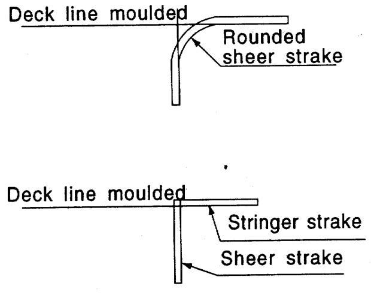
  Fig 3.3.3 Deck Corners
- **403.** **Vertical bending strength**
  As defined, hull section modulus ($Z _{R}$) in midship, is to be greater than as following formula :
  $Z _{R} = \frac{M}{\sigma} \times 10 ^{3} (\mathrm{cm} ^{3} )$
  $M$ : longitudinal midship bending moment ($\mathrm{kN} \cdot m$)
  = $M _{B}$ as defined in **Ch 2, 401, Par 2,** monohull, catamaran and SES in crest and hollow landing.
  = $M _{B}$ as defined in **Ch 2, 401, Par 3,** hydrofoil on foils.
  = $M _{B}$ as defined in **Ch 2, 401, Par 4,** hydrofoil in slowed down condition, ACV, high-speed displacement craft and semi-planning craft in displacement mode.
  $\sigma$ : allowable bending stress as follows.
  $= 175 /K (\mathrm{N}/mm ^{2} )$, in general
  $= 160 /K (\mathrm{N}/mm ^{2} )$, hydrofoil on foils
  $= 140 /K (\mathrm{N}/mm ^{2} )$, planning craft in slowed-down condition
  $K$ : as defined in **501. Par 3.**
- **404.** **Effective section modulus**
  The calculation of section modulus is to be in accordance with **Pt 3, Ch 3, 203.** of **Rules for the Classification of Steel Ships**.
- **405.** **Shear strength**
  - **1.** If doors are arranged in the craft side, the required sectional area of the remaining side plating will be specially considered.
  - **2.** If rows of windows are arranged below the strength deck, sufficient horizontal shear area must be arranged to carry down the midship tension and compression.
  - **3.** In these and other locations with doubtful shear areas, may be taken according to the following formula.
    $\tau _{P} = \frac{\sigma}{\sqrt {3}} (\mathrm{N}/mm ^{2} )$
- **406.** **Transverse strength of twin hull craft**
  - **1.** **Transverse strength**
    - **(1)** The twinhull connecting structure is to have adequate transverse strength related to the design loads and moments in **Ch 2.**
    - **(2)** When calculating the moment of inertia and section modulus of the longitudinal section of the connecting structure, the effective sectional area of transverse strength members is in general the net area with effective flange after deduction of the openings. The effective shear area of transverse strength members is in general the net area after deduction of the openings.
  - **2.** **Allowable stresses**
    When the calculating the strength of twinhulls, applied in loads, and defined in **Ch 2, 402,** the allowable stress are to be followed.
    Equivalent stress is defined as following formula :
    $\sigma _{e} = \sqrt {\sigma _{x} ^{2} + \sigma _{y} ^{2} - \sigma _{x } \sigma _{y} +3 \tau } ^{2}$
    $\sigma _{x}$ : total normal stress in x-direction.
    $\sigma _{y}$ : total normal stress in y-direction.
    $\tau$ : total shear stress in xy-plane.
    Total stress means the arithmetic sum of stresses from hull girder, local forces and moments.
    $K$ : as defined in **501. Par 3.**
    - **(1)** Normal stress : $\sigma = 160 /K (\mathrm{N}/mm ^{2} )$
    - **(2)** Mean shear stress : $\tau = 90 /K (\mathrm{N}/mm ^{2} )$
    - **(3)** Equivalent stress : $\sigma _{e} = 180 /K (\mathrm{N}/mm ^{2} )$
- **407.** **Buckling strength**
  The strength deck or side plating is to be endured the buckling strength subject to hull girder bending stress.

#### Section 5 Platings

- **501.** **Definitions**
  - **1.** Craft side is ranged as defined below :
    - **(1)** Upper bound : the upper deck, including long and short superstructure sides.
    - **(2)** Lower bound : the top of the bottom structure.
    - **(3)** Forward bound : the stem.
    - **(4)** Aft bound : the stern including transom.
  - **2.** The upper bound of the slamming area is at the turn of bilge or chine knuckles, and in cases no knuckles case, the upper bound shall be reached at 1.25 $d(\mathrm{m})$ above keel.
  - **3.** The definitions of symbols used in this chapter, unless specified otherwise, are to be in accordance with the following :
    $t$ : thickness of plating ($\mathrm{mm}$)
    $Z$ : section modulus of stiffeners ($\mathrm{cm} ^{3}$)
    $S$ : stiffener spacing measured along the plating ($\mathrm{m}$)
    $S _{r}$ : basic stiffener spacing ($\mathrm{m}$), as defined
    $S _{r} = 0.002(240 + L) (\mathrm{m})$
    $S _{r}$ = 0.76 ($\mathrm{m}$), for watertight bulkheads, cargo hold bulkheads, superstructure and deckhouse bulkheads
    $l$ : stiffener span ($\mathrm{m}$) measured along the top flange of the member
    $\sigma$ : allowable bending stress ($\mathrm{N}/mm ^{2}$)
    $P$ or $P _{s l}$ : design pressure ($\mathrm{kN}/m ^{2}$) as defined in **Ch 2.**
    $Z _{A}$ : midship section modulus ($\mathrm{cm} ^{3}$), as built at deck or bottom respectively
    $Z _{R}$ : midship section modulus ($\mathrm{cm} ^{3}$), as defined in **401.**
    $k _{a}$ : correction factor for aspect ratio of plating field, see **Table 3.3.1.**
    $k _{r}$ : correction factor for curved plating, as following formula
    $k _{r} = (1-0.5 S/r)$
    $r$ : radius of curvature ($\mathrm{m}$)
    $K$ : material factor in **Table 3.3.2,** as defined in **Table 2.1.5. of Pt 2, Ch 1.** of **Rules for the Classification of Steel Ships**.

    | $s / l$ | $k _{a}$ |
    | --- | --- |
    | 1.0 = $s / l$ | 0.72 |
    | 0.4 < $s / l$< 1.0 | (1.1 - 0.25$s / l ) ^{2}$ |
    | $s / l$ = 0.4 | 1.0 |

    | Material notation | $K$ |
    | --- | --- |
    | *RA, RB, RD, RE* | 1.0 |
    | *RA* 32, *RD* 32, *RE* 32, *RF* 32 | 0.78 |
    | *RA* 36, *RD* 36 *RE* 36, *RF* 36 | 0.72 |
    | *RA* 40 *RD* 40, *RE* 40, *RF* 40 | 0.68 |
- **502.** **Keel plating**
  - **1.** The keel plating is to extend over the complete length of the craft. The breadth is not to be less than that obtained from the following formula :
    $b = 750 + 4.5 L (\mathrm{mm})$
  - **2.** The thickness of keel plating is not to be less than the values according to the formula below. The thickness is, in no case, to be less than that of the adjacent bottom plating.
    $t = (7.0 + 0.05 L) \frac{S}{S _{r}} (\mathrm{mm})$
    $S / S _{r}$ is not to be taken less than 0.5 or greater than 1.0.
- **503.** **Bottom and bilge plating**
  - **1.** The thickness of bottom and bilge plating is not to be less than that obtained from the following formula :
    $t _{1} = \frac{15.8S \sqrt {P or P _{sl}}}{\sqrt {\sigma }} ( \mathrm{mm})$
    The following extended formula for thickness of plating exposed to lateral pressure may be used when relevant.
    $t _{2} = \frac{15.8k _{a} k _{r} S \sqrt {PK or P _{sl} K}}{\sqrt {\sigma }} (\mathrm{mm})$
    $S, k _{a} , k _{r}$ and $K$ : as defined in **501.**
    $P$ : sea pressure or internal tank pressure, as defined in **Ch 2, 304** or **305.**
    $P _{s l}$ : static pressure equivalent to slamming, as defined in **Ch 2, 301.**
    *s* : allowable stress, as defined in **Table 3.3.3.** Between specified regions the s-value may be varied linearly.

    | Position | $\sigma (\mathrm{N}/mm ^{2} )$ |
    | --- | --- |
    | Within 0.4 $L$ | 120 for $P$ |
    | Within 0.4 $L$ | 160 for $P _{s l}$ |
    | 0.1 $L$ from perpendicular | 160 |
  - **2.** The thickness of bottom and bilge plating is not to be less than that obtained from the following formula :
    $t _{\min} = (5.0 + 0.04 L) \frac{S}{S _{r}} (\mathrm{mm})$
    $S / S _{r}$ is not to be taken less than 0.5 or greater than 1.0.
  - **3.** The thickness of bilge plating is not to be less than that of the adjacent bottom and side platings, whichever is the greater.
  - **4.** Plating in way of rudder bearings, shaft brackets, etc. may have to be increased to 2 times that of the adjacent platings.
- **504.** **Side plating**
  - **1.** The thickness of side plating is not to be less than that obtained from the following formula :
    $t _{l} = \frac{15.8S \sqrt {P or P _{sl}}}{\sqrt {\sigma }} (\mathrm{mm})$
    The following extended formula for thickness of plating exposed to lateral pressure may be used when relevant.
    $t _{2} = \frac{15.8 k _{a} k _{r} S \sqrt {PK or P _{sl} K}}{\sqrt {\sigma }} (\mathrm{mm})$
    $S, k _{a} , k _{r}$ and $K$ : as defined in **501.**
    $P$ : as defined in **503. Par 1.**
    $P _{s l}$ : as defined in **Ch 2, 302** or **303.**
    $\sigma$ : allowable stress, as defined in **Table 3.3.4**
  - **2.** The thickness of side plating is not to be less than formula defined in **503. Par 2.**

    |   | Position | $\sigma ^{(1)} (\mathrm{N}/mm ^{2} )$ |
    | --- | --- | --- |
    | Longitudinal Stiffening | Within 0.4 $L$ at neutral axis | 180 |
    | Longitudinal Stiffening | Within 0.4 $L$ at deck or bottom - pressure ($P$) - slamming pressure ($P _{s l}$) | 120 160 |
    | Longitudinal Stiffening | Within 0.1 $L$ from perpendiculars | 180 |
    | Transverse Stiffening | Within 0.4 $L$ at neutral axis | 160 |
    | Transverse Stiffening | Within 0.4 $L$ at deck or bottom - pressure ($P$) - slamming pressure ($P _{s l}$) | 60 $Z _{A} /Z _{R}$ max. 120 120 $Z _{A} /Z _{R}$ max. 160 |
    | Transverse Stiffening | Within 0.1 $L$ from perpendiculars | 160 |
    | NOTE: (1) Between specified regions the *s*-value may be varied linearly. |   |   |
- **505.** **Sheer strake at strength deck**
  - **1.** The breadth of sheer strake is not to be less than that obtained from the following formula :
    $b = 800 + 5 L (\mathrm{mm})$
  - **2.** The thickness of monohull craft with L > 50m is not to be less than that obtained from the following formula :
    $t = \frac{t _{1} + t _{2}}{2} (\mathrm{mm})$
    $t _{1}$ : required thickness of side plating, defined in **504.**
    $t _{2}$ : thickness of strength deck plating, defined in **506.** $t _{2}$ is not to be taken less than $t _{1}$.
  - **3.** If the end bulkhead of a superstructure is located within 0.5 $L$ amidships, the side plating should be given a smooth transition to the sheer strake below.
    $L < 60 \mathrm{m}$ : $L$/25
    $L \geq 60 \mathrm{m}$ : 2.5 $\mathrm{m}$
    $L < 60 \mathrm{m}$ : (1 + 0.005 $L$) times of thickness, defined in previous **Par 2.**
    $L \geq 60 \mathrm{m}$ : 1.3 times of thickness, defined in previous **Par 2.**
    - **(1)** The range for the sheer strake with increase thickness
    - **(2)** The increase thickness of sheer strake
- **506.** **Strength deck plating**
  - **1.** The thickness of strength deck plating is not to be less than that obtained from the following formula :
    $t = (t _{0} + 0.025 L) \frac{S}{S _{r}} (\mathrm{mm})$
    $t _{0}$ : defined in **Table 3.3.5** considering that deck position and $S/S _{r}$ is not to be taken values defined in **Table 3.3.5.**

    | Deck | $t _{0}$ | $S/S _{r}$ |
    | --- | --- | --- |
    | Unsheathed weather and cargo decks | 5.0 | 1.0 |
    | Accommodation deck | 4.5 | 0.5 |
    | Weather and cargo deck sheathed with wood or an approved composition | 4.5 | 0.5 |
  - **2.** If the end bulkhead of a long superstructure is located within 0.5 $L$ amidship, the stringer plating is to be increased in thickness for a length of 3 $\mathrm{m}$ on each side of the superstructure end bulkhead. The increase in thickness is to be 20 %.
  - **3.** If hatch opening corners of streamlined shape are not adopted, the thickness of deck plating in strength deck at hatch corners is to be increased by 25 %.
- **507.** **Plating of deck below or above strength deck**
  - **1.** The thickness of deck plating below or above strength deck is not to be less than following formula, and the deep tank boundary deck plating is not to be less than the thickness, defined in **508.**
    $t = (t _{0} + 0.02 L) \frac{S}{S _{r}} (\mathrm{mm})$
    $t _{0}$ : defined in **Table 3.3.6** considering that deck position and $S/S _{r}$ is not to be taken values defined in **Table 3.3.6.**

    | Deck | $t _{0}$ | $S/S _{r}$ |
    | --- | --- | --- |
    | Unsheathed weather and cargo decks | 4.5 | 1.0 |
    | Accommodation deck | 4.5 | 1.0 |
    | Weather and cargo deck sheathed with wood or an approved composition | 4.0 | 0.5 |
- **508.** **Bulkhead plating**
  - **1.** The thickness of bulkhead or tank boundary bulkhead is not to be less than that obtained from the following formula :
    $t _{1} = \frac{15.8 S \sqrt {P}}{\sqrt {\sigma }} (\mathrm{mm})$
    The following extended formula for thickness of plating may be used when relevant.
    $t _{2} = \frac{15.8 k _{a} k _{r } S \sqrt {PK}}{\sqrt {\sigma }} (\mathrm{mm})$
    $S, k _{a} , k _{r}$ and $K$ : as defined in **501.**
    $P$ : design load, defined in **Ch 2, 305.**
    $\sigma$ : allowable stress, defined in **Table 3.3.7.**

    | Bulkheads and locations |   |   |   | $\sigma ^{(1)} (\mathrm{N}/mm ^{2} )$ |
    | --- | --- | --- | --- | --- |
    | Longitudinal bulkheads | Transverse stiffening | Within 0.4 $L$ | Neutral axis | 140 |
    | Longitudinal bulkheads | Transverse stiffening | Within 0.4 $L$ | Deck or bottom | 60 $Z _{A} /Z _{R}$, max. 120 |
    | Longitudinal bulkheads | Transverse stiffening | Within 0.1 $L$ from perpendiculars |   | 160 |
    | Longitudinal bulkheads | Longitudinal stiffening | Within 0.4 $L$ | Neutral axis | 160 |
    | Longitudinal bulkheads | Longitudinal stiffening | Within 0.4 $L$ | Deck or bottom | 120 |
    | Longitudinal bulkheads | Longitudinal stiffening | Within 0.1 $L$ from perpendiculars |   | 160 |
    | Transverse bulkheads (tank and cargo hold bulkheads) |   |   |   | 160 |
    | Collision bulkhead |   |   |   | 160 |
    | Other watertight bulkheads |   |   |   | 220 |
    | NOTE: (1) Between specified regions the *s*-value may be varied linearly. |   |   |   |   |
  - **2.** The thickness of the tank boundary bulkhead is not to be less than that obtained from the following formula :
    $t = (5+ 0.025 L) \frac{S}{S _{r}} (\mathrm{mm})$
    $S / S _{r}$ is not to be taken less than 0.5 or greater than 1.0.
  - **3.** The thickness of other bulkhead is not to be less than that obtained from the following formula. However the thickness is not to be less than 3.0 $\mathrm{mm}$*.*
    $t = 8 S (\mathrm{mm})$
  - **4.** For platings in afterpeak bulkhead in way of sterntube, increased thickness or doubling may be required.
- **509.** **End bulkheads of superstructures and deckhouses, and exposed sides in deckhouses**
  - **1.** The thickness of end bulkheads of superstructures and deckhouses and exposed sides in deckhouse bulkhead is not to be less than that obtained from the following formula :
    $t = 1.25 S \sqrt {P} (\mathrm{mm})$
    $P$ : design load, defined in **Ch 2, 307.**
  - **2.** The thickness of end bulkheads of superstructure and deckhouse is not to be less than that obtained from the following formula :
    $t = (5.0 + 0.01 L) \frac{S}{0.76} (\mathrm{mm})$
    $S$ is not to be taken less than 0.38.
    $t$ is not to be taken less than 2.5 $\mathrm{mm}$
    - **(1)** For the lowest tier
    - **(2)** For higher tiers : $t = 6.5 S (\mathrm{mm})$
- **510.** **Machinery casings**
  The thickness of machinery casings protected by closed superstructure and deckhouse is not to be less than the following formula. However, thickness is not to be less than 4.0 $\mathrm{mm}$.
- **511.** **Bulwark plating**
  - **1.** **The thickness of bulwark**
    maximum : 6 $\mathrm{mm}$, minimum : 3 $\mathrm{mm}$
    - **(1)** The thickness of bulwark plating is not to be less than required for side plating in a superstructure in the same position if the height of the bulwarks is 1.8 $\mathrm{m}$.
    - **(2)** If the height of bulwark is 1 $\mathrm{m}$ or less, the thickness need not be greater than that obtained form the following formula : $t = 80 S (\mathrm{mm})$
    - **(3)** For intermediate heights, the thickness of the bulwark may be found by interpolation.
  - **2.** Long bulwarks are to have expansion joints within 0.6 $L$ amidship.
  - **3.** Where bulwarks are on exposed decks form wells, ample provision is to be made for freeing the decks of water.
  - **4.** Bulwarks for ships with $L$ > 50 $\mathrm{m}$ are in general not to be welded to the top of the sheer strake within 0.6 $L$ amidship. Such weld connections may, however, be accepted upon special consideration of design, thickness and material grade.

#### Section 6 Stiffeners

- **601.** **General**
  - **1.** Where the angle between the web of stiffeners and shell plating is less than 75 ° the section modulus is to be suitably increased above the normal requirements and, where necessary, the tripping brackets should be fitted.
  - **2.** Unless specified otherwise, the section modulus of members required by the rules are those including steel platings with the effective breadth of 0.1 $l$ is not to exceed one-half of the spacing of member. $l$ is the length specified in the relevant chapter.
  - **3.** Equal angles should be avoided for full bending due to reduced effective free flange by torsional stresses, and tripping effects.
  - **4.** The thickness of web and flange is not to be less than the following values, defined in **Table 3.3.8.**

    | Structures |   | Scantling |
    | --- | --- | --- |
    | Thickness of flat bar |   | 1/15 × flat depth |
    | Profile | Thickness of web | 1/50 × web depth(in case, net shear area ≥ 0.075 *l*) |
    | Profile | Thickness of flange | 1/15 × flange width |
- **602.** **Longitudinals**
  - **1.** The section modulus of bottom, side longitudinals, longitudinal beams and longitudinal stiffeners in longitudinal bulkhead is not to be less than that obtained from the following formula :
    $Z _{1} = \frac{k(P or P _{sl} )Sl ^{2}}{\sigma} (\mathrm{cm} ^{3} )$
    However, the following extended formula may be used when necessary.
    $Z _{2} = \frac{1000(P or P _{sl} )Sl ^{2}}{m \sigma} ( \mathrm{cm} ^{3} )$ *(2020)*
    $l$ : span of the stiffeners ($\mathrm{m}$), defined in **Ch 3, 107.**
    $S$ : spacing of stiffeners ($\mathrm{m}$).
    $m$ : bending moment factor, defined in **Table 3.3.12,** for load and boundary conditions, not defined in **Table 3.3.12** $m$-values are directly from general elastic bending theory.
    $K$ : material factor, defined in **Table 3.3.2.**
    $P$ or $P _{s l}$ : load or impact pressure, defined in **Ch 2.**
    $k$ : 83
    $\sigma$ : allowable stress, defined in **Table 3.3.9.** Between specified regions the s-value may vary linearly.
  - **2.** The bottom longitudinals should preferably be continuous through transverse members. If they are to be cut at transverse members, continuous brackets connecting the ends of the longitudinals are to be fitted.
  - **3.** In case of a keel plating, the distance between the center girder and the first longitudinal should not exceed 400 $\mathrm{mm}$.

    | Locations |   | $\sigma (\mathrm{N}/mm ^{2} )$ |
    | --- | --- | --- |
    | Within 0.4 $L$ | Deck or bottom | 95, $Z _{A} = Z _{R}$ (150 for planning slam) 160, $Z _{A} \geq 2Z _{R}$ |
    | Within 0.4 $L$ | Within 0.25 $D$ above and below the neutral axis | 160/K |
    | 0.1 $L$ from the perpendiculars |   | 160/K |
    | Decks and tops of short superstructures |   | 160/K |
- **603.** **Transverse frames**
  The section modulus of transverse frames is not to be less than the greater of following formula.
  $Z _{1} = 0.63 (P or P _{s l} ) S l ^{2} (\mathrm{cm} ^{3} )$
  $Z _{2} = k \sqrt {L} \frac{S}{S _{r}} (\mathrm{cm} ^{3} )$
  $k$ : the values in accordance of locations.
  = 6.5, below freeboard deck and in forepeak to the deck above freeboard deck.
  = 4.0, elsewhere.
  $l, S, P$ and $P _{s l}$ : defined in **602.**
  $S _{r}$ : basic spacing of stiffeners ($\mathrm{m}$).
- **604.** **Lower frames**
  - **1.** The lower frames are frames located outside the peak tanks, connected to the floors by strong brackets.
  - **2.** The section modulus of lower frames is not to be less than the greater of following the formula.
    $Z _{1} = 0.5 (P or P _{s l} ) S l ^{2} (\mathrm{cm} ^{3} )$
    $Z _{2} = 6.5 \sqrt {L} \frac{S}{S _{r}} (\mathrm{cm} ^{3} )$
    $l, S, P$ and $P _{s l}$ : defined in **602.**
    $S _{r}$ : basic spacing of stiffeners ($\mathrm{m}$).
  - **3.** The sectional modulus for lower frame is not to be less than that for the above frame.
  - **4.** The requirement given in **Par 2** is based on the mid-span moment and on the assumption that effective brackets are fitted at the lower end. The length of brackets is not to be less than 0.1 $l _{1}$
    ($l _{1}$ = span from top of bottom structure to upper span point). The section modulus of frame including bracket is not to be less than 2 times that of the section modulus (**Par 2** and **Par 3**) at top of bottom structure.
  - **5.** When the length of the free edge of the bracket is more than 40 times that of the plating thickness, a flange is to be fitted, the width being at least 1/15 of the length of the free edge.
  - **6.** If bracket at top of floor is omitted, the section modulus of the lower frames is to be increased by 75 %. The frames are to have effective end connections.
- **605.** **Transverse beams**
  The sectional modulus of transverse beams is not to be less than that obtained from the following formula :
  $Z = 0.63 P S l ^{2} (\mathrm{cm} ^{3} )$
  $l, S$ and $P$ : defined in **602.**
- **606.** **Bulkhead stiffeners other than longitudinals**
  - **1.** The section modulus of bulkhead stiffeners other than longitudinals is not to be less than that obtained from the following formula :
    $Z= \frac{1000P S l ^{2}}{m \sigma} (\mathrm{cm} ^{3} )$
    $l, S$ and $P$ : defined in **602.**
    $S _{r}$ : basic spacing of stiffeners ($\mathrm{m}$).
    $\sigma$ : allowable stress, defined in **Table 3.3.10.**
    $m$ : bending moment factor, defined in **Table 3.3.11,** for load and boundary conditions, not defined in **Table 3.3.11,** m-values are directly from general elastic bending theory.

    | Locations | $\sigma (\mathrm{N}/mm ^{2} )$ |
    | --- | --- |
    | Collision bulkhead, deep tank and cargo hold bulkhead | 160 |
    | Other watertight bulkheads | 220 |

    | Locations and boundary conditions |   | $m$ |
    | --- | --- | --- |
    | Deep tank and cargo hold bulkhead |   | 10.0 |
    | Watertight bulkhead | Fixed at both ends | 16.0 |
    | Watertight bulkhead | Fixed at one lower end and simply supported at the other | 12.0 |
    | Watertight bulkhead | Simply supported at both ends | 8.0 |
  - **2.** The end attachment of the stiffeners is to comply with the following.
    - **(1)** For tank, cargo and collision bulkheads : Bracket to be fitted at both ends, defined in **612.**
    - **(2)** Transverse watertight bulkheads : Brackets are normally to be fitted at both ends. Brackets may be omitted when the distance from top of bulkhead to lower end of span is less than 6.0 ($\mathrm{m}$).
- **607.** **End bulkheads of superstructure and deckhouse, and exposed sides in deckhouse**
  - **1.** The section modulus of stiffeners is not to be less than that obtained from the following formula :
    $Z = 0.63 P S l ^{2} (\mathrm{cm} ^{3} )$
    $l, S$ and $P$ : defined in **602.**
  - **2.** Front stiffeners are to be connected to deck at both ends with connection areas not less than that of the following formula. Side and after end stiffeners in the lowest tier of erections are to have end connections.
    $a = 0.07 P S l ^{2} (\mathrm{cm} ^{2} )$
    $l, S$ and $P$ : defined in **602.**
  - **3.** When the poop front bulkhead is forming part of the engine room casing, the stiffeners are to have bracketed end connections.
  - **4.** In long deckhouses, openings in the sides are to have well rounded corners. Horizontal stiffeners are to be fitted at the upper and lower edge of large openings for windows.
- **608.** **Machinery casings**
  The section modulus of stiffeners is not to be less than that obtained from the following formula :
  $Z = 3 S l ^{2} (\mathrm{cm} ^{3} )$
  $l$ : length of stiffeners ($\mathrm{m}$), minimum 2.5 $\mathrm{m}$*.*
  $S$ : spacing of stiffener ($\mathrm{m}$).
- **609.** **Bulwark stiffening**
  - **1.** A strong bulb section or similar is to be continuously welded to the upper edge of the bulwark.
  - **2.** Bulwark stays are to be spaced not more than 2 $\mathrm{m}$ apart, and are to be in line with transverse beams or local transverse stiffening. Alternatively the toe of stay may be supported by a longitudinal member. The deck beam is to be continuously welded to the deck in way of stay.
  - **3.** Bulwarks on forecastle decks are to have stays fitted at every frame where the flare is considerable.
  - **4.** Stays of increased strength are to be fitted at ends of bulwark openings. Openings in bulwarks should not be situated near the end of superstructures.
- **610.** **Weather deck hatch covers and shell doors**
  - **1.** The section modulus of stiffeners is given in **602.** However, the coefficient ($k$) and allowable stress are defined as follows:
    $k$ = 125
    $\sigma$ = 135
  - **2.** The moment of inertia is not to be less than that obtained from the following formula :
    $I = 1.7 Z l (\mathrm{cm} ^{4} )$
- **611.** **Doors in watertight bulkheads**
  The section modulus of stiffeners is given in **602.** The coefficient ($k$) and allowable stress are defined as follows:
  $k$ = 125, $\sigma$ = 200
- **612.** **End connections of stiffeners**
  - **1.** Normally all types of stiffeners (longitudinals, beams, frames, bulkhead stiffeners) are to be connected at their ends, defined in **Par 2.** Sniped ends may be allowed.
  - **2.** The arm lengths of brackets for stiffeners is not to be less than that obtained from the following formula (refer to **Fig 3.3.4**).
    $a=C \sqrt {\frac{Z}{t}} (\mathrm{mm})$
    $C$ = 70, flanged brackets.
    75, unflanged brackets.
    $Z$ : rule section modulus ($\mathrm{cm} ^{3}$).
    $t$ : thickness of brackets ($\mathrm{mm}$).
    
    Fig 3.3.4 Stiffener Brackets
  - **3.** The arm length is in no case to be taken less than 2 times the depth of the stiffener and brackets to be flanged if free lengths exceed 40 $t$*.*
  - **4.** Bracketless end connections may be applied to longitudinals and other stiffeners running continuously through girders.
  - **5.** End connection of the bottom and strength deck longitudinals is applied as below :
    - **(1)** The longtudinals are normally to be continuous at transverse members within 0.5 $L$ amidship.
    - **(2)** The longtudinals may be cut at transverse members. In that case, continuous brackets connecting the ends of the longitudinals are to be fitted.
  - **6.** Stiffeners with snipped ends may be allowed in compartments and tanks where dynamic loads are small and where vibrations are considered to be of limited importance, provided the thickness of plating supported by the stiffener is not less than that obtained from the following formula :
    $t=1.25 \sqrt {(1-0.5S)SP}$
    $l$ : stiffener span ($\mathrm{m}$).
    $S$ : stiffener spacing ($\mathrm{m}$).
    $P$ : pressure on stiffener ($\mathrm{kN}/m ^{2}$).

#### Section 7 Transverses and Girders

- **701.** **General**
  - **1.** **Transverse arrangement**
    - **(1)** Transverses are to be continuous around the cross section ; i.e., bottom, side and deck transverses, and have enough transverse strength.
    - **(2)** Transverse spacing, defined above in (1), is 4 times of Sr defined in **501,** and bottom transverse spacing is 2 times of $S _{r}$.
  - **2.** **Support of erections**
    In superstructures and deckhouses aft, the front bulkhead is to be in line with a transverse bulkhead in the hull below or be supported by a combination of partial transverse bulkheads, girders and pillars.
- **702.** **Transverses and girders**
  - **1.** The section modulus for transverses and girders supporting longitudinals, vertical frames, transverse beams or bulkhead stiffeners is not to less than that obtained from the following formula :
    $Z= \frac{1000KFR(P or P _{sl} )bS _{g} ^{2}}{m \sigma} (\mathrm{cm} ^{3} )$
    $F$ : for ship side only. It depends on whether or not cross ties support the side transverse, is fitted or not.
    = 1.0 where no cross tie is fitted.
    = 0.5 where 1 cross tie is fitted.
    $R$ : rise of floor correction factor, as in the following formula. *R* is not to be taken less than 0.7.
    $R = 1.0 - f/S$
    $f$ and $S$ : as defined in **Fig 3.3.5.**
    
    Fig 3.3.5 #eqnID-666 and #eqnID-667
    $m$ : bending moment factor, defined in **Table 3.3.12.**
    = 10, average bottom, side, deck transverse, deck girders and vertical bulkhead webs.
    = 12, average stringers.
    $\sigma$ : allowable stress, defined in **Table 3.3.9** for continuous longitudinal girder.
    = 160, other girders.
    $K$ : material factor, defined in **501.**
    $S _{g}$ : girder or transverse span ($\mathrm{m}$).
    $b$ : breadth of load area ($\mathrm{m}$), defined in following formula.
    $b = 0.5 (l _{1} + l _{2} ) (\mathrm{m})$
    $l _{1}$ and $l _{2}$ : spans ($\mathrm{m}$) of the supported stiffeners
    $P$ or $P _{s l}$ : design pressure ($\mathrm{kN}/m ^{2}$), defined in **Ch 2.**

    | Load and boundary conditions |   |   | Boundary moment and shear force factors |   |   |
    | --- | --- | --- | --- | --- | --- |
    | Positions |   |   | 1 | 2 | 3 |
    | 1 Support | 2 Field | 3 Support | $m 1\# ks 1$ | $m _{2}$ - | $m 3\# ks 3$ |
    |  |   |   | 12.0 0.50 | 24.0 | 12.0 0.50 |
    |  |   |   | 0.38 | 14.2 | 8.0 0.63 |
    |  |   |   | 0.50 | 8.0 | 0.50 |
    |  |   |   | 15.0 0.30 | 23.3 | 10.0 0.70 |
    |  |   |   | 0.20 | 16.8 | 7.5 0.80 |
    |  |   |   | 0.33 | 7.8 | 0.67 |
  - **2.** The effective web area of transverses and stringers supporting longitudinals or other stiffeners is not to be less than that obtained from the following formula :
    $A _{W} = \frac{10K[k _{S} F _{S} S _{S} b R(P or P _{sl} )-ar]}{\tau} (\mathrm{cm} ^{2} )$
    $k _{S}$ : shear force factor, defined in **Table 3.3.13,** may be adjusted **Table 3.3.12.**
    $F _{S}$ : factor, depended on whether cross ties is fitted or not, defined in **Table 3.3.14.**
    $S _{S}$ : $S _{g}$, when no cross tie.
    : span to a cross tie, when fitted.
    $a$ : number of stiffeners between considered section and nearest support.
    $r$ : average point load ($\mathrm{kN}$) from stiffeners between considered section and nearest support.
    $\tau$ : allowable shear stress ($\mathrm{N}/mm ^{2}$).
    = 120 ($\mathrm{N}/mm ^{2}$) for watertight bulkheads.
    = 90 ($\mathrm{N}/mm ^{2}$) for elsewhere.
    $R$ and $K$ : defined in above **Par 1.**

    | Load | Lower end of vertical span | Upper end and horizontal span |
    | --- | --- | --- |
    | Slamming impact | 0.8 | 0.65 |
    | Other pressure | 0.75 | 0.55 |

    |   | Cross tie fitted | No cross tie |
    | --- | --- | --- |
    | Cross tie end | 0.5 | 1.0 |
    | Opposite end | 0.7 | 1.0 |
- **703.** **Girders supporting other girders or pillar**
  - **1.** The section modulus of girders supporting other girders or pillar is not to be less than that obtained from the following formula :
    $Z= \frac{1000 K P S}{m \sigma} (\mathrm{cm} ^{3} )$
    $P$ : load ($\mathrm{kN}$) from supported girder or pillar.
    $m$ : 5.5
    $\sigma$ : allowable stress ($\mathrm{N}/mm ^{2}$), as follows.
    Continuous longitudinal girder : defined in **Table 3.3.9.**
    Watertight bulkheads : 220 $\mathrm{N}/mm ^{2}$
    Other bulkheads : 160 $\mathrm{N}/mm ^{2}$
  - **2.** The effective web area is not to be less than that obtained from the following formula :
    $A _{W} = \frac{10Kk _{s} P}{\tau} (\mathrm{cm} ^{2} )$
    $k _{s}$ : shear force factor, 0.55 at half-span.
    $\tau$ : defined in **702.**
- **704.** **Effective breadth of girders**
  The effective breadth of girders is to be in accordance with **601. Par 2.**
- **705.** **Bottom transverses and girders**
  - **1.** The scantlings of bottom transverses and girders should comply with the requirements in **702.**
  - **2.** The center girder is normally to be fitted for docking purpose, if docking on a keel plating is foreseen. The docking center girder is to have height, web thickness and flange area suitable for the docking block load. The spacing of docking brackets is to be less than $S _{r}$, defined in **501.**
  - **3.** Side girders for stabilizing purposes are normally to have spacing not exceeding 2.5 $\mathrm{m}$*.* Forward of 0.25$L$ from F.P. the spacing should not exceed 1.25 $\mathrm{m}$ if the rise of floor is less than 15°
  - **4.** In the engine room plate floor spacing is to be less than of $S _{r}$, as defined in **501.**
- **706.** **Side transverses and stringers**
  - **1.** The scantlings of side transverses and stringers are to comply with the requirements in **702.**
  - **2.** Vertical webs in the engine room and within 0.1 $L$ from the perpendiculars are to have a depth not less than that indicated in the following formula. It is not necessary to exceed 200 $S (\mathrm{mm})$.
    $h=2 L S (\mathrm{mm})$
    $S$ : span of side transverse ($\mathrm{m}$).
  - **3.** In engine room and within 0.1 $L$ from A.P. the total flange width is not to be less than 35$S (\mathrm{mm})$.
- **707.** **Cross ties**
  Cross tie and panting beam scantlings are to be determined as for deck pillars, deck load being substituted by the supported craft side load.
- **708.** **Deck transverses and girders**
  - **1.** The scantlings of deck transverses and girders are to comply with the requirements in **702.**
  - **2.** For transverses in strength deck for $L$ > 50 $\mathrm{m}$, supporting longitudinals subject to axial compression stresses the moment of inertia of the girder section (including effective plate flange) is not to be less than following formula. When $\sigma _{a}$ > 100 $\mathrm{N}/mm ^{2}$, the moment of inertia is to be in accordance with the satisfaction of the Society.
    $I=0.17A \frac{S _{g} ^{4} \sigma _{a}}{100 l S} (\mathrm{cm} ^{4} )$
    $A$ : sectional area ($\mathrm{cm} ^{2}$) of longitudinal including 0.8 $S$ plating flange.
    $S _{g}$ : span ($\mathrm{m}$) of transverse.
    $l$ : distance ($\mathrm{m}$) between transverses.
    $S$ : spacing ($\mathrm{m}$) of longitudinals.
    $\sigma _{a}$ : actual compressive stress ($\mathrm{N}/mm ^{2}$) estimated from hull girder strength calculation.
  - **3.** The depth of the deck transverse in the engine room is to be at least 50 % the depth of the side transverses, web thickness and face plate scantlings as for side transverses.
- **709.** **Bulkhead vertical webs and stringers**
  The scantlings of bulkhead vertical webs and stringers are to comply with requirements in **702.**
- **710.** **End connections of girders**
  - **1.** Normally, ends of single girders or connections between girders forming ring systems are to be provided with brackets. Brackets are generally to be radiused or well rounded at their toes. The free edge of the brackets is to be stiffened in accordance with **Par 4.**
  - **2.** The thickness of brackets on girders is not to be less than that of the girder web plating.
  - **3.** The arm length including depth of girder web may normally be taken as following formula :
    $a=63 \sqrt {\frac{Z}{t}} (\mathrm{mm})$
    $Z$ : rule section modulus ($\mathrm{cm} ^{3}$) of the strength member to which the bracket is connected.
    $t$ : thickness of bracket ($\mathrm{mm}$).
  - **4.** Flanges on girder brackets are normally to have a cross sectional area not less than that obtained from the following formula:
    $A = l t (\mathrm{cm} ^{2} )$
    $l$ : length of free edge of brackets $\)(\(\mathrm{m}$).
    $t$ : defined in **Par 3.**
  - **5.** **5**. The thickness of the web plating at the cross joint of bracketless connections (refer to **Fig 3.3.6**), is not to be less than the greater of the following formulae.
    $t 3 = \frac{\sigma 1 A 1}{\tau 2 h 2} (\mathrm{mm})\#
    \#
    t 3 = \frac{\sigma 2 A 2}{\tau 1 h 1} (\mathrm{mm})$
    $A _{1} , A _{2}$ : flange area ($\mathrm{cm} ^{2}$) of girder 1 and 2.
    $\sigma _{1} , \sigma _{2}$ : bending stresses ($\mathrm{N}/mm ^{2}$) of girder 1 and 2.
    $\tau _{1} , \tau _{2}$ : shear stresses ($\mathrm{N}/mm ^{2}$) of girder 1 and 2.
    $h _{1} , h _{2}$ : height ($\mathrm{mm}$) of girder 1 and 2.
    
    Fig 3.3.6 Bracketless Joint
- **711.** **Tripping brackets**
  - **1.** The spacing ($S _{T}$) of tripping brackets is normally not to exceed the values given in **Table 3.3.15.**
  - **2.** Tripping brackets on girders are to be stiffened by a flange or stiffener along the free edge if the length of the edge exceeds following formula.
    $F _{e} = 0.06 t _{t} (\mathrm{m})$
    $t _{t}$ : thickness ($\mathrm{m}$) of tripping bracket.
    The area of the stiffening is not to be less than that obtained from the following formula :
    $A _{F} = 10 l _{t} (\mathrm{cm} ^{2} )$
    $l _{t}$ : length ($\mathrm{m}$) of free edge.

    | Girder type |   | $S _{T} (\mathrm{mm})$ |
    | --- | --- | --- |
    | Girders with symmetrical face plate | - Bottom and deck transverses - Stringers, vertical webs and | 0.02 $b _{f}$ max. 6 $\mathrm{m}$ |
    |   | - Longitudinal girders in bottom and strength deck for $L$ 〉50 $\mathrm{m}$ within 0.5 $L$ amidships - Stringers and vertical webs in tanks and machinery spaces - Vertical webs supporting single bottom girders and transverses | 0.014 $b _{f}$ max. 4 $\mathrm{m}$ |
    | Girders with unsymmetrical face plate |   | not more than 10 times the width of face plate max. 1.5 $\mathrm{m}$ |
    | If the web of a strength member forms an angle with the perpendicular to the craft's side of less than 80°, $S _{T}$ is to exceed 0.007 $b _{f}$ |   |   |
    | NOTE : $b _{f}$ = flange breadth ($\mathrm{mm}$) $S _{T}$ = distance ($\mathrm{m}$) between transverse girders. |   |   |
- **712.** **Girder web stiffeners**
  The web plating of transverse and vertical girders are to be stiffened where, defined in **Table 3.3.16.**

  |   | Web height ($\mathrm{mm}$) | Max. spacing of stiffeners ($\mathrm{mm}$) |
  | --- | --- | --- |
  | - Within 20 % of the span from each of the girder - Where high shear stresses | $h _{W} > 90 t _{W}$ | $S = 90 t _{W}$ |
  | - Elsewhere | $h _{W} > 140 t _{W}$ | $S = 140 t _{W}$ |
  | $h _{W}$ = web height ($\mathrm{mm}$). $t _{W}$ = web thickness ($\mathrm{mm}$). |   |   |

#### Section 8 Pillars

- **801.** **General**
  - **1.** Pillars in between decks are to be arranged directly above those under the deck, or effective means are to be provided for transmitting their loads to the supports belows.
  - **2.** Pillars are to be arranged below superstructures, deckhouses, windlasses and other heavy weights.
  - **3.** Doublers are to be fitted on deck and inner bottom, except in tanks where doublers are not allowed.
- **802.** **Pillar scantlings**
  The sectional area is not to be less than that obtained from the following formula :
  $A= \frac{K _{1}}{\eta _{G}} P (\mathrm{cm} ^{2} )$
  $P$ : supported load ($kN$), defined in **Ch 2.**
  $K _{1}$ : defined in **Table 3.3.17.**
  $l$ : length ($\mathrm{m}$) of pillar.
  $i$ : radius of gyration ($\mathrm{cm}$), as following formula.
  $i= \sqrt {\frac{I}{A}} (\mathrm{cm})$
  $I$ : smallest moment of inertia ($\mathrm{cm} ^{4}$).
  $A$ : cross-sectional area ($\mathrm{cm} ^{2}$) of pillar.
  $\eta _{G}$ : correction factor for buckling, as following formula.
  $\eta _{G } = \frac{P _{s} +0.5P _{d}}{P _{s} +P _{d}}$
  $P _{s}$ and $P _{d}$ : static and dynamic load of $P$.

  | $l/i$ | 0.3 | 0.4 | 0.5 | 0.6 | 0.7 | 0.8 | 0.9 | 1.0 | 1.1 | 1.2 | 1.3 and greater |
  | --- | --- | --- | --- | --- | --- | --- | --- | --- | --- | --- | --- |
  | $k _{1}$ | 0.057 | 0.063 | 0.069 | 0.076 | 0.084 | 0.094 | 0.105 | 0.119 | 0.136 | 0.158 | 0.113 $(l/i) ^{2}$ |
- **803.** **Pillars in deep tanks**
  - **1.** Hollow pillars are not accepted in deep tanks.
  - **2.** Where the hydrostatic pressure may give tensile stresses in the pillars and cross members, their sectional area is not to be less than that obtained from the following formula :
    $A = 0.07 A _{dk} P _{t} (\mathrm{cm} ^{2} )$
    $A _{d k}$ : deck or side area ($\mathrm{m} ^{2}$) supported by the pillar or cross member.
    $P _{t}$ : design pressure ($\mathrm{kN}/m ^{2}$) giving tensile stress in the pillar.
- **804.** **Pillar bulkheads**
  The transverse bulkheads supporting the longitudinal deck girders, and the longitudinal bulkheads provided in lieu of pillars, are to be stiffened in a manner to provide supports not less effective than those required for pillars. 

### CHAPTER 4 STRUCTURE PRINCIPLES IN ALUMINIUM ALLOY

#### Section 1 General

- **101.** **Application**
  - **1.** The hull structure, constructed in aluminium alloy complying with the requirements in **Sec 2,** is to be in accordance with requirements in this chapter.
  - **2.** Requirements, not included in this chapter, are to be in accordance with those in **Ch 3.**
- **102.** **The scantling reduction**
  - **1.** The requirements, except for those in the **Par 2** below, are to be in accordance with **Ch 3.**
  - **2.** Basic stiffener spacing, $S _{r}$ = $0.002 (100 + L) (\mathrm{m})$
- **103.** **Bottom structures**
  - **1.** **Longitudinal stiffeners**
    - **(1)** Single bottom as well as double bottoms are normally to be stiffened longitudinally.
    - **(2)** The longitudinals should preferably be continuous through transverse members. If they are to be cut at transverse members, (i.e., watertight bulkheads), continuous brackets connecting the ends of the longitudinals are to be fitted.
    - **(3)** Longitudinal stiffeners are to be supported by bulkheads and transverses.
  - **2.** **Transverses**
    - **(1)** Transverses are to be continuous around the cross section : i.e., floors, side webs and deck beams are to be connected. Intermediate floors may be used.
    - **(2)** In the engine room plate floors are to be fitted at every frame. In way of thrust bearings additional strengthening is to be provided.
  - **3.** **Longitudinal girders**
    - **(1)** Web plates of longitudinal girders are to be continuous in way of transverse bulkheads.
    - **(2)** A center girder is normally to be fitted for docking purposes.
    - **(3)** Manholes or other openings should not be positioned at ends of girders without due consideration being taken of shear loadings.
  - **4.** **Engine girders**
    - **(1)** Under the main engine, girders extending from the bottom to the top plate of the engine seating are to be fitted.
    - **(2)** Engine holdingdown bolts are to be arranged as near as practicable to floors and longitudinal girders.
    - **(3)** In way of thrust bearing and below pillars additional strengthening is to be provided.
  - **5.** **Double bottom**
    - **(1)** Manholes are to be cut in the inner bottom, floors and longitudinal girders to provide access to all parts of the double bottom. The vertical extension of lightening holes is not to exceed one half of the girder height. The edges of the manholes are to be smooth. Manholes in the inner bottom plating are to have reinforcement rings. Manholes are not to be cut in the floors or girders in way of pillars.
    - **(2)** In double bottoms with longitudinal stiffening, the floors are to be stiffened at every bottom longitudinal.
    - **(3)** In double bottoms with transverse stiffening, longitudinal girders are to be stiffened at every transverse frame.
    - **(4)** The longitudinal girders are to be adequately stiffened against buckling.
- **104.** **Side structures**
  - **1.** Side structures are normally to be longitudinally or vertically stiffened.
  - **2.** The continuity of the longitudinals is to be as required for bottom and deck longitudinal respectively.
- **105.** **Deck structures**
  - **1.** Decks are normally to be longitudinally stiffened.
  - **2.** The longitudinals should preferably be continuous through transverse members. If they are to be cut at transverse members, (i.e., watertight bulkheads), continuous brackets connecting the ends of the longitudinals are to be fitted.
  - **3.** The plate thickness is to be such that the necessary transverse buckling strength is achieved, or transverse buckling stiffeners may have to be fitted intercostally.
- **106.** **Bulwarks**
  The scantlings of bulwarks are to be in accordance with **Ch 3, 511.** and **609.**
- **107.** **Flat cross structures**
  The scantlings of flat cross structure are to be in accordance with **Ch 3, 104.**
- **108.** **Bulkhead structures**
  The scantlings of bulkhead structures are to be in accordance with **Ch 3, 105.**
- **109.** **Superstructures and deckhouses**
  - **1.** In superstructures and deckhouses, the front bulkhead is to be in line with a transverse bulkhead in the hull below or be supported by a combination of girders and pillars. The after end bulkhead is also to be adequately supported. As far as practicable, exposed sides and internal longitudinal and transverse bulkheads are to be located above girders and frames in the hull structure, and are to be in line in the various tiers of accommodation. Where such structural arrangement in line is not possible, there is to be other effective support.
  - **2.** Sufficient transverse strength is to be provided by means of transverse bulkheads or girder structures.
  - **3.** At the break of superstructures, which have no set-in from craft side, the side plating is to extend beyond the ends of the superstructure, and is to be gradually reduced in height down to the deck or bulwark. The transition is to be smooth and without local discontinuities. A substantial stiffener is to be fitted at the upper edge of plating. The plating is also to be additionally stiffened.
  - **4.** In long deckhouses, openings in the sides are to have well rounded corners. Horizontal stiffeners are to be fitted at the upper and lower edges of large openings for windows. Openings for doors in the sides are to be substantially stiffened along the edges. The connection area between deckhouse corners and deck plating is to be increased locally.
  - **5.** Deck girders are to be fitted below long deckhouses in line with deckhouses sides.
  - **6.** Deck beams under front and aft ends of deckhouses are not to be scalloped for a distance of 0.5$\mathrm{m}$ from each side of the deckhouse corners.
  - **7.** Casings supporting one or more decks above are to be adequately strengthened.
- **110.** **Definition of span (**$l$**)**
  The definition of span is in accordance with **Ch 3, 107.**

#### Section 2 Materials and Welding

- **201.** **Materials**
  - **1.** The materials used for hull construction and equipment shall comply with the **Pt 2, Ch 1,** unless otherwise specified. The material factor is to be in accordance with the Guidance relating to the Rules. But others than the Guidance are to be as following formula; 【See Guidance】
    $K = \frac{240}{\sigma _{f}}$
    $\sigma _{f}$ : yield stress ($\mathrm{N}/mm ^{2}$, proof load with 0.2 % permanent deformation) is not to be taken greater than 70 % of the ultimate tensile strength. *(2020)*
  - **2.** Where materials other than those specified in this chapter are used, the use of materials and corresponding scantlings including manufactring process, chemical composition and mechanical properties are to be approved.
- **202.** **Welding**
  Welding and welding structures are to be in accordance with **Pt 2, Ch 2.**

#### Section 3 Material Protection

- **301.** **General**
  - **1.** All craft, complying with these rules, are to apply material protection.
  - **2.** All surfaces which are not resistant to the marine environment are to be protected against corrosion.
  - **3.** Material protection, not identified in this chapter, is to comply with **Ch 3, Sec 2.**
- **302.** **Approval**
  Specifications of corrosion protection systems, (i.e., for coating, cathodic protection, etc.), are subject to approval.
- **303.** **Corrosion protection**
  - **1.** Antifouling paint is to be applied over anticorrosion coating.
  - **2.** Coatings are not to contain copper or other constituents which may cause galvanic corrosion.
  - **3.** Specifications for coating including antifouling, are to state :
    - **(1)** Metal surface cleaning and treatment before application of primer coat, including welds and edges
    - **(2)** Build-up of coating system with individual coats
    - **(3)** Curing times and overcoating intervals
    - **(4)** Acceptable temperatures of air and metal surface, and dryness/humidity conditions during above operations
    - **(5)** Thickness of individual and final coating
- **304.** **Other metallic materials in contact with aluminium**
  If other metallic materials in propeller, etc. are to be used on an aluminium hull, provisions are to be made to avoid galvanic corrosion. Acceptable provisions are either one or a combination of the followings :
- **305.** **Cathodic protection**
  - **1.** Cathodic protection of aluminium hull can be obtained with aluminium or zinc sacrificial anodes or impressed current.
  - **2.** Specifications of cathodic protection system include :
    - **(1)** Area to be protected
    - **(2)** Current density demand
    - **(3)** Anode material and manufacturer
    - **(4)** Calculation of service life and estimated protective potential to be obtained.
  - **3.** If impressed current systems are applied, precautions to avoid overprotection by means of anode screen and overprotection alarm are to be taken.
- **306.** **Connections between steel and aluminium**
  - **1.** If there is risk of galvanic corrosion, a non-hygroscopic insulation material is to be applied between steel and aluminium.
  - **2.** Aluminium plating connected to a steel boundary bar is as far as possible to be arranged on the side exposed to moisture.
  - **3.** Direct contact between exposed wooden materials, and aluminium is to be avoided.
  - **4.** Bolts with nuts and washers are either to be of stainless steel or cadmium plated or hot galvanized steel. The bolts are in general to be fitted with sleeves of insulating materials.

#### Section 4 Hull Girder Strength

- **401.** **Application**
  The hull girder strength of craft, constructed in aluminium alloy, is to be in accordance with **Ch 3, Sec 4.** *(2020)*
- **402.** **Additional requirements**
  - **1.** Where the forebody parts are transversely framed, the axial force, defined in **Ch 2, 401. Par 6,** is to be checked the following formula.
    $F _{L} = \Delta g _{0} a _{l} (\mathrm{kN})$
    $a _{l}$ : as defined in **Ch 2, 401. Par 6.**
    The distribution of stresses will depend on instantaneous forward immersion and on location of cargo.
  - **2.** Bottom structure in way of thrust bearings may need a check for the increased thrust when craft is retarted by a crest in front.
  - **3.** Allowable axial stress and associated shear stresses are to be related to the stresses already existing in the region.

#### Section 5 Platings

- **501.** **Allowable stresses**
  Maximum allowable bending stresses in platings and stiffeners are to be in accordance with **Table 3.4.1.**

  | Structures | Plates | Stiffen-ers |
  | --- | --- | --- |
  | Bottom, slamming load | 200/$K$ | 180/$K$ |
  | Bottom, sea load | 180/$K$ | 160/$K$ |
  | Side structures | 180/$K$ | 160/$K$ |
  | Deck structures | 180/$K$ | 160/$K$ |
  | Flat cross structure, slamming load | 200/$K$ | 180/$K$ |
  | Flat cross structure, sea load | 180/$K$ | 160/$K$ |
  | Collision bulkhead | 180/$K$ | 160/$K$ |
  | Superstructure/deckhouse front | 160/$K$ | 140/$K$ |
  | Superstructure/deckhouse side/deck | 180/$K$ | 160/$K$ |
  | Watertight bulkhead | 220/$K$ | 200/$K$ |
  | Deep tank bulkhead | 180/$K$ | 160/$K$ |
- **502.** **Minimum thickness**
  The thickness of structures is normally not to be less than that obtained from the following formula :
  $t=(t _{o} +kL) \sqrt {K} \frac{S}{S _{R}} (\mathrm{mm})$
  $K= \frac{240}{\sigma _{f}}$
  $\sigma _{f}$ : Yield stress in $\mathrm{N}/mm ^{2}$ at 0.2% offset for unwelded alloy.
  $\sigma _{f}$ is not to be taken greater than 70% of the ultimate tensile strength.
  $S$ : actual stiffener spacing ($\mathrm{m}$).
  $S _{R}$ : basic stiffener spacing, as following formula, however, $S/S _{R}$ is not to be taken less than 0.5 or greater than 1.0.
  $S _{R } = 0.002(100 + L) (\mathrm{m})$
  $t _{o}$ and $k$ : as defined in **Table 3.4.2.**

  | Structures |   | $t _{o}$ | $k$ |
  | --- | --- | --- | --- |
  | Shell plating | Bottom, bilge and side to load line | 4.0 | 0.03 |
  | Shell plating | Side above load line | 3.5 | 0.02 |
  | Shell plating | Bottom aft in way of rudder, shaft brackets etc. | 10.0 | 0.10 |
  | Deck and inner bottom plating | Strength deck weather part forward of amidships | 3.0 | 0.03 |
  | Deck and inner bottom plating | strength deck weather part aft of amidships | 2.5 | 0.02 |
  | Deck and inner bottom plating | Inner bottom | 3.0 | 0.03 |
  | Deck and inner bottom plating | Inner bottom of cargo hold | 4.0 | 0.03 |
  | Deck and inner bottom plating | Accommodation deck | 2.0 | 0.02 |
  | Deck and inner bottom plating | Deck for cargo | 4.0 | 0.03 |
  | Deck and inner bottom plating | Superstructure and deckhouse decks | 1.0 | 0.01 |
  | Bulkhead plating | Collision bulkhead | 3.0 | 0.03 |
  | Bulkhead plating | Tank bulkhead | 3.0 | 0.03 |
  | Bulkhead plating | Other watertight bulkhead | 3.0 | 0.02 |
  | Bulkhead plating | Superstructure and deckhouse front | 3.0 | 0.01 |
  | Bulkhead plating | Superstructure and deckhouse sides and aft | 2.5 | 0.01 |
  | Others | Foundations | 3.0 | 0.08 |
  | Others | Structures not mentioned above | 3.0 | 0.0 |
- **503.** **Thickness of platings**
  - **1.** The general requirement to thickness of plating subject to lateral pressure is given by the following formula :
    $t= \frac{S \sqrt {CP}}{\sqrt {\sigma }} (\mathrm{mm})$
    $C$ : correction factor for aspect ratio of plating field and degree of fixation of plate edges, given in **Table 3.4.3.**
    $S$ : stiffener spacing ($\mathrm{m}$).
    $P$ : design pressure, given in **Ch 2, Sec 3.**
    $\sigma$ : allowable stress, given in **Table 3.4.1.**

    |   | Aspect ratio < 0.5 |   |   |   | Aspect ratio = 1.0 |   |   |   |
    | --- | --- | --- | --- | --- | --- | --- | --- | --- |
    |   | $\sigma _{l}$ | $\sigma _{s}$ | $\sigma _{x}$ | $\sigma _{y}$ | $\sigma _{l}$ | $\sigma _{s}$ | $\sigma _{x}$ | $\sigma _{y}$ |
    | Clamped along all edges | 500 | 342 | 75 | 250 | 310 | 310 | 130 | 130 |
    | Longest edge clamped, shortest edge simply supported | 500 | 0 | 75 | 250 | 425 | 0 | 140 | 200 |
    | $\sigma _{l}$ : stress at midpoint of longest edge. $\sigma _{s}$ : stress at midpoint of shortest edge. $\sigma _{x}$ : maximum field stress parallel to longest edge. $\sigma _{y}$ : maximum field stress parallel to shortest edge. |   |   |   |   |   |   |   |   |
  - **2.** The thickness requirement for a plating field clamped along all edges with an aspect ratio ≤ 0.5 is given by the following formula :
    $t= \frac{22.4 S \sqrt {P}}{\sqrt {\sigma }} (\mathrm{mm})$
    $S, P$ and $\sigma$ : as given in **Par 1.**
  - **3.** The thickness of the bottom plating is not to be less than that obtained from the following formula :
    $t= \frac{22.4 k _{a} k _{r} S \sqrt {P _{sl}}}{\sqrt {\sigma _{sl}}} ( \mathrm{mm})$
    $k _{a}$ : correction factor for aspect ratio of plate field, as following **Table 3.4.4**

    | $s / l$ | $k _{a}$ |
    | --- | --- |
    | 1.0 = $s / l$ | 0.72 |
    | 0.4 < $s / l$ < 1.0 | (1.1 - 0.25 $s / l ) ^{2}$ |
    | $s / l$ = 0.4 | 1.0 |

    $k _{r}$ : correction factor for curved plating, as following formula.
    $k _{r = } \left( 1-0.5 \frac{S}{r} \right)$
    $r$ : radius of curvature ($\mathrm{m}$).
    $P _{s l}$ : slamming pressure ($\mathrm{kN}/m ^{2}$), as given in **Ch 2.**
    $\sigma _{s l}$ : allowable stress ($\mathrm{N}/mm ^{2}$) in bottom plating, as following formula.
    $\sigma _{sl} = \frac{200}{K}$
    $l$ : stiffener span ($\mathrm{m}$)
  - **4.** Above the slamming area, the thickness may be gradually reduced to the ordinary requirement at side. For craft with rise of floor, however, reduction will not be accepted below the bilge curvature or chine.

#### Section 6 Stiffeners

- **601.** **Section modulus**
  - **1.** The section modulus of stiffeners is not to be less than that obtained from the following formula :
    $Z= \frac{mPS l ^{2}}{\sigma} (\mathrm{cm} ^{3} )$
    $m$ : bending moment factor, defined in Table 3.4.5 for load and boundary conditions and for, not defined in previous Tables, $m$-values are directly from Table 3.4.9 and general elastic bending theory. *(2020)*
    $l$ : span of the stiffeners ($\mathrm{m}$).
    $S$ : spacing of stiffeners ($\mathrm{m}$).
    $P$ : designed pressure, defined in **Ch 2.**
    $\sigma$ : allowable stress, defined in **Table 3.4.1.**

    | Structures | $m$ |
    | --- | --- |
    | Continuous longitudinal members | 85 |
    | Non-continuous longitudinal members | 100 |
    | Transverse members | 100 |
    | Vertical members, and fixed | 100 |
    | Vertical members, simply supported | 135 |
    | Bottom longitudinal members | 85 |
    | Bottom Transverse members | 100 |
    | Side longitudinal members | 85 |
    | Side vertical members | 100 |
    | Deck longitudinal members | 85 |
    | Deck Transverse members | 100 |
    | W.T. bulkhead stiffeners, fixed ends | 65 |
    | W.T. bulkhead stiffeners, fixed on ends (lower) | 85 |
    | W.T. bulkhead stiffeners, simply supported ends | 125 |
    | W.T. bulkhead horizontal stiffeners, fixed ends | 85 |
    | W.T. Bulkhead horizontal stiffeners, simply supported | 125 |
    | W.T. bulkhead stiffeners, fixed one ends (upper) | 75 |
    | Tank cargo bulkhead, fixed ends | 100 |
    | Tank cargo bulkhead, simply supported | 135 |
    | Deckhouse stiffeners | 100 |
    | Casing stiffeners | 100 |
  - **2.** The values, defined in **Par 1,** are to be regarded as the requirement about an axis parallel to the plating. As an approximation the requirement to standard section modulus for stiffeners at an oblique angle with the plating may be obtained if the formula in **Par 1** is multiplied by the following factor.
    $\frac{1}{\cos \alpha}$
    $\alpha$ : angle between the stiffener web plane and the plane perpendicular to the plating. However, for *a*-values less than 12° corrections are normally not necessary.
  - **3.** When several members are equal, the section modulus requirement may be taken as the average requirement for each individual member in the group. However, the requirement for the group is not to be taken less than 90 % of the largest individual requirement.
  - **4.** Front stiffeners of superstructures and deckhouses are to be connected to deck at both ends with a connection area not less than that obtained from the following formula :
    $a = 0.07 K P S l (\mathrm{cm} ^{2} )$
    And, side and after end stiffeners in the lowest tier of erections are to have end connections.
  - **5.** The section modulus of longitudinals or transverse stiffeners supporting the bottom plating is not to be less than that obtained from the following formula :
    $Z= \frac{mP _{s l } S l ^{2}}{\sigma _{s l}} (\mathrm{cm} ^{3} )$
    $m$ : bending moment factor.
    = 85, conventional longitudinals.
    = 100, transverse stiffeners.
    $P _{s l}$ : slamming pressure, defined in **Ch 2, 301.**
    $\sigma _{ s l}$ : allowable stress, 180/$K _{a}$
  - **6.** The shear area of longitudinals or transverse stiffeners supporting the bottom plating is not to be less than that obtained from the following formula :
    $A _{S } = \frac{6.7P _{ s l} (l-S)S}{\tau _{ s l}} ( \mathrm{cm} ^{3} )$ *(2020)*
    $\tau _{ s l}$ : allowable stress, 90/$K _{a}$
    $S$ : spacing of stiffeners ($\mathrm{m}$).
    $P _{ s l}$ : as defined in **Par 5.**

#### Section 7 Transverses and Girders

- **701.** **Applications**
  - **1.** The scantling and arrangements of transverses and girders, not mentioned in this section, are to be in accordance with **Ch 3, Sec 7.**
  - **2.** Direct strength calculation of transverses is to be determined at the discretion of the Society.
- **702.** **Minimum thickness** ***(2020)***
  The thickness of structures is normally not to be less than that obtained from the following formula :
  $t = (t _{o} +kL) \sqrt {K} \frac{S}{S _{R}} (\mathrm{mm})$
  $S$ : actual stiffener spacing ($\mathrm{m}$).
  $S _{R}$ : basic stiffener spacing, as following formula.
  $S _{R } = 0.002(100 + L) (\mathrm{m})$
  $S / S _{r}$ is not to be taken less than 0.5 or greater than 1.0.
  $t _{0}$ and $k$ : as defined in **Table 3.4.6.**
- **703.** **Allowable stresses**
  Maximum allowable bending stresses in transverses and girders are to be in accordance with **Table 3.4.7.**

  | Structures |   | $t _{o}$ | $k$ |
  | --- | --- | --- | --- |
  | Girders and Stiffeners | Bottom center girder | 3.0 | 0.05 |
  | Girders and Stiffeners | Bottom side girders, floors, brackets and stiffeners | 3.0 | 0.03 |
  | Girders and Stiffeners | Side, deck and bulkhead longitudinals girders and stiffeners outside the peaks | 3.0 | 0.02 |
  | Girders and Stiffeners | Peak girders and stiffeners | 3.0 | 0.03 |
  | Girders and Stiffeners | Longitudinals | 3.0 | 0.03 |
  | Girders and Stiffeners | Double bottom floors and girders | 3.0 | 0.02 |
  | Other structures | Foundations | 3.0 | 0.08 |
  | Other structures | Structures not mentioned above | 3.0 | 0.0 |

  |   | Transverses and girders |   |   |
  | --- | --- | --- | --- |
  |   | Bending stresses ($\mathrm{N}/mm ^{2}$) | Shear stresses ($\mathrm{N}/mm ^{2}$) | Equivalent stresses ($\mathrm{N}/mm ^{2}$) |
  | Dynamic load | 180/$K$ | 90/$K$ | 200/$K$ |
  | Sea/static load | 160/$K$ | 90/$K$ | 180/$K$ |
  | Watertight bulkhead (excl. collision bulkhead) | 200/$K$ | 100/$K$ | 220/$K$ |
- **704.** **Effective breadth**
  The effective breadth is to be in accordance with **Ch 3, 601, Par 2.**
- **705.** **Strength requirements**
  - **1.** The section modulus of girders subjected to lateral pressure is not to be less than that obtained from the following formula :
    $Z = \frac{mP l ^{2} b}{\sigma} (\mathrm{cm} ^{3} )$
    $\sigma$ : 160/$K$ ($\mathrm{N}/mm ^{2}$).
    $b$ : breadth of load area ($\mathrm{m}$), defined in **Table 3.4.8.**
    $m$ : bending moment factor, defined in Table 3.4.10, for load and boundary conditions, and for not defined in previous Tables, m-values are directly from Table 3.4.9 and general elastic bending theory. *(2020)*
    $l$ : Girder span

    |   | $b$ |
    | --- | --- |
    | For ordinary girders | $0.5 (l _{1} + l _{2} ) (\mathrm{m})$ |
    | For hatch side coamings | $2(B _{1} - b _{2} ) (\mathrm{m})$ |
    | For hatch end beams | $0.4 b _{3} (\mathrm{m})$ |
    | NOTE: $l _{1}$ and $l _{2}$ = the span ($\mathrm{m}$) of the supported stiffeners. $B _{1}$ = breadth of craft ($\mathrm{m}$) measured at the middle of hatchway. $b _{2}$ = breadth of hatch ($\mathrm{m}$) measured at the middle of hatchway. $b _{3}$ = distance ($\mathrm{m}$) between hatch end beam and nearest deep transverse girder or transverse bulkhead. |   |
  - **2.** The effective web area of girders subjected to lateral pressure is not to be less than that obtained from the following formula :
    $A _{W } = \frac{10(k _{s } l b P-ar)}{\tau} (\mathrm{cm} ^{2} )$
    $k _{s}$ : shear force factor, defined in **Table 3.4.9** and **3.4.10.**
    $a$ : number of stiffeners between considered section and nearest support, however, the $a$-value is in no case to be taken greater than ($n$+1)/4.
    $l$ : Girder span
    $n$ : number of supported stiffeners on the girder span, however, the web area at the middle of the span is not to be less than 0.5 $A _{W}$*.*
    $r$ : average point load ($\mathrm{kN}$) from stiffeners between considered section and nearest support.
    $\tau$ : allowable stress ($\mathrm{N}/mm ^{2}$), 90/$Ka$*.*
  - **3.** The equivalent stress is not to be exceed 180/$K$.
  - **4.** **Tripping brackets**
    The tripping brackets are to be in accordance with requirements in **Ch 3, 711.**
  - **5.** **Girder web stiffeners**
    The girder web stiffeners are to be in accordance with requirements in **Ch 3, 712.**

    | Load and boundary conditions |   |   | Boundary moment and shear force factors |   |   |
    | --- | --- | --- | --- | --- | --- |
    | Positions |   |   | 1 $m _{1}\#k _{s1}$ | 2 $m _{2}$ - | 3 $m 3\# k s3$ |
    | 1 Support | 2 Field | 3 Support | 1 $m _{1}\#k _{s1}$ | 2 $m _{2}$ - | 3 $m 3\# k s3$ |
    |  |   |   | 85 0.50 | 42 | 85 0.50 |
    |  |   |   | 0.38 | 70 | 125 0.63 |
    |  |   |   | 0.50 | 125 | 0.50 |
    |  |   |   | 65 0.30 | 43 | 100 0.70 |
    |  |   |   | 0.20 | 60 | 135 0.80 |
    |  |   |   | 0.33 | 130 | 0.67 |

    |   |   | $m$ | $k _{s}$ |
    | --- | --- | --- | --- |
    | Bottom | Transverses Floors Longitudinal girders | 100 | 0.63 |
    | Side | Longitudinal girders Transverses, upper end Transverses, lower end Deck girders | 100 | 0.54 0.54 0.72 0.63 |
    | Bulkhead | Horizontal girders Vertical girders, upper end Vertical girders, lower end | 100 | 0.54 0.54 0.72 |

#### Section 8 Pillars

- **801.** **Applications**
  The arrangement of pillars, supporting to transverses, girders and pillars, is in accordance with requirements in **Ch 3, Sec 8.** 

### CHAPTER 5 STRUCTURE PRINCIPLES IN FRP

#### Section 1 General

- **101.** **Application**
  - **1.** The rules in this chapter apply to ships to be registered in accordance with the Regulations for the Classification and Registry of Ships, less than 60 m in length, of fibre reinforced plastics (FRP) single skin and sandwich constructions for assignment of the main structures. Upon special consideration other fiber reinforced plastics than FRP may be accepted. The ships of 60 m or more in length shall be determined at the discretion of this Society. **【See Guidance】**
  - **2.** The requirements, not mentioned in this chapter, are to be in accordance with requirements in **Ch 3** and **4.**
- **102.** **Definitions**
  The definitions, except not defined in this chapter, are to be in accordance with following provisions.
  The fibreglass reinforcements are glass chopped strand mat (chopped mats), glass roving cloths (roving cloths) and glass roving (roving) of reinforcements for FRP manufactured from long fibres.
  The resins are liquid unsaturated polyester resins for laminating and gelcoat.
  The blending proportion is a ratio in weight of the applied sclerotic and accelerator to the resin.
  Laminating is an operation of laying succeeding glass fibre reinforcement impregnated with resin before curing or before the preceding layer advances in cure.
  Bonding is an operation of connecting the FRP already advanced in cure with other FRP members, timbers, hard plastic foams, etc. by means of impregnating fibreglass reinforcements with resin.
  Moulding is an operation of manufacturing FRP products with definite form, strength, etc. by means of laminating or bonding.
  The single skin construction is a construction composed of FRP single panels moulded with fibreglass reinforcement and resin.
  The sandwich construction is a construction having FRP layers adhered to the both sides of core materials such as hard plastic form, balsa, timber (including plywood), etc.
  The hand lay-up process is a method of manual moulding by impregnating fibreglass reinforcements with resin.
- **103.** **Symbols**
  The symbols, used in **Sec 4** to **Sec 7,** are to be in accordance with follows.
  $t$ : laminate thickness ($\mathrm{mm}$).
  $t _{C}$ : sandwich core thickness ($\mathrm{mm}$).
  $d _{f}$ : distance ($\mathrm{mm}$) between centerlines of opposite skin laminates of a sandwich panel.
  $E$ : tensile or compressive modulus of elasticity of FRP laminate ($\mathrm{N}/mm ^{2}$).
  $E _{C}$ : modulus of elasticity of core material given on type approval certificate ($\mathrm{N}/mm ^{2}$).
  $G _{C}$ : modulus of rigidity of sandwich core material given on type approval certificate.
  $\sigma _{n u}$: ultimate normal stress in tension or compression of FRP laminate ($\mathrm{N}/mm ^{2}$).
  $\sigma _{n}$ : normal stress in FRP laminate ($\mathrm{N}/mm ^{2}$).
  $\sigma _{c}$ : combined bending and membrane stress ($\mathrm{N}/mm ^{2}$).
  $\tau$ : shear stress in FRP laminate ($\mathrm{N}/mm ^{2}$).
  $\tau _{u}$ : ultimate shear stress of sandwich core material given on type approval certificate ($\mathrm{N}/mm ^{2}$).
  $\tau _{c}$ : core shear stress in laterally loaded sandwich panel ($\mathrm{N}/mm ^{2}$).
  $\omega$ : panel deflection ($\mathrm{mm}$).
  $\delta$ : panel deflection factor.
  $v$ : Poisson's ratio.
  $P$ : design pressure ($\mathrm{kN}/m ^{2}$), defined in **Ch 2.**
  $a$ : longest side of sandwich or single skin panel ($\mathrm{m}$).
  $b$ : shortest side of sandwich or single skin panel ($\mathrm{m}$).
- **104.** **Structural calculation**
  - **1.** To determine stresses and deflections in FRP single skin and sandwich construction either direct calculations using the full stiffness and strength properties of the laminate in all directions or a simplified method in accordance with **Sec 5** to **7** in this chapter will be accepted. However, direct calculation is to be in accordance with the discretion of the Society.
  - **2.** The simplified method may be employed on the following conditions.
    - **(1)** The principal directions of the laminate reinforcement is parallel to the panel edges.
    - **(2)** The difference in elastic modulus in the two principal directions is not more than 20 *%*.
    - **(3)** The skin laminates of sandwich panels are thin, i.e. $d _{f} /t$ is greater than 5.77.
- **105.** **Weight of fibreglass reinforcement and thickness of laminates**
  - **1.** The thickness of laminates per ply of chopped mats or roving cloths may be as obtained from the following formula.
    $t = \frac{W _{G}}{10 \gamma _{R} G} + \frac{W _{G}}{1000 \gamma _{G}} - \frac{W _{G}}{1000 \gamma _{R}} (\mathrm{mm})$
    $W _{G}$ : designed weight per unit area of chopped mats or roving cloths ($\mathrm{g}/m ^{2}$).
    $G$ : glass content of laminate (ratio in weight) (%).
    $r _{R}$ : specific gravity of cured resin.
    $r _{G}$ : specific gravity of chopped mats or roving cloths.
  - **2.** The glass content ($G$) specified in the preceeding **Par 1** is preferable to be the value per ply for the actual laminates. However, it may be taken as the mean glass content of the whole laminates.
  - **3.** The specific gravity of chopped mats or roving cloths ($r _{G}$) specified in the preceding **Par 1** may be taken as 2.5 in calculation of the thickness, if nothing specially intervenes.
  - **4.** The specific gravity of cured resin ($r _{R}$) specified in the preceding **Par 1** may be taken as 1.2 in calculation of the thickness, unless any fillers are used in order to make the resin heavier.
  - **5.** Calculation of the thickness of laminates with fibreglass reinforcements other than chopped mats and roving cloths is to be in accordance with the discretion of the Society.
- **106.** **Bottom structures**
  - **1.** **Longitudinal stiffeners**
    - **(1)** Single bottoms as well as double bottoms are normally to be longitudinally stiffened in craft built in single skin construction. In craft with sandwich construction the bottom panel stiffening will be considered in each individual case.
    - **(2)** The longitudinals should preferably by continuous through transverse members. At their ends longitudinals are to be fitted with brackets or to be tapered out beyond the point of support.
    - **(3)** Longitudinal stiffeners are to be supported by bulkheads and/or transverse.
  - **2.** **Transverses**
    - **(1)** Transverses are to be continuous around the cross section of craft i.e. web and flange laminates of floors, side webs and deck beams are to be efficiently connected together. If intermediate floors are fitted their ends should be well tapered or connected to local panel stiffening.
    - **(2)** In the engine room, floors are to be fitted at every frame. The floors are preferably to be carried continuously through the engine girders. In way of thrust bearings additional strengthening is to be provided.
  - **3.** **Longitudinal girders**
    - **(1)** Longitudinal girders are to be carried continuously through bulkheads. In craft built in sandwich construction longitudinal girders are to be fitted to support the bottom panels.
    - **(2)** A center girder is to be fitted for docking purpose if the external keel or bottom shape does not give sufficient strength and stiffness.
    - **(3)** Openings should not be located at ends of girders without due consideration being taken to shear loadings.
  - **4.** **Engine girders**
    Main engines are to be supported by longitudinal girders with suitable local reinforcement to take the engine and gear mounting bolts. Rigid core materials to be applied in all through bolt connections.
  - **5.** **Double bottom**
    Manholes are to be made in the inner bottom, floors and longitudinal girders to provide access to all parts of the double bottom. The vertical extension of openings is not to exceed one half of the girder height. Exposed edges of openings in sandwich constructions are to be sealed with resin impregnated mat. All openings are to have well rounded corners.
  - **6.** **Bow impact protection**
    $a = 0.15 + \frac{1.5 V ^{2} \Delta }{10 ^{6}} (\mathrm{m})$
    $t _{s } = \frac{7+(0.1 V) ^{1.5}}{\sqrt {\frac{\sigma _{n u}}{160}}} (\mathrm{mm})$
    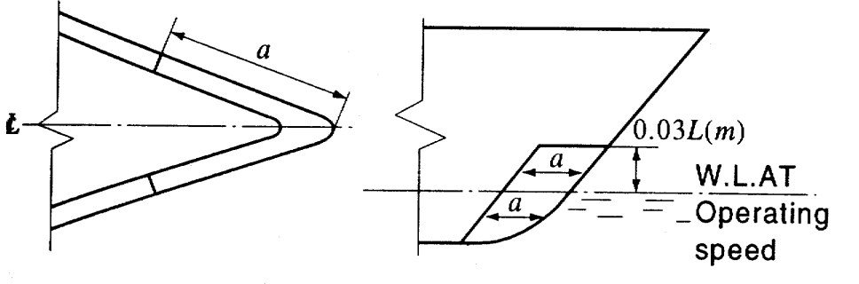
    Fig 3.5.1 Collision protection 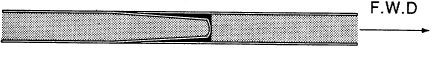
    Fig 3.5.2 Laminate connection
    - **(1)** Crafts built in sandwich construction are to have the fore stem designed so that a local impact at or below the load line will not result in skin laminate peeling due to hydraulic pressure.
    - **(2)** To comply with the requirement in preceding (1) outer and inner skin laminate of the hull panel shall be connected together as shown in **Fig 3.5.1.** The distance ($a$) shall not less than following formula. The vertical extension of the collision protection shall be from the keel to a point 0.03 $L$ ($m$) above the load line at operating speed.
    - **(3)** The connection of the skin laminates shall be arranged in such a way that laminate peeling is effectively arrested (refer to, **Fig 3.5.2**).
    - **(4)** Other arrangements giving an equivalent safety against laminate peeling may be accepted based on considerations in each individual case.
    - **(5)** Within the vertical extension of the collision protection the stem laminate shall be increased to a thickness not less than that obtained from the following formula :
- **107.** **Deck structure**
  - **1.** Decks of single skin construction are normally to be longitudinally stiffened.
  - **2.** The longitudinals should preferably be continuous through transverse members. At their ends longitudinals are to be fitted with brackets or to be tapered out beyond the point of support.
  - **3.** The laminate thickness of single skin constructions is to be such that the necessary transverse buckling strength is achieved, or transverse intermediate stiffeners may have to be fitted.
- **108.** **Bulwarks**
  - **1.** Bulwark sides are to have the same scantlings as required for a superstructure in the same position.
  - **2.** A strong flange is to be made along the upper edge of the bulwark. Bulwark stays are to be arranged in line with transverse beams or local stiffening. The stays are to have sufficient width at deck level. If the deck is of sandwich construction solid core inserts are to be fitted at the foot of the bulwark stays. Stays of increased strength are to be fitted at ends of bulwark openings. Openings in bulwarks should not be situated near the ends of superstructures.
  - **3.** Where bulwarks on exposed decks form wells, ample provision is to be made to facilitate freeing the decks from water.
- **109.** **Bulkhead structures**
  - **1.** **Watertight bulkheads**
    The number and location of watertight bulkheads are to be in accordance with reqrirements in **Ch 1, Sec 4.**
  - **2.** **Supporting bulkheads**
    Bulkheads supporting decks are to be regarded as pillars. The buckling strength is to be considered in each individual case.

#### Section 2 Materials

- **201.** **Application**
  - **1.** The hull, constructed in FRP, is to be in accordance with requirements in this section. The requirements, not mentioned in this section, are to be in accordance with the **Rules for the Classification of FRP Ships**.
  - **2.** Reinforcement, matrix, fillers and core materials for major hull constructural elements are normally to be approved by Society.
  - **3.** The polyester containing wax or other material that deteriorate bonding are to be carried out interlaminar shear strength test (KS M ISO 14130) and approved by the Society.
- **202.** **Equivalency**
  The type approval of FRP materials, not mentioned in this section, is in accordance with official standard. Alternative FRP material will be accepted by the Society, provided that the Society is satisfied that such material is equivalent to those required in this rules.
- **203.** **Application of materials**
  - **1.** Grade 1 polyester is to be used for the hull shell laminate in single skin construction and for the outer hull skin laminate in sandwich construction.
  - **2.** The outer reinforcement ply of the outer hull skin laminate is to be at least 450 $\mathrm{g}/m ^{2}$ of chopped strand fibres containing as little water soluble bonding components as possible. Normally spray roving or powder bound mat should be used. Alternatively a 300 $\mathrm{g}/m ^{2}$ mat and a light surface mat can be used. Other material systems giving an equivalent surface protection may also be accepted.
  - **3.** Areas inside the hull expected to be continuously exposed to water submersion (i. e. bilge wells etc.) and the inside of tanks shall have a surface lining consisting of at least 600 $\mathrm{g}/m ^{2}$ reinforcement material.
  - **4.** The strength calculations are to be based on mechanical properties obtained from testing of representative sandwich panels and laminates with respect to production procedure, workshop conditions, raw materials, lay-up sequence, etc.

#### Section 3 Manufacturing

- **301.** **Application**
  The hull structure, constructed in FRP, is to be in accordance with requirements in this chapter. The requirements, not mentioned in this chapter, are to be in accordance with requirements in the **Rules for the Classification of FRP Ships** and **Guidance for Approval of Manufacturing Process and Type Approval, ETC.**
- **302.** **Manufacturing conditions**
  - **1.** **Storage of raw materials**
    - **(1)** Storage premises are to be so equipped and arranged that the material supplier's directions for storage and handling of the raw materials can be followed.
    - **(2)** Storage premises for glassfibre are to be kept clean and as free from dust as possible, so that the raw material is not contaminated. Glassfibre parcels are also to be protected against rain and moisture.
    - **(3)** Polyester, gelcoat and the like should not be stored by temperatures that will affect the qualities of the material. Raw materials which are stored at temperatures lower than 18 ℃ should be heated up before use to the temperature of the moulding shop. Tanks for polyester are to be equipped and arranged so that the contents can be stirred every day.
    - **(4)** The glassfibre material is, whenever possible, to be stored for at least two days in storage premises, with air of a lower relative humidity than in the manufacturing premises, and at an air temperature at least 2 ℃ higher than in the manufacturing premises. If such storage of the glassfibre material before transfer to the manufacturing is not possible, the material is to be stored for at least two days in premises with air of the same condition as in the moulding premises.
    - **(5)** The storage temperature and the storage periods for resins and coating are to be within the limits specified by the material supplier.
    - **(6)** Core materials are to be stored dry and protected against mechanical damages.
  - **2.** **Manufacturing conditions**
    - **(1)** Manufacturing premises are to be so equipped and arranged that the material supplier's directions for handling the materials, the laminating process and curing conditions can be followed.
    - **(2)** The air temperature in the moulding shops is not to be less than 18 ℃. The stipulated minimum temperature is to be attained at least 24 hours before commencement of laminating, and is to be maintainable regardless of the outdoor air temperature. The temperature in the moulding shops is not to vary by more than ±3 ℃ during 24 hours.
    - **(3)** The relative humidity of the air is to be kept so constant that condensation is avoided and is not to exceed 80 %. In areas where spray moulding is taking place, the humidity is not to be less than 40 %. The stipulated air humidity is to be maintainable regardless of outdoor air temperature and humidity.
    - **(4)** Air temperature and relative humidity are to be recorded regularly. In larger shops there is to be at least on thermohydrograph for each 1500 $\mathrm{m} ^{2}$ where lamination is carried out. The location of the instruments in the premises is to be as neutral as possible.
    - **(5)** Draught through doors, windows etc. and direct sunlight is not acceptable in places where lamination and curing are in progress.
    - **(6)** Manufacturing premises are to be kept clean and as free of dust as possible, so that raw materials and moulds are not contaminated.
    - **(7)** The ventilation plant is to be so arranged that the curing process is not affected.
    - **(8)** Sufficient scaffoldings are to be arranged so that all lamination work can be carried out without operators standing on the core or on surfaces on which lamination work is taking place.
    - **(9)** During lamination of large constructions the temperature should be recorded at least at two levels vertically in the workshop and the curing system should be adjusted to compensate for possible temperature differences.
    - **(10)** Fabrication of flat panels are to carried out on a support lifted from the workshop floor level.
- **303.** **Production procedures and workmanship**
  - **1.** **Sandwich lay-up**
    - **(1)** Efficient bond is to be obtained between the skin laminates and the core and between the individual core elements. Approved tools for cutting, grinding etc. of various types of core material shall be specified in the production procedure. The bond is to be verified by shear or tensile testing.
    - **(2)** All joints between skin laminates and core and between the individual core elements are to be completely filled with resin, glue or filler material.
    - **(3)** Core materials with open cells in the surface, should normally be impregnated with resin before it is applied to a wet laminate or before lamination on the core is commenced.
    - **(4)** When the core is applied manually to a wet laminate the surface shall be reinforced with a chopped strand mat of 450 $\mathrm{g}/m ^{2}$ in plane surface and 600 $\mathrm{g}/m ^{2}$ in curved surface. If vacuum is applied for core bonding the reinforcement type in the laminate surface will be considered in each individual case.
    - **(5)** When a prefabricated skin laminate is glued to a sandwich core measures are to be taken to evacuate air from the surface between skin and core.
    - **(6)** The core material is to be free from dust and other contaminations before the skin laminates are applied or core elements are glued together.
  - **2.** **Manual lamination**
    - **(1)** When the laminate is applied in a mould a chopped strand mat of maximum 450$\mathrm{g}/m ^{2}$ is to be applied next to the gelcoat.
    - **(2)** The time interval between applications of each layer of reinforcement is to be within the limits specified by the material supplier. For thicker laminates care is to be taken to ensure a time interval sufficiently large to avoid excessive heat generation.
    - **(3)** Curing systems are to be selected with due regard to the reactivity of the polyester and in accordance with the supplier's directions. Heat development during curing is to be kept at a safe level. The quantity of curing agents is to be kept within the limits specified by the supplier.
    - **(4)** The reinforcement next to the core is normally to be a chopped strand mat of at least 300 $\mathrm{g}/m ^{2}$. A lighter mat may be accepted provided proper bond is documented by testing.
  - **3.** **Secondary bonding**
    - **(1)** If a laminate subject to secondary bonding has cured for more than 5 days the surface should be ground. If resin containing wax is used grinding is required if the curing time exceeds 24 hours.
    - **(2)** If peel strips are used in the bonding surface the required surface treatment may be dispensed with.

#### Section 4 Hull Girder Strength

- **401.** **General**
  - **1.** The requirements, not mentioned in following Par. are to be in accordance with requirements in **Ch 3, Sec 4**
  - **2.** When calculating the section modulus of a composite structure possible differences in the elasticity modulus of various structural members are to be taken into account. The stresses are to be corrected accordingly.
- **402.** **Deck corners**
  Moulded deck line, rounded sheer strake, sheer strake and stringer plate are as defined in **Fig 3.5.3.**
  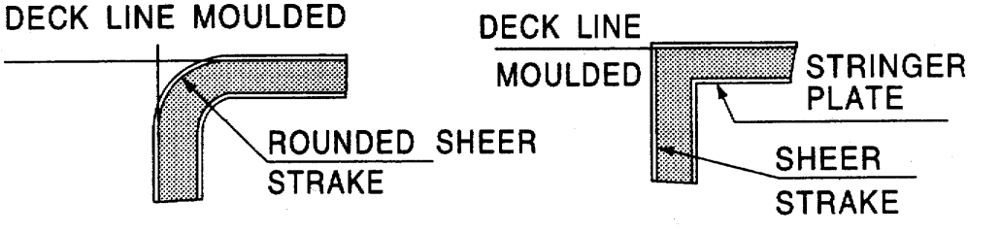
  Fig 3.5.3 Deck corners
- **403.** **Vertical bending strength**
  The vertical bending stresses of FRP craft are in accordance with requirements in **Ch 3** and s-values are defined as follows.
  $\sigma = 0.3 \sigma _{n u} (\mathrm{N}/mm ^{2} )$ : In general.
  $\sigma = 0.27 \sigma _{n u} (\mathrm{N}/mm ^{2} )$ : For hydrofoil on foils.
  $\sigma = 0.24 \sigma _{n u} (\mathrm{N}/mm ^{2} )$ : In slowed-down condition for planing craft.
- **404.** **Allowable strength**
  - **1.** If direct calculation using the full stiffness and strength properties of the laminate are carried out the procedure is to be followed by Society approval.
  - **2.** When a simplified calculation method is used for constructions complying with **104. Par 2** the total normal stresses in the two main directions shall comply with the requirements of **503. Par 5, 603. Par 3** and **604. Par 1.** However, in plane laminate shear stresses shall be less than 0.25 times of ultimate shear stress.

#### Section 5 Sandwich Panels

- **501.** **Consideration of buckling**
  Buckling strength of sandwich panels related to longitudinal hull girder strength or local axial loads are to be dealt with individually.
- **502.** **Minimum requirements to structural sandwich panels**
  - **1.** The reinforcement of skin laminates is to contain at least 40 % continuous fibres.
  - **2.** The mechanical properties of the core material of structural sandwich panels are to comply with the following minimum requirements (refer to **Table 3.5.1**).

    | Structural members | Core properties ($\mathrm{N}/mm ^{2}$) |   |
    | --- | --- | --- |
    | Structural members | Shear strength | Compression strength |
    | Hull bottom, side and transom below deepest WL or chine whichever is higher | 0.8 | 0.9 |
    | Hull side and transom above deepest WL or chine whichever is higher | 0.8 | 0.9 |
    | Weather deck not intended for cargo | 0.5 | 0.6 |
    | Cargo deck | 0.8 | 0.9 |
    | Accommodation deck | 0.5 | 0.6 |
    | Structural/watertight bulkheads/double bottom | 0.5 | 0.6 |
    | Superstructures/Deckhouses | 0.5 | 0.6 |
    | Tank bulkheads | 0.5 | 0.6 |
  - **3.** The mass of reinforcement ($\mathrm{g}/m ^{ 2}$) in skin laminates in structural sandwich panels should normally not be less than the following. However, Details including laminating process such as work sheets to be submitted.
    $W \geq W _{0} (1+k(L-20)) for L>20 \mathrm{m}$
    $W = W _{0} for L \leq 20 \mathrm{m}$
    $W$ : mass of reinforcement per unit area, ($\mathrm{g}/m ^{ 2}$)
    $W _{0}$ : given in **Table 3.5.2** (For mixed material reinforcements $W _{0}$ can be found by linear interpolation in the table according to the relative percentage of each material with respect to weight per unit area.)
    $k$ : given in **Table 3.5.2.**
    $L$ : length between perpendiculars.
  - **4.** Deviation from the minimum requirements may be accepted by the Society on consideration of craft type and service restriction or based on documentation of equivalent resistance to loads described in **Table 3.5.1.**

    | Structural Member | $W _{o}$ ($\mathrm{g}/m ^{ 2}$) |   | $k$ |
    | --- | --- | --- | --- |
    | Structural Member | Glass | Carbon/Aramid | $k$ |
    | Hull bottom, side and transom below deepest WL or chine whichever is higher | 2400 | 1600 | 0.025 |
    | Hull side and transom above deepest WL or chine whichever is higher | 1600 | 1100 | 0.025 |
    | Hull bottom and side, inside of hull | 1600 | 1100 | 0.013 |
    | Stem and keel, (width to be defined) | 6000 | 4000 | 0.025 |
    | Weather deck (not for cargo) | 1600 | 1100 | 0.0 |
    | Wet deck | 1600 | 1100 | 0.0 |
    | Cargo deck | 3000 | 2000 | 0.013 |
    | Accommodation deck, if adequately protected | 1200 | 800 | 0.0 |
    | Accommodation deck, other | 1600 | 1100 | 0.0 |
    | Decks, underside skin | 750 | 500 | 0.0 |
    | Deep tank bulkheads/double bottom | 1600 | 1100 | 0.0 |
    | Structural bulkheads | 1200 | 800 | 0.0 |
    | Watertight bulkheads | 1600 | 1100 | 0.0 |
    | Superstructure and deckhouse, outside | 1200 | 800 | 0.013 |
    | Inside void spaces without normal access | 750 | 500 | 0.0 |
- **503.** **Bending**
  - **1.** **Normal stresses in skin laminates and core shear stresses**
    $\sigma _{n} = \frac{160 P b ^{2}}{W} C _{N} C _{1} (\mathrm{N}/mm ^{2} )$
    $C _{N } = C _{2} + v C _{3}$ : For stresses parallel to the longest edge, refer to **Fig 3.5.4.**
    $C _{N}$ = $C _{3} + v C _{2}$ : For stresses parallel to the shortest edge, refer to **Fig 3.5.4.**
    $W$ : section modulus of the sandwich panel per unit breadth ($\mathrm{mm} ^{3} /mm$). For a sandwichpanel with skins of equal thickness $W$ = $d _{t}$
    $C _{1}$ : factor, as defined in follows.
    = 1.0, for panels with simply supported edges.
    = $C _{1L}$ or $C _{1S}$ according to **Fig 3.5.5**, for panels with fixed edges or partially fixed edges. $C _{1L}$ for stresses parallel to the longest edge. $C _{1S}$ for stresses parallel to shortest edge.
    $\tau _{c } = \frac{0.52 P b}{d _{f}} C _{S} (\mathrm{N}/mm ^{2} )$
    $C _{S}$ = $C _{4}$, for core shear stress at midpoint of longest panel edge, see **Fig 3.5.6.**
    $C _{S}$ = $C _{5}$, for core shear stress at midpoint of shortest panel edge, see **Fig 3.5.6.**
    
    Fig 3.5.4 Factors #eqnID-1096 and #eqnID-1097
    
    Fig 3.5.5 factor #eqnID-1098
    
    Fig 3.5.6 Factors #eqnID-1099 and #eqnID-1100
    - **(1)** Maximum normal stresses in the skin laminates of a sandwich panel subject to uniform lateral pressure is given by the following formula :
    - **(2)** The maximum core shear stresses at the midpoints of the panel edges of a sandwich panel subject to lateral pressure is given by the following formula :
  - **2.** **Local skin buckling**
    The critical local buckling stress for skin laminates exposed to compression is given by the following formula :
    $\sigma _{c r} = 0.5 (E E _{C} G _{ C} ) ^{\frac{1}{3}} (\mathrm{N}/mm ^{2} )$
  - **3.** **Deflection**
    The deflection at the midpoint of a flat panel is given by the following formula :
    $w = \frac{10 ^{6} P b ^{4}}{D _{2}} (C _{ 6} C _{8} + \rho C _{7} )$,
    $\rho = \frac{\pi ^{2} D _{2}}{10 ^{6} G _{C } d _{f } b ^{2}}$
    $C _{6}$ and $C _{7}$ : refer to **Table 3.5.7.**
    $C _{8}$ : factor, as defined in follows.
    = 1.0, panels with simply supported edges.
    = refer to **Fig 3.5.8**, panels with fixed edges or partially fixed.
    $D _{2}$ : modulus of elasticity, refer to **Table 3.5.3.**
    
    Fig 3.5.7 Factors #eqnID-1108 and #eqnID-1109 
    Fig 3.5.8 Factor #eqnID-1110

    |   | $D _{2}$ |
    | --- | --- |
    | For panels with skin laminates with equal thickness and modulus of elasticity | $\frac{E t d _{ f} ^{ 2}}{2(1-v ^{2} )}$ |
    | For panels with skin laminates with different thickness and modulus of elasticity | $\frac{E _{1} E _{2 } t _{1 } t _{2 } d _{f} ^{2}}{(1-v ^{2} )(E _{1} t _{1} +E _{2} t _{2} )}$ |
    | NOTE : 1 and 2 : inner and outer skin respectively. |   |
  - **4.** **Allowable stresses and deflections**
    The maximum normal stresses in skin laminates, core shear stresses and deflection are not to be greater than given values in following **Table 3.5.4.**

    | Structural member | $\sigma _{n}$ | $\tau _{c}$ | $w/b$ |
    | --- | --- | --- | --- |
    | Bottom panels exposed to slamming | 0.3 $\sigma _{n u} ^{(1)}$ | 0.35 $\tau _{c} ^{ (2)}$ | 0.01 |
    | Remaining bottom and inner bottom | 0.3$\sigma _{n u}$ | 0.4 $\tau _{c}$ | 0.01 |
    | Side structures | 0.3 $\sigma _{n u}$ | 0.4 $\tau _{c}$ | 0.01 |
    | Deck structures | 0.3 $\sigma _{n u}$ | 0.4 $\tau _{c}$ | 0.01 |
    | Bulkhead structures | 0.3 $\sigma _{n u}$ | 0.4.$\tau _{c}$ | 0.01 |
    | Superstructures | 0.3 $\sigma _{n u}$ | 0.4 $\tau _{c}$ | 0.01 |
    | Deckhouses | 0.3$\sigma _{n u}$ | 0.4 $\tau _{c}$ | 0.01 |
    | All structures exposed to long time static loads | 0.20 $\sigma _{n u}$ | 0.15$\tau _{c}$ | 0.005 |
    | NOTE: (1) $\sigma _{n u}$ is to be in accordance with the following : For skin laminates exposed to tensile stress : ultimate tensile stress. For skin laminates exposed to compressive stress :the smaller of the ultimate compressive stress and critical local buckling stress. (2) The allowable stress level for bottom panels exposed to slamming loads refer to core materials with a shear elongation of at least 20 % an increase of the allowable stress level may be accepted upon special consideration. |   |   |   |

#### Section 6 Single Skin Construction

- **601.** **Consideration of buckling**
  Buckling strength of single skin panels subjected to longitudinal hull girder strength or local compressional loads will be dealt with individually.
- **602.** **Minimum requirements to structural single skin plates**
  - **1.** The reinforcement of single skin laminates is to contain at least 40 % continuous fibres.
  - **2.** The mass of reinforcement (g/m^2) in single skin panel should normally not be less than following: However, details including laminating process such as work sheets to be submitted.
    $W \geq W _{0} (1+k(L-20)) for L>20 \mathrm{m}$
    $W = W _{0} for L \leq 20 \mathrm{m}$
    $W$ : mass of reinforcement per unit area, $\mathrm{g}/m ^{ 2}$
    $W _{0}$ : given in **Table 3.5.5.** (For mixed material reinforcements $W _{0}$ can be found by linear interpolation in the table according to the relative percentage of each material with respect to weight per unit area.)
    $k$ : given in **Table 3.5.5.**
    $L$ : length between perpendiculars.

    | Item | $W _{o}$ ($\mathrm{g}/m ^{ 2}$) | $k$ |
    | --- | --- | --- |
    | Hull bottom, side and transom below deepest WL or chine whichever is higher | 4200 | 0.025 |
    | Hull side and transom above deepest WL or chine whichever is higher | 4200 | 0.025 |
    | Stem and keel to 0.01 L from centreline | 7500 | 0.025 |
    | Chine and transom corners to 0,01 L from chine edge | 5800 | 0.025 |
    | Bottom aft in way of rudder, shaft braces, and shaft penetrations | 6600 | 0.025 |
    | Weather deck not intended for cargo | 4200 | 0.0 |
    | Cargo deck | 5400 | 0.013 |
    | Accommodation deck | 2900 | 0.0 |
    | Structural/watertight bulkheads/ double bottom | 4200 | 0.0 |
    | Tank bulkheads | 4500 | 0.0 |
    | Other bulkheads | 2500 | 0.0 |
    | Superstructures and deckhouses | 4200 | 0.013 |
- **603.** **Laterally loaded single skin laminates**
  - **1.** **Assumptions**
    - **(1)** The formulas given below are valid under the following assumptions.
      - **(A)** The principal directions of reinforcement are parallel to the edges of the panel.
      - **(B)** The difference in the modulus of elasticity in the two principal direction of reinforcement is not more than 20 %.
      - **(C)** The load is uniformly distributed.
    - **(2)** For laminates not complying with the above (1) are to be in accordance with the discretion of the Society.
  - **2.** **Laminates exposed to combined bending and membrane stresses.**
    $t = 178 b \left( \frac{P}{\delta E (C _{ 1} + \delta ^{2} C _{ 2} )} \right) ^{\frac{1}{4}} (\mathrm{mm})$
    $C _{1}$ and $C _{2}$ : refer to **Table 3.5.9.**
    $\sigma _{c} = \left( \frac{t}{1000 b} \right) ^{2} \delta E \left[ C _{1} C _{2} +C _{4} (C _{2} ^{ 2} ) ^{\frac{1}{3}} \right] (\mathrm{N}/mm ^{2} )$
    $C _{1}$ and $C _{2}$ : refer to **Fig 3.5.9.**
    $C _{3}$ and $C _{4}$ : refer to **Fig 3.5.10.**
    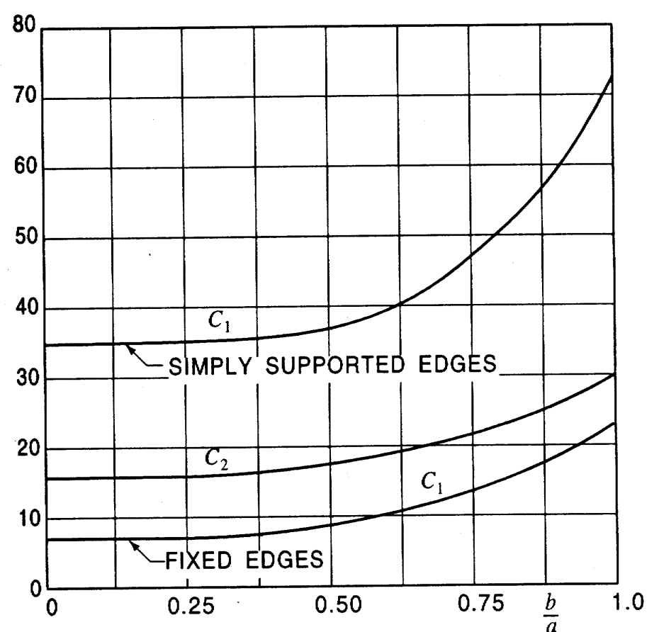
    Fig 3.5.9 Factors #eqnID-1155 and #eqnID-1156 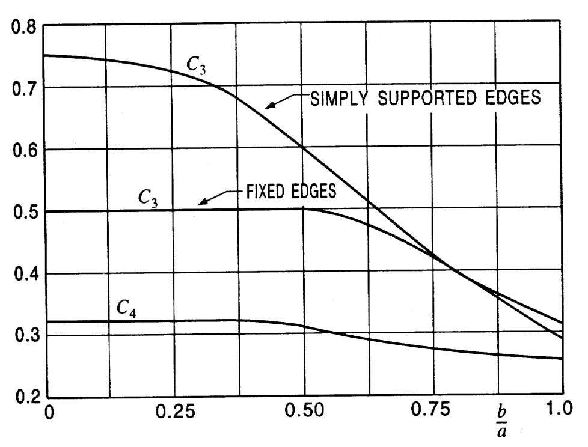
    Fig 3.5.10 Factors #eqnID-1157 and #eqnID-1158
    - **(1)** For a given design pressure the thickness requirements are related to a laminate deflection factor *d* (=*w*/*t*) and an allowable combined stresses (bending stress + membrane stress).
    - **(2)** The required thickness to meet a specific value of d in association with a given design pressure is given by the following formula :
    - **(3)** The combined stresses (bending stress + membrane stress) corresponding to the thickness found in (2) is given the following formula :
  - **3.** **Allowable stresses and deflections**
    The maximum combined stresses (bending stress + membrane stress) and deflections are not to be greater than given values in the **Table 3.5.6.**

    | Structural member | *σ* | *δ* |
    | --- | --- | --- |
    | Bottom panels exposed to slamming | 0.3 *σ* | 1.0 |
    | Remaining bottom and inner bottom | 0.3 *σ* | 0.9 |
    | Side structures | 0.3 *σ* | 0.9 |
    | Deck structures | 0.3 *σ* | 0.9 |
    | Bulkhead structures | 0.3 *σ* | 0.9 |
    | Superstructures | 0.3 *σ* | 0.9 |
    | Deckhouses | 0.3 *σ* | 0.9 |
    | All structures exposed to long time static loads | 0.2 *σ* | 0.5 |
- **604.** **Stiffeners**
  - **1.** **Section modulus**
    $Z = \frac{mPSl ^{2}}{\sigma} (\mathrm{cm} ^{3} )$
    $m$ : bending moment factor, defined in **Sec 7, Table 3.5.10** for load and boundary conditions, and **Table 3.5.8** for structural members.
    $S$ : spacing of stiffeners ($\mathrm{m}$).
    $l$ : span of the stiffeners ($\mathrm{m}$).
    $\sigma$ : allowable stress, defined in **Table 3.5.7.**

    | Structural member | $\sigma$ |
    | --- | --- |
    | Bottom plates exposed to slamming | 0.25 $\sigma _{n u }$ |
    | Remaining bottom and inner bottom | 0.25 $\sigma _{n u }$ |
    | Side structures | 0.25 $\sigma _{n u }$ |
    | Deck structures | 0.25 $\sigma _{n u }$ |
    | Bulkhead structures | 0.25 $\sigma _{n u }$ |
    | Superstructures | 0.25 $\sigma _{n u }$ |
    | Deckhouses | 0.25 $\sigma _{n u }$ |
    | All structures exposed to long time static loads | 0.15 $\sigma _{n u }$ |

    | structures | $m$ |
    | --- | --- |
    | Continuous longitudinal members | 85 |
    | Non-continuous longitudinal members | 100 |
    | Transverse members | 100 |
    | Vertical members, and fixed | 100 |
    | Vertical members, simply supported | 135 |
    | Bottom longitudinal members | 85 |
    | Bottom Transverse members | 100 |
    | Side longitudinal members | 85 |
    | Side vertical members | 100 |
    | Deck longitudinal members | 85 |
    | Deck Transverse members | 100 |
    | W.T. bulkhead stiffeners, fixed ends | 65 |
    | W.T. bulkhead stiffeners, fixed one end (lower) | 85 |
    | W.T. bulkhead stiffeners, simply supported ends | 125 |
    | Tank and cargo bulkhead, fixed ends | 100 |
    | Tank and cargo bulkhead, simply supported ends | 135 |
    | Deckhouse stiffeners | 100 |
    | Casing stiffeners | 100 |
    - **(1)** The section modulus of longitudinals, beams, frames and other stiffeners subject to lateral pressure is not to be less than that obtained from the following formula :
    - **(2)** When calculating the section modulus of top hat stiffeners the effect of possible variations in the modulus of elasticity through the section should be taken into account. Effective flange is to be determined in accordance with **704. Par 2.**

#### Section 7 Transverses and Girders

- **701.** **General**
  In this section, the general requirements for simple girders and procedures for the calculations of complex girder systems are given. The buckling strength of girders will be dealt with individually considered.
- **702.** **Symbols**
  In this chapter the symbols in formulas are as follows.
  $S$ : girder span ($\mathrm{m}$), the web height of in-plane girders may be deducted.
  $b$ : breadth of load area ($\mathrm{m}$), refer to **Table 3.5.9.**
  $P$ : design pressure, defined in **Ch 2.**
  $P _{a}$ : design axial force ($\mathrm{kN}$).
  $\sigma$ : nominal allowable bending stress due to lateral pressure ($\mathrm{N}/mm ^{2}$).
  $\tau$ : nominal allowable shear stress ($\mathrm{N}/mm ^{2}$).
  $\tau _{b}$ : nominal allowable bond shear stress ($\mathrm{N}/mm ^{2}$).
  $\tau _{w}$ : web thickness ($\mathrm{mm}$).
  $h _{w}$ : web height ($\mathrm{mm}$).
  $b _{f}$ : flange breadth ($\mathrm{mm}$).

  |   | $b$ |
  | --- | --- |
  | For ordinary girders | $0.5 (l _{1} + l _{2} ) (\mathrm{m})$ |
  | For hatch side coamings | $2(B _{1} - b _{2} ) (\mathrm{m})$ |
  | For hatch end beams | $0.4 b _{3} (\mathrm{m})$ |
  | NOTE: $l _{1}$ and $l _{2}$ : the span ($\mathrm{m}$) of the supported panels. $B _{1}$ : breadth of craft ($\mathrm{m}$) measured at the middle of hatchway. $b _{2}$ : breadth of hatch ($\mathrm{m}$) measured at the middle of hatchway. $b _{3}$ : distance ($\mathrm{m}$) between hatch end beam and nearest deep transverse girder or transverse bulkhead. |   |
- **703.** **Continuity of strength members**
  - **1.** Structural continuity is to be maintained at the junction of primary supporting members of unequal stiffness by fitting well rounded brackets. Brackets ending at unsupported sandwich panels are to be tapered smoothly to zero and the panels skin laminate to be locally reinforced at the end of the bracket. Girders are to be fitted with bracket or tapered to zero at their ends, (refer to, **Fig 3.5.11**).
  - **2.** Where practicable, deck pillars are to be located in line with pillars above or below. Massive or high density core inserts are to be fitted at the foot of pillars.
  - **3.** Below decks and platforms, strong transverses are to be fitted between verticals and pillars, so that rigid continuous frame structures are formed.
- **704.** **Bending and shear**
  - **1.** **General**
    - **(1)** The requirements for section modulus and web area given in this chapter are applicable to simple girders supporting stiffeners or other girders exposed to linearly distributed lateral pressure. It is assumed that the girder satisfies the basic assumptions of simple beam theory and that the supported members are approximately evenly spaced and simply supported at both ends. Other loads will have to be specially considered.
    - **(2)** When boundary conditions for individual girders are not predictable due to dependance of adjacent structures, direct calculations according to the discretion of the Society will be required.
  - **2.** **Effective breadth**
    The effective panel flange area is defined as **Fig 3.5.12.** For top-hat girders supporting sandwich panels only the skin laminate at which the girder is fitted should be considered as effective breadth.
    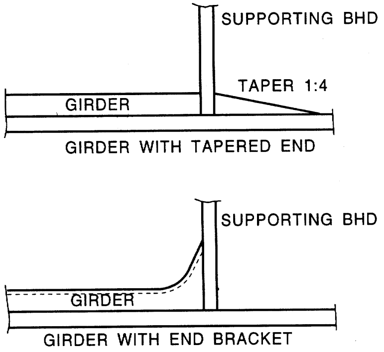
    Fig 3.5.11 Ends of Girders 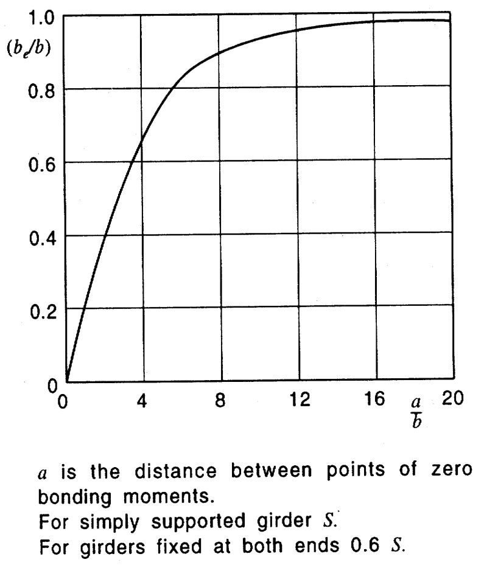
    Fig 3.5.12 Effective Breadth (*b*e)
  - **3.** **Effective web**
    $A _{W} = 0.01 h _{n } t _{w} (\mathrm{cm} ^{2} )$
    $h _{n}$ : net girder height ($\mathrm{mm}$), after deduction of cutouts in the cross-section considered. If an opening is located at a distance less than $h/3$ from the cross-section considered, $h _{n}$ is to taken as the smaller of the net height and the net distance through the opening, refer to **Fig 3.5.13.**
    $A _{W } = 0.01 h _{n } t _{w} + 1.3 A _{FL} \sin 2 \theta \sin \theta (\mathrm{cm} ^{2} )$
    $h _{n}$ : as defined in previous (2).
    $A _{FL}$ : flange area ($\mathrm{cm} ^{2}$).
    $\theta$ : angle of slope of continuous flange.
    
    Fig 3.5.13 Effective Web Area in Way of Openings 
    Fig 3.5.14 Effective Web Area in Way of Brackets
    - **(1)** Holes in girders will generally be accepted provided the shear stress level is acceptable and the buckling strength is sufficient. Holes are to be kept well clear of end of brackets and locations where shear stresses are high.
    - **(2)** For ordinary girder cross-sections the effective web area is to be taken as following formula :
    - **(3)** Where the girder flange is not perpendicular to the considered cross section in the girder, the effective web area is to be taken as following formula, refer to **Fig 3.5.14.**
  - **4.** **Effective bond area**
    For girders attached to other structural members at their supports by secondary bonding the effective bond area is determined by the following formula, (refer to **Fig 3.5.15**).
    $A _{B} = BH - bh (\mathrm{cm} ^{2} )$
    
    Fig 3.5.15 Effective Bond Area
  - **5.** **Scantlings of girders**
    $Z = \frac{mP b S ^{ 2}}{\sigma} (\mathrm{cm} ^{3} )$
    $m$ : bending moment factor, defined in (5).
    $\sigma = 0.21 \sigma _{u}$
    When calculating the section modulus of top hat profiles the effect of possible variations in the modulus of elasticity throughout the section should be taken into account.
    $A _{W } = \frac{10k _{s} P _{a} b S}{\tau} (\mathrm{cm} ^{2} )$
    $k _{s}$ : shear force factor, defined in (4).
    $\tau = 0.25 \tau _{u}$
    $A _{B} = \frac{10k _{s} P _{a} bS}{\tau _{b}} (\mathrm{cm} ^{2} )$
    $k _{s}$ : shear force factor, defined in (4).
    $\tau_b = 0.25 \tau _{u}$
    $\tau _{b u}$ : the ultimate bond shear stress for the secondary bonding.

    | Load and boundary conditions |   |   | Boundary moment and shear force factors |   |   |
    | --- | --- | --- | --- | --- | --- |
    | Positions |   |   | 1 $m 1\# ks 1$ | 2 $m _{2}$ *-* | 3 $m 3\# ks 3$ |
    | 1 Support | 2 Field | 3 Support | 1 $m 1\# ks 1$ | 2 $m _{2}$ *-* | 3 $m 3\# ks 3$ |
    |  |   |   | 85 0.50 | 42 | 85 0.50 |
    |  |   |   | 0.38 | 70 | 125 0.63 |
    |  |   |   | 0.50 | 125 | 0.05 |
    |  |   |   | 65 0.30 | 43 | 100 0.70 |
    |  |   |   | 0.20 | 60 | 135 0.80 |
    |  |   |   | 0.33 | 130 | 0.67 |

    |   |   | $m$ | $k _{s}$ |
    | --- | --- | --- | --- |
    | Bottom | Transverses Floors Longitudinal girders | 100 100 100 | 0.63 |
    | Side | Longitudinal girders Transverses, upper end Transverses, lower end Deck girders | 100 100 100 100 | 0.54 0.54 0.72 0.63 |
    | Bulkhead | Horizontal girders Vertical girders, upper end Vertical girders, lower end | 100 100 100 | 0.54 0.54 0.72 |
    - **(1)** The section modulus for girders subjected to lateral pressure is not to be less than that obtained from the following formula :
    - **(2)** The web area of girders subject to lateral pressure is not to be less than that obtained from the following formula :
    - **(3)** The bond area, between girders and their supporting structure, at the girders ends is not to be less than that obtained from the following formula :
    - **(4)** The m and $k _{s}$ values are given for some defined load and boundary conditions in **Table 3.5.10,** not defined in previous Table, $m$-values are directly from general elastic bending theory. For girders where brackets are fitted or the flange area has been partly increased due to large bending moment, a larger m-value may be accepted outside the strengthened region.
    - **(5)** The $m$ and $k _{s}$ values referred to in (1) and (2) are normally to be as **Table 3.5.11** for the various structural members. 
