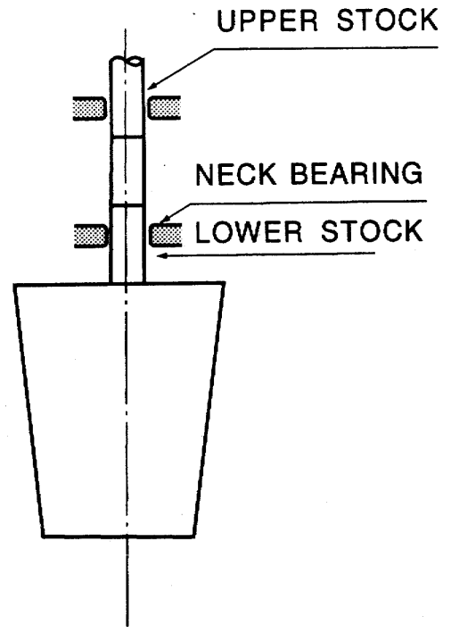
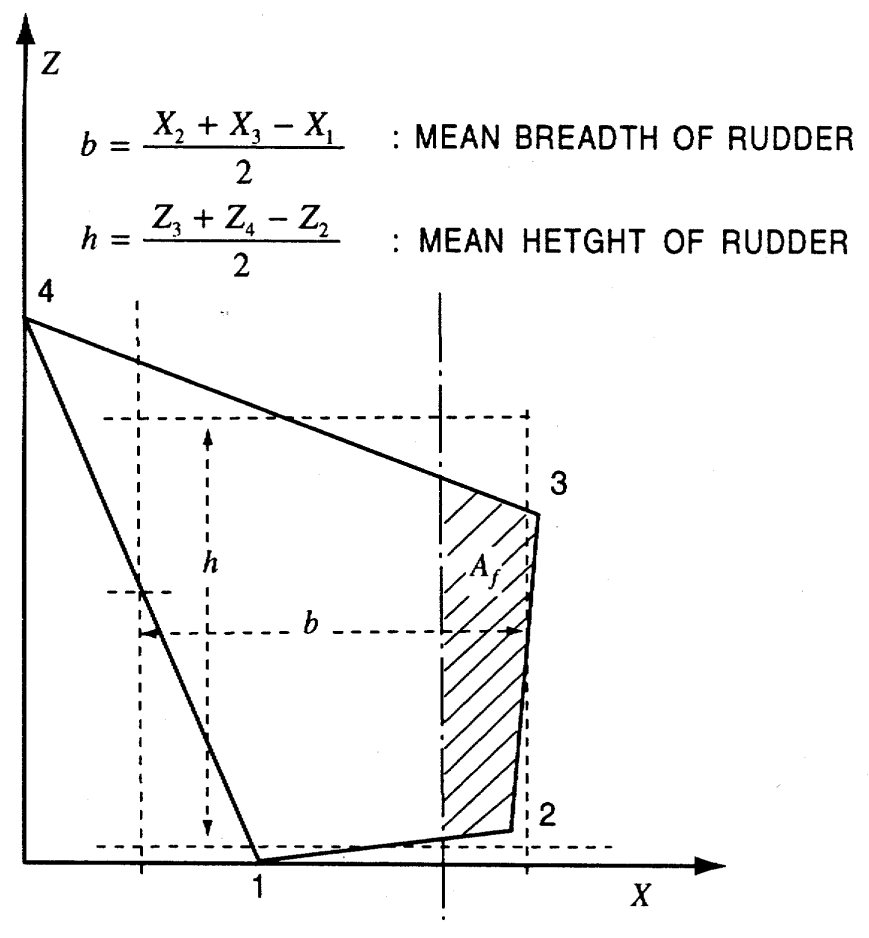
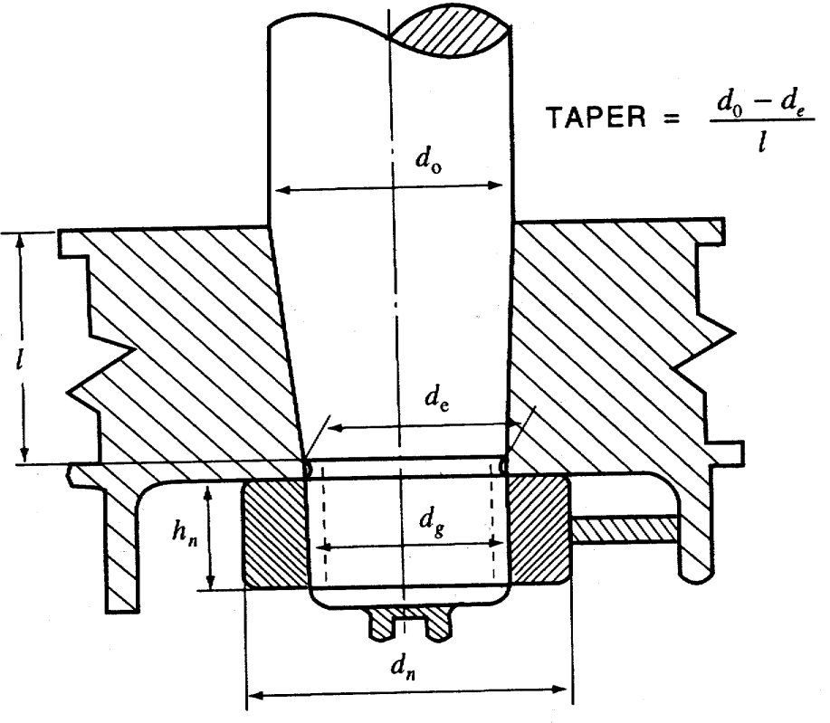
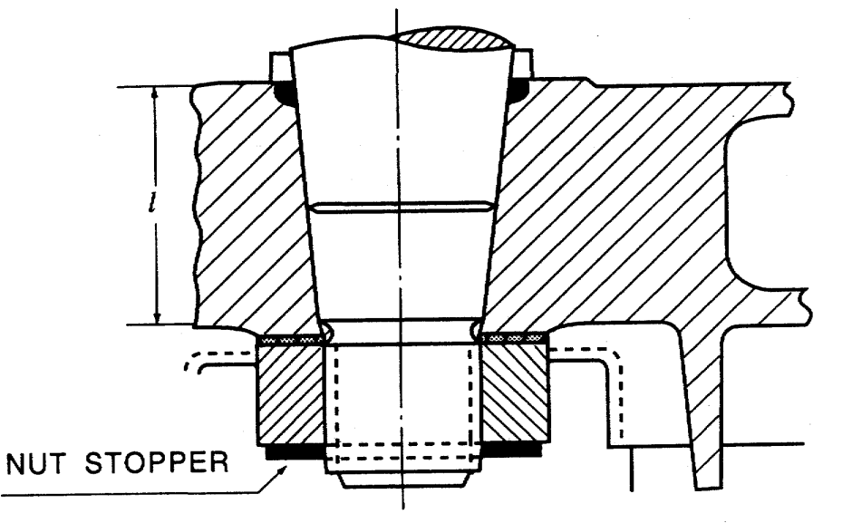

# Rules/Guidance for the Classification of High Speed and Light Crafts

> OTHER RULES AND GUIDANCE / RB-11-E / 2025 / EN / Rules

## PART 4 HULL EQUIPMENT

### CHAPTER 1 RUDDERS

#### Section 1 General

- **101.** **Application**
  - **1.** The requirements in this chapter apply to single plate rudders and double plate rudders of stream line section and ordinary shape, rudders having no bearing below the neck bearing, (refer to **Fig 4.1.1**).
  - **2.** Rudder other than those specified in **Par 1,** are to comply with the requirement in **Pt 4, Ch 1. of Rules for the Classification of Steel Ships**.
  - **3.** Requirements not specified in this chapter are to comply with the requirements in **Pt 4, Ch 1.** of **Rules for the Classification of Steel Ships**.
    
    Fig 4.1.1 Spade rudder
- **102.** **Materials**
  - **1.** Rudders stocks, coupling bolts, keys and cast parts of rudders are to be made of rolled steel, steel forging or carbon steel casting, conforming to the requirements in **Pt 2, Ch 1.** of **Rules for the Classification of Steel Ships**. For rudder stocks, coupling bolts and keys, the minimum yield stress is not to be less than 200 ($\mathrm{N}/mm ^{2}$). The requirements in this chapter are based on a material's yield stress of 235 ($\mathrm{N}/mm ^{2}$). If material is used having a yield stress differing from 235 ($\mathrm{N}/mm ^{2}$) the material factor, $K$ is to be determined according to **Table 4.1.1.**
  - **2.** When the rudder stock diameter is reduced by the application of steels with yield stresses exceeding 235 ($\mathrm{N}/mm ^{2}$), special consideration is to be given to deformation of the rudder stock to avoid excessive pressures at the edges of bearings.
  - **3.** Welded members of rudders such as rudder plates, rudder frames, rudder main pieces, and edge bars are to be made of rolled steel for hull conforming to the requirements in **Pt 2, Ch 1.** of **Rules for the Classification of Steel Ships**. The required scantlings may be reduced when high tensile steels are applied. When reducing the scantling, the material factor $K$ is to be as in **Table 4.1.2.**

    | $\sigma _{Y}$ ($\mathrm{N}/mm ^{2}$) | $K$ |
    | --- | --- |
    | $\sigma _{Y}$ > 235 | $K = \left[ \frac{235}{\sigma _{Y}} \right] ^{0.75}$ |
    | $\sigma _{Y}$ ≤ 235 | $K = \left[ \frac{235}{\sigma _{Y}} \right] ^{1.0}$ |
    | NOTE: $\sigma _{Y}$ *=* yield stress ($\mathrm{N}/mm ^{2}$) of material used, and not to exceed 0.7 $\sigma _{T}$ or 450 ($\mathrm{N}/mm ^{2}$) whichever is smaller in value. $\sigma _{T}$ = minimum tensile strength of material used ($\mathrm{N}/mm ^{2}$). |   |

    | Material | $K$ |
    | --- | --- |
    | RA, RB, RD or RE | 1.0 |
    | RA32, RD 32 or RE 32 | 0.78 |
    | RA 36, RD 36 or RE 36 | 0.72 |
- **103.** **Sleeves and bushes**
  Bearings from the bottom of the rudder to well above the load line are to be provided with sleeves and bushes.

#### Section 2 Rudder Force

- **201.** **Rudder force**
  - **1.** The rudder force $F _{R}$ upon which the rudder scantlings are based is obtained from the following formula.
    $F _{R } = 0.05 (H ^{2} + 2 A) V _{ R} ^{ 2} (\mathrm{kN})$
    $H$ : mean height of that part of the rudder which is situated abaft the centre line of the rudder stock
    $A$ : total area of rudder
    $V _{R}$ : maximum service speed. However, if the maximum output of the propelling machinery exceeds the normal output which corresponds to the contracted speed by 15 % or more, is to be increased by the percentage in **Table 4.1.3.**

    | Maximum engine output above normal (%) | 15 | 20 | 25 | 30 | 35 | 40 |
    | --- | --- | --- | --- | --- | --- | --- |
    | $V _{R}$ increase (%) | 3 | 5 | 7 | 9 | 11 | 12 |
  - **2.** For rudders which at no angle of helm work in the slipstream behind a propeller, the rudder force may be taken as 80 % of that obtained from the formula in **Par 1.**

#### Section 3 Rudder Torque

- **301.** **Rudder torque**
  The torque of general type rudder is to be obtained from the following formula.
  $T _{R } = F _{ R} r ( \mathrm{kN} \cdot m)$
  $F _{R}$ : as defined in **201.**
  $r$ : distance ($\mathrm{m}$) form the center of rudder force on the rudder to the centerline of the rudder stock, determined by the following formula.
  $r = b (a - e ) (\mathrm{m})$
  For the ahead condition, however, $r$ is not to be less than $r _{\min}$ obtained from the formula.
  $r _{\min } = 0.1 b$
  $b$ : mean breadth ($\mathrm{m}$) of rudder determined by the coordinate system in **Fig 4.1.2**
  $a$ : as defined in **Table 4.1.4**
  $e$ : the balance factors of the rudder obtained from the following formula.
  $e = \frac{A _{f}}{A}$
  $A _{f}$ : portion of the rudder plate area situated ahead of the centerline of the rudder stock ($\mathrm{m} ^{2}$)
  $A$ : as defined in **201.**
  
  Fig 4.1.2 Coordinate System of Rudders

  | Course of rudder | $a$ |
  | --- | --- |
  | Ahead condition | 0.33 |
  | Astern condition | 0.66 |

#### Section 4 Rudder Strength Calculation

- **401.** **Rudder strength calculation**
  - **1.** The rudder strength is to be sufficient to withstand the rudder force and rudder torque as given in **Sec 2** and **Sec 3.** When the scantling of each part of a rudder is determined, the following moments and forces are to be considered.
    - For rudder body : bending moment and shear force
    - For rudder stock : bending moment and torque
    - For rudder stock bearing : supporting force
  - **2.** The bending moments, shear forces and supporting forces under consideration are to be determined by a direct calculation or approximate simplified method as deemed appropriate by the Society.

#### Section 5 Rudder Stocks

- **501.** **Upper stocks**
  The upper stock diameter $d _{u}$ required for the transmission of the rudder torque is to be determined so that the torsional stress not exceed 68/$K _{s} (\mathrm{N}/mm ^{2} )$. The dimensions of the upper stock diameter may be determined by the following formula.
  $d _{u } = 43 root {3} of {T _{R} K _{S}} ( \mathrm{mm})$
  $T _{R}$ : as defined in **301.**
  $K _{S}$ : material factor for rudder stock, as given in **102.**
- **502.** **Lower stocks**
  If the lower stock is subjected to combined torque and bending, the equivalent stress in the lower stock is not to exceed 118 / K_s (N/mm^2).
  $\sigma _{e } = \sqrt {\sigma _{ b} ^{ 2} + 3 \tau _{ t} ^{2}} (\mathrm{N}/mm ^{2} )$
  $\sigma _{b}$ and $\tau _{t}$ : the bending stress and torsional stress acting on the lower stock, determined as follows respectively.
  $\sigma b = \frac{10.2M}{d l 3} \times 10 3 (\mathrm{N}/mm)\#
  \#
  \tau t = \frac{5.1T R}{d l 3} \times 10 3 (\mathrm{N}/mm)$
  $M$ : bending moment($\mathrm{N} \cdot m$) at the section of the rudder stock considered.
  $T _{R}$ : as defined in **301.**
  When the horizontal section of the lower stock forms a circle, the lower stock diameter $d _{l}$ may be determined by the following formula.
  $d _{l } = d _{ u} root {6} of {1+ \frac{4}{3} \left( \frac{M}{T _{R}} \right) ^{2}} (\mathrm{mm})$
  $d _{u}$ : upper stock diameter($\mathrm{mm}$) as given in **501.**

#### Section 6 Rudder Plates, Rudder Frames and Rudder Main Pieces

- **601.** **Rudder plate**
  The rudder plate thickness $t$ is not to be less than that obtained from the following formula :
  $t = 5.5 S \beta \sqrt {\left. \left( d+ \frac{F _{R} \times 10 ^{-1}}{A} \right. \right) K _{p l} _{}} +t _{c} ( \mathrm{mm})$
  $\beta$ : as defined in the following formula.
  $\beta = \sqrt {1.1-0.5 \left( \frac{S}{a} \right) ^{2}}$, maximum : $1.0 \left( \frac{a}{S} \geq 2.5 \right)$
  $t _{c}$ : 2.0 (for steel), or 0 (for stainless steel, composite material and aluminium).
  $S$ : spacing of horizontal or vertical rudder frames, whichever is smaller ($\mathrm{m}$).
  $a$ : spacing of horizontal or vertical rudder frames, whichever is greater ($\mathrm{m}$).
  $K _{ p l}$ : material factor of rudder plate as given in **102.**
  $d$ : as specified in **Pt 3, Ch 1, 106.**
- **602.** **Rudder frames**
  - **1.** The rudder body is to be stiffened by horizontal and vertical rudder frames enabling it to act as a bending girder.
  - **2.** The standard spacing of horizontal rudder frames, $S _{f }$ is to be obtained from the following formula.
    $S _{f } = 0.2 \left( \frac{L}{100} \right) +0.4 (\mathrm{m})$
  - **3.** The standard distance from the vertical rudder frame forming the rudder main piece to the adjacent vertical rudder frame is to be 1.5 times the spacing of the horizontal rudder frames.
  - **4.** The thickness of rudder frames is not to be less than 8 $\mathrm{mm}$ or 70 % of the thickness of the rudder plates as given in **601,** whichever is greater.
- **603.** **Rudder main pieces**
  - **1.** Vertical rudder frames forming the rudder main piece are to be arranged forward and afterward of the centerline of the rudder stock at a distance approximately equal to the thickness of the rudder where the main piece consists of two rudder frames, or at the centerline of the rudder stock where the main piece consists of one rudder frame.
  - **2.** The section modulus of the main piece is to be calculated in conjunction with the vertical rudder frames specified in **Par 1** and rudder plates attached thereto. The effective breadth of the rudder plates normally taken into calculation are to be as follows :
    - **(1)** Where the main piece consists of two rudder frames, the effective breadth is 0.2 times the length of the main piece.
    - **(2)** Where the main piece consists of one rudder frame, the effective breadth is 0.16 times the length of the main piece.
  - **3.** The section modulus and the web area of a horizontal section of the main piece are to be such that bending stress, shear stress and equivalent stress will not exceed the following stress values, respectively.
    $\sigma b = \frac{100}{K m} (\mathrm{N}/mm 2 )\#
    \#
    \tau = \frac{50}{K m} (\mathrm{N}/mm 2 )\#
    \#
    \sigma e = \sqrt {\sigma b 2 + 3 \tau 2} = \frac{120}{K m} (\mathrm{N}/mm 2 )$
    $K _{ m}$ : material factor for the rudder main piece as given in **102.**
  - **4.** The upper part of the main piece is to be constructed so as to avoid structural discontinuity.
- **604.** **Connections**
  Rudder plates and frames are to be effectively connected and free from defects.
- **605.** **Paintings and drainage**
  The internal surface of the rudder is effectively coated with paint, and a means for drainage is to be provided at the bottom of rudder.

#### Section 7 Couplings between Rudder Stocks and Main Pieces

- **701.** **Horizontal flange couplings**
  - **1.** Coupling bolts are to be reamer bolts.
  - **2.** Couplings are to comply with the requirements in **Table 4.1.5.**

    | Parameter | Requirement |
    | --- | --- |
    | $n$ | 6 |
    | $d _{b}$ | $0.62 \sqrt {\frac{d ^{ 3} K _{b}}{n e _{m} K _{s}}}$ |
    | $t _{f}$ | $d _{b} \sqrt {\frac{K _{f}}{K _{ b}}}$ (not less than 0.9 $d _{b}$) |
    | $w _{f}$ | 0.67 $d _{b}$ |
    | $n$ : total number of bolts. $d _{b}$ : bolt diameter ($\mathrm{mm}$). $d$ : stock diameter ($\mathrm{mm}$), the greater of the diameters $d _{ u}$ or $d _{ l}$ according to **501.** and **502.** ($\mathrm{mm}$). $e _{m}$ : mean distance ($\mathrm{mm}$) of the bolt axes from the centre of the bolt system. $K _{s}$ : material factor for the rudder stock as given in **102.** $K _{b}$ : material factor for the bolts as given in **102.** $K _{f}$ : material factor for the coupling flange as given in **102.** $t _{ f}$ : the thickness ($\mathrm{mm}$) of the coupling flanges. $w _{f}$ : the width ($\mathrm{mm}$) of the material outside the bolt holes of the coupling flanges. |   |
    | NOTE: (1) In way horizontal flange couplings, $t _{ f}$ are to be calculated from $d _{b}$ and determined by a number of bolts not exceeding 8. |   |
- **702.** **Cone couplings**
  - **1.** Cone couplings without hydraulic arrangements (oil injection and hydraulic nut, etc.) for mounting and dismounting the coupling are to comply with the following :
    $d _{ g } \geq 0.65 d _{o} (\mathrm{mm})$
    $h _{n } \geq 0.6 d _{s} (\mathrm{mm})$
    $d _{n } \geq 1.2 d _{e}$, whichever is greater
    $d _{g}$ : external thread diameter ($\mathrm{mm}$).
    $h _{n}$ : length of nut ($\mathrm{mm}$).
    $d _{n}$ : outer diameter of nut ($\mathrm{mm}$).
    
    Fig 4.1.3 Cone Coupling without Hydraulic Arrangement 
    Fig 4.1.4 Cone Coupling with Hydraulic Arrangement
    - **(1)** The couplings are to have a taper on diameters of 1:8 ~ 1:12 and be secured by the slugging nut (refer to **Fig 4.1.3**).
    - **(2)** The taper length $l$ of rudder stocks fitted into the rudder plate is generally not to be less than 1.5 times the rudder stock diameter $d _{o}$ at the top of the rudder.
    - **(3)** For the couplings between stock and rudder, a key is to be to the discretion of the Society.
    - **(4)** The dimensions of the slugging nut as specified in (1) above are to be as follows, (refer to **Fig 4.1.3**).
    - **(5)** The nuts fixing the rudder stocks must have efficient locking devices such as lock nut, nut stopper, etc. (refer to **Fig 4.1.3**).
    - **(6)** Couplings of rudder stocks are to be properly protected from corrosion.
  - **2.** Cone couplings with hydraulic arrangements (oil injection and hydraulic nut, etc.) for mounting and dismounting the coupling are to comply with the following :
    - **(1)** Couplings are to have a taper on diameters of 1:12 ~ 1:20. The push-up force and push-up length are to be at the discretion of the Society.
    - **(2)** Nuts fixing the rudder stocks must have efficient locking devices. However, a plate for securing the nut against the rudder body is not to be provided.
    - **(3)** Couplings of rudder stocks are to be protected from corrosion.
    - **(4)** The dimensions of the securing nuts are to be as specified in **Par 1,** (4).

#### Section 8 Bearings of Rudder Stocks

- **801.** **Minimum bearing surface**
  The bearing surface $A _{b}$ (defined as the projected area : bearing length × outside diameter of sleeve) is not to be less than that obtained from the following formula :
  $A _{b } = \frac{B}{q _{a}} (\mathrm{mm} ^{2} )$
  $B$ : reaction force in bearing ($\mathrm{N}$).
  $q _{a}$ : allowable surface pressure ($\mathrm{N}/mm ^{2}$) as given in **Table 4.1.6.** When verified by tests, however, value different from those in this Table may be taken.

  | Bearing material | $q _{a}$ ($\mathrm{N}/mm ^{2}$) |
  | --- | --- |
  | Lignum vitae | 2.5 |
  | White metal (oil-lubricated) | 4.5 |
  | Synthetic materials with hardness between 60 and 70, Shore HSD(1) | 5.5 |
  | Steel(2), bronze and hot pressed bronzegraphite materials | 7.0 |
  | NOTE: (1) Indentation hardness test at the temperature of 23℃ and humidity of 50 %, according to a recognized standard. Synthetic bearings are to be of approved type. (2) Stainless and wear-resistant steel in an approved combination with a stock liner. |   |
- **802.** **Length of bearings**
  The length of the bearing surface $h _{b }$ is not to be greater than 1.2 $d _{sl} (\mathrm{mm})$.
  $d _{s l}$ = diameter obtained from the external surface of the sleeve of rudder stocks
- **803.** **Bearing clearances**
  For metal bearings clearances are not to be less than $d _{bs}$/1000+1.0 ($\mathrm{mm}$) in the diameter.
  $d _{bs}$ : the internal diameter of bush ($\mathrm{mm}$).
- **804.** **Thickness of bush and sleeve**
  The thickness of any bush or sleeve t is not to be less than that obtained from the following formula :
  $t = 0.01 \sqrt {B} (\mathrm{mm})$
  However, $t$ is not to be less than $t _{m i n}$ as follows.
  $t _{m i n}$ = 8 $\mathrm{mm}$ for metallic materials and synthetic materials.
  $t _{m i n}$ = 22 $\mathrm{mm}$ for lignum vitae.

#### Section 9 Rudder Accessories

- **901.** **Rudder carriers**
  Suitable rudder carriers are to be provided for supporting the weight of rudder according to the form and the weight of the rudder, and care is to be taken to provide efficient lubrication at the support.
- **902.** **Jumping stoppers**
  Suitable arrangements are to be provided to prevent the rudder from jumping due to wave shocks. 

### CHAPTER 2 HULL APPENDAGES

#### Section 1 General

- **101.** **Application**
  The requirements in this chapter apply to hull appendages necessary for satisfactory performing of the following functions : propulsion, steering, dynamic lift, etc., such appendages except for the rudder include rudder post, shaft brackets, foils. The requirements include structural strength of hull foundations for the above items, and for appended propulsion units such as waterjets.
- **102.** **Definitions**
- **103.** **Approval of plans and documents**
  - **1.** The following plans are to be submitted for approval.
    - **(1)** Structure plan of rudder post
    - **(2)** Structure plan of shaft brackets
    - **(3)** Detail plan of waterjet components
    - **(4)** Detail plan of waterjet shaft and tunnel
    - **(5)** Structure plan of foil
    - **(6)** Detail plan of hull foundations supporting appendages
  - **2.** The plans are to give full details of scantlings and their arrangement as well as the data necessary for verifying scantling calculations. Material specifications, welding and particulars about heat treatment are also required.

#### Section 2 Materials and Workmanship

- **201.** **Materials**
  The materials for members specified in this chapter are to comply with the requirements in **Pt 2** and **Pt 2, Ch 1.** of **Rules for the Classification of Steel Ships**.
- **202.** **Material protection**
  - **1.** When the appendage, or parts connected to it, is made from material different from the hull, such that a risk for galvanic corrosion arises, an approved coating system and/or approved cathodic protection will be required.
  - **2.** Fatigue resistance in sea water may have to be documented upon request.
- **203.** **Welded constructions**
  - **1.** Weld is to be full penetration weld only. Necessary preheating is to be applied for parts of substantial thickness, according to approved procedure.
  - **2.** Non-destructive testing is to be carried out on the following weld :
    - **(1)** Connection appendage/hull
    - **(2)** Connections between separate parts of the appendage (e.g., shaft boss/bracket arm)
    - **(3)** Important hull weld
    - **(4)** Connection weld for ears for hydraulic cylinders and important link members
  - **3.** All weld are to be ground flush with the corners rounded well.
- **204.** **Cast constructions**
  Surface finish is to be closely examined, after removal of lifting ears etc.
- **205.** **FRP/sandwich constructions**
  - **1.** Only approved raw materials are to be used. Lamination plans and procedure are to be approved before production starts.
  - **2.** Any overlamination of metal parts is to take place after thorough grinding of metal surfaces according to approved procedure.

#### Section 3 Arrangement of Appendages

- **301.** **Functional requirements**
  - **1.** Within operational conditions, propulsion, steering and dynamic lift are not to be impaired by the craft's motions and accelerations. The arrangement should provide for maneuverability beyond the operational restrictions.
  - **2.** The arrangement is to be such that within the range of speed, any sudden manoeuvre will not lead to dangerous situations, including loss of control.
- **302.** **Protection and accessability**
  - **1.** Water intakes to tunnels (e.g. for waterjet installations) are to be designed so as provide protection against clogging, protection which does not require that a grid is fixed on the waterjet duct inlet. Any outside protruding links, hydraulic equipment or other parts function from listed in **101.** are to be protected from mechanical damage.
  - **2.** Cathodic protection is to be arranged to the extent considered necessary.
  - **3.** Hollow constructions like rudders, welded shaft brackets, etc. are to be hydraulically tested with an internal test pressure of 0.2 $\mathrm{kgf}/cm ^{2}$ Drainage are to be provided. Following the pressure test, internal surfaces are to be covered by a corrosion resistant covering.
  - **4.** Items listed in **Par 1.** are to be accessible for inspection and immediate remedial action.
  - **5.** Housings for great systems, waterjet impellers, etc. are to be bolted to the hull to facilitate removal for servicing.

#### Section 4 Design Loads and Supporting Structure

- **401.** **Design loads**
  - **1.** The following principles are to be applied when design loads are established.
    - **(1)** The application part is the weakest structure
    - **(2)** Progressive strength of components, so that hydrodynamic lift generating part is weakest link
    - **(3)** All relevant cases of asymmetrical loading during maneuvering
    - **(4)** Absence of ice
  - **2.** Specific loading criteria are given for the different applications.
  - **3.** Design loads are to be submitted together with documentation for approval.
- **402.** **Foundations and strengthening**
  - **1.** Major load carrying members are to be supported by properly aligned members inside the shell plating (floors, additional intercostal stiffeners).
  - **2.** It is essential that the supporting structure extends well outside the area of the supported appendage, and is well integrated with the craft's primary structure.
  - **3.** For appendages welded to the hull, major load carrying members may be required to be carried continuously through the shell plating to connect with the internal primary structure.
  - **4.** Shell plating in way of any appendage is to have a thickness not less than 1.5 times of thickness for shell plating at that location.
  - **5.** Floors, bottom girders and other internal structures are to have welding/bonding requirements increased by 50 %.
- **403.** **Connections**
  - **1.** Flanges and machined areas prepared for bolted connections are to be of substantial thickness, normally not less than 3 times the thickness for the shell plate at that location. The extent of substantial thickness flange plating are to be such that it is directly supported by internal structure (e.g., passing closest floor plating forward and aft of flange).
  - **2.** Machining of the bolted area is to take place after all welding in the area is completed.
  - **3.** Bolts are to be pretensioned according to an accepted standard.
  - **4.** When chockfast or similar is used, specification of type and pretension of bolts is to be documented.
  - **5.** After mounting, it is to be ensured that all gaps and corners are filled with compound. Smooth waterflow is to be ensured, to avoid undesirable cavitation creating surface erosion.

#### Section 5 Rudder Posts

- **501.** **Design loads and acceptable stress levels**
  - **1.** Design rudder force as given in **Ch 1** is to be applied as design load.
  - **2.** When calculating normal and shear stresses for the rudder post cross section, acceptable stress levels are as for rudders
  - **3.** For slender rudder posts or rudder posts of unusual design, comprehensive calculation of structural strength will be required.

#### Section 6 Shaft Brackets

- **601.** **Design loads and acceptable stress levels**
  - **1.** The following load conditions are to be considered :
    - **(1)** Most unfavourable side forces in a turn at full speed.
    - **(2)** Maximum bending moments and forces arising at full power.
    - **(3)** Maximum bending moments and forces arising with one propeller blade tip outside 0.9 $R$ missing.
- **602.** **Twin arm brackets**
  - **1.** Twin brackets are to have an angle between the legs of at least 50°
  - **2.** Minimum plate thickness of at least 1.5 times rule requirement for shell plating.
- **603.** **Single arm brackets**
  Minimum plate thickness is to be at least 2 times the rule requirement for shell plating.

#### Section 7 Foils

- **701.** **Approval of plans and documents**
  The following documentation is to be submitted for approval.

#### Section 8 Waterjets

- **801.** **Design loads**
  - **1.** The following loading conditions are normally to be considered.
    - **(1)** Maximum ahead thrust
    - **(2)** Maximum side forces and moment
    - **(3)** Maximum external forces and moment in astern condition
  - **2.** The aft supporting area is to be adequately strengthening to sustain the design loads defined in **Par 1.**
- **802.** **Duct design**
  - **1.** Tunnel supporting structures of shaft bearings are to adequately strengthening to main structures.
  - **2.** The tunnel plate thickness is to be at least 1.5 times the rule requirements for shell plating and adequately strengthening to avoid the large panel. 

### CHAPTER 3 EQUIPMENT NUMBER AND EQUIPMENT

#### Section 1 General

- **101.** **General and Application 【See Guidance】**
  - **1.** The requirements in this chapter apply to equipment and installation for anchoring and mooring.
  - **2.** All craft, according to the equipment number given in **Sec 3,** are to be provided with anchors, chain cables, ropes, etc. which are not less than given in **Table 4.3.2.**
  - **3.** Anchors, chain cables, ropes, etc. for crafts having an equipment number of less than 30 or more than 500 are to be as determined by the Society.
  - **4.** The bower anchors given in **Table 4.3.2** are to be connected to their cables and stored on board ready for use.
  - **5.** The anchors, chain cables and ropes (equipment) which are to be tested and inspected for craft classed with this Society are to comply with the requirements of this chapter.
  - **6.** All craft are to be provided with suitable appliances for the handling of anchors.
  - **7.** The inboard end of chain cable is to be secured to the hull through a strong eye plate by means of shackle or by other equivalent means.
  - **8.** Provisions not mentioned in this chapter are to comply with **Pt 4, Ch 8.** of **Rules for the Classification of Steel Ships** or are to be in accordance with the Guidance.
- **102.** **Materials**
  The materials for equipment specified in this chapter are to comply with each section and **Pt 2, Ch 1.** of **Rules for the Classification of Steel Ships**.
- **103.** **Process of manufacture**
  The process of manufacture for equipment specified in this chapter is to comply with the requirements in each section.
- **104.** **Tests and inspections**
  - **1.** All equipment described in this chapter is to be tested and inspected in the presence of the Society's Surveyor in accordance with the requirements of this chapter and are to comply with the requirements for the tests and inspections.
  - **2.** Where equipment having characteristics differing from those described in this chapter are to be tested and inspected according to the approved specification other testing.
  - **3.** The tests and inspections for equipment may be dispensed with when they have appropriate certificates accepted by the Society.
- **105.** **Execution of tests and inspections**
  - **1.** The manufacturers shall provide the Surveyor with all necessary facilities and access the parts of the works necessary to verify that the approved process is adhered to.
  - **2.** All tests and inspections of equipment are to be carried out at the manufacturing site prior to delivery.
- **106.** **Marking of accepted equipment**
  Equipment which satisfactorily complies with the requirements in this chapter are to be stamped in accordance with the provisions in each section.
- **107.** **Towing**
  - **1.** Towing arrangements shall enable the craft to be towed in worst conditions.
  - **2.** **2**. The design towing force $F _{T}$ is given by the following formula :
    $F _{T } = 480 THP (\mathrm{N})$
    $THP$ : towing horsepower at n knots
    (n_min = 5Kn, n_max = 10Kn)
  - **3.** Stresses for towing bollards are normally to give equivalent stress $\sigma _{c}$ not exceeding 160/$K (\mathrm{N}/mm ^{2} )$. The equivalent stress, for bollards in combined bending and shear may be taken as following formula.
    $\sigma _{c } = \sqrt {\sigma ^{2} + 3 \tau ^{2}} (\mathrm{N}/mm ^{2} )$
    $\sigma$ : bending stress ($\mathrm{N}/mm ^{2}$).
    $\tau$ : shear stress ($\mathrm{N}/mm ^{2}$).
    $K$ : material factor as given in **Ch 1. 102.**
  - **4.** The towing arrangements and all bollards, eyebolts, fair leads and bitts should be constructed and attached to the hull that in the event of their damage, the watertight integrity of the craft is not impaired.

#### Section 2 Structural Arrangement for Anchoring Equipment

- **201.** **General**
  - **1.** The anchors are normally to be housed in hawse pipes of suitable size and form to prevent movement of the anchor and chain due to wave action.
  - **2.** The arrangements are to provide an easy lead of the chain cable from the windlass to the anchors.
  - **3.** Upon release of the brake, the anchor is to start falling immediately by its own weight.
  - **4.** At the upper and lower ends of hawse pipes, there are to be chafing lips.
  - **5.** The radius of curvature at the upper end should be such that at least 3 links of chain bear simultaneously on the rounded part. Alternatively, roller fairleads of suitable design may be fitted.
  - **6.** Where hawse pipes are not fitted, alternative arrangements will be specially considered.
  - **7.** The shell plating in way of the hawse pipes is to be increased in thickness and the framing reinforced as necessary to ensure a rigid fastening of the hawse pipes to the hull.
  - **8.** The chain locker is to have adequate capacity and suitable form to provide a proper stowage of the chain cable, and an easy direct lead for the cable into the chain pipes when the cable is fully stowed. When chain cable is substituted by wire or synthetic fibre ropes, the installation of chain locker may be exempted.
  - **9.** The chain locker boundaries and access openings are to be watertight and be made to minimize the probability of the chain locker being flooded in bad weather. Adequate drainage facilities of the chain locker are to be adopted.
  - **10.** Provisions are to be made for securing the inboard ends of chain to the structure. This attachment is to be able to withstand a force of not less than 15 %, nor more than 30 %, of the minimum breaking strength of the chain cable.
  - **11.** The fastening of the chain to the craft is to be made in such a way that in case of emergency when anchor and chain have to be sacrificed, the chain can readily be made to slip from an accessible position outside the chain locker.
  - **12.** The windlass and chain stoppers are to be effectively bedded to the deck. The deck plating in way of windlass and chain stopper is to be increased in thickness and supported by pillars carried down to rigid structures.
  - **13.** Crafts with bulbous bow or other protruding hull parts are to be reinforced in areas exposed to anchor/chain.

#### Section 3 Equipment Number

- **301.** **Equipment number**
  - **1.** The equipment number is obtained from the following formula :
    $E = \Delta ^{\frac{2}{3}} + 2 B h + 0.1 A$
    $\Delta$ : molded displacement ($t$) to the load line.
    $h$*,* $A$: values specified in the following (1), (2), (3).
    $h=f+ \sum _{} ^{} h ' \sin \theta (\mathrm{m})$
    $f$ : vertical distance ($\mathrm{m}$) at the midship from the load line to the top of the uppermost continuous deck beam at side.
    $h '$ : height ($\mathrm{m}$) from the uppermost continuous deck to the top of uppermost superstructures or deckhouses having a breadth greater than $B$/4. In the calculation of $h '$sheer and trim may be ignored.
    *q* : angle of inclination aft of each front bulkhead.
    $A=fL+ _{} \sum _{} ^{} h '' l (\mathrm{m} ^{2} )$
    $f$ : as defined in previous (1).
    $\sum _{} ^{} h '' l$ : summing up of the products of the height $h ' '$ and length $l$ ($\mathrm{m}$) of superstructures, deckhouses or trunks which are located above the uppermost continuous deck within the length of craft also have a breadth greater than $B$/4 and a height greater than 1.5 $\mathrm{m}$.
    - **(1)** $h$ is the value is obtained from the following formula :
    - **(2)** $A$ is the value obtained from the following formula.
    - **(3)** In the application of (1) and (2), screens and bulwarks more than 1.5 metres in height are to be regarded as parts of superstructure or deckhouses.
    - **(4)** For catamarans the cross-sectional area of the tunnel above the waterline may be deducted from $B h$ in the previous formula.
- **302.** **Equipment reductions**
  The equipment is in general to be in accordance with the requirements given in **Table 4.3.2,** reduced as per **Table 4.3.1** in accordance with service restriction notation.

  | Class notation | Bower anchors |   | Stud-link chain cables |
  | --- | --- | --- | --- |
  | Class notation | Number | Mass change per anchor | Length change |
  | SA0, SA1 | 1 | No reduction | No reduction |
  | SA2, SA3 | 1 | -30 % | No reduction |
  | SA0, SA1 | 2 | -30 % | +60 % |
  | SA2, SA3 | 2 | -30 % | +60 % |
  | NOTE: SA4 and SA5 may be specially considered. |   |   |   |

#### Section 4 Anchors

- **401.** **Applications**
  The anchors on craft dealt with in this chapter are to comply with the requirements below or be of equivalent quality.
- **402.** **General**
  - **1.** Anchor types
    - **(1)** H.H.P. (high holding power) anchor
    - **(2)** S.H.H.P. (super high holding power) anchor
  - **2.** When two anchors are selected, the mass of individual anchors may vary by ±7 % of the values given in **Table 4.3.2,** provided that the total mass of anchors is not less than would have been required for anchors of equal mass.
  - **3.** The mass of the head is not to be less than 60 % of the values in **Table 4.3.2.**
- **403.** **Materials**
  Materials used for anchors are to comply with **Pt 4, Ch 8.** of **Rules for the Classification of Steel Ships**.
- **404.** **Drop and hammering tests**
  Drop and hammering tests are to comply with **Pt 4, Ch 8.** of **Rules for the Classification of Steel Ships**.
- **405.** **Proof tests**
  Proof tests of anchor are to comply with **Pt 4, Ch 8.** of **Rules for the Classification of Steel Ships**. The proof test load, however, for hight holding power anchor is to be the load specified for an ordinary anchor of which the mass is equal to 2 times the actual total mass of a high holding power anchor.
- **406.** **Additional requirements for S.H.H.P. anchors**
  - **1.** S.H.H.P. anchors for which approval is sought, are to be tested by requirements in Guidance for Approval of Manufacturing Process and Type Approval, ETC. to show that they have a holding power per unit of mass at least 4 times that of an ordinary stockless anchor.
  - **2.** If approval is sought for a range of anchor sizes, at least two sizes are to be tested. The mass of the larger anchor to be tested is not to be less than 1/10 of that of largest anchor for which approval is sought. The smaller of the two anchors to be tested is to have a mass not less than 1/10 of that of the larger anchor to be tested.
- **407.** **Marking**
  - **1.** Where anchors have satisfactorily passed the tests and inspections, they are to be stamped with the Society's brand in compliance with **Pt 4, Ch 8.** of **Rules for the Classification of Steel Ships**.
  - **2.** In case of high holding power anchors, "SH" is to be stamped in front of the Society's brand in addition to the stamps specified in **Par 1.**

#### Section 5 Anchor Chain Cables

- **501.** **General**
  - **1.** Anchor chain cables are to comply with **Pt 4, Ch 8.** of **Rules for the Classification of Steel Ships**.
  - **2.** Wire rope or synthetic fibre rope may be used instead of stud link chain cable, provided that they have at least the same breaking strength.
  - **3.** If ordinary, short link chain cable or wire rope is used instead of stud link chain cable, the same breaking strength will be required.
  - **4.** When chain cable is substituted by wire or synthetic fibre rope, a short length of chain cable is to be fitted between the anchor and wire rope. The length is to be the distance between anchor in stowed position and windlass, and not less than 0.2 $L (\mathrm{m})$. However, shorter length may be considered on a case by case basis, provided that the weight of chain is not reduced.

#### Section 6 Wire Ropes

- **601.** **Application**
  Wire ropes are to comply with **Pt 4, Ch 8.** of **Rules for the Classification of Steel Ships**. 

  | Equipment letter | Equipment number |   | Bower anchors |   |   | Stud link chain cable for bower anchors${} ^{(1)}$ |   |   |   |   | Mooring line |   |   |
  | --- | --- | --- | --- | --- | --- | --- | --- | --- | --- | --- | --- | --- | --- |
  | Equipment letter | Equipment number |   | Mass ($kg$) |   |   | Total Length ($\mathrm{mm}$) | Diameter |   |   | Breaking load ($\mathrm{kN}$) | Num ber | Length ($\mathrm{m}$) | Breaking load ($\mathrm{kN}$) |
  | Equipment letter | Exce- eding | Not exce- eding | Number | HHP | SHHP | Total Length ($\mathrm{mm}$) | Grade 1 | Grade 2 | Grade 3 | Breaking load ($\mathrm{kN}$) | Num ber | Length ($\mathrm{m}$) | Breaking load ($\mathrm{kN}$) |
  | HS1 | 30 | 40 | 1 | 93 | 62 | 115 | 12.5 |   |   | 66 | 2 | 40 | 32 |
  | HS2 | 40 | 50 | 1 | 119 | 79 | 115 | 12.5 |   |   | 66 | 2 | 40 | 32 |
  | HS3 | 50 | 60 | 1 | 146 | 97 | 130 | 14 | 12.5 |   | 82 | 3 | 40 | 34 |
  | HS4 | 60 | 70 | 1 | 171 | 114 | 130 | 14 | 12.5 |   | 82 | 3 | 40 | 34 |
  | HS5 | 70 | 80 | 1 | 198 | 138 | 130 | 16 | 14 |   | 107 | 3 | 50 | 37 |
  | HS6 | 80 | 90 | 1 | 224 | 149 | 130 | 16 | 14 |   | 107 | 3 | 50 | 37 |
  | HS7 | 90 | 100 | 1 | 251 | 167 | 150 | 17.5 | 16 |   | 127 | 3 | 55 | 39 |
  | HS8 | 100 | 110 | 1 | 276 | 184 | 150 | 17.5 | 16 |   | 127 | 3 | 55 | 39 |
  | HS9 | 110 | 120 | 1 | 303 | 202 | 150 | 19 | 17.5 |   | 150 | 3 | 55 | 44 |
  | HS10 | 120 | 130 | 1 | 329 | 219 | 150 | 19 | 17.5 |   | 150 | 3 | 55 | 44 |
  | HS11 | 130 | 140 | 1 | 356 | 237 | 165 | 20.5 | 17.5 |   | 175 | 3 | 60 | 49 |
  | HS12 | 140 | 150 | 1 | 383 | 255 | 165 | 20.5 | 17.5 |   | 175 | 3 | 60 | 49 |
  | HS13 | 150 | 160 | 1 | 408 | 272 | 165 | 22 | 19 |   | 200 | 3 | 60 | 54 |
  | HS14 | 160 | 175 | 1 | 441 | 294 | 165 | 22 | 19 |   | 200 | 3 | 60 | 54 |
  | HS15 | 175 | 190 | 1 | 480 | 320 | 180 | 24.5 | 20.5 |   | 237 | 3 | 60 | 59 |
  | HS16 | 190 | 205 | 1 | 521 | 347 | 180 | 24.5 | 20.5 |   | 237 | 3 | 60 | 59 |
  | HS17 | 205 | 220 | 1 | 560 | 373 | 180 | 26 | 22 | 20.5 | 278 | 4 | 60 | 64 |
  | HS18 | 220 | 240 | 1 | 606 | 404 | 180 | 26 | 22 | 20.5 | 278 | 4 | 60 | 64 |
  | HS19 | 240 | 260 | 1 | 659 | 439 | 200 | 28 | 24 | 22 | 321 | 4 | 60 | 69 |
  | HS20 | 260 | 280 | 1 | 711 | 474 | 200 | 28 | 24 | 22 | 321 | 4 | 60 | 69 |
  | HS21 | 280 | 300 | 1 | 764 | 509 | 215 | 30 | 26 | 24 | 368 | 4 | 70 | 74 |
  | HS22 | 300 | 320 | 1 | 816 | 544 | 215 | 30 | 26 | 24 | 368 | 4 | 70 | 74 |
  | HS23 | 320 | 340 | 1 | 869 | 579 | 215 | 32 | 28 | 24 | 417 | 4 | 70 | 78 |
  | HS24 | 340 | 360 | 1 | 926 | 617 | 215 | 32 | 28 | 24 | 417 | 4 | 70 | 78 |
  | HS25 | 360 | 380 | 1 | 974 | 649 | 230 | 34 | 30 | 26 | 468 | 4 | 70 | 88 |
  | HS26 | 380 | 400 | 1 | 1028 | 685 | 230 | 34 | 30 | 26 | 468 | 4 | 70 | 88 |
  | HS27 | 400 | 425 | 1 | 1086 | 724 | 230 | 36 | 32 | 28 | 523 | 4 | 70 | 98 |
  | HS28 | 425 | 450 | 1 | 1152 | 768 | 230 | 36 | 32 | 28 | 523 | 4 | 70 | 98 |
  | HS29 | 450 | 475 | 1 | 1226 | 817 | 230 | 36 | 32 | 28 | 523 | 4 | 70 | 108 |
  | HS30 | 475 | 500 | 1 | 1284 | 856 | 230 | 38 | 34 | 30 | 581 | 4 | 70 | 108 |
  | To be continued next page. |   |   |   |   |   |   |   |   |   |   |   |   |   |

  | Equipment letter | Equipment number |   | Bower anchors |   |   | Stud link chain cable for bower anchors${} ^{(1)}$ |   |   |   |   | Mooring line |   |   |
  | --- | --- | --- | --- | --- | --- | --- | --- | --- | --- | --- | --- | --- | --- |
  | Equipment letter | Equipment number |   | Mass ($kg$) |   |   | Total Length ($\mathrm{mm}$) | Diameter |   |   | Breaking load ($\mathrm{kN}$) | Num ber | Length ($\mathrm{m}$) | Breaking load ($\mathrm{kN}$) |
  | Equipment letter | Exce- eding | Not exce- eding | Number | HHP | SHHP | Total Length ($\mathrm{mm}$) | Grade 1 | Grade 2 | Grade 3 | Breaking load ($\mathrm{kN}$) | Num ber | Length ($\mathrm{m}$) | Breaking load ($\mathrm{kN}$) |
  | HS31 | 500 | 550 | 1 | 1403 | 935 | 248 | 40 | 34 | 30 | 640 | 4 | 80 | 123 |
  | HS32 | 550 | 600 | 1 | 1535 | 1024 | 264 | 42 | 36 | 32 | 703 | 4 | 80 | 132 |
  | HS33 | 600 | 660 | 1 | 1694 | 1129 | 264 | 44 | 38 | 34 | 769 | 4 | 80 | 147 |
  | HS34 | 660 | 720 | 1 | 1853 | 1235 | 264 | 46 | 40 | 36 | 837 | 4 | 80 | 157 |
  | HS35 | 720 | 780 | 1 | 2012 | 1341 | 281 | 48 | 42 | 36 | 908 | 4 | 85 | 172 |
  | HS36 | 780 | 840 | 1 | 2171 | 1447 | 281 | 50 | 44 | 38 | 981 | 4 | 85 | 186 |
  | HS37 | 840 | 910 | 1 | 2329 | 1553 | 281 | 52 | 46 | 40 | 1060 | 4 | 85 | 201 |
  | HS38 | 910 | 980 | 1 | 2515 | 1676 | 297 | 54 | 48 | 42 | 1140 | 4 | 85 | 216 |
  | HS39 | 980 | 1060 | 1 | 2700 | 1800 | 297 | 56 | 50 | 44 | 1220 | 4 | 90 | 230 |
  | HS40 | 1060 | 1140 | 1 | 2912 | 1941 | 297 | 58 | 50 | 46 | 1290 | 4 | 90 | 250 |
  | HS41 | 1140 | 1220 | 1 | 3124 | 2082 | 314 | 60 | 52 | 46 | 1380 | 4 | 90 | 270 |
  | HS42 | 1220 | 1300 | 1 | 3335 | 2224 | 314 | 62 | 54 | 48 | 1470 | 4 | 90 | 284 |
  | HS43 | 1300 | 1390 | 1 | 3574 | 2382 | 314 | 64 | 56 | 50 | 1560 | 4 | 90 | 309 |
  | HS44 | 1390 | 1480 | 1 | 3812 | 2541 | 330 | 66 | 58 | 50 | 1660 | 5 | 90 | 324 |
  | HS45 | 1480 | 1570 | 1 | 4050 | 2700 | 330 | 68 | 60 | 52 | 1750 | 5 | 95 | 324 |
  | HS46 | 1570 | 1670 | 1 | 4315 | 2876 | 330 | 70 | 62 | 54 | 1840 | 5 | 95 | 333 |
  | HS47 | 1670 | 1790 | 1 | 4632 | 3088 | 347 | 73 | 64 | 56 | 1990 | 5 | 95 | 353 |
  | HS48 | 1790 | 1930 | 1 | 4950 | 3300 | 347 | 76 | 66 | 58 | 2150 | 5 | 95 | 378 |
  | NOTE : (1) Chain cable may be substituted by wire or synthetic fibre rope, according to **501.** |   |   |   |   |   |   |   |   |   |   |   |   |   |

### CHAPTER 4 HATCHWAYS, WINDOWS AND OTHER OPENINGS

#### Section 1 Hatchways and Other Deck Openings

- **101.** **Application**
  Hatchways and other openings are to comply with the following :

#### Section 2 Bulwarks, Freeing Ports, Side Scuttles, Ventilators

- **201.** **Application**
  Bulwarks, freeing port, side scuttles, ventilators are to comply with the followings and **Pt 4, Ch 4.** of **Rules for the Classification of Steel Ships**.
  $A = 0.7 + 0.035 l (\mathrm{m} ^{2} )$
  $A = 0.070 l (\mathrm{m} ^{2} )$
  and, in no case, $l$ need be taken as greater than 0.7 $L$.
  $A = 0.3 b (\mathrm{m} ^{2} ),$
  where:
  $b$ : the breadth of the craft at the exposed deck ($\mathrm{m}$).

#### Section 3 Windows

- **301.** **General**
  - **1.** Windows in sides and ends of superstructures and deckhouses are to be of toughened safety glass and firmly mounted in stiff aluminium frames so that the glass is placed inside the outer point of side.
  - **2.** For craft with service restriction SA4, rubber frames may be accepted, provided the cross section is designed to increase the grip on the glass as the lateral pressure from outside is increased.
  - **3.** Materials other than toughened safety glass, except for front windows in wheelhouse, may be considered by the Society. The thickness is then to be adapted to the strength of the material concerned.
  - **4.** Window glass panes with heating wires are to be considered with regard to their reduced strength.
  - **5.** The cutouts for windows are to have well-rounded corners.
- **302.** **Thickness of glasses**
  - **1.** The thickness of toughened safety glass panes is not to be less than that obtained from the following formula :
    $t = \frac{b}{K _{W}} \sqrt {\beta p} ( \mathrm{mm})$
    $b$ : small dimension of window openings ($\mathrm{mm}$).
    $K _{W}$ : 200, for toughened safety glass
    190, for polycarbonate
    $p$ : lateral pressure defined in **Pt 3, Ch 2, 304.**
    $\beta$ : factor, taken from **Fig 4.4.1,** dependent on the aspect ratio of the window.
    
    Fig 4.4.1 Diagram for Factor #eqnID-1469 for Windows
  - **2.** The thickness of toughened safety glass panes may be reduced from that given by the formula in **Pt 3, Ch 2, 304.** when it is documented by a pressure test that the window fitted in the type of frame to be used is able to withstand a test pressure of 4 times the lateral design pressure according to previous **Par 1** above without the window dropping out of the frame or leakage occurring. The thickness is not to be less than 5 $\mathrm{mm}$*.*
  - **3.** Large glass doors or windows in the aft end of superstructures or deckhouses will be specially considered.
  - **4.** Windows of other materials than toughened safety glass ; i.e., polycarbonate, are to be tested in the type of frame to be used to a test pressure of 4 times the lateral design pressure according to **Pt 3, Ch 2.** It is to be documented that the window shows no sign of defects as specified in **Par 2.** Windows firmly fixed in the frames by bolting, gluing or other equivalent methods may be tested to a pressure of 2.5 times the lateral design pressure according to **Pt 3, Ch 2.** The thickness is not to be less than 5 $\mathrm{mm}$.
- **303.** **Deadlights**
  - **1.** The number of deadlights in relation to number of windows depending on the service restriction notation, is to be as given in **Table 4.4.3.**

    | Location | Service area restriction notation |   |   |   |
    | --- | --- | --- | --- | --- |
    | Location | SA0 | SA1 | SA2 | SA3 |
    | Superstructure front 1 tier | 100 % | 100 % | 50 % | 25 % |
    | Superstructure side | 1 to each type of window 1 extra to dominating type of window |   |   | 0 |
    | Deckhouse front 2 tier and above | 1 to each type of window 1 |   |   | 0 |
    | Deckhouse side 2 tier and above | 1 to each type of window 1 |   |   | 0 |
    | NOTE: SA 4 may be specially considered. |   |   |   |   |
  - **2.** Deadlights are to be interchangeable port and starboard.
  - **3.** Deadlights are to be stowed in such a way as to provide quick mounting. Deadlights for which there is 100 % requirement, are to provide protection for intact windows. Other deadlights are to provide temporary replacement of damaged windows and may be mounted internally or externally over window openings. 
