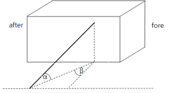

# Rules/Guidance for the Classification of High Speed and Light Crafts

> OTHER RULES AND GUIDANCE / RB-11-E / 2025 / EN / Guidance

## PART 1CLASSIFICATION AND SURVEYS

### CHAPTER 1 CLASSIFICATION

#### Section 1 General

- **101.** **Application**
  - **1.** In application to **101. 5** of the Rules, the terms "determined at the discretion of this Society" mean to comply with the requirements specified in the following **2.** through **7.**
  - **2.** Application
    - **(1)** This requirement is applied to the ships which are subject to Korean Ship Safety Act and Notification having a restricted to domestic service.
    - **(2)** For the items not mentioned in this requirements, they are to be comply with related requirements on Korean Ship Safety Act.
  - **3.** **Definition**
    $\frac{a}{A} \geq \frac{1}{2}$
    $a$ = area of opening on the upper deck
    $A$ = area of vehicle deck
    $\frac{a}{A} + \frac{5}{3} S_\frac{a}{S_A} \geq \frac{1}{2}$
    $a$, $A$ = as specified in (A)
    $S_a$ = area of opening on one side in vehicle area.
    $S_A$ = area of shell plating on one side in vehicle area.
    - **(1)** "Vehicle area" means the vehicle loading area indicated in vehicle arrangement.
    - **(2)** "Vehicle deck" means the deck providing passageway of vehicles or vehicle loading deck providing in vehicle area.
    - **(3)** "Open space" means the followings:
      - **(A)** The bulkhead is not provided at the end of fore and after, and openings are not provided on the shell plating of vehicle area. In this case, the area of openings on the upper deck of considering area is to be comply with the followings.
      - **(B)** When the openings are provided on the both side shell plating in vehicle area, the area of opening is comply with the following.
    - **(4)** "Closed space" means closed space with weathertight other than above mentioned (3)
    - **(5)** The weight of mediums stored on board for the fixed fire-fighting systems(e.g. freshwater,　CO2, dry chemical powder, foam concentrate, etc.) shall be included in the lightweight and　lightship condition given in the **103.** (9) of the **Rules**.*(2018)*
  - **4.** **Submission of plans and documentations**
    For the securing device of vehicle and cargo, the following plans and documentations are to be submitted.
  - **5.** **Vehicle area**
    - **(1)** Either one of the following equipment is to be provided to the ships having a closed space.
      - **(A)** CCTV which is capable of monitoring the whole vehicle area on the navigation bridge
      - **(B)** Light indicator and audible alarm which is capable of confirming the state of opening/closing of vehicle area entrance door on the navigation bridge
    - **(2)** Indication in vehicle area
      - **(A)** In the vehicle area, the passageway for the using of access door, stairway, life saving appliances or fire extinguishing appliances is to be provided. This passageway is to be discriminated boundary line with easily visible color.
      - **(B)** For the ferries, when the lamp or inside door is not provided in location of fore peak bulkhead the warning mark "Vehicles may not be loaded forward the fore peak bulkhead" is to be provided.
      - **(C)** Vehicle area is to be marked clearly and vehicle load plan including following items is to be posted in the location where they are easily recognized.
        - **(a)** Maximum load of ship
        - **(b)** Maximum number of vehicles
        - **(c)** Notice items in loading vehicle
      - **(D)** "Notice items in loading vehicle" in (C) (c) is as follows and is to be included in vehicle and cargo load plan.
        - **(a)** Axle loads are not to exceed 00 ton(axle load is reviewed based on the maximum load 00 ton truck.
        - **(b)** The total weight of vehicles(including loaded on the vehicle) which is loaded on ship are not to exceed 00 ton(the total weight of vehicles is reviewed based on the number(00 vehicles) of maximum load 00 ton truck.)
        - **(c)** When the loaded vehicles are increased according to the loading of similar vehicles, proper type and number of movable securing devices which has sufficient strength is to be provided additionally.
        - **(d)** When similar vehicles are loaded, the loading and arrangement of the vehicles are to be properly to ensure the stability.
  - **6.** **Vehicle load method and securing device**
    $W$ = total weight of vehicle(load + vehicle weight) ($\mathrm{t} on$)
    $x, y, z _{}$ = longitudinal, transverse and vertical distance from the center of rolling and pitching to the center of under consideration vehicle, respectively
    $\phi , \psi$ = rolling and pitching angle of ship as specified in **Table 1.1.1** respectively (deg) (see **Fig 1.1.1**)
    $T _{r} , T _{p}$ = rolling and pitching cycle of ship as specified in **Table 1.1.1** respectively (sec)
    $V$ = vertical force to deck during rolling and pitching of ship (ton) (see **Fig 1.1.1**)
    $H _{r}$ = force acting to transverse direction which is parallel to deck during rolling of ship (ton) (see **Fig 1.1.1**)
    $H _{p}$ = force acting to longitudinal direction which is parallel to deck during pitching of ship (ton) (see **Fig 1.1.1**)
    $M _{r}$ = overturing moments during rolling of ship (ton-m) (see **Fig 1.1.2**)
    $SF _{r} , SF _{p}$ = forces acting on vehicle which is parallel to longitudinal and transverse deck respectively (ton)
    $b _{m}$ = full width of vehicle (m) (see **Fig 1.1.2**)
    $b _{t}$ = spacing of wheels (m) (see **Fig 1.1.2**)
    $h _{m}$ = height from deck to the center of gravity of the vehicle (m) (see **Fig 1.1.2**)
    $L _{r} , L _{p}$ = sum of the transverse and longitudinal horizontal component which movable securing devices can withstand (ton)
    $M _{l}$ = sum of the force to resist for vehicle overturning moment by movable securing devices (ton)
    $n$ = number of movable securing devices used for one vehicle
    $\alpha , \beta$ = transverse and longitudinal angle between movable securing devices and deck respectively (deg) (see **Fig 1.1.2**)
    $h$ = height from deck to the point of vehicle securing (m) (see **Fig 1.1.2**)
    $T$ = safety working load of movable securing devices which is divided breaking load with safety factor of **Table 1.1.1** (ton)
    $\mu$ = friction coefficients between vehicle and deck, as shown below
    tire(rubber) / non-slipped paint: 0.7
    tire(rubber) / steel deck: 0.3
    steel / steel deck: 0.1(when dry)
    steel / steel deck: 0.0(when wet)
    timber / steel deck: 0.3

    **Table 1.1.1 Ship motion**

    | Rolling |   | Pitching |   | Safety factor |
    | --- | --- | --- | --- | --- |
    | degree | cycle 3) | degree | cycle | Safety factor |
    | 10° | cycle of ship | 5° | 5 sec | 4 over |
    | (Note) 1. $KG '$ is the value obtained from the following formula. $KG ' = 0.5 (KG + KB)$ $KG$ = the vertical position of the centric of the ship $KB$ = the vertical position of the buoyancy centric of the ship 2. The centric of pitching is to be longitudinal position of the centric of the ship. 3. The rolling cycle of the ship may be taken from $T _{R}$ of **Pt 3, Ch 2, 203. 2.** of the Rule. |   |   |   |   |

    |  |  |
    | --- | --- |

    **Fig 1.1.1 Motions of the ship**

    | Type |   | Load components ($rm"ton"$) |   |   |
    | --- | --- | --- | --- | --- |
    | Type |   | Vertical force | Horizontal force |   |
    | Type |   | Vertical force | transverse | longitudinal |
    | Static load | Rolling | $W \cos \phi$ | $Wsin \phi$ | - |
    | Static load | Pitching | $W \cos \psi$ | - | $Wsin \psi$ |
    | Static load | Combination | $W \cos (0.71 \phi ) \cos (0.71 \psi )$ | $Wsin (0.71 \phi)$ | $Wsin (0.71 \psi )$ |
    | Dynamic load | Rolling | $0.07024W \frac{\phi}{T _{r} ^{2}} y$ | $0.070247W \frac{\phi}{T _{r} ^{2}} z _{}$ | - |
    | Dynamic load | Pitching | $0.07024W \frac{\psi}{T _{p} ^{2}} x$ | - | $0.07024W \frac{\psi}{T _{p} ^{2}} z _{}$ |

    |  |
    | --- |
    |  |
    | **Fig 1.1.2** **Various dimensions during vehicle securing** |

    $V _{1} =W \left[ \cos(0.71 \phi )\cos(0.71 \psi )-0.07024 \frac{\phi}{T _{r} ^{2}} y-0.07024 \frac{\psi}{T _{p} ^{2}} x \right]$
    $V _{2} =W \left[ \cos \phi -0.07024 \frac{\phi}{T _{r} ^{2}} y \right]$
    $V _{3} =W \left[ \cos \psi -0.07024 \frac{\psi}{T _{p} ^{2}} x \right]$
    $H _{r} =W \left[ \sin \phi + \frac{0.07024 \phi}{T _{r} ^{2}} z \right]$
    $H _{p} =W \left[ \sin \psi + \frac{0.07024 \psi}{T _{p} ^{2}} z \right]$
    $SF _{r} =H _{r} - \mu V$
    $SF _{p} =H _{p} - \mu V$
    $M _{r} =H _{r} \times h _{m} -0.5V \times b _{m}$
    $L _{r} = \sum _{i=1} ^{n/2} T _{i} \cdot (\cos \alpha _{i} \cdot \cos \beta _{i} + \mu \sin \alpha _{i} )$
    $L _{p} = \sum _{i=1} ^{n/2} T _{i} \cdot (\cos \alpha _{i} \cdot \sin \beta _{i} + \mu \sin \alpha _{i} )$
    $M _{l} = \sum _{i=1} ^{n/2} T _{i} \cdot (0.5(b _{m} +b _{t} )\sin \alpha _{i} +h _{} \cdot \cos \alpha _{i} \cos \beta _{i} )$
    - **(1)** Vehicle load method
      - **(A)** Vehicles are to be loaded toward the direction of bow and stern. However, when the sufficient additional treatments for transverse sliding such as wedges etc. are provided, it may not be needed.
      - **(B)** Vehicles are not to be loaded forward the fore peak bulkhead.
      - **(C)** The space between loaded vehicles is not to be less than 600 mm.
      - **(D)** In the vehicle area, boundary line with easily visible color or the protection is to be provided for the access prohibition within 1 m near the access door, stairway and fire extinguishing arrangements.
      - **(E)** Vehicles are to be arranged to allow sufficient space for the passageway leading to assembly stations and embarkation stations etc. in an emergency.
    - **(2)** Vehicle securing method
      - **(A)** Vehicles are to be secured to the ship by fixed securing devices(e.g.: D-ring, Clover socket and Deck eye plate etc.) and movable securing devices(e.g.: Web lashing, Turn buckle and Chain etc.) which are comply with the requirements in (4).
      - **(B)** Securing devices(fixed and movable securing devices) fixing vehicles and general cargos are to be approved by the Society. However, when securing devices are manufactured by approved manufacturer which is approved by the Society according to international standard such as ISO etc., the approval may be replaced by the manufacturer's certificate.
      - **(C)** Sufficient number of fixed securing devices are to be provided to consider the loading of vehicles which are not marked in vehicle and cargo loading plan.
      - **(D)** movable securing devices for the ships(1,000 tons gross tonnage and above) engaged in coastal service and it's over are to be provided to more than 1.2 times of approved amount.
      - **(E)** The securing of vehicle is to be loaded in accordance with vehicle and cargo loading plan. Before and during the voyage, it is to be checked by crews.
      - **(F)** The securing of vehicle is to be secured by more than 4 wheels or 2 parts of front and rear of vehicle using provided securing devices in vehicle and more than 4 fixed securing devices.
      - **(G)** For the ships which is only engaged in smooth water and having not more than 30 min. of navigating time, the ships which has less than 1 hour of navigating time in smooth water and coastal area service and loaded with cars, less than 12-seater's passenger vans and 1.5 ton truck (For the ship having a port of call in middle of operation, a port of call as regarded as departure port and arrival port), if they have a sufficient treatments for non-slip as keys etc. with smooth sea condition(wave height is to be less than 1.5 $\mathrm{m}$ and wind speed is to be less than 7 $\mathrm{m}/\sec$), vehicles may not be secured.
    - **(3)** Vehicle cargo loading
      - **(A)** The capacity of cargo being loaded on the vehicle is to comply with following requirements.
        - **(a)** The length of loaded cargo is to be less than the length of vehicle plus one tenth of the length of vehicle
        - **(b)** The width of loaded cargo is to be less than the range which can be checked by rear view mirror.
        - **(c)** The height of loaded cargo is to be less than 4 m from the ground. Where the truck such as a van etc. having cargo space with roof cover, the height is from the ground to the top of the cover.
      - **(B)** Cargo being loaded on the vehicle is to be secured to ensure the load by the movements of ship which is described in the (4).
    - **(4)** Strength of securing device
      - **(A)** The definitions of terms that are used to assess the strength of the securing devices are as follows.
      - **(B)** The loads acting on the securing device is to be determined in consideration of the movements of ship which is described in the **Table 1.1.1**.
      - **(C)** Each component of the loads caused by motions of the ship is shown in **Fig 1.1.1** and **Table 1.1.2**.
      - **(D)** The forces caused by motions of the ship are as follows.
        - **(a)** Vertical force: the smallest among $V _{1} , V _{2}$ and $V _{3}$
        - **(b)** Transverse horizontal force:
        - **(c)** Longitudinal horizontal force:
      - **(E)** The loads to be considered as acting on the vehicle are to be determined according to following formula.
        - **(a)** Transverse horizontal force
        - **(b)** Longitudinal horizontal force
        - **(c)** Rolling overturing moments
      - **(F)** The forces caused by motions of the ship are as follows.
        - **(a)** Transverse horizontal component:
        - **(b)** Longitudinal horizontal component:
        - **(c)** overturing moments horizontal component:
      - **(G)** Movable securing devices are to be complied with following formula.
        - **(a)** Transverse horizontal component : $SF _{r} \leq L _{r}$
        - **(b)** Longitudinal horizontal component : $SF _{p} \leq L _{p}$
        - **(c)** overturing moments horizontal component : $M _{r} \leq M _{l}$
    - **(5)** Drawing guidance for vehicle and cargo loading plan
      - **(A)** The arrangement and loading method of vehicles intended to load among the vehicles as specified in "Enforcement Regulations of the Automobile Management Act Appendix Table 1" is to be indicated in the loading plan. In this case, where the total weight of the vehicle is within the range of the total weight of the approved vehicle and fixation method and securing strength is suitable, other vehicles, construction machinery as specified in "Presidential Decree for the Construction Machinery Management Act Appendix Table 1" and agricultural machinery as specified in "Enforcement Regulations of the Agricultural Mechanization Promotion Act Appendix Table 1" etc. are to be loaded in accordance with the loading plan.
      - **(B)** Notwithstanding the (A) above, where the vehicle type intended to load is decided by the owner of ship especially, the vehicle loading plan reflected the arrangement and loading method of the vehicle is to be approved.
      - **(C)** Where intended to load the vehicle other than (A) above, the vehicle loading plan reflected the arrangement and loading method of the vehicle is to be approved additionally. .
      - **(D)** Vehicle and cargo loading plan is to be included following items.
        - **(a)** arrangement and detail of fixed securing devices(types, material, breaking strength etc.)
        - **(b)** detail of movable securing devices(material, breaking strength, instructions etc.)
        - **(c)** arrangement and securing details for the vehicles intended to load(position of securing point of vehicle and ship, type of movable securing devices)
        - **(d)** specification of the vehicles intended to load(length and width of vehicle, vehicle weight including cargo weight)
        - **(e)** fire-extinguishing appliances, drainage facilities and passageway
        - **(f)** notice in **Par 6** (8) (D)
        - **(g)** when cargoes other than vehicles are loaded, the description of loading and securing method
      - **(E)** The plan is to be not less than a 1:200 scale.
    - **(6)** Cargo loading other than vehicles
      - **(A)** In the vehicle area, unless it is approved by the Society, no cargoes other than vehicles may be loaded. For the cargoes loading other than vehicles, the documents for the closure and loading arrangements by the kinds of cargoes are to be submitted and approved by this Society.
      - **(B)** For freight container in one tier, the container is to be secured at their lower 4 corners by fixed securing devices(socket, D-ring, sliding base, lashing plate etc.) which is secured to the ship. For freight container in more than two tiers, the container is to be secured at their lower 4 corners to the upper 4 corners of below container by movable securing devices(twist lock, stacker etc.) or the container is to be secured directly to ship by lashing rod or turnbuckle. These fixed and movable securing devices are to comply with the requirement in **Guidance Pt 7,** Annex 7-2.
      - **(C)** General cargoes(excluding passenger's personal belongings) except cargoes approved in vehicle and cargo loading plan it's arrangement ∙ loading ∙ securing method is to be loaded in storage facilities to made available for securing and is to be secured to comply with the requirement in (4).
  - **7.** **Electric equipment**
    - **(1)** Installation and utilization of electricity supply cables to loaded vehicle
      - **(A)** A ship with enclosed vehicle loading space which carries live-fish transporting trucks must be installed with reel lead electricity supply cables which satisfies the below requirements, readily available to supply electricity for every each vehicle it carries.
        - **(a)** Must have a circuit breaker for overload
        - **(b)** Cables must be fire resistant
      - **(B)** A live-fish transporting truck on board the ship must have it's engine turned off during the voyage and acquire the electricity necessary for oxygen supplier from the ship. 
