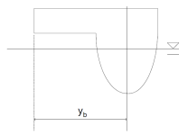

# Rules/Guidance for the Classification of High Speed and Light Crafts

> OTHER RULES AND GUIDANCE / RB-11-E / 2025 / EN / Guidance

## PART 3HULL STRUCTURES

### CHAPTER 1 DESIGN IN GENERAL

#### Section 2 General

303030

- **203.** **Direct strength calculations**
  - **1.** Where scantlings of structural members are determined based on the direct strength calculation, ANNEX 3-1 **「Guidance for the Direct Strength Assessment」**shall be followed. If the application of the Guidance is considered inappropriate, analysis method, loads and allowable stress as deemed appropriate by the Society may be applied.
  - **2.** Based on the results according to the direct strength calculation, the buckling strength of the structural members are to be examined by using the method and allowable stress given in ANNEX 3-2 **「Guidance for the Buckling Strength Calculation」**.

#### Section 4 Subdivision and Arrangement (2016)

- **410.** **Doors, windows, etc., in boundaries of weathertight spaces**
  - **1.** (1) In application to **410. 1.** of the Rules, the doors on the superstructure forward end wall of the ships are not to be made by FRP. This requirement is to apply to ships with HSLC notation engaged on domestic voyage only.
    - **(2)** Windows fitted on weather-tight doors are to remain securely fixed. 

#### Annex 3-1 Guidance for the Direct Strength Assessment

#### Annex 3-2 Guidance for Buckling Strength Calculation

### CHAPTER 2 DESIGN LOADS

#### Section 4 Hull Girder Loads

- **402.** **Twin hull loads**
  - **2.** **Transverse bending moment and shear force**
    $M _{SO} =4.91 \Delta (y _{b} -0.4B ^{0.88} ) ( \mathrm{kN} \cdot m)$
    $y _{b}$ : Distance in m from centre line to local centre line of one hull (See **Fig.3.2.1**) 

    |  |
    | --- |
    | **Fig 3.2.1 Definition** $y _{b}$ **of local geometry for one hull on twin hull craft** |
    - **(4)** For craft with length L ≥ 50 m the twin hull still water transverse bending moment shall be assumed to be:

### CHAPTER 4 STRUCTURE PRINCIPLES IN ALUMINIUM ALLOY

#### Section 4 Hull Girder Strength

- **401.** **Application**
  Material factor ($K$) is to be as follows. 

  | Grade | Temper condition | $K$ |
  | --- | --- | --- |
  | A 5052 P | H32 H34 | 1.64 1.45 |
  | A 5154A P | O, H111 | 2.86 |
  | A 5454 P | H32 H34 | 1.37 1.27 |
  | A 5086 P | H116, H32 H34 | 1.25 1.14 |
  | A 5083 P | H116, H321 | 1.12 |
  | (Remarks) For temper condition O and H111, the factor $K$ is to be taken from **Table 3.4.4** |   |   |

  | Grade | Temper condition | $K$ |
  | --- | --- | --- |
  | A 6061 S | T5/T6 | 1.32 |
  | A 6005A S | T5/T6 | 1.32 |
  | A 6082 S | T5/T6 | 1.11 |

  | Grade | Temper condition | $K$ |
  | --- | --- | --- |
  | A 6061 S | T5/T6 | 1.41 |
  | A 6005A S | T5/T6 6≤ t ≤10 10≤ t ≤25 | 1.32 1.49 |
  | A 6082 S | T5/T6 | 1.18 |

  | Grade | Temper condition | Welding consumables | $K$ |
  | --- | --- | --- | --- |
  | A 5052 | O, H111, H32, H34 | A 5356 BY/WY | 3.70 |
  | A 5154A | O, H111 | A5356- A5183BY/WY | 2.86 |
  | A 5454 | O, H111, H32, H34 | A5356- A5183BY/WY | 2.86 |
  | A 5086 | O, H111, H116, H32, H34 | A5356- A5183BY/WY | 2.38 |
  | A 5083 | H116, H321, H116, H321 | A 5356 BY/WY A 5183 BY/WY | 1.89 1.67 |
  | A 6061 | T5/T6 | A5356- A5183BY/WY | 2.08 |
  | A 6005A | T5/T6 | A5356- A5183BY/WY | 2.08 |
  | A 6082 | T5/T6 | A5356- A5183BY/WY | 2.08 |

### CHAPTER 5 STRUCTURE PRINCIPLES IN FRP

#### Section 1 General

- **101.** **Application**
  - **1.** The scantlings for hull structure's members of ship 60 m or more in length are in accordance with **Annex 3-1, Guidance for the Direct Strength Assessment.** 
