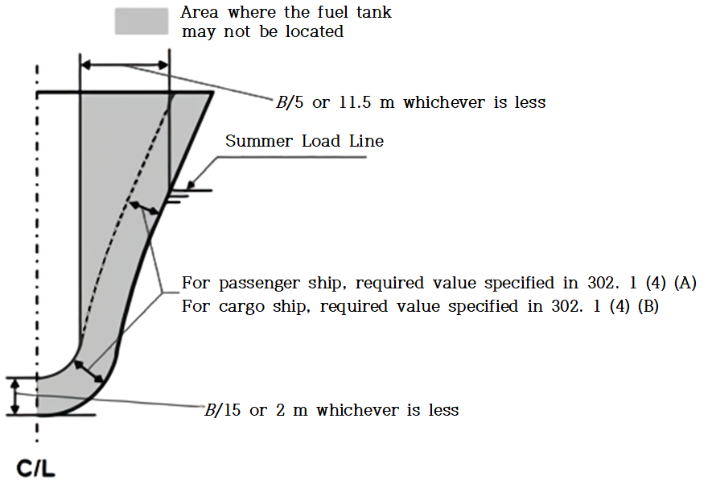

# Ships Using Low-flashpoint Fuels

> OTHER RULES AND GUIDANCE / RB-14-E / 2025 / EN / Rules

## CHAPTER 5 SHIP DESIGN AND ARRANGEMENT

### Section 1 General

#### 101. Goal

The goal of this Chapter is to provide for safe location, space arrangements and mechanical protection of power generation equipment, fuel storage systems, fuel supply equipment and refuelling systems.

### Section 2 Functional Requirements

#### 201. Functional requirements

This Chapter is related to functional requirements in **Ch 2, 201. 1**~**3**, **5**, **6**, **8**, **12**~**15** and **17**. In particular the following apply:

- **1.** the fuel tank is to be located in such a way that the probability for the tank to be damaged following a collision or grounding is reduced to a minimum taking into account the safe operation of the ship and other hazards that may be relevant to the ship;
- **2.** fuel containment systems, fuel piping and other fuel sources of release are to be so located and arranged that released gas is led to a safe location in the open air;
- **3.** the access or other openings to spaces containing fuel sources of release is to be so arranged that flammable, asphyxiating or toxic gas cannot escape to spaces that are not designed for the presence of such gases
- **4.** fuel piping is to be protected against mechanical damage;
- **5.** the propulsion and fuel supply system is to be so designed that safety actions after any gas leakage do not lead to an unacceptable loss of power; and
- **6.** the probability of a gas explosion in a machinery space with gas or low-flashpoint fuelled machinery is to be minimized.

### Section 3 Arrangement of Fuel Tanks

#### 301. General requirements

- **1.** Fuel storage tanks are to be protected against mechanical damage.
- **2.** Fuel storage tanks and equipment located on open deck are to be located to ensure sufficient natural ventilation, so as to prevent accumulation of escaped gas.

#### 302. Location of fuel tanks

- **1.** The fuel tanks are to be protected from external damage caused by collision or grounding in the following way(see **Fig 5.1**):
  - **(1)** The fuel tanks are to be located at a minimum distance of B/5 or 11.5 $\mathrm{m}$, whichever is less, measured inboard from the ship side at right angles to the centreline at the level of the summer load line draught;
  - **(2)** The boundaries of each fuel tank are to be taken as the extreme outer longitudinal, transverse and vertical limits of the tank structure including its tank valves.
  - **(3)** For independent tanks the protective distance is to be measured to the tank shell (the primary barrier of the tank containment system). For membrane tanks the distance is to be measured to the bulkheads surrounding the tank insulation..
  - **(4)** In no case is the boundary of the fuel tank to be located closer to the shell plating or aft terminal of the ship than as follows:
    B/10 but in no case less than 0.8 $\mathrm{m}$. However, this distance need not be greater than B/15 or 2 $\mathrm{m}$ whichever is less where the shell plating is located inboard of B/5 or 11.5 $\mathrm{m}$, whichever is less, as required by (1).
    where:
    $V _{c}$ : corresponds to 100 % of the gross design volume of the individual fuel tank at 20 °C, including domes and appendages.
    - **(A)** For passenger ships:
    - **(B)** For cargo ships:
      - **(a)** for $V _{c} \leq 1,000 \mathrm{m} ^{3}$, $rm 0.8 m$;
      - **(b)** for $1,000 {\mathrm{m}} ^{3} \prec V _{c} \prec 5,000 \mathrm{m} ^{3}$, $0.75 + V _{c} \times 0.2/4,000 \mathrm{m}$;
      - **(c)** for $rm 5,000 m ^{3} \leq V _{c} \prec 30,000 m ^{3}$, $0.8 + V _{c} /25,000 \mathrm{m}$; and
      - **(d)** for $V _{c} \geq 30,000 \mathrm{m} ^{3}$, $rm 2 m$,
  - **(5)** The lowermost boundary of the fuel tanks is to be located above the minimum distance of B/15 or 2.0 $\mathrm{m}$, whichever is less, measured from the moulded line of the bottom shell plating at the centreline.
  - **(6)** For multihull ships the value of B may be specially considered.
  - **(7)** The fuel tank is to be abaft a transverse plane at 0.08L measured from the forward perpendicular in accordance with **SOLAS II-1/8.1** for passenger ships, and abaft the collision bulkhead for cargo ships.
  - **(8)** For ships with a hull structure providing higher collision and/or grounding resistance, fuel tank location regulations may be specially considered in accordance with **Ch 1, 103..**
    
    Fig 5.1 Location of Fuel Tank
- **2.** As an alternative to **1** (1) above, the following calculation method may be used to determine the acceptable location of the fuel tanks:
  - **(1)** The value $f _{CN}$ calculated as described in the following is to be less than 0.02 for passenger ships and 0.04 for cargo ships.
    The value $f _{CN}$ accounts for collision damages that may occur within a zone limited by the longitudinal projected boundaries of the fuel tank only, and cannot be considered or used as the probability for the fuel tank to become damaged given a collision. The real probability will be higher when accounting for longer damages that include zones forward and aft of the fuel tank.
  - **(2)** The $f _{CN}$ is calculated by the following formulation:
    $f _{CN}$ = $f _{l}$ × $f _{t}$ × $f _{v}$
    where:
    $f _{l}$ = the calculated value by use of the formulations for factor $p$ contained in **SOLAS II-1/7-1.1.1.1**. The value of $x1$ is to correspond to the distance from the aft terminal to the aftmost boundary of the fuel tank and the value of $x2$ is to correspond to the distance from the aft terminal to the foremost boundary of the fuel tank.
    $f _{t}$ = the calculated value by use of the formulations for factor $r$ contained in **SOLAS II-1/7-1.1.2**, and reflects the probability that the damage penetrates beyond the outer boundary of the fuel tank. The formulation is:
    $f _{t} =1-r(x1,x2,b)$
    When the outermost boundary of the fuel tank is outside the boundary given by the deepest subdivision waterline the value of $b$ is to be taken as 0.
    $f _{v}$ = the calculated value by use of the formulations for factor $v$ contained in **SOLAS II-1/7-2.6.1.1** and reflects the probability that the damage is extending vertically above the lowermost boundary of the fuel tank. The formulations to be used are:
    $f _{v} =1.0-0.8 \cdot ((H-d)/7.8)$, if $(H-d)$ is less than or equal to 7.8 $\mathrm{m}$, $f_{ v}$ is not to be taken greater than 1.
    $f _{v} =0.2-(0.2 \cdot ((H-d)-7.8)/4.7)$, in all other cases $f_{ v}$ is not be taken less than 0.
    where:
    $H$ is the distance from baseline, in metres, to the lowermost boundary of the fuel tank; and
    $d$ is the deepest draught (summer load line draught).
  - **(3)** The boundaries of each fuel tank are to be taken as the extreme outer longitudinal, transverse and vertical limits of the tank structure including its tank valves.
  - **(4)** For independent tanks the protective distance is to be measured to the tank shell (the primary barrier of the tank containment system). For membrane tanks the distance is to be measured to the bulkheads surrounding the tank insulation.
  - **(5)** In no case is the boundary of the fuel tank to be located closer to the shell plating or aft terminal of the ship than as follows:
    B/10 but in no case less than 0.8 $\mathrm{m}$. However, this distance need not be greater than B/15 or 2 $\mathrm{m}$ whichever is less where the shell plating is located inboard of B/5 or 11.5 $\mathrm{m}$, whichever is less, as required by **1** (1).
    where:
    $V _{c}$ : corresponds to 100 % of the gross design volume of the individual fuel tank at 20 °C, including domes and appendages.
    - **(A)** For passenger ships:
    - **(B)** For cargo ships:
      - **(a)** for $V _{c} \leq 1,000 \mathrm{m} ^{3}$, $rm 0.8 m$;
      - **(b)** for $1,000 {\mathrm{m}} ^{3} \prec V _{c} \prec 5,000 \mathrm{m} ^{3}$, $0.75 + V _{c} \times 0.2/4,000 \mathrm{m}$;
      - **(c)** for $5,000 {\mathrm{m}} ^{3} \leq V _{c} \prec 30,000 \mathrm{m} ^{3}$, $0.8 + V _{c} /25,000 \mathrm{m}$; and
      - **(d)** for $V _{c} \geq 30,000 \mathrm{m} ^{3}$, $rm 2 m$,
  - **(6)** In case of more than one non-overlapping fuel tank located in the longitudinal direction, $f _{CN}$ is to be calculated in accordance with (2) for each fuel tank separately. The value used for the complete fuel tank arrangement is the sum of all values for $f _{CN}$ obtained for each separate tank.
  - **(7)** In case the fuel tank arrangement is unsymmetrical about the centreline of the ship, the calculations of $f _{CN}$ is to be calculated on both starboard and port side and the average value is to be used for the assessment. The minimum distance as set forth in (5) is to be met on both sides.
  - **(8)** For ships with a hull structure providing higher collision and/or grounding resistance, fuel tank location regulations may be specially considered in accordance with **Ch 1**, **103.**.
- **3.** When fuel is carried in a fuel containment system requiring a complete or partial secondary barrier:
  - **(1)** fuel storage hold spaces are to be segregated from the sea by a double bottom; and
  - **(2)** the ship is to also have a longitudinal bulkhead forming side tanks.

### Section 4 Machinery Space Concepts

#### 401. Machinery space concepts

In order to minimize the probability of a gas explosion in a machinery space with gas-fuelled machinery one of these two alternative concepts may be applied:

- **1.** Gas safe machinery spaces: Arrangements in machinery spaces are such that the spaces are considered gas safe under all conditions, normal as well as abnormal conditions, i.e. inherently gas safe. In a gas safe machinery space a single failure cannot lead to release of fuel gas into the machinery space.
- **2.** ESD-protected machinery spaces: Arrangements in machinery spaces are such that the spaces are considered non-hazardous under normal conditions, but under certain abnormal conditions may have the potential to become hazardous. In the event of abnormal conditions involving gas hazards, emergency shutdown (ESD) of non-safe equipment (ignition sources) and machinery is to be automatically executed while equipment or machinery in use or active during these conditions are to be of a certified safe type. In an ESD protected machinery space a single failure may result in a gas release into the space. Venting is designed to accommodate a probable maximum leakage scenario due to technical failures. Failures leading to dangerous gas concentrations, e.g. gas pipe ruptures or blow out of gaskets are covered by explosion pressure relief devices and ESD arrangements. **【See Guidance】**

### Section 5 Gas Safe Machinery Space

#### 501. Gas safe machinery space

- **1.** A single failure within the fuel system is not to lead to a gas release into the machinery space.
- **2.** All fuel piping within machinery space boundaries is to be enclosed in a gas tight enclosure in accordance with **Ch 9, 601..**

### Section 6 ESD-Protected Machinery Spaces

#### 601. ESD-protected machinery spaces

- **1.** ESD protection is to be limited to machinery spaces that are certified for periodically unattended operation. **【See Guidance】**
- **2.** Measures are to be applied to protect against explosion, damage of areas outside of the machinery space and ensure redundancy of power supply. The following arrangement is to be provided but may not be limited to:
  - **(1)** gas detector;
  - **(2)** shutoff valve;
  - **(3)** redundancy; and
  - **(4)** efficient ventilation.
- **3.** Gas supply piping within machinery spaces may be accepted without a gastight external enclosure on the following conditions:
  - **(1)** Engines for generating propulsion power and electric power are to be located in two or more machinery spaces not having any common boundaries unless it can be documented that a single casualty will not affect both spaces.
  - **(2)** The gas machinery space is to contain only a minimum of such necessary equipment, components and systems as are required to ensure that the gas machinery maintains its function.
  - **(3)** A fixed gas detection system arranged to automatically shutdown the gas supply, and disconnect all electrical equipment or installations not of a certified safe type, is to be fitted.
- **4.** Distribution of engines between the different machinery spaces is to be such that shutdown of fuel supply to any one machinery space does not lead to an unacceptable loss of power.
- **5.** ESD protected machinery spaces separated by a single bulkhead are to have sufficient strength to withstand the effects of a local gas explosion in either space, without affecting the integrity of the adjacent space and equipment within that space.
- **6.** ESD protected machinery spaces are to be designed to provide a geometrical shape that will minimize the accumulation of gases or formation of gas pockets.
- **7.** The ventilation system of ESD-protected machinery spaces is to be arranged in accordance with **Ch 13, 501..**

### Section 7 Location and Protection of Fuel Piping

#### 701. Location and protection of fuel piping

- **1.** Fuel pipes are to not be located less than 800 $\mathrm{mm}$ from the ship's side.
- **2.** Fuel piping is to not be led directly through accommodation spaces, service spaces, electrical equipment rooms or control stations as defined in the SOLAS Convention. **【See Guidance】**
- **3.** Fuel pipes led through ro-ro spaces, special category spaces and on open decks are to be protected against mechanical damage.
- **4.** Gas fuel piping in ESD protected machinery spaces is to be located as far as practicable from the electrical installations and tanks containing flammable liquids.
- **5.** Gas fuel piping in ESD protected machinery spaces is to be protected against mechanical damage.

### Section 8 Fuel Preparation Room

#### 801. Fuel preparation room 【See Guidance】

Fuel preparation rooms are to be located on an open deck, unless those rooms are arranged and fitted in accordance with the regulations of this Rules for tank connection spaces.

### Section 9 Bilge Systems

#### 901. Bilge systems

- **1.** Bilge systems installed in areas where fuel covered by this Rules can be present are to be segregated from the bilge system of spaces where fuel cannot be present.
- **2.** Where fuel is carried in a fuel containment system requiring a secondary barrier, suitable drainage arrangements for dealing with any leakage into the hold or insulation spaces through the adjacent ship structure are to be provided. The bilge system is to not lead to pumps in safe spaces. Means of detecting such leakage are to be provided.
- **3.** The hold or interbarrier spaces of type A independent tanks for liquid gas are to be provided with a drainage system suitable for handling liquid fuel in the event of fuel tank leakage or rupture.

### Section 10 Drip Trays

#### 1001. Drip trays

- **1.** Drip trays are to be fitted where leakage may occur which can cause damage to the ship structure or where limitation of the area which is effected from a spill is necessary.
- **2.** Drip trays are to be made of suitable material.
- **3.** The drip tray is to be thermally insulated from the ship's structure so that the surrounding hull or deck structures are not exposed to unacceptable cooling, in case of leakage of liquid fuel.
- **4.** Each tray is to be fitted with a drain valve to enable rain water to be drained over the ship's side.
- **5.** Each tray is to have a sufficient capacity to ensure that the maximum amount of spill according to the risk assessment can be handled.

### Section 11 Arrangement of Entrances and Other Openings in Enclosed Spaces

#### 1101. Arrangement of entrances and other openings in enclosed spaces

- **1.** Direct access is not to be permitted from a non-hazardous area to a hazardous area. Where such openings are necessary for operational reasons, an airlock which complies with **1201.** is to be provided.
- **2.** If the fuel preparation room is approved located below deck, the room is to, as far as practicable, have an independent access direct from the open deck. Where a separate access from deck is not practicable, an airlock which complies with **1201.** is to be provided.
- **3.** Unless access to the tank connection space is independent and direct from open deck it is to be arranged as a bolted hatch. The space containing the bolted hatch will be a hazardous space.
- **4.** If the access to an ESD-protected machinery space is from another enclosed space in the ship, the entrances are to be arranged with an airlock which complies with **1201.**.
- **5.** For inerted spaces access arrangements are to be such that unintended entry by personnel is to be prevented. If access to such spaces is not from an open deck, sealing arrangements are to ensure that leakages of inert gas to adjacent spaces are prevented.

### Section 12 Airlocks

#### 1201. Airlocks

- **1.** An airlock is a space enclosed by gastight bulkheads with two substantially gastight doors spaced at least 1.5 $\mathrm{m}$ and not more than 2.5 $\mathrm{m}$ apart. Unless subject to the requirements of the International Convention on Load Lines, the door sill is to not be less than 300 $\mathrm{mm}$ in height. The doors are to be self-closing without any holding back arrangements.
- **2.** Airlocks are to be mechanically ventilated at an overpressure relative to the adjacent hazardous area or space. The ventilating fans for air-lock space and their air intakes are to be provided in the gas-safe space. In this case, the ventilating fans may not comply with the requirements in **Ch 13, 303. 1**. Protection screens of not more than 13 $\mathrm{mm}$×13 $\mathrm{mm}$ square mesh are to be fitted in outside openings of ventilation ducts.
- **3.** The airlock is to be designed in a way that no gas can be released to safe spaces in case of the most critical event in the gas dangerous space separated by the airlock. The events are to be evaluated in the risk analysis according to **Ch 3, 201.**
- **4.** Airlocks are to have a simple geometrical form. They are to provide free and easy passage, and are to have a deck area not less than 1.5 $\mathrm{m} ^{2}$. Airlocks are to not be used for other purposes, for instance as store rooms.
- **5.** An audible and visual alarm system to give a warning on both sides of the airlock is to be provided to indicate if more than one door is moved from the closed position.
- **6.** For non-hazardous spaces with access from hazardous spaces below deck where the access is protected by an airlock, upon loss of underpressure in the hazardous space access to the space is to be restricted until the ventilation has been reinstated. Audible and visual alarms are to be given at a manned location to indicate both loss of pressure and opening of the airlock doors when pressure is lost.
- **7.** Essential equipment required for safety is not to be de-energized and is to be of a certified safe type. This may include lighting, fire detection, public address, general alarms systems. 
