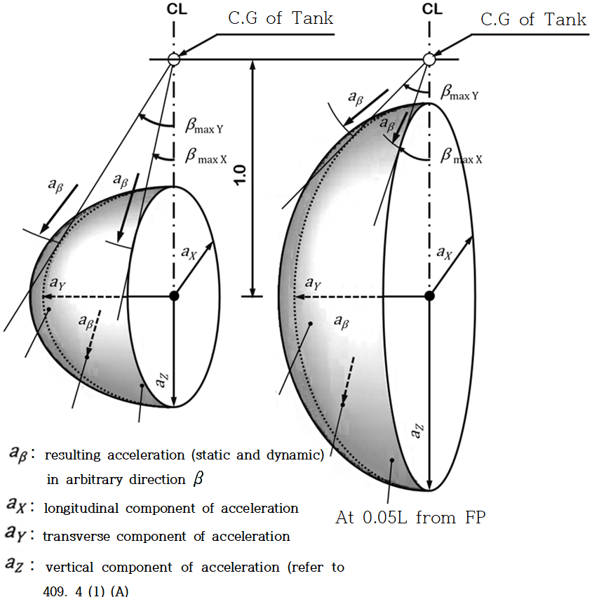

# Ships Using Low-flashpoint Fuels

> OTHER RULES AND GUIDANCE / RB-14-E / 2025 / EN / Guidance

## CHAPTER 6 FUEL CONTAINMENT SYSTEM

### Section 3 General Requirements

#### 301. General requirements

- **1.** In applying **301. 5** of this Rules, special consideration by the Society means to comply with the requirement specified in **301. 9** of this Rules. **【See Rules】**
- **2.** In applying **301. 10** of this Rules, whether a drip tray is needed or not is to be in accordance with the following: **【See Rules】**
  - **(1)** When the tank is located on the open deck, drip trays are to be provided to protect the deck from leakages from tank connections and other sources of leakage.
  - **(2)** When the tank is located below the open deck but the tank connections are on the open deck, drip trays are to be provided to protect the deck from leakages from tank connections and other sources of leakage.
  - **(3)** When the tank and the tank connections are located below the deck, all tank connections are to be located in a tank connection space. Drip trays in this case are not required.

### Section 4 Liquefied Gas Fuel Containment

#### 404. Design of secondary barriers (2019)

- **1.** In applying **404.** of the Rules, the secondary barriers of nonmetal material are to conform to the following requirements : **【See Rules】**
  - **(1)** Compatibility with the fuel is to have been verified, and to have necessary mechanical properties at the fuel temperature under the atmospheric pressure.
  - **(2)** A model test may be required to prove that the secondary barrier has effective performance when the Society deems it necessary.
  - **(3)** For joints, joining procedure tests and production test are to be conducted. The test plans for the above are to have been approved by the Society beforehand.
- **2.** In applying **404. 1** of the Rules, no special analysis of the complete secondary barrier for verifying that "it is capable of containing any envisaged leakage of liquid fuel for a period of 15 days" may be carried out except for cases where the Society deems it specially necessary. **【See Rules】**
- **3.** In applying **404. 4** of the Rules, the test procedure where visual inspection of the secondary barrier is not possible is to be in accordance with the following requirements : **【See Rules】**
  - **(1)** The inspection method of the secondary barrier and its criteria relating to the performance to act as the secondary barrier are to be verified for their effectiveness through model test.
  - **(2)** The secondary barrier is to be verified by model test for the required performance. This model test is to be capable of verifying that the secondary barrier can maintain the necessary performance throughout the life of the ship.
  - **(3)** When sufficient data to prove the effectiveness and reliability relative to the preceding (1) and (2) are submitted to the satisfaction of the Society, this model test may be omitted.

#### 405. Partial secondary barriers and primary barrier small leak protection system (2019) 【See Rules】

- **1.** **Partial secondary barrier**
  - **(1)** The protection of the inner bottom plating at the lower part of fuel tanks is to conform to the following requirements :
    
    Fig. 6.1 Drip Tray to protect the inner bottom plate
    - **(A)** In case where a drip tray is provided as a secondary barrier for example as shown in Fig **6.1** with consideration so as not to allow the leaked liquid fuel to overflow from the secondary barrier, no protection may be required. However, where no such consideration is taken, the inner bottom plating is to be protected by insulation materials.
  - **(2)** The spray shield specified in **405. 1** of the Rules is to have been verified by test that it has satisfactory performance to act as the shield. **【See Rules】**

#### 406. Supporting Arrangement (2019) 【See Rules】

- **1.** In spaces between the refrigerated tanks and supports, suitable insulation materials are to be provided so that hull structure might not be cooled excessively through the supporting structures according to requirement of **413. 1** of the Rules.

#### 408. Thermal insulation 【See Rules】

- **1.** In applying **408.** of this Rules, the insulation of vacuum insulated tanks is to be approved in accordance with the requirements in **Annex 1**. *(2020)*

#### 409. Design Loads (2019)

- **1.** **Thermally induced loads 【See Rules】**
  - **(1)** In applying **409. 3** (3) (C) (a) of the Rules, arrangements for cooling down are to be provided so as not to cause excessive stress on the tank structures.
  - **(2)** The arrangements shown in the preceding (1) are to be such that safety in cooling down using the arrangements has been proved by records of fuel tanks of similar design or cooling down operation is performed at a rate not exceeding the safe temperature reduction curve which has been proved by thermal stress analysis.
  - **(3)** The installations shown in the preceding (1) are to be also capable of performing cooling down at time when excessive thermal loads may be anticipated due to splashing of the residual fuel liquid in ballast passage of the ship under heavy weather as well as at time of fuel loading.
  - **(4)** In applying **409. 3** (3) (C) (b) of the Rules, the structural strength is to be verified through thermal stress analysis by taking into account the vertical temperature distribution at time of cooling down and partial fuel loading, and when necessary, the temperature distribution in the direction of the plate thickness of plating of full loaded tanks.
  - **(5)** For tanks other than those specified in the preceding (4), the Society may request thermal stress analysis of the fuel tank by taking into account the constraining condition of the fuel tank by tank supporting structure in case where the tank supporting system is special, and thermal analysis in consideration of the effect of materials with different coefficients of thermal expansion in case where such materials are used.
  - **(6)** In the cases referred to in the preceding (4) and (5) where the type of tank supporting system is special, the Society may request thermal analysis on the tank supporting structure itself.
- **2.** **Vibration 【See Rules】**
  - **(1)** In applying **409. 3** (3) (D) of the Rules, the liquefied gas fuel tank plates and stiffeners are to have such scantlings as not to be caused harmful effects by resonance with the vibrations of exciting sources such as propeller and main engine. The natural frequencies of the liquefied gas fuel tanks and stiffeners used in the above assessment are to be minimum values in a state in contact with fuel liquid.
- **3.** **Static heel loads 【See Rules】**
  - **(1)** In applying **409. 3** (3) (H) of the Rules, the added mass due to hull damage or flooding may not be considered.
- **4.** **Loads due to ship motion 【See Rules】**
  - **(1)** As a "Method to predict accelerations due to ship motion" referred to in the requirement in **409. 4** (1) (A) of the Rules, the formulas for acceleration components in **Pt 7, Ch 5, 428. 2** (1) of **Rules for the Classification of Steel Ships** can be referred to**.** *(2020)*
  - **(2)** The "Ships for the restricted service" referred to in **409. 4** (1) (A) of the Rules means those ships with notations "Coasting Service" or "Smooth Water Service" affixed. In this case, the dynamic load may be determined by the results of calculation of ship motions carried out on the basis of the data on sea and weather conditions at the navigating area which are considered appropriately by the Society.
- **5.** **Sloshing Loads 【See Rules】**
  - **(1)** In applying **409. 4** (1) (C) of the Rules, sloshing loads are to be determined in such a way that assessments are made by model experiment for each type of fuel tanks. Data concerning the resonant period of the hull and natural period of the liquids are to be available on board the ship for avoiding the danger of resonance.
  - **(2)** Notwithstanding the requirements in the preceding (1), in the type C independent tank in ships with $L _{f}$ not exceeding 90 $\mathrm{m}$, consideration for structural strength of cargo tanks due to sloshing loads may not be necessary. However, sufficient consideration is to be taken for the installation of equipment in cargo tanks such as cargo piping and cargo pump, against impact loads due to sloshing.

#### 412. Design Conditions (2019)

- **1.** **Ultimate design condition**
  - **(1)** In applying **412. 1** (1) (C) of the Rules, the values of $R _{e}$ and $R _{m}$ when the strength of welds is less than that of the parent metal as in the case of 9 % nickel steel are to be of the required values of mechanical properties of the weld metal. For welded joints of aluminium alloys 5083-O and 5083/5183 and 9 % nickel steel, the values of $R _{e}$ and $R _{m}$ may be modified in consideration of the increase in the yield stress and tensile stress at low temperature after taking into account the welding procedure employed. **【See Rules】**
- **2.** **Fatigue design condition**
  - **(1)** In applying **412. 2** of the Rules, the stress due to fatigue load may be generally determined by using the cumulative probability curve as shown in Fig **6.2. 【See Rules】**
    
    Fig 6.2 Cumulative probability curve
  - **(2)** When the fatigue strength analysis specified in the requirements in **415. 2** (B) of the Rules is carried out using the frequency distribution of cyclic stress shown in the preceding (1), the number of representative stress($\sigma _{i}$) is to be eight, and $\sigma _{i}$ and its number of repetition $n _{i}$ may be obtained from the following equations :
    $\sigma i = \frac{17-2 \cdot i}{16} \sigma _{eqalign{\max\#
    }}\#
    \#
    n i =0.9 \times 10 i$
    where :
    $i$ = 1, 2,...., 8
    $\sigma _{ma x}$ : stress induced by the predicted maximum dynamic load
  - **(3)** For the purpose of **412. 2** (6) of the Rules, the fatigue load used in the calculation of propagation speed of fatigue cracks is, as a rule, to be the predicted maximum load value that can occur at the most severe period in the trade area specified. In case where analysis is made by using the load frequency distribution given in Fig **6.3** of the Rules, the number of representative stress($\sigma _{i}$) is to be set at five and its number of repetition $n _{i}$ may be obtained from the following equations : **【See Rules】**
    $\sigma i = \frac{5.5-i}{5.3} \sigma m ax\#
    \#
    n i =1.8 \times 10 i$
    where :
    $i$ = 1, 2,..., 5
    $\sigma _{ma x}$ : stress created by the predicted maximum load
  - **(4)** The "ships engaged in particular voyages." referred to in **412. 2** (7) of the Rules means “the ships for restricted service“ of **409. 4** (1). **【See Rules】**

#### 413. Materials (2019)

- **1.** **Calculation the temperature of hull structures**
  In applying **413. 1** (1) of the Rules, the calculation conditions in computing the temperature of hull structures are to be in accordance with the following requirements : **【See Rules】**
  - **(1)** The loading condition of the ship for the calculation is to be full loaded condition.
  - **(2)** At the upright fuel leakage is to be considered for the calculation in accordance with the following requirements. However, no leakage may be considered for type C independent tanks.
    - **(A)** It is to be assumed that the failure of all fuel tanks located between transverse watertight bulkheads are caused. However, in case where the cross section of the ship is divided into more than one compartments by longitudinal bulkheads of the ship, it is to be assumed that the failure of all fuel tanks within each such compartment is caused.
    - **(B)** It is to be assumed that the locations of the failure of the fuel tank cover all conceivable ones.
    - **(C)** It is to be assumed that only the liquid fuel leaks out where the fuel tank, supports and hull remain intact without involving any deflections or fracture.
    - **(D)** For fuel tanks where the complete secondary barrier is required, it is to be assumed that the leakage of liquid fuel occurs instantaneously and the levels of residual liquid fuel in damaged fuel tank and the leaked liquid level in the hold space reach the same level instantaneously.
  - **(3)** The boundary conditions of the calculation mode1 are to be in accordance with the following requirements :
    - **(A)** The temperature of the compartment adjacent to fuel storage hold spaces is to be determined by heat transmission calculation. The atmosphere of the compartment which is adjacent to the compartment contiguous to fuel storage hold space may be taken as a still air at 0°C. In the case of machinery space, it may be assumed as a still air at 5°C.
    - **(B)** It is to be assumed that there is no radiation of sun beam.
    - **(C)** The structures in fuel storage hold space such as insulation materials and supports are to be assumed that they do not absorb liquid fuel.
    - **(D)** It is to be assumed that the gas and liquid within the same compartment are at the same temperature.
    - **(E)** At time of damage to the fuel tank, the gaseous phase in the fuel tank and that in fuel storage hold spaces are to be assumed to have a pressure equals to the atmospheric pressure.
    - **(F)** It is to be assumed that there is no transfer of gases within the insulation materials.
    - **(G)** It is to be assumed that there is no influence of moisture.
    - **(H)** The ship is to be assumed to stay upright.
    - **(I)** It is to be assumed that there is no influence of paints.
  - **(4)** The calculation conditions in heat transmission calculation are to be in accordance with the following requirements :

    **Table 6.1 The Heat Transfer Coefficient at Various Boundaries**

    | Boundaries | Heat transfer coefficients ($\mathrm{W}/m ^{2}$·°C) |
    | --- | --- |
    | Still gas ← → Hull or liquid | 5.8 |
    | Still sea water ← → Hull | 116.3 |
    | fuel vapour ← → Hull contacted to air | 11.6 |
    - **(A)** Temperature distribution and heat transmission are to be dealt with as the phenomena in a steady state. No transient condition may be considered.
    - **(B)** Sea water is to be assumed to have a density of 1,025 $\mathrm{kg}/m ^{3}$ and a coagulation point of -2.5°C with physical properties compatible with those of fresh water for other items.
    - **(C)** The liquid fuel is to be assumed to have uniform temperature distribution.
    - **(D)** The heat transfer coefficients at various boundaries can be computed by using the numeral values given in **Table 6.1**, but calculation may be carried out by using empirical equations given in the heat transfer engineering data which has been made public. In this case, heat transfer due to radiation is also to be taken into account.
    - **(E)** The substance for which temperature distribution is investigated is to be assumed to be of homogeneous one without directivity.
    - **(F)** Frames may be dealt with as fins.
    - **(G)** The cooling effect by the latent heat of evaporation of the liquid fuel may not be taken into account.
    - **(H)** The temperature of structural members is to be represented by the temperature at their half thickness, and for individual members, the following requirements are to be complied with :
      - **(a)** The temperature of those frames fitted to plates is to be assumed to be the same as the temperature of the plates, but when the temperature distribution of the frame in the direction of depth is known, the area mean of the temperature distribution may be taken.
      - **(b)** The temperature of web frames supporting frames or plates is to be the temperature at their half depth for webs, and the temperature of face plates for these.
      - **(c)** The temperature of members connecting the inner shell and outer shell, e.g., brackets and girders is to be of the mean of the temperature of the inner shell and that of the outer shell.
      - **(d)** The temperature of brackets is to be the temperature at their centroid.
- **2.** **Hull material not forming secondary barrier**
  - **(1)** When the design temperature of a material falls under the higher temperature range than the specified one for the material in **Table 7.3** and **Table 7.4** of the Rules in accordance with **413. 2** (2) of the Rules, the impact test temperature given in **Table 7.1** to **Table 7.4** of the Rules correspondingly to the design temperature may be used instead of the impact test temperature depending on the material. For example, in the case of 2.25 % nickel steel pipes used at the design temperature of -45°C, the impact test temperature may be -50°C, while in the case of 3.5 % nickel steel plates used at the design temperature of -61°C, the impact test temperature may be –70°C. **【See Rules】**
- **3.** **Insulation materials 【See Rules】**
  - **(1)** In applying **413. 3** (1) of the Rules, insulation materials of independent tanks are to be free from generating harmful defects that degrade the insulation performance even under such conditions of service that can actually take place in insulation structure including forced deflection and thermal expansion and contraction.
  - **(2)** The performance referred to in the preceding (1) is to be verified in the insulation procedure test specified in **6** below as necessary.
- **4.** **Properties of insulation materials 【See Rules】**
  - **(1)** In applying **413. 3** (2) of the Rules, the properties of insulation materials are, in general, to be verified by the tests given in **Table 6.2**.
  - **(2)** In addition to complying with the requirements in the preceding (1), property verification test may be requested by the Society depending on the insulation system.
  - **(3)** If the material, which has been approved according to the Guidance given by the Society, satisfies the performance requirements and such performance is considered to serve the purpose, the tests referred to in the preceding (1) may be omitted.
  - **(4)** For insulation materials to which the requirements in the preceding (1) to (3) do not apply, the following requirements are to be complied with :
    - **(A)** For insulation materials used for supports of independent tanks, the requirements given in the column of membrane tank in **Table 6.2** apply.
    - **(B)** For insulation materials provided in fuel tanks to which no provision of insulation is required according to the requirements in **408.** of the Rules, data on the necessary properties of those specified in **413. 3** (2) of the Rules depending on the insulation system is to be submitted to the Society.
  - **(5)** The test method for the properties specified in **413. 3** (2) of the Rules is to be **Table 6.3** or to the satisfaction of the Society.

    **Table** **6.2** **Properties of Insulation Material for Fuel Tank Types** ***(2019)***

    | No. | Ensuring items |   | Membrane | Type A/B independent tank | Type C independent tank | Note |
    | --- | --- | --- | --- | --- | --- | --- |
    | 1 | Compatibility with the fuel |   | ○${} ^{1)}$ | ○${} ^{1)}$ |   |   |
    | 2 | Solubility in the fuel |   | ○${} ^{1)}$ | ○${} ^{1)}$ |   |   |
    | 3 | Absorption of the fuel |   | ○${} ^{1)}$ | ○${} ^{1)}$ |   |   |
    | 4 | Shrinkage |   | ○${} ^{1)}$ | ○${} ^{1)}$ |   |   |
    | 5 | Aging |   | ○ | ○${} ^{1)}$ | □ |   |
    | 6 | Closed cell content |   | △ | △ | △ | applied only to closed cell material |
    | 7 | Density |   | ○ | ○ | ○ |   |
    | 8 | Mechanical properties | Bending strength | ○ | ○ | ○ |   |
    | 8 | Mechanical properties | Compress. strength | ○ |   |   |   |
    | 8 | Mechanical properties | Tensile strength | ○ | ○ | ○ |   |
    | 8 | Mechanical properties | Shearing strength | ○ |   |   |   |
    | 8 | Mechanical properties | Thermal expansion | ○ | ○${} ^{2)}$ | ○${} ^{2)}$ |   |
    | 9 | Abrasion |   | ○ |   |   |   |
    | 10 | Cohesion |   | △ | △${} ^{1)}$ | □ | applied to cohered material |
    | 11 | Thermal conductibility |   | ○ | ○ | ○ |   |
    | 12 | Resistance to vibration |   | △ | △${} ^{1)}$ |   | refer to **413. 3** **(7)** of the Rules |
    | 13 | Resistance to fire and flame spread |   | ○ | ○ | ○ |   |
    | 14 | Resistance to fatigue failure and crack propagation |   | △ |   |   |   |
    | Remarks ○ : Items to be verified through verification test for properties. △ : Items to be verified through verification test where deemed necessary depending on the insulation material. □ : Items for which preparation of data on the properties is desirable. Notes : 1) Necessary when the insulation material acts as spray shield specified in the requirements in **405. 1** of the Rules. In other cases, data on the properties is to be prepared. 2) Not generally required for fuel tanks where the design temperature exceeds -10°C. |   |   |   |   |   |   |

    **Table 6.3 Test Items for Insulation Materials**

    | Test items | Test methods |
    | --- | --- |
    | 1. Compatibility with the fuel | Tensile, compress., shearing, bending test after dipping in the fuel (DIN 53428) |
    | 2. Solubility in the fuel | Changes in the size and weight of test specimen before and after dipping in the fuel (DIN 53428) |
    | 3. Absorption of the fuel | Comparison of weight of test specimen or test of water absorbing properties before and after dipping in the fuel (DIN 53428) |
    | 4. Shrinkage | ISO 2796, ASTM D 2126 |
    | 5. Aging | - |
    | 6. Closed cell content | ISO 4590, ASTM D2856 |
    | 7. Density | ISO 845, ASTM D1622 |
    | 8. Mechanical properties | Bending (ISO 1209, ASTM C203, D790) Compress.(ASTM D695, D1621) Tensile (ISO1926, EN 1607, ASTM D638, D1623) Shearing (ISO 1922, ASTM C273) Thermal expansion (ASTM D696, E831) |
    | 9. Abrasion | - |
    | 10. Cohesion | ASTM D1623 |
    | 11. Thermal conductibility | ISO 8302, KS L9016, ASTM C177, C518 |
    | 12. Resistance to vibration | ISO 10055 |
    | 13. Resistance to fire and flame spread | DIN 4102 |
    | 14. Resistance to fatigue failure and crack propagation | - |
- **5.** **Quality control of insulation materials**
  In applying **413. 3** (2) of the Rules, control of manufacture, storage, handling, assembly, quality control and effect from exposure of the sun is as shown in the following requirements:
  - **(1)** The insulation materials are to be approved in accordance with the Guidance. In the above, tests and inspection are to be conducted according to the procedures on the manufacture, storage, handling and product quality control established by the manufacturer.
  - **(2)** The inspection for insulation work is to include the following tests and inspections :
    For insulation system and insulation procedure without previous records, tests are to be conducted in accordance with the test plan approved by the Society. The test may be conducted at the manufacturer of insulation materials or shipyard as necessary.
    In accordance with the test plan approved by the Society in advance, tests are to be conducted to verify the work control, working environment control and product quality control during insulation procedure.
    After the insulation work is completed, inspection is to be conducted for dimensions, shape, appearance, etc. in accordance with the procedures already approved by the Society, and in addition, the insulation performance is also to be verified in the test specified in **Ch 16, 501. 6** of the Rules.
    - **(A)** Insulation procedure test
    - **(B)** Insulation production test
    - **(C)** Completion inspection
- **6.** **Protection of insulation 【See Rules】**
  In applying **413. 3** (4) of the Rules, insulation materials are to be protected in accordance with the following requirements :
  - **(1)** For insulation materials installed in hold spaces and tank covers, no fire protections and protections for mechanical damage may be provided except for cases where such are specially necessary. However, these insulation materials are to be applied with coating or subjected to surface treatment with aluminium foil, etc.
  - **(2)** Insulation materials provided at exposed areas are to be protected by galvanized iron sheets or to be of the non-combustible insulation materials specified in the requirements in **Pt 8, Ch 3, 201.** of **Rules for the Classification of Steel Ships** applied with moisture-resistant coating. In case where the Society deems necessary, provision of steel covering may be requested as a protection against mechanical damage.
  - **(3)** The coating materials to be applied on the surface of insulation materials are to comply with the requirements in **Pt 8, Ch 4, Sec 1** of **Rules for the Classification of Steel Ships** or equivalent.
- **7.** The high manganese austenitic steel for fuel tank is to comply with **Annex 4**. *(2020)* **【See Rules】**

#### 414. Construction processes (2019)

- **1.** **Weld joint design**
  - **(1)** The "dome-to-shell connections" referred to in the requirements in **414. 1** (1) of the Rules are applicable to tanks with MARVS is 0.07 Mpa or below, and the connections mean ordinary fuel pipes or other penetrations of equivalent size sufficiently small when compared with the size of dome. **【See Rules】**
  - **(2)** In welding of the penetrations referred to in the preceding (1) full penetration type welding may not be required, but are to have proper grooves. In this case, all the weld lines for penetrations of pipes with outside diameter exceeding 100 mm, and the partial weld lines for those with outside diameter of 100 mm or below, are to be subjected to non-destructive test as appropriate.
  - **(3)** The "very small process pressure vessels" referred to in the requirements in **414. 1** (2) (A) of the Rules means pressure which are so small that it is difficult to remove their backing strip. **【See Rules】**

#### 415. Tank types (2019)

- **1.** **Type A independent tanks 【See Rules】**
  - **(1)** Design basis
    "Recognized standards" of the requirements in **415. 1** (1) (A) of the Rules means normally the requirements in **Pt 3, Ch 15** of **Rules for the Classification of Steel Ships**.
  - **(2)** Structural analysis
    - **(A)** In applying **415. 1** (2) (A) of the Rules, the corrosion allowance may be reduced or may not be required in accordance with the requirements in **401. 7** of the Rules. In structures where the membrane or axial force due to internal pressure can not be neglected, the calculation equation specified in **Pt 3, Ch 15** of **Rules for the Classification of Steel Ships** may be used after suitable modification.
    - **(B)** In case where no corrosion allowance specified in **401. 7** of the Rules is required in accordance with the preceding (1), stiffeners may have section modulus more than 1/1.2 of one required in **Pt 3, Ch 15, Sec 2** of **Rules for the Classification of Steel Ships**.
    - **(C)** In applying **415. 1** (2) (B) of the Rules, the following requirements are to be considered for loads and ship deflections.
      - **(a)** Ship deflections due to longitudinal bending moment in waves and longitudinal still water bending moment.
      - **(b)** Ship deflections due to horizontal bending moment in waves and twisting moment, when necessary due to type of supporting structures.
      - **(c)** Internal pressure specified in **409 3** (3) (A) of the Rules.
  - **(3)** Allowable stresses

    **Table 6.4 Allowable Stresses for the Primary Equivalent Stress** ***(2019)***

    | Ferrite steels | Austenitic steels | Aluminium alloys |
    | --- | --- | --- |
    | 0.79 $R _{e}$ | 0.84 $R _{e}$ | 0.79 $R _{e}$ |
    | 0.53 $R _{m}$ | 0.42 $R _{m}$ | 0.42 $R _{m}$ |
    | (Note) For each member, the smaller of the above values is to be used with $R _{e}$ and $R _{m}$ as specified in **412. 1** (1) (C)of the Rules |   |   |
    - **(A)** The "classical analysis procedures" referred to in the requirements in **415. 1** (3) (A) of the Rules means the beam theory where the type of stress to be assessed is the combined stress of bending stress and axial stress.
    - **(B)** In applying **415. 1** (3) (A) of the Rules, the allowable stress for the equivalent stress $\sigma _{ c}$ when detailed stress calculations are made on primary members is to be as given in **Table 6.4**.
- **2.** **Type B independent tanks**
  - **(1)** Structural analysis **【See Rules】**
    In applying **415. 2** (2) of the Rules, the following requirements are to be complied with :
    - **(A)** The fuel tank structure is to be analyzed by three dimensional frame structural analysis method or finite element method. The model for the analysis is to include concerned hull structures and support construction considering ship deflections and local deflections of hull due to vertical, horizontal and twisting moments.
    - **(B)** The strength members of fuel tanks are to be computed in details by the finite element method. In case where compatible results can be obtained, however, the frame structural analysis method may be used in replacement therewith.
    - **(C)** In the preceding (A) and (B), dynamic loads necessary for the calculation of interactions between the hull and fuel tanks specified in **415. 2** (2) (B) of the Rules are, as a rule, to be determined by long-term distribution in accordance with the requirements in **409. 4** (1) (A) and **415. 2** (2) (C) of the Rules where the most probable largest load in terms of the probability of occurrence as deemed appropriate by the Society is to be used. The dynamic stress($\sigma _{dyn}$) due to such loads are to be evaluated for their phase difference according to the requirements in **411. 2** (3) of the Rules, and the total stress including dynamic stress is to be the sum of such dynamic stress and static stress($\sigma _{st}$). However, the load within fuel tanks may be considered as the internal pressure specified in the requirements in **409. 3** (3) (A) (e) of the Rules by using the value of long-term distribution of acceleration computed by direct calculation according to the requirements in **409. 4** (1) (A)and **415. 2** (2) (C) of the Rules.
    - **(D)** The scantlings of fuel tank plates and stiffeners fitted to tank plates are to the satisfaction of the Society in consideration of the stress distribution and the mode of stress.
    - **(E)** In case where bulkheads are provided in fuel tanks, the scantlings of bulkhead plates and stiffeners fitted to the bulkhead plates are to the satisfaction of the Society.
    - **(F)** The strength members in fuel tanks are to be subjected to fatigue strength analysis for both the base metal and welded joints of high stress regions and stress concentration regions. S-N curves are to be plotted by experiment by the taking into account the following requirements :
      - **(a)** Shape and size of test specimen
      - **(b)** Stress concentration and notch sensitivity
      - **(c)** Mode of stress
      - **(d)** Mean stress
      - **(e)** Welding conditions
      - **(f)** Ambient temperature
    - **(G)** Relative to the design standards for the secondary barrier, the crack propagation analysis specified in the requirements in **415. 2** (2) (A) of the Rules is to be carried out to verify that the assumed initial cracks would not reach the critical crack length in a period. The rate of fuel leakage is to be computed on the basis of the crack length obtained by this analysis.
    - **(H)** It is to be verified that the fuel tank plates and associated structural members have sufficient strength against compressive buckling, torsional buckling of stiffeners, shearing buckling, and bending buckling of tripping brackets.
    - **(I)** The accuracy in stress analysis is to be verified by model tank test or pressure measurements taken at time of pressure tests on a real ship in accordance with the requirements in **CH 16, 501. 5** of the Rules.
- **3.** **Type C independent tanks 【See Rules】**
  - **(1)** Structural analysis
    - **(A)** In applying **415. 3** (1) of the Rules, for the scantlings, shapes and reinforcements of openings of fuel tanks against internal pressure in fuel tanks, the requirements for Class 1 pressure vessels in **Pt 5, Ch 5** of the Rules apply.
    - **(B)** In applying **415. 3** (2) (C) of the Rules, $P _{4}$ among design external pressure $P _{0}$ is to be the value computed by applying the requirements in **Pt 3, Ch 10, Sec 2**, in **Pt 3, Ch 16, Sec 2** and in **Pt 3, Ch 17, Sec 2** of **Rules for the Classification of Steel Ships** corresponding to the location of the tanks.
  - **(2)** Allowable stresses
    In applying **415. 3** (3) (A) of the Rules, the circumferential stresses at supports shall be calculated by a procedure acceptable to the Classification Society for a sufficient number of load cases.
    For horizontal cylindrical tanks made of C-Mn steel supported in saddles, the equivalent stress in the stiffening rings shall not exceed the following values if calculated using finite element method:
    $\sigma _{e} \leq \sigma _{all}$
    where:
    $\sigma _{ all}=\min(0.57R _{ m}; 0.85R _{ e})$
    $R _{m}$ and $R _{e}$ : as defined in 412. 1 (1) (C) of the Rules
    $\sigma _{e}$ = $\sqrt {( \sigma _{n} + \sigma _{b} ) ^{2} +3 \tau ^{2}}$
    $\sigma _{e}$ : equivalent stress($\mathrm{N}/mm ^{2}$)
    $\sigma _{n}$ : nominal stress in the circumferential direction of the stiffening ring ($\mathrm{N}/mm ^{2}$)
    $\sigma _{b}$ : bending stress in the circumferential direction of the stiffening ring ($\mathrm{N}/mm ^{2}$)
    $\tau$ : shear stress in the stiffening ring ($\mathrm{N}/mm ^{2}$)
    Equivalent stress values $\sigma _{e}$ is to be calculated over the full extent of the stiffening ring by a procedure acceptable to this Society, for a sufficient number of load cases as defined in **409. 3** (3) (H)**, 4** (1) (B) and **5** of the Rules.
    The effective width of the associated plating should be taken as:
    an effective width ($\mathrm{mm}$) not greater than 0.78$\sqrt {rt}$ on each side of the web.
    A double plate, if any, may be included within that distance.
    where:
    $r$ = mean radius of the cylindrical shell ($\mathrm{mm}$)
    $t$ = shell thickness ($\mathrm{mm}$)
    the effective width ($\mathrm{mm}$) is to be determined according to established standards.
    A value of 20 $t _{b}$ on each side of the web may be taken as a guidance value.
    where:
    $t _{b}$ = bulkhead thickness ($\mathrm{mm}$)
    The final distribution of the reaction forces at the supports is not to show any tensile forces.
    - **(A)** Permissible stresses in stiffening rings:
    - **(B)** The following assumptions are to be made for the stiffening rings:
      - **(a)** The stiffening ring is to be considered as a circumferential beam formed by web, face plate, if any, and associated shell plating.
      - **(i)** For cylindrical shells:
        - **(ii)** For longitudinal bulkheads (in the case of lobe tanks):
      - **(b)** The stiffening ring is to be loaded with circumferential forces, on each side of the ring, due to the shear stress, determined by the bi-dimensional shear flow theory from the shear force of the tank.
    - **(C)** For calculation of reaction forces at the supports, the following factors are to be taken into account:
      - **(a)** Elasticity of support material (intermediate layer of wood or similar material)
      - **(b)** Change in contact surface between tank and support, and of the relevant reactions, due to:
      - **(i)** thermal shrinkage of tank
        - **(ii)** elastic deformations of tank and support material
    - **(D)** The buckling strength of the stiffening rings is to be examined.
- **4.** **Membrane tanks 【See Rules】**
  - **(1)** Design basis
    In case where the design vapour pressure is made higher than 0.025 $\mathrm{MPa}$ in accordance with the provision to the requirements in **415. 4** (1) (D) of the Rules, this vapour pressure is to be taken into account when model test specified in **Ch 16, 505. 1** (1) of the Rules is conducted. In this case, special consideration is to be given to stress concentration for the welding and construction details of the adjacent hull structure.
  - **(2)** Design considerations
    - **(A)** In applying **415. 4** (2) (A) of the Rules, in the assessments of plastic deformations and fatigue of the membrane and thermal insulation materials, all static and dynamic stresses and thermal stress specified in **409.** of the Rules
    - **(B)** In the assessments referred to in the preceding (A), verification is to be made through fatigue tests on a model combining the elements of the tank, second barrier, insulation structure and tank supporting structure considering the dimensional effects on real tank and the effects of dispersions in materials and fabrication accuracy as an integral part of the test specified in **Ch 16, 505. 1** (1) of the Rules.
  - **(3)** Loads and load combinations
    The assessments of collapse of the membrane referred to in the requirements of **415. 4** (3) of the Rules are to be made in accordance with the following requirements :
    - **(A)** For overpressure and negative pressure in the interbarrier space, collapse test is to be conducted on a prototype model of the membrane to verify its ultimate strength.
    - **(B)** For sloshing loads, impact load experiment is to be carried out on a prototype model of the membrane to verify its strength when the Society considers necessary.
  - **(4)** Structural analyses
    In applying **415. 4** (4) (B) of the Rules, the hull structure adjacent to membrane tanks is to comply with the requirements in **Pt 3, Ch 15** of **Rules for the Classification of Steel Ships** and, in addition, the stress in the hull structure is to be restricted in consideration of the structural strength of membrane tanks, if necessary. The allowable stresses of the membrane, membrane supporting structures and insulation materials are to be determined in each case according to the mechanical properties of materials, records of construction, product specifications and levels of product quality control practice.

### Section 7 Pressure Relief System

#### 702. Pressure relief systems for liquefied gas fuel tanks

- **1.** In applying **702. 3** of this Rules, sizing of pressure relief device is to be in accordance with the following requirements : **【See Rules】**
  - **(1)** The combined relieving capacity of the pressure relief devices for interbarrier spaces surrounding type A independent cargo tanks where the insulation is fitted to the cargo tanks may be determined by the following formula :
    $Q _{sa} =3.4A _{c} \frac{\rho}{\rho _{v}} \sqrt {h} (\mathrm{m} ^{3} /s)$
    where:
    $Q _{sa}$ : minimum required discharge rate of air at standard conditions of 273$K$ and 0.1013 $\mathrm{MPa}$
    $A _{c}$ : design crack opening area ($\mathrm{m} ^{2}$), $\pi \delta l/4$
    $t$ : thickness of tank bottom plating ($\mathrm{m}$)
    $l$ : design crack length equal to the diagonal of the largest plate panel of the tank bottom ($\mathrm{m}$), see Fig **6.3** of the Guidance
    $h$ : maximum liquid height above tank bottom plus 10·MARVS ($\mathrm{m}$)
    $\rho$ : density of product liquid phase at the set pressure of the interbarrier space relief device ($\mathrm{kg}/m ^{3}$)
    $\rho _{v}$ : density of product vapour phase at the set pressure of the interbarrier space relief device and a temperature of 273 $K$ ($\mathrm{kg}/m ^{3}$)
    
    Fig 6.3 The example size of tank bottom plate
  - **(2)** The relieving capacity of pressure relief devices of interbarrier spaces surrounding type B independent cargo tanks may be determined on the basis of the preceding (1). However, the leakage rate is to be determined in accordance with **405. 2** of the Rules.
  - **(3)** The relieving capacity of pressure relief devices of interbarrier spaces of membrane tanks is to be evaluated on the basis of specific membrane tank design.

#### 703. Sizing of pressure relieving system

- **1.** In applying **703. 1** (1) (B) of this Rules, For prismatic tanks: **【See Rules】**
  - **(1)** Lmin, for non-tapered tanks, is the smaller of the horizontal dimensions of the flat bottom of the tank. For tapered tanks, as would be used for the forward tank, Lmin is the smaller of the length and the average width.
  - **(2)** For prismatic tanks whose distance between the flat bottom of the tank and bottom of the hold space is equal to or less than Lmin/10:
    A = external surface area minus flat bottom surface area.
  - **(3)** For prismatic tanks whose distance between the flat bottom of the tank and bottom of the hold space is greater than Lmin/10:
    A = external surface area

### Section 8 Loading Limit for Liquefied Gas Fuel Tanks

#### 801. Loading Limits (2019) 【See Rules】

- **1.** In applying **801. 2** of the Rules, storage tank loading limits higher than calculated using reference temperature is understood to be an alternative to **801. 1** of the Rules and should only be applicable when the calculated loading limit using the formulae in **801. 1** of the Rules gives a lower value than 95%.

### Section 9 Maintaining of Fuel Storage Condition

#### 901. Control of tank pressure and temperature

- **1.** In applying **901. 1** of this Rules, liquefied gas fuel tanks' pressure and temperature should be controlled and maintained within the design range at all times including after activation of the safety system required in **Ch 15. 301. 2.** for a period of minimum 15 days. The activation of the safety system alone is not deemed as an emergency situation. **【See Rules】**

#### 903. Reliquefaction systems (2019) 【See Rules】

- **1.** If the cooling medium for heat exchanger is returned into machinery spaces, provisions are to be made to detect and alarm the presence of fuel in the medium. Any vent outlet is to be in a safe position and fitted with an effective flame screen of an approved type. 
