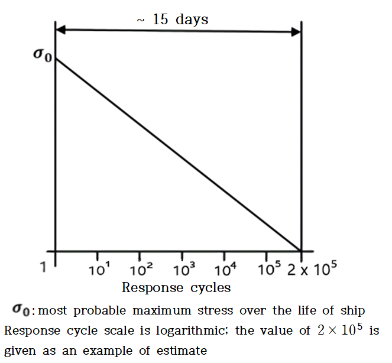

# Ships Using Low-flashpoint Fuels

> OTHER RULES AND GUIDANCE / RB-14-E / 2025 / EN / Guidance

## CHAPTER 7 MATERIAL AND GENERAL PIPE DESIGN

### Section 3 Pipe Design

#### 301. General

- **1.** In applying **301. 1** of this Rules, recognized standard by the Society means **EN ISO 14726**. **【See Rules】**

#### 302. Wall thickness

- **1.** In applying **302. 1** of this Rules, the corrosion allowance is to be in accordance with the following (1) and (2): **【See Rules】**
  - **(1)** For LNG fule, the corrosion allowance is to be 0.3 $\mathrm{mm}$ for carbon-manganese steel and 0 $\mathrm{mm}$ for stainless steel and aluminium alloys. Where effective corrosion control are taken for the interior of carbon-manganese steel pipes, the corrosion allowance may be 0.15 $\mathrm{mm}$.
  - **(2)** In addition to the preceding (2), for carbon-manganese steel pipes arranged on open deck without any effective external corrosion control means, 1.2 $\mathrm{mm}$ is to be added to the required corrosion allowance.
- **2.** In applying **302. 2** of this Rules, the "minimum wall thickness is to be in accordance with recognized standards" means the value corresponding to Schedule 40 of KS SPPS for carbon-manganese steel, and the value corresponding to Schedule 10 $S$ for stainless steel. However, for steel pipes provided with effective corrosion control or those not arranged under corrosive environment, the value may be reduced to the extent acceptable to the Society with a limitation of 1 $\mathrm{mm}$. Further, the value for pipes in cargo tanks and pipes having open ends may also be reduced to the extent acceptable to the Society. **【See Rules】**

#### 303. Design condition

- **1.** In applying **303. 1** of this Rules, the following (1) and (2) are applied. **【See Rules】**
  - **(1)** In applying **303. 1** of this Rules, lower values of ambient temperature 45 °C may be accepted by the Society for ships operating in restricted areas. Conversely, higher values of ambient temperature may be required.
  - **(2)** In applying **303.** of this Rules, for ships on voyages of restricted duration, $P _{0}$ may be calculated based on the actual pressure rise during the voyage and account may be taken of any thermal insulation of the tank. Reference is made to the Application of amendments to gas carrier codes concerning type C tank loading limits (SIGTTO/IACS).

#### 306. Piping fabrication and joining details 【See Rules】

- **1.** Valves, flanges and other fittings are to comply with the requirements of recognized standards for their type and size, and the requirements in **Pt 5, Ch 6, 103.** & **104.** of **Rules for the classification of steel ships.**

### Section 4 Materials

#### 401. Metallic materials

- **1.** For the purpose of the requirements in **Table 7.1** of this Rules, the following requirements are to be complied with : **【See Rules】**
  - **(1)** The use of the longitudinally or spirally welded pipes given in the Note (1) of the Table is to be in accordance with the relevant requirements in **Pt 2, Ch 1, Sec 4** of **Rules for the classification of steel ships**.
  - **(2)** Fittings of type C independent tanks and process pressure vessels with the design pressure not exceeding 3.0$\mathrm{MPa}$ and design temperature of 0°C or more and nominal diameter less than 100A given in Note (1) may comply with the requirements of KS or other standards as deemed appropriate by the Society.
  - **(3)** The controlled rolling as a substitution for normalizing given in Note (4) may be of the temperature controlled rolling or Thermo-Mechanical Controlled Processing (TMCP). Also, the controlled rolling as a substitution for tempering and quenching may be of TMCP.
- **2.** The controlled rolling as a substitution for normalizing or tempering and quenching given in Note (4) of **Table 7.2** of this Rules may be of TMCP. **【See Rules】**
- **3.** For the purpose of the requirements in **Table 7.3** of this Rules, the following requirements are to be complied with : **【See Rules】**
  - **(1)** For the purpose of the requirements in Note (2) of the Table, aluminium alloy of 5083, austenitic stainless steel, 36 % nickel steel and 9 % nickel steel may be used at the design temperature up to 196°C.
  - **(2)** For the purpose of the requirements in Note (5) of the Table, the chemical composition limit of a material, if the material specified in **Pt 2** of **Rules for the classification of steel ships**, is to be in accordance with the relevant requirements in **Pt 2, Ch 1** of **Rules for the classification of steel ships**.
  - **(3)** For the purpose of the requirements in Note (9) of the Table, the omission of the impact test given in Note (9) of the Table may generally be accepted for the austenitic steel of the type referred to in the Table.
- **4.** For the purpose of the requirements in **Table 7.4** of this Rules, the following requirements are to be complied with : **【See Rules】**
  - **(1)** The use of vertically or spirally welded pipes given in Note (1) of the Table is to be in accordance with the requirements in the preceding (1) (A).
  - **(2)** The requirements for forgings and castings given in Note (2) of the Table are to be in accordance with the relevant requirements in **Pt 2, Ch 1** of **Rules for the classification of steel ships** if specified.
  - **(3)** For the design temperature given in Note (3) of the Table lower than –165 °C, the provision in the preceding **3**. (1) are to apply.
  - **(4)** The chemical composition limit given in Note (5) of the Table is to be in accordance with the requirements in the preceding **3.** (2)
  - **(5)** The omission of the impact test given in Note (8) of this Table are to be in accordance with the requirements in the preceding **3.** (3)
- **5.** Where reference is made to hull structural steels, the requirements of **Pt 2, Ch 1, 301.** of **Rules for the classification of steel ships** for appropriate grades apply. **【See Rules】** 
