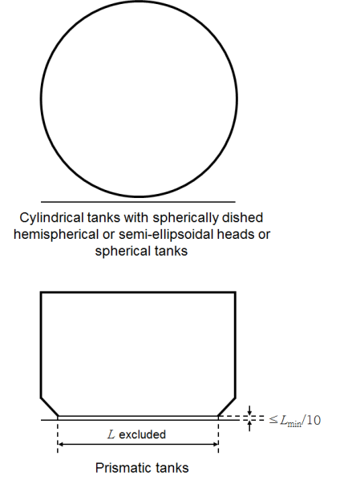

# Ships Using Low-flashpoint Fuels

> OTHER RULES AND GUIDANCE / RB-14-E / 2025 / EN / Guidance

## CHAPTER 8 BUNKERING

### Section 3 Bunkering Station

#### 301. General requirements

- **1.** In applying **301. 1** of this Rules, the special consideration is to be as a minimum include, but not be restricted to, the following design features: **【See Rules】**
  - **(1)** Segregation towards other areas on the ship
  - **(2)** Hazardous area plans for the ship
  - **(3)** Requirements for forced ventilation
  - **(4)** Requirements for leakage detection (e.g. gas detection and low temperature detection)
  - **(5)** Safety actions related to leakage detection (e.g. gas detection and low temperature detection)
  - **(6)** Access to bunkering station from non-hazardous areas through airlocks
  - **(7)** Monitoring of bunkering station by direct line of sight or by CCTV.

### Section 5 Bunkering System

#### 501. Bunkering system (2019) 【See Rules】

- **1.** **Tests of bunkering equipment**
  For the bunkering equipment, the requirements specified in **Pt 7, Ch 5, Annex 7A-3** of **Rules for the classification of steel ships.** 
