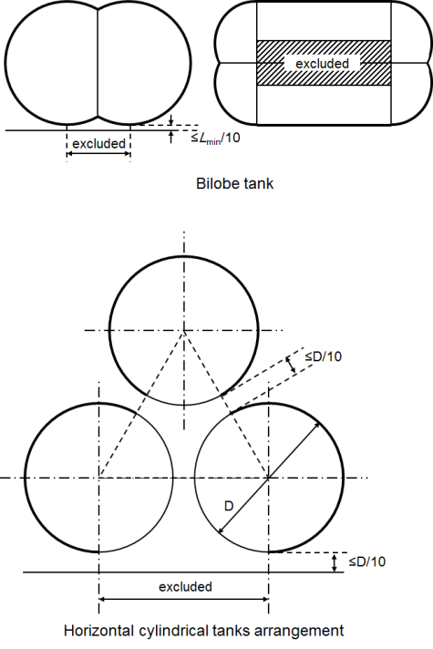

# Ships Using Low-flashpoint Fuels

> OTHER RULES AND GUIDANCE / RB-14-E / 2025 / EN / Guidance

## CHAPTER 9 FUEL SUPPLY TO CONSUMERS

### Section 2 Functional Requirements

#### 201. Functional Requirements 【See Rules】

- **1.** In applying **201. 2, 601. 1,** and **Ch 7. 306. 3** of the Rules, two independent safety barriers are to be in place, while, as far as practicable, using a minimum of flange connections. There is no single common flange or other component where one single failure itself overcome both primary and secondary barriers and result in a gas leak into the surrounding area causing danger to the persons on board, the environment or the ship. A single common flange (with two sealing systems) is accepted at the fuel connection to the gas consumers including GCUs, boilers and components on the engine, such as gas regulating units.

### Section 4 Safety Functions of Gas Supply System

#### 401. Safety functions of gas supply system 【See Rules】

- **1.** In applying **401. 1** of this Rules, normal operation is when gas is supplied to consumers and during bunkering operations.
- **2.** In applying **401. 1** of this Rules, with regard to “shut off”, shutdown should be time delayed to prevent shutdown due to transient load variations.

### Section 5 Fuel Distribution Outside of Machinery Space

#### 501. Fuel distribution outside of machinery space

- **1.** In applying **501. 1** of this Rules, in cases where double wall piping with vacuum used as secondary enclosure is adopted as other solutions, appropriate means capable of detecting loss of vacuum are to be provided. **【See Rules】**

### Section 6 Fuel Supply to Consumers in Gas-safe Machinery Spaces

#### 601. Fuel supply to consumers in gas-safe machinery spaces

- **1.** In applying **601. 1** (3) of this Rules, in cases where double wall piping with vacuum used as secondary enclosure is adopted as other solutions, appropriate means capable of detecting loss of vacuum are to be provided. Gas detector may be omitted on the double wall piping with vacuum used as secondary enclosure. **【See Rules】**
- **2.** In applying **601. 2** of this Rules, if gas is supplied into the air inlet directly on each individual cylinder during air intake to the cylinder on a low pressure engine, such that a single failure will not lead to release of fuel gas into the machinery space, double ducting may be omitted on the air inlet pipe. **【See Rules】** 
