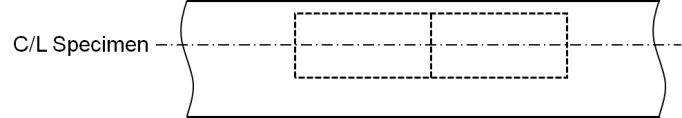
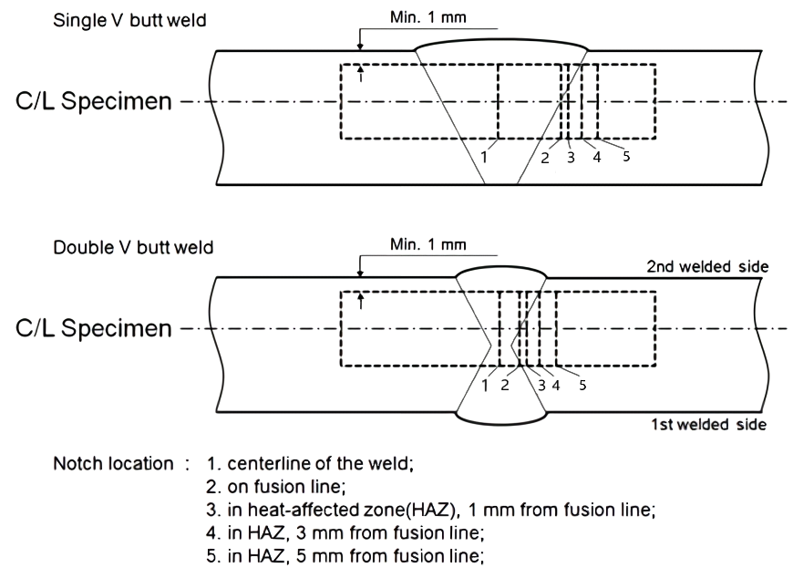

# Ships Using Low-flashpoint Fuels

> OTHER RULES AND GUIDANCE / RB-14-E / 2025 / EN / Guidance

## CHAPTER 16 MANUFACTURE, WORKMANSHIP AND TESTING

### Section 1 General

#### 101. General 【See Rules】

- **1.** In applying **Ch 16** of this Rules, equipment used for low-flashpoint fuel supply is to be in accordance with relevant requirement **Annex 1** in addition to this Rules.

### Section 2 General Test Regulations and Specifications

#### 201. Tensile test 【See Rules】

- **1.** In applying **201. 1** of the Rules, the required values of tensile strength, yield stress and elongation of a material are to be in accordance with the requirement in **Pt 2** of **Rules for the classification of steel ships**.

#### 202. Toughness test

- **1.** In applying **201. 1** of this Rules, to be in accordance with Recognized Standard means to refer to **Pt 2, Ch 1, 202. 3** (4) of **Rules for the classification of steel ships**. **【See Rules】**
- **2.** For the purpose of the requirements in **202. 2** of the Rules, in the case where the material thickness is 40mm or below, the Charpy V-notch impact test specimens are to be cut with their edge within 2 mm from the “as rolled” surface with their longitudinal axes either parallel or transverse to the final direction of rolling of the material as shown in **Fig 16.1**. *(2019)*
  
  **Fig 16.1 Sampling position of Charpy V-notch impact test specimens(Base metal)**
- **3.** In application to **202. 3** of the Rules, the position of the specimens is to be in accordance with **Fig 16.2**. *(2019)*

  |  |
  | --- |
  | **Fig 16.2 Sampling position of Charpy V-notch impact test specimens (Weld)** |
- **4.** In application to **202. 4** of the Rules, the re-testing of Charpy V-notch impact test specimens is to be in accordance with **Pt 2, Ch 1, 109.** of **Rules for the classification of steel ships**. *(2019)*

### Section 3 Welding of Metallic Materials and Non-destructive Testing for the Fuel Containment System

#### 301. General 【See Rules】

- **1.** The requirements in **Sec 3** of the Rules apply to independent tanks, process pressure vessels and piping. The requirements on membrane tanks, are to the satisfaction of the Society depending on the structural type of the tank.
- **2.** In applying **305.** of the Rules, the following requirements (1) and (2) are to be complied with.
  - **(1)** The impact test may generally be omitted for austenitic stainless steels of types given in **Table 7.3** and **Table 7.4** of the Rules.
  - **(2)** The impact test may generally be omitted for aluminum alloys of 5083 and welding material of 5183.
  - **(3)** Welding procedure tests for secondary barriers are to be in accordance with **Pt 2, Ch 2, Sec 4** of **Rules for the Classification of Steel Ships.** *(2019)*

#### 303. Welding procedure tests for fuel tanks and process pressure vessels

- **1.** In application to **303. 3** of the Rules, radiographic or ultrasonic testing may be performed at the option of the Society.
- **2.** For the purpose of the requirements in **303. 4** of the Rules the following requirements are to be complied with :
  - **(1)** Longitudinal bend tests which are required in lieu of transverse bend tests in the case where the base material and weld metal have different strength level specified in **303. 4** (3) of the Rules are to be in accordance with the requirements in **Pt 2, Ch 2, 404.** of **Rules for the Classification of Steel Ships**.
  - **(2)** For type C independent tanks and process pressure vessels, macroscopic and microscopic examinations and hardness tests are to be carried out according to the requirements of **303. 4** (5) of the Rules. For other independent tanks, macroscopic examinations are to be carried out according to the requirements in **Pt 2, Ch 2, Sec 4** of **Rules for the Classification of Steel Ships**.
- **3.** In applying **605. 3** (5) of the Rules, the welding procedure qualification test are also to comply with the relevant requirements in **Pt 2, Ch 2, Sec 4.** and **Pt 5, Ch 5, Sec 4** of **Rules for the Classification of Steel Ships**.
- **4.** In applying **303. 5** (1) of the Rules, the transverse tensile strength of weld metal which has lower tensile strength than that of the parent metal, e.g. in the case of 9 % nickel steel, is to comply with the requirements in **Pt 2, Ch 2, 404. 5** of **Rules for the Classification of Steel Ships**.
- **5.** In applying **303. 5** (2) of the Rules, bend tests are also to comply with the requirements in **Pt 2, Ch 2, 404. 6** of **Rules for the Classification of Steel Ships**. In case where the base metal is of RLP9 specified in **Pt 2, Ch 1** of **Rules for the Classification of Steel Ships**, bend tests may be omitted.
- **6.** In applying **303. 5** (3) of the Rules, the test temperature of impact tests may be determined in accordance with the requirements in **Ch 6, 413. 2 (1)**.

#### 304. Welding procedure tests for piping 【See Rules】

- **1.** Welding procedure qualification tests for pipes are also to be in accordance with the relevant requirements in **Pt 2, Ch 2** of **Rules for the classification of steel ships**.

#### 305. Production weld tests 【See Rules】

- **1.** Production weld tests are to be in accordance with the requirements specified in **Pt 2, Ch 2, 103.** of the Guidance relating to **Rules for the classification of steel ships**.
- **2.** For the purpose of the requirements in **305. 1** of the Rules, the number of test specimens for production weld tests of secondary barriers may be reduced to the extent as deemed appropriate by the Society considering the experience of same welding procedures in past, workmanship and quality control. In general, intervals of production weld tests for secondary barriers may be approximately 200 $\mathrm{m}$ of butt weld joints and the tests are to be representative of each welding position. Test requirements are to be in accordance with **303. 5** of the Rules.
- **3.** For the purpose of the requirements in **305. 5** of the Rules, production weld tests for membrane tanks are left to the discretion of the Society depending on the construction system of the tank.

#### 306. Non-destructive testing (2024) 【See Rules】

- **1.** In applying **306. 4** of this Rules, non-distructive testing procedures are to comply with the requirements in the **Annex 2-7** of **Pt 2** of the **Rules for the Classification of Steel Ships.**
  - **(1)** For radiographic testing, the acceptance levels and required quality levels are provided in **Table 16.1** below. In case of the criteria in **Table 16.1** are not satisfied, acceptance is left to the discretion of Society in consideration of the importancy of the structural members and nature of defects, etc.

    **Table 16.1 Radiographic Testing**

    | Quality Levels (ISO 5817:2014 applies)(1) | Testing Techniques/ levels (ISO 17636-1:2022 applies)(1) | Acceptance levels (ISO 10675-1:2021 applies)(1) |
    | --- | --- | --- |
    | B | B(class) | 1 |
    | Note: (1) Or any recognized standard agreed with the Society and demonstrated to be acceptable |   |   |
  - **(2)** For ultrasonic testing, the acceptance levels and required quality levels are provided in **Table 16.2** below.

    **Table 16.2 Ultrasonic Testing**

    | Quality Levels (ISO 5817:2014 applies)(1) | Testing Techniques/Levels (ISO 17640:2018 applies)(1) | Acceptance Levels (ISO 11666:2018 applies)(1) |
    | --- | --- | --- |
    | B | at least B | 2 |
    | Note: (1) Or any recognized standard agreed with the Society and demonstrated to be acceptable |   |   |
  - **(3)** For magnetic particle testing, the acceptance levels and required quality levels are provided in **Table 16.3** below.

    **Table 16.3 Magnetic Partcile Testing**

    | Quality Levels (ISO 5817:2014 applies)(1) | Acceptance Levels (ISO 11666:2018 applies)(1) |
    | --- | --- |
    | B | 2X |
    | Note: (1) Or any recognized standard agreed with the Society and demonstrated to be acceptable |   |
  - **(4)** For dye penetrant tests, the acceptance levels and required quality levels are provided in **Table 16.4** below.

    **Table 16.4 Dye Panetrant Testing**

    | Quality Levels (ISO 5817:2014 applies)(1) | Acceptance Levels (ISO 11666:2018 applies)(1) |
    | --- | --- |
    | B | 2X |
    | Note: (1) Or any recognized standard agreed with the Society and demonstrated to be acceptable |   |
- **2.** In applying **306. 1** of this Rules, where ultrasonic tests are performed as a substitution for radio-graphic tests, at least 10 % of the whole testing objects are to be subjected to radiographic tests.
- **3.** In applying **306. 2** of the Rules, for the non-destructive tests for the remaining welds of tank plates of type A and B independent tanks other than butt welds, fillet welds of highly stressed parts of main structural members of fuel tanks are to be examined magnetic particle or dye penetrant tests given in **1**. Butt welds of highly stressed parts of main structural members such as face plates of girders are to be subjected to radiographic test given in **1**.
- **4.** In applying **306. 7** of this Rules, the radio-graphic tests of secondary barriers where the hull structure acts as the secondary barrier are to be performed for the double bottom tank top platings and bulkhead platings in accordance with the requirements for shell platings of ordinary ships specified in **Pt 2, Ch 2, 309.** of **Rules for the classification of steel ships**.

### Section 4 Other Regulations for Construction in Metallic Materials (2019)

#### 404. Membrane Tanks 【See Rules】

- **1.** In applying **404.** of the Rules, quality assurance procedure, welding control, design details, quality control of materials, construction method, inspection and standards of production testing of components for membrane tanks are to be developed during the prototype scaled model test specified in **Ch 16, 505. 1** (1) of the Rules or another prototype test separately conducted for development of production procedure, and their effectiveness is to be verified. The relevant data is to be noted in the construction procedure manual for fuel tanks including the insulation construction of membrane tanks.
- **2.** The construction procedure manual referred to in the preceding **1** is to be approved by the Society after being verified through prototype scaled model test.

### Section 5 Testing (2019)

#### 501. Testing and Inspections during Construction

- **1.** **Structural Test and Tightness test for fuel tanks 【See Rules】**
  In case where leakage of fuel tanks can not be inspected in the hydraulic test or hydrostatic-hydropneumatic test according to the requirements in **501. 2** of the Rules, the tightness test of fuel tanks is to be conducted separately. This test is to be of the airtightness test conducted at a pressure of MARVS or more of the fuel tank.
- **2.** **Stress measurements instrumentation of type B independent tanks 【See Rules】**
  In applying **501. 5** of the Rules, in case where stress measurements of the fuel tank previously built which can be regarded as the tank of the same design manufactured at the same shipyard had resulted in good agreement with design stress levels, provision of instrumentation of independent tanks stress levels for tanks subsequently built may be omitted.
- **3.** **Gas-trial and fuel full loading test 【See Rules】**
  - **(1)** In accordance with the requirements in **501. 6** and **702. 5** of the Rules, the following tests are to be conducted in the attendance of the Surveyor to verify the performance of the fuel containment installations and fuel handling equipment :
    On items given in **Table 16.1**, tests are to be conducted to verify the performance of the fuel containment system fuel handling equipment and instrumentation using a suitable quantity of the fuel after the completion of all the construction work. However, for fuel tanks which do not require either cool-down operations or the fuel pressure/temperature controls specified in **Ch 6, 901. 1** of the Rules, omission of this test may be accepted if substitution is made by the operating test with the substituting medium to verify the performance of equipments specified in item 5 and 6 of **Table 16.1**, except for the case where the tank is of the first fuel tank manufactured by the manufacturer of fuel tanks.
    Where deemed necessary by the Society, tests are to be conducted after completion of all the construction work to verify that the fuel containment installations, fuel handling equipment and instrumentation satisfy the design conditions under the fully loaded condition of fuel.
    - **(A)** Gas-trial
    - **(B)** Fuel full loading test
  - **(2)** The kinds of real liquid fuel and gas used in the gas-trial and fuel full loading test specified in the preceding (1) are to be such that reproduction of the most severe conditions of those design conditions of the fuel containment system, the transfer installations, the reliquefaction system, etc. In addition, the verification relative to design temperatures is to be made by reproducing the condition that the fuel on the basis of which design temperature has been determined is cooled down as close to the design temperature as practicable.
  - **(3)** The quantities of the real fuel and vapour used in the gas-trial and fuel full loading test referred to in the preceding (1) are to be sufficient to conducting the tests specified in (1).
  - **(4)** The fuel full loading test to capacity specified in the preceding (1) (B) may be conducted simultaneously with the gas-trial indicated in the preceding (1) (A).

    **Table 16.1 Test Items at the Gas Trial** ***(2019)***

    | Test item | ◎ : Attendance of the Surveyor ◯ : Submission of the record | Inspection equipment | Survey item |
    | --- | --- | --- | --- |
    | 1. Drying test | ◯ | · Inert gas generator (IGS) | · Dew point · Change of dryness in fuel tanks and hold spaces |
    | 2. Inerting test | ◯ | · Inert gas generator | · Operation of the inert gas generator · Measuring of atmosphere in fuel tanks |
    | 3. Inert gas purge test using fuel vapour | ◯ | · Fuel vapourizer · Compressor | · Change of O_2/temperature of fuel vapour in fuel tanks · Quantity of fuel vapour (or liquid) supply · Capacity of the vapourizer · Capacity of the compressor |
    | 4. Cool-down test | ◎/◯ | · Spray pump · Compressor · Fuel piping · Temperature indicators for fuel tank · Spray piping | · Temperature curve of fuel tanks · Inspection of hold spaces/condition of insulation of tanks${} ^{1)}$ (after cool-down) · Cooling condition of spray piping·Cooling condition of fuel piping · Capacity of spray pump · Fuel consumption · Capacity of compressor (property of return gas) · Temperature/pressure in fuel tank · Shrinkage of fuel tank${} ^{2)}$ |
    | 5. Loading test of fuel liquid | ◎/◯ | · Compressor · Fuel piping related for loading · Level gauge/temperature indicator | · Temperature/pressure level in fuel tanks · Temperature/pressure in hold spaces · Temperature/pressure of fuel liquid/gas at manifolds · Service condition of fuel piping |
    | 6. Operation test of fuel pump | ◎/◯ | · All fuel pumps | · Discharge pressure/current of fuel pumps · Liquid level/pressure in fuel tanks · Stripping |
    | 7. Operation test of pressure/temperature control system | ◎/◯ | · Depend on the type of controls | · Depend on the type of controls |
    | Notes : 1) The Society may approve omission in consideration of the quality control status and manufacturing records of insulation materials. 2) To be verified only in case of independent tanks. |   |   |   |
- **4.** **Cold spot inspection 【See Rules】**
  - **(1)** The cold spot inspection of fuel tanks specified in **501. 7** of the Rules is to be carried out during the fuel full loading test to capacity specified in **3** (1) for the membrane tank, and when necessary, independent tank. *(2024)*

#### 502. Independent Tank Type A 【See Rules】

- **1.** **Hydrostatic or hydropneumatic test for independent tank**
  - **(1)** In applying **502.** of the Rules, the hydrostatic or hydropneumatic test of fuel tanks is to be conducted by simulating the actual load conditions (static load + dynamic load) in accordance with the following requirements :
    Hydrostatic-hydropneumatic test is to simulate the static pressure of fuel, acceleration by ship motions and internal pressure including the vapour pressure by water head and pneumatic pressure. (See Fig **16.3**, Fig **16.4** and Fig **16.5**)
    Hydraulic test is to simulate the fuel weight and the load created by the acceleration due to ship motions solely by the weight of water. (See Fig **16.6**)
    
    Fig 16.3 Simulating the Internal Pressure Distribution of Rectangular Tank 
    Fig 16.4 Simulating the Internal Pressure Distribution of Spherical Tank
    
    Fig 16.5 Simulating the Internal Pressure Distribution at Pressure Discharge 
    Fig 16.6 Simulating the LoadingCondition of SupportStructure
    * Explanatory notes on symbols in Fig **16.3** to Fig **16.6.**
    ------ : maximum loading condition which is predicted to actually encounter
    … : pressure testing condition simulating as far as practicable ($P _{0} ^{''}$ and $h$ are to be chosen so that $P _{0} ^{'' } > P _{0}$ or $P _{0} ^{'' } > P _{0} ^{'}$ and $A _{2} +A _{3} > A _{1}$ as far as practicable)
    $H$ : depth of tank
    $h$ : water head
    $\gamma$ : specific gravity of fuel
    $a _{z}$ : maximum vertical acceleration (non-dimensional)
    $P _{0}$ : design vapour pressure at ordinary passage
    $P _{0} ^{'}$ : design vapour pressure during pressurized unloading in port
    $P _{0} ^{' '}$ : air pressure
    - **(A)** Test of fuel tanks
    - **(B)** Load test of supporting structures
  - **(2)** All tests specified in the preceding (1) (A) and (B) may be conducted individually.
  - **(3)** In the case of the fuel tank of supports which can be regarded as those of the same type manufactured at the same manufacturing plant, implementation of the second and subsequent tests of fuel tanks and supports specified in the preceding (1) (B) may be omitted when deemed acceptable by the Society.

#### 503. Independent Tank Type B 【See Rules】

- **1.** **Structural Test and Tightness test for fuel tanks**
  - **(1)** Refer to the requirements in **501. 1** and **502. 1.**

#### 504. Independent Tank Type C 【See Rules】

- **1.** **Hydrostatic or hydropneumatic test for independent tank**
  - **(1)** The "pressure vessels other than simple cylindrical and spherical pressure vessels" referred to in the requirements in **504. 1** of the Rules means those cylindrical or spherical pressure vessels with supporting structures of well proved records. In tanks of special shape having supporting structures likely to cause excessive bending stress or bicylindrical shape tanks, the stress levels are to be verified by strain measurement through prototype test.
  - **(2)** "Where necessary" referred to in the requirements in **504. 4** of the Rules means a case in which the shipbuilding berth or hull structure can not withstand the hydrostatic load when fuel tanks are filled with water to the tank top level and another case in which a large load exceeding the design load is imposed on the structural members of the tank or adjacent structures by conducting the hydrostatic test.
  - **(3)** In applying **504. 6** of the Rules, the leakage test is to be of the airtightness test conducted at a pressure of MARVS or more of the pressure vessel.

#### 505. Membrane Tank 【See Rules】

- **1.** **Design development testing**
  - **(1)** Tests specified in the requirements in **505. 1** (1) of the Rules, are to be conducted on a model in combination of the primary barrier, insulation structure and secondary barrier. Test object and testing procedure are to be determined for each type of tank in each case.
- **2.** **Hull structure adjacent to membrane tanks**
  - **(1)** The "hydrostatically tested" referred to in the requirements in **505. 2** (1) of the Rules means the hydraulic test according to the requirements in **Pt 3, Ch 1, 209.** of **Rules for the Classification of Steel Ships.** of the Rules. In this case, hydraulic pressure may be applied from hull structures such as ballast tanks and cofferdams.
  - **(2)** The leakage test for the "all hold structure supporting the membrane" referred to in the requirements in **505. 2** (2) of the Rules is to be in accordance with the testing procedure applicable to general hull structures as specified in **Pt 3, Ch 1, 209.** of **Rules for the Classification of Steel Ships.**

### Section 7 Testing Regulations

#### 701. Testing of piping components 【See Rules】

- **1.** In applying **701. 1** of this Rules, test requirements of valves are in accordance with **Annex 1**.
- **2.** In applying **701. 1** (4) of this Rules, standards recognized by Society means **ISO 19921** and **ISO 19922**.

#### 703. Type testing of fuel pumps and gas compressors 【See Rules】

- **1.** In applying **703** of this Rules, “the Guidance specified separately“ means **Annex 1**. 
