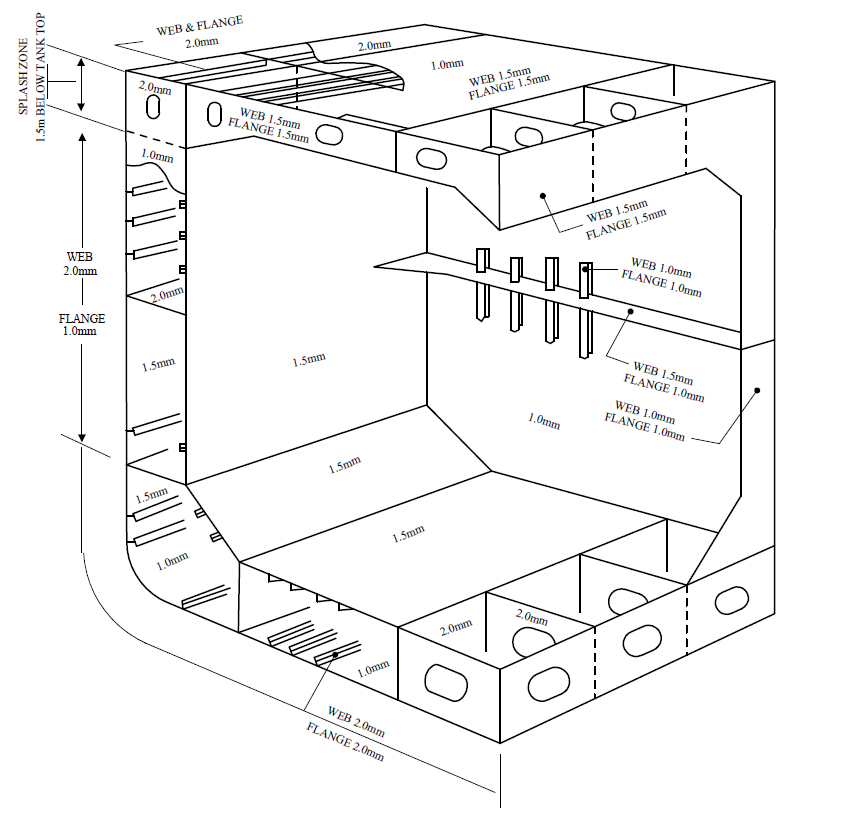

# Guidance for Floating Production Units

> RULES AND GUIDANCE FOR OFFSHORE STRUCTURES / GC-11-E / 2025 / EN / Guidance

## CHAPTER 3 DESIGN CONDITIONS

### Section 1 General

#### 101. General

- **1.** The design environmental condition of a unit is to be of the most severe loading conditions with a combination of winds, waves, etc. based on meteorological and sea state data. However, accidental events such as tsunamis need not be considered as part of the most severe loading condition.
- **2.** The operational limitations of a unit are to be specified by designers. In such cases, the capability of positioning systems, the operating conditions of production systems, the conditions of offloading, etc. with the combination of winds, waves and currents based on meteorological and sea state data for the specified site of operation are to be taken into account.

### Section 2 Design Principles

#### 201. Design principles

- **1.** Safety of the structure can be demonstrated by addressing the potential structural failure mode(s) when the unit is subjected to loads scenarios encountered during transit, operation and in harbour.
- **2.** Structural requirements are based on a consistent set of loads that represent typical worst possible loading scenarios.
- **3.** Unit is to be designed so as to have inherent redundancy. The unit’s structure works in a hierarchical manner and as such, failure of structural elements lower down in the hierarchy should not result in immediate consequential failure of elements higher up in the hierarchy.
- **4.** Structural continuity is ensured. The hull, topside structures and topside interface to the hull structure should have uniform ductility.

#### 202. Limit states

- **1.** **General**

  |   |   | Yielding check | Buckling check | Ultimate strength check | Fatigue check |
  | --- | --- | --- | --- | --- | --- |
  | Local Structures | Ordinary stiffeners | √ | √ | √(1) | √(2) |
  | Local Structures | Plating subjected to lateral pressure | √ | √ | √(3) | ─ |
  | Primary supporting members |   | √ | √ | √ | √(2) |
  | Hull girder |   | √ | √(4) | √ | ─ |
  | Hull interface structures |   | √ | √(5) | √(5) | √(5) |
  | Note: √ indicates that the structural assessment is to be carried out. (1) The ultimate strength check of stiffeners is included in the buckling check of stiffeners. (2) The fatigue check of stiffeners and primary supporting members is the fatigue check of connection details of these members. (3) The ultimate strength check of plating is included in the yielding check formula of plating. (4) The buckling check of stiffeners and plating taking part in hull girder strength is performed against stress due to hull girder bending moment and hull girder shear force. (5) The check is to be in accordance with the discretion of the Society. |   |   |   |   |   |
- **2.** **Limit states**
  - **(1)** Serviceability limit state
    Serviceability limit state, which concerns the normal use, includes:
    - **(A)** local damage which may reduce the working life of the structure or affect the efficiency or appearance of structural members
    - **(B)** unacceptable deformations which affect the efficient use and appearance of structural members or the functioning of equipment.
    - **(C)** Motions or accelerations that can exceed the range of effective functionality of topside equipment
  - **(2)** Ultimate limit state
    Ultimate limit state, which corresponds to the maximum load-carrying capacity, or in some cases, the maximum applicable strain or deformation, includes:
    - **(A)** attainment of the maximum resistance capacity of sections, members or connections by rupture or excessive deformations
    - **(B)** instability of the whole structure or part of it.
  - **(3)** Fatigue limit state
    Fatigue limit state relate to the possibility of failure due to cyclic loads.
  - **(4)** Accidental limit state
    Accidental limit state considers the flooding of any one cargo hold without progression of the flooding to the other compartments
- **3.** **Strength criteria**
  - **(1)** Serviceability limit states
    - **(A)** For the yielding check of the hull girder, the stress corresponds to a load at $10 ^{-8}$ probability level.
    - **(B)** For the yielding check and buckling check of platings constituting a primary supporting member, the stress corresponds to a load at $10 ^{-8}$ probability level.
    - **(C)** For the yielding check of an ordinary stiffener, the stress corresponds to a load at $10 ^{-8}$ probability level.
  - **(2)** Ultimate limit states
    - **(A)** The ultimate strength of the hull girder is to withstand the maximum vertical longitudinal bending moment obtained by multiplying the partial safety factor and the vertical longitudinal bending moment at $10 ^{-8}$ probability level.
    - **(B)** The ultimate strength of the plating between ordinary stiffeners and primary supporting members is to withstand the load at $10 ^{-8}$ probability level.
    - **(C)** The ultimate strength of the ordinary stiffener is to withstand the load at $10 ^{-8}$ probability level.
  - **(3)** Fatigue limit state
    The fatigue life of representative structural details such as connections of ordinary stiffeners and primary supporting members is obtained from reference pressures at $10 ^{-4}$.
  - **(4)** Accidental limit state
    The accidental load condition, where a cargo tank is flooded, is to be assessed for longitudinal strength of the hull girder consistent with load cases used in damage stability calculations.
- **4.** **Strength check against impact loads**
  Structural strength shall be assessed against impact loads such as forward bottom slamming, bow impact, green water on deck and sloshing loads in cargo or ballast tanks.
- **5.** **Strength check against accidental damage**
  Consideration is to be given to accidental damage (e.g. collision, dropped objects, fire and explosions, etc.) and examination sheets for reference is to be submitted to the Society.

### Section 3 Corrosion Control Means and Corrosion Margins

#### 301. General

Corrosion control means for units are to be provided in accordance with the relevant provisions specified in **Pt 3** of **Rules for the Classification of Steel Ships** and taking design service life, maintenance, corrosive environment, etc. into account.

#### 302. Paint containing aluminium

Paint containing aluminium is not to be used in positions where cargo vapours may accumulate
unless it has been shown by appropriate tests that the paint to be used does not increase the
incendiary sparking hazard. Tests need not be performed for coatings with less than 10 percent
aluminium by weight.

#### 303. Corrosion margin

Corrosion margins according to the corrosive environment to which structural members are exposed are to be in accordance with the values given in **Table 3.2** and **Fig 3.1**. In cases where a corrosive environment is clearly severer than assumed, values that are bigger than the values given in **Table 3.2** and **Fig 3.1** or additional corrosion control means considered appropriate will be required as deemed necessary by the Society.

| Structural Element/Location |   | Corrosion Margin(mm) |   |
| --- | --- | --- | --- |
| Structural Element/Location |   | Cargo Tank | Ballast Tank Effectively Coated |
| Deck Plating |   | 1.0 | 2.0 |
| Side Shell Plating |   | - | 1.5 |
| Bottom Plating |   | - | 1.0 |
| Inner Bottom Plating |   | 1.5 |   |
| Longitudinal Bulkhead Plating | Between cargo tanks | 1.0 | - |
| Longitudinal Bulkhead Plating | Other Plating | 1.5 |   |
| Transverse Bulkhead Plating | Between cargo tanks | 1.0 | - |
| Transverse Bulkhead Plating | Other Plating | 1.5 |   |
| Transverse & Longitudinal Deck Supporting Members |   | 1.5 | 2.0 |
| Double Bottom Tanks Internals (Stiffeners, Floors and Girders) |   | - | 2.0 |
| Vertical Stiffeners and Supporting Members Elsewhere |   | 1.0 | 1.0 |
| Non-vertical Longitudinals/Stiffeners and Supporting Members Elsewhere |   | 1.5 | 2.0 |

Fig 3.1 Corrosion Margin

### Section 4 Design Loads

#### 401. General

- **1.** The requirements in this section define and specify load components to be considered in the overall strength analysis as well as design pressures applicable for local scantling design.
- **2.** Design load criteria given by operational requirements shall be fully considered. Examples of such requirements may be:
  - **(1)** production, workover and combinations thereof
  - **(2)** consumable re-supply procedures and frequency
  - **(3)** maintenance procedures and frequency
  - **(4)** possible load changes in most severe environmental conditions.

#### 402. Static loads

- **1.** **General**
  - **(1)** The still water loads consist of the permanent and variable functional loads.
  - **(2)** Permanent functional loads relevant for offshore units are:
    - **(A)** mass of the steel of the unit including permanently installed modules and equipment, such as accommodation, helicopter deck, cranes, drilling equipment, flare and production equipment.
    - **(B)** mass of mooring lines and risers.
  - **(3)** Variable functional loads are loads that may vary in magnitude, position and direction during the period under consideration.
  - **(4)** Typical variable functional loads are:
    - **(A)** hydrostatic pressures resulting from buoyancy
    - **(B)** crude oil
    - **(C)** ballast water
    - **(D)** fuel oil
    - **(E)** consumables
    - **(F)** personnel
    - **(G)** general cargo
    - **(H)** riser tension
    - **(I)** mooring forces
    - **(J)** mud and brine
  - **(5)** The variable functional loads utilised in structural design shall normally be taken as either the lower or upper design value, whichever gives the more unfavourable effect.
  - **(6)** Variations in operational mass distributions (including variations in tank filling conditions) shall be adequately accounted for in the structural design.
- **2.** **Still water hull girder loads**
  - **(1)** All relevant still water load conditions shall be defined and permissible limit curves for hull girder bending moments and shear forces shall be established for transit and operating condition separately.
  - **(2)** The permissible limits for hull girder still water bending moments and hull girder still water shear forces shall be given at least at each transverse bulkhead position and be included in the loading manual.

#### 403. Environmental loads

- **1.** **General**
  Environmental loads are loads caused by environmental phenomena. Environmental loads which may contribute to structural damages shall be considered. Consideration should be given to responses resulting from the following listed environmental loads:
  - **(1)** current loads
  - **(2)** wind loads
  - **(3)** wave induced loads
  - **(4)** Snow and ice loads, when relevant
  - **(5)** green sea on deck
  - **(6)** sloshing in tanks
  - **(7)** slamming (e.g. on bow and bottom in fore and aft ship)
  - **(8)** vortex induced vibrations (e.g. resulting from wind loads on structural elements in a flare tower).
- **2.** **Current loads**
  The current forces on submerged hulls, mooring lines, risers or any other submerged objects associated with the system are to be in accordance with **Rules for the Classification of Mobile Offshore Drilling Units**.
- **3.** **Wind loads**
  - **(1)** The wind velocity for the design environmental condition is to be based on the statistical measurement wind data for the specific operation site or the analysis and interpretation of wind measurement data for the specific operation site by weather consultants. It is to be in accordance with **Rules for the Classification of Mobile Offshore Drilling Units**.
  - **(2)** The wind velocity for transit, operating and survival condition should normally be not less than the following, unless otherwise documented:
    - **(A)** Transit and operation conditions: 36 m/s (1 hour period at 10 m above sea level).
    - **(B)** Survival condition: Site specific.
- **4.** **Wave induced loads**
  - **(1)** The wave loads shall be determined for the site specific environment in which the unit is intended to operate.
  - **(2)** The following wave induced responses shall be calculated:
    - **(A)** motions in six degrees of freedom
    - **(B)** vertical wave induced bending moment at a sufficient number of positions along the hull. The positions shall include the areas where the maximum vertical bending moment and shear force occur and at the turret position. The vertical wave induced bending moment shall be calculated with respect to the section’s neutral axis
    - **(C)** horizontal bending moment
    - **(D)** accelerations
    - **(E)** axial forces
    - **(F)** external sea pressure distribution.
  - **(3)** The wave induced bending moments and shear forces may be calculated considering the weather vaning characteristics of the unit.
- **5.** **Green sea**
  - **(1)** The forward part of the deck and areas aft of midship will be particularly exposed to green sea. Short wave periods are normally the most critical.
  - **(2)** Appropriate measures should be considered to avoid or minimize the green sea effects on the hull structure, accommodation, deckhouses, topside modules and equipment. These measures include bow shape design, bow flare, bulwarks and other protective structure. Adequate drainage arrangements shall be provided.
  - **(3)** Structural members exposed to green sea shall be designed to withstand the induced loads. Green sea loads are considered as local loads.
- **6.** **Sloshing loads in tanks**
  - **(1)** In partly filled tanks sloshing occurs when the natural periods of the tank fluid is close to the periods of the motions of the unit. Factors governing the occurrence of sloshing are:
    - **(A)** tank dimensions
    - **(B)** tank filling level
    - **(C)** structural arrangements inside the tank (wash bulkheads, web frames etc.)
    - **(D)** transverse and longitudinal metacentric height (GM)
    - **(E)** draught
    - **(F)** natural periods of unit and cargo in roll (transverse) and pitch (longitudinal) modes.
  - **(2)** The pressures generated by sloshing of the cargo or ballast liquid and the acceptance criteria shall comply with the requirements given in the **Pt 12** of **Rules for the Classification of Steel Ships**.
- **7.** **Bottom slamming**
  Bottom slamming shall comply with the requirements given in the **Pt 12** of **Rules for the Classification of Steel Ships**.
- **8.** **Bow impact**
  The bow region is normally to be taken as the region forward of a position 0.1 L aft of F.P. and above the summer load waterline. The design of the bow structure exposed to impact loads shall be carried out according to the requirements given in the **Pt 12** of **Rules for the Classification of Steel Ships**.
- **9.** **Design density of tanks**
  - **(1)** The following minimum design density of tanks shall be used for the strength and fatigue analysis, unless otherwise agreed by the project:
    * : For tank testing condition density of seawater 1.025 t/m3 shall be used both for local strength check and in the cargo hold FE analysis for the harbour condition.
    - **(A)** Ballast tanks: 1.025 $t/m ^{3}$ (seawater)
    - **(B)** Cargo tanks: 0.9 $t/m ^{3} *$
    - **(C)** Fuel oil tanks: 0.9 $t/m ^{3} *$
    - **(D)** Mud tanks: 2.5 $t/m ^{3}$
    - **(E)** Brine tanks: 2.2 $t/m ^{3}$
    - **(F)** Fresh water tanks: 1.0 $t/m ^{3} *$
  - **(2)** The actual tank densities shall be stated on the tank plan.
  - **(3)** Higher design densities than given in (1) shall be used if specified by the project. 
