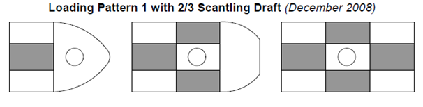
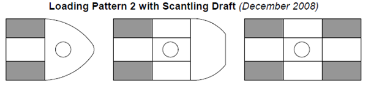

# Guidance for Floating Production Units

> RULES AND GUIDANCE FOR OFFSHORE STRUCTURES / GC-11-E / 2025 / EN / Guidance

## CHAPTER 5 HULL CONSTRUCTION AND EQUIPMENT

### Section 1 General

#### 101. General

- **1.** The design and construction of the hull, superstructure and deckhouses for units that are new builds or conversions are to be based on the applicable requirements of design considerations of this guide and not specified in this guide are to be in accordance with the Rules.
- **2.** Design Considerations of this Guide reflects the different structural performance and demands expected for an installation transiting and being positioned at a particular site on a long-term basis compared to that of a vessel engaged in unrestricted seagoing service.

#### 102. Load line

- **1.** A mark designating the maximum allowable draught for loading is to be located in easily visible positions on units as deemed appropriate by the Society or in positions easily distinguishable by the person in charge of liquid transfer operations.
- **2.** The designation of load lines is to comply with the requirements given in the “International Convention on Load Lines, 1996 and Protocol of 1988 relating to the International Convention on Load Lines, 1966”, unless specified otherwise by the relevant flag states or coastal states.

#### 103. Loading manual, stability information and instruction for operation

- **1.** In order to avoid the occurrence of unacceptable stress in unit structures corresponding to all oil and ballast loading conditions and topside modules arrangement and mass and to enable the master or the person-in-charge of loading operations to adjust the loading of cargo and ballast, units are to be provided with loading manuals approved by the Society. Such loading manuals are to at least include the following (1) to (4) items as well as relevant provisions given in **Pt 3, Ch 3** of **Rules for the Classification of Steel Ships**.
  - **(1)** The loading conditions on which the design of a unit has been based, including the permissible limits of longitudinal still water bending moments and still water shearing forces.
  - **(2)** The calculation results of longitudinal still water bending moments and still water shearing forces corresponding to the loading conditions.
  - **(3)** The allowable limits of local loads applied to decks, double bottom construction, etc., in cases where deemed necessary by the Society.
  - **(4)** The limit values of the loads of mooring lines and riser loads.
- **2.** In addition to **Par 1** above, a loading computer that is capable of readily computing longitudinal still water bending moments and still water shearing forces working on units corresponding to all oil and ballast loading conditions and the operation manual for such a computer is to be provided on board.
- **3.** The capability of the loading computer specified in **Par 2** above to function as specified in the location where it is installed is to be confirmed.
- **4.** A stability information booklet approved by the Society is to be provided on board in accordance with **Pt 1, Annex 1-2** of **Rules for the Classification of Steel Ships**. This booklet is to include the results of stability evaluations in representative operating conditions and assumed damage conditions as well as the damage condition of any mooring system equipment as necessary.
- **5.** Instructions for the loading and unloading, and transfer and offloading operations of oil and ballast are to be provided on board. In cases where mooring systems can be isolated, the procedures for isolating and re-mooring are also to be included.

### Section 2 Stability

#### 201. General

- **1.** Intact stability criteria and damage stability criteria are to be in accordance with the requirements specified in **Rules for the Classification of Mobile Offshore Drilling Units** under the environmental conditions specified in **Ch 3**. When calculating wind overturning moments, in cases where units are designed to be under wind from a specified direction, the overturning moment induced by wind from a specified direction may be accepted.
- **2.** The arrangements of watertight compartments, watertight bulkheads and closing devices are to be in accordance with the requirements specified in **Rules for the Classification of Mobile Offshore Drilling Units**, **Pt 3** and **Pt 12** of **Rules for the Classification of Steel Ships**.

### Section 3 Longitudinal Strength

#### 301. Longitudinal hull girder strength

Longitudinal strength is to be based on **Pt 3** and **Pt 12** of **Rules for the Classification of Steel Ships**. The total hull girder bending moment, $M _{t}$ is the sum of the maximum still water bending moment for operation on site or in transit combined with the corresponding wave-induced bending moment (Mw) expected on-site and during transit to the installation site. In lieu of directly calculated wave-induced hull girder vertical bending moments and shear forces, recourse can be made to the use of the Environmental Severity Factor (ESF) approach described of this guide. The ESF approach can be applied to modify the Steel Vessel Rules wave-induced hull girder bending moment and shear force formulas. Depending on the value of the Environmental Severity Factor, $\beta _{vbm}$, for vertical wave-induced hull girder bending moment (see this Guide), the minimum hull girder section modulus, $Z _{\min}$, of unit may vary in accordance with the following:

| $\beta _{vbm}$ | $Z _{\min}$ |
| --- | --- |
| $\beta _{vbm}$＜ 0.7 | 0.85$Z _{\min}$ |
| 0.7 ＞$\beta _{vbm}$＜1.0 | Varies linearly between 0.85$Z _{\min}$ and $Z _{\min}$ |
| $\beta _{vbm}$＞1.0 | $Z _{\min}$ |
| Where $Z _{\min}$ = minimum hull girder section modulus as required in **Pt 3, Ch 3, 203.** of **Rules for the Classification of Steel Ships** |   |

* **Environmental Severity Factor**
Environmental Severity Factors are adjustment factors for the dynamic components of loads and the expected fatigue damage that account for site-specific conditions as compared to North Atlantic unrestricted service conditions.

#### 302. Hull girder ultimate strength

- **1.** The hull girder ultimate longitudinal bending capacities are to be evaluated in accordance with **Pt 12** of **Rules for the Classification of Steel Ships**.
- **2.** The vertical hull girder ultimate strength for the unit design environmental condition (DEC) is to satisfy the limit state as specified below. It need only be applied within the 0.4L amidship region.
  $\gamma _{S} M _{sw} + \gamma _{W} \beta _{VBM} M _{wv-sag} \leq \frac{M _{U}}{\gamma _{R}}$
  $M _{sw}$ : permissible still-water bending moment, in kNm
  $M _{wv-sag}$ : sagging vertical wave bending moment, in kNm, to be taken as the midship sagging value defined in **Pt 12, Sec 7/3.4.1.1** of **Rules for the Classification of Steel Ships**.
  $M _{U}$ : sagging vertical hull girder ultimate bending capacity, in kNm, as defined in **Pt 12, Appendix A/1.1.1 of Rules for the Classification of Steel Ships**.
  $\beta _{VBM}$ : ESF for vertical wave-induced bending moment for DEC
  $\gamma _{S}$ : load factor for the maximum permissible still-water bending moment, but not to be taken as less than 1.0
  $\gamma _{W}$ : load factor for the wave-induced bending moment, but not to be taken as less than below for the given limits
  = 1.3 ($M _{sw} <0.2M _{t}$ 또는 $M _{sw} >0.5M _{t}$)
  = 1.2 ($0.2M _{t} \leq M _{sw} \leq 0.5M _{t}$)
  $M _{t}$ : total bending moment, in kNm
  = $M _{sw} + \beta _{VBM} M _{wv-sag}$
  $\gamma _{R}$ : safety factor for the vertical hull girder bending capacity, but not to be taken as less than 1.15

### Section 4 Structural Design and Analysis of the Hull

#### 401. Structural design of the hull

Design of the hull is to be based on this guide, general hull structures are to be in accordance with the requirements of **Pt 12** of **Rules for the Classification of Steel Ships**.
Where the conditions at the installation site are less demanding than those for unrestricted service that are the basis in hull structure of Rules for the Classification of Steel Ships, the design criteria for various components of the hull structure may be reduced, subject to the limitations indicated below to reflect these differences. However, when the site conditions produce demands that are more severe, it is mandatory that the design criteria are to be increased appropriately. In the application of the modified criteria, no minimum required value of any net scantling is to be less than 85 percent of the value obtained had all the ESF Beta values been set equal to 1.0 (which is the unrestricted service condition). In view of this, for a unit converted from a vessel, where the total bending moment for unrestricted service conditions is used for determination of the minimum required value of any net scantling, the total bending moment should consist of the maximum still water bending moment of the existing vessel and the wave-induced bending moment with all the beta values set equal to 1.0. The loads arising from the static tank testing condition are also to be directly considered in the design. In some instances, such conditions might control the design, especially when the overflow heights are greater than normally encountered in oil transport service, or the severity of environmentally-induced load components and cargo specific gravity are less than usual.

- **1.** **Hull design for additional loads and load effects**
  The loads addressed in this Subsection are those required in the design of an installation depending on the length of the installation. Specifically, these loads are those arising from liquid sloshing in hydrocarbon storage or ballast tanks, green water on deck, bow impact due to wave group action above the waterline, bow flare slamming during vertical entry of the bow structure into the water, bottom slamming and deck loads due to on-deck production facilities. All of these can be treated directly by reference to unit. However, when it is permitted to design for these loads and load effects on a site-specific basis, reflect the introduction of the Environmental Severity Factors (ESFs-Beta-type) into the Rule criteria.
- **2.** **Superstructures and deckhouses**
  The designs of superstructures and deckhouses are to comply with the requirements of **Pt 12** of **Rules for the Classification of Steel Ships**. The structural arrangements of **Pt 12** of **Rules for the Classification of Steel Ships** for forecastle decks are to be satisfied.
- **3.** **Helicopter decks**
  The design of the helicopter deck structure is to comply with the requirements of **Rules for the Classification of Mobile Offshore Drilling Units**. In addition to the required loadings defined in **Rules for the Classification of Mobile Offshore Drilling Units**, the structural strength of the helicopter deck and its supporting structures are to be evaluated considering the DOC and DEC environments, if applicable.
- **4.** **Protection of deck openings**
  The machinery casings, all deck openings, hatch covers and companionway sills are to comply with the requirements of **Pt 12** of **Rules for the Classification of Steel Ships**.
- **5.** **Bulwarks, rails, freeing ports, ventilators and portlights**
  Bulwarks, rails, freeing ports, portlights and ventilators are to comply with the requirements of **Pt 12** of **Rules for the Classification of Steel Ships**.
- **6.** **Machinery and equipment foundations**
  Foundations for equipment subjected to high cyclic loading, such as mooring winches, chain stoppers and foundations for rotating process equipment, are to be analyzed to verify they provide satisfactory strength and fatigue resistance. Calculations and drawings showing weld details are to be submitted to the Bureau for review.
- **7.** **Bilge keels**
  The requirements of bilge keels are to comply with the requirements of **Pt 12** of **Rules for the Classification of Steel Ships**.
- **8.** **Sea chests**
  The requirements of Sea Chests are to comply with the requirements of **Pt 12** of **Rules for the Classification of Steel Ships**.

#### 402. Engineering analyses of the hull structure

- **1.** **General**
  The criteria in this Subsection relate to the analyses required to verify the scantlings selected in the hull design in **401.**. Depending on the specific features of the offshore installation, additional analyses to verify and help design other portions of the hull structure will be required. Such additional analyses include those for the deck structural components supporting deck-mounted equipment and the hull structure interface with the position mooring system. Analysis criteria for these two situations are given in **Section 5**.
- **2.** **Strength analysis of the hull structure**
  For installations of 150 m in length and above, two approaches in performing the required strength assessment of the hull structure are acceptable. One approach is based on a three cargo tank length finite element model amidships where the strength assessment is focused on the results obtained from structures in the middle tank. As an alternative, a complete hull length or full cargo block length finite element model can be used in lieu of the three cargo tank length model. Details of the required Finite Element Method (FEM) strength analysis are in accordance with **Pt 12** of **Rules for the Classification of Steel Ships.**
  When mooring and riser structures are located within the extent of the FE model, the static mass of the mooring lines and risers may be represented by a mass for which gravity and dynamic accelerations can be calculated and added to the FEM model. The resulting dynamic loads shall be compared to the mooring and riser analysis results to ensure that the dynamic effects are conservatively assessed in the hull FE analysis.
  Generally, the strength analysis is performed to determine the stress distribution in the structure. To determine the local stress distribution in major supporting structures, particularly at intersections of two or more members, fine mesh FEM models are to be analyzed using the boundary displacements and load from the 3D FEM model. To examine stress concentrations, such as at intersections of longitudinal stiffeners with transverses and at cutouts, fine mesh 3D FEM models are to be analyzed. The accidental load condition, where a cargo tank is flooded, is to be assessed for longitudinal strength of the hull girder consistent with load cases used in damage stability calculations.
- **3.** **Three cargo tank length model**
  - **(1)** Structural FE model
    The three cargo tank length FE model is considered representative of cargo and ballast tanks within the 0.4L amidships. Details of the modeling are in accordance with **Pt 12** of **Rules for the Classification of Steel Ships.**
  - **(2)** Load Conditions
    The structure analysis for three Cargo Tank Length Model is applied by below load conditions.
    - **(A)** General Loading Patterns
    - **(B)** Inspection and repair conditions - Inspection and repair conditions are to be analyzed using a minimum 1-year return period design operating condition load and a minimum specific gravity of cargo fluid of 0.9.
    - **(C)** Transit condition - The transit condition is to be analyzed using the actual tank loading patterns in association with the anticipated environmental conditions based on a minimum 10-year return period to be encountered during the voyage.
  - **(3)** Load Cases
    The structural responses for the still water conditions are to be calculated separately to establish reference points for assessing the wave-induced responses. Additional loading patterns may be required for special or unusual operational conditions or conditions that are not covered by the loading patterns specified in this Guidance. Topside loads are also to be included in the load cases.
- **4.** **Alternative approach – cargo block or full ship length model**
  - **(1)** Structural FE Model
    As an alternative to the three cargo tank length model, the finite element strength assessment can be based on a full length or cargo block length of the hull structure, including all cargo and ballast tanks. All main longitudinal and transverse structural elements are to be modeled. These include outer shell, floors and girders, transverse and vertical web frames, stringers and transverse and longitudinal bulkhead structures. All plates and stiffeners on the structure, including web stiffeners, are to be modeled. Topside stools should also be incorporated in the model. The modeling mesh and element types used should follow the principles that are described in **Pt 12** of **Rules for the Classification of Steel Ships.**
    Boundary conditions should be applied at the ends of the cargo block model for dynamic equilibrium of the structure.
    Detailed local stress assessment using fine mesh models to evaluate highly stressed critical areas are to be in accordance with **Pt 12** of **Rules for the Classification of Steel Ships.**
  - **(2)** Loading Conditions
    In the strength analyses of the cargo block or full ship length model, the static on site unit operating load cases are to be established to provide the most severe loading of the hull girder and the internal tank structures. The operating load cases found in the Loading Manual and Trim & Stability Booklet provide the most representative loading conditions to be considered for analysis. The static load cases should include as a minimum tank loading patterns resulting in the following conditions.
    The tank testing condition is to be considered as a still water condition. The static load cases (A) to (G) will be combined with environmental loading conditions to develop static plus dynamic load cases that realistically reflect the maximum loads for each component of the structure.
    - **(A)** Ballast or minimum draft condition after offloading
    - **(B)** Partial load condition (33% full)
    - **(C)** Partial load condition (50% full)
    - **(D)** Partial load condition (67% full)
    - **(E)** Full load condition before offloading
    - **(F)** Transit load condition
    - **(G)** Inspection and repair conditions
    - **(H)** Tank testing condition – during conversion and after construction (periodic survey)
  - **(3)** Dynamic Loading
    In quantifying the dynamic loads, it is necessary to consider a range of wave environments and headings at the installation site, which produce the considered critical responses. The static and dynamics of the position mooring and topside module loads contribution shall also be included.
    Wave loads are to be determined based on an equivalent design wave. The equivalent design wave is defined as a regular wave that gives the same response level as the maximum design response for a specific response parameter. This maximum design response parameter or Dominant Load Parameter is to be determined for the site-specific environment with a 100-year return period, transit environment with a 10-year return period, and inspection and repair condition with a 1-year return period. In selecting a specific response parameter to be maximized, all of the simultaneously occurring dynamic loads induced by the wave are also derived. These simultaneous acting dynamic load components and static loads, in addition to the quasi-static equivalent wave loads, are applied to the cargo block model. The Dominant Load Parameters essentially refer to the load effects, arising from vessel motions and wave loads, that yield the maximum structural response for critical structural members. Each set of Dominant Load Parameters with equivalent wave and wave-induced loads represents a load case for structural FE analysis.
    The wave amplitude of the equivalent design wave is to be determined from the maximum design response of a Dominant Load Parameter under consideration divided by the maximum RAO amplitude of that Dominant Load Parameter. RAOs will be calculated using a range of wave headings and periods. The maximum RAO occurs at a specific wave frequency and wave heading where the RAO has its own maximum value. The equivalent wave amplitude for a Dominant Load Parameter may be expressed by the following equation:
    $a _{w} = \frac{R _{\max}}{RAO _{\max}}$
    where,
    $a _{w}$ = equivalent wave amplitude of the Dominant Load Parameter
    $R _{\max}$ = maximum response of the Dominant Load Parameter
    $RAO _{\max}$ = maximum RAO amplitude of the Dominant Load Parameter
    Dominant Load Parameter:
     Vertical bending moment
     Vertical shear force
     Horizontal bending moment
     Horizontal shear force
     External sea pressures
     Internal tank pressures
     Inertial accelerations
  - **(4)** Load Cases
    Load cases are derived based on the above static and dynamic loading conditions, Dominant Load Parameters. For each load case, the applied loads to be developed for structural FE analysis are to include both the static and dynamic parts of each load component. The dynamic loads represent the combined effects of a dominant load and other accompanying loads acting simultaneously on the hull structure, including external wave pressures, internal tank pressures, deck loads and inertial loads on the structural components and equipment. For each load case, the developed loads are then used in the FE analysis to determine the resulting stresses and other load effects.
- **5.** **Fatigue analysis**
  For all installations of 150 m and above, the extent of fatigue analysis required is indicated in **Pt 3** and **12** of **Rules for the Classification of Steel Ships.**
  For the three cargo tank length model, the fatigue assessment is to be performed applying Spectral Fatigue Assessment.
  For the cargo block model, the fatigue assessment is to be performed based on spectral fatigue analysis.
  The fatigue strength of welded joints and details at terminations located in highly stressed areas and in fatigue prone locations are to be assessed, especially where higher strength steel is used. These fatigue and/or fracture mechanics analyses, based on the combined effect of loading, material properties, and flaw characteristics are performed to predict the service life of the structure and determine the most effective inspection plan. Special attention is to be given to structural notches, cutouts, bracket toes, and abrupt changes of structural sections.
  - **(1)** The cumulated fatigue damage during the transit voyage from the fabrication or previous site for an existing structure to the operation site is to be included in the overall fatigue damage assessment.
  - **(2)** The stress range due to loading and unloading cycles is to be accounted for in the overall fatigue damage assessment.
- **6.** **Acceptance criteria**
  The total assessment of the structure is to be performed against the failure modes of material yielding, buckling, ultimate strength and fatigue. The reference acceptance criteria of each mode are given in **Pt 3** and **12** of **Rules for the Classification of Steel Ships.**

### Section 5 Design and Analysis of Other Major Hull Structural Features

#### 501. General

The design and analysis criteria to be applied to the other pertinent features of the hull structural design are to conform to this Guidance or Rules for the Classification of Steel Ships**.** For ship-type unit, the hull design will need to consider the interface between the position mooring system and the hull structure or the effects of structural support reactions from deck-mounted (or above-deck) equipment modules, or both. The interface structure is defined as the attachment zone of load transmission between the main hull structure and hull mounted equipment, such as topside module stools, crane pedestals and foundations, riser porches, flare boom foundation, gantry foundation, mooring and offloading, etc. The zone includes components of the hull underdeck structures in way of module support stools and foundations, such as deck transverse web frames, deck longitudinals and upper parts of longitudinal and transverse bulkhead structures, as well as foundations of the hull-mounted equipment. These components of the interface structure should comply with the criteria indicated in **504.**. The criteria to be applied for the interface structures are presented below. When it is permitted to base the design for FPSO on site-specific environmental conditions, reference is to be made to **301.**, **401.** and **503.** of this Guide regarding how load components can be adjusted.

#### 502. Hull interface structure

The basic scantlings in way of the hull interface structure is to be designed based on the first principle approach and meet the requirements of strength criteria in **Rules for the Classification of Mobile Offshore Drilling Units** or equivalent national industry standards recognized and accepted, such as API Standards. Welding design of hull interface structure connections is to be developed based on **Pt 12, Ch 6, Sec 5** of **Rules for the Classification of Steel Ships** or a direct calculation approach. Material grades for the above deck interface structure are to be selected as per **Rules for the Classification of Mobile Offshore Drilling Units**. The material grades for the hull structure components, such as deck and frame structures, are to be selected as per **Pt 3** of **Rules for the Classification of Steel Ships**. The verification of the hull interface structure as defined above is to be performed using direct calculation of local 3-D hull interface finite element models, developed using gross scantlings and analyzed with load conditions and load cases described in the following sections.

- **1.** **Position mooring/hull interface modeling**
  A FEM analysis is to be performed and submitted for review.
  - **(1)** Turret or SPM Type Mooring System, External to the Installation’s Hull
    If the mooring system is of the turret or SPM type, external to the installation’s hull, the following applies:
    - **(A)** Fore end mooring - The minimum extent of the model is from the fore end of the installation, including the turret structure and its attachment to the hull, to a transverse plane after the aft end of the foremost cargo oil tank in the installation. The model can be considered fixed at the aft end of the model. The loads modeled are to correspond to the worst-case tank loads, seakeeping loads as determined for both the transit condition and the on-site design environmental condition (DEC), ancillary structure loads, and mooring and riser loads for the on-site DEC, where applicable. The design operating condition (DOC) may also need to be considered for conditions which may govern.
    - **(B)** Aft end mooring - The minimum extent of the model is from the aft end of the installation and including the turret structure and its attachment to the hull structure to a transverse plane forward of the fore end of the aft most cargo oil tank in the hull. The model can be considered fixed at the fore end of the model. The loads modeled are to correspond to the worst-case tank loads, seakeeping loads as determined for both the transit condition and the on-site design environmental condition (DEC), ancillary structure loads, and mooring and riser loads for the on-site DEC, where applicable.
  - **(2)** Mooring system internal to the Installation Hull (Turret Moored)
    The interface structure is to be assessed for yielding, buckling and fatigue strength, and should include all structural members and critical connections within the hold containing the turret as well as the hold boundaries and their attachments.
    
    Fig 5.6 Loading Pattern with 2/3 Scanting Draft
    
    Fig 5.7 Loading Pattern with Scanting Draft
    - **(A)** Aft end mooring - The minimum extent of the model is from the aft end of the installation and including the turret structure, its attachment to the hull structure to a transverse plane forward of the fore end of the aft most cargo oil tank in the hull. The model can be considered fixed at the fore end of the model. The loads modeled are to correspond to the worst-case tank loads, seakeeping loads as determined for both the transit condition and the on-site design environmental condition (DEC), ancillary structure loads, and mooring and riser loads for the on-site DEC, where applicable.
    - **(B)** Midship turret - The model can be a 3-tank model similar to that described in **Pt 12, Appendix B** of **Rules for the Classification of Steel Ships** where the turret is located in the center tank of the model. Hull girder loads are to be applied to the ends of the model. The loads modeled are to correspond to the worst-case tank loads, seakeeping loads as determined for either the transit condition or the on-site design environmental condition (DEC), ancillary structure loads, and mooring and riser loads for the on-site DEC, where applicable. The design operating condition (DOC) may also need to be considered for conditions which may govern.
    - **(C)** As a minimum, the following two cargo loading patterns that result in the worst load effects on the hull structure are to be considered.
      - **(a)** Maximum internal pressure for fully filled tanks adjacent to the hold containing the turret, with the other tanks empty and minimum external pressure, where applicable. (See **Fig 5.6**)
      - **(b)** Empty tanks adjacent to the hold containing the turret, with the other tanks full and maximum external pressure, where applicable. (See **Fig 5.7**)
  - **(3)** Spread Moored Installations
    The local foundation structure and installation structure are to be checked for the given mooring loads and hull structure loads, where applicable, using an appropriate FEM analysis. The mooring loads to be used in the analysis are to be based on the on-site design environmental condition (DEC) for hull structure, and the mooring loads for the on-site DEC and breaking strength of the mooring lines. The design operating condition (DOC) may also need to be considered for conditions which may govern.
- **2.** **Hull mounted equipment interface modeling**
  - **(1)** Topside Module Support Stools and Hull Underdeck Structures
    The topside module support stools and hull underdeck structures in way of module support stools, such as deck transverse webs, deck longitudinals, longitudinal and transverse bulkheads, are to be assessed for the most unfavorable load combinations of topside stool reactions and hull structure loads, where applicable, using an appropriate FEM analysis. The load combinations of topside stool reactions and hull structure loads are to be consistent with those assumed in the module analysis. The finite element model extent is to be sufficiently large to minimize the cut boundary effects. The openings in way of critical areas are to be incorporated into the FEM model to investigate their effects. The loads for the on-site design operating condition (DOC), on-site design environmental condition (DEC) and transit condition are to be taken into account. Topside production and support systems are to be empty in transit condition. Special attention is to be given to the cutouts in deck transverse webs in way of topside module stools. The strength analysis for the typical cutout with the maximum topside stool reactions using a local fine mesh FEM model is to be carried out and submitted for review.
  - **(2)** Other Hull Mounted Equipment Foundation Structures
    Other hull mounted equipment foundations, such as crane pedestals and foundations, riser porches, flare boom foundations, gantry foundations, offloading equipment foundations, etc., and hull vessel structure in way of the foundations are to be checked for the given functional loads, environmental loads and hull structure loads, where applicable, using an appropriate FEM analysis. The finite element model extent is to be sufficiently large to minimize the cut boundary effects. Openings such as cutouts in way of critical areas are to be incorporated into the FEM model. The loads for the on-site design operating condition (DOC), on-site design environmental condition (DEC) and transit condition are to be taken into account in the analysis. All equipment is to be in the stowed position for the transit condition.

#### 503. Loads

- **1.** **Load conditions**
  For all conditions, the primary hull girder load effects are to be considered, where applicable.
  - **(1)** Site Design Environmental Condition (DEC)
    Site DEC with hull design return period, and severe storm functional dead and live loads, as applicable, with 1/3 stress increase allowable (i.e., 0.8*$f _{y}$)
    Site Disconnectable Environmental Condition (DISEC), Client-specified site year return loads and severe storm functional, dead and live loads (i.e., excluding tropical cyclones), as applicable, with 1/3 stress increase allowable (i.e., 0.8*$f _{y}$)
    - All lines are intact
    - One line is damaged
    For each individual line and associated fairlead, chock, chain stopper etc., the strength is to be assessed under the breaking strength of the line/chain with a Utilization Factor, UF = 0.8 for component stress, 0.9 for Von Mises element stress and 0.8 for buckling stress, in the case that the mooring loads in the above two conditions are not available.
    - **(A)** For non-disconnectable structures
    - **(B)** For disconnectable structures
    - **(C)** For the DEC and DISEC load conditions, the following assumptions are applicable
      - **(a)** Topside Production Facility modules are in wet condition for all site conditions and in dry conditions for unrestricted service and transit conditions.
      - **(b)** Cranes are in stowed position
      - **(c)** Mooring loads in the most severe hull loading condition are determined from the site mooring load analysis for the following conditions
  - **(2)** Site Design Operating Condition (DOC)
    Site DOC with maximum functional live loads under site operation without 1/3 stress increase allowable (i.e., 0.6*$f _{y}$). Special consideration should be given to the following.
    - **(A)** Limiting environmental condition, specified by designer/operator, that would require suspension of normal operations, is to be minimum 1-year return as per this Guide.
    - **(B)** Deck support stools for topside production facility modules are in wet condition.
    - **(C)** Crane functional loads are as per API RP 2A and API Spec 2C Practices.
    - **(D)** Position mooring hull interface
  - **(3)** Transit Condition
    For transit (topside production facility in dry condition), it is the shipyard’s and/or designer‘s responsibility to specify the design parameters for the transit condition. There are generally four approaches available.
    - **(A)** Specified maximum seasonal weather routing condition.
    - **(B)** Maximum 10-year return response based on the worst environmental conditions and associated wave scatter diagram along the transit route.
    - **(C)** Maximum 10-year return response based on a composite wave scatter diagram
    - **(D)** North Atlantic service condition, with a minimum 10-year return period, using the IACS standard wave data where the transit route is not yet defined or finalized.
  - **(4)** Damage Condition
    Damaged Conditions (as applicable) with static deadweight and functional loads only, for a minimum 1-year return period DOC caused by accidental flooding.
- **2.** **Inertial load cases**
  The DLP values are to be selected for the most unfavorable structural response. Maximum accelerations are to be calculated at the center of gravity of the most forward and aft and midship topside production facility modules. The load cases are to be selected to maximize each of the following DLPs together with other associated DLP values.
  - **(1)** Max. Vertical Bending Moment
  - **(2)** Max. Shear Force
  - **(3)** Max. Vertical Acceleration
  - **(4)** Max. Lateral Acceleration
  - **(5)** Max Roll
    Alternatively, the number of load cases can be reduced by assuming that all maximum DLP values occur simultaneously, which is a conservative assumption.
- **3.** **Hull girder load cases**
  As a minimum, the following two hull girder load cases are to be analyzed:
  - **(1)** Maximum hull girder sagging moment (i.e., generally full load condition)
  - **(2)** Maximum hull girder hogging moment (i.e., generally ballast, tank inspection or partial loading condition)

#### 504. Acceptance criteria

- **1.** **Yielding checks**
  - **(1)** For DEC 100-Years Return Periods, Transit 10-Year Return Period and/or North Atlantic Loads
    $f_e$(Von Mises) < $0.9f _{y}$ : plate membrane stresses at element centroids
    $f_1x$(axial stress) < $0.8 f_y$ : bar and beam elements
    $f_xy$(shear) < $0.53 f_y$
    $f_e$ small area < 1.25 $f_y$
    $f_1x$ element stress < 1.25 $f_y$
    $f_e$ small area < 1.0 $f_y$
    $f_1x$ element stress < 1.0 $f_y$
    - **(A)** For one-stiffener spacing element size FE analysis
    - **(B)** The effects of notches, stress risers and local stress concentrations are to be taken into account when considering load carrying elements. When stress concentrations are considered to be of high intensity in certain elements, the acceptable stress levels will be subject to special consideration. The following guidance may be used in such circumstances.
      - **(a)** For mild steel
      - **(b)** For high-tensile steel
  - **(2)** For DOC (Deadweight + Maximum Functional Loads), with 1-Year Minimum Return Period Loads
    $f_e$ < 0.7$f_y$ : plate membrane stresses at element centroids
    $f_1x$ < 0.6$f_y$ : bar and beam elements
    $f_xy$ < 0.4$f_y$
    $f_e$ small area < $0.97 f _{y}$
    $f_1x$ element stress < $0.97 f _{y}$
    $f_e$ small area < $0.78 f _{y}$
    $f_1x$ element stress < $0.78 f _{y}$
    - **(A)** For one-stiffener spacing element size FE analysis:
    - **(B)** For local detail FE model analyses (localized highly stressed area, 50 × 50 mm approximate element size)
      - **(a)** For mild steel
      - **(b)** For high-tensile steel
  - **(3)** For Damaged Condition
    Same as above for a minimum 1-year return period, except for the following, as applicable
    $f_e$ < 0.9$f_y$ : plate membrane stresses at element centroids
    $f_e$ < 0.8$f_y$ : bar and beam elements
    $f_xy$ < 0.53$f_y$
    $f_e$ small area < $1.25 f _{y}$
    $f_1x$ element stress < $1.25 f _{y}$
    $f_e$ small area < $1.0 f _{y}$
    $f_1x$ element stress < $1.0f _{y}$
    - **(A)** For one-stiffener spacing element size FE analysis
    - **(B)** For local detail FE model analyses (localized highly stressed area, 50 × 50 mm approximate element size)
      - **(a)** For mild steel
      - **(b)** For high-tensile steel
- **2.** **Buckling checks**
  - **(1)** Bucking criteria in **Pt 12** of **Rules for the Classification of Steel Ships** are to be considered with followings.
  - **(1)** Buckling strength to be calculated using gross scantlings
  - **(2)** Utilization Factor, UF
    UF = 0.8 or SF =1.25 for onsite DEC, transit condition and/or North Atlantic condition
    UF = 0.6 or SF =1.67 for onsite DOC
    UF = 0.6 or SF =1.67 for damage condition
    UF determined on a case-by-case basis for other special conditions
- **3.** **Fatigue calculations**
  - **(1)** The fatigue calculations are to be carried out for the intended design operating life of the installation. Where the external interface connections are subjected to water immersion, the S-N curves in seawater with (CP) Cathodic Protection or (FC) Free Corrosion are to be used, as applicable. If the simplified fatigue calculation approach is to be used and the long-term Weibull distribution parameter is not available for the hull interface, then a Weibull parameter is to be developed for the specific location under consideration. The safety factors for fatigue life for hull interface connections are to be in accordance with **Table 5.3** shown below.

    | Importance | Inspectable and Repairable |   |
    | --- | --- | --- |
    | Importance | Yes | No |
    | Non-Critical | 3 | 5 |
    | Critical | 5 | 10 |
  - **(2)** Position Mooring Hull Interface
    Structural members in way of the turret structure or other mooring structure are to be effectively connected to the adjacent structure in such a manner as to avoid hard spots, notches and other harmful stress concentrations. Special attention is to be given to cutouts, bracket toes and abrupt changes of structural sections. These areas are considered to be critical to the vessel and are to be free of cracks. The effects of stress risers in these areas are to be determined and minimized. The FE model used to perform the turret/hull integration strength analysis may also be used for the fatigue screening evaluation of the turret/hull interface structure to identify the critical fatigue details using the F or F2 Class S-N curves and appropriate safety factors. The fatigue cyclic loads are to correspond to the worst-case tank dynamic loads, seakeeping loads, inertia loads due to the vessel motion, and mooring and riser dynamic loads, where applicable. Different wave headings and vessel tank loading patterns should be considered and the fraction of the total time for each base wave heading and each tank loading pattern can be used directly. The frequency difference between wave frequency stress response and low frequency stress response imposed by mooring lines and risers should be considered. Although the low frequency stress response has negligible effects on most hull structural details, it becomes significant and may have the dominant contribution to the fatigue damage of structural components in the mooring system, risers and their interface with the hull. When the wave frequency and low frequency stress responses are obtained separately, the method of simple summation of fatigue damages from the two frequency stress responses does not account for the coupling effects (i.e., the augmentation of the low frequency response by the wave frequency response is non-conservative and therefore should not be used). There is an alternative method, which is both conservative and easy to use, that is known as the combined spectrum method. In this method, the stress spectra for the two frequency bands are combined. The RMS and the mean up-crossing frequency of the combined stress process are given, respectively, as follows.
    $\sigma _{c} = ( \sigma _{w} ^{ 2} + \sigma _{l} ^{ 2} ) ^{\frac{1}{2}}$
    $f _{0c} = (f _{0w} ^{ 2} \sigma _{w} ^{ 2} +f _{0l} ^{ 2} \sigma _{l} ^{ 2} ) ^{\frac{1/2}{\sigma _{c}}}$
    Where,
    $\sigma _{w}$ = RMS of the wave-frequency stress component
    $\sigma _{l} ^{}$ = RMS of the low-frequency stress component
    $f _{0w}$ = mean up-crossing frequency of the wave-frequency stress component
    $f _{0l}$ = mean up-crossing frequency of the low-frequency stress component
    However, if both frequency components of stress range are significant, the above-mentioned combination method may be too conservative since the wave-frequency contribution is expected to dominate, thus controlling the mean up-crossing frequency of the combined stress process. To eliminate the conservatism, a correction factor given below can be applied to the calculated fatigue damage of the sea state.
    $\frac{f _{0p}}{f _{0c}} \left[ \lambda _{l} ^{( \frac{m}{2} )+1} \left( 1- \sqrt {\frac{\lambda _{w}}{\lambda _{l}}} \right) + \sqrt {\pi \lambda _{l} \lambda _{w}} \frac{m \Gamma ( \frac{m}{2} + \frac{1}{2} )}{\Gamma ( \frac{m}{2} +1)} \right] + \left( \frac{f _{0w}}{f _{0c}} \right) \lambda _{w} ^{m/2}$
    Where,
    $\lambda _{l}$ = $\sigma _{l} ^{2} / \sigma _{c} ^{2}$
    $\lambda _{w}$ = $\sigma _{w} ^{2} / \sigma _{c} ^{2}$
    $f _{op}$ = $( \lambda _{l} ^{2} f _{ol} ^{ 2} + \lambda _{l} ^{} \lambda _{w} ^{} f _{ow} ^{ 2} \delta _{w} ^{ 2} ) ^{1/2}$ with $\delta _{w} ^{} = 0.1$
    $m$ = slope parameter of the S-N curve
    $\Gamma ()$ = complete gamma function
  - **(3)** Hull-Mounted Equipment Interface
    The procedure for the fatigue evaluation of the turret/hull integration structure can also be applied to deck-mounted equipment interface structures in which the wave-induced hull girder loads, external hydrodynamic pressure, and inertia loads due to the vessel motion as well as the specified equipment fatigue loads should be taken into account. Special attention is to be given to the cutouts in deck transverse webs in way of topside module stools. Where applicable, the detail fatigue evaluation for the typical cutout with the maximum topside stool dynamic reactions is to be carried out and submitted for review.

### Section 6 Structural Strength for Column-stabilized and Other Type Units

#### 601. General

- **1.** Overall Strength is to be in accordance with the requirements specified in **Rules for the Classification of Mobile Offshore Drilling Units**.
- **2.** Local Strength is to be in accordance with relevant requirements specified in **Rules for the Classification of Mobile Offshore Drilling Units**, **Pt 3** of **Rules for the Classification of Steel Ships**, or **Pt 12** of **Rules for the Classification of Steel Ships**. In such cases, applied corrosion margins are to be in accordance with **Ch 3**.

### Section 7 Hull Equipment

#### 701. Mooring systems for temporary mooring

- **1.** The mooring systems for temporary mooring specified in **Rules for the Classification of Mobile Offshore Drilling Units** need not be fitted. In cases where the Society deems such necessary in consideration of the form of unit operations, the mooring systems for temporary mooring specified in **Rules for the Classification of Mobile Offshore Drilling Units** are required.
- **2.** In the case of single-point mooring systems to moor shuttle tankers, the chafing chain used ends for mooring lines are to be fitted and are to comply with the following:
  - **(1)** The chafing chain is to be the offshore chain specified in **Pt 4** of **Rules for the Classification of Steel Ship**s, and the chain standard is short lengths (approximately 8 $\mathrm{m} ^{}$) of 76 $\mathrm{mm}$ diameter.
  - **(2)** The arrangement of the end connections of chafing chains is to comply with any standards deemed appropriate by the Society.
  - **(3)** Documented evidence of satisfactory tests of similar diameter mooring chains in the prior six month period may be used in lieu of breaking tests subject to agreement with the Society.
- **3.** Equipment used in mooring systems to moor at jetty etc. in order to install plant or mooring equipment for the mooring support ships and shuttle tankers, except for the equipment specified in **Par 2** above, is to be as deemed appropriate by the Society.

#### 702. Guardrails, fenders

- **1.** The guardrails or bulwarks specified in **Pt 4** of **Rules for the Classification of Steel Ships** are to be provided on weather decks. In cases where guardrails will become hindrances to the taking-off and landing of helicopters, means to prevent falling such as wire nets, etc. are to be provided.
- **2.** Suitable fenders fore contact with the gunwales of other ships such as support ships, tug boats, shuttle tankers, etc. are to be provided.
- **3.** Freeing arrangements, cargo ports and other similar openings, side scuttles, rectangular windows, ventilators and gangways are to be in accordance with the requirements for tankers specified in **Pt 4** of **Rules for the Classification of Steel Ships**.
- **4.** Ladders, steps, etc. are to be provided inside compartments for safety examinations as deemed appropriate by the Society. 
