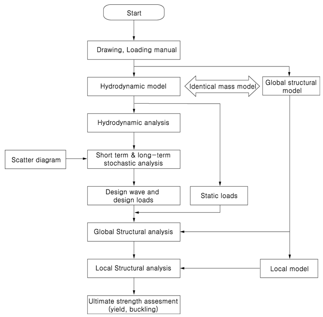
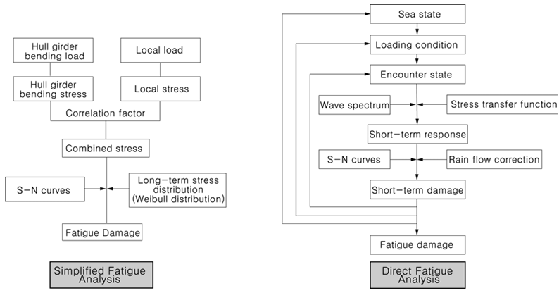

# Guidance for Floating Liquefied Gas Storage and  Regasification Units

> RULES AND GUIDANCE FOR OFFSHORE STRUCTURES / GC-13-E / 2025 / EN / Guidance

## CHAPTER 5 HULL CONSTRUCTION AND EQUIPMENT

### Section 1 General

#### 101. General

- **1.** The design and construction of the hull, superstructure and deckhouses for units that are new builds or conversions are to be based on the applicable requirements of design considerations of this guide and not specified in this guide are to be in accordance with the Rules.
- **2.** Design Considerations of this Guide reflects the different structural performance and demands expected for an installation transiting and being positioned at a particular site on a long-term basis compared to that of a vessel engaged in unrestricted seagoing service.

#### 102. Load line

- **1.** A mark designating the maximum allowable draught for loading is to be located in easily visible positions on units as deemed appropriate by the Society or in positions easily distinguishable by the person in charge of liquid transfer operations.
- **2.** The designation of load lines is to comply with the requirements given in the “International Convention on Load Lines, 1996 and Protocol of 1988 relating to the International Convention on Load Lines, 1966”, unless specified otherwise by the relevant flag states or coastal states.

#### 103. Loading manual, intact stability information and instruction for operation

- **1.** For the case of units, loading manual and loading instruments are to be installed are to be as specified in **Pt 3, Ch 3, Table 3.3.3** of **Rules for the Classification of Steel Ships** and **Rules for the Classification of Steel Barges**.
- **2.** In order to avoid the occurrence of unacceptable stress in unit structures corresponding to all cargo and ballast loading conditions and topside modules arrangement and mass and to enable the master or the person-in-charge of loading operations to adjust the loading of cargo and ballast, units are to be provided with loading manuals approved by the Society. Such loading manuals are to at least include the following (1) to (4) items as well as relevant provisions given in **Pt 3, Ch 3** of **Rules for the Classification of Steel Ships**.
  - **(1)** The loading conditions on which the design of a unit has been based, including the permissible limits of longitudinal still water bending moments and still water shearing forces.
  - **(2)** The calculation results of longitudinal still water bending moments and still water shearing forces corresponding to the loading conditions.
- **3.** In addition to **Par 2** above, a loading computer that is capable of readily computing longitudinal still water bending moments and still water shearing forces working on units corresponding to all oil and ballast loading conditions and the operation manual for such a computer is to be provided on board.
- **4.** The capability of the loading computer specified in **Par 3** above to function as specified in the location where it is installed is to be confirmed.
- **5.** A intact stability information booklet approved by the Society is to be provided on board in accordance with **Pt 1, Annex 1-2** of **Rules for the Classification of Steel Ships**. This booklet is to include the results of stability evaluations in representative operating conditions.
- **6.** Instructions for the loading and unloading, and transfer and offloading operations of cargo and ballast are to be provided on board. In cases where mooring systems can be isolated, the procedures for isolating and re-mooring are also to be included.
- **7.** The loading precautions such as maximum cargo loading weight on the deck and equipment loading weight in the operating condition, etc., is to be stated in appropriate documents such as loading manual or stability information.

### Section 2 Survival Capability and Location of Cargo Tanks

#### 201. General

- **1.** Damage stability criteria are to be in accordance with the requirements specified in **Pt 7, Ch 5, Sec 2** of **Rules for the Classification of Steel Ships**. under the environmental conditions specified in **Ch 3**.
- **2.** The arrangements of watertight compartments, watertight bulkheads and closing devices are to be in accordance with the requirements specified in **Rules for the Classification of Steel Ships** and **Rules for the Classification of Steel Barges**. However, for units of restricted service or units of non propulsion machinery, the requirements may be applied appropriately mitigated.
- **3.** For units of restricted service or units of non propulsion machinery, the requirements may be applied appropriately mitigated by the requirements of damage criteria for 2PG or 3G ship.
- **4.** Damage stability criteria for units of restricted service or units of non propulsion machinery is to be applied to the damage assumptions in **Pt 7, Ch 5, Sec 2 of the Rules**, except for bottom damage.

### Section 3 Longitudinal Strength

#### 301. General

- **1.** The assessment of the longitudinal hull girder strength should be based on the following operational modes:
  - **(1)** All transit conditions
  - **(2)** All operating conditions, intact, at the design locations(s)
  - **(3)** All inspection and repair conditions
- **2.** Changes in the design conditions of a ship-shaped unit are usually accompanied by significant changes in draught, ballast, riser connections, mooring line tension, etc. Limited variation of some of these parameters may be contained within a specific design condition.
- **3.** The suitability of a ship-shaped unit is dependent on the environmental conditions in the areas of the intended operation. A production unit may be planned to operate at a specific site.
- **4.** Use of finite element methodology for strength analysis of hull and cargo tank structures is primarily in order to obtain a better and complete understanding of the stress response when subject to wave, motion-induced loads as well as other functional loads. In practice, the structural analysis can be performed using several levels of modeling methods. The level of modeling and associated structural idealization should be based on purpose of the analysis.

#### 302. Longitudinal hull girder strength

- **1.** Longitudinal strength of ship type unit is to be based on **Pt 3 and Pt 12 of Rules for the Classification of Steel Ships** basically. However, for barge type unit of 150 m or less, it is to be in accordance with the **Rules for the Classification of Steel Barges**. The total hull girder bending moment, $M _{t}$ is the sum of the maximum still water bending moment for operation on site or in transit combined with the corresponding wave-induced bending moment ($M _{W}$) expected on-site and during transit to the installation site.
- **2.** In lieu of directly calculated wave-induced hull girder vertical bending moments and shear forces, recourse can be made to the use of the Environmental Severity Factor (ESF) approach described of this guide. The ESF approach can be applied to modify the Steel Vessel Rules wave-induced hull girder bending moment and shear force formulas. Depending on the value of the Environmental Severity Factor, $\beta _{ vbm}$, for vertical wave-induced hull girder bending moment (see this Guide), the minimum hull girder section modulus, $Z_{ \min}$ of unit may vary in accordance with the following.

  | $\beta _{ vbm}$ | $Z_{ \min}$ |
  | --- | --- |
  | $\beta _{ vbm}$ < 0.7 | 0.85$Z_{ \min}$ |
  | 0.7 < $\beta _{ vbm}$ < 1.0 | Varies linearly between 0.85$Z_{ \min}$ and $Z_{ \min}$ |
  | $\beta _{ vbm}$ > 1.0 | $Z_{ \min}$ |
  | Where $Z_{ \min}$ = minimum hull girder section modulus as required in **Pt 3,Ch 3, 203.** **of Rules for the Classification of Steel Ships** |   |
- **3.** **Environmental Severity Factor**
  Environmental Severity Factors are adjustment factors for the dynamic components of loads and the expected fatigue damage that account for site-specific conditions as compared to North Atlantic unrestricted service conditions.
  - **(1)** ESFs of the Beta ($\beta _{}$) Type
    This type of ESF is used to introduce a comparison of the severity between the intended environment and a base environment, which is the North Atlantic unrestricted service environment. In the modified formulations, the $\beta _{}$ factors apply only to the dynamic portions of the load components, and the load components that are considered “static” are not affected by the introduction of the $\beta _{}$ factors.
    $\beta = \frac{E _{s}}{E _{u}}$
    where
    $E _{s}$ : most probable extreme value based on the intended site (100 years return period),
    transit (10 years return period), and repair/inspection (1 year return period)
    environments for the dynamic load parameters specified in **Table 5.2.**
    $E _{u}$ : most probable extreme value base on the North Atlantic environment for the dynamic
    load parameters specified in **Table 5.2.**
    A $\beta _{}$ of 1.0 corresponds to the unrestricted service condition of a seagoing vessel. A value of $\beta _{}$ less than 1.0 indicates a less severe environment than the unrestricted case.

    | VBM | Vertical Bending Moment |
    | --- | --- |
    | HBM | Horizontal Bending Moment |
    | TM | Torsional Moment |
    | EPP | External Pressure Port |
    | EPS | External Pressure Starboard |
    | VAC | Vertical Acceleration |
    | TAC | Transverse Acceleration |
    | LAC | Longitudinal Acceleration |
    | PMO | Pitch Motion |
    | RMO | Roll Motion |
    | RVM | Relative Vertical Motion at Forepeak |
    | WHT | Wave Height |
    | VSF | Vertical Shear Force |
    | HSF | Horizontal Shear Force |
  - **(2)** ESFs of the Alpha ($\alpha$) Type
    This type of ESF compares the fatigue damage between the specified environment and a base environment, which is the North Atlantic environment. This type of ESF is used to adjust the expected fatigue damage induced from the dynamic components due to environmental loadings at the installation’s site. It can be used to assess the fatigue damage accumulated during the historical service either as a trading vessel or as a unit, including both the historical site(s) and historical transit routes.
    $\alpha = \left( \frac{D _{u}}{D _{s}} \right) ^{0.65}$
    where
    $D _{u}$ : annual fatigue damage based on the North Atlantic environment (unrestricted service) at the details of the hull structure
    $D _{s}$ : annual fatigue damage based on a specified environment, for historical routes, histor ical sites, transit and intended site, at the details of the hull structure

#### 303. Hull girder ultimate strength

- **1.** The hull girder ultimate longitudinal bending capacities are to be evaluated in accordance with **Pt 12** of **Rules for the Classification of Steel Ships**.
- **2.** The vertical hull girder ultimate strength for the unit design environmental condition (DEC) is to satisfy the limit state as specified below. It need only be applied within the 0.4L amidship region.
  $\gamma _{S} M _{sw} + \gamma _{W} \beta _{VBM} M _{wv-sag} \leq \frac{M _{U}}{\gamma _{R}}$
  $M _{sw}$ : permissible still-water bending moment, in kNm
  $M _{wv-sag}$ : sagging vertical wave bending moment, in kNm, to be taken as the midship sagging value defined in **Pt 12, Sec 7/3.4.1.1** of **Rules for the Classification of Steel Ships**.
  $M _{U}$ : sagging vertical hull girder ultimate bending capacity, in kNm, as defined in **Pt 12,**
  Appendix A/1.1.1 of Rules for the Classification of Steel Ships.
  $\beta _{VBM}$ : ESF for vertical wave-induced bending moment for DEC
  $\gamma _{S}$ : load factor for the maximum permissible still-water bending moment, but not to be
  taken as less than 1.0
  $\gamma _{W}$ : load factor for the wave-induced bending moment, but not to be taken as less than below for the given limits
  = 1.3 ($M _{sw} <0.2M _{t}$ 또는 $M _{sw} >0.5M _{t}$)
  = 1.2 ($0.2M _{t} \leq M _{sw} \leq 0.5M _{t}$)
  $M _{t}$ : total bending moment, in kNm
  = $M _{sw} + \beta _{VBM} M _{wv-sag}$
  $\gamma _{R}$ : safety factor for the vertical hull girder bending capacity, but not to be taken as less than 1.15

#### 304. Additional Application

Other various matters on the longitudinal strength are to be as specified in **Pt 5, Ch3, of Rules for the Guidance for Floating Production Units.**

### Section 4 Structural Design and Analysis of the Hull

#### 401. General

- **1.** Design of ship type unit may generally follow the principles of design of steel ships. The design will have to account for characteristics in operation and loading of floating offshore gas installations.
- **2.** The offshore installation design will include:
  Environmental loading regime for a fixed installation location
  Inability to avoid severe weather
  Fatigue design and details for service life
  Partial filling and sloshing loads
  Continuous operation and limited availability and access for inspection and repair
  Increased potential for cryogenic leakage
  Loading in exposed locations
  Scaling up of existing designs
  Increased corrosion considerations
  Increased hazard due to location of gas handling and regasification plant
  Provision of a position mooring system
  Project-specific Design Accidental Loads
  Different regulatory requirements

#### 402. Design Criteria

- **1.** Offshore operation will typically impose different requirements than those applicable for traditional LNG carrier designs. Some of the requirements will be related to safety while others will arise for reasons of operational optimization. The design is based on field-specific operation, usually involving permanently stationed installations and is governed by national regulation and site specific criteria. Offshore operation will normally imply that the unit is permanently position-moored. A turret mooring arrangement or a spread mooring arrangement may be used. The unit will impose additional structural loads arising from topsides loads, sloshing in storage tanks, loads from ship to ship mooring during LNG transfer, and additional design accidental loads arising from activities on board. Continuous operation offshore, typically without dry-docking, for the life of the gas field will impose the need for increased initial quality in order to avoid the need for in-service repair or replacement. This is particularly relevant for fatigue and corrosion considerations. To minimize fatigue damage occurring during service, the design fatigue factors for an offshore vessel not intending to dry-dock, will be stricter than for a trading carrier. The unit in benign areas with high ambient temperature has shown that there may be a high corrosion rate compared to oil carriers. The corrosion protection system may therefore need to meet a higher standard. Regulatory requirements applicable to unit may also impose some additional structural considerations.
- **2.** There are a number of important key factors for a design suitable for an offshore application.
  Design for the intended site of operation
  Design life which is variable: 10-40 years usually depending on field life
  Design based on limit states with the specified probability levels for environmental loads
  100 year return period for Ultimate Limit States, ULS
  Fatigue design for design life with increased design fatigue life
  Limited inspection and repair possibilities
  Increased corrosion protection
  Tank access and gas freeing for inspection
  Additional loads from: topsides, flare, mooring system, risers, cranes, helideck
  Continuous partial filling operation of the cargo tanks
  Different onloading and offloading pattern and berthing loads
  Additional accidental load scenarios to be defined and checked in addition to prescriptive requirements
  Additional requirements of regulatory schemes

#### 403. Structural design of the hull

Design of the hull is to be based on this guide **401, 402.**, general hull structures are to be in accordance with the requirements of **Pt 3** and **Pt 12** of **Rules for the Classification of Steel Ships**. However, the general structure of hull, superstructure and deckhouse of barge type unit of 150 m or less operated and installed in the coastal service is to be in accordance with the **Rules for the Classification of Steel Barges** with regard to **401.**

- **1.** **Hull design for additional loads and load effects**
  The loads addressed in this Subsection are those required in the design of an installation depending on the length of the installation. Specifically, these loads are those arising from liquid sloshing in hydrocarbon storage or ballast tanks, green water on deck, bow impact due to wave group action above the waterline, bow flare slamming during vertical entry of the bow structure into the water, bottom slamming and deck loads due to on-deck production facilities. All of these can be treated directly by reference to unit. However, when it is permitted to design for these loads and load effects on a site-specific basis, reflect the introduction of the Environmental Severity Factors (ESFs-Beta-type) into the Rule criteria.
- **2.** **Superstructures and deckhouses**
  The designs of superstructures and deckhouses are to comply with the requirements of **Pt 12** of **Rules for the Classification of Steel Ships**. The structural arrangements of **Pt 12** of **Rules for the Classification of Steel Ships** for forecastle decks are to be satisfied.
- **3.** **Helicopter decks**
  The design of the helicopter deck structure is to comply with the requirements of **Rules for Classification of Mobile Offshore Drilling Units**. In addition to the required loadings defined in **Rules for Classification of Mobile Offshore Drilling Units**, the structural strength of the helicopter deck and its supporting structures are to be evaluated considering the DOC and DEC environments, if applicable.
- **4.** Protection of deck openings
  The machinery casings, all deck openings, hatch covers and companionway sills are to comply with the requirements of **Pt 12** of **Rules for the Classification of Steel Ships**.
- **5.** Bulwarks, rails, freeing ports, ventilators and portlights
  Bulwarks, rails, freeing ports, portlights and ventilators are to comply with the requirements of **Pt 12** of **Rules for the Classification of Steel Ships**.
- **6.** Machinery and equipment foundations
  Foundations for equipment subjected to high cyclic loading, such as mooring winches, chain stoppers and foundations for rotating process equipment, are to be analyzed to verify they provide satisfactory strength and fatigue resistance. Calculations and drawings showing weld details are to be submitted to the Bureau for review.
- **7.** Bilge keels
  The requirements of bilge keels are to comply with the requirements of **Pt 12** of **Rules for the Classification of Steel Ships**.
- **8.** Sea chests
  The requirements of Sea Chests are to comply with the requirements of **Pt 12** of **Rules for the Classification of Steel Ships**.

#### 404. Engineering analyses of the hull structure

- **1.** General
  The criteria in this Subsection relate to the analyses required to verify the scantlings selected in the hull design in **403.**. Depending on the specific features of the offshore installation, additional analyses to verify and help design other portions of the hull structure will be required. Such additional analyses include those for the deck structural components supporting deck-mounted equipment and the hull structure interface with the position mooring system. Analysis criteria for these two situations are given in **Section 5**.
- **2.** Strength analysis of the hull structure
  For installations of 150 m in length and above, two approaches in performing the required strength assessment of the hull structure are acceptable. One approach is based on a three cargo tank length finite element model amidships where the strength assessment is focused on the results obtained from structures in the middle tank. As an alternative, a complete hull length or full cargo block length finite element model can be used in lieu of the three cargo tank length model. Details of the required Finite Element Method (FEM) strength analysis are in accordance with **Pt 12** of **Rules for the Classification of Steel Ships.**
  When mooring and riser structures are located within the extent of the FE model, the static mass of the mooring lines and risers may be represented by a mass for which gravity and dynamic accelerations can be calculated and added to the FEM model. The resulting dynamic loads shall be compared to the mooring and riser analysis results to ensure that the dynamic effects are conservatively assessed in the hull FE analysis.
  Generally, the strength analysis is performed to determine the stress distribution in the structure. To determine the local stress distribution in major supporting structures, particularly at intersections of two or more members, fine mesh FEM models are to be analyzed using the boundary displacements and load from the 3D FEM model. To examine stress concentrations, such as at intersections of longitudinal stiffeners with transverses and at cutouts, fine mesh 3D FEM models are to be analyzed. The accidental load condition, where a cargo tank is flooded, is to be assessed for longitudinal strength of the hull girder consistent with load cases used in damage stability calculations.

#### 405. Additional Application

Other various matters on the Structural Design and Analysis of the Hull are to be as specified in **Pt 5, Ch4, of Rules for the Guidance for Floating Production Units.**

### Section 5 Design and Analysis of Other Major Hull Structural Features

#### 501. General

The design and analysis criteria to be applied to the other pertinent features of the hull structural design are to conform to this **Guidance** or **Rules for the Classification of Steel Ships.** For ship-type unit, the hull design will need to consider the interface between the position mooring system and the hull structure or the effects of structural support reactions from deck-mounted (or above-deck) equipment modules, or both. The interface structure is defined as the attachment zone of load transmission between the main hull structure and hull mounted equipment, such as topside module stools, crane pedestals and foundations, riser porches, flare boom foundation, gantry foundation, mooring and offloading, etc. The zone includes components of the hull underdeck structures in way of module support stools and foundations, such as deck transverse web frames, deck longitudinals and upper parts of longitudinal and transverse bulkhead structures, as well as foundations of the hull-mounted equipment. These components of the interface structure should comply with the criteria indicated in **504.**.

#### 502. Hull interface structure

The basic scantlings in way of the hull interface structure is to be designed based on the first principle approach and meet the requirements of strength criteria in **Rules for Classification of Mobile Offshore Drilling Units** or equivalent national industry standards recognized and accepted, such as API Standards. Welding design of hull interface structure connections is to be developed based on **Pt 12, Ch 6, Sec 5** of **Rules for the Classification of Steel Ships** or a direct calculation approach. Material grades for the above deck interface structure are to be selected as per **Rules for Classification of Mobile Offshore Drilling Units**. The material grades for the hull structure components, such as deck and frame structures, are to be selected as per **Pt 3** of **Rules for the Classification of Steel Ships**. The verification of the hull interface structure as defined above is to be performed using direct calculation of local 3-D hull interface finite element models, developed using gross scantlings and analyzed with load conditions and load cases described in the following sections.

- **1.** Position mooring/hull interface modeling
  A FEM analysis is to be performed and submitted for review.
  - **(1)** Turret or SPM Type Mooring System, External to the Installation’s Hull
  - **(2)** Mooring system internal to the Installation Hull (Turret Moored)
  - **(3)** Spread Moored Installations
- **2.** Hull mounted equipment interface modeling
  - **(1)** Topside Module Support Stools and Hull Underdeck Structures
  - **(2)** Other Hull Mounted Equipment Foundation Structures

#### 503. Loads

For all conditions, the primary hull girder load effects are to be considered, where applicable.
The DLP values are to be selected for the most unfavorable structural response. Maximum accelerations are to be calculated at the center of gravity of the most forward and aft and midship topside production facility modules.
The load cases are to be selected to maximize each of the following DLPs together with other associated DLP values.
• Max. Vertical Bending Moment
• Max. Shear Force
• Max. Vertical Acceleration
• Max. Lateral Acceleration
• Max Roll
Alternatively, the number of load cases can be reduced by assuming that all maximum DLP values occur simultaneously, which is a conservative assumption.
As a minimum, the following two hull girder load cases are to be analyzed:
• Maximum hull girder sagging moment (i.e., generally full load condition)
• Maximum hull girder hogging moment (i.e., generally ballast, tank inspection or partial loading condition)

#### 504. Additional Application

Other various matters on the Design and Analysis of Other Major Hull Structural Features are to be as specified in **Pt 5, Ch5, of Rules for the Guidance for Floating Production Units**.

### Section 6 Direct Strength Assessment

#### 601. General

This Guidance deals with procedure of direct structural analysis that is composed of structural modeling, stress calculating, yielding check and buckling check for the primary supporting members of hull.

#### 602. Direct Global Structural Analysis

- **1.** **General**
  - **(1)** Application
    - **(A)** This Guidance provides overall procedures to be used in the global structural analysis with direct transfer of loads from hydrodynamic and stochastic analysis for the purpose of structural safety assurance.
    - **(B)** The design of the structure is to be in accordance with **Pt 3, Ch 3** of **Rules for the Classification of Steel Ships** regardless of the structural analysis according to this guidance, and the results of the direct global structural analyses cannot be used to reduce the basic scantlings based on the Rules.
    - **(C)** It is recommended to use the probability level equivalent to a return period of at least 100 years in intended site for design loads.
    - **(D)** The seakeeping and hydrodynamic load analysis is to be carried out using computer program recognized by the Society based on linear 2D Strip method or linear 3D panel method. The non-linear effects should be considered if these effects are regarded to be important after initial evaluation of the hull shape.
    - **(E)** The structural analysis is to be carried out using computer program which can consider the effects of bending deformation, shear deformation, axial deformation and torsional deformation.
  - **(2)** Documentation
    The reports including drawings, structural and hydrodynamic model, mass model, assumption and theory used in analysis, results of loads calculation, results of structural analysis etc. should be presented to the Society for approval of the direct global structural analysis in accordance with this Guidance.
  - **(3)** The flow chart of the direct global structural analysis is shown in **Fig 5.1.**
- **2.** Structural analysis and acceptance criteria
  - **(1)** Structural analysis
    - **(A)** The structural analysis is to be carried out with the Finite Element Method.
    - **(B)** An approved analysis program having adequate accuracy should be used. If deemed necessary, documents related to systems used in the analysis and documents for confirming the accuracy may be required to be submitted to the Society.
  - **(2)** Acceptance criteria
    The results of global structural analysis is to be assessed for the failure mode of yielding according to the allowable stress as specified in **Pt 5, Ch5, of Rules for the Guidance for Floating Production Units**.

#### 603. Additional Application

Other various matters on the major element modeling, stress calculations, yield strength, buckling strength assessment and evaluation process of hull structure are to be as specified in **Pt 3** of **Rules for the Classification of steel ships**.

Fig 5.1 Flow chart of the direct global structural analysis

### Section 7 Fatigue Strength Assessment

#### 701. General

- **1.** Fatigue failures are one of the most important structural defects that need to be assessed in the design. Such failures may be a more significant problem in an offshore vessel compared to a trading carrier. The fatigue evaluation should include.
  Evaluation of critical areas: both from experience and fatigue screening
  Assessment of the loads at the intended site of operation
  Calculations of the structural response based on the actual loads
  Accounting for the design life in the calculations
  Fatigue design for design life with increased design fatigue factors
  Internal structure directly welded to submerged part
  External structure not accessible for inspection and repair in dry and clean condition
  Non-accessible areas inside the vessel
  Very limited repair possibilities
  Critical areas in the hull structures will typically include.
- **2.** Fatigue calculations are performed using as input environmental action of the waves and wind. Wave actions will induce dynamic loads in the hull. For slender structures in the topsides, vortex shedding from wind loads may also be a fatigue load of importance. The wave scatter diagram is used as input to the hydrodynamic analysis which will then give the motion and load response of the vessel in the waves. Modeling of the structure will typically be refined modelling with a fine mesh at the critical locations. These include:
  Moonpool areas
  Topside support structures
  Cargo tank supports
  Support of spherical tank skirt and tank cover
  Hull adjacent to membrane tank

#### 702. Fatigue Analysis Process

- **1.** This guidance provides a guideline for a simplified fatigue analysis method and a direct fatigue analysis method (See **Fig 5.2**)
- **2.** In case of requiring more precise fatigue strength assessment, the direct fatigue analysis method is to be applied to assess the fatigue strength. A spectral fatigue analysis method or a transfer function method may apply to the direct fatigue analysis.
  
  Fig 5.2 Fatigue analysis method**3.** Other equivalent methods may be applied to assess the fatigue strength when deemed appropriate by the Society.

#### 703. Additional Application

Other various matters on major element in the evaluation process of hull fatigue strength are to be as specified in **Pt 3** of **Rules for the Classification of steel ships**.

### Section 8 Hull Arrangements

#### 801. Application

The applicable requirements for hull arrangements is to be in accordance with **Pt 7, Ch 5, Sec 3** of **Rules for the Classification of Steel Ships**. However, for units not engaged in voyage, the requirements in **Pt 7, Ch 5, 301. 1** (2) of **Rules for the Classification of Steel Ships** may not be applied.

### Section 9 Cargo Containment

#### 901. Application

The applicable requirements for cargo containment is to be in accordance with **Pt 7, Ch 5, Sec 4** of **Rules for the Classification of Steel Ships**.

### Section 10 Hull Equipment

#### 1001. Mooring systems for temporary mooring

- **1.** The mooring systems for temporary mooring specified in **Rules for Classification of Mobile Offshore Drilling Units** need not be fitted. In cases where the Society deems such necessary in consideration of the form of unit operations, the mooring systems for temporary mooring specified in **Rules for Classification of Mobile Offshore Drilling Units** are required.
- **2.** In the case of single-point mooring systems to moor shuttle tankers, the chafing chain used ends for mooring lines are to be fitted and are to comply with the following:
  - **(1)** The chafing chain is to be the offshore chain specified in **Pt 4** of **Rules for the Classification of Steel Ship**s, and the chain standard is short lengths (approximately 8 $\mathrm{m} ^{}$) of 76 $\mathrm{mm}$ diameter.
  - **(2)** The arrangement of the end connections of chafing chains is to comply with any standards deemed appropriate by the Society.
  - **(3)** Documented evidence of satisfactory tests of similar diameter mooring chains in the prior six month period may be used in lieu of breaking tests subject to agreement with the Society.
- **3.** Equipment used in mooring systems to moor at jetty etc. in order to install plant or mooring equipment for the mooring support ships and shuttle tankers, except for the equipment specified in **Par 2** above, is to be as deemed appropriate by the Society.

#### 1002. Guardrails

- **1.** The guardrails or bulwarks specified in **Pt 4** of **Rules for the Classification of Steel Ships** are to be provided on weather decks. In cases where guardrails will become hindrances to the taking-off and landing of helicopters, means to prevent falling such as wire nets, etc. are to be provided.
- **2.** Freeing arrangements, cargo ports and other similar openings, side scuttles, rectangular windows, ventilators and gangways are to be in accordance with the requirements specified in **Rules for the Classification of Steel Ships** and **Rules for the Classification of Steel Barges**, unless specified otherwise by the relevant flag states or coastal states.
- **3.** Ladders, steps, etc. are to be provided inside compartments for safety examinations as deemed appropriate by the Society.

#### 1003. Fenders

- **1.** Suitable fenders fore contact with the gunwales of other ships such as support ships, tug boats, shuttle tankers, etc. are to be provided.
- **2.** The most common fender used for side-by-side transfer operations is the high pressure pneumatic type. These fenders are generally favoured for their robustness and longevity. The low pressure pneumatic type have been found useful for emergency situations where ease of transport is a first priority. However, they can have the disadvantage of much shorter life in service. Foam filled fenders are not commonly used but owing to lighter construction they can have advantages when used as secondary fenders.
- **3.** Fender size will also be dictated by the freeboard of the ships, and the diameter of each floating fender should be no more than half the minimum freeboard of the smaller ship.
- **4.** Fenders used in side-by-side transfer operations offshore are divided into two categories:
  - **(1)** Primary fenders which are positioned along the parallel body of the ship to afford the maximum possible protection during mooring and unmooring.
  - **(2)** Secondary fenders which may be used to protect bow and stern plating from inadvertent contact during mooring and unmooring.
- **5.** For the details, Ship to Ship Transfer Guide(Liquefied Gases) issued by OCIMF is to be referred. 
