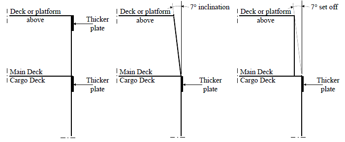

# Guidance for OSV (Offshore Support Vessels)

> RULES AND GUIDANCE FOR OFFSHORE STRUCTURES / GC-15-E / 2025 / EN / Guidance

## CHAPTER 3 STRUCTURES AND EQUIPMENT

### Section 1 Stability

#### 101. General

- **1.** Intact stability are to be in accordance with the relevant requirements in **Pt 1, Ch 1, 307.** of **Rules for the Classification of Steel Ships** in addition to this chapter. However, for ships specifically approved by the Society, these requirements may be waived.
- **2.** With regard to intact stability, **International Code on Intact Stability 2008 (2008 IS Code)** are to be applied in addition to the above **1.**

#### 102. Stability Information for Master and Standard Loading Conditions

For offshore supply vessels, the requirements in "The Guidance for Stability Information for Master" **Pt 1 Annex 1-2. 3** of the **Guidance relating to the Rule for the Classification of Steel Ships** are to be applied.

### Section 2 Hull Structures

#### 201. Hull structure and Materials

- **1.** Hull structure, materials, weldings and end connections are to be in accordance with the following depending upon the ship length:
  - **(1)** For ships which are 90 m or above, materials, hull equipment and end connections are to be according to **Pt 3** and **Pt 7** of **Rules for the Classification of Steel Ships.**
  - **(2)** For ships which are less than 90 m, materials, hull equipment, weldings and end connections are to be according to **Pt 10** of **Rules for the Classification of Steel Ships**.
- **2.** The requirements in **Pt 2, Ch 1** of **Rules for the Classification of Steel Ships** are to be applied to materials used to hull structure unless specifically specified.

#### 202. Strengthening for Heavy Cargoes

- **1.** The requirements apply to Offshore Support Vessels intended to carry heavy deck cargo exceeding 25 kN/m^2 or heavy liquid cargo with specific gravity greater than 1.025.
- **2.** **Heavy Cargoes**
  - **(1)** The Special Feature Notation HDC(P, Locations) will be assigned additionally to vessels designed built with strengthened for carriage of heavy deck cargoes exceeding 25 kN/m^2.
  - **(2)** The Special Feature Notation HLC($\rho$, Tanks) will be assigned additionally to vessels designed built with strengthened for carriage of heavy liquid cargoes with specific gravity exceeds 1.025.
- **3.** **Submission of Data**
  In general, the following plans and particulars are to be submitted.
  - **(1)** Heavy Deck Cargoes
    - **(A)** Structural details and arrangements of structures in way of cargo deck
    - **(B)** The design deck cargo loads in kN/m^2 and locations
    - **(C)** Lashing arrangement of deck cargoes
  - **(2)** High Density Liquid Cargoes
    - **(A)** Tank arrangements and deep tank locations, together with their intended cargoes
    - **(B)** Specific gravity of highest density liquid cargoes for 100% filling of each tank
    - **(C)** Height of the air and overflow pipes for each tank

#### 203. Side Fenders

- **1.** For vessels subject to impact loads during routine operations the minimum side shell thickness is to be not less than 25% of the requirement of **Rules for the Classification of Steel Ships**, unless effective permanent fenders are provided to protect the structure.
- **2.** Continuous longitudinal fenders are generally to be fitted on the side shell at cargo deck. The fenders are to extend from the stern to a point not less than 0.02L forward of the section at which the full deck’s breadth starts decreasing; the area defined as an impact region. Additional fenders are to also be arranged diagonally at about 45° between the foregoing fenders, as necessary, to protect the side shell from the impact.
- **3.** Fenders may be either permanent fenders constructed of steel or having exchangeable hard wood or rubber profile inserts. Carling plates or other effective means of stiffening are to be provided so that fender loads are effectively distributed to the hull structure. Steel fenders are to be efficiently welded to the shell plating with continuous fillet welds. Alternatively the fenders may be omitted also if the side plating is at least twice the thickness that is required by **1**, for a height of at least 0.01L.
- **4.** The upper plate may be omitted if the side shell is inclined 7° or set off 1:8 from the side’s vertical (**Fig 3.1**). The strength of the side frames, webs and stringers in the impact region is to be increased by the factor 1.25 over the standard requirements. All side structural members in the impact region shall have end connections with brackets. Scallop welds shall not be used in connections between side frames and shell plating.
  
  Fig 3.1 Side Impact Plates

### Section 3 Hull Equipment

#### 301. General

- **1.** The hull equipment of Offshore Support Vessels intended to be classed or have been classed with the Society are to be in accordance with the requirements specified in this Section.
- **2.** Hull equipment are to be in accordance with the following depending upon the ship length:
  - **(1)** For ships which are 90 m or above, hull equipment is to be according to **Pt 4** of **Rules for the Classification of Steel Ships.**
  - **(2)** For ships which are less than 90 m, hull equipment is to be according to **Pt 10** of **Rules for the Classification of Steel Ships**.
- **3.** Equipment Number calculations for unconventional vessels with unique topside arrangements or operational profiles may be specially considered. Such consideration may include accounting for additional wind areas of widely separated deckhouses or superstructures in the equipment number calculations or equipment sizing based on direct calculations.
- **4.** Cargo gear are to be in accordance with the relevant requirements in **Pt 9, Ch 2** of **Rules for the Classification of Steel Ships.**

#### 302. Offshore Mooring Chain for Station Keeping

- **1.** **Qualification of Manufacturers**
  Offshore mooring chain is to be manufactured by works approved in accordance with **Pt 2** of **Rules for the Classification of Steel Ships** or in accordance with **Guidance for Approval of Manufacturing Process and Type Approval, Etc.**.
- **2.** **Materials**
  Materials used for the manufacture of offshore mooring chain are to meet the requirements of **Pt 2** of **Rules for the Classification of Steel Ships** or in accordance with **Guidance for Approval of Manufacturing Process and Type Approval, Etc.**
- **3.** **Design, Manufacture, Testing and Certification of Chain**
  Offshore mooring chain is to be designed, manufactured, tested and certified in accordance with the requirements of **Pt 2** of **Rules for the Classification of Steel Ships** or in accordance with **Guidance for Approval of Manufacturing Process and Type Approval, Etc.**.

### Section 4 Machinery

#### 401. General

Machinery installations of the ship are to be in accordance with the relevant requirements in **Pt 5** of **Rules for the Classification of Steel Ships** in addition to this section.

#### 402. Test

- **1.** Before installation on board, equipment and components constituting the machinery installations are to be tested at the manufacturers in accordance with the relevant requirements in **Pt 5** of **Rules for the Classification of Steel Ships.**
- **2.** Notwithstanding the requirements in the above **1.**, for machinery installations that are used solely for the operation of the ship, other than boilers, pressure vessels belonging to Group I or II and piping systems which contain inflammable or toxic liquids, it may be substituted with tests that may be deemed appropriate by the Society.
- **3.** The systems or the equipment essential for the safety of the ship or for the propulsion of the ship (only applicable to the ships which have the main propulsion machinery) are, after installed on board, to be subjected to performance tests.

### Section 5 Electrical Installations

#### 501. General

Electrical installations of the Offshore Support Vessel are to be in accordance with the relevant requirements in **Pt 6** of **Rules for the Classification of Steel Ships** in addition to this section.

#### 502. Test

- **1.** Among electrical equipment used solely for the operation of the ship; fuses, circuit breakers, explosion-protected electrical equipment and cables are to be subjected to be in accordance with the requirement in **Pt 6, Ch 1, Sec 1, 103.** of **Rules for the Classification of Steel Ships.** However, electrical installations which do not comply with this requirement may be accepted provided that the submission of documents such as specifications, sectional assembly drawings, test reports, certificates issued by public bodies for the examination by the Society.
- **2.** Electrical equipment used solely for the operation of the ship and not listed in the above **1.** may be in accordance with the standards deemed appropriate by the Society.
- **3.** For electrical installations used solely for the operation of the ship, an insulation resistance test specified in **Pt 6, Ch 1, Sec 17, 1701.** of **Rules for the Classification of Steel Ships** and performance tests of safety devices for generators and transformers are to be carried out after installation on board.

### Section 6 Fire Protection and Fire Extinguishing Systems

#### 601. Application

- **1.** Where Offshore support vessels, not less than 500 tons gross tonnage, are engaged in international voyage, those construction of fire protection, fire detection and fire extinction shall be complied with the requirements of **Pt 8** of **Rules for the Classification of Steel Ships**. However, for Offshore support vessels less than 500 tons gross tonnage or Offshore support vessels not engaged with international voyage, they may apply to the requirements in accordance with the **Pt 8, Ch 1, 101.** of **Guidance relating to the Rules for the Classification of Steel Ships.** as provided separatedly.
- **2.** In addition to para 1, they shall also be complied with the International Conventions of SOLAS and the National Regulations of the country in which the ships is registered.
- **3.** Despite of para 1 and 2 for the ships not applied to the SOLAS but applied to the Ships Safety Law of Korea, those fire-fighting system shall be in accordance with the relevant requirements specified by these Laws.
- **4.** In addition to para 1 Offshore support vessels intended to carry hazardous and noxious liquid substances in bulk are to comply with the IMO Resolution A.673(16) as amended by IMO Res.Res.MSC184(79), MSC.236(82) and Res.MEPC.158(55) requirements Guidelines for the Transport and Handling of Limited Amounts of Hazardous and Noxious Liquid Substances in Bulk on Offshore Support Vessels and the governing Administrative Regulations. 
