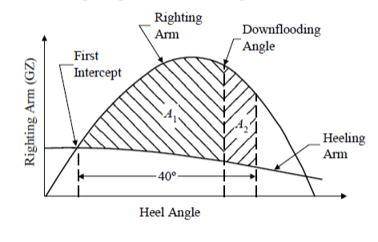
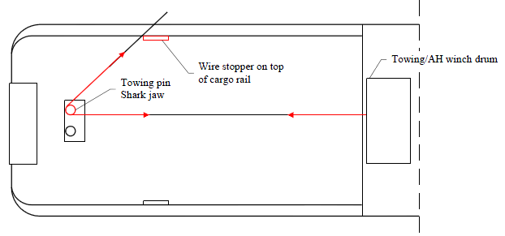
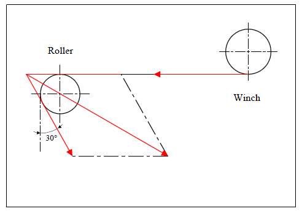

# Guidance for OSV (Offshore Support Vessels)

> RULES AND GUIDANCE FOR OFFSHORE STRUCTURES / GC-15-E / 2025 / EN / Guidance

## CHAPTER 5 ANCHOR HANDLING AND TOWING VESSELS

### Section 1 General

#### 101. Application

- **1.** The requirements in this Chapter apply to Anchor handling towing vessels (hereinafter referred to as "ships" in this Chapter) equipped for the handling of anchors of offshore floating installations or equipped for towing operations.
- **2.** The ships should comply with the requirements of this chapter in addition to **Ch 1** to **Ch 3**.

#### 102. Submission of Data

- **1.** In general, in addition to the plans listed in **Ch 2, Sec 2**, the following plans and particulars are to be submitted.
- **2.** **For Approval**
  - **(1)** Structural details of supporting structures in way of the anchor handling and towing winches
  - **(2)** Structural details of stern roller, towing pins, shark jaw and their supporting structure
  - **(3)** Details of stow racks, cargo rails, crash rails and supporting structures
  - **(4)** Spare chain locker(s) structural details including chutes (if installed)
  - **(5)** Structural details of A-frame and deck cranes, if certification is requested
  - **(6)** Structural details of supporting structures of A-frames and deck cranes
- **3.** **For Information**
  - **(1)** Details on winches for anchor handling, towing and secondary winches (storage reels), as follows:
    - **(A)** Type, rating (braking power of the winches)
    - **(B)** location and layout (with foundation or foundation footprint drawing)
    - **(C)** Weights and centers of gravity
    - **(D)** Electrical and/or piping schematic diagrams of power supply and control system for the towing equipment
    - **(E)** Locations of control stations or human-machinery interfaces
    - **(F)** Arrangement and details of communication systems between anchor handling operation control stations and navigation bridge
  - **(2)** Information regarding ropes and/or wires to be set on the above winches, as follows:
    - **(A)** Type, lengths, diameters minimum specified breaking strength weights
  - **(3)** Details, ratings, location and arrangements of all the towing and/or anchor handling structures and devices in way of cargo deck, as follows:
    - **(A)** Steel sheet cladding on top of wooden sheathing
    - **(B)** Quick release device or devices (if installed)
    - **(C)** Shark jaws/towing pins unit or units
    - **(D)** Towing eye-bars (if installed)
    - **(E)** Anchor launch and recovery unit for deep penetrating anchors (if installed)
    - **(F)** A-frame (if installed), deck cranes, tugger winches and/or capstans
    - **(G)** Pad-eyes for securing and lashing anchors on deck
    - **(H)** - Aft roller or rollers
  - **(4)** Laying arrangement and weights of anchors carried as cargo
  - **(5)** Estimated static bollard pull, together with the method of prediction. (The estimated value is to be confirmed at Trials prior to final certification)
  - **(6)** Estimated operational pull within speed range of 0-8 knots at 1 knot intervals, together with the method of prediction (The estimated values may be based on tank test results of required power and allowable trust curves. CFD techniques may be utilized for this purpose as well The required power values are to be multiplied by the factor of 1.4 to accommodate potential power increase, necessary for station keeping in extreme environmental conditions)
  - **(7)** Static Bollard Pull Test Procedure

### Section 2 Stability

#### 201. General

- **1.** Intact stability are to be in accordance with this section in addition to **Ch 3, Sec 1.** However, for ships specifically approved by the Society, these requirements may be waived.
- **2.** Stability is to be considered especially to the ships that have specially designated operations.
- **3.** Stability calculations and corresponding information for the Master are to be submitted for review and approval.
- **4.** The submission of evidence showing approval by an Administration of stability of the vessel for the towing operations in accordance with a recognized standard may be acceptable.

#### 202. Intact Stability Guidelines for Anchor Handling

- **1.** **Additional Intact Stability Criteria**
  - **(1)** Intact Stability
    For vessels that are used for anchor handling and which at the same time are utilizing their towing capacity and/or tractive power of the winches, calculations are to be made showing the acceptable vertical and horizontal transverse force/tension to which the vessel can be exposed. The calculations are to consider the most unfavorable conditions for vertical and transverse force/tension and as a minimum include the following:
  - **(2)** Loading Conditions
    The following loading conditions intended for anchor handling are to be examined in the Trim and Stability Booklet:
    These conditions are to include the following items:
  - **(3)** Stability Guidance for the Master
    The trim and stability booklet, required by **Ch 3, 102**, is to include the following guidance:
    During anchor handling operations, all weather-tight access and emergency hatches, and doors on the work deck, are to be kept closed, except when actually being used for transit under safe conditions.

#### 203. Intact Stability Guidelines for Towing

- **1.** **General**
  The intact stability of each vessel receiving a towing notation is to be evaluated for the applicable loading conditions indicated in **Ch 3, 102.** for compliance with the intact stability criteria in **2.** and the results are to be submitted for review.
- **2.** **Intact Stability Criteria**
  - **(1)** Towing Operating
    The heeling arm curve due to towline pull should be calculated in accordance with **3**. The area of the residual dynamic stability (area between righting and heeling arm curves beyond the angle of the first intercept) up to an angle of heel of 40° beyond the angle of the first intercept (A1 + A2), or the angle of downflooding, if this angle is less than 40° beyond the angle of the first intercept (A1), should not be less than 0.09 meter-radians. (See **Fig 5.1**)
    
    Fig 5.1 Righting Arm and Heeling Arm Curves
- **3.** **Heeling Arm Curve**
  The towline pull force should be calculated using the corresponding percentage of the maximum bollard pull force, depending on the type of propulsion (**Table 5.1**), at right angles to the vessel's fore and aft axis. The heeling moment due to towline pull should be calculated by multiplying the towline pull force by the distance from the top of the towing bitt to the intersection of propeller shaft centerline and rudder axis. The resultant moment should be converted to a heeling arm and plotted on the same graph as the righting arm/GZ curve (corrected for free surface). The heeling arm curve can be taken to vary with the cosine of the heeling angle.
  The bollard pull force shall be derived from the actual test. For the purposes of preliminary stability evaluations prior to the bollard pull test, the bollard pull force may be estimated, depending on the type of propulsion and shaft power (SHP), as per **Table 5.1**.

  | Type of Propulsion | Towline Pull Force as percentage of Max Bollard Pull Force | Bollard Pull Force estimate based on shaft power kN/kW |
  | --- | --- | --- |
  | Twin screw with open propellers, or other types not listed below | 50% | 5029 |
  | Twin screw with open propellers and flank rudders | 50% | 5029 |
  | Twin screw with conventional non-movable nozzles | 50% | 5867 |
  | Water Tractor Tug with twin propeller Z-drives (steerable propellers with nozzles) | 70% | 5867 |
  | Water Tractor with twin cycloidal propellers (vertical axis) | 70% | 5029 |
- **4.** **Stability Guidance for the Master**
  The Master of the vessel should receive information in the Trim and Stability Booklet regarding cargo and/or ballast limitations, list of protected flooding openings that need to be kept closed, wind and/or wave restrictions, etc., necessary to ensure that the stability is in compliance with the criteria given in the above **2**.
  If any loading condition requires water ballast for compliance with the criteria in the above **2**, the quantity and disposition should be stated in the guidance to the Master.

### Section 3 Hull Structures

#### 301. General

Hull structures are to be in accordance with this section in addition to relevant requirements in each chapter of **Ch 3, Sec 2.**

#### 302. Supporting structures of anchor handling equipments

The surroundings of the supporting structures of anchor handling equipments and the part where anchors are loaded must be ensured to be sufficiently strong.

#### 303. Suitable construction for anchor handling operation

- **1.** Ships are to have completely clear decks with no obstacles in order to effectively handle anchors.
- **2.** In cases where anchor handling operations are conducted using after deck stern rollers, the aft terminals nearby the stern areas for anchor handling are to be round in shape.

#### 304. Supporting structures of towing equipment

- **1.** In principle, towing equipment is to be located on longitudinals, beams or girders, which are parts of the deck construction.
- **2.** In case the towing equipment cannot be located as specified in **1.** above, towing equipment is to be reinforced to the stiffener.
- **3.** The supporting structures of towing equipment are to be such to ensure sufficient strength.
- **4.** The design load on fittings is to take into account all acting loads.
- **5.** The design loads for the supporting structures of towing equipment are to be not less than the breaking strength of the towline system.

#### 305. Side Shell and Frames

For vessels subject to impact loadings during anchor handling or towing operations, it is recommended that side frames and side shell plating comply with **Ch 3, 203.**

#### 306. Work Deck

- **1.** **Reinforcement against Impact, Wear and Tear**
  Plating thickness at the aft portion of the work deck is to be increased to protect the structure against heavy impact loads and wear and tear. It is recommended that minimum plating thickness in this area be not less than 25 mm. Alternative arrangements will be considered on case by case basis for re-enforcement against impact and wear and tear. Where heavy anchors and/or chains are carried on deck, suitable means for distributing their weights properly to deck structures are to be provided. The stresses in deck members are not to exceed the following **Table 5.2**.

  |   | σ N/mm^2 | τ N/mm^2 |
  | --- | --- | --- |
  | Longitudinal Beam/Girder: Transverse Beam/Web: | 124 140 | 69 85 |

#### 307. Work Deck Protection

The aft deck areas exposed to anchor drags should not be fitted with sheathings or if present, the sheathings are to be suitably protected. In addition, any protrusion above deck such as coamings, manholes, lashing pad eyes, etc. shall be avoided.
The deck plating thickness in these areas shall be suitably increased to allow for abrasion and mechanical damage.

#### 308. Anchors and Chains Securing Means

Pad eyes for securing and/or moving the anchors and/or chains are to be welded directly to the deck plating without doublers. The deck in way of the pad-eyes is to be adequately reinforced. Removable pad eyes are to have firm attachment to the deck sockets or holdings. All pad eyes are to be permanently marked with bead welded SWL values.

#### 309. Arrangements for Shifting Anchors and Chains

The foundations of tugger winches and/or capstans are to be welded directly to the deck plate and with adequate reinforcement underneath.

#### 310. Deck Openings

Access openings, including emergency exits, are to be located clear off the towline sweep area.

### Section 4 Hull Equipment

#### 401. General

- **1.** Hull equipments are to be in accordance with the relevant requirements in **Ch 3, Sec 3** in addition to this section.
- **2.** In cases where equipment and devices for the ship's purpose are fitted, suitable measures are to be taken so that ship safety is not impaired.

#### 402. Protection of deck areas

Deck areas for the collection and handling of anchors and associated equipment are to be protected by wooden sheathing, etc. However, in cases where the plate thickness is increased by 2.5 mm, such protection may be omitted.

#### 403. Safety devices

Equipment, such as winches, for anchor handling operations is to be provided with suitable safety devices so that towing wires are able to be released or cut in times of emergency.

#### 404. Towing equipment

The towing hooks, towing bits or towing bollards fitted onto ocean tugs is to be located as low as practicable, and close to, but abaft of, the center of gravity of the ship in the expected towing condition.

### Section 5 Anchor Handling/Towing Winch and Accessories

#### 501. Arrangement and Control

- **1.** **Control Stations**
  Anchor handling and towing winches are to be capable of being operated from control stations located on the bridge and at least one additional position on deck with a clear view to the drums.
  Each control station is to be equipped with suitable control elements, such as operating levers, with their functions clearly marked. Wherever practical, control levers are to be moved in the direction of the intended towline movement. The operating lever, when released, is to return into the stop position automatically and is to be capable of being secured in the stop position.
  Means are to be provided for measuring the tension of the anchor handling/towing line, for display at the control stations and for initial and periodic calibration of line tension measuring instrumentation.
- **2.** **Quick Release Device**
  The quick release device for either the anchor handling or towing rope or wire is to be operable from the control station on the bridge or other normally manned location in direct communication with the bridge. The quick release device is to be capable of disengaging the line at any combination of expected trim and heel. It is to be operable in a black-out of the electrical power system and protected against unintentional operation. Procedures describing emergency release methods, time delays and release speed are to be specified and posted at the control stands. See the test requirements for quick release devices in **507. 1.**
- **3.** **Power Supply**
  Where the power supply for normal operation of the anchor handling or towing winch is taken from the same source for propulsion, such as shaft generator, shaft power take-off (PTO), an independent (redundant) power supply with sufficient capacity for the winch operation is to be available to ensure the vessel’s maneuvering capability during anchor handling or towing operations is not degraded.

#### 502. Mechanical Design

- **1.** **Anchor Handling Winch**
  - **(1)** Hoisting and Holding Capabilities
    The design of winches is to provide for adequate dynamic and holding braking capacity to control normal combinations of loads from the anchor, anchor line and anchor handling vessel during deploying or retrieving of the anchors at the maximum operational speed of the winch. The mechanical components of the winch and associated accessories are to be capable of sustaining the maximum forces from the hoisting, rendering and braking including any dynamic effects as applicable without permanent deformation as follows:
    - **(A)** Operational braking capability is to be at least 1.5 times the maximum torque created by the anchor handling line calculated with the rated breaking strength. In addition, the brake is to be capable of stopping the rotation of the drum from its maximum rotating speed.
    - **(B)** Brake holding capacity of 80% of the maximum torque created by the anchor handling line calculated with the rated breaking strength and able to stop the rotation of the drum at its maximum speed.
  - **(2)** Winch Brakes.
    Each winch is to be provided with a power control braking means such as regenerative, dynamic, counter torque breaking, controlled lowering or a mechanically controlled braking means capable of maintaining controlled lowering speeds.
    Brakes are to be applied automatically upon loss of power or when the winch lever is returned to neutral.
- **2.** **Towing Winch**
  The towing winch is to be capable of sustaining RL without permanent deformation.
- **3.** **Anchor Handling/Towing Winch**
  A winch intended for both functions of anchor handling and towing is to meet the requirements of **1.** and **2.**
- **4.** **Towline Attachment**
  Anchor handling and towing winches are to be designed in such a way as to allow release of drums and the fast release of lines in an emergency and in all operating conditions. The speed of paying out the lines is to be such as to relieve the tension forces acting on the winch as quickly as possible. The end attachment of the lines to the winch drums is to be of limited strength to allow the lines to part from the winch drums.
  The drum overload clutches for the winch drums are to be capable of being remotely pre-set from the control station on the bridge. See test requirements for drum overload clutches in **507. 2.**
- **5.** **Winch Supporting Structure**
  Supporting structure of the towing winch is to be capable of sustaining RL without permanent deformation.
  Supporting structure of the anchor handling winch is to be capable of sustaining the maximum brake holding capacity or the maximum hoisting capacity of the winch, whichever is greater, without permanent deformation
  Doubler plates are not allowed between the winch foundation and the deck plating, a thicker insert plate is to be applied, if necessary.
  Stresses in the structure supporting the winch are not to exceed:
  Normal stress = 0.75 $\sigma _{y}$
  Shear stress = 0.45 $\sigma _{y}$
  Where $\sigma _{y}$ is the specified minimum tensile yield strength or yield point.

#### 503. Towing Pins and Towing Eyes

- **1.** **Pins and Eyes**
  Recessed towing eyes, if provided, are to be integrated into deck structure. The recesses are to be drained directly overboard and protected when not in use by flush steel covers.
  Towing pins and towing eyes are to be capable to of sustaining the breaking strength of the towline considering the most extreme line arrangement (see **Fig 5.3**) without exceeding the stress limits given in **502. 5.**
  Stresses in structure supporting the towing pins and eyes are not to exceed the limits specified in **502. 5.**
  
  Fig 5.3 Tow Line Arrangement

#### 504. Shark Jaws

Shark jaws and supporting structures are to be capable of sustaining the breaking strength of the anchor line or towline considering the most extreme line arrangement (see **Figure 5.3**) without exceeding the stress limits given in **502. 5.**

#### 505. Stern Roller

The length of stern roller (or rollers) is to be kept to a minimum, and sufficient to accommodate the widest anticipated anchor to be served.
The minimum external diameter of the stern roller is to be:
$D _{s} r = 17 d _{w}$ mm
where $d _{w}$ is the nominal anchor handling wire rope diameter in mm.
The roller, pin connections, foundations and supporting structure are to be designed to the breaking strength of the anchor line. The load is to be applied as shown in **Figure 5.4**. The stresses are not to exceed the following the limits given in **502. 5.**

Fig 5.4 Application for Roller Load

#### 506. A-frame or Shear Leg Type Crane

Where an A-frame or shear leg type crane is installed for anchor handling, it is to be certified for compliance with **Ch 2, Pt 9** of **Rules for the Classification of Steel Ships.**

#### 507. Tests

- **1.** **Quick Release Device Test**
  The effectiveness of the quick release device is to be demonstrated during trials conducted at manufacturers’ premises in presence of the Surveyor.
- **2.** **Drum Overload Clutch Test**
  The effectiveness of the drum overload clutches is to be demonstrated during winch acceptance trials conducted at manufacturer’s premises in presence of the Surveyor.
- **3.** **Static Bollard Pull Test**
  The static bollard pull test procedure is to be submitted for review by the attending Surveyor in advance of the test.
  The requirements for conducting a bollard pull test on vessels of duplicate design will be specially considered on a case-by-case basis.
  The static bollard pull is to be measured with the vessel at the maximum continuous rpm and at or near the maximum towing depth.
  The static bollard pull is the pull that is recorded over the state of equilibrium without any tendency to decline.
  The depth of water under the keel in the testing area should be at least two times the vessel draft at amidships.

### Section 6 Machinery

#### 601. General

Machinery installations of the ship are to be in accordance with this section in addition to **Pt 5, Ch 3, Sec 4** of **Rules for the Classification of Steel Ships**.

#### 602. Steering gear

The steering gear is to be capable of turning the rudder from 35° on one side to 30° on the other side within 20 seconds, when the vessel is running ahead at maximum service speed.

### Section 7 Fire Protection and Fire Extinguishing Systems

#### 701. General

Fire protection and fire extinguishing systems are to be in accordance with the relevant requirements in **Ch 3, Sec 6** in addition to this section.

#### 702. Additional equipment for ships engaged in towing operations

Emergency exits from machinery spaces to decks are to be capable of being used even at extreme heel angles. In addition, emergency exits are to be positioned as high as possible above waterlines and positioned as near as practicable to ship centre lines. 
