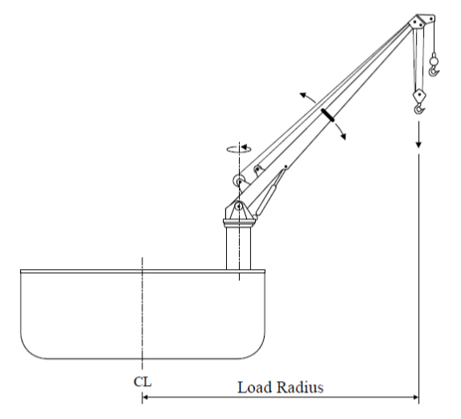
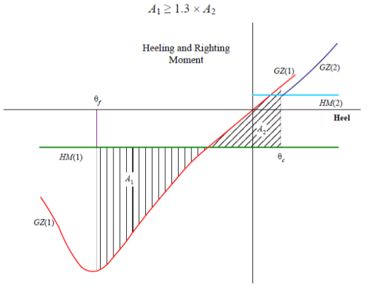

# Guidance for OSV (Offshore Support Vessels)

> RULES AND GUIDANCE FOR OFFSHORE STRUCTURES / GC-15-E / 2025 / EN / Guidance

## CHAPTER 6 HEAVY LIFT VESSELS

### Section 1 General

#### 101. Application

- **1.** The requirements in this Chapter apply to Heavy lift vessels (hereinafter referred to as "ships" in this Chapter) intended for the lifting of heavy loads in oil drilling and production operations, offshore construction and/or salvage operations, with a lifting capacity of 160 metric tons or above.
- **2.** The vessels should comply with the requirements of this chapter in addition to **Ch 1** to **Ch 3**.

#### 102. Submission of Data

- **1.** In general, in addition to the plans listed in **Ch 2, Sec 2**, the following plans, calculations and particulars are to be submitted.
- **2.** **Crane Plans and Data**
  - **(1)** General arrangement, assembly plans and description of operating procedure and design service temperature
  - **(2)** Dead, live and dynamic loads. Environmental loads including effects of wind, snow and ice. Load swing caused by non-vertical lifts. Load due to the list and/or trim of the vessel or structure.
  - **(3)** Maximum reactions and overturning moments
  - **(4)** Details of the principal structural parts, including crane pedestal, foundation and other crane supporting structure
  - **(5)** Welding details and procedures
  - **(6)** Crane capacity rating charts
  - **(7)** Wire rope specifications
  - **(8)** Material specifications
  - **(9)** Details of heave compensation arrangements if applicable
  - **(10)** Where applicable, details of swing circle assembly, arrangement of hold-down bolts, size, material, grade and pretensioning together with method used for pretensioning
  - **(11)** Equipment for positioning during heavy weight lifting operations
- **3.** **Design Analysis**
  The following calculations are to be submitted.
  - **(1)** Calculations demonstrating the adequacy of the vessel’s stability during heavy weight lifting operations.
  - **(2)** Calculations demonstrating adequacy of propulsion power required for the vessel to maintain station during heavy weight lifting operations.
  - **(3)** Calculations demonstrating strength of the crane and supporting structures.
- **4.** **Additional Data**
  The following items are also to be submitted.
  - **(1)** Plans of the electric installations of the crane
  - **(2)** Diagrams of electrical, hydraulic and pneumatic systems and equipment for power supply and control systems for the cranes
  - **(3)** Assembly plan showing principal dimensions of the crane and limiting positions of its movable parts
  - **(4)** Piping diagrams for ballast and/or anti-heeling systems
  - **(5)** Crane manual for each crane installed on board

### Section 2 Stability

#### 201. General

- **1.** Intact stability is to be in accordance with this section in addition to the relevant requirement of **Ch 3, Sec 1.** However, for ships specifically approved by the Society, these requirements may be waived.
- **2.** Stability to be considered especially to the ships that have specially designated operations.
- **3.** The submission of evidence showing approval by an Administration of stability of the vessel for the lifting operations in accordance with a recognized standard may be accepted.
- **4.** The dynamic load chart for each crane shall be included in the Trim and Stability Booklet and shall be posted at the crane operator's station in the clear view of the crane operator.

#### 202. Calculation on stability

In applying the requirements in **Pt 1, Annex 1-2** of **Rules for the Classification of Steel Ships**, the heeling lever resulting from designated operations is to be considered the most unfavorable for stability.

#### 203. Intact Stability Requirements for Vessels Equipped to Lift

- **1.** **Stability Information**
  - **(1)** Specific Applicability
    This appendix applies to each vessel that:
    $0.67 \Delta GM(F/B)$ (m-tons)
    where:
    $\Delta$ = displacement of the vessel with the hook load included (tons)
    $GM$ = metacentric height with hook load included (m)
    $F$ = freeboard to the deck edge amidships (m)
    $B$ = beam (m)
  - **(2)** Definition
    As used in this requirement.
- **2.** **Intact Stability Requirements for Vessels Equipped to Lift**
  - **(1)** Counter-ballasted and Non-counter-ballasted Vessels
    The wind heeling moment shall be calculated as:
    $P \times A \times H$ (N-m)
    where
    $P$ = wind pressure, calculated as per below
    $A$ = projected lateral area (m^2), of all exposed surfaces (including deck cargo), in the upright condition
    $H$ = vertical distance (m), from the center of A to the center of the underwater lateral area or approximately to the one-half draft point
    
    Fig 6.1 Load Radius
    This wind heeling moment is to remain constant for all heel angles.
    $P =fV _{k} ^{2} C _{s} C _{h}$ (N/m^2)
    where
    $f$ = 0.611
    $V _{k}$ = wind velocity (m/s)
    $C _{s}$ = 1.0, shape coefficient
    $C _{h}$ = height coefficient from **Table 6.1**
    **Table 6.1** C_h **Value**

    | $H$ (m) | $C _{h}$ |
    | --- | --- |
    | 0.0 - 15.3 | 1.00 |
    | 15.3 - 30.5 | 1.10 |
    | 30.5 - 46.0 | 1.20 |
    | 46.0 - 61.0 | 1.30 |
    | 61.0 - 76.0 | 1.37 |
    | 76.0 - 91.5 | 1.43 |
    | 91.5 above | 1.48 |

    The righting arm curve is to be corrected for the increase in the vertical center of gravity due to the lifting operation. (The increase in the VCG is due to the boom being in the elevated position, and the hook load acting at the elevated end of the boom.).
    - **(A)** Each vessel that is equipped to lift is to comply, by design calculations, with this section under the following conditions:
      - **(a)** Either for each loading condition(see **Ch 3, 102.**) and pre-lift condition, or the range of conditions, including pre-lift conditions, delineated by the lifting operations guidelines contained in the trim and stability booklet; and
      - **(b)** Crane Heeling Moment, and
      - **(c)** The effect of beam wind on the projected area of the vessel (including deck cargo) should be evaluated for 25.7 m/s (50 knots) wind speed. Should a lesser wind speed be used, that wind speed shall be listed in the trim and stability booklet as an operational restriction during lifting operations.
    - **(B)** Each vessel is to have a righting arm curve with the following characteristics:
      - **(a)** The area under the righting arm curve from the equilibrium heel angle (based upon the wind heeling moment) up to the smallest of the following angles must be at least 0.080 meter-radians :
      - **(i)** The second intercept
        - **(ii)** The downflooding angle
        - **(iii)** 40 degrees
      - **(b)** The lowest portion of the weather deck and downflooding point should not be submerged at the equilibrium heel angle.
      - **(c)** The heeling angle based on the crane heeling moment and effect of the beam wind shall not exceed the maximum heel angle from the crane manufacturer.
  - **(2)** Additional Intact Stability Standards – Counter-ballasted Vessels
    The following recommended criteria are based on crane operations taking place in favorable weather conditions. The analysis should be carried out for the counter-ballast case when the vessel is floating with a heel and trim not exceeding the maximum cross angle. The maximum cross angle is the angle corresponding to the crane operational restrictions.
    The righting arm curve is to be corrected for the increase in the vertical center of gravity due to the load. (The increase in the VCG is due to the boom being in the elevated position, and the hook load acting at the elevated end of the boom.).
    The following requirements are also to be met, with the vessel at the maximum allowable vertical center of gravity, to provide adequate stability in case of sudden loss of crane load:
    
    Fig 6.2 Criterial after Accidental Loss of Crane Load
    $GZ(1)$ = righting moment curve at the displacement corresponding to the vessel without hook load.
    $GZ(2)$ = righting moment curve at the displacement corresponding to the vessel with hook load.
    $HM(1)$ = heeling moment curve due to the heeling moment of the counter-ballast at the displacement without hook load.
    $HM(2)$ = heeling moment curve due to the combined heeling moments of the hook load and the counter-ballast at the displacement with hook load.
    $\theta _{f}$ = Limit of area integration to the downflooding angle or second intercept on the counter-ballasted side of the vessel.
    $\theta _{c}$ = Limit of area integration to the angle of static equilibrium due to the combined hook load and counter-ballast heeling moment.

### Section 3 Hull Structures

#### 301. General

Hull structures are to be in accordance with this section in addition to relevant requirements in **Ch 3, Sec 2.**

#### 302. Work Deck

- **1.** **Reinforcements**
  The work deck is to be strengthened for the specified design loads and non-uniform loadings are to be specified. The strong points, if required, are to be situated, as far as practicable, on crossings of bulkheads and web frames. All deck stiffeners are to be double-continuous welded.
- **2.** **Arrangement**
  - **(1)** It is recommended that fuel tanks are not located directly under the working decks, where hot works would be carried out, unless a void space, hold, store, cofferdam or water ballast tank forms a separation space between the working deck and fuel tank.
  - **(2)** The working deck, as far as possible, is to be kept unobstructed, clear of engine room intakes and exhaust from tank vents and mooring equipment. Tank vents, mooring and deck access provisions are preferably to be grouped in way of the aft deck, boom rest and/or forecastle.

### Section 4 Hull Equipment

#### 401. General

- **1.** Hull equipment is to be in accordance with this section in addition to relevant requirements in each chapter of **Pt 4 and Pt 10** of **Rules for the Classification of Steel Ships.**
- **2.** In cases where equipment and devices for the ship's purpose are fitted, suitable measures are to be taken so that ship safety is not impaired.

#### 402. Supporting Structure Design Loads

- **1.** **Acceleration Loads**
  Ship structures supporting cranes are to be designed considering acceleration loads given below. Acceleration loads need not be combined with normal lifting operation loads of the cranes.
  $P _{V} =0.102 \times [(x-L/70)]W$
  $P _{L} =P _{T} =0.5W$
  where:
  $P _{V}$ = vertical force (kN)
  $P _{L}$ = longitudinal force (kN)
  $P _{T}$ = transverse force (kN)
  $L$ = length (m)
  $W$ = supported weight (kN)
  The value of “x” is dependent on the location of the center of gravity of the specific equipment and is to be taken as that given in the **Table 6.2**. The value of “x” at intermediate locations is to be determined by interpolation. L is to be measured from AP to forward.

  | AP & aft of AP | 0.1L | 0.2L | 0.3L∼0.6L | 0.7L | 0.8L | 0.9L | FP & forward |
  | --- | --- | --- | --- | --- | --- | --- | --- |
  | $x$ = 18 | 17 | 16 | 15 | 16 | 17 | 18 | 19 |

  Alternatively, accelerations derived from other recognized standards or direct calculations, model tests considering the most serve environmental conditions the vessel is expected to encounter may be considered.
- **2.** **Lifting Loads**
  Maximum expected operational loads are to be applied for calculating scantlings of supporting structure.
- **3.** **Acceptable Stresses**
  Scantlings of structure supporting cranes are to based on the permissible stresses given below:
  Normal Stress = 0.7 $\sigma _{y}$
  Shear Stress = 0.4 $\sigma _{y}$
  Equivalent stress = 0.8 $\sigma _{y}$
  where $\sigma _{y}$ is the specified minimum tensile yield strength or yield point.

### Section 5 Machinery

#### 501. General

Machinery installations of the ship are to be in accordance with this section in addition to **Ch 3, Sec 4.**

#### 502. Supporting machinery and systems

- **1.** **Power System**
  - **(1)** Crane with self-contained or independent power plant :
    Engine exhausts are to be equipped with spark arrestors and all exhaust systems are to be guarded in areas where contact by personnel in the performance of their normal duties is possible.
    - **(A)** Where the crane is fitted with self-contained or independent power plant with the prime mover and its auxiliary systems including the power take-off means and the starting system, the power plant is to be sized such that the minimum required hook velocity can be achieved when lifting the corresponding rated load, taking into account simultaneous operations (hoist, luff, swing) requirements, efficiencies of the power plant and the system components.
    - **(B)** Gasoline engines as prime movers are prohibited.
    - **(C)** Fuel tanks fills and overflows are not to run close to exhausts. Fuel tanks are to be equipped with filler necks and caps designed to prevent fuel contamination from external sources. Removable caps, where fitted, are to be securely tethered to the filler.
  - **(2)** Cranes driven by vessel’s power systems :
    Where the crane is driven by vessel’s power systems, either hydraulic or electric, the vessel’s main power plant is to be sized with sufficient capacity to operate the crane under the load conditions defined in (1) and arranged to ensure the functioning of all safety equipment and essential services for vessel station keeping and floatability keeping are not impaired, jeopardized and degraded.
- **2.** **Heeling and ballasting systems**
  - **(1)** Where heeling systems are provided to counteract the crane’s overturning moment, the systems are to be designed to ensure that the vessel is capable of withstanding the sudden loss of the hook load in each condition of loading and operation.
  - **(2)** The free surface effects are to be considered for those tanks which are ballasted.(Refer to **203. 2.** (2)).
- **3.** **Controls and communications**
  - **(1)** Controls
    - **(A)** All controls used during the normal crane operating cycle are to be located within easy reach of the operator while at the operator’s station.
    - **(B)** Control levers for boom hoist, load hoist, swing and boom telescope (when applicable) are to be returned automatically to their center (neutral) positions on release. Control operations and functions are to be clearly marked and easily visible by the operator at the operator’s control station.
    - **(C)** As appropriate, monitoring is to be provided to indicate availability of power, air pressure, hydraulic pressure, motor running and slewing brake mechanism engagement.
    - **(D)** Cranes are to be provided with an overload-protection system. Motor running protection is to be provided and is to be set between 100% and 125% of motor rated current.
    - **(E)** Provisions are to be made for emergency stop of the crane operations by the operator at the operator’s control station.
  - **(2)** Communications
    Hard-wired communications is to be provided between the crane operator’s control station and the vessel’s station keeping control station.

### Section 6 Positioning System

#### 601. Positioning System

- **1.** **General**
  Ships are to be capable of maintaining their positions safely during heavy lifting operations. The means to maintain position may be a mooring system with anchors, dynamic positioning system or a combination of both.
- **2.** **Dynamic Positioning System**
  Dynamic positioning systems, when used to maintain the vessel’s position during heavy lifting operations, are to comply with the requirements for the class notation DPS(2) or DPS(3) in accordance with **Pt 9, Ch 4** of **Rules for the Classification of Steel Ships.** 
