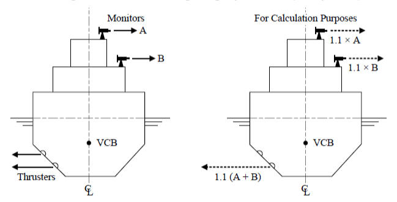
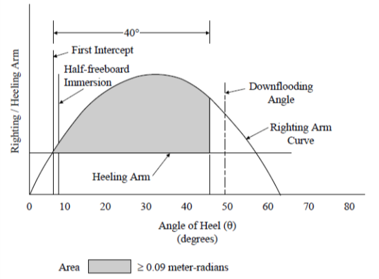

# Guidance for OSV (Offshore Support Vessels)

> RULES AND GUIDANCE FOR OFFSHORE STRUCTURES / GC-15-E / 2025 / EN / Guidance

## CHAPTER 8 FIRE FIGHTING VESSELS

### Section 1 General

#### 101. Application

- **1.** The requirements in this Chapter apply to vessels intended for unrestricted service which are primarily engaged in fire fighting operation on offshore installations. The following special items related to fire fighting operations are covered under the classification:
  - **(1)** Vessel’s fire fighting capabilities
  - **(2)** Vessel’s stability and its ability to maintain station while fire fighting monitors are in full operation
  - **(3)** The degree of vessel’s self-protection against external fires
- **2.** The vessels should comply with the requirements of this chapter in addition to **Ch 1** to **Ch 3**.

#### 102. Submission of Data

- **1.** In general, in addition to the plans listed in **Ch 2, Sec 2**, the following plans, calculations and particulars are to be submitted.
  - **(1)** Fire Fighting Plans and Data
    - **(A)** Fire-Fighting Equipment Plan, including locations of the fire pumps sea chests, fire pumps, fire mains, fire monitors, hydrants, hoses, nozzles, water-spray systems configuration, air compressor and firemen outfits.
    - **(B)** Technical details of fire pumps and monitors, including the capacity, range and water jet reaction of the monitors’, as well as water-spray system capacity data (when fitted).
    - **(C)** Details of high pressure air compressor required for filling cylinders of air breathing apparatus, including purity specifications.
    - **(D)** Foundations for fire-fighting pumps, their prime movers and the water monitors
    - **(E)** Sea chest arrangements for fire-fighting systems.
    - **(F)** Remote and local control arrangements for water monitors.
    - **(G)** For FFS1 only: Water-spray piping systems, including location of nozzles, pumps and valves, with system corrosion protection and draining arrangements.
    - **(H)** For FFS2 or FFS3: Details of foam generators and their capacity.
    - **(I)** For FFS3: Foam monitor arrangements, capacity and supports, including remote and local control arrangement for the foam monitors.
  - **(2)** Calculations
    The following calculations are to be submitted and documented.
    - **(A)** Calculations demonstrating the adequacy of the vessel’s stability during all fire fighting operations.
    - **(B)** Calculations demonstrating adequacy of water monitor supports during monitor operations.
    - **(C)** Calculations demonstrating adequacy of propulsion power required for the vessel to maintain station during fire fighting operations.
  - **(3)** Additional Data
    In addition to the submitted items required for classification, the following items are to be submitted.
    - **(A)** Data indicating that the vessel will be capable of carrying sufficient fuel oil for continuous fire fighting operation and propulsion operation with all fixed water monitors in use at the maximum required capacity for not less than:
      - **(a)** 24 hours: FFS1
      - **(b)** 96 hours: FFS2 or FFS3
    - **(B)** Verification that FFS3 will be capable of foam production from fixed foam monitors for at least 30 minutes of continuous operation.
    - **(C)** Verification that FFS2 or FFS3 will be capable of foam production from mobile generators for at least 30 minutes of continuous operation.
    - **(D)** Verification that the water monitor range, required by **Table 8.1**, is not less than:
      - **(a)** 120 meters : FFS1
      - **(b)** 150 meters : FFS2 or FFS3
    - **(E)** Verification that the vessel is in compliance with the minimum requirements of **Table 8.1**, with data on the vessel’s actual design capacities also recorded.

### Section 2 Stability

#### 201. General

- **1.** Intact stability are to be in accordance with this section in addition to **Ch 3, Sec 1.** However, for ships specifically approved by the Society, these requirements may be waived.
- **2.** Stability to be considered especially to the ships that have specially designated operations.

#### 202. Calculation on stability

In applying the requirements in **Ch 3, Sec 1**, the heeling lever resulting from designated operations is to be considered the one most unfavorable for stability.

#### 203. Intact Stability Requirements for Fire Fighting Operations

- **1.** **General**
  The intact stability of each vessel receiving a fire fighting notation is to be evaluated for the loading conditions indicated in **Ch 3, 102.** for compliance with the intact stability criteria in **2.**, and the results are to be submitted for review.
- **2.** **Intact Stability Criteria**
  - **(1)** Fire Fighting Operations
    Each vessel is to have adequate stability for all loading conditions, with all fire fighting monitors operating at maximum output multiplied by a factor of 1.1 in the direction most unfavorable to the stability of the vessel. The thruster(s) are to be considered operating at the power needed to counter-act that force. For the calculation purposes, the total thruster force should be vertically located at the location of the lowest available thruster (see **Fig. 8.1**).
    
    Fig. 8.1 Heeling Moments - Fire Fighting Operations
    The heeling moment due to the operation of all fire fighting monitors and thrusters is to be converted to a heeling arm, and superimposed on the righting arm curve of each loading condition. The first intercept must occur before half of the freeboard is submerged. The area of the residual stability (area between the righting arm and heeling arm curves beyond the angle of the first intercept) up to an angle of heel 40° beyond the angle of the first intercept; or the angle of downflooding if this angle is less than 40° beyond the angle of the first intercept, should not be less than 0.09 meter-radians (see **Fig. 8.2**).
    
    Fig. 8.2 Righting Arm and Heeling Arm Curves
- **3.** **Stability Guidance for the Master**
  The Master of the vessel should receive information in the Trim and Stability Booklet regarding cargo limitations, list of protected flooding openings that need to be kept closed, wind and/or wave restrictions, etc., necessary to ensure that the stability is in compliance with the criteria given in **2.**.
  If any loading condition requires water ballast for compliance with the criteria in **2.**, the quantity and disposition should be stated in the guidance to the Master.

### Section 3 Hull Structures

#### 301. General

Hull structures are to be in accordance with this section in addition to the requirements of **Ch 3, Sec 2.**

#### 302. Supporting structures of monitors for fire fighting

The supporting structures of the monitors for fire fighting are to be such to ensure sufficient strength to handle the reaction forces of water jets.

### Section 4 Fire fighting equipment for other vessels

#### 401. General

- **1.** Fire fighting vessels are to be fitted with fire fighting equipment for fighting fires on other vessels and fitted with suitable equipment to ensure the safety of their own ship during fire fighting operations in accordance with **Table 8.1**.
- **2.** The fuel oil tanks of fire fighting vessels are to be capable of carrying sufficient fuel oil for fire fighting operations with all fixed water monitors in use at maximum and continuous propulsion operation during the operation time specified in **Table 8.1**.

  | **Class Notation** | **FFS1** | **FFS2** |   |   | **FFS3** |   |
  | --- | --- | --- | --- | --- | --- | --- |
  | Total pump capacity(1) ($\mathrm{m}^3 / h$) | 2,400 | 7,200 |   |   | 9,600 |   |
  | Number of pumps(2) | 1 | 2 |   |   | 2 |   |
  | Number of water monitors | 2 | 2 | 3 | 4 | 3 | 4 |
  | Discharge rate per monitor ($\mathrm{m}^3 / h$)(3) | 1,200 | 3,600 | 2,400 | 1,800 | 3,200 | 2,400 |
  | Monitor range ($\mathrm{m}$) | 120 | 150 |   |   | 150 |   |
  | Height of water jets of monitors ($\mathrm{m}$)(4) | 45 | 70 |   |   | 70 |   |
  | Number of hose connections on each side of vessel | 4 | 8 |   |   | 10 |   |
  | Fixed water-spray system | 1 | - |   |   | - |   |
  | Mobile high expansion foam generators | - | 1 |   |   | 1 |   |
  | Fixed low expansion foam monitors | - | - |   |   | 2 |   |
  | Number of fire-fighter s outfits | 4 | 8 |   |   | 10 |   |
  | Fuel oil capacity (hours） | 24 | 96 |   |   | 96 |   |
  | Number of search lights | 2 | 2 |   |   | 2 |   |
  | (Notes) (1) It is recommended that fire pump suction velocity generally do not exceed 2 $\mathrm{m}/\sec$ and discharge piping to water monitors generally do not exceed 4m/sec operational velocity in order to assure adequate system capacity. (2) Pumps used for extinguishing fires onboard a vessel may be used for fighting fires on other vessels. (3) Provided that total discharge capacity of water monitors installed on FFS2 or FFS3 fire fighting vessels is equal to total pump capacity, the discharge rate per monitor may be less than that specified in the above Table. However, in all cases, the discharge rate per monitor of each monitor is to be more than 1,800 $\mathrm{m}^3 / h$. (4) The range of water jets is to be equal or more than 70m from the nearest part of the fire fighting vessel. The height of water jets from sea level is to be at least that specified in the above. |   |   |   |   |   |   |

#### 402. Water monitors

- **1.** Fire fighting vessels are to be fitted with water monitors having the capacity and quantity in accordance with **Table 8.1**.
- **2.** Water monitors are to comply with the following (1) to (6):
  - **(1)** Water monitors are to be located so as to allow for an unobstructed range of operation.
  - **(2)** The range and height of trajectory of monitor jets are to be not less than those specified in **Table 8.1** with all fixed water monitors in use simultaneously.
  - **(3)** Water monitors are to be capable of adequate adjustment in the vertical and horizontal directions.
  - **(4)** Means are to be provided for preventing monitor jets from impinging on ship structure and equipment.
  - **(5)** Water monitors are to be capable of being operated and maneuvered both locally and at a remote-control station. The monitor remote-control station is to have adequate overall operational visibility, including that of the water trajectory elevation, means of communication and protection from heat and water spray.
  - **(6)** Control systems are to be suitably protected from external damage. Electrical control systems are to be provided with overload and short circuit protection. Hydraulic or pneumatic monitor control systems are to be duplicated.

#### 403. Pumps and piping systems

- **1.** Pumps and piping systems used for fire-fighting water monitors are to be solely for fire fighting (including operating fire hose stations) and self-protecting water spray (if applicable).
- **2.** **Pumps**
  - **(1)** Each pump is to be provided with its own dedicated, independent sea suction.
  - **(2)** Where two or more pumps are provided, they are to have equal or near equal capacity. Minimum total pump capacity requirements are given in **Table 8.1**.
  - **(3)** Where the fire monitor pumps are used also for water supply to water spray system and/or fire hose stations, minimum total capacity of the pumps is to be sized to ensure sufficient water supply for all connected services to be performed simultaneously.
  - **(4)** A pump located above waterline is to be of self-priming type.
  - **(5)** Internal combustion engines for the fire fighting pumps are to comply with **Pt 5, Ch 2 of Rules for the Classification of Steel Ships.**
  - **(6)** Electric motors for the fire fighting pumps are to comply with **Pt 6, Ch 1 of Rules for the Classification of Steel Ships.**
  - **(7)** The fire fighting pumps are to comply with **Pt 5, Ch 6 of Rules for the Classification of Steel Ships.**
- **3.** **Piping systems**
  - **(1)** Piping systems are to be protected from overpressure. All piping is to be suitably protected from corrosion and freezing and capable of being thoroughly drained. Suction piping lines are to be designed to avoid cavitation in the water flow. Piping arrangements are to be such that those will prevent overheating at low pump delivery rates.
  - **(2)** Where pipes supplying water to the monitors are passing through the propulsion machinery spaces, they are to be led through the engine room casings and then externally to the superstructure and/or deckhouse, all the way to the monitors. The piping section between the pump and a deck or bulkhead’s exit is to be fully welded; flange connection is only permitted at the pump or the sea water discharge valve outlet.
  - **(3)** Piping systems used for water spray are to be independent from the system supplying water to the monitors, except that the same pumps may be used for both purposes. Where water supply to the fire hose connections is provided by the pumps for the water monitors, and/or water spray, isolation valves are to be fitted to separate the fire main system from the water monitors and/or water sprays systems and necessary pressure regulation means are to be provided so that the fire main system can be operated independently and/or simultaneously with the fire monitors and/or water spray system.

#### 404. Sea inlets for fire fighting and valve

- **1.** Sea chests for fire fighting operations are not to be used for services other than fire fighting operations or water spray devices.
- **2.** The sea inlets for fire fighting and sea chests are to be arranged as low as practical to avoid clogging due to debris or ice and oil intake from the sea surface.
- **3.** The location of sea inlets for fire fighting and sea chests is to be such that water suction is not impeded by ship motions or the water flow from propellers or thrusters.
- **4.** All openings in ship side for at sea chests are to be fitted with strainer plates and means for cleaning in accordance with **Pt 5, Ch 6, 302. of Rules for the Classification of Steel Ships.**
- **5.** Each sea inlet for fire fighting is to be provided with a shut off valve.
- **6.** Fire fighting pumps, the shut off valves mentioned above, and overboard discharge valves are to be operable from the same locations.
- **7.** The starting of fire fighting pumps in cases where shut off valves are closed is to be prevented by providing either interlock systems or by audible and visual alarms.

#### 405. Fire hoses and nozzles

- **1.** Fire fighting vessels are to be provided with hose connections on the weather deck of each side of the vessel, in accordance with **Table 8.1**.
- **2.** Hoses are to be not less than 38 $\mathrm{mm}$ or more than 65 $\mathrm{mm}$ in diameter, and are to be at least 15 $\mathrm{m}$ in length.
- **3.** Each nozzle is to be capable of producing a jet and spray.
- **4.** A water jet flow of at least 12 $\mathrm{m}$ is to be provided.

#### 406. Fixed water spray system (FFS1)

- **1.** **General requirements**
  - **(1)** FFS1 is to be provided with a permanently installed water-spray system.
  - **(2)** The water-spray system is to provide protection for all exposed decks and external vertical areas of the hull, superstructure and deckhouses, including water monitor foundations and equipment associated with the water monitors.
  - **(3)** All the water-spray system piping, valves and nozzles are to be suitably protected from damage during fire fighting operations.
- **2.** **System Capacity**
  - **(1)** The minimum capacity of the water-spray system is to be in accordance with **Table 8.2** for the total protected area.
  - **(2)** Necessary visibility of water-spray operations from the navigating bridge and from the monitor’s remote-control station is to be provided.
  - **(3)** For vessels which are fitted with a dynamic positioning system which is at least capable of automatically maintaining the position and heading of the vessel under specified maximum environmental conditions having an independent centralized manual position control with automatic heading control, the minimum capacity of the water spray system may be based on the maximum areas which may be exposed to the fire, provided the water-spray system is divided into zones so that those areas which are not exposed to radiant heat can be isolated.
  - **(4)** The controls are to be located in a dedicated, readily accessible and safe location

    | **Location to be Protected** | **Minimum Water Capacity L / minute / m^2** |
    | --- | --- |
    | Un-insulated steel (vertical areas) | 10 |
    | Un-insulated steel (horizontal areas) | 5 |
    | Wood sheathed steel decks | 10 |
    | Steel boundaries internally insulated to Class A-60 (1) | 5 |
    | (Notes) (1) Applicable for outside vertical areas only. No requirements for exposed deck insulated by A-60. |   |
- **3.** **Spray System Pumps**
  - **(1)** Spray system pumping capacity is to be sufficient to insure a supply pressure and volume for adequate operation of the water-spray system.
  - **(2)** If the water monitor pumps are used, they are to be provided with sufficient capacity to provide pressure and volume for both the water monitors and the water-spray systems.
- **4.** **Protections**
  - **(1)** Water-spray systems are to be protected from corrosion.
  - **(2)** Drainage arrangements are to be provided to protect against freezing water damage.
  - **(3)** Deck scuppers and freeing ports are to be provided to assure efficient drainage of water from deck surfaces when the water-spray system is in operation.

#### 407. Foam generator (FFS2 and FFS3)

- **1.** FFS2 and FFS3 are to have mobile, high expansion foam generators for fire-fighting of minimum capacity 100 m^3/min.
- **2.** Total volume of foam forming liquid carried onboard the vessel is to provide of at least 30 minutes foam production.
- **3.** On FFS3, this foam generator requirement is in addition to the fixed foam monitor system requirement in **508.**

#### 408. Foam Monitor System (FFS3)

- **1.** **General**
  - **(1)** FFS3 is to have two fixed, low expansion foam monitors in addition to the required water monitors.
  - **(2)** Each foam monitor is to have a minimum capacity of 5000 L/min with a foam expansion ratio of 15 to 1 and is to be capable for a height of throw of 50 m above the sea level, with both foam monitors in simultaneous operation at maximum foam output.
  - **(3)** The foam concentration tank is to have a minimum capacity for 30 minutes foam production at an assumed admixture of 5 percent.
- **2.** **Arrangements**
  - **(1)** The foam monitor system is to be of a fixed design with separate foam concentration tank, foam mixing unit and pipelines to the foam monitors.
  - **(2)** The water supply may be taken from the water monitor pumps. Means to reduce supply water pressure may be required to assure correct water pressure for maximum foam generation.
- **3.** **Control**
  - **(1)** The fixed foam monitors are to have both local (manual) and remote control.
  - **(2)** The remote control of the foam monitors is to be located at the remote-control station for the water monitors and is to include remote control of water and foam concentrate.

#### 409. Fireman's outfit

- **1.** FFS1, FFS2 and FFS3 are to have the minimum number of fireman’s outfits as indicated in **Table 8.1.**
- **2.** Each fire-fighter's outfits is to be comply with **Pt 8, Ch 8, 901.** of **Rules for the Classification of Steel Ships**.
- **3.** At least one set of fully charged spare air bottles is to be provided for each apparatus for fireman’s outfit.
- **4.** An air compressor or equivalent capable of fully recharging all breathing air bottles for the fireman’s outfit with air free from contamination within 30 minutes is to be provided.
- **5.** Information on the fireman’s outfit is to be displayed near the storage area for the user.

#### 410. Searchlights

- **1.** Two searchlights are to be provided on all fire fighting vessels to facilitate effective fire fighting operations at night.
- **2.** The searchlights are to be capable of providing an effective horizontal and vertical range of coverage and are to provide an illumination to a distance of 250 m in clear air at a minimum level of illumination of 50 lux within an area of not less than 11 m diameter.

### Section 5 Machinery

#### 501. General

Machinery installations of the ship are to be in accordance with this section in addition to the requirements of **Ch 3, Sec 4.**

#### 502. Propulsion machinery

- **1.** Propulsion machinery is to have sufficient power to secure stable maneuverability during fire fighting operations.
- **2.** Propulsion machinery is to be able to maintain ship position in still water as well as the capacity of water monitors during fire fighting operations at not more than 80% of the propulsion force in any direction.
- **3.** **Control systems**
  Control systems are to be provided with the following functions to prevent complete loss of power due to power overloads:
  - **(1)** Alarm devices which give alarms in cases where propulsion power exceeds 80 % during fire fighting operations.
  - **(2)** Means which reduce the speed

### Section 6 Fire Protection and Fire Extinguishing Systems

#### 601. General

Fire protection, means of escape and fire extinguishing systems are to be in accordance with this section in addition to the requirements in **Ch 3, Sec 6.**

#### 602. Fire protection

- **1.** **FFS1**
  All exterior boundaries of FFS1, including exposed bulkheads, exposed decks and the hull above the lightest operating waterline are to be of steel structures and protected by a fixed water-spray system, in accordance with **406**.
- **2.** **FFS2 and FFS3**
  - **(1)** Generally, all exterior boundaries of FFS2 and FFS3 are to be of steel but need not be protected by a fixed water-spray system nor internally insulated.
  - **(2)** Special consideration will be given to the boundaries to be constructed of materials other than steel. Details of the materials and of the protection which may be required to be provided are to be submitted to Society for review.

#### 603. Windows

On FFS2 and FFS3, which are not provided with water-spray systems, steel deadlights or shutters are to be provided on all windows and port lights, except in the navigation bridge.

### Section 7 Positioning Systems

#### 701. Thrusters and Propulsion Machinery

The vessel is to have thrusters and propulsion machinery of sufficient power for maneuverability during fire fighting operations and as follows.

#### 702. Positioning

Thrusters and the vessel’s propulsion machinery are to be able to maintain the vessel on position in still water during all combinations of operation and capacity of the water monitors, at not more than 80 percent of available propulsion force in any direction.

#### 703. Control

Adequate operating control systems are to be provided for fire-fighting operations which are to include an alarm condition at 80 percent of available propulsion power and automatic reduction of power action at 100 percent available propulsion power to prevent sudden or complete loss of power due to power overload. Calculations are to be submitted verifying that an equilibrium state between the reaction force from the water monitors and the force from the vessel's propulsion machinery and its side thrusters (at the most unfavorable combination) is at or less than 80 percent of the available propulsion power. This is to confirm that the vessel would maintain its position without setting off the 80 percent alarm condition. 
