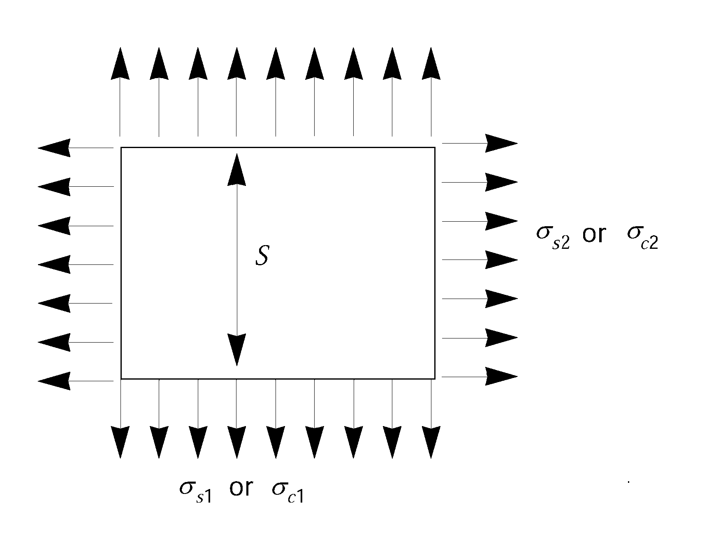

# Rules and Guidance for the Classification of Mobile Offshore Units

> RULES AND GUIDANCE FOR OFFSHORE STRUCTURES / RB-01-E / 2025 / EN / Rules

## CHAPTER 4 DESIGN CONDITION

### Section 1 Design Loads

#### 101. Loads

- **1.** In regard to loads in determining the scantlings of structural members and in calculating mooring forces for the units, unless otherwise specified elsewhere, the following loads are to be taken into account, where applicable.
  - **(1)** Deck loads
  - **(2)** Static loads such as water pressure in still water, buoyancy, dead load, etc.
  - **(3)** Wind loads
  - **(4)** Wave loads
  - **(5)** Loads caused by tide and current
  - **(6)** Loads caused by floating ice
  - **(7)** Loads caused by snow and ice accumulation
  - **(8)** Loads caused by earthquake in the case of bottoming-type units
  - **(9)** Impact loads caused when touching sea bed
  - **(10)** Loads caused by mooring
  - **(11)** Loads caused by mooring of tenders
  - **(12)** Loads caused by towing
  - **(13)** Loads caused by operation
  - **(14)** Loads due to helicopter landing
  - **(15)** Loads due to increase of resistance by marine growth
  - **(16)** Other loads considered necessary by the Society
- **2.** The modes of operation for each unit are to be investigated using realistic loading conditions including gravity loading with relevant environmental loading for its intended areas of operation. The following environmental considerations should be included where applicable: wind, wave, current, ice, seabed conditions, temperature, fouling and earthquake.
- **3.** Drawings of a unit are to be approved for the specified environmental conditions. Where possible, the above design environmental conditions apply to units and structural members should be based upon significant data with a period of recurrence of at least 50 years for the most severe anticipated environment.
- **4.** If a unit is restricted to seasonal operations in order to avoid excessive wind and wave, such seasonal limitations must be specified.

#### 102. Wind loads

- **1.** The design wind velocity used in determining the wind loads may be specified by the Owner, but is not to be less than 25.8 $\mathrm{m}/\sec$ (50 knots). However, the design wind velocity for the units intended for unrestricted services and operating sea areas is not to be less than 36 $\mathrm{m}/\sec$ (70 knots) for the operating condition and not to be less than 51.5 $\mathrm{m}/\sec$ (100 knots) for the severe storm condition, specified in **Ch 1, 207.**, respectively.
- **2.** The wind pressure $P$ is to be obtained from the following formula. The wind pressure, however, may be determined from the wind tunnel test considered appropriate by the Society.
  $P=0.5C _{h} C _{s} pV ^{2} \times 10 ^{-3} \mathrm{kN/m ^{2} }$
  $V$ : Design wind velocity specified in **Par 1** ($\mathrm{m}/\sec$).
  $P$ : Air mass density (1.222 $\mathrm{kg}/m ^{3}$)
  $C_h$ : Height coefficient given by **Table 4.1** depending on the vertical height in metres at the location under consideration, where the vertical height is a vertical distance from sea surface to the geometric centre of the projected area A specified in the following **Par 3.**
  $C_s$ : Shape coefficient given by **Table 4.2** depending on the shape of structural members.

  **Table 4.1 Height Coefficient** $C_h$

  | Height ($\mathrm{m}$) |   | $C_h$ |
  | --- | --- | --- |
  | Over | Not Exceeding |   |
  | 15.3 30.5 46.0 61.0 76.0 91.5 106.5 122.0 137.0 152.5 167.5 183.0 198.0 213.5 228.5 244.0 259.0 | 15.3 30.5 46.0 61.0 76.0 91.5 106.5 122.0 137.0 152.5 167.5 183.0 198.0 213.5 228.5 244.0 259.0 | 1.00 1.10 1.20 1.30 1.37 1.43 1.48 1.52 1.56 1.60 1.63 1.67 1.70 1.72 1.75 1.77 1.79 1.80 |

  **Table 4.2 Shape Coefficient** $C_s$

  | Shape | $C_s$ |
  | --- | --- |
  | Spherical | 0.4 |
  | Cylindrical | 0.5 |
  | Large flat surface (hull, deckhouse, smooth under-deck areas) | 1.0 |
  | Drilling derrick | 1.25 |
  | Wires | 1.2 |
  | Exposed beams and girders under deck | 1.3 |
  | Small parts | 1.4 |
  | Isolated shapes (crane, beam, etc.) | 1.5 |
  | Clustered deckhouses or similar structures | 1.1 |
- **3.** The wind load $F$ is not to be less than obtained from the following formula with regard to each structural member of the unit. In addition, the resultant force and its acting point are to be determined for each wind direction. However, the wind force may be determined from the wind tunnel test considered appropriate by the Society.
  $F=P \times A \mathrm{kN}$
  $P$ : Wind pressure specified in **Par 2** ($\mathrm{kN}/m ^{2}$).
  $A$ : Projected area of all exposed structural members on a plane perpendicular to each wind direction in the upright condition or, if necessary, in the heeling condition ($\mathrm{m} ^{2}$). In determining the projected area, the following requirements are to be applied.
  - **(1)** In the case of units with columns, the projected areas of all columns should be included. For self-elevating units, the projected areas of all legs or columns are to be included. Where, however, the legs are of open truss work which does not block wind passage, the above mentioned projected areas may be determined according to the requirements in (3).
  - **(2)** The projected areas of deckhouses, other structural members, cranes, etc. are to be separately calculated. Where, however, two or more structures such as deckhouses and the like are closely located, they may be considered as one block and their projected areas may be considered as a projected block area perpendicular to each wind direction. In this case, the shape coefficient $C_s$ is to be taken as 1.1.
  - **(3)** The projected areas in case where derrick towers, booms, masts, etc. are of open truss work may be taken as 60 % of the projected block areas perpendicular to each wind direction assuming that they are not of open truss work.
  - **(4)** Areas exposed due to heel, should be included using the appropriate shape coefficients.

#### 103. Wave loads

- **1.** The design wave height to be used for wave load calculation may be specified by the Owner under the approval of the Society.
- **2.** The design wave period to be used for wave load calculation is to be the period which gives the maximum effect to the unit.
- **3.** If necessary, the velocities of current and tide are to be added vectorially to the wave particle velocity.
- **4.** In calculating wind loads, the following requirements are to be applied.
  - **(1)** The wave loads are to be calculated, based on acceptable wave theories appropriate to the design depth of water at the operation area subject to the approval by the Society. The wave loads, however, may be determined from the tank test approved by the Society on a model of the unit.
  - **(2)** Waves from all directions are to be considered on the unit.
  - **(3)** The wave loads produced by shipping water on the deck(Green water load), the loads acting directly on the immersed elements of the unit and the loads resulting from heeled positions or accelerations due to its motion are also to be considered. *(2021)*
  - **(4)** The vibration induced by waves is also to be considered.

#### 104. Current loads

Consideration is to be given to the possible superposition of current and waves. In this case where this superposition is deemed necessary, the current velocity is to be added vectorially to the wave particle velocity and the resultant velocity is to be used to compute the total force.

#### 105. Loads due to vortex shedding

The flutters of immersed structural members due to vortex shedding are also to be considered.

#### 106. Deck loads

For deck loads, uniform and concentrated loads on the respective portions of the deck in each mode of operation and transit condition are to be taken into account. The values of the uniform loads, however, are not to be less than given in **Table 4.3.**

**Table 4.3 Deck Loads**

| Kind of deck | Minimum load ($\mathrm{kN}/m ^{2}$) |
| --- | --- |
| Helicopter deck | 2 |
| Accommodation spaces (including corridors and similar spaces) | 4.5 |
| Work areas and machinery spaces | 9 |
| Storage areas | 13 |

### Section 2 Calculation of Strength

#### 201. Structural analysis

The unit is to be analysed by the method deemed appropriate by the Society for a sufficient number of conditions including all conditions specified in **Ch 1, 107.**

#### 202. Analysis of units resting on the sea bed

Units designed to rest on the sea bed are to be analysed assuming the overturning moment due to the combined environmental forces from any direction and the sufficient downward gravity loadings on the support footings or mat to withstand the moment.

#### 203. Plastic analysis

Scantlings of structural members designed on the basis of plastic analysis are to be at the discretion of the Society.

#### 204. Buckling strength

Structural members subject to in-plane loads are to have the sufficient strength against buckling in consideration of their shapes, scantlings, boundary conditions, etc.

#### 205. Fatigue strength

- **1.** The possibility of fatigue damage due to cyclic loading should be considered in the design of self-elevating and column-stabilized units.
- **2.** The area anticipated stress concentration is to be considered to fatigue strength, the fatigue analysis is to be based on the intended mode and area of operations to be considered in the unit's design.
- **3.** The fatigue life is to be based on a period of time equal to the specified design life of the unit. The period is normally not to be taken as less than 20 years.

#### 206. Stress concentration

- **1.** The effect of local stress concentrations is to be considered for notches in members or discontinuous parts of structure.
- **2.** Where the tensile stresses acting on the thickness direction of plating, plate material with suitable through-thickness properties is required in accordance with **Pt 2, Ch 1** of **Rules for the Classification of Steel Ships**.

#### 207. Bending stress

- **1.** When calculating bending stresses of structural members, the effective width of the plate is to be determined in accordance with the requirements in **Pt 3, Ch 1, 602.** of **Rules for the Classification of Steel Ships**.
- **2.** Where subjected to eccentric loadings, an increase of bending stress due to the deflections of the structural members is to be taken into account.

#### 208. Shearing stress

When calculating shearing stresses in bulkheads, plate girder webs, hull side plating, etc., only the effective shear area of web is to be considered as being effective. In this regard, the total depth of the girder may be considered as the web depth.

#### 209. Combination of stresses

- **1.** In obtaining respective local stresses of the structural members, all the stress components concerned are to be summed up. In this case, for tubular members, the effect of circumferential stress due to external pressure is to be considered.
- **2.** The scantlings are to be determined on the basis of criteria which combine, in a rational manner deemed appropriate by the Society, the individual stress components acting on the respective structural members.(See **210.**)

#### 210. Equivalent stress

- **1.** For plate structures, members may be designed according to the equivalent stress criterion, where the equivalent stress is obtained from the following formula.
  $\sqrt { \sigma_x^2 + \sigma_y^2 - \sigma_x \sigma_y + 3 \tau_xy^2}$
  $\sigma_x$, $\sigma_y$ : Stress in the $x$- and $y$-directions at the centre of thickness of the plate, respectively ($\mathrm{N}/mm ^{2}$).
  $\tau_xy$ : Shearing stress in the $x-y$ plane($\mathrm{N}/mm ^{2}$).
- **2.** The equivalent stress specified in **Par 1** is not to exceed 0.7 and 0.9 times the yield strength of the material, for the static loading and combined loading condition specified in **301.**, respectively.

#### 211. Corrosion allowance

- **1.** In case where the unit is fitted with a corrosion protection system deemed appropriate by the Society, with regard to the corrosion allowance specified in **Par 2,** reduction may be made as deemed adequate by the Society.
- **2.** Where the unit is not fitted with a corrosion protection system deemed appropriate by the Society, the scantlings determined by the analysing method specified in **Sec 2** in conjunction with the allowable stresses specified in **Sec 3** are to be added by a proper corrosion allowance. In this case, the corrosion allowance is, as a rule, not to be less than 2.5 $\mathrm{mm}$ and is to be determined considering the environmental condition, the means and degree of corrosion protection specified in **Ch 3, Sec 5** and the process of its maintenance. And further, where the requirements in **Rules for the Classification of Steel Ships** or **Rules for the Classification of Steel Barges** are applied, the scantlings are not to be less than those specified in the relevant requirements.

### Section 3 Analysis of Overall Strength

#### 301. Loading conditions

Analysis of overall strength is to be performed for the static loading and combined loading specified in the following (1) and (2) in the respective modes of operation specified in **Ch 1, 107.**

#### 302. Allowable stresses

Allowable stresses for static loading and combined loading specified in **301.** are not to exceed the values in **Table 4.4** according to the kind of stress.

**Table 4.4 Allowable Stresses for Static Loading and Combined Loading**

| Kind of stress | Static loading | Combined loading |
| --- | --- | --- |
| Tensile | 0.6 × $\sigma_y$ | 0.8 × $\sigma_y$ |
| Bending | 0.6 × ($\sigma_y$ or $\sigma_cr$***) | 0.8 × ($\sigma_y$ or $\sigma_cr$***) |
| Shearing | 0.4 × $\sigma_y$ or 0.6 × $\tau_cr$* | 0.53 × $\sigma_y$ or 0.8 × $\tau_cr$* |
| Compressive | 0.6 × ($\sigma_y$ or $\sigma_cr$ ***) | 0.8 × ($\sigma_y$ or $\sigma_cr$ *) |
| * : Whichever is the smaller $\sigma_y$ : Specified minimum yield stress of the material ($\mathrm{N}/mm ^{2}$). $\sigma_cr$ : Critical compressive buckling stress ($\mathrm{N}/mm ^{2}$). $\tau_cr$ : Critical shear buckling stress($\mathrm{N}/mm ^{2}$). |   |   |

#### 303. Combined compressive stress

In addition to **302.**, when structural members are subjected to axial compression or combined axial compression and bending, the extreme fibre stresses shall comply with the following requirement:
$f_\frac{a}{F_a} + f_\frac{b}{F_b} \leq 1.0$
$f_a$ : Calculated compressive stress due to axial force($\mathrm{N}/mm ^{2}$).
$f_b$ : Calculated compressive stress due to bending ($\mathrm{N}/mm ^{2}$).
$F_b$ : Allowable compressive stress due to bending prescribed in **Table 4.4** ($\mathrm{N}/mm ^{2}$).
$F_a$ : Allowable axial compressive stress obtained from the following formula, but is not to exceed $F_b$ ($\mathrm{N}/mm ^{2}$)
$F_a = \eta \times \sigma_cr,i \times (1 - 0.13 \times \lambda/\lambda_0 )$...................... $\lambda < \lambda_0$
$= \eta \times \sigma_cr,e \times 0.87$ ....................................... $\lambda \geq \lambda_0$
$\lambda = kl/r$
$\lambda _{0} = \sqrt {2 \pi ^{2} \mathrm{E} / \sigma _{y}}$
$\sigma_y$ : As specified in **302.** ($\mathrm{N}/mm ^{2}$).
$\sigma_cr,i$ : Inelastic column critical buckling stress ($\mathrm{N}/mm ^{2}$).
$\sigma_cr,e$ : Elastic column critical buckling stress ($\mathrm{N}/mm ^{2}$).
$\eta$ = 0.6 for static loading
= 0.8 for combined loading
$kl$ = effective unsupported length
$r$ = governing radius of gyration associated with $kl$
$\mathrm{E}$ = modulus of elasticity of the material

### Section 4 Scantlings of Structural Members

#### 401. General

- **1.** For the primary structural members which contribute to the overall strength, the scantlings are to be determined in accordance with the requirements in **Sec 2** and **3.** However, the requirements in **402.** and **403.** may be applied.
- **2.** For the structural members subjected to local loads only, the requirements in **Rules for the Classification of Steel Ships** may be applied under the approval of the Society.

#### 402. Thickness of plating of hull structure

The thickness of plating of the primary hull structure such as shell plating which contributes to the overall strength, subjected to distributed loads, is not to be less than obtained from the following formulae, whichever is the greater.
$75.2S \sqrt {\frac{h _{s}}{K _{e}}} +C \mathrm{mm}$*,* $60.8S \sqrt {\frac{h _{c}}{K _{p}}} +C \mathrm{mm}$
$S$ : Spacing of transverse or longitudinal frames($\mathrm{m}$).
$h_s$ : Head of water in static loading specified in **301.**($\mathrm{m}$).
$h_c$ : Head of water in combined loading specified in **301.**($\mathrm{m}$).
$K_e$ : As given by the following formulae, whichever is the smaller.
$\frac{235 - k \sigma_s1}{k} , 1.45 left( \frac{235 - k \sigma_s2}{k} right)$
$K_p$ : As given in (a) or (b) below.
$\frac{5750-k ^{2} \sigma _{c1} ^{2}}{235k} , 2 \left( \frac{235-k \left| \sigma _{c2} \right|}{k} \right)$
$\frac{5750-k ^{2} \sigma _{c1} ^{2}}{235k} , 2 \left( \frac{235-k \left| \sigma _{c1} \right| -k \left| \sigma _{c2} \right|}{k} \right)$
$\sigma_s1$, $\sigma_s2$ and $\sigma_c1$, $\sigma_c2$ : Axial stresses acting on the plating in static loading and combined loading, respectively ($\mathrm{N}/mm ^{2}$). (See **Fig 4.1**)
$k$ : Material factor, as given in the following.
Mild steels ----------------------- 1.00
High tensile steels
*A 32*, *DH 32*, *EH 32* -------- 0.78
*AH 36*, *DH 36*, *EH 36* -------- 0.72
For other high tensile steels, the value of k is to be dedicated at the discretion of the Society.
$C$ : Corrosion allowance specified in **211.**

Fig 4.1 Axial stress #eqnID-173, #eqnID-174, #eqnID-175, #eqnID-176

#### 403. Section modulus of transverse or longitudinal frames

The section modulus of transverse or longitudinal frames which support the panels prescribed in **402.** is to be obtained from the following formula.
$1079C \left( \frac{kSh _{c} l ^{2}}{235-k \sigma _{c0}} \right) \mathrm{cm ^{3} }$
$C$ : Coefficient given below.

- **1.** 0 for both ends fixed
- **1.** 5 for both ends simply supported
  $l$ : Span of frames ($\mathrm{m}$).
  $\sigma_c0$ : Axial stress in combined loading ($\mathrm{N}/mm ^{2}$).
  $S$, $h_c$, $k$ : As specified in **402.**

#### 404. Local buckling of cylindrical shells

Unstiffened or ring-stiffened cylindrical shells subjected to axial compression or compression due to bending, and having proportions which satisfy the following relationship are to be checked for local buckling in addition to the overall buckling as specified in **303.**
$D / t>E/9 \sigma _{y}$
$D$ : Diameter of cylindrical shell
$t$ : Thickness of shell plating
($D$ and $t$ expressed in the same units*.*)
$\sigma_y$ : Specified minimum yield stress of the material
$\mathrm{E}$ : Modulus of elasticity of the material
($\sigma_y$ and $\mathrm{E}$ expressed in the same unit system*.*)

### Section 5 Helicopter Deck

#### 501. Design loads

Plans showing the arrangement, scantlings and details of the helicopter deck are to be submitted. The arrangement plan is to show the overall size of the helicopter deck and the designated landing area. The design load in determining the scantlings of the members of helicopter deck is to be in accordance with following (1) to (3).

#### 502. Allowable stresses

Allowable stresses of the structural members of the helicopter deck are not to exceed the values in **Table 4.5** in association with the design loads prescribed in **501.**

**Table 4.5 Allowable Stresses**

| Structural members Design loads | Deck plating | Deck beams | Girders, stanchions, truss supports, etc. |
| --- | --- | --- | --- |
| Helicopter landing impact load | * | $\sigma_y$ | 0.9 × $\sigma_y^{'}$ |
| Stowed helicopter load | $\sigma_y$ | 0.9 × $\sigma_y$ | 0.8 × $\sigma_y^{'}$ |
| Overall distributed load | 0.6 × $\sigma_y$ | 0.6 × $\sigma_y$ | 0.6 × $\sigma_y^{'}$ |
| * : At the discretion of the Society. $\sigma_y$ : As specified in **302.** ($\mathrm{N}/mm ^{2}$). $\sigma_y^{'}$ : For members subjected to axial compression, $\sigma_y$ or critical buckling stress, whichever is the smaller($\mathrm{N}/mm ^{2}$). |   |   |   |

#### 503. Minimum thickness

The minimum thickness of helicopter deck plating is not to be less than 6 $\mathrm{mm}$.

#### 504. Landing appliances other than wheels

In case where a helicopter is provided with any other landing appliances other than wheels, the design loads are to be at the discretion of the Society.

#### 505. Loadings on helicopter deck

Wind loadings and possible wave impact loadings on helicopter decks are to be considered. Where in this case, those loadings are in accordance with the discretion of the Society.

### Section 6 Position Keeping Systems and Components

#### 601. General

Units provided with position keeping systems equipment in accordance with this Section may have a Additional Installation Notation, "PKS" after the class notation.

#### 602. Anchoring systems

- **1.** **General**
  Plans showing the arrangement and completed details of the anchoring system, including anchors, shackles, anchor lines consisting of chain, wire or rope, together with details of fairleads, windlasses, winches, and any other components of the anchoring system and their foundations are to be submitted to the Society.
- **2.** **Design**
  - **(1)** An analysis of the anchoring arrangements expected to be utilized in the unit's operation is to be submitted to the Society. Among the items to be addressed are:
    - **(A)** Design environmental conditions of waves, winds, currents, tides and ranges of water depth
    - **(B)** Air and sea temperature
    - **(C)** Ice condition (if applicable)
    - **(D)** Description of analysis methodology
  - **(2)** The anchoring system should be designed so that a sudden failure of any single anchor line will not cause progressive failure of remaining lines in the anchoring arrangement.
  - **(3)** Anchoring system components should be designed utilizing adequate factors of safety and a design methodology suitable to identify the most severe loading condition for each component. In particular, sufficient numbers of heading angles together with the most severe combination of wind, current and wave are to be considered, usually from the same direction, to determine the maximum tension in each mooring line. When a particular site is being considered, any applicable cross sea conditions are also to be considered in the event that they might induce higher mooring loads.
    For relatively deep water, the effect from damping and inertia forces in the anchor lines is to be considered in the analysis. The effects of slowly varying motions are to be included when the magnitudes of such motions are considered to be significant.

    | Design Condition |   | Anchor Line FOS |   |
    | --- | --- | --- | --- |
    | Design Condition |   | Quasi Static | Dynamic Analysis |
    | Operating | Intact | 2.70 | 2.25 |
    | Operating | Damaged | 1.80 | 1.57 |
    | Operating | Transient | 1.40 | 1.22 |
    | Severe Storm | Intact | 2.00 | 1.67 |
    | Severe Storm | Damaged | 1.43 | 1.25 |
    | Severe Storm | Transient | 1.18 | 1.05 |
    | where, $FOS =PB / T _{\max}$ $PB$ = maximum rated breaking load of the weakest component of the anchor line. $T _{\max}$ = maximum anchor line tension calculated in accordance with (A) or Section 5.1.3.2 of API RP 2SK for each of the following design conditions. (a) Operating Intact: $T _{\max}$ determined under the most severe design environmental conditions for normal operations specified by the Owner or designer with all anchor lines intact. (b) Operating Damaged: $T _{\max}$, under the operating environmental conditions specified above, but assuming the sudden failure of any one anchor line, after reaching a steady-state condition. (c) Operating Transient: $T _{\max}$, under the operating environmental conditions specified above, due to transient motions resulting from the sudden failure of any one anchor line. (d) Severe Storm Intact: $T _{\max}$ determined under the most severe design environmental conditions for severe storm specified by the Owner or designer with all anchor lines intact. (e) Severe Storm Damaged: $T _{\max}$, under the severe storm environmental conditions specified above, but assuming the sudden failure of any one anchor line, after reaching a steady-state condition. (f) Severe Storm Transient: $T _{\max}$, under the severe storm environmental conditions specified above, due to transient motions resulting from the sudden failure of any one anchor line. |   |   |   |

    The defined 'Operating' and 'Severe Storm' are to be the same as those identified for the design of the unit, unless the Society is satisfied that lesser conditions may be applicable to specific sites.
    In the consideration of column-stabilized units, the value of $C _{s}$ and $C _{h}$, as indicated in **Ch 4, 102. 2**, may be introduced in the analysis for position keeping mooring systems. The intent of **Ch 7, 203.**(Wind tunnel test) and of **Ch 7, 204.**(Other stability requirements) may also be considered by the Society.
    - **(A)** When the Quasi Static Method is applied, the tension in each anchor line is to be calculated at the maximum excursion for each design condition defined in (B) below, combining the following steady state and dynamic responses of the Unit:
      - **(a)** steady mean offset due to the defined wind, current, and steady wave forces
      - **(b)** most probable maximum wave induced motions of the moored unit due to wave excitation
    - **(B)** Factors of safety (FOS) are dependent on the design conditions of the system (intact, damaged, or transient), as well as the level of analyses (Quasi static or dynamic analysis). The minimum Quasi Static FOS, specified in the table below, at the maximum excursion of the unit for a range of headings should be satisfied if the quasi static method outlined in (A) is applied. Otherwise, the minimum Dynamic Analysis FOS in the table below should be satisfied, including the effects of line dynamics when these effects are considered significant.
    - **(C)** In general, the maximum wave induced motions of the moored unit about the steady mean offset should be obtained by means of model tests. The Society may accept analytical calculations provided that the proposed method is based on a sound methodology which has been validated by model tests.
    - **(D)** The Society may accept different analysis methodologies provided that it is satisfied that a level of safety equivalent to the one obtained by (A) and (B) above.
    - **(E)** The Society may give special consideration to an arrangement where the anchoring systems are used in conjunction with thrusters to maintain the unit on station.

#### 603. Equipment

- **1.** **Windlass**
  - **(1)** The design of the windlass is to provide for adequate dynamic braking capacity to control normal combinations of loads from the anchor, anchor line and anchor handling vessel during the deployment of the anchors at the maximum design payout speed of the windlass. The attachment of the windlass to the hull structure is to be designed to withstand the breaking strength of the anchor line.
  - **(2)** Each windlass is to be provided with two independent power operated brakes and each brake is to be capable of holding against a static load in the anchor lines of at least 50 percent of its breaking strength. Where the Society so allows, one of the brakes may be replaced by a manually operated brake.
  - **(3)** On loss of power to the windlasses, the power operated braking system should be automatically applied and be capable of holding against 50 percent of the total static braking capacity of the windlass.
- **2.** **Fairleads and sheaves**
  - **(1)** Fairleads and sheaves should be designed to prevent excessive bending and wear of the anchor lines. The attachments to the hull or structure are to be such as to withstand the stresses imposed when an anchor line is loaded to its breaking strength.

#### 604. Anchor line

- **1.** The Society is to be ensured that the anchor lines are of a type that will satisfy the design conditions of the anchoring system.
- **2.** Means are to be provided to enable the anchor lines to be released from the unit after loss of main power.
- **3.** Means are to be provided for measuring anchor line tensions.
- **4.** Anchor lines are to be of adequate length to prevent uplift of the anchors under the maximum design condition for the anticipated area(s) of operation. However, only steady wind, wave and current forces need to be applied in evaluating anchor uplift forces in transient conditions.

#### 605. Anchors

- **1.** Type and design of anchors are to be to the satisfaction of the Society.
- **2.** All anchors are to be stowed to prevent movement during transit.

#### 606. Quality control

- **1.** Details of the quality control of the manufacturing process of the individual anchoring system components are to be submitted. Components should be designed, manufactured and tested in accordance with recognized standards insofar as possible and practical. Equipment so tested should, insofar as practical, be legibly and permanently marked with the Society's stamp and delivered with documentation which records the results of the tests.

#### 607. Control stations

- **1.** A manned control station is to be provided with means to indicate anchor line tensions at the individual windlass control positions and to indicate wind speed and direction.
- **2.** Reliable means are to be provided to communicate between locations critical to the anchoring operation.
- **3.** Means are to be provided at the individual windlass control positions to monitor anchor line tension, windlass power load and to indicate amount of anchor line payed out.

#### 608. Dynamic positioning systems

- **1.** Thrusters used as a sloe means of position keeping should provided a level of safety equivalent to that provided for anchoring arrangements to the satisfaction of the Society. 
