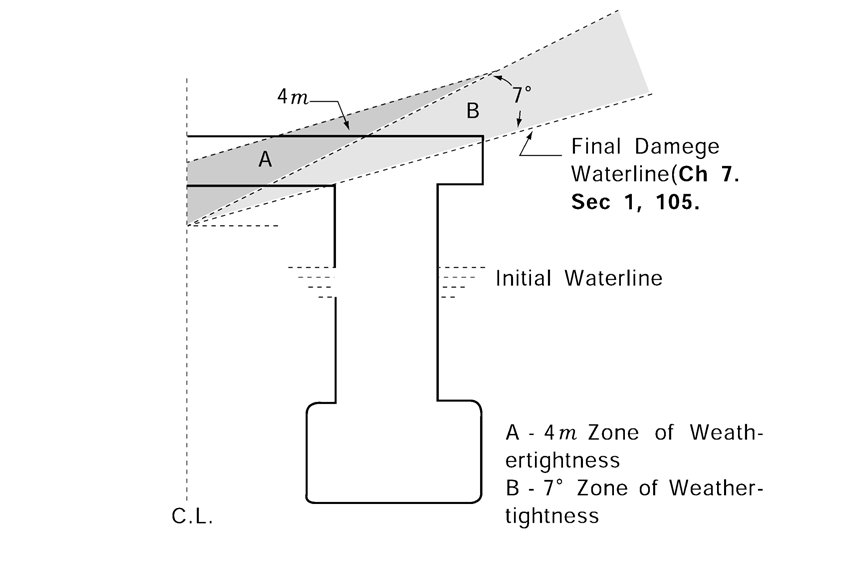

# Rules and Guidance for the Classification of Mobile Offshore Units

> RULES AND GUIDANCE FOR OFFSHORE STRUCTURES / RB-01-E / 2025 / EN / Rules

## CHAPTER 6 WATERTIGHT INTEGRITY

### Section 1 Watertight Bulkheads

#### 101. General

- **1.** All units are to be provided with watertight bulkheads in accordance with the requirements in **Pt 3, Ch 14** of **Rules for the Classification of Steel Ships** and **Ch 14** of **Rules for the Classification of Steel Barges**. In the case of column-stabilized units, the scantlings of watertight flats and bulkheads are to be made of effective to that point necessary to meet the requirements of damage stability.
- **2.** All surface type units are to be provided with a collision bulkhead in accordance with the requirements in **Pt 3, Ch 14, 201.** of **Rules for the Classification of Steel Ships**. However, where openings, etc. are provided on collision bulkhead, the requirements for watertight doors in **Pt 3, Ch 14, Sec 4** and **Pt 5, Ch 6, 107.** of **Rules for the Classification of Steel Ships** are to be satisfied.

#### 102. Tank boundaries

- **1.** Tight divisions and boundary bulkheads of all tanks are to be constructed in accordance with the requirements in **Pt 3, Ch 15** of **Rules for the Classification of Steel Ships**.
- **2.** Tanks for fresh water or fuel oil, or any other tanks which are not intended to be kept entirely filled in service, are to have divisions or deep swashes as may be required to minimize the dynamic stress on the structure.
- **3.** The arrangement of all tanks, together with their intended service and the height of the overflow pipes, is to be clearly indicated on the plans submitted for approval.
- **4.** Each tank is to be tested in accordance with **Table 3.1.1** in **Pt 3, Ch 1** of **Rules for the Classification of Steel Ships**.

#### 103. Boundary penetrations

- **1.** Where watertight boundaries are required for damage stability, they are to be made watertight, including piping, ventilation, shafting, electrical penetrations, and so on. Piping systems and ventilation ducts within the extent of damage are to be provided with valves which are capable of being remotely operated from the weather deck, pump room, or other normally manned space, and are to be satisfactorily arranged to preclude the possibility of progressive flooding through the system to other spaces, in the event of damage. Valve position indicators are to be provided at the remotely operating positions.
- **2.** Notwithstanding the requirements in **Par 1,** non-watertight ventilation ducts are to be provided with watertight valves at the division boundaries and the valves are to be capable of being operated from a remote location, with position indicators on the weather deck, or in a normally manned space. However, for self-elevating units, ventilating systems which are not used during the transit condition may be secured by alternative methods approved by the Society. In this case, necessary ventilation for closed spaces is to be arranged at the discretion of the Society.

### Section 2 Closing Appliances

#### 201. General

The onstruction and closing appliances of openings through which the sea water is likely to flow in are to be in accordance with the requirements in **Pt 4, Ch 3, Sec 3** of **Rules for the Classification of Steel Ships** and International Convention on Load Lines, except that those which are provided in column-stabilized units, which are not located within areas of calculated immersion and for which special considerations are given, are to be at the discretion of the Society. In case of unmanned structure, the special consideration (ex; installation of double door or double closing appliances) is to be applied to weathertight/watertight integrity of equipment on the freeboard deck. *(2021)*

#### 202. General requirements related to watertight integrity

- **1.** External openings, such as air pipes (regardless of closing appliances), ventilators, ventilation intakes and outlets, non-watertight hatches and weathertight doors, which are used during operation of the unit while afloat, are not to submerge when the unit is inclined to the first intercept of the righting moment and wind heeling moment curves in any intact or damaged condition. Openings, such as side scuttles of the non-opening type, manholes and small hatches, which are fitted with appliances to ensure watertight integrity, may be submerged(Such openings are not allowed to be fitted in the column of stabilized units). Such openings are not to be regarded as emergency exits. Where flooding of chain lockers or other buoyant volumes may occur, the openings to these spaces should be considered as downflooding points.
- **2.** **2**. External openings fitted with appliances to ensure watertight integrity, which are kept permanently closed while afloat, are to comply with the requirements of paragraph **4**.
- **3.** **3**. Internal openings fitted with appliances to ensure watertight integrity are to comply with the following:
  - **(1)** Doors and hatch covers which are used during the operation of the unit while afloat should be remotely controlled from the central ballast control station and should also be operable locally from each side. Open/shut indicators should be provided at the control station. In addition, remotely operated doors provided to ensure the watertight integrity of internal openings which are used while at sea are to be sliding watertight doors with audible alarm. The power, control and indicators are to be operable in the event of main power failure. Particular attention is to be paid to minimizing the effect of control system failure. Each power-operated sliding watertight door shall be provided with an individual hand-operated mechanism. It shall be possible to open and close the door by hand at the door itself from both sides.
  - **(2)** Doors or hatch covers in self-elevating units, or doors placed above the deepest load line draft in column-stabilized and surface units, which are normally closed while the unit is afloat may be of the quick acting type and should be provided with an alarm system (e.g., light signals) showing personnel both locally and at the central ballast control station whether the doors or hatch covers in question are open or closed. A notice should be affixed to each such door or hatch cover stating that it is not to be left open while the unit is afloat.
  - **(3)** The closing appliances are to have strength, packing and means for securing which are sufficient to maintain watertightness under the design water pressure of the watertight boundary under consideration.
- **4.** **4**. Internal openings fitted with appliances to ensure watertight integrity, which are to be kept permanently closed while afloat, are to comply with the following:
  - **(1)** A signboard to the effect that the opening is always to be kept closed while afloat is to be fitted on the closing appliance in question.
  - **(2)** Opening and closing of such closure devices should be noted in the unit’s logbook, or equivalent.
  - **(3)** Manholes fitted with bolted covers need not be dealt with as under (1).
  - **(4)** The closing appliances are to have strength, packing and means for securing which are sufficient to maintain watertightness under the design water pressure of the watertight boundary under consideration.

#### 203. General requirements related to weathertight integrity

- **1.** **1**. Any opening, such as an air pipe, ventilator, ventilation intake or outlet, non-watertight sidescuttle, small hatch, door, etc., having its lower edge submerged below a waterline associated with the zones indicate in (1) or (2) below, is to be fitted with a weathertight closing appliance to ensure the weathertight integrity, when:
  - **(1)** a unit is inclined to the range between the first intercept of the right moment curve and the wind heeling moment curve and the angle necessary to comply with the requirements of **Ch 7, 201.** during the intact condition of the unit while afloat; and
  - **(2)** a column-stabilized unit is inclined to the range:
    - **(A)** necessary to comply with the requirements of **Ch 7, 105. 1** (3) and with a zone measured 4.0 m perpendicularly above the final damaged waterline per **Ch 7, 105. 1** (1) referred to **Fig 6.1**, and
    - **(B)** necessary to comply with the requirements of **Ch 7, 105. 2** (3).
- **2.** **2**. External openings fitted with appliances to ensure weathertight integrity, which are kept permanently closed while afloat, are to comply with the requirements of **20 4** (1) and (2).

  |  |
  | --- |
  | **Fig 6.1 Minimum weathertight Integrity requirements for Column Stabilized Units** |
- **3.** **3**. External openings fitted with appliances to ensure weathertight integrity, which are secured while afloat are to comply with the requirements of **202. 3** (1) and (2). 
