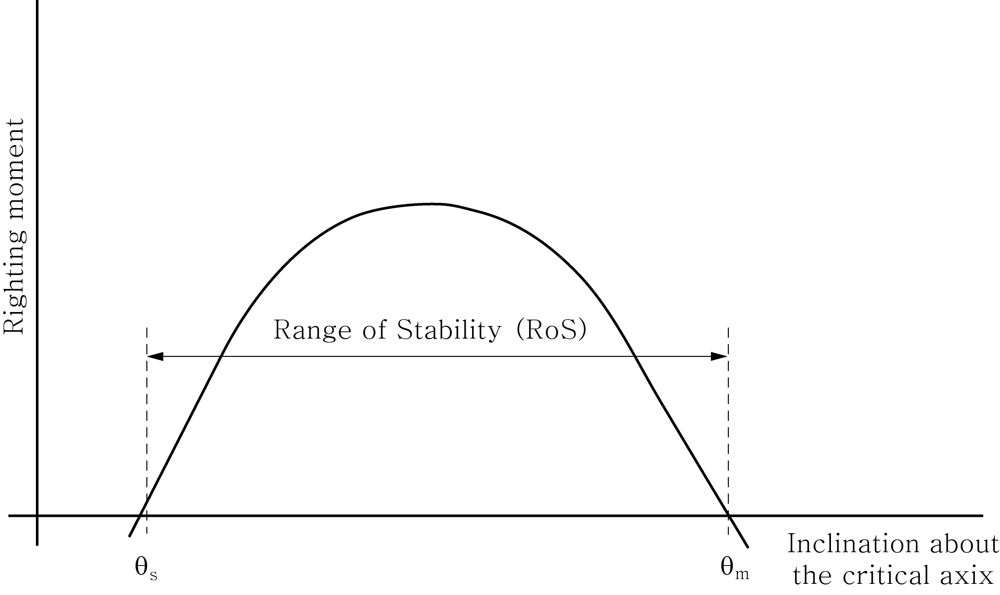
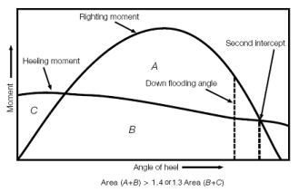

# Rules and Guidance for the Classification of Mobile Offshore Units

> RULES AND GUIDANCE FOR OFFSHORE STRUCTURES / RB-01-E / 2025 / EN / Rules

## CHAPTER 7 STABILITY

### Section 1 General Requirements of Stability

#### 101. General

- **1.** All units are to have positive stability in calm water equilibrium position, for the full range of draughts when in all modes of operation afloat, and for temporary positions when raising or lowering.
- **2.** In addition to **Par 1,** all units are to meet the stability requirements set forth this Chapter for all applicable condition.

#### 102. Intact stability

- **1.** All units are to have sufficient stability (righting ability) to withstand the overturning effect of the force produced by a sustained wind from any horizontal direction, in accordance with the stability criteria given in **Sec 2,** for all afloat modes of operation.
- **2.** Realistic operating conditions are to be evaluated, and the unit is to be capable of maintaining in operating mode with a sustained wind velocity designated by the Owner, but not less than 36 $\mathrm{m}/\sec$ (70 knots).
- **3.** The capability is to be provided to change the mode of operation of the unit to that corresponding to a severe storm condition, with a sustained with velocity of not less than 51.5 $\mathrm{m}/\sec$ (100 knots), in reasonable period of time for the particular unit. In all cases, the limiting wind velocities are to be specified and instructions should be included in the Operating Booklet for changing the mode of operation by redistribution of the variable load and equipment, by changing draughts, or both.
- **4.** For restricted operations consideration may be given to a reduced sustained wind velocity specified in **Par 2** and **3,** of not less than 25.8 $\mathrm{m}/\sec$ (50 knots).
- **5.** For the purpose of calculation, it is to be assumed that the unit is floating free of mooring restraints. However, the possible detrimental effects of mooring restraints are to be considered.

#### 103. Damage stability

- **1.** All units are to have sufficient stability to withstand the flooding from the sea of any single compartment or any combination of compartments consistent with the damage assumption set out in **104.**, for operating and transit modes of operation.
- **2.** The unit is to possess sufficient reserve stability in the damaged condition to withstand the additional heeling moment of a 25.8 $\mathrm{m}/\sec$ (50 knots) sustained wind superimposed from any direction.
- **3.** The final waterline is to be below the lower edge of any opening which is not to comply with the requirements in **Ch 6, 202.** and **203.** so that the unit has the sufficient stability to withstand the heeling moment.
- **4.** For all types of units, the ability to compensate for damage incurred, by pumping out or by ballasting other compartments, etc., is not to be considered as alleviating the requirements specified herein.
- **5.** For the purpose of calculation, it is to be assumed that unit is floating free of mooring restraints. However, the possible detrimental effects of mooring restraints are to be considered.

#### 104. Assumption of the damage extent

- **1.** **Damage extent of self-elevating units**
  In assessing the damage stability as required by **103.**, the following extent of damage is to be assumed to occur between effective watertight bulkheads.
  - **(1)** Horizontal penetration : 1.5 $\mathrm{m}$
  - **(2)** Vertical extent : bottom shell upwards without limit.
  - **(3)** The distance between effective watertight bulkheads or their nearest stepped portions which are positioned within the assumed extent of horizontal penetration should be not less than 3 m; where there is a lesser distance, one or more of the adjacent bulkheads should be disregarded. Where a bottom mat is fitted, assumed damage penetration simultaneous to both the mat and the upper hull need only be considered when the lightest draught allows any part of the mat to fall within 1.5 $\mathrm{m}$ vertically of the waterline, and the difference in horizontal dimension of the upper hull and mat is less than 1.5 $\mathrm{m}$ in any area under consideration.
  - **(4)** If damage of a lesser extent than specified in (1) to (3) results in a more severe final equilibrium condition, such a lesser extent is to be assumed.
  - **(5)** All piping, ventilating systems, trunks, etc., within this extent are to be assumed damaged.
  - **(6)** Positive means of closure are to be provided to preclude progressive flooding of other intact spaces.
  - **(7)** The compartments adjacent to the bottom shell are also to be considered flooded individually. **【See Guidance】**
- **2.** **Damage extent of column-stabilized units**
  In assessing the damage stability as required by **103.**, the following assumed damage conditions apply.
  - **(1)** Only those columns, underwater hulls and braces on the periphery of the unit are to be assumed to be damaged and the damage is to be assumed in the exposed portions of the columns, underwater hulls and braces.
  - **(2)** Columns and braces are to be assumed to be flooded by damage having a vertical extent of 3.0 $\mathrm{m}$ occurring at any level between 5.0 $\mathrm{m}$ above and 3.0 $\mathrm{m}$ below the drafts specified in the Operating manual. Where a watertight flat is located within this region, the damage is to be assumed to have occurred in both compartments above and below the watertight flat in question. Lesser distances above or below the draughts may be applied taking into account the actual operating conditions. However, the extent of required damage region should be at least 1.5 $\mathrm{m}$ above and below the draft in question.
  - **(3)** Horizontal penetration of damage is to be assumed to be 1.5 $\mathrm{m}$.
  - **(4)** No vertical bulkhead is to be assumed to be damaged, except where bulkheads are spaced closer than a distance of one eighth of the column perimeter at the draught under consideration, measured at the periphery, in which case one or more of the bulkheads are to be disregarded.
  - **(5)** Footings or lower hulls are to be treated as damaged when operating at a light or transit condition in the same manner as indicated in (1) to (4).
  - **(6)** If damage of a lesser extent than specified in (1) to (5) results in a more severe damage equilibrium condition, such a lesser extent is to be assumed.
  - **(7)** All piping, ventilation systems, trunks, etc., within this extent of damage are to be assumed damaged.
- **3.** **Damage extent of surface type units**
  In assessing the damage stability as required by **103.**, the following extent of damage is to be assumed to occur between effective watertight bulkheads.
  - **(1)** Horizontal penetration : 1.5 $\mathrm{m}$
  - **(2)** Vertical extent : bottom shell upwards without limit
  - **(3)** The distance between effective watertight bulkheads or their nearest stepped portions which are positioned within the assumed extent of horizontal penetration should be not less than 3 m; where there is a lesser distance, one or more of the adjacent bulkheads should be disregarded. If damage of a lesser extent than specified in (1) and (2) results in a more severe final equilibrium condition, such a lesser extent is to be assumed.
  - **(4)** All piping, ventilation systems, trunks, etc., within this extent are to be assumed damaged.
  - **(5)** The compartments bounded by the bottom shell are to be considered flooded individually.

#### 105. Damage stability of column-stabilized units

The column-stabilized unit is to comply with the following in addition to **103.**

- **1.** The column-stabilized units are to have the sufficient stability to meet following under the wind force specified in **103. 2.**
  - **(1)** The angle of inclination after the damage set out in **104. 2** (2) is not to exceed 17**°**.
  - **(2)** The final waterline is to be located below the lower edge of any opening that does not meet the requirements in **Ch 6, 202.** and **203.** However, no openings are provided in column. The openings within 4 $\mathrm{m}$ above the final waterline are to be made weathertight.
  - **(3)** The righting moment curve, after the damage, is to have from the first intercept with the wind heeling moment to the lesser of the extent of weathertight integrity or the second intercept, a range of at least 7°. Within this range, the righting moment curve is to reach a value of at least twice the wind heeling moment curves, both being measured at the same angle. (See **Fig 7.1**).
    
    Fig 7.1 Residual damage stability requirements for column- stabilized units
- **2.** The column-stabilized unit is to have sufficient buoyancy and stability to meet the following, in any operating or transit condition with the assumption of no wind to withstand the flooding of any watertight compartment wholly or partially below the waterline in question, which is a pump-room, a room containing machinery with a salt water cooling system or a compartment adjacent to the sea.
  - **(1)** The angle of inclination after flooding is not to be greater than 25°.
  - **(2)** The final waterline is to be located below the lower edge of any opening that does not meet the requirements in **Ch 6, 202.** and **203.** However, no openings are provided in column.
  - **(3)** Sufficient margin of stability is provided which requires a range of positive stability of at least 7° beyond the first intercept of the righting moment curve and the horizontal coordinate axis of the static stability curve to the second intercept of them or the downflooding angle, whichever is less.

#### 106. Damage stability of self-elevating units and surface type units

- **1.** The self-elevating unit and surface type unit are to comply with the requirements in **103.**
- **2.** The flooding of any single compartment of the self-elevating unit while meeting the following criterion (see **Fig 7.2**):
  $RoS \geq 7 ^{o} +(1.5 \theta _{s} )$
  where,
  $RoS \geq 10 ^{o}$
  $RoS$ : range of stability, in degrees $= \theta _{m} - \theta _{s}$
  where,
  $\theta _{m}$ : maximum angle of positive stability, in degrees
  $\theta _{s}$ : static angle of inclination after damage, in degrees
  The range of stability is determined without reference to the angle of downflooding.
  
  Fig 7.2 Residual Stability for Self-elevating Units

#### 107. Inclining test

- **1.** An inclining test will be required for the first unit of a design when as near to completion as possible, to determine accurately the light ship weight and position of centre of gravity.
- **2.** An inclining test procedure is to be submitted to the Society for review prior to the test. An inclining test is to be carried out in the presence of the Surveyor.
- **3.** For successive units of design, which are basically identical with regard to hull form, with the exception of minor changes in arrangement, machinery, equipment, etc., and with concurrence by the Society that such changes are minor, detailed weight calculations showing only the differences of weight and centres of gravity will be satisfactory, provided the accuracy of the calculations is confirmed by a deadweight survey.
- **4.** The results of the inclining test, or deadweight survey and inclining experiment adjusted for weight differences, are to be reviewed by the Society prior to inclusion in the Operating Booklet.

### Section 2 Stability Criterion under Wind Force

#### 201. Intact condition

- **1.** Righting moment curves and wind heeling moment curves related to the most critical axis, with supporting calculations, are to be prepared for a sufficient number of conditions covering the full range of drafts corresponding to afloat modes of operation.
- **2.** Where drilling equipment is of the nature that it can be lowered and stowed, additional wind heeling moment and stability curves may be required, and such data is to clearly indicate the position of such equipment.
- **3.** The righting moment curve is to comply with the following requirements depending on the type of unit. (See **Fig 7.3**)
  
  Fig 7.1 Righting moment and heeling moment curves
  - **(1)** Column-stabilized unit
    The area under the righting moment curve to the angle of downflooding (area : A+B) is not to be less than 30 % in excess of the area under the wind heeling moment curve (area : B+C) to same limiting angle.
  - **(2)** Units except column-stabilized unit
    The area under the righting moment curve to the second intersection($\theta_3$) or downflooding angle($\theta_2$), whichever is less (area : A+B) is not to be less than 40 % in excess of the area under the wind heeling moment curve (area : A+B) to the same limiting angle.
  - **(3)** In all cases, the righting moment curve is to be positive over the entire range of angles from upright to the second intersection($\theta_3$).

#### 202. Wind heeling moment

- **1.** The wind heeling moment is to be calculated at several angles of inclination for each mode of operation, based on the wind force obtained from **Ch 4.**
- **2.** The calculations are to be performed in a manner to reflect the range of stability about the most critical axis.
- **3.** The lever for the heeling force is to be taken vertically from the centre of lateral resistance or, if available, the centre of hydrodynamic pressure, of the underwater body to the centre of pressure of the areas subject to wind loading.
- **4.** In calculating wind heeling moments for ship-shaped hulls, the curve may be assumed to vary as the cosine function of the vessel's heel.

#### 203. Wind tunnel test

Wind heeling moments derived from authoritative wind tunnel tests on a representative model of the unit may be considered as alternatives to the method given in **202.** Such heeling moment determination is to include lift effects at various applicable heel angles, as well as drag effects.

#### 204. Other stability criteria

The stability may be reviewed and evaluated in accordance with the alternative criteria deemed appropriate by the Society, taking into account the operation modes and environment conditions. 
