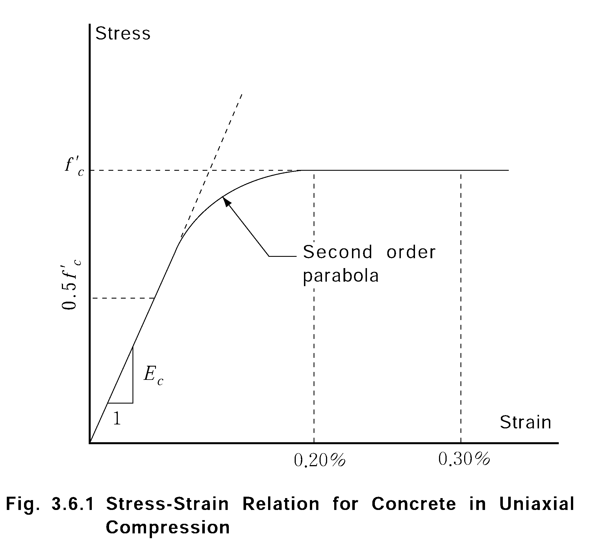
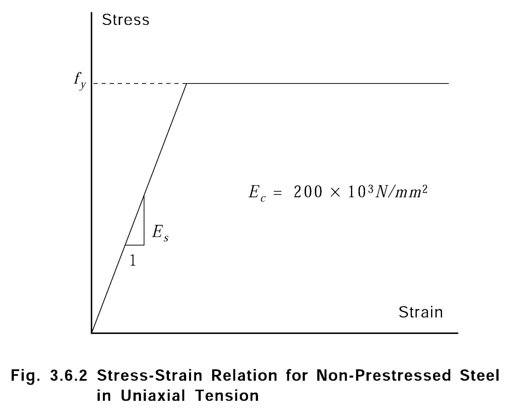

# Rules for the Classification of Fixed Offshore Structures

> RULES AND GUIDANCE FOR OFFSHORE STRUCTURES / RB-02-E / 2025 / EN / Rules

## CHAPTER 4 DESIGN OF STRUCTURES

### Section 1 Definitions and Design Documentation

#### 101. Definitions

- **1.** **Recurrence Period**
  The recurrence period is a specified period of time which is used to establish design values of random parameters such as wave height.
- **2.** **Operator**
  An operator is any person or organization empowered to conduct operations on behalf of the Owners of an installation.
- **3.** **Constructor**
  A constructor is any person or organization having the responsibility to perform any or all of the following.
- **4.** **Platform Structures**
  - **(1)** Various types of offshore structures to which these Rules may be applied are defined below.
    This type of structure is characterized by slender foundation elements, or piles, driven into the sea floor.
    This type of structure rests directly on the sea floor. The geometry and weight of the structure are selected to mobilize the available cohesive and frictional strength components of the sea floor soil to resist loadings.
    This type of structure has narrower and more flexible tower than the typical pile supported platform and is supported by piles.
    This type of structure depends on buoyancy acting near the water surface to provide the necessary righting stability.
    - **(A)** Pile Supported Platform
    - **(B)** Gravity Structure
    - **(C)** Compliant tower
    - **(D)** Articulated Buoyant Tower
  - **(2)** Additionally, these Rules may be employed, as applicable, in the classification of structural types not mentioned above (1) when they are to be used as permanent offshore installations.

#### 102. Design Documentation

- **1.** **General**
  The design documentation to be submitted is to include the reports, calculations, plans, and other documentation necessary to verify the structural design.
- **2.** **Design Documentation**
  The contents of reports are to comply with the recommended list of items given below.
  - **(1)** Environmental Consideration
    - **(A)** Reports on environmental considerations are to describe all environmental phenomena appropriate to the areas of construction, transportation, and installation. The types of environmental phenomena to be accounted for, as appropriate to the type and location of the structure are as follows.
      - **(a)** Wind
      - **(b)** Waves
      - **(c)** Current
      - **(d)** Temperature
      - **(e)** Tide
      - **(f)** Marine growth
      - **(g)** Chemical components of air and water
      - **(h)** Snow and ice
      - **(i)** Earthquake
      - **(j)** Other pertinent phenomena
    - **(B)** The establishment of the environmental parameters is to be based on appropriate original data or, when permitted, data from analogous areas. Demonstrably valid statistical models to extrapolate to long-term values are to be employed, and any calculations required to establish the pertinent environmental parameter should be submitted.
    - **(C)** Preferably, a report on the various environmental considerations is to present data and conclusions on the relevant environmental phenomena. The report is, however, required to separately present a summary showing the parameters necessary to define the Design Environmental Condition and Operating Environmental conditions. Where applicable, the likely environmental conditions, such as strength and ductility level earthquake, are to be experienced during the transportation of the structure to its final site.
    - **(D)** The report on environmental considerations may also contain the calculations which quantify the effects of loadings on the structure where these are not provided in other documentation.
  - **(2)** Foundation Data
    - **(A)** A report on foundation data is to present the results of investigations or, when applicable, data from analogous area on geophysical, geological and geotechnical considerations existing at and near the platform site. The manner in which such data is established and the specific items to be assessed are to be in compliance with **702.** The report is to contain a listing of references to cover the investigation, sampling, testing, and interpretive techniques employed during and after the site investigation.
    - **(B)** The report is to include a listing of the predicted soil-structure interaction, such as p-y data, to be used in design. As appropriate to the planned structure, the items which may be covered are as follows.
      - **(a)** Axial and lateral pile capacities and response characteristics
      - **(b)** The effects of cyclic loading on soil strength
      - **(c)** Scour
      - **(d)** Settlements and lateral displacements
      - **(e)** Dynamic interaction between soil and structure
      - **(f)** The capacity of pile groups
      - **(g)** Slope stability, bearing and lateral stability
      - **(h)** Soil reactions on the structure
      - **(i)** Penetration resistance
    - **(C)** Recommendations relative to any special anticipated problem regarding installation are to be included in the report. Items such as the following are to be included in the report.
      - **(a)** Hammer size
      - **(b)** Soil erosion during installation
      - **(c)** Bottom preparation
      - **(d)** Procedures to be followed should pile installation procedures significantly deviate from those anticipated.
  - **(3)** Materials and welding
    - **(A)** Reports on structural materials and welding may be required for metallic structures, concrete structures or welding procedures where materials and procedures are used which do not conform to those provided for in **Ch 3.**
    - **(B)** For metallic structures, when it is intended to employ new alloys not defined by a recognized specification, reports are to be submitted indicating the adequacy of the material's metallurgical properties, fracture toughness, yield and tensile strengths, and corrosion resistance, with respect to their intended application and service temperatures.
    - **(C)** For concrete structures, when it is not intended to test or define material properties in accordance with applicable standards of this Society, a report is to be provided indicating the standards actually to be employed and their relative adequacy with respect to the corresponding relative standards which are recognized by this Society.
- **3.** **Calculation**
  - **(1)** Calculations are to be submitted to verify the propriety of the planned design. These calculations are to be made out by logical and general methods. For the Computerized input and output type of calculations, the examination report of the program, program manual and user's manual are to be submitted if necessary.
  - **(2)** Design and analysis calculations are to be submitted for items relating to loadings, structural stresses and deflections for in-place and marine operations. In this regard, calculations are to be in general compliance with the items listed below.
    Calculations for loadings are to be submitted in accordance with **Sec** **3.**
    As applicable, calculations are to be submitted in accordance with **Sec 9.**
    As required, additional calculations which demonstrate the adequacy of the overall design are to be submitted. Such calculations should include those performed in the design of the corrosion protection system.
    - **(A)** Loadings
    - **(B)** Structural stress and deflections
      - **(a)** The stress and deflection calculations to be submitted are to include, those required for nominal element or member stresses and deflections.
      - **(b)** As applicable, and where required in subsequent sections of these Rules, calculations may also be required for the stresses in localized areas and structural joints, the dynamic response of the structure, and fatigue life of critical members and joints.
      - **(c)** For pile supported structures, calculations for the stresses in piles and the load capacity of the connection between the structure and the pile are to be submitted.
      - **(d)** For gravity structures, calculations are to be submitted for the effects of the soil's reaction on the structure.
      - **(e)** When accounting for the stress resultants described above, and those resulting from consideration of marine operations(see **Sec 9**), calculations are to demonstrate the adequacy of the structural elements, members or local structure. Also, the calculations are to demonstrate, as applicable, that the deflections resulting from the applied loadings and overall structural displacement and settlement do not impair the structural performance of the platform.
    - **(C)** Marine operation
    - **(D)** Other calculations

#### 103. Plans and Other Data

- **1.** **General**
  Generally, structural plans and other data are to be submitted. These plans are to include the following.
- **2.** **Plans and Other Data**
  Plans which are to be submitted in relation to the design of structures are defined below.

### Section 2 ENVIRONMENTAL CONDITIONS

#### 201. General

- **1.** **General**
  The environmental conditions to which an offshore installation may be exposed during its life are to be described using adequate data for the area in which the structure is to be transported and installed. All data used are to be fully documented with the sources and estimated reliability of data noted.

#### 202. Environmental Factors

- **1.** **Environment factors**
  - **(1)** In general, the design of an offshore installation will require investigation of the following environmental factors.
    - **(A)** Waves
    - **(B)** Wind
    - **(C)** Currents
    - **(D)** Tides and storm surges
    - **(E)** Air and sea temperatures
    - **(F)** Ice and snow
    - **(G)** Marine growth
    - **(H)** Seismicity
    - **(I)** Sea ice
  - **(2)** Other phenomena, such as tsunamis, submarine slides, seiche, abnormal composition of air and water, air humidity, salinity, ice drift, icebergs, ice scouring, etc. may require investigation depending upon the specific installation site. The required investigation of seabed and soil conditions is described in **Sec 7.**

#### 203. Environmental Design Criteria

- **1.** **General**
  The combination and severity of environmental conditions for use in design are to be appropriate to the installation being considered and consistent with the probability of simultaneous occurrence of the environmental phenomena. It is to be assumed that environmental phenomena may approach the installation from any direction unless reliable site-specific data indicate otherwise. The direction, or combination of directions, which produces the most unfavorable effects on the installation is to be accounted for in the design.
- **2.** **Design Environmental Condition**
  - **(1)** Design environmental condition is to be described by a set of parameters representing an environmental condition which has a high probability of not being exceeded during the life of the structures and will normally be composed of the followings.
    - **(A)** The maximum wave height corresponding to the selected recurrence period together with the associated wind, current and limits of water depth, and appropriate ice and snow effects.
    - **(B)** The extreme air and sea temperatures
    - **(C)** The maximum and minimum water level due to tide and storm surge
  - **(2)** However, depending upon site-specific conditions, consideration should be given to the combinations of events contained in item (A) above.
  - **(3)** The recurrence period chosen for events (1), (A) to (C) above is normally not to be less than one hundred years, unless justification for a reduction can be provided. For platforms that are unmaned, or can be easily evacuated during the design event, or platforms with shorter design life than the typical 20 years may use a recurrence interval less that 100 years for events (1), (A) to (C) above. However, the recurrence interval is not to be less than 50 years.
  - **(4)** For installation sites located in seismically active areas(see **204. 8**), the magnitudes of the parameters characterizing these earthquakes having recurrence periods appropriate to the design life of the structure are to be determined. The effects of the earthquakes are to be accounted for in design but, generally, need not be taken in combination with other environmental factors.
  - **(5)** For installations located in areas susceptible to tsunami waves, submarine slides, seiche or other phenomena, the effects of such phenomena are to be based on the most reliable estimates available and, as practicable, the expected effects are to be accounted for in design.
- **3.** **Operating Environmental Conditions**
  For each intended major function or operation of the installation, a set of characteristic parameters for the environmental factors which act as a limit on the safe performance of an operation or function is to be determined. Such operations may include, as appropriate, transportation, offloading and installation of the structure, drilling or producing operations, evacuation of the platform, etc. These sets of conditions are herein referred to as Operating Environmental Conditions.

#### 204. Specific Environmental Condition

- **1.** **Waves**
  - **(1)** General
    Statistical wave data from which design parameters are determined are normally to include the frequency of occurrence of various wave height groups, associated wave periods and directions. Published data and previously established design criteria for particular areas may be used where such exist. Analytical wave spectra employed to augment available data are to reflect the shape and width of the data, and they are to be appropriate to the general site conditions.
  - **(2)** Long-Term Predictions
    All long-term and extreme-value predictions employed for the determination of design wave conditions are to be fully described and based on recognized techniques. Design wave conditions may be formulated for use in either deterministic or probabilistic methods of analysis, but the method of analysis is to be appropriate to the specific topic being considered.
  - **(3)** Data
    - **(A)** The development of wave data to be used in required analysis is to reflect conditions at the installation site and the type of structure. As required, wave data may have to be developed to determine the followings.
      - **(a)** Provision for air gap
      - **(b)** Maximum mud line shear force and overturning moment
      - **(c)** Dynamic response of the structure
      - **(d)** Maximum stress, fatigue, impact of local structure
    - **(B)** Breaking wave criteria are to be appropriate to the installation site and based on recognized techniques. Waves which cause the most unfavorable effects on the overall structure may differ from waves having the most severe effects on individual structural components. In general, more frequent waves of lesser heights, in addition to the most severe wave conditions, are to be investigated when fatigue and dynamic analyses are required.
- **2.** **Wind**
  - **(1)** General
    Statistical wind data is normally to include information on the frequency of occurrence, duration and direction of various wind speeds. Published data and data from nearby land and sea stations may be used if available. If on-site measurements are taken, the duration of individual measurements and the height above sea-level of measuring devices is to be stated. Sustained winds are to be considered as those having durations equal to or greater than one minute, while gust winds are winds of less than one minute duration.
  - **(2)** Long-Term and Extreme-Value Predictions
    Long-term and extreme-value predictions for sustained and gust winds are to be based on recognized techniques and clearly described. Preferably, the statistical data used for the long-term distributions of wind speed should be based on the same averaging periods of wind speeds as are used for the determination of loads. Vertical profiles of horizontal wind are to be determined on the basis of recognized statistical or mathematical models.
  - **(3)** Vertical Profiles of Horizontal Wind
    Vertical profiles of horizontal wind for use in design can be determined using the following equation.
    where,
    $V _{y}$ : wind speed at height $y$ above a reference water depth(m/sec)
    $V _{H}$ : wind speed at reference height $H$, usually 10 m above a reference water depth(m/sec)
    1/$n$ : exponent dependent upon the time-averaging period of the measured wind speed $V _{H}$
    $n$ : the value of $n$ typically ranges from 7 for sustained winds to 13 for gust winds of brief duration. For sustained winds of 1 minute duration, $n$ equal to 7 may be used; for gust winds of 3 second duration, $n$ equal to 12 may be used.
  - **(4)** Time-averaging Data
    In the event that wind speed data is not available for the time-averaging period desired for use in design, conversions to the desired time-averaging periods may be made on the basis of **Table 3.1.1.**

    **Table 3.1.1 Wind Speed for Time-Averaging Period** $t$

    | $t$ | 1 hr. | 10 min. | 1 min. | 15 sec. | 5 sec. | 3 sec. |
    | --- | --- | --- | --- | --- | --- | --- |
    | factor | 1.00 | 1.04 | 1.16 | 1.26 | 1.32 | 1.35 |

    Linear interpolation may be used with the **Table 3.1.1** to determine the factor to be applied to the time-averaging period wind speed relative to the 1 hour wind speed. For wind speeds given in terms of the "fastest meter of wind", $V _{f}$, the corresponding time-averaging period $t$ in second is given by **Table 3.1.1.**
    where,
    $V _{f}$ : The fastest meter of wind at a reference height of 10 m (m/sec)
- **3.** **Currents**
  - **(1)** General
    Data for currents are generally to include information on current speed, direction and variation with depth. The extent of information needed is to be commensurate with the expected severity of current conditions at the site in relation to other load causing phenomena, past experience in adjacent or analogous area and the type of structure and foundation to be installed. On-site data collection may be indicated for previously unstudied area and/or area expected to have unusual or severe conditions. Consideration is to be given to the following types of currents, as appropriate to the installation site: tidal, wind-generated, density, circulation and river-outflow.
  - **(2)** Velocity Profiles
    Current velocity profiles are to be based on site-specific data or recognized empirical relationships. Unusual profiles due to bottom currents and stratified effects due to river outflow currents are to be accounted for.
- **4.** **Tides**
  - **(1)** General
    Tides, when relevant, are to be considered in the design of an offshore fixed structure. Tides may be classified as lunar or astronomical tides, wind tides, and pressure differential tides. The combination of the latter two is commonly called the storm surge.
  - **(2)** The water depth at any location consists of the mean depth, defined as the vertical distance between the sea bed and an appropriate near-surface datum, and a fluctuating component due to astronomical tides and storm surges.
  - **(3)** Astronomical tide variations are bounded by highest astronomical tide, HAT, and lowest astronomical tide, LAT, still water level(SWL) should be taken as the sum of the highest astronomical level plus the storm surge.
  - **(4)** Storm surge is to be estimated from available statistics or by mathematical storm surge modeling.
  - **(5)** Design Environmental Wave Crest
    For design purposes, the design environmental wave crest elevation is to be superimposed on the SWL. Variations in the elevation of the daily tide may be used in determining the elevations of boat landings, barge fenders and the corrosion prevention treatment of structure in the splash zone. Water depth assumed for various topics of analysis are to be clearly stated.
- **5.** **Temperature**
  Extreme values of air, sea and seabed temperatures are to be expressed in terms of recurrence Periods and associated highest and lowest values. Temperature data is to be used to evaluate selection of structural materials, ambient ranges and conditions for machinery and equipment design, and for determination of thermal stresses, as relevant to the installation.
- **6.** **Ice and snow**
  - **(1)** For structures intended to be installed in areas where ice and snow may accumulate or where sea ice hazards may develop, estimates are to be made of the extent to which ice and snow may accumulate on the structure.
  - **(2)** Data may be derived from actual field measurements, laboratory data or data from analogous areas.
- **7.** **Marine Growth**
  - **(1)** Marine growth is to be considered in the design of an offshore installation. Estimates of the rate and extent of marine growth may be based on past experience and available field data.
  - **(2)** Particular attention is to be paid to increases in hydrodynamic loading due to increased diameters and surface roughness of members caused by marine fouling as well as to the added weight and increased inertial mass of submerged structural members.
  - **(3)** Consideration should be given to the types of fouling likely to occur and their possible effects on corrosion protection coatings.
- **8.** **Seismicity and Earthquake Related Phenomena**
  - **(1)** Effects on Structures
    The effects of earthquakes on structures located in areas known to be seismically active are to be taken into account. The anticipated seismicity of an area is, to the extent practicable, to be established on the basis of regional and site specific data including, as appropriate, the following.
    - **(A)** Magnitudes and recurrence intervals of seismic events
    - **(B)** Proximity to active faults
    - **(C)** Type of faulting
    - **(D)** Attenuation of ground motion between the faults and the site
    - **(E)** Subsurface soil conditions
    - **(F)** Records from past seismic events at the site where available, or from analogous sites
  - **(2)** Ground Motion
    The seismic data are to be used to establish a quantitative strength level and ductility level earthquake criteria describing the earthquake induced ground motion expected during the life of the structure. In addition to ground motion, and as applicable to the site in question, the following earthquake related phenomena should be taken into account.
    - **(A)** Liquefaction of subsurface soils
    - **(B)** Submarine slide
    - **(C)** Tsunamis
    - **(D)** Acoustic overpressure shock waves
- **9.** **Sea Ice**
  - **(1)** The effects of sea ice on structures must consider the frozen-in condition(winter), break-out in the spring, and summer pack ice invasion as applicable.
  - **(2)** Impact, both centric and eccentric, must be considered where moving ice may impact a structure. Impact should consider both that of large masses(multi-year floes and icebergs) moving under the action of current, wind, and Coriolis effect, and that of smaller ice masses which are accelerated by storm waves.
  - **(3)** The interaction between ice and the structure produces responses both in the ice and the structure-soil system, and this compliance should be taken into account as applicable.
  - **(4)** The mode of ice failure(tension, compression, shear, etc.)depends on the shape and roughness of the surface and the presence of adfrozen ice, as well as the ice character, crystallization, temperature, salinity, strain rate and contact area. The force exerted by the broken or crushed ice in moving past the structure must be considered. Limiting force concepts may be employed if thoroughly justified by calculation.

### Section 3 Loads

#### 301. General

- **1.** **General**
  This Chapter pertains to the identification, definition and determination of the loads to which an offshore structure may be subjected during and after its transportation to site and its installation. As appropriate to the planned structure, the types of loads described in **302.** are to be accounted for in design.

#### 302. Types of Loads

- **1.** **General**
  Loads applied to an offshore structure are, for purposes of these Rules, categorized as follows.
- **2.** **Dead Load**
  Dead loads are loads which do not change during the mode of operation under consideration. Dead loads include the following.
- **3.** **Live Load**
  - **(1)** Live loads associated with the normal operation and use of the structure are loads which may change during the mode of operation considered. (Though environmental loads are live loads, they are categorized separately; see **Par 5**) Live loads acting after construction and installation include the following.
    - **(A)** The weight of drilling or production equipment which can be removed, such as derrick, draw works, mud pumps, mud tanks, rotating equipment, etc.
    - **(B)** The weight of crew and consumable supplies, such as mud, chemicals, water, fuel, pipe, cable, stores, drill stem, casting, etc.
    - **(C)** Liquid in the vessels and pipes during operation and testing
    - **(D)** The weight of liquids in storage and ballast tanks
    - **(E)** The forces exerted on the structure due to operations, e.g., maximum derrick reaction
    - **(F)** The forces exerted on the structure during the operation of cranes and vehicles
    - **(G)** The forces exerted on the structure by vessels moored to the structure or accidental impact consideration for a typical supply vessel that would normally service the installation
    - **(H)** The forces exerted on the structure by helicopters during take-off and landing, or while parked on the structure
  - **(2)** Where applicable, the dynamic effects on the structure of items (1) (E) through (H) are to be taken into account. Where appropriate, some of the items of live load listed above may be adequately accounted for by designing decks, etc. to a maximum, uniform area load as specified by the Operator, or past practice for similar conditions. Live loads occurring during transportation and installation are to be determined for each specific operation involved and the dynamic effects of such loads are to be accounted for as necessary. (see **Sec 9**)
- **4.** **Deformation Loads**
  Deformation loads are loads due to deformations imposed on the structure. The deformation loads include those due to temperature variations(e.g., hot oil storage) leading to thermal stress in the structure and where necessary, loads due to displacements(e.g., differential settlement or lateral displacement) or due to deformations of adjacent structures. For concrete structures, deformation loads due to prestress, creep, shrinkage and expansion are to be taken into account.
- **5.** **Environmental Loads**
  Environmental loads are loads due to wind, waves, current, ice, snow, earthquake, and other environmental phenomena. The characteristic parameters defining an environmental load are to be appropriate to the installation site and in accordance with the requirements of **Sec 2.** Operating Environmental Loads are those loads derived from the parameters characterizing Operating Environmental Conditions(see **203. 3**). The combination and severity of Design Environmental Loads are to be in accordance with **203. 2.** Environmental loads are to be applied to the structure from directions producing the most unfavorable effects on the structure, unless site-specific studies provide evidence in support of a less stringent requirement. Directionality may be taken into account in applying the environmental criteria. Earthquake loads and loads due to accidents or rare occurrence environmental phenomena need not be combined with other environmental loads, unless site specific conditions indicate that such combinations are appropriate.

#### 303. Determination of Environmental Loads

- **1.** **General**
  - **(1)** Model or field test data may be employed to establish environmental loads. Alternatively, environmental loads may be determined using analytical methods compatible with the data established in compliance with **Sec 2.**
  - **(2)** Any recognized load calculation method may be employed provided it has proven sufficiently accurate in practice, and it is shown to be appropriate to the structure's characteristics and site conditions. The calculation methods presented herein are offered as guidance representative of current acceptable methods.
- **2.** **Wave Loads**
  - **(1)** Range of Wave Parameters
    A sufficient range of realistic wave periods and wave crest positions relative to the structure are to be investigated to ensure an accurate determination of the maximum wave loads on the structure. Consideration should be given to other wave induced effects such as wave impact loads, dynamic amplification and fatigue of structural members. The need for analysis of these effects is to be assessed on the basis of the configuration and behavioral characteristics of the structure, the wave climate and past experience.
  - **(2)** Determination of Wave Loads
    For structures composed of members having diameters which are less than 20% of the wave lengths being considered, semiempirical formulations such as (3) are considered to be an acceptable basis for determining wave loads. For structures composed of members whose diameters are greater than 20% of the wave lengths being considered, or for structural configurations which substantially alter the incident flow field, diffraction forces and the hydrodynamic interaction of structural members are to be accounted for in design.
  - **(3)** Load calculation
    $F =F _{D} +F _{I}$
    $F$ : hydrodynamic force vector per unit length along the member, acting normal to the axis of the member
    $F _{D}$ : drag force vector per unit length
    $F _{I}$ : inertia force vector per unit length
    $F _{D} = \left( \frac{\gamma}{2g} \right) DC _{D} U _{n} \left| U _{n} \right|$
    : weight density of water ($\mathrm{N}/m ^{3}$)
    : gravitational acceleration ($\mathrm{m}/s ^{2}$)
    $D$ : projected width of the member in the direction of the crossflow component of velocity(in the case of a critical cylinder, $D$ denotes the diameter), in m
    $C _{D}$ : drag coefficient (dimensionless)
    $U _{n}$ : component of the fluid velocity vector normal to the axis of the member, in m/s
    $\left| U _{n} \right|$: absolute value of $U _{n}$, in m/s
    $F _{I} = \left( \frac{\gamma}{g} \right) \left( \frac{\pi D ^{2}}{4} \right) C _{M} a _{n}$
    $C _{M}$ : Inertia coefficient based on the displaced mass of fluid per unit length(dimensionless)
    $a _{n}$ : component of the fluid acceleration vector normal to the axis of the member, $\mathrm{m}/s ^{2}$
    $F=F _{D} +F _{I} = \left( \frac{\gamma}{2g} \right) DC _{D} (U _{n} -U _{n} ^{' } ) \left| U _{n} -U _{n} ^{' } \right| + \left( \frac{\gamma}{g} \right) \left( \frac{\pi D ^{2}}{4} \right) a _{n} + \left( \frac{\gamma}{g} \right) \left( \frac{\pi D ^{2}}{4} \right) C _{m} (a _{n} -a _{n} ^{'} )$
    $U _{n} '$ : component of the velocity vector of the structural member normal to its axis, in m/s
    $C _{m}$ : added mass coefficient, i.e., $C _{m} =C _{M} -1$
    $a _{n} ^{'}$ : component of the acceleration vector of the structural member normal to its axis, in $\mathrm{m}/s ^{2}$
    - **(A)** The hydrodynamic force acting on a cylindrical member, as given by Morison's equation, is expressed as the sum of the force vectors indicated in the following equation.
    - **(B)** The drag force vector for a stationary, rigid member is given by the following formula.
    - **(C)** The inertia force vector for a stationary, rigid member is given by
    - **(D)** For compliant structure which exhibit substantial rigid body oscillations due to the wave action, the modified form of Morison's equation given below may be used to determine the hydrodynamic force.
    - **(E)** For structural shapes other than circular cylinders, the term $\pi D ^{2}$/4 in the above equation is to be replaced by the actual cross-sectional area of the shape.
    - **(F)** Values of $U _{n}$ and $a _{n}$ for use in Morison's equation are to be determined using a recognized wave theory appropriate to the wave heights, wave periods, and water depth at the installation site. Values for the coefficients of drag and inertia to be used in Morison's equation are to be determined on the basis of model tests, full scale measurements, or previous studies which are appropriate to the structural configuration, surface roughness, and pertinent flow parameters(e.g., Reynolds number) Generally, for pile-supported template type structures, values of $C _{D}$ range between 0.6 and 1.2; values of $C _{M}$ range between 1.5 and 2.0.
  - **(4)** Diffraction Theory
    For structural configurations which substantially alter the incident wave field, diffraction theories of wave loading are to be employed which account for both the incident wave force(i.e., Froude-Kylov force) and the force resulting from the diffraction of the incident wave due to the presence of the structure. The hydrodynamic interaction of structural members is to be taken into account. For structures composed of surface piercing caissons or for installation sites where the ratio of water depth to wave length is less that 0.25, nonlinear effects of wave action are to be taken into account. This may be done by modifying linear diffraction theory to account for nonlinear effects or by performance of model tests.
- **3.** **Wind Load**
  - **(1)** Wind loads and local wind pressures are to be determined on the basis of analytical methods or wind tunnel tests on a representative model of the structure.
  - **(2)** In general, the wind load on the overall structure to be combined with other design environmental loads is to be determined using a one-minute sustained wind speed. For installations with negligible dynamic response to wind, a one-hour sustained wind speed may be used to calculate the wind loads on the overall structure. Wind loads on broad, essentially flat structures such as living quarters, walls, enclosures, etc. are to be determined using a fifteen-second gust wind speed. Wind pressures on individual structural members, equipment on open decks, etc. are to be determined using a three second gust wind speed.
  - **(3)** For wind loads normal to flat surfaces or normal to the axis of members not having flat surfaces, the following relation may be used.
    $F _{w} = \left( \frac{\gamma _{a}}{2g} \right) C _{s} V _{y} ^{2} A$
    $F _{w}$ : wind load, in N
    $g$ : gravitational acceleration ($\mathrm{m}/s ^{2}$)
    $\gamma _{a}$ : weight density of air, in $\mathrm{N}/m ^{3}$
    $C _{s}$ : shape coefficient (dimensionless)
    $V _{y}$ : wind speed at altitude $y$, in m/s
    $A$ : projected area of member on a plane normal to the direction of the considered force, in $\mathrm{m} ^{2}$
  - **(4)** For any direction of wind approach to the structure, the wind force on flat surfaces should be considered to act normal to the surface. The wind force on cylindrical objects should be assumed to act in the direction of the wind.
  - **(5)** The area of open trussworks commonly used for derricks and crane booms may be approximated by taking 30 % of the projected area of both the windward and leeward sides with the shape coefficient taken in accordance with **Table 3.3.1.**

    **Table 3.3.1 Values of shape coefficient (**$C _{s}$**)**

    | Shape | $C _{s}$ |
    | --- | --- |
    | Cylindric shape | 0.5 |
    | Major flat surfaces and overall projected area of platform | 1.0 |
    | Isolated structural shapes(cranes, angles, beams, channels, etc.) and sides of buildings | 1.5 |
    | Under-deck areas(exposed beams and girders) | 1.3 |
    | Derricks or truss cranes(each face) | 1.25 |
  - **(6)** Where one structural member shields another from direct exposure to the wind, shielding may be taken into account.
  - **(7)** Generally, the two structural components are to be separated by not more that seven times the width of the windward component for a reduction to be taken in the wind load on the leeward member.
  - **(8)** Where appropriate, dynamic effect due to the cyclical nature of gust wind and cyclic loads due to vortex induced vibration are to be investigated. Both drag and lift components of load due to vortex induced vibration are to be taken into account.
  - **(9)** The effects of wind loading on structural members or components that would not normally be exposed to wind loads after platform installation are to be considered. This would especially apply to fabrication or transportation phases.
- **4.** **Current Loads**
  - **(1)** Current induced loads on immersed structural members are to be determined on the basis of analytical methods, model test data or full-scale measurements.
  - **(2)** When currents and waves are superimposed, the current velocity is to be added vectorially to the wave induced particle velocity prior to computation of the total force.
  - **(3)** Current profiles used in design are to be representative of the expected conditions at the installation site.
  - **(4)** Where appropriate, flutter and dynamic amplification due to vortex shedding are to be taken into account.
  - **(5)** For calculation of current loads in the absence of waves, the lift force normal to flow direction, and the drag force may be determined as follows.
    $F _{L} =C _{L} \left( \frac{\gamma}{2g} \right) V ^{2} A _{1}$ $F _{D} =C _{D} \left( \frac{\gamma}{2g} \right) V ^{2} A _{1}$
    $F _{L}$ : total lift force per unit length, in N/m
    $C _{L}$ : lift coefficient(dimensionless)
    $\gamma$ : weight density of water, in $\mathrm{N}/m ^{3}$
    $V$ : local current velocity, in m/s
    $A _{1}$ : projected area per unit length in a plane normal to the direction of the force, in $\mathrm{m} ^{2} /m$
    $F _{D}$ : total drag force per unit length, in N/m
    $C _{D}$ : drag coefficient
  - **(6)** In general, lift force may become significant for long cylindrical members with large length-diameter ratios and should be checked in design under these conditions. The source of $C _{L}$ values employed is to be documented.
- **5.** **Ice and Snow Loads**
  - **(1)** At locations where structures are subject to ice and snow accumulation the following effects are to be accounted for, as appropriate to the local conditions.
    - **(A)** Weight and change in effective area of structural members due to accumulated ice and snow
    - **(B)** Incident pressures due to pack ice, pressure ridges and ice island fragments impinging on the structure
  - **(2)** For the design of structures that are to be installed in service in extreme cold weather such as arctic regions, reference is to be made to API 2N: *"Planning, Designing, and Constructing Fixed Offshore Platforms in Ice Environments"*
- **6.** **Earthquake Loads**
  - **(1)** For structures located in seismically active areas strength level and ductility level earthquake induced ground motions are to be determined on the basis of seismic data applicable to the installation site.
  - **(2)** Earthquake ground motions are to be described by either applicable ground motion records or response spectra consistent with the recurrence period appropriate to the design life of the structure.
  - **(3)** Available standardized spectra applicable to the region of the installation site are acceptable provided such spectra reflect site-specific conditions affecting frequency content, energy distribution, and duration. These condition include : the type of active faults in the region, the proximity of the site to the potential source faults, the attenuation or amplification of ground motion between the faults and the site, and the soil conditions at the site.
  - **(4)** The ground motion description used in design is to consist of three components corresponding to tow or thogonal horizontal directions and the vertical direction. All three components are to be applied to the structure simultaneously. When a standardized response spectrum, such as given in the *American Petroleum Institute(API) RP 2A,* is used for structural analysis, input values of ground motion(spectral acceleration representation) to be used are not to be less severe that the following.
    - **(A)** 100 % in both orthogonal horizontal directions
    - **(B)** 50 % in the vertical direction.
  - **(5)** When three-dimensional, site-specific ground motion spectra are developed, the actual directional accelerations are to be used.
  - **(6)** When three-dimensional, site-specific ground motion spectra are developed, the actual directional accelerations are to be used. If single site-specific spectra are developed, accelerations for the remaining two orthogonal directions should be applied in accordance with the factors given above.
  - **(7)** If time history method is used for structural analysis, at least three sets of ground motion time histories are to be employed. The manner in which the time histories are used is to account for the potential sensitivity of the structure's response to variations in the phasing of the ground motion records. Structural appurtenances, equipment, modules, and piping are to be designed to resist earthquake induced accelerations at their foundations. As appropriate, effects of soil liquefaction, shear failure of soft muds and loads due to acceleration of the hydrodynamic added mass by the earthquake, submarine slide, tsunamis and earthquake generated acoustic shock waves are to be taken into account.
- **7.** **Marine Growth**
  - **(1)** The following effects of anticipated marine growth are to be accounted for in design.
    - **(A)** Increase in hydrodynamic diameter
    - **(B)** Increase in surface roughness in connection with the determination of hydrodynamic coefficients(e.g., lift, drag and inertia coefficients)
    - **(C)** Increase in dead load and inertial mass
  - **(2)** The amount of accumulation assumed for design is to reflect the extent of and interval between cleaning of submerged structural parts.
- **8.** **Sea Ice**
  - **(1)** The global forces exerted by sea ice on the structure as a whole and local concentrated loads on structural elements are to be considered. The effects of rubble piles on the development of larger areas, and their forces on the structure, need to be considered.
  - **(2)** The impact effect of a sea ice feature must consider mass and hydrodynamic added mass of the ice, its velocity, direction and shape relative to the structure, the mass and size of the structure, the added mass of water and soil accelerating with the structure, the compliance of the structure-soil interaction and the failure mode of the ice-structure interaction.
  - **(3)** The dynamic response of structure to ice may be important in flexible structures.
  - **(4)** As appropriate, liquefaction of the underlying soils due to repetitive compressive failures of the ice against the structure is to be taken into account.
- **9.** **Subsidence**
  The effects of subsidence should be considered in the overall foundation and structural design. This would be especially applicable to facilities where unique geotechnical conditions exist such that significant sea floor subsidence could be expected to occur as a result of depiction of the subsurface reservoir.

### Section 4 General Design Requirements

#### 401. General

- **1.** **General**
  This section of the Rules outlines general concepts and considerations which may be incorporated in design. In addition, considerations for particular types of offshore structures are enumerated.

#### 402. Analytical Approaches

- **1.** **Format of Design Specifications**
  The design requirements of these Rules are generally specified in terms of a working stress format for steel structures and an ultimate strength format for concrete structures. In addition, the Rules require that consideration be given to the serviceability of structure relative to excessive deflection, vibration, and, in the case of concrete, cracking. The Society will give special consideration to the use of alternative specification formats, such as those based on probabilistic or semiprobabilistic limit state design concepts.
- **2.** **Loading Formats**
  - **(1)** With reference **Sec 2** and **Sec 3,** either a deterministic or spectral format may be employed to describe various load components.
  - **(2)** When a static approach is used, it is to be demonstrated, where relevant, that consideration has been given to the general effects of dynamic amplification.
  - **(3)** The influence of waves other than the highest waves is to be investigated for their potential to produce maximum peak stresses due to resonance with the structure.
  - **(4)** When considering an earthquake in seismically active areas(see **Sec 3**), a dynamic analysis is to be performed. A dynamic analysis is also to be considered to assess the effects of environmental or other types of loads where dynamic amplification is expected.
  - **(5)** When a fatigue analysis is performed, a long-term distribution of the stress range, with proper consideration of dynamic effects, is to be obtained for relevant loadings anticipated during the design life of the structure. (see **506. 2, 603. 4**)
  - **(6)** If the modal method is employed in dynamic analysis, it should be recognized that the number of modes to be considered is dependent on the characteristics of the structure and the conditions being considered.
  - **(7)** For earthquake analysis, a minimum number of modes is to be considered to provide approximately 90% of the total energy of all modes.
  - **(8)** The correlation between the individual modal responses in determining the total responses is to be investigated. The complete quadratic combination(CQC) method may be used when the combining modal responses is small, the total response may be calculated as the square root of the sum of the squares of the individual modal responses.
  - **(9)** For extreme wave and fatigue analyses, dynamic response is to be considered for structural modes having periods greater than 3.0 seconds. For significant modes with periods of 3.0 seconds or less, the dynamic effect need not be considered provided the full static effect(including flexure of individual members due to localized wave forces) is considered.
- **3.** **Combination of Loading Components**
  - **(1)** Loads imposed during and after installation are to be taken into account.
  - **(2)** In consideration of the various loads described in **Sec 3,** loads to be considered for design are to be combined consistent with their probability of simultaneous occurrence. However, earthquake loadings may be applied without consideration of other environmental effects unless conditions at the site necessitate their inclusion.
  - **(3)** If site-specific directional data is not obtained, the direction of applied environmental loads is to be such as to produce the highest possible influence on the structure. Loading combinations corresponding to conditions after installation are to reflect both operating and design environmental loadings. (See **203.**)
  - **(4)** Reference is to be made to **Sec 5, Sec 6, Sec 7,** regarding the minimum load combinations to be considered. The operator is to specify the operating environmental conditions and the maximum tolerable environmental loads during installation.

#### 403. Overall Design Considerations

- **1.** **Design Life**
  The design life of the structure is to be specified by the Operator. Continuance of classification beyond the Design Life will be subject to a special survey and engineering analysis.
- **2.** **Air Gap**
  - **(1)** An air gap of at least 1.5 m is to be provided between the maximum wave crest elevation and the lowest protuberance of the superstructure for which wave forces have not been included in the design.
  - **(2)** After accounting for the initial and expected long-term settlements of the structure, due to consolidation and subsidence in a hydrocarbon or other reservoir area, the design wave crest elevation is to be superimposed on the still water level and consideration is to be given to eave run-up, tilting of the structure and, where appropriate, tsunamis.
- **3.** **Long-term and Secondary Effects**
  Consideration is to be given to the following effects, as appropriate to the planned structure.
- **4.** **Reference Marking**
  - **(1)** For large or complex structures, consideration should be given to installing permanent reference markings during construction to facilitate future surveys. Where employed, such markings may consist of weld beads, metal or plastic tags, or other permanent markings.
  - **(2)** In the case of a concrete structure, markings may be provided using suitable coatings or permanent lines molded into the concrete.
- **5.** **Zones of Exposure**
  - **(1)** Measures taken to mitigate the effects of corrosion as required by **501. 3** and **601. 3** are to be specified and described in terms of the following definitions for corrosion protection zones.
    - **(A)** Submerged Zone : The part of the installation below the splash zone.
    - **(B)** Splash Zone : The part of the installation containing the areas above and below the still water level which are regularly subjected to wetting due to wave action. Characteristically, the splash zone is not easily accessible for field painting, nor protected by cathodic protection.
    - **(C)** Atmospheric Zone : That part of the installation above the splash zone.
  - **(2)** Additionally, for structures located in areas subject to floating or submerged ice, that portion of the structure which may reasonably be expected to come into contact with floating or submerged ice is to be designed with consideration for such contact.

#### 404. Considerations for Particular Types of Structures

- **1.** **General**
  - **(1)** In this subsection are listed specific design considerations which are to be taken into account for particular types of structures.
  - **(2)** Where required, the interactive effects between the platform and conductor or riser pipes due to platform motions are to be investigated. For compliant structures which exhibit significant wave induced motions, determination of such interactive effects may be of critical importance.
- **2.** **Pile-Supported Steel Platforms**
  - **(1)** Factors to be considered
    Factors to be considered in the structural analysis are to include the soil-pile interaction and the loads imposed on the tower or jacket during towing and launching.
  - **(2)** Installation Procedures
    Carefully controlled installation procedures are to be developed so that the bearing loads of the tower or jacket on the soil are kept within acceptable limits until the piles are driven.
  - **(3)** Special Procedures
    Special procedures may have to be used to handle long, heavy piles until they are self-supporting in the soil. Pile driving delays are to be minimized to avoid set-up of the pile sections.
  - **(4)** Dynamic Analysis
    For structures likely to be sensitive to dynamic response, the natural period of the structure should be checked to insure that it is not in resonance with eaves having significant energy content.
  - **(5)** Instability
    Instability of structural members due to submersion is to be considered, with due account for second-order effects produced by factors such as geometrical imperfections.
- **3.** **Concrete or Steel Gravity Platforms**
  - **(1)** Positioning
    The procedure for transporting and positioning the structure and the accuracy of measuring devices used during these procedures are to be documented.
  - **(2)** Repeated Loadings
    Effects of repeated loadings on soil properties, such as pore pressure, water content, shear strength and stress strain behavior, are to be investigated.
  - **(3)** Soil Reactions
    Soil reactions against the base of the structure during installation are to be investigated. Consideration should be given to the occurrence of point loading caused by sea bottom irregularities. Suitable grouting between base slab and sea floor can be employed to reduce concentration of loads.
  - **(4)** Maintenance
    The strength and durability of construction materials are to be maintained. Where sulphate attack is anticipated, as from stored oil, appropriate cements are to be chosen, pozzolans incorporated in the mix, or the surfaces given suitable coatings.
  - **(5)** Reinforcement Corrosion
    Means are to be provided to minimize reinforcing steel corrosion.
  - **(6)** Instability
    Instability of structural members due to submersion is to be considered, with due account for second-order effects produced by factors such as geometrical imperfections.
  - **(7)** Horizontal sliding
    Where necessary, protection against horizontal sliding along the sea floor is to be provided by means of skirts, shear keys or an equivalent means.
  - **(8)** Dynamic Analysis
    A dynamic analysis, including simulation of wave-structure response and soil-structure interaction, should be considered for structures with natural periods greater than approximately 3 seconds.
  - **(9)** Long Term Resistance
    The long term resistance to abrasion, cavitation, freeze-thaw durability and strength retention of the concrete are to be considered.
  - **(10)** Negative Buoyancy
    Provision is to be made to maintain adequate negative buoyancy at all times to resist the uplift forces from waves, currents, and overturning moments. Where this is achieved by ballasting oil storage tanks with sea water, continuously operating control devices should be used to maintain the necessary level of the oil-water interface in the tanks.
- **4.** **Concrete-Steel Hybrid Structures**
  - **(1)** Horizontal Loading
    Where necessary, the underside of the concrete base is to be provided with skirts or shear keys to resist horizontal loading; steel or concrete keys or an equivalent means may be used.
  - **(2)** Steel and Concrete Interfaces
    Special attention is to be paid to the design of the connections between steel and concrete components.
  - **(3)** Other Factors
    Pertinent design factors for the concrete base listed in **Par 3** are also to be taken into account.
- **5.** **Minimum structure**
  - **(1)** These Rules are to be applied in design of minimum structures wherever applicable. Minimum structures generally have less structural redundancy and more prominent dynamic responses due to the flexible nature of the structural configuration.
  - **(2)** Dynamic effects on the structure are to be considered in the structural analysis when the structure has a natural period greater than 3 seconds. The pertinent design factors listed **Par 2** are to be taken into account.
  - **(3)** Connections other than welded joints are commonly used in minimum structures. For these mechanical connections such as clamps, connectors and bolts, joining diagonal braces to the column or piles to the minimum structure, the strength and fatigue resistance are to be assessed by analytical methods or testing.
- **6.** **Site Specific Self-Elevating Mobile Offshore Units**
  - **(1)** Self-Elevating Mobile Offshore Units converted to site dependent platform structures are to be designed in accordance with these Rules along with the **Rules for Classification Mobile Offshore Units,** wherever applicable.
  - **(2)** When selecting a unit for a particular site, due consideration should be given to soil conditions at the installation site.
  - **(3)** The bearing capacity and sliding resistance of the foundation are to be investigated. The foundation design is to be in accordance with **705.**
  - **(4)** Structural Analysis
    - **(A)** In the structural analysis, the leg to hull connections and soil/structure interaction are to be properly considered.
    - **(B)** The upper and lower guide flexibility, stiffness of the elevating/holding system, and any special details regarding its interaction with the leg should be taken into consideration. For units with spud cans, the leg may be assumed pinned at the reaction point.
    - **(C)** For mat supported units, the soil structure interaction may be modelled using springs.
  - **(5)** While used as a site dependent platform structure, the calculated loads are to demonstrate that the maximum holding capacity of the jacking system will not be exceeded.
  - **(6)** Units with spud cans are to be preloaded on installation in order to minimize the possibility of significant settlement under severe storm conditions.

### Section 5 Steel Structures

#### 501. General

- **1.** **General**
  - **(1)** The requirements of this Chapter are to be applied in the design and analysis of the principal components of steel structures intended for offshore applications.
  - **(2)** Items to be considered in the design of welded connections are specified in **Ch 3, Sec 2.**
- **2.** **Materials**
  - **(1)** The requirements of this Chapter are intended for structures constructed of steel manufactured and having properties as specified in **Ch 3, Sec 1.**
  - **(2)** Where it is intended to use steel or other materials having properties differing from those specified in **Ch 3, Sec 1,** their applicability will be considered subject to a review of the specifications for the alternative materials and the proposed methods of fabrication.
- **3.** **Corrosion Protection**
  - **(1)** Materials are to be protected from the effects of corrosion by the sue of a corrosion protection system including the use of coatings. The system is to be effective from the time the structures is initially placed on site.
  - **(2)** Where the sea environment contains unusual contaminants, any special corrosive effects of such contaminants are also to be considered. (For the design of protection systems, reference is to be made to the *NACE SP0176-2007,* or other appropriate references)
  - **(3)** The design of corrosion protecting device is to be accordance with the discretion of this Society.
- **4.** **Access for Inspection**
  In the design of the structure, consideration should be given to providing access for inspection during construction and, to the extent practicable, for survey after construction.
- **5.** **Steel-Concrete Hybrid Structures**
  The steel portion of steel-concrete hybrid structures are to be designed in accordance with the requirements of this Chapter, and the concrete portions are to be designed as specified in **Ch 4, Sec 6.**

#### 502. General Design Criteria

- **1.** **Application**
  - **(1)** Steel structures are to be designed and analyzed for the loads to which they are likely to be exposed during construction, installation and in-service operations.
  - **(2)** To this end, the effects on the structure of a minimum set of loading conditions, as indicated in **503.** are to be determined, and the resulting structural responses are not to exceed the safety and serviceability criteria given below.
    - **(A)** The use of design methods and associated safety and serviceability criteria, other than those specifically covered in this Chapter, is permitted where it can be demonstrated that the use of such alternative methods will result in a structure possessing a level of safety equivalent to that provided by the direct application of these requirements.

#### 503. Loading Conditions

- **1.** **General**
  - **(1)** Loadings which produce the most unfavorable effects on the structure during and after construction and installation are to be considered.
  - **(2)** Loadings to be investigated for conditions after installation are to include at least those relating to both the realistic operating and design environmental conditions combined with other pertinent loads in the following manner.
    - **(A)** Operating environmental loading combined with dead and maximum live loads appropriate to the function and operations of the structures.
    - **(B)** Design environmental loading combined with dead and live loads appropriate to the function and operations of the structure during the design environmental condition.
    - **(C)** For structures located in seismically active areas, earthquake loads(see **303. 6**) are to be combined with dead and live loads appropriate to the operation and function of the structure which may be occurring at the onset of an earthquake.

#### 504. Structural Analysis

- **1.** **Application**
  - **(1)** The nature of loads and loading combinations as well as the local environmental conditions are to be taken into consideration in the selection of design methods. Methods of analysis and their associated assumptions are to be compatible with the overall design principles.
  - **(2)** Linear, elastic methods(working stress methods) can be employed in design and analysis provided proper measures are taken to prevent general and local buckling failure, and the interaction between soil and structure is adequately treated.
  - **(3)** When assessing structural instability as a possible mode of failure, the effects of initial stresses and geometric imperfections are to be taken into account.
  - **(4)** Construction tolerances are to be consistent with those used in the structural stability assessment.
- **2.** **Dynamic analysis**
  - **(1)** Dynamic effects are to be accounted for if the wave energy in the frequency range of the structural natural frequencies is of sufficient magnitude to produce significant dynamic response in the structure.
  - **(2)** In assessing the need for dynamic analyses of deep water or unique structures, information regarding the natural frequencies of the structure in its intended position is to be obtained.
  - **(3)** The determination of dynamic effects is to be accomplished either by computing the dynamic amplification effects in conjunction with a deterministic analysis or by a random dynamic analysis based on a probabilistic formulation. In the latter case, the analysis is to be accompanied by a statistical description and evaluation of the relevant input parameters.
- **3.** **Plastic methods of Design**
  - **(1)** For static loads, plastic methods of design and analysis can be employed only when the properties of the steel and the connections are such that they exclude the possibility of brittle fracture, allow for formation of plastic hinges with sufficient plastic rotational capability, and provide adequate fatigue resistance.
  - **(2)** In a plastic analysis, it is to be demonstrated that the collapse mode(mechanism)which corresponds to the smallest loading intensities has been used for the determination of the ultimate strength of the structure. Buckling and other destabilizing nonlinear effects are to be taken into account in the plastic analysis.
  - **(3)** Whenever non-monotonic or repeating loads are present, it is to be demonstrated that the structure will not fail by incremental collapse or fatigue.
  - **(4)** Under dynamic loads, when plastic strains may occur, the considerations specified in (1) are to be satisfied and any buckling and destabilizing nonlinear effects are to be taken into account.

#### 505. Allowable Stresses and Load Factors

- **1.** **Working Stress Approach**
  When design is based on a working stress method(see **504. 1** and **402.**), the safety criteria are to be expressed in terms of appropriate basic allowable stresses in accordance with requirements specified below.
- **2.** **Plastic Design Approach**
  - **(1)** Whenever the ultimate strength of the structure is used as the basis for the design of its members, the safety factors or the factored loads are to be formulated in accordance with the requirements of this Society or an equivalent code.
  - **(2)** The capability of the principle structural members to develop their predicted ultimate load capacity is to be demonstrated.
  - **(3)** For safety against brittle fracture, special attention is to be given to details of high stress concentration and to improved material quality.

#### 506. Others

- **1.** **Structural Response to Earthquake Loads**
  - **(1)** Structures located in seismically active areas are to be designed to possess adequate strength and stiffness to withstand the effects of strength level earthquake, as well as sufficient ductility to remain stable during rare motions of greater severity associated with ductility level earthquake. The sufficiency of the structural strength and ductility is to be demonstrated by strength and, as required, ductility analysis.
  - **(2)** For strength level earthquake, the strength analysis is to demonstrate that the structure is adequately sized for strength and stiffness to maintain all nominal stresses within their yield or buckling limits.
  - **(3)** In the ductility analysis, it is to be demonstrated that the structure has the capability of absorbing the energy associated with the ductility level earthquake without reaching a state of incremental collapse.
  - **(4)** The design criteria for earthquake is to be in accordance with the discretion of this Society.
- **2.** **Fatigue Assessment**
  - **(1)** For structural members and joints where fatigue is a probable mode of failure, or for which past experience is insufficient to assure safety from possible cumulative fatigue damage, an assessment of fatigue life is to be carried out. Emphasis is to be given to joints and members in the splash zone, those that are difficult to inspect and repair once the structure is in service, and those susceptible to corrosion-accelerated fatigue.
  - **(2)** For structural members and joints which require a detailed assessment of cumulative fatigue damage, the results of the assessment are to indicate a minimum expected fatigue life of twice the design life of the structure where sufficient structural redundancy exists to prevent catastrophic failure of the structure of the member or joint under consideration. Where such redundancy does not exist or where the desirable degree of redundancy is significantly reduced as a result of fatigue damage, the result of a fatigue assessment is to indicate a minimum expected fatigue life of three or more times the design life of the structure.
  - **(3)** A spectral fatigue analysis technique is recommended to calculate the fatigue life of the structure, Other rational analysis methods are also acceptable if the forces and member stresses can be properly represented. The dynamic effects should be taken into consideration if they are significant to the structural response.
- **3.** **Stresses in Connections**
  - **(1)** Connections of structural members are to be developed to insure effective load transmission between joined members, to minimize stress concentration and to prevent excessive punching shear.
  - **(2)** Connection details are also to be designed to minimize undue constraints against overall ductile behavior and to minimize the effects of postweld shrinkage. Undue concentration of welding is to be avoided.
  - **(3)** The design of tubular joints may be in accordance the discretion of this Society.
- **4.** **Structure-Pile Connections**
  - **(1)** The attachment of the structure to its foundation is to be accomplished by positive, controlled means such as welding or grouting, with or without the use of mechanical shear keys or other mechanical connectors.
  - **(2)** General references may be made to the discretion of this Society where the ratio of the diameter to thickness of either the pile or the sleeve is less than or equal to 80. Where a ratio exceeds 80, special consideration is to be give to the effects of reduced confinement on allowable bond stress. Particulars of grouting mixtures are to be submitted for review.
  - **(3)** The allowable stresses or load factors to be employed in the design of foundation structure for steel gravity bases or piles are to be in accordance with **505. 1** or **2,** and with regard to laterally loaded piles in accordance with **704. 5.**
- **5.** **Structural Response to Hydrostatic Loads**
  Analyses of the structural stability are to be performed to demonstrate the ability of structural parts to withstand hydrostatic collapse at the water depths at which they will be located.
- **6.** **Deflections**
  The platform deflections which may affect the design of piles, conductors, risers and other structures in way of the platform are to be considered. Where appropriate, the associated geometric nonlinearity is to be accounted for in analysis.
- **7.** **Local Structure**
  - **(1)** Structures which do not directly contribute to the overall strength of the fixed offshore structure, i.e., their loss or damage would not impair the structural integrity of the offshore structure, are considered to be local structure.
  - **(2)** Local structures are to be adequate for the nature and magnitude of applied loads. Allowable stresses specified in **505.** are to be used as stress limits except for those structural parts whose primary function is to absorb energy, in which case sufficient ductility is to be demonstrated.

### Section 6 Concrete Structure

#### 601. General

- **1.** **Application**
  The requirements of this Chapter are to be applied to offshore installations of reinforced and prestressed concrete construction.
- **2.** **Materials**
  - **(1)** Unless otherwise specified, the requirements of this Chapter are intended for structures constructed of materials manufactured and having properties as specified in **Ch 3.**
  - **(2)** Where it is intended to use materials having properties differing from those specified in **Ch 3,** the use of such materials will be specially considered. Specifications for alternative materials, details of the proposed methods of manufacture and, where available, evidence of satisfactory previous performance, are to be submitted for approval.
- **3.** **Durability**
  - **(1)** Materials, concrete mix proportions, construction procedures and quality control are to be chosen to produce satisfactory durability for structures located in a marine environment.
  - **(2)** Problems to be specifically addressed include chemical deterioration of concrete, corrosion of the reinforcement and hardware, abrasion of the concrete, freeze-thaw durability, and fire hazards as they pertain to the zones of exposure defined in **403. 5.**
  - **(3)** Test mixes should be prepared and tested early in the design phase to ensure that proper values of strength, creep, alkali resistance, etc. will be achieved.
- **4.** **Access for Inspection**
  The components of the structure are to be designed to enable their inspection during construction and, to the extent practicable, periodic survey after installation.
- **5.** **Steel-Concrete Hybrid Structures**
  The concrete portions of a hybrid structure are to be designed in accordance with the requirements of this Chapter, and the steel portions in accordance with the requirements of **Sec 5.**

#### 602. General Design Criteria

- **1.** **Design Method**
  - **(1)** The requirements of this Section relate to the ultimate strength method of design.
  - **(2)** Load magnitude
    The magnitude of a design load for given type of loading is obtained by multiplying the load, $F$, by the appropriate load factor $r$, i.e., design load = $r \cdot F$
  - **(3)** Design Strength
    In the analysis of sections, the design, strength of a given material is obtained by multiplying the material strength, $f$, by the appropriate strength reduction factor $\psi$.(i.e., design strength = $\psi \cdot f$). The material strength $f$, for concrete is the specified compression strength of concrete after 28 days and for steel is the minimum specified yield strength.
- **2.** **Load Definition**
  - **(1)** Load Categories
    The load categories referred to in this section, i.e., dead loads, live loads, deformation loads, and environmental loads, are defined in **302.**
  - **(2)** Combination Loads
    Loads taken in combination for the Operating Environmental Conditions and the Design Environmental Condition are indicated in **603. 2.**
  - **(3)** Earthquake and Other Loads
    Earthquake loads and loads due to environmental phenomena of rare occurrence need not be combined with other environmental loads unless site-specific conditions indicate that such combination is appropriate.
- **3.** **Design Reference**
  Design considerations for concrete structures not directly addressed in these Rules are to be in accordance with discretion of this Society. (ex.: ACI 318, ACI 357 or an equivalent recognized standard.)

#### 603. Design Requirements

- **1.** **General**
  - **(1)** The strength of the structure is to be such that adequate safety exists against failure of the structure or its components. Among the modes of possible failure to be considered are the following.
    - **(A)** Loss of overall equilibrium
    - **(B)** Failure of critical sections
    - **(C)** Instability(buckling)
  - **(2)** The serviceability of the structure is to be assessed. The following items are to be considered in relation to their potential influences on the serviceability of the structure.
    - **(A)** Cracking and spalling
    - **(B)** Deformations
    - **(C)** Corrosion of reinforcement of deterioration of concrete
    - **(D)** Vibrations
- **2.** **Required Strength**
  - **(1)** The required strength($U$) of the structure and each member is to be equal to, or greater than, the maximum of the following.
    $U=1.2(D+T)+1.6 L _{\max} +1.3 E _{0}$
    $U=1.2(D+T)+1.2 L _{\max} +r _{E} E _{\max}$
    $U=0.9(D+T)+0.9 L _{\min} +r _{E} E _{\max}$
    in which $r _{E}$ assumes the following values:
    for wave, current, wind, or ice load $r _{E}$ = 1.3
    for earthquake loads $r _{E}$ = 1.4
    In the preceding relations, the symbols $D$, $T$, and $L$ represent dead load, deformation load, and live load, respectively(see **602. 2**)
    $E _{0}$ : operating environmental loads
    $E _{\max}$ : design environmental loads
    $L _{\min}$ : minimum expected live loads
    $L _{\max}$ : maximum expected live loads
    For load of type $D$ : the load factor 1.2 is to be replaced by 1.0 if it leads to a more un favorable load combination results. For strength evaluation the effects of deformation load may be ignored provided adequate ductility is demonstrated.
  - **(2)** While the critical design loadings will be identified from the load combinations given above, the other simultaneously occurring load combinations during construction and installation phases are to be considered if they can cause critical load effects.
- **3.** **Strength Reduction Factors**
  The strength of a member or a cross section is to be calculated in accordance with the provision of **604.** and it is to be multiplied by the following strength reduction factor $\psi$.
  $f _{c} ^{' }$ : specified compression strength of concrete
  $A _{g}$ : gross area of section
  $P _{u}$ : axial design load in compression member
  $P _{b}$ : axial load capacity assuming simultaneous occurrence of the ultimate strain of concrete and yielding of tension steel
- **4.** **Fatigue**
  - **(1)** The fatigue strength of the structure will be considered satisfactory if under the unfactored operating loads the following conditions are satisfied.
    - **(A)** The stress range in reinforcing or prestressing steel does not exceed 138 $\mathrm{N}/mm ^{2}$, or where reinforcement is bent, welded or spliced 69 $\mathrm{N}/mm ^{2}$
    - **(B)** There is no membrane tensile stress in concrete and not more than 1.4 $\mathrm{N}/mm ^{2}$ flexural tensile stress in concrete.
    - **(C)** The stress range in compression in concrete does not exceed 0.5 $f _{c} ^{' }$, where $f _{c} ^{' }$ is the specified compressive strength of concrete.
    - **(D)** Where maximum shear exceeds the allowable shear of the concrete alone, and where the cyclic range is more than half the maximum allowable shear in the concrete alone, all shear is taken by reinforcement. In determining the allowable shear of the concrete alone, the influence of permanent compressive stress may be taken into account.
    - **(E)** Bond stress does not exceed 50 % of that permitted for static loads.
  - **(2)** Where the above nominal values are exceeded, an in-depth fatigue analysis is to be carried out. For those analysis, reduction of material strength is to be taken into account on the basis of appropriate data(S-N curves) corresponding to the 95th percentile of specimen survival. In this regard, consideration is to be given not only to the effects of fatigue induced by normal stress, but also to fatigue effects due to shear and bond stress. Particular attention is to be given to submerged areas subjected to the lowcycle, high-stress components of the loading history.
  - **(3)** Where an analysis of the fatigue life is performed, the expected fatigue life of the structure is to be at least twice the design life. In order to estimate the cumulative fatigue damage under variable amplitude stresses, a recognized cumulative rule is to be used. Miner's rule is an acceptable method for the cumulative fatigue damage analysis.
- **5.** **Serviceability Requirements**
  - **(1)** Serviceability
    $U=D+T+L+E _{0}$
    Where $L$ is the most unfavorable live load and all other terms are as previously defined(see **Par 2**).
    $\Delta P _{s}$ : defined in **Table 3.6.1.**
    $E _{s}$ : defined in **604. 2**
    - **(A)** The serviceability of the structure is to be checked by the use of stress-strain diagrams(see **Fig 3.6.1 and Fig 3.6.2**) with strength reduction factor ($\psi$ = 1.0), and the unfactored load combination.
    - **(B)** Using this method as the above (1) the reinforcing stresses are to be limited in compliance with **Table 3.6.1.** Additionally for hollow structural cross sections, the maximum permissible membrane strain across the wall should not cause cracking under any combination of $D$, $T$, $L$ and $E _{\max}$ using load factors taken as 1.0.
    - **(C)** For structures prestressed in one direction only, tensile stresses in reinforcement transverse to the prestressing steel shall be limited so that the strains at the plane of the prestressing steel do not exceed $\Delta P _{s} /E _{s}$. Where $\Delta P _{s}$ is as defined in **Table 3.6.1** and $E _{s}$ is the modulus of elasticity of reinforcement.
    - **(D)** Alternative criteria such as those which directly limit crack width will also be considered.
  - **(2)** Liquid-Containing Structures
    The following criteria are to be satisfied for liquid-containing structures to ensure adequate design against leakage.

    **Table 3.6.1 Allowable Tensile Stresses for Prestress and Reinforcing Steel to Control Cracking**

    | Stage | Loading | Allowable stress ($\mathrm{N}/mm ^{2}$) |   |
    | --- | --- | --- | --- |
    | Stage | Loading | Reinforcing Steel ($f _{s}$) | Prestressing Tendons ($\Delta P _{s}$) |
    | Construction: where cracking during construction would be detrimental to the completed structure | All loads on the structure during construction | 160 | 130 |
    | Construction: where cracking during construction is not detrimental to the completed structure | All loads on the structure during construction | 210 or 0.6 $f _{y}$, which ever is less | 130 |
    | Transportation and installation | All loads on the structure during transportation and construction | 160 | 130 |
    | At offshore site | Dead and live load plus operating environmental loads | 120 | 75 |
    | At offshore site | Dead and live load plus design environmental loads | 0.8 $f _{y}$ |   |
    | NOTES : $f _{y}$ : yield stress of reinforcing steel $f _{s}$ : allowable stress in the reinforcing steel $\Delta P _{s}$ : increase in tensile stress in prestressing steel |   |   |   |
    - **(A)** The reinforcing steel stresses are to be in accordance with **Table 3.6.1.**
    - **(B)** The compression zone is to extend over 25 % of the wall thickness or 205 mm, whichever is less.
    - **(C)** There is to be no membrane tensile stress unless other construction arrangements are made, such as the use of special barriers to prevent leakage.

#### 604. Analysis and Design

- **1.** **General**
  - **(1)** Generally, the analysis of structure may be performed under the assumptions of linearly elastic materials and linearly elastic structural behavior, following the requirements of this subsection and the additional requirements(ACI 318).
  - **(2)** The material properties to be use din analysis are to conform to **604. 2.** However, the inelastic behavior of concrete based on the true variation of the modulus of elasticity with stress and the geometric nonlinearties, including the effects of initial deviation of the structure from the design geometry, are to be taken into account whenever their effects reduce the strength of the structure.
  - **(3)** The beneficial effects of the concrete's nonlinear behavior may be accounted for in the analysis and design of the structure to resist dynamic loadings.
  - **(4)** When required, the dynamic behavior of concrete structures may be investigated using a linear structural model, but soil-structural impedances are to be taken into account.
  - **(5)** The analysis of the structure under earthquake conditions may be performed under the assumption of elasto-plastic behavior due to yielding, provided that the requirements of **Par 7** are satisfied.
- **2.** **Material Properties for Structural Analysis**
  - **(1)** Specified Compressive Strength
    The specified compressive strength of concrete, $f ^{'} _{c}$ is to be based on 28-day tests performed in accordance with specifications of this Society. (e.g., ASTM C172, ASTM C31 and ASTM C39)
  - **(2)** Early Loadings
    For structures which are subjected to loadings before the end of the 28-day hardening period of concrete, the compressive strength of concrete is to be taken at the actual age of concrete at the time of loading.
  - **(3)** Early-Strength Concrete
    For early-strength concrete, the age for the test for may be determined on the basis of the cement manufacturer's certificate.
  - **(4)** Modulus of Elasticity-Concrete
    For the purpose of structural analyses and deflection checks, the modulus of elasticity of normal weight concrete may be assumed as equal to $4733 \sqrt {f ^{' } _{c}}$ $\mathrm{N}/mm ^{2}$ or determined from stress-strain curves developed by tests(see **Fig 3.6.1**) the latter method is used, the modulus of elasticity is to be determined using the secant modulus for the stress equal to 0.5 $f ^{'} _{c}$.
  - **(5)** Uniaxial Compression-Concrete
    In lieu of tests, the stress-strain relation shown in **Fig 3.6.1** may be used for uniaxial compression of concrete.
    
  - **(6)** Poisson Ratio
    The Poisson ratio of concrete may be taken as equal to 0.17.
  - **(7)** Modulus of Elasticity-Reinforcement
    The modulus of elasticity, $E _{s}$ of non-prestressed steel reinforcement is to be taken as 200×103 $\mathrm{N}/mm ^{2}$. The modulus of elasticity of prestressing tendons is to be determined.
  - **(8)** Uniaxial Tension-Reinforcement
    The stress-strain relation of non-prestressed steel reinforcement in uniaxial tension is to be assumed as shown in **Fig 3.6.2.** The stress- strain relation of prestressing tendons is to be determined by tests, or taken from the manufacturers certificate.
    
  - **(9)** Yield Strength-Reinforcement
    If the specified yield strength, $f _{y}$, of non-prestressed reinforcement exceeds 420 $\mathrm{N}/mm ^{2}$, the value $f _{y}$ used in the analysis is to be taken as the stress corresponding to a strain of 0.35 %.
- **3.** **Analysis of Plates, Shells, and Folded Plates**
  - **(1)** In all analyses of shell structures, the theory employed in analysis is not to be based solely on membrane or direct stress approaches.
  - **(2)** The buckling strength of plate and shell structures is to be checked by an analysis which takes into account the geometrical imperfections of the structure, the inelastic behavior or concrete and the creep deformations of concrete under sustained loading.
  - **(3)** Special attention is to be devoted to structures subjected to external pressure and the possibility of their collapse(implosion) by failure of concrete in compression.
- **4.** **Deflection Analysis**
  - **(1)** Immediate deflections may be determined by the methods of linear structural analysis.
  - **(2)** For the purposes of deflection analysis, the member stiffnesses are to be computed using the material properties specified in the design and are to take into account the effect of cracks in tension zones of concrete.
  - **(3)** The effect of creep strain in concrete is to be taken into account in the computations of deflections under sustained loadings.
- **5.** **Analysis and Design for Shear and Torsion**
  The applicable requirements of this Society or their equivalent are to be complied with in the analysis and design of members subject to shear or torsion or to combined shear and torsion.
- **6.** **Analysis and Design for Bending and Axial Loads**
  - **(1)** Assumed Conditions
    The analysis and design of members subjected to bending and axial loads are to be based on the following assumptions
    - **(A)** The strains in steel and concrete are proportional to the distance from the neutral axis.
    - **(B)** Tensile strength of the concrete is to be neglected, except in prestressed concrete members under unfactored loads, when the requirements in **603. 5** are applied to.
    - **(C)** The stress in steel is to be taken as equal to $E _{s}$ times the steel strain, but not larger than $f _{y}$.
    - **(D)** The stresses in the compression zone of concrete are to be assumed to vary with strain according to the curve given in **Fig 3.6.1** or any other conservative rule. Rectangular distribution of compressive stress in concrete specified by the requirements(ACI 318) accepted by this Society may be used.
    - **(E)** The maximum strain in concrete at the ultimate state is not to be larger than 0.3 %
  - **(2)** Failure
    The members in bending are to be designed in such a way that any section yielding of steel occurs prior to compressive failure of concrete.
- **7.** **Seismic Analysis**
  - **(1)** Dynamic Approach
    For structures to be located at sites known to be seismically active, dynamic analysis is to be performed to determine the response of the structure to design earthquake loading. The structure is to be designed to withstand this loading without damage. In addition, a ductility to experience deflections more severe than those resulting from the design earthquake loading without the collapse of the platform structure, its foundation or any major structural component.
  - **(2)** Design Conditions
    The dynamic analysis for earthquake loadings is to be performed taking into account.
    - **(A)** The interaction of all components of the structure
    - **(B)** The compliance of the soil and the dynamic soil-structure interaction
    - **(C)** The dynamic effects of the ambient and contained fluids.
  - **(3)** Method of Analysis
    The dynamic analysis for earthquake loadings may be performed by any recognized method, such as determination of time histories of the response by direct integration of the equations of motion, or the response spectra method.
  - **(4)** Ductility Check
    In the ductility check, distortions at least twice as severe as those resulting from the design earthquake are to be assumed. If the ductility check is performed with the assumption of elasto-plastic behavior of the structure, the selected method of analysis is to be capable of taking into account the nonlinearities of the structural model. The possibility of dynamic instability(dynamic buckling) of individual members and of the whole structure should be considered.
- **8.** **Seismic Design**
  - **(1)** Compressive Strain
    The compressive strain in concrete at it critical sections(including plastic hinge locations) is to be limited to 0.3 %, except when greater strain may be accommodated by confining steel.
  - **(2)** Flexural Bending or Load Reversals
    For structural members or sections subjected to flexural bending or to load reversals, where the percentage of tensile reinforcement exceeds 70 % of the reinforcement at which yield stress in the steel in reached simultaneously with compression failure in the concrete, special confining reinforcement and/or compressive reinforcement are to be provided to prevent brittle failure in the compressive zone of concrete.
  - **(3)** Web Reinforcement
    - **(A)** Web reinforcement(stirrups) of flexural members is to be designed for shear forces.
    - **(B)** The diameter of rods used as stirrups is not to be less than 10 mm.
    - **(C)** Only closed stirrups(stirrup ties) are to be used.
    - **(D)** The spacing of stirrups is not to exceed the lesser of *d*/2 or 16 *bar* diameters of compressive reinforcement, where *d* is the distance from the extreme compression fiber to the centroid of tensile reinforcement. Tails of stirrups are to be anchored within a confined zone, i.e., turned inward.
  - **(4)** Splices
    - **(A)** No splices are allowed within a distance *d* from a plastic hinge.
    - **(B)** Lap splices are to be at least 30 *bar* diameters long but not less than 460 mm.

#### 605. Design Details

- **1.** **Concrete Cover**
  - **(1)** General
    The following minimum concrete cover for reinforcing bars is required.
    - **(A)** Atmospheric zone not subjected to salt spray : 50 mm
    - **(B)** Splash and atmospheric zones subjected to salt spray and exposed to soil : 65 mm
    - **(C)** Submerged zone : 50 mm
    - **(D)** Areas not exposed to weather or soil : 40 mm
    - **(E)** Cover of stirrups may be 13 mm less than covers listed above.
  - **(2)** Tendons and Duct
    The concrete cover of prestressing tendons and post-tensioning ducts is to be increased 25 mm above the values listed in (1)**.**
  - **(3)** Sections Less than 500 mm Thick
    In sections less than 500 mm thick, the concrete cover of reinforcing bars and stirrups may be reduced below the values listed in (1) ; however, the cover is not to be less than the following.
    - **(A)** 1.5 times the nominal aggregate size
    - **(B)** 1.5 times the maximum diameter of reinforcement, or 19 mm
    - **(C)** Tendons and post-tensioning duct covers are to have 12.5 mm added to the above.
- **2.** **Minimum Reinforcement**
  - **(1)** For loadings during all phases of construction, transportation, and operation(including design environmental loading) where tensile stresses occur on a face of the structure, the following minimum reinforcement on the face is required.
    $A _{s} = \left( f _{t} /f _{y} \right) bd _{e}$
    $A _{s}$ : Total cross section area of reinforcement
    $f _{t}$ : mean tensile strength of concrete
    $f _{y}$ : yield stress of the reinforcing steel
    $b$ : width of structural element
    $d _{e}$ : effective tension zone, to be taken as $1.5C+10d _{b}$
    $C$ : cover of reinforcement
    $d _{b}$ : diameter of reinforcement bar
    $d _{e}$ should be at least 0.2 times the depth of the section but not greater than $0.5(h-x)$, where $x$ is the depth of the compression zone prior to cracking and $h$ is the section thickness.
  - **(2)** At intersections between structural elements, where transfer of shear forces is essential to the integrity of the structure, adequate transverse reinforcement is to be provided.
- **3.** **Reinforcement Details**
  - **(1)** Generally, lapped joints should be avoided in structural members subjected to significant fatigue loading. If lapped splices are used in members subject to fatigue, the development length of reinforcing bars is to be twice that required by the requirements(ACI 318) recognized by this Society, and lapped bars are to be tied with tie wire.
  - **(2)** Reinforcing steel is to comply with the chemical composition specification of the requirements(ACI 318) recognized by this Society if welded splices are used.
- **4.** **Post Tensioning Ducts**
  - **(1)** Ducting for post-tensioning ducts may be rigid and watertight. About 5 % additional ducts are to be installed in main vertical tendon.
  - **(2)** A minimum wall thickness of duct is not to be less than 2 mm. Ducting is to comply with the required curvature
  - **(3)** Where the using of rigid steel duct is unreasonable, semi-rigid steel duct may be used.
  - **(4)** All splices in steel tubes and semi-rigid duct shall be sleeved and the joints sealed with heat-shrink tape. Joints in plastic duct shall be fused or sleeved and sealed.
  - **(5)** The inside diameter of ducts shall be at least 6 mm larger than the diameter of the post-tensioning tendon in order to facilitate grout injection.
- **5.** **Post-Tensioning Anchorages and Couplers**
  - **(1)** Anchorages for unbonded tendons and couplers are to develop the specified ultimate capacity of the tendons without exceeding anticipated set.
  - **(2)** Anchorages for bonded tendons are to endure at least 90 % of the specified ultimate capacity of the tendons, when tested in an unbonded condition without exceeding anticipated set. However, 100 % of the specified ultimate capacity of the tendons is to endure after the tendons are bonded in the member.
  - **(3)** Anchorage and the fittings are to be permanently protected against corrosion.
  - **(4)** Anchor fittings for unbonded tendons are to be capable of transferring to the concrete a load equal to the capacity of the tendon under both static and cyclical loading conditions.

#### 606. Construction

- **1.** **General**
  Construction methods and workmanship are to follow accepted practices as described in this section, and the specifications referred to by the requirements recognized by this Society.
- **2.** **Mixing, Placing, and Curing of Concrete**
  - **(1)** Mixing
    Mixing of concrete is to conform with the requirements(e.g., ACI 318, ASTM C94 etc.) recognized by this Society.
  - **(2)** Cold Weather
    In cold weather, concreting in air temperatures below 2°C should be carried out only if special precautions are taken to protect the fresh concrete from damage by frost. The temperature of the concrete at the time of placing is to be at least 4°C and the concrete is to be maintained at this or a higher temperature until it has reached a strength of at least 5 $\mathrm{N}/mm ^{2}$.
    Protection and insulation are to be provided to the concrete where necessary. The aggregates and water used in the mixing is are to be free from snow, ice and frost. The temperature of the fresh concrete may be raised by heating the mixing water or the aggregates or both. Cement should never be heated nor should it be allowed to come into contact with water at a temperature greater than 60°C.
  - **(3)** Hot Weather
    During hot weather, proper attention is to be given to ingredients, production methods, handling, placing, protection and curing to prevent excessive concrete temperatures or water evaporation which will impair the required strength or serviceability of the member or structure. The temperature of concrete as placed is not to exceed 30°C and the maximum temperature due to heat of hydration is not to exceed 65°C.
  - **(4)** Curing
    Special attention is to be paid to the curing of concrete in order to ensure maximum durability and to minimize cracking. Concrete should be cured with fresh water, whenever possible, to ensure that the concrete surface is kept wet during hardening. Care should be taken to avoid the rapid lowering of concrete temperatures(thermal shock) caused by applying cold water to hot concrete surface.
  - **(5)** Sea Water
    Sea water is not to be used for curing reinforced or prestressed concrete, although, if demanded by the construction program, "young" concrete may be submerged in sea water provided it has gained sufficient strength to withstand physical damage. When there is doubt about the ability to keep concrete surfaces permanently wet for the whole of the curing period, a heavy duty membrane curing compound should be used.
  - **(6)** Temperature Rise
    The rise of temperature in the concrete, caused by the heat of hydration of the cement, is to be controlled to prevent steep temperature stress gradients which could cause cracking of the concrete. Since the heat of hydration may cause significant expansion, members must be free to contract, so as not to induce excessive cracking. In general, when sections thicker than 610 mm are concreted, the temperature gradients between internal concrete and external ambient conditions are to be kept below 20°C.
  - **(7)** Joints
    Construction joints are to be made and located in such a way as not to impair the strength and crack resistance of the structure. Where a joint is to be made, the surface of the concrete is to be thoroughly cleaned and all laitance and standing water removed. Vertical joints are to be thoroughly wetted and coated with neat cement grout or equivalent enriched cement paste or epoxy coating immediately before placing of new concrete.
  - **(8)** Watertight Joints
    Whenever watertight construction joints are required, in addition to the above provisions, the heavy aggregate of the existing concrete is to be exposed and an epoxide-resin bonding compound is to be sprayed on just before concreting. In this case, the neat cement grout can be omitted.
- **3.** **Reinforcements**
  - **(1)** The reinforcement is to be free from loose rust, grease, oil, deposits of salt or any other material likely to affect the durability or bond of the reinforcement.
  - **(2)** The specified cover to the reinforcement is to be maintained accurately. Special care is to be taken to correctly position and rigidly hold the reinforcement so as to prevent displacement during concreting.
- **4.** **Prestressing Tendons, Ducts and Grouting**
  - **(1)** General
    Further guidance on prestressing steels, sheathing, grouts and procedures to be used when storing, making up, positioning, tensioning and grouting tendons will be found in the relevant requirements(ACI 318, PCI, FIP etc.) recognized by this Society.
  - **(2)** Cleanliness
    All steel for prestressing tendons is to be clean and free from grease, insoluble oil, deposits of salt or any other material likely to affect the durability or bond of the tendons.
  - **(3)** Storage
    - **(A)** During storage, prestressing tendons are to be kept clear of the ground and protected from weather, moisture from the ground, sea spray and mist.
    - **(B)** No welding, flame cutting or similar operations are to be carried out on or adjacent to prestressing tendons under any circumstances where the temperature of the tendons could be raised or weld splash could reach them.
  - **(4)** Protective Coatings
    Where protective wrappings or coatings are used on prestressing tendons, they are to be chemically neutral so as not to produce a chemical or electrochemical corrosive attack on the tendons.
  - **(5)** Entry of Water
    - **(A)** All ducts are to be watertight and all splices carefully taped to prevent the ingress of water, grout or concrete.
    - **(B)** During construction, the ends of ducts are to be capped ad sealed to prevent the entry of sea water.
    - **(C)** Ducts may be protected from excessive rust by the use of chemically neutral protective agents such as vapor phase inhibitor powder.
  - **(6)** Grouting
    - **(A)** Where ducts are to be grouted, all oil or similar material used for internal protection of the sheathing is to be removed before grouting. However, water-soluble oil used internally in the ducts or on the tendons may be left on, to be removed by the initial portion of the grout.
    - **(B)** Ducts are to be cleaned with fresh water before grouting.
  - **(7)** Air Vents
    Air vents are to be provided at all crests in the duct profile.
  - **(8)** Procedures
    - **(A)** For long vertical tendons, the grout mixes, admixtures and grouting procedures are to be checked to ensure that no water is trapped at the upper end of the tendon due to excessive bleeding or other causes.
    - **(B)** Suitable admixtures known to have no injurious effects on the metal or concrete may be used for grouting to increase workability and to reduce bleeding and shrinkage.
    - **(C)** Temperature of members must be maintained above 10°C for at lease 48 hours after grouting.
    - **(D)** Holes left by unused ducts or by climbing rods of slipforms are to be grouted in the same manner as described above.

### Section 7 Foundation

#### 701. General

- **1.** **Application**
  - **(1)** Scope
    Soil investigations, design considerations for the supporting soil, and the influence of the soil on the foundation structure, are covered in this Chapter.
  - **(2)** Guideline
    The degree of design conservatism should reflect prior experience under similar conditions, the manner and extent of data collection, the scatter of design data, and the consequences of failure. For cases where the limits of applicability of any method of calculation employed are not well defined, or where the soil characteristics are quite variable, more than one method of calculation or a parametric study of the sensitivity of the relevant design data is to be used.

#### 702. Site Investigation

- **1.** **General**
  - **(1)** The actual extent, depth and degree of precision applied to the site investigation program are to reflect the type, size and intended use of the structure, familiarity with the area based on previous site studies or platform installations, and the consequences which may arise from a failure of the foundation.
  - **(2)** For major structures, the site investigation program is to consist of the following three phases.
    - **(A)** Sea Floor Survey to obtain relevant geophysical data(see **Par 2**)
    - **(B)** Geological Survey to obtain data of a regional nature concerning the site. (see **Par 3**)
    - **(C)** Subsurface Investigation and Testing to obtain the necessary geotechnical data.
  - **(3)** The results of these investigations are to be the bases for the additional site related studies which are listed in **Par 5.**
  - **(4)** A complete site investigation program is to be accomplished for each offshore structure. However, use of the complete or partial results of a previously completed site investigation as the design basis for another similarly designed and adjacent offshore structure is permitted when the adequacy of the previous site's investigation for the new location is satisfactorily demonstrated.
  - **(5)** When deciding the area to be investigated, due allowance is to be given to the accuracy of positioning devices used on the vessel employed in the site investigation to ensure that the data obtained is pertinent to the actual location of the structure.
- **2.** **Sea Floor Survey**
  Geophysical data for the conditions existing at and near the surface of the sea floor are to be obtained. The following information is to be obtained where applicable to the planned structure.
- **3.** **Geological Survey**
  - **(1)** Data of the regional geological characteristics which can affect the design and siting of the structure. Such data are to be considered in planning the subsurface investigation, and they are also to be used to assure that the findings of the subsurface investigation are consistent with known geological conditions.
  - **(2)** Where necessary, an assessment of the seismic activity at the site is to be made. Particular emphasis is to be placed on the identification of fault zones, the extent and geometry of faulting and attenuation effects due to conditions in the region of the site.
  - **(3)** For structures located in a producing area, the possibility of sea floor subsidence due to a drop in reservoir pressure is to be considered.
- **4.** **Subsurface Investigation and Testing**
  - **(1)** The subsurface investigation and testing program is to obtain reliable geotechnical data concerning the stratigraphy and engineering properties of the soil. These data are to be used to assess whether the desired level of structural safety and performance can be obtained and to assess the feasibility of the proposed method of installation.
  - **(2)** Consistent with the stated objective, the soil testing program is to consist of an adequate number of in-situ tests, borings and samplings to examine all important soil and rock strata. The testing program is to reveal the necessary strength, classification and deformation properties of the soil. Further tests are to be performed as needed, to describe the dynamic characteristics of the soil and the static and cyclic soil-structure interaction.
  - **(3)** For pile-supported structures, the minimum depth of at least one bore hole, for either individual or clustered piles, is to be the anticipated length of piles plus a zone of influence. The zone of influence is to be at least 15.2 m or 1.5 times the diameter of the cluster, whichever is greater, unless it can be shown by analytical methods that a lesser depth is justified. Additional bore holes of lesser depth are required if discontinuities in the soil are likely to exist within the area of the structure.
  - **(4)** For a gravity-type foundation, the required depth of at least one boring is to be at least equal to the largest horizontal dimension of the base. In-situ tests are to be carried out, where possible, to a depth that will include the anticipated shearing failure zone.
  - **(5)** A reasonably continuous profile is to be obtained during recovery of the boring samples. The desired extent of sample recovery and field testing is to be as follows.
    - **(A)** The recovery of the materials to a depth of 12 m below the mudline is to be as complete as possible. Thereafter, samples at significant changes in strata are to be obtained, at approximately 3 m intervals to 61 m and approximately 8 m intervals below 61 m.
    - **(B)** At least one undrained strength test(vane, drop cone, unconfined compression, etc) on selected recovered cohesive samples is to be performed in the field.
    - **(C)** Where practicable, a standard penetration test or equivalent on each significant sand stratum is to be performed, recovering samples where possible.
    - **(D)** Field samples for laboratory work are to be retained and carefully packaged to minimize changes in moisture content and disturbance.
  - **(6)** Samples from the field are to be sent to a recognized laboratory for further testing. They are to be accurately labeled and the results of visual inspection recorded. The testing in the laboratory is to include at least the following.
    - **(A)** Perform unconfined compression tests on clay strata where needed to supplement field data.
    - **(B)** Determine water content and Atterberg limits on selected cohesive samples
    - **(C)** Determine density of selected samples
    - **(D)** As necessary, develop appropriate constitutive parameters or stress-strain relationship from either unconfined compression tests, unconsolidated undrained triaxial compression tests, or consolidated undrained triaxial compression tests
    - **(E)** Perform grain size analysis, complete with percentage passing 200 sieve, on each significant sand or silt stratum
  - **(7)** For pile-supported structures, consideration is to be given to the need for additional tests to adequately describe the dynamic characteristics of the soil and the static and cyclic lateral soil-pile.
    - **(A)** Shear strength tests with pore pressure measurements. The shear strength parameters and pore-water pressures are to be measured for the relevant stress conditions
    - **(B)** Cyclical loading tests with deformation and pore pressure measurements to determine the soil behavior during alternating stress
    - **(C)** Permeability and consolidation tests performed as required
- **5.** **Documents**
  The foundation design documentation mentioned in **Sec 1** is to be submitted for review. As applicable, the results of studies to assess the following effects are also to be submitted.

#### 703. Foundation Design Requirements

- **1.** **General**
  The loadings use in the analysis of the safety of the foundation are to include those defined in **Par 7** and those experienced by the foundation during installation. Foundation displacements are to be evaluated to the extent necessary to ensure that they are within limits which do not impair the intended function and safety of the structure. The soil and the structure are to be considered as an interactive system, and the results of analysis, as required in subsequent paragraphs, are to be evaluated from this point of view.
- **2.** **Cyclic Loading Effects**
  - **(1)** This influence of cyclic loading on soil properties is to be considered. For gravity structures in particular, possible reduction of soil strength is to be investigated and employed in design. In particular the following conditions are to be considered.
    - **(A)** Design storm during the initial consolidation phase
    - **(B)** Short-term effects of the design storm
    - **(C)** Long-term cumulative effects of several storms, including the design storm
  - **(2)** Reduced soil strength characteristics resulting from these conditions are to be employed in design. In seismically active zones, similar deteriorating effects due to repeated loadings are to be considered. Other possible cyclic load effects, such as changes in load-deflection characteristics, liquefaction potential and slope stability are also to be considered, and these effects should be accounted for when they will affect the design.
- **3.** **Scour**
  Where scour is expected to occur, either effective protection is to be furnished soon after the installation of the structure, or the depth and lateral extent of scouring, as evaluated in the site investigation program, is to be accounted for in design.
- **4.** **Deflection and Rotations**
  Tolerable limits of deflections and rotations are to be established based on the type and function of the platform, and the effects of those movements on risers, piles and other structures which interact with the platform. Maximum allowable values of platform movements, as limited by these structural considerations or overall platform stability, are to be considered in the design.
- **5.** **Soil Strength**
  - **(1)** The ultimate strength or stability of soil is to be determined using test results which are compatible with the method selected.
  - **(2)** In a total stress approach the total shear strength of the soil obtained from simple tests is used. A total stress approach largely ignores changes in the soil's pore water pressure under varying loads and the drainage conditions at the site.
  - **(3)** When an effective stress approach is used effective soil strength parameters and pore water pressures are determined from tests which attempt to predict in-situ total stresses and pore pressures.
- **6.** **Dynamic and Impact Considerations**
  - **(1)** For dynamic and impact loading conditions, a realistic and compatible treatment is to be given to the interactive effects between the soil and structure. When analysis is required it may be accomplished by lumped parameter, foundation impedance functions, or by continuum approaches including the use of finite element methods. Such models are to include consideration of the internal and radiational damping provided by the soil and the effects of soil layering.
  - **(2)** Studies of the dynamic response of the structure are to include, where applicable, consideration of the nonlinear and inelastic characteristics of the soil, the possibilities of deteriorating strength and increased or decreased damping due to cyclic soil loading, and the added mass of soil subject to acceleration. Where applicable, the influence of nearby structures is to be included in the analysis.
- **7.** **Loading Conditions**
  - **(1)** Those loadings which produce the worst effects on the foundation during and after installation are to be taken into account. Post installation loadings to be checked are to include at least those relating to both the operating and design environmental conditions, combined in the following manner.
    - **(A)** Operating environmental loading combined with dead and maximum live loads appropriate to the function and operations of the structure.
    - **(B)** Design environmental loading combined with dead and live loads appropriate to the function and operations of the structure during the design environmental conditions
    - **(C)** Design environmental loading combined with dead load and minimum live loads appropriate to the function and operations of the structure during the design environmental conditions
  - **(2)** For areas with potential seismic activity, the foundation is to be designed for sufficient strength to sustain seismic loads.
- **8.** **Anchoring System**
  - **(1)** Where the anchoring utilizes piles, the requirements in these Rules applicable to piles are to be used. The loads at the mooring line attachments are to be calculated and the pile's local strength is to be checked.
  - **(2)** Where the anchoring utilizes gravity anchors, the requirements in these Rules applicable to gravity based structures are to be used.
  - **(3)** Where platform are permanently and partially supported by a mooring system, the analysis of the platform's foundation is to include the interactive effects of the mooring system.
  - **(4)** Other types of anchoring will be specially considered.
- **9.** **Loads and Soil conditions Due to Temporally Situated Structures**
  - **(1)** Changes in soil conditions due to temporarily situated platform such as self-elevating drilling units, workover rigs or tender rigs placed near the structures are to be assessed and investigated.
  - **(2)** These changes and their influence on the structure are to be incorporated in the foundation design to ensure that structure's function and safety are not impaired.

#### 704. Pile Foundation

- **1.** **General**
  - **(1)** The effects of axial, bending and lateral loads are to be accounted for in the design of individual and group piles.
  - **(2)** The design of a pile is to reflect the interactive behavior between the soil and the pile and between the pile and the structure. Methods of pile installation are to be consistent with the type of soil at the site, and with the installation equipment available. Pile driving is to be carried out and supervised by qualified and experienced personnel, and driving records are to be obtained and submitted for review.
  - **(3)** Should unexpectedly high or low driving resistance or other conditions be encountered which lead to a failure of the pile to reach its desired penetration, a reevaluation of the pile's capacity is to be carried out considering the parameters resulting from the actual installation.
  - **(4)** Where necessary, the effects of bottom instability in the vicinity of the structure are to be assessed.
- **2.** **Axial Piles**
  For piles in compression, the axial capacity is to be considered as consisting of the skin friction, $Q _{f}$ developed along the length of the pile, and the end bearing, $Q _{p}$ at the tip of the pile. The axial capacity of a pile subjected to tension is to be equal to or less than the skin friction alone. Predictions of the various parameters needed to evaluate $Q _{f}$ and $Q _{p}$ are to be accomplished using a recognized analytical method or another method shown to be more appropriate to the conditions at the site. When required, the acceptability of any method used to predict the components of pile resistance is to be demonstrated by showing satisfactory performance of the method under conditions similar to those existing at the actual site. The results of dynamic pile driving analysis alone are not to be used to predict the axial load capacity of a pile.
- **3.** **Factors of Safety for Axial Piles**
  - **(1)** When the pile is subjected to the three loading cases described in **703. 7** and the ultimate capacities are evaluated using the above cited API method, the allowable values of axial pile bearing and pullout loads are to able values of axial pile bearing and pullout loads are to be determined by dividing the ultimate capacities obtained above. When ultimate capacities are calculated using the method described in **Par 2**, the minimum safety factor obtained about **703. 7** (1) (A) is 2.0, and 1.5 about (1) (B) or (1) (C).
  - **(2)** For the design earthquake, the factor of safety is to be specially considered.
- **4.** **Laterally Loaded Piles**
  - **(1)** In the evaluation of the pile's behavior under lateral loadings, the combined load-deflection characteristics of the soil and pile, and the pile and the structure are to be taken into account. The representation of the soil's lateral deflection when it is subjected to lateral loads is to adequately reflect the deterioration of the lateral bearing capacity when the soil is subjected to cyclic loading. The description of the lateral load versus deflection characteristics for the various soil strata is to be based on constitutive data obtained from suitable soil tests.
  - **(2)** Reference is to be made for a procedure to evaluate the load-deflection characteristics of laterally loaded piles. However, the use of alternative methods is permitted when they are more appropriate for conditions at the site.
  - **(3)** Where applicable, the rapidly deteriorating cyclic bearing capacity of stiff clays, especially those exhibiting the presence of a secondary structure, is to be accounted for in the design.
- **5.** **Anchor Piles**
  - **(1)** When lateral loads are directly applied to a pile such as in the case when it is used to anchor a mooring line suitable load factors greater than 1.0 are to be used to increase the magnitudes of the lateral load effects resulting from the load conditions of **703. 7.**
  - **(2)** Calculation of the soil capacity and the pile stresses is to be based on consideration of the modified loads.
- **6.** **Pile groups**
  - **(1)** Where applicable, the effects of close spacing on the load and deflection characteristics of pile groups are to be determined.
  - **(2)** The allowable load for a group, both axial and lateral, is not to exceed the sum of the apparent individual pile allowable loads reduced by a suitable factor.
- **7.** **Connections Between Piles and Structure**
  - **(1)** The loads acting on the platform may be transferred to the piles by connecting the jackets legs or pile sleeves to the piles by welding, grouting the annulus between the jacket leg or pile sleeve and the pile, or by use of mechanical devices such as pile grippers. The design of the grouted pile to structure connection should consider the use of mechanical shear connectors as their presence increase the strength of the connection, and eliminates any effect of long term grouting shrinkage.
  - **(2)** Adequate clearance between the pile and the jacket leg should be provided for proper placement of the grout.
  - **(3)** Reliable means for the introduction of the grout to the annulus should be provided to ensure complete filling of the annulus and to minimize the possibility of dilution of the grout and the formation of voids in the grout.
  - **(4)** If mechanical devices are used their strength and fatigue characteristics are to be adequately demonstrated by analysis, testing or experience.

#### 705. Gravity Structures

- **1.** **General**
  - **(1)** The stability of the foundation with regard to bearing and sliding failure modes is to be investigated employing the soil shear strengths determined in accordance with **702. 4** and **703. 2.**
  - **(2)** The effects of adjacent structures and the variation of soil properties in the horizontal direction are to be considered where relevant.
  - **(3)** Where leveling of the site is not carried out, the predicted tilt of the overall structure is to be based on the average bottom slope of the sea floor and the tolerance of the elevation measuring device used in the site investigation program.
  - **(4)** Differential settlement is also to be calculated and the tilting of the structure caused by this settlement is to be combined with the predicted structural tilt. Any increased loading effects caused by the tilting of the structure are to be considered in the foundation stability requirements of **Par 2.**
    When underpressure or overpressure is experienced by the sea floor under the structure, provision is to be made to prevent piping which could impair the integrity of the foundation. The influence of hydraulic and slope instability, if any, is to be determined for the structural loading cases of **703. 7** (1)**.**
  - **(5)** Initial consolidation and secondary settlements, as well as permanent horizontal displacements, are to be calculated.
- **2.** **Stability**
  - **(1)** The bearing capacity and lateral resistance are to be calculated under the most unfavorable combination of loads.
  - **(2)** Possible long term redistribution of bearing pressures under the base slab are to be considered in order to ensure that the maximum edge pressures are used in the design of the perimeter of the base.
  - **(3)** The lateral resistance of the platform is to be investigated with respect to various potential shearing planes. Special consideration is to be given to any layers of soft soil.
  - **(4)** Calculations for overturning moment and vertical forces induced by the passage of a wave are to include the vertical pressure distribution across the top of the foundation and along the sea floor.
  - **(5)** The capacity of the foundation to resist a deep-seated bearing failure is to be analyzed. In lieu of a more rigorous analysis, where uniform soil conditions are present or where conservatively chosen soil properties are used to approximate a non-uniform soil condition, and where a trapezoidal distribution of soil pressure is a reasonable expectation, the capacity of the foundation to resist a deep-seated bearing failure can be calculated by standard bearing capacity formulas applicable to eccentrically loaded shallow foundations. Alternatively, slip-surface methods, covering a range of kinematically possible deep rupture surfaces can be employed in the bearing capacity calculations.
  - **(6)** The maximum allowable shear strength of the soil is to be determined by dividing the ultimate shear strength of the soil by the minimum safety factors given below.
    When the ultimate soil strength is determined by an effective stress method, the safety factor is to be applied to both the cohesive and frictional terms. If a total stress method is used, the safety factor is to be applied to the undrained shear strength.
  - **(7)** The minimum safety factors to be obtained, when employing a standard bearing capacity formulation and various trial sliding failure planes with the loading conditions of **703. 7**, are 2.0 for (1) (A), and 1.5 for (B) and (C). The safety factors to be obtained when considering the Design Earthquake will be specially considered.
  - **(8)** Where present, the additional effects of penetrating walls or skirts which transfer vertical and lateral loads to the soil are to be investigated as to their contribution to bearing capacity and lateral resistance.
- **3.** **Soil Reaction on the Structure**
  - **(1)** For conditions during and after installation, the reaction of the soil against all structural members seated on or penetrating into the sea floor is to be determined and accounted for in the design of these members.
  - **(2)** The distribution of soil reactions is to be based on the results obtained in **702. 4.**
  - **(3)** Calculations of soil reactions are to account for any deviation from a plane surface, the load-deflection characteristics of the soil and the geometry of the base of the structure.
    Where applicable, effects of local soil stiffening, non-homogeneous soil properties, as well as the presence of boulders and other obstructions, are to be accounted for in design.
  - **(4)** During installation, consideration is to be given to the possibility of local contact pressures due to irregular contact between the base and the sea floor. These pressures are additive to the hydrostatic pressure.
  - **(5)** An analysis of the penetration resistance of structural elements projecting into the sea floor below the foundation structure is to be performed.
  - **(6)** The design of the ballasting system is to reflect uncertainties associated with achieving the required penetration of the structure.
  - **(7)** Since the achievement of the required penetration of the platform and its skirts is of critical importance, the highest expected values of soil strength are to be used in the calculation of penetration.

### Section 8 Installation

#### 801. Guidance

- **1.** **Definition**
  - **(1)** For the stages of transportation, movement of jacket from cargo barge, installation and welding on platform installation, API RP 2A Sec 5 may be applied for reference at those stages. For the review, those procedures are to be submitted to this Society.
  - **(2)** During the installation work, supervision is to be carried out for confirmation of progressing whether it is carried out in accordance with the procedure. And the surveyor is to be attended for this supervision.

#### 802. Submission of Calculation

- **1.** **Structures**
  Structural calculation for stress of installation described in API RP 2A 2.4 is to be submitted for the confirmation that the stress in platform construction is not affect to the foundation and effectiveness.
  To verify that stresses of platform structural members do not affect the strength of the foundation of structure and overall platform structure, the structural calculation report contained the installation force in accordance with the API RP 2A 2.4 is to be submitted.
- **2.** **Stability**
  When the platform structural members unloaded from the barge, compartment flooding is controlled at floating condition or settled down at installation site with similar methods, necessary stability is to be calculated. And to verify the appropriate stability for considerate work, hydrostatic stability analytic reports of the platform are to be submitted.

### Section 9 Marine Operation

#### 901. General

- **1.** **General**
  The effects which may be induced in the structure during the marine operations required for the transportation and installation of the structure and equipment are to be considered. The emphasis of this Chapter is the influence which these operations may have on the safety and integrity of the structure.
- **2.** **Application**
  - **(1)** In this Rules, the followings may be included in marine operations in general;
    - **(A)** Lifting and mooring operation
    - **(B)** Load-out
    - **(C)** Construction afloat
    - **(D)** Towing
    - **(E)** Launching and uprighting
    - **(F)** Submergence
    - **(G)** Pile installation
    - **(H)** Final field erection
    - **(I)** Removal operation
  - **(2)** For all marine operations except towing, the skilled supervision is being provided and the operations are being executed with satisfaction of the Surveyor. During a tow, the towage master is to assure that proper procedures are followed. The Operator may also optionally request that a Surveyor be present during a tow.

#### 902. Documentation

- **1.** **General**
  The extent of documentation and analysis(see **903.**) of marine operations is to be commensurate with the size and type of structure involved, the particular operation being considered, the extent of past experience with similar operations, and the severity of the expected environmental conditions.
- **2.** **Report**
  - **(1)** A report on the marine operations planned to transport and install the structure is to be developed and submitted for use in association with the review of the analyses required in **903.**
  - **(2)** For structures requiring a significant amount of construction while afloat(e.g., large concrete gravity structures), documentation of the operations involved is to be included in this report.
  - **(3)** The purpose of this report is to demonstrate that the strength and integrity of the structure are not reduced or otherwise jeopardized by the marine operations. Generally, this report is to contain the following information.
    - **(A)** Description of the marine operations to be performed and the procedures to be employed.
    - **(B)** For operations which do not govern design of the structure, a description of the engineering logic, experience or preliminary calculations supporting this conclusion.
    - **(C)** For operations which govern design of the structure, the assumptions, calculations and results of the analyses required in **903.**
    - **(D)** For structures to be uprighted or submerged by selective ballasting, a detailed description of the mechanical, electrical and control systems to be employed, the ballasting schedule and supporting calculations.

#### 903. Analysis

- **1.** **Loads**
  - **(1)** Analyses are to be performed to determine the type and magnitude of the loads and load combinations to which the structure will be exposed during the performance of marine operations.
  - **(2)** Particular attention is to be given to inertial, impact, and local loads which are likely to occur during marine operations.
  - **(3)** Where significant fatigue damage occurs during marine operations, it shall be included in calculating the total fatigue lives.
- **2.** **Stress**
  - **(1)** Where temporary attachments or appurtenances(tie-downs, skid beams, etc.) are utilized, analyses are to be performed to ensure that these items and their supporting structure have sufficient strength to withstand the type and magnitude of loads with the appropriate factor of safety required in **Par 1.**
  - **(2)** The strength criteria of **Sec 5** and **6** for steel structures and concrete structures, respectively, are to be employed in this determination.
- **3.** **Stability**
  - **(1)** Analyses are to be performed to ensure that the structure, or its means of support where such exist, has sufficient hydrostatic stability and reserve buoyancy to allow for successful execution of marine operations.
  - **(2)** For large or unusual structures, an experimental determination of the center of gravity of the structure and its means of support, where such exist, is to be performed.

#### 904. Fitness to Tow Certificate

- **1.** **General**
  - **(1)** Upon request by the Operator and where authorized to do so, this Society will undertake the services required for the issuance of a fitness to tow certificate.
  - **(2)** The adequacy of the towlines, attachments and towing vessels will not be reviewed by this Society.
  - **(3)** Review by this Society solely for purposes of classification is not to be considered a replacement for the review commonly required for the issuance of a towage certificate. 
