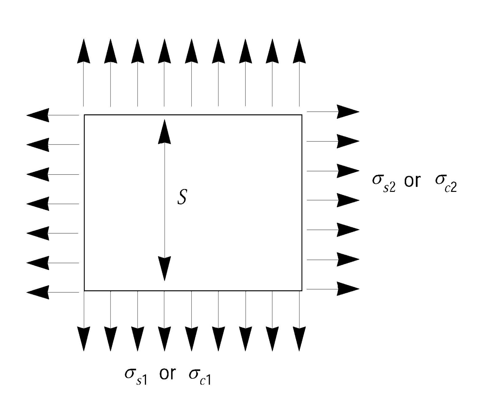

# Rules and Guidance for the Classification of Mobile Offshore Drilling Units

> RULES AND GUIDANCE FOR OFFSHORE STRUCTURES / RB-13-E / 2025 / EN / Rules

## CHAPTER 3 CONSTRUCTION, STRENGTH AND MATERIALS

### Section 1 General

#### 101. Application

- **1.** Where the service area, operation area or operation season is restricted, the construction and equipment of the unit may be suitably modified, based on its condition under the approval of the Society.
- **2.** Unless otherwise specially specified in this rule, the relevant requirements specified in **Rules for the Classification of Steel Ships** and **Rules for the Classification of Steel Barges** are correspondingly applied.

### Section 2 Access

#### 201. General

- **1.** Each space within the unit should be provided with at least one permanent means of access to enable, throughout the life of a unit, overall and close-up inspections and thickness measurements of the unit’s structures to be carried out by the Administration, the company, and the unit’s personnel and others as necessary. Such means of access should comply with the provisions of paragraph **204.** and with the Technical provisions for means of access for inspections, adopted by the Maritime Safety Committee by resolution MSC.133(76), as may be amended by the Organization. Detail of access should be applied in accordance with Annex 2 in Guidance relating to this Rules.
- **2.** Where a permanent means of access may be susceptible to damage during normal operations or where it is impracticable to fit permanent means of access, the Administration may allow, in lieu thereof, the provision of movable or portable means of access, as specified in the Technical provisions, provided that the means of attaching, rigging, suspending or supporting the portable means of access forms a permanent part of the unit’s structure. All portable equipment should be capable of being readily erected or deployed by the unit’s personnel.
- **3.** The construction and materials of all means of access and their attachment to the unit’s structure should be to the satisfaction of the Administration. The means of access should be subject to inspection prior to, or in conjunction with, its use in carrying out surveys in accordance with **Ch 2**.

#### 202. Safe access to holds, tanks, ballast tanks and other spaces

- **1.** Safe access to holds, cofferdams, tanks and other spaces should be direct from the open deck and such as to ensure their complete inspection. Safe access may be from a machinery space, pump-room, deep cofferdam, pipe tunnel, hold, double hull space or similar compartment not intended for the carriage of oil or hazardous materials where it is impracticable to provide such access from an open deck.
- **2.** Tanks, and subdivisions of tanks, having a length of 35 m or more, should be fitted with at least two access hatchways and ladders, as far apart as practicable. Tanks less than 35 m in length should be served by at least one access hatchway and ladder. When a tank is subdivided by one or more swash bulkheads or similar obstructions which do not allow ready means of access to the other parts of the tank, at least two hatchways and ladders should be fitted.
- **3.** Each hold should be provided with at least two means of access as far apart as practicable. In general, these accesses should be arranged diagonally, e.g., one access near the forward bulkhead on the port side, the other one near the aft bulkhead on the starboard side.

#### 203. Access manual

- **1.** A unit’s means of access to carry out overall and close-up inspections and thickness measurements should be described in an access manual which may be incorporated in the unit’s operating manual. The manual should be updated as necessary, and an updated copy maintained on board. The structure access manual should include the following for each space:
  - **(1)** plans showing the means of access to the space, with appropriate technical specifications and dimensions;
  - **(2)** plans showing the means of access within each space to enable an overall inspection to be carried out, with appropriate technical specifications and dimensions. The plans should indicate from where each area in the space can be inspected;
  - **(3)** plans showing the means of access within the space to enable close-up inspections to be carried out, with appropriate technical specifications and dimensions. The plans should indicate the positions of critical structural areas, whether the means of access is permanent or portable and from where each area can be inspected;
  - **(4)** instructions for inspecting and maintaining the structural strength of all means of access and means of attachment, taking into account any corrosive atmosphere that may be within the space;
  - **(5)** instructions for safety guidance when rafting is used for close-up inspections and thickness measurements;
  - **(6)** instructions for the rigging and use of any portable means of access in a safe manner;
  - **(7)** an inventory of all portable means of access; and
  - **(8)** records of periodical inspections and maintenance of the unit’s means of access.
- **2.** For the purpose of this paragraph "critical structural areas" are locations which have been identified from calculations to require monitoring or from the service history of similar or sister units to be sensitive to cracking, buckling, deformation or corrosion which would impair the structural integrity of the unit.

#### 204. General technical specifications

- **1.** For access through horizontal openings, hatches or manholes, the dimensions should be sufficient to allow a person wearing a self-contained air-breathing apparatus and protective equipment to ascend or descend any ladder without obstruction and also provide a clear opening to facilitate the hoisting of an injured person from the bottom of a confined space. The minimum clear opening should not be less than 600 mm × 600 mm. When access to a hold is arranged through a flush manhole in the deck or a hatch, the top of the ladder should be placed as close as possible to the deck or hatch coaming. Access hatch coamings having a height greater than 900 mm should also have steps on the outside in conjunction with the ladder.
- **2.** For access through vertical openings, or manholes, in swash bulkheads, floors, girders and web frames providing passage through the length and breadth of the space, the minimum opening should be not less than 600 $\mathrm{mm}$ × 800 $\mathrm{mm}$ at a height of not more than 600 $\mathrm{mm}$ from the bottom shell plating unless gratings or other footholds are provided.

### Section 3 Design Loads

#### 301. Loads

- **1.** The modes of operation for each unit are to be investigated using realistic loading conditions including gravity loading with relevant environmental loading for its intended areas of operation. The following environmental considerations should be included where applicable: wind, wave, current, ice, seabed conditions, temperature, fouling and earthquake.
- **2.** Drawings of a unit are to be approved for the environmental conditions. Where possible, the above design environmental conditions apply to units and structural members should be based upon significant data with a period of recurrence of at least 50 years for the most severe anticipated environment.
- **3.** Results from relevant model tests may be used to substantiate or amplify calculations.
- **4.** Limiting design data for each mode of operation should be stated in the operating manual.

#### 302. Wind loads

Sustained and gust wind velocities, as relevant, should be considered when determining wind loading. Pressures and resultant forces should be calculated by the method referred to in section 4.2 or by some other method to the satisfaction of the Society.

#### 303. Wave loads

- **1.** Design wave criteria should be described by design wave energy spectra or deterministic design waves having appropriate shape and size. The design wave height to be used for wave load calculation may be specified by the Owner under the approval of the Society. The design wave period to be used for wave load calculation is to be the period which gives the maximum effect to the unit.
- **2.** The wave forces utilized in the design analysis should include the effects of immersion, heeling and accelerations due to motion.
- **3.** In calculating wind loads, the following requirements are to be applied.
  - **(1)** The wave loads are to be calculated, based on acceptable wave theories appropriate to the design depth of water at the operation area subject to the approval by the Society. The wave loads, however, may be determined from the tank test approved by the Society on a model of the unit.
  - **(2)** Waves from all directions are to be considered on the unit.
  - **(3)** The wave loads produced by shipping water on the deck, the loads acting directly on the immersed elements of the unit and the loads resulting from heeled positions or accelerations due to its motion are also to be considered.
  - **(4)** The vibration induced by waves is also to be considered.

#### 304. Current loads

Consideration should be given to the interaction of current and waves. Where necessary, the two should be superimposed by adding the current velocity vectorially to the wave particle velocity. The resultant velocity should be used in calculating the structural loading due to current and waves.

#### 305. Loads due to vortex shedding

Consideration should be given to loading induced in structural members due to vortex shedding.

#### 306. Deck loads

For deck loads, uniform and concentrated loads on the respective portions of the deck in each mode of operation and transit condition are to be taken into account. The values of the uniform loads, however, are not to be less than given in **Table 3.1.**

**Table 3.1 Deck Loads**

| Kind of deck | Minimum load ($\mathrm{kN}/m ^{2}$) |
| --- | --- |
| Helicopter deck | 2 |
| Accommodation spaces (including corridors and similar spaces) | 4.5 |
| Work areas and machinery spaces | 9 |
| Storage areas | 13 |

#### 307. Other loads

Other relevant loads should be determined in a manner to the satisfaction of the Society.

### Section 4 Calculation of Strength

#### 401. Structural analysis

The unit is to be analysed by the method deemed appropriate by the Society for a sufficient number of conditions including all conditions specified in **Ch 1, 107.**

#### 402. Analysis of units resting on the sea bed

Units designed to rest on the sea bed are to be analysed assuming the overturning moment due to the combined environmental forces from any direction and the sufficient downward gravity loadings on the support footings or mat to withstand the moment.

#### 403. Plastic analysis

Scantlings of structural members designed on the basis of plastic analysis are to be at the discretion of the Society.

#### 404. Buckling strength

Structural members subject to in-plane loads are to have the sufficient strength against buckling in consideration of their shapes, scantlings, boundary conditions, etc.

#### 405. Fatigue strength

- **1.** The possibility of fatigue damage due to cyclic loading should be considered in the design of self-elevating and column-stabilized units.
- **2.** The area anticipated stress concentration is to be considered to fatigue strength, the fatigue analysis is to be based on the intended mode and area of operations to be considered in the unit's design.
- **3.** The fatigue life is to be based on a period of time equal to the specified design life of the unit. The period is normally not to be taken as less than 20 years.

#### 406. Stress concentration

- **1.** The effect of local stress concentrations is to be considered for notches in members or discontinuous parts of structure.
- **2.** Where the tensile stresses acting on the thickness direction of plating, plate material with suitable through-thickness properties is required in accordance with **Pt 2, Ch 1** of **Rules for the Classification of Steel Ships**.

#### 407. Bending stress

- **1.** When calculating bending stresses of structural members, the effective width of the plate is to be determined in accordance with the requirements in **Pt 3, Ch 1, 602.** of **Rules for the Classification of Steel Ships**.
- **2.** Where subjected to eccentric loadings, an increase of bending stress due to the deflections of the structural members is to be taken into account.

#### 408. Shearing stress

When calculating shearing stresses in bulkheads, plate girder webs, hull side plating, etc., only the effective shear area of web is to be considered as being effective. In this regard, the total depth of the girder may be considered as the web depth.

#### 409. Combination of stresses

- **1.** In obtaining respective local stresses of the structural members, all the stress components concerned are to be summed up. In this case, for tubular members, the effect of circumferential stress due to external pressure is to be considered.
- **2.** The scantlings are to be determined on the basis of criteria which combine, in a rational manner deemed appropriate by the Society, the individual stress components acting on the respective structural members.(See **410.**)

#### 410. Equivalent stress

- **1.** For plate structures, members may be designed according to the equivalent stress criterion, where the equivalent stress is obtained from the following formula.
  $\sqrt { \sigma_x^2 + \sigma_y^2 - \sigma_x \sigma_y + 3 \tau_xy^2}$
  $\sigma_x$, $\sigma_y$ : Stress in the $x$- and $y$-directions at the centre of thickness of the plate, respectively ($\mathrm{N}/mm ^{2}$).
  $\tau_xy$ : Shearing stress in the $x-y$ plane($\mathrm{N}/mm ^{2}$).
- **2.** The equivalent stress specified in **Par 1** is not to exceed 0.7 and 0.9 times the yield strength of the material, for the static loading and combined loading condition specified in **412.**, respectively.

#### 411. Corrosion allowance

- **1.** In case where the unit is fitted with a corrosion protection system deemed appropriate by the Society, with regard to the corrosion allowance specified in **Par 2** reduction may be made as deemed adequate by the Society.
- **2.** Where the unit is not fitted with a corrosion protection system deemed appropriate by the Society, the scantlings determined by the analysing method and the allowable stresses specified in this chapter are to be added by a proper corrosion allowance. In this case, the corrosion allowance is, as a rule, not to be less than 2.5 $\mathrm{mm}$ and is to be determined considering the environmental condition, the means and degree of corrosion protection specified in **Sec 17** and the process of its maintenance. And further, where the requirements in **Rules for the Classification of Steel Ships** or **Rules for the Classification of Steel Barges** are applied, the scantlings are not to be less than those specified in the relevant requirements.

#### 412. Analysis of Overall Strength

- **1.** **Loading conditions**
  Analysis of overall strength is to be performed for the static loading and combined loading specified in the following (1) and (2) in the respective modes of operation specified in **Ch 1, 107.**
  - **(1)** The static loading is a condition in which the unit is afloat or resting on the sea bed in calm sea and is loaded with static loads only such as loads taken in operating condition, dead load of the unit, etc. which affect the overall strength.
  - **(2)** The combined loading is a condition in which the unit is loaded with combined loads of the static loads specified in (1), and dynamic loads such as wind loads, wave loads, etc. which affect the overall strength and loads induced by the accelerative motion of the unit due to these loads and heeling.
- **2.** **Allowable stresses**
  Allowable stresses for static loading and combined loading specified in **Par 1** are not to exceed the values in **Table 3.2** according to the kind of stress.
- **3.** **Combined compressive stress**
  In addition to **Par 2,** when structural members are subjected to axial compression or combined axial compression and bending, the extreme fibre stresses shall comply with the following requirement:
  $f_\frac{a}{F_a} + f_\frac{b}{F_b} \leq 1.0$
  $f_a$ : Calculated compressive stress due to axial force($\mathrm{N}/mm ^{2}$).
  $f_b$ : Calculated compressive stress due to bending ($\mathrm{N}/mm ^{2}$).
  $F_b$ : Allowable compressive stress due to bending prescribed in **Table 3.2** ($\mathrm{N}/mm ^{2}$).
  $F_a$ : Allowable axial compressive stress obtained from the following formula, but is not to exceed $F_b$ ($\mathrm{N}/mm ^{2}$)
  $F_a = \eta \times \sigma_cr,i \times (1 - 0.13 \times \lambda/\lambda_0 )$...................... $\lambda < \lambda_0$
  $= \eta \times \sigma_cr,e \times 0.87$ ....................................... $\lambda \geq \lambda_0$
  $\lambda = kl/r$
  $\lambda _{0} = \sqrt {2 \pi ^{2} \mathrm{E} / \sigma _{y}}$
  $\sigma_y$ : As specified in **Par 2** ($\mathrm{N}/mm ^{2}$).
  $\sigma_cr,i$ : Inelastic column critical buckling stress ($\mathrm{N}/mm ^{2}$).
  $\sigma_cr,e$ : Elastic column critical buckling stress ($\mathrm{N}/mm ^{2}$).
  $\eta$ = 0.6 for static loading
  = 0.8 for combined loading
  $kl$ = Effective unsupported length ($\mathrm{m}$)
  $r$ = Governing radius of gyration associated with $kl$ ($\mathrm{m}$)
  $\mathrm{E}$ = Modulus of elasticity of the material

  **Table 3.2 Allowable Stresses for Static Loading and Combined Loading**

  | Kind of stress | Static loading | Combined loading |
  | --- | --- | --- |
  | Tensile | 0.6 × $\sigma_y$ | 0.8 × $\sigma_y$ |
  | Bending | 0.6 × ($\sigma_y$ or $\sigma_cr$***) | 0.8 × ($\sigma_y$ or $\sigma_cr$***) |
  | Shearing | 0.4 × $\sigma_y$ or 0.6 × $\tau_cr$* | 0.53 × $\sigma_y$ or 0.8 × $\tau_cr$* |
  | Compressive | 0.6 × ($\sigma_y$ or $\sigma_cr$ ***) | 0.8 × ($\sigma_y$ or $\sigma_cr$ *) |
  | * : Whichever is the smaller $\sigma_y$ : Specified minimum yield stress of the material ($\mathrm{N}/mm ^{2}$). $\sigma_cr$ : Critical compressive buckling stress ($\mathrm{N}/mm ^{2}$). $\tau_cr$ : Critical shear buckling stress($\mathrm{N}/mm ^{2}$). |   |   |

#### 413. Scantlings of Structural Members

- **1.** **General**
  - **(1)** For the primary structural members which contribute to the overall strength, the scantlings are to be determined in accordance with the requirements in **Sec 2** and **3.** However, the requirements in **401.** and **412.** may be applied.
  - **(2)** For the structural members subjected to local loads only, the requirements in **Rules for the Classification of Steel Ships** may be applied under the approval of the Society.
- **2.** **Thickness of plating of hull structure**
  The thickness of plating of the primary hull structure such as shell plating which contributes to the overall strength, subjected to distributed loads, is not to be less than obtained from the following formulae, whichever is the greater.
  $75.2S \sqrt {\frac{h _{s}}{K _{e}}} +C \mathrm{mm}$*,* $60.8S \sqrt {\frac{h _{c}}{K _{p}}} +C \mathrm{mm}$
  $S$ : Spacing of transverse or longitudinal frames($\mathrm{m}$).
  $h_s$ : Head of water in static loading specified in **412. 1.**($\mathrm{m}$).
  $h_c$ : Head of water in combined loading specified in **412. 1.**($\mathrm{m}$).
  $K_e$ : As given by the following formulae, whichever is the smaller.
  $\frac{235 - k \sigma_s1}{k} , 1.45 left( \frac{235 - k \sigma_s2}{k} right)$
  $K_p$ : As given in (a) or (b) below.
  $\frac{5750-k ^{2} \sigma _{c1} ^{2}}{235k} , 2 \left( \frac{235-k \left| \sigma _{c2} \right|}{k} \right)$
  $\frac{5750-k ^{2} \sigma _{c1} ^{2}}{235k} , 2 \left( \frac{235-k \left| \sigma _{c1} \right| -k \left| \sigma _{c2} \right|}{k} \right)$
  $\sigma_s1$, $\sigma_s2$ and $\sigma_c1$, $\sigma_c2$ : Axial stresses acting on the plating in static loading and combined loading, respectively ($\mathrm{N}/mm ^{2}$). (See **Fig 3.1**)
  
  Fig 3.1 Axial stress #eqnID-94, #eqnID-95 ,#eqnID-96, #eqnID-97
  $k$ : Material factor, as given in the following.
  Mild steels ----------------------- 1.00
  High tensile steels
  *A 32*, *DH 32*, *EH 32* -------- 0.78
  *AH 36*, *DH 36*, *EH 36* -------- 0.72
  For other high tensile steels, the value of k is to be dedicated at the discretion of the Society.
  $C$ : Corrosion allowance specified in **411.**
- **3.** **Section modulus of transverse or longitudinal frames**
  The section modulus of transverse or longitudinal frames which support the panels prescribed in **Par 2** is to be obtained from the following formula.
  $1079C \left( \frac{kSh _{c} l ^{2}}{235-k \sigma _{c0}} \right) \mathrm{cm ^{3} }$
  $C$ : Coefficient given below.
- **1.** 0 for both ends fixed
- **1.** 5 for both ends simply supported
  $l$ : Span of frames ($\mathrm{m}$).
  $\sigma_c0$ : Axial stress in combined loading ($\mathrm{N}/mm ^{2}$).
  $S$, $h_c$, $k$ : As specified in **Par 2.**
- **4.** **Local buckling of cylindrical shells**
  Unstiffened or ring-stiffened cylindrical shells subjected to axial compression, or compression due to bending, and having proportions which satisfy the following relationship are to be checked for local buckling in addition to the overall buckling as specified in **412.** **Par 3.**
  $D / t>E/9 \sigma _{y}$
  $D$ : Diameter of cylindrical shell
  $t$ : Thickness of shell plating
  ($D$ and $t$ expressed in the same units*.*)
  $\sigma_y$ : Specified minimum yield stress of the material
  $\mathrm{E}$ : Modulus of elasticity of the material
  ($\sigma_y$ and $\mathrm{E}$ expressed in the same unit system*.*)

#### 414. Helicopter Deck

- **1.** **Design loads**
  Plans showing the arrangement, scantlings and details of the helicopter deck are to be submitted. The arrangement plan is to show the overall size of the helicopter deck and the designated landing area. The design load in determining the scantlings of the members of helicopter deck is to be in accordance with following (1) to (3).
  - **(1)** Helicopter landing impact loading
    - **(A)** As for the deck loads in the range where a helicopter takes off or lands, a load of 75 % of the helicopter maximum take-off weight is to be taken on each of two square areas, 0.3 $\mathrm{m}$ × 0.3 $\mathrm{m}$.
    - **(B)** For girders, stanchions, etc., the structural weight of the helicopter deck is to be considered in addition to the helicopter impact loading specified in (A).
    - **(C)** Where the upper deck of a structure or deck house is used as a helicopter deck and the spaces below are normally manned, the impact loading specified in (A) is to be multiplied by a factor of 1.15.
  - **(2)** Stowed helicopter loading
    - **(A)** The deck loads in the space where a helicopter is stowed are to be taken as wheel loadings at maximum take-off weight. In this case, the dynamical effect due to the motion of the unit is also to be taken into account.
    - **(B)** In addition to (A), a uniformly distributed loading of 0.5 $\mathrm{kN}/m ^{2}$, representing wet snow or ice is to be considered, if necessary.
    - **(C)** For girders, stanchions, etc., the structural weight of the helicopter deck is to be considered in addition to the loads specified in (A).
  - **(3)** Minimum deck load
    The minimum deck load for helicopter deck is to be taken as 2 $\mathrm{kN}/m ^{2}$.
- **2.** **Allowable stresses**
  Allowable stresses of the structural members of the helicopter deck are not to exceed the values in **Table 3.3** in association with the design loads prescribed in **Par 1.**

  **Table 3.3 Allowable Stresses**

  | Structural members Design loads | Deck plating | Deck beams | Girders, stanchions, truss supports, etc. |
  | --- | --- | --- | --- |
  | Helicopter landing impact load | * | $\sigma_y$ | 0.9 × $\sigma_y^{'}$ |
  | Stowed helicopter load | $\sigma_y$ | 0.9 × $\sigma_y$ | 0.8 × $\sigma_y^{'}$ |
  | Overall distributed load | 0.6 × $\sigma_y$ | 0.6 × $\sigma_y$ | 0.6 × $\sigma_y^{'}$ |
  | * : At the discretion of the Society. $\sigma_y$ : As specified in **412. 1.** ($\mathrm{N}/mm ^{2}$). $\sigma_y^{'}$ : For members subjected to axial compression, $\sigma_y$ or critical buckling stress, whichever is the smaller($\mathrm{N}/mm ^{2}$). |   |   |   |
- **3.** **Minimum thickness**
  The minimum thickness of helicopter deck plating is not to be less than 6 $\mathrm{mm}$.
- **4.** **Landing appliances other than wheels**
  In case where a helicopter is provided with any other landing appliances other than wheels, the design loads are to be at the discretion of the Society.
- **5.** **Loadings on helicopter deck**
  Wind loadings and possible wave impact loadings on helicopter decks are to be considered. Where in this case, those loadings are in accordance with the discretion of the Society.

#### 415. Position Keeping Systems and Components

- **1.** **General**
  Units provided with position keeping systems equipment in accordance with this Section may have a Additional Installation Notation, "PKS" after the class notation.
- **2.** **Anchoring systems**
  - **(1)** General
    Plans showing the arrangement and completed details of the anchoring system, including anchors, shackles, anchor lines consisting of chain, wire or rope, together with details of fairleads, windlasses, winches, and any other components of the anchoring system and their foundations are to be submitted to the Society.
  - **(2)** Design
    (ⅰ) steady mean offset due to the defined wind, current, and steady wave forces
    (ⅱ) most probable maximum wave induced motions of the moored unit due to wave excitation
    For relatively deep water, the effect from damping and inertia forces in the anchor lines is to be considered in the analysis. The effects of slowly varying motions are to be included when the magnitudes of such motions are considered to be significant.
    The defined 'Operating' and 'Severe Storm' are to be the same as those identified for the design of the unit, unless the Society is satisfied that lesser conditions may be applicable to specific sites.
    In the consideration of column-stabilized units, the value of $C _{s}$ and $C _{h}$, as indicated in **Ch 4, 201.** may be introduced in the analysis for position keeping mooring systems. The intent of **Ch 4, 302. 3**(Wind tunnel test) and of **Ch 4, 302. 4**(Other stability requirements) may also be considered by the Society.

    | Design Condition |   | Anchor Line FOS |   |
    | --- | --- | --- | --- |
    | Design Condition |   | Quasi Static | Dynamic Analysis |
    | Operating | Intact | 2.70 | 2.25 |
    | Operating | Damaged | 1.80 | 1.57 |
    | Operating | Transient | 1.40 | 1.22 |
    | Severe Storm | Intact | 2.00 | 1.67 |
    | Severe Storm | Damaged | 1.43 | 1.25 |
    | Severe Storm | Transient | 1.18 | 1.05 |
    | where, $FOS =PB / T _{\max}$ $PB$ = maximum rated breaking load of the weakest component of the anchor line. $T _{\max}$ = maximum anchor line tension calculated in accordance with (C) or Section 5.1.3.2 of API RP 2SK for each of the following design conditions. (a) Operating Intact: $T _{\max}$ determined under the most severe design environmental conditions for normal operations specified by the Owner or designer with all anchor lines intact. (b) Operating Damaged: $T _{\max}$, under the operating environmental conditions specified above, but assuming the sudden failure of any one anchor line, after reaching a steady-state condition. (c) Operating Transient: $T _{\max}$, under the operating environmental conditions specified above, due to transient motions resulting from the sudden failure of any one anchor line. (d) Severe Storm Intact: $T _{\max}$ determined under the most severe design environmental conditions for severe storm specified by the Owner or designer with all anchor lines intact. (e) Severe Storm Damaged: $T _{\max}$, under the severe storm environmental conditions specified above, but assuming the sudden failure of any one anchor line, after reaching a steady-state condition. (f) Severe Storm Transient: $T _{\max}$, under the severe storm environmental conditions specified above, due to transient motions resulting from the sudden failure of any one anchor line. |   |   |   |
    - **(A)** An analysis of the anchoring arrangements expected to be utilized in the unit's operation is to be submitted to the Society. Among the items to be addressed are:
      - **(a)** Design environmental conditions of waves, winds, currents, tides and ranges of water depth
      - **(b)** Air and sea temperature
      - **(c)** Ice condition (if applicable)
      - **(d)** Description of analysis methodology
    - **(B)** The anchoring system should be designed so that a sudden failure of any single anchor line will not cause progressive failure of remaining lines in the anchoring arrangement.
    - **(C)** Anchoring system components should be designed utilizing adequate factors of safety and a design methodology suitable to identify the most severe loading condition for each component. In particular, sufficient numbers of heading angles together with the most severe combination of wind, current and wave are to be considered, usually from the same direction, to determine the maximum tension in each mooring line. When a particular site is being considered, any applicable cross sea conditions are also to be considered in the event that they might induce higher mooring loads.
      - **(a)** When the Quasi Static Method is applied, the tension in each anchor line is to be calculated at the maximum excursion for each design condition defined in (b) below, combining the following steady state and dynamic responses of the Unit:
      - **(b)** Factors of safety (FOS) are dependent on the design conditions of the system (intact, damaged, or transient), as well as the level of analyses (Quasi static or dynamic analysis). The minimum Quasi Static FOS, specified in the table below, at the maximum excursion of the unit for a range of headings should be satisfied if the quasi static method outlined in (a) is applied. Otherwise, the minimum Dynamic Analysis FOS in the **Table 3.4** should be satisfied, including the effects of line dynamics when these effects are considered significant.
      - **(c)** In general, the maximum wave induced motions of the moored unit about the steady mean offset should be obtained by means of model tests. The Society may accept analytical calculations provided that the proposed method is based on a sound methodology which has been validated by model tests.
      - **(d)** The Society may accept different analysis methodologies provided that it is satisfied that a level of safety equivalent to the one obtained by (a) and (b) above.
      - **(e)** The Society may give special consideration to an arrangement where the anchoring systems are used in conjunction with thrusters to maintain the unit on station.
- **3.** **Equipment**
  - **(1)** Windlass
    - **(A)** The design of the windlass is to provide for adequate dynamic braking capacity to control normal combinations of loads from the anchor, anchor line and anchor handling vessel during the deployment of the anchors at the maximum design payout speed of the windlass. The attachment of the windlass to the hull structure is to be designed to withstand the breaking strength of the anchor line.
    - **(B)** Each windlass is to be provided with two independent power operated brakes and each brake is to be capable of holding against a static load in the anchor lines of at least 50 percent of its breaking strength. Where the Society so allows, one of the brakes may be replaced by a manually operated brake.
    - **(C)** On loss of power to the windlasses, the power operated braking system should be automatically applied and be capable of holding against 50 percent of the total static braking capacity of the windlass.
  - **(2)** Fairleads and sheaves
    Fairleads and sheaves should be designed to prevent excessive bending and wear of the anchor lines. The attachments to the hull or structure are to be such as to withstand the stresses imposed when an anchor line is loaded to its breaking strength.
- **4.** **Anchor line**
  - **(1)** The Society is to be ensured that the anchor lines are of a type that will satisfy the design conditions of the anchoring system.
  - **(2)** Means are to be provided to enable the anchor lines to be released from the unit after loss of main power.
  - **(3)** Means are to be provided for measuring anchor line tensions.
  - **(4)** Anchor lines are to be of adequate length to prevent uplift of the anchors under the maximum design condition for the anticipated area(s) of operation. However, only steady wind, wave and current forces need to be applied in evaluating anchor uplift forces in transient conditions.
- **5.** **Anchors**
  - **(1)** Type and design of anchors are to be to the satisfaction of the Society.
  - **(2)** All anchors are to be stowed to prevent movement during transit.
- **6.** **Quality control**
  Details of the quality control of the manufacturing process of the individual anchoring system components are to be submitted. Components should be designed, manufactured and tested in accordance with recognized standards insofar as possible and practical. Equipment so tested should, insofar as practical, be legibly and permanently marked with the Society's stamp and delivered with documentation which records the results of the tests.
- **7.** **Control stations**
  - **(1)** A manned control station is to be provided with means to indicate anchor line tensions at the individual windlass control positions and to indicate wind speed and direction.
  - **(2)** Reliable means are to be provided to communicate between locations critical to the anchoring operation.
  - **(3)** Means are to be provided at the individual windlass control positions to monitor anchor line tension, windlass power load and to indicate amount of anchor line payed out.
- **8.** **Dynamic positioning systems**
  Thrusters used as a sloe means of position keeping should provided a level of safety equivalent to that provided for anchoring arrangements to the satisfaction of the Society.

### Section 5 Surface Type Units

#### 501. Application

The requirements in this Section apply to surface type units.

#### 502. Ship type units

The hull structure is to be in accordance with the requirements in the Rules, taking account of the followings. Where, however, approved by the Society, the requirements in **Rules for the Classification of Steel Ships** may apply, except the requirements in **Sec 3** and **4**.

#### 503. Barge type units

The hull structure is to be in accordance with the requirements in this rule, taking account of the requirements in **502.** Where, however, approved by the Society, the requirements in **Rules for the Classification of Steel Barges** may apply.

### Section 6 Self-elevating Units

#### 601. Application

The requirements in this Section apply to self-elevating units.

#### 602. Overall strength

The overall strength of the unit is to be in accordance with the requirements in **401.** and **412.** The unbalanced supported condition by the legs, if necessary, is to be considered.

#### 603. Legs

Legs are to be in accordance with the requirements in the following, in addition to the requirements in **602.** However, with regard to the motions of the unit and legs, they may be determined by an analytical method or from a model experiment deemed appropriate by the Society.

#### 604. Hull structure

- **1.** The hull is to be considered as a complete structure having sufficient strength to resist all induced stress while in the elevated position and supported by all legs.
- **2.** The scantlings of the respective hull structural members are to be in accordance with the requirements in **Sec 4** with reference to the loads prescribed in **Sec 3** in addition to **602.**
- **3.** The hull structure, including the parts of the well, etc., is to be good in the continuity of longitudinal strength and transverse strength.
- **4.** Scantlings of units having other than rectangular hull configurations are to be subject to special consideration.

#### 605. Bottom mats

- **1.** The construction of bottom mats is to be designed so that loads transmitted from the legs may be evenly distributed to the respective parts of the mats.
- **2.** The thickness of shell plating of the bottom mats without opening to the sea and scantlings of shell stiffeners are not to be less than determined by the requirements in **413. 2** and **Par 3.** In this case, the top of $h_s$ is at the water level at flood tide, and the top of $h_c$ is 0.6 times the design wave height in the severe storm condition above the water level at the design water depth.
- **3.** The scantlings of watertight bulkheads and their stiffeners provided in the bottom mats are not to be less than determined by the requirements in **Pt 3, Ch 14** of **Rules for the Classification of Steel Ships**. In this case, the top of $h$ is to be substituted to the top of $h_c$ specified in **Par 2.**
- **4.** Where the unit is resting on the sea bed, the effects of scouring are also to be considered. The effects of skirt plates, where provided, are to be specially considered.
- **5.** Mats are to be designed to withstand the shock of touching bottom while the unit is afloat and subject to wave motions.

#### 606. Deck elevating apparatus and load carrying members

- **1.** Operating device, mechanism, strength and safety equipment of the deck elevating apparatus are to be in accordance with the requirements in **Ch 5, 204.**
- **2.** Load carrying members which transmit loads from the legs to the hull are to have sufficient strength for the loads prescribed in **603.** and **Par 3.**
- **3.** Load carrying members are to be arranged so that loads transmitted from the legs are properly diffused into the hull structure.

#### 607. Deckhouses

- **1.** Deckhouses are to have sufficient strength for their size, function and locations and are to be constructed to approval plans.
- **2.** General scantlings are to comply with the requirements in **Pt 3, Ch 17** of **Rules for the Classification of Steel Ships** and the scantlings of enclosed spaces are to comply with the requirements for bulkheads of unprotected house fronts in **Pt 3, Ch 17** of **Rules for the Classification of Steel Ships**.

#### 608. Sea bed condition

Sea bed conditions are to be based upon the designer's assumptions, and these assumptions are to be recorded in the Operating Booklet. The operator is to be watchful against that actual conditions do not impose more severe loadings on the unit.

#### 609. Wave clearance

The unit is to be designed for a crest clearance of either 1.2 $\mathrm{m}$, or 10 % of the combined storm tide, astronomical tide and height of the maximum wave crest above the mean low water level, whichever is the smaller, between the underside of the unit in the elevated position and the crest of the design wave. This crest elevation is to be measured above the level of the combined astronomical and storm tides.

#### 610. Preload capability

For units without bottom mats, all legs are to have the capability of being preloaded to the maximum applicable combined gravity plus overturning load. The approved preload procedure should be included in the Operating Booklet.

### Section 7 Column-stabilized Units

#### 701. Application

The requirements in this Section apply to the column-stabilized units.

#### 702. Overall strength

- **1.** The overall strength of the unit is to be in accordance with the requirements in **412.**
- **2.** For units of this type, the highest stresses may be associated with less severe environmental conditions than the maxima specified by the owner or designer. Particular attention is to be given to such a case.

#### 703. Strength of structure in way of position mooring system

Local structure in way of fairleads, winches, etc., forming a part of the position mooring system, is to be designed to the breaking strength of the mooring line or chain.

#### 704. Upper structure

- **1.** The scantlings of the upper structure are not to be less than those required by **Rules for the Classification of Steel Ships** in association with the loadings indicated on the deck loading plan. These loadings are not to be less than the requirements specified in **306.**
- **2.** When the upper structure is considered to be an effective member of the overall structural frame of the unit, the scantlings are to be sufficient to withstand actual local loadings plus any additional loadings superimposed due to frame action, within the stress limitations of **Sec 4.**
- **3.** When upper structure is designed to be floating in any mode of operation or damaged condition, or to meet stability requirements, it is to be subject to special consideration.
- **4.** Deckhouses fitted to the upper structure are to be designed in accordance with the requirements in **Pt 3, Ch 17** of **Rules for the Classification of Steel Ships**. The construction and scantlings of deckhouses provided on the hull of the unit are to be determined, taking account of their location and the environmental conditions in which the unit will operate.
- **5.** The upper structure, including the parts of the well, etc., is to be good in the continuity of longitudinal strength and transverse strength.
- **6.** Unless deck structures are designed for wave impact, a clearance acceptable to the Society should be maintained between passing wave crests and the deck structure. The Administration should be provided with model test data, reports on past operating experience with similar configurations or by calculations showing that adequate provision is made to maintain this clearance.
- **7.** The structural arrangement of the upper hull is to be considered with regard to the structural integrity of the unit after the assumed failure of any primary girder. The Society may require a structural analysis showing satisfactory protection against overall collapse of the unit after such an assumed failure when exposed to environmental loading corresponding to a one-year return period for the intended area of operation.

#### 705. Column, lower hulls and footings

- **1.** Where columns, lower hulls or footings are of stiffened shell construction, the scantlings of plating, stiffeners, girders, etc. are not to be less than determined by the requirements in **413. 2** and **Par 3.** In this case, $h_s$ and $h_c$ are to be in accordance with the requirements in the followings.
  - **(1)** Where an internal space is loaded with liquid, $h_s$ is the vertical distance in metres from the load line to the tank top and $h_c$ is the vertical distance in metres from the tank top to the top of overflow pipes. Where, however, the specific gravity of the liquid is greater than that of sea water, $h_s$ and $h_c$ are to be modified taking account of specific gravity.
  - **(2)** Where an internal space is a void compartment, the top of $h_s$ is at the load line and the top of $h_c$ is 0.6 times the design wave height in the severe storm condition above the water level at the design water depth.
  - **(3)** The minimum values of $h_s$ and $h_c$ are not to be less than 6 metres for areas subject to wave immersion and 3.4 metres for other areas.
- **2.** Where columns, lower hulls or footings are designed as shells either unstiffened or ring stiffened, the scantlings of shell plating and ring stiffeners are to be determined to satisfy the strength requirements in **Sec 4** in response to the design heads, $h_s$ and $h_c$, specified in **Par 1.**
- **3.** The scantlings of deep tank bulkheads and their stiffeners provided in columns, lower hulls or footings are not to be less than determined by the requirements in **Pt 3, Ch 15** of **Rules for the Classification of Steel Ships**.
- **4.** When column, lower hull or footing is an effective member for the overall strength of the unit, the stress resulting from the overall strength is to be added by the stress determined by the requirements in **Par 1.**
- **5.** Where a column, lower hull or footing is a part of the overall structural frame of a unit, consideration should also be given to stresses resulting from deflections due to the applicable combined loading.
- **6.** Particular consideration is to be given to structural details, reinforcement, etc., in areas subject to high local loadings indicated in the followings ;
  - **(1)** Areas subject to bottom bearing loads, where applicable,
  - **(2)** Bulkheads of partially filled tanks, etc.,
  - **(3)** Areas liable to sustain external damages,
  - **(4)** Jointed parts between columns and footings or lower hulls,
  - **(5)** Areas subject to wave impact.
- **7.** Where a unit is designed for operations while supported by the sea bed, the effects of scouring are to be considered. The effects of skirt plates, where provided, are to be specially considered.

#### 706. Bracing members

- **1.** Bracing members are to be designed to transmit loadings and to make the hull structure effective against environmental forces, and when the unit is supported by the sea bed, against the possibility of uneven bearing loads.
- **2.** Bracing members are to have sufficient strength for buoyancy, wave and current forces and wave impact.
- **3.** When bracing members are of tubular section, ring frames may be required to maintain stiffness and roundness of shape.
- **4.** When bracings are watertight, they are to be suitably designed to prevent collapse from external hydrostatic pressure.
- **5.** When any one slender bracing member are lost, overall strength of unit is compiled with the following requirements where overall structure analysis are carried out based upon the design loads specified in **Sec 3.**
  - **(1)** For determining the design loads, environmental loads such as wind force, wave force, etc,. are to be obtained from not less than 1 year return period.
  - **(2)** Notwithstanding the kind of stress, the allowable stress at the combined loads condition is to be following formulae.
    $\sigma_a = \sigma_Y$
    $\sigma_a$ : allowable stress ($\mathrm{N}/mm ^{2}$)
    $\sigma_Y$ : specified yield stress of materials ($\mathrm{N}/mm ^{2}$)
  - **(3)** In case of taking into consideration of combined compression stress, $\eta$ specified **412. 3** may be 1.0
- **6.** Underwater bracing members are to be provided with a leak detection system make it possible to detect fatigue cracks at an early stage.
- **7.** The unit’s structure should be able to withstand the loss of any slender bracing member without causing overall collapse when exposed to environmental loading corresponding to a one-year return period for the intended area of operation.
- **8.** Consideration should be given to the need for ring frames to maintain stiffness and shape in tubular bracing members.

#### 707. Wave clearance

- **1.** Unless deck structures are designed either in accordance with the requirements in **704. 3** or by considering wave impact, to the satisfaction of the Society, reasonable clearance between the lower surface of deck structure and the wave crest is to be ensured for all afloat modes of operation, taking into account the predicted motion of the unit relative to the surface of the sea.
- **2.** For on-bottom modes of operation, clearances are to be in accordance with those specified in **609.**

### Section 8 Towing Arrangements

#### 801. General

- **1.** The design and arrangement of towing fittings should have regard to both normal and emergency conditions.
- **2.** Equipments and fittings provided in accordance with **Par 1** should meet the appropriate requirements of recognized standards acceptable to the Society(KS, JIS etc.) and arrangements are to be submitted to the Society for the approval.(Refer to the **Guidelines for safe ocean towing (MSC/Circ.884)**).
- **3.** Each fitting or item of equipment provided under this regulation should be clearly marked with any restrictions associated with its safe operation, taking into account the strength of its attachment to the unit’s structure.

### Section 9 Fatigue Analysis

#### 901. General

- **1.** The possibility of fatigue damage due to cyclic loading should be considered in the design of self-elevating and column-stabilized units.
- **2.** The area anticipated stress concentration is to be considered to fatigue strength, the fatigue analysis is to be based on the intended mode and area of operations to be considered in the unit's design.
- **3.** The fatigue analysis should take into account the intended design life of the unit and the accessibility of load-carrying members for inspection. The fatigue life is normally not to be taken as less than 20 years.

### Section 10 Materials

#### 1001. General

- **1.** Rolled steels, steel castings and steel forgings used for hull construction and equipment are to be in accordance with the requirements in **Pt 2, Ch 1** of **Rules for the Classification of Steel Ships**. Where it is proposed to use steel or other material having properties differing from those specified in the Rules, the specification and properties of such material shall be submitted to the Society for consideration and special approval. Due consideration is to be given to the ratio of yield to ultimate strength of the materials to be used, and to their suitability with regard to structural location and to design temperatures.
- **2.** Consideration should be given to the minimization of hazardous substances used in the design and construction of the unit, and should facilitate recycling and removal of hazardous materials. (Refer to the Guidelines on ship recycling, adopted by the Organization by resolution A.962(23)).
- **3.** Materials which contain asbestos should be prohibited.

#### 1002. Categories of structural members of self-elevating units and column-stabilized units

Structural members are to be grouped into the following three material application categories according to the design.

#### 1003. Categories of structural members of surface type units

- **1.** **Primary structural members**
  Sheer strake, deck stringer, bilge strake, hatch corner in way of stress concentration part which are outer 0.4$L$ but within 0.6$L$ amidship and primary structural members except those specified in **Par 3** such as bottom plating, side plating, deck plating, longitudinals on deck, etc. within 0.4 amidship.
- **2.** **Secondary structural members**
  Inner members of those specified in **Par 1** and stern frame, rudder plate, etc., and sheer strake, deck stringer, bilge strake, hatch corner in way of stress concentration part which are outer 0.6$L$ amidship and primary structural members such as bottom plating, side plating, deck plating, longitudinals on deck etc. which are outer 0.4$L$ amidship.
- **3.** **Special portions of structural members**
  Special members which are specially important in longitudinal strength viewpoint, such as sheer strake, deck stringer, bilge strake, hatch corner in way of stress concentration part which are within 0.4$L$ amidship.

#### 1004. Definition of design service temperature of materials

Design service temperature of materials is the lowest of the daily average atmospheric temperatures, based on meteorological data, for any anticipated area of operation. If the data of the lowest daily average temperature are not available, the lowest monthly average temperature may be used. The design service temperature, however, need not be lower than 0℃ for members which are below the light draught.

#### 1005. Application of steels

- **1.** Application of rolled steels for surface type units is to be in accordance with the requirements in **Pt 3, Ch 1, Sec 4** of Rules for the Classification of Steel Ships.
- **2.** Application of rolled steels for self-elevating units and column-stabilized units is to be in accordance with **Table 3.5** to **3.7** depending on the categories of structural members, thickness and design service temperature.

  | Steel Grade | Minimum Design Temperature |   |   |   |   |   |
  | --- | --- | --- | --- | --- | --- | --- |
  | Steel Grade | 0°C | -10°C | -20°C | -30°C | -40°C | -50°C |
  | A | 20 | 10 | * | * | * | * |
  | B | 25 | 20 | 10 | * | * | * |
  | D | 45 | 40 | 30 | 20 | 10 | * |
  | E | 50 | 50 | 50 | 40 | 30 | 20 |
  | AH32, AH36, AH40 | 25 | 20 | 10 | * | * | * |
  | DH32, DH36, DH40 | 45 | 40 | 30 | 20 | 10 |   |
  | EH32, EH36, EH40 | 50 | 50 | 50 | 40 | 30 | 20 |
  | FH32, FH36, FH40 | 50 | 50 | 50 | 50 | 50 | 40 |
  | AH43, AH47, AH51, AH56, AH63, AH70 | 20 | * | * | * | * | * |
  | DH43, DH47, DH51, DH56, DH63, DH70 | 45 | 35 | 25 | 15 | * | * |
  | EH43, EH47, EH51, EH56, EH63, EH70 | 50 | 50 | 45 | 35 | 25 | 15 |
  | FH43, FH47, FH51, FH56, FH63, FH70 | 50 | 50 | 50 | 50 | 45 | 35 |

  | Steel Grade | Minimum Design Temperature |   |   |   |   |   |
  | --- | --- | --- | --- | --- | --- | --- |
  | Steel Grade | 0°C | -10°C | -20°C | -30°C | -40°C | -50°C |
  | A | 30 | 20 | 10 | * | * | * |
  | B | 40 | 30 | 20 | 10 | * | * |
  | D | 50 | 50 | 45 | 35 | 25 | 15 |
  | E | 50 | 50 | 50 | 50 | 45 | 35 |
  | AH32, AH36, AH40 | 40 | 30 | 20 | 10 | * | * |
  | DH32, DH36, DH40 | 50 | 50 | 45 | 35 | 25 | 15 |
  | EH32, EH36, EH40 | 50 | 50 | 50 | 50 | 45 | 35 |
  | FH32, FH36, FH40 | 50 | 50 | 50 | 50 | 50 | 50 |
  | AH43, AH47, AH51, AH56, AH63, AH70 | 40 | 25 | 10 | * | * | * |
  | DH43, DH47, DH51, DH56, DH63, DH70 | 50 | 45 | 35 | 25 | 15 | * |
  | EH43, EH47, EH51, EH56, EH63, EH70 | 50 | 50 | 50 | 45 | 35 | 25 |
  | FH43, FH47, FH51, FH56, FH63, FH70 | 50 | 50 | 50 | 50 | 50 | 45 |

  | Steel Grade | Minimum Design Temperature |   |   |   |   |   |
  | --- | --- | --- | --- | --- | --- | --- |
  | Steel Grade | 0°C | -10°C | -20°C | -30°C | -40°C | -50°C |
  | A | * | * | * | * | * | * |
  | B | 15 | * | * | * | * | * |
  | D | 30 | 20 | 10 | * | * | * |
  | E | 50 | 45 | 35 | 25 | 15 | * |
  | AH32, AH36, AH40 | 15 | * | * | * | * | * |
  | DH32, DH36, DH40 | 30 | 20 | 10 | * | * | * |
  | EH32, EH36, EH40 | 50 | 45 | 35 | 25 | 15 | * |
  | FH32, FH36, FH40 | 50 | 50 | 50 | 50 | 40 | 30 |
  | AH43, AH47, AH51, AH56, AH63, AH70 | * | * | * | * | * | * |
  | DH43, DH47, DH51, DH56, DH63, DH70 | 25 | 15 | * | * | * | * |
  | EH43, EH47, EH51, EH56, EH63, EH70 | 50 | 40 | 30 | 20 | 10 | * |
  | FH43, FH47, FH51, FH56, FH63, FH70 | 50 | 50 | 50 | 40 | 30 | 20 |

### Section 11 Anti-fouling Systems

#### 1101. General

If anti-fouling systems are installed, they should conform to the requirements of the International Convention on the Control of Harmful Anti-fouling Systems on Ships, 2001.

### Section 12 Protective Coatings of Dedicated Seawater Ballast Tanks

#### 1201. General

- **1.** All dedicated seawater ballast tanks should be coated during construction in accordance with the **IMO Res. MSC. 215(82)**. For the purpose of this section pre-load tanks on self-elevating units are to be considered dedicated seawater ballast tanks. Mat tanks and spud cans on such units are not to be considered dedicated seawater ballast tanks.
- **2.** Maintenance of the protective coating system should be included in the overall unit’s maintenance scheme. The effectiveness of the protective coating system should be verified during the life of a unit by the Society, based on the guidelines developed by the Organization(**MSC.1/Circ. 1330**)).

### Section 13 Construction Portfolio

#### 1301. General

A construction portfolio should be prepared and a copy placed on board the unit. It should include plans showing the location and extent of application of different grades and strengths of materials, together with a description of the materials and welding procedures employed, and any other relevant construction information. Restrictions or prohibitions regarding repairs or modifications should be included.

### Section 14 Welding

#### 1401. General

The welding procedures employed during construction should be to a recognized international standard. Welders should be qualified in the welding processes and procedures utilized. The selection of welds for testing and the methods utilized should meet the requirements of the society.

#### 1402. Welding structure

- **1.** Welded joints of crossing parts at the ends of columns and bracings are, as a rule, to be of full-penetration type.
- **2.** Size of fillet welds applied to respective internal structural members of columns and bracings is to be F1 specified in **Pt 3, Ch 1, Table 3.1.4** of **Rules for the Classification of Steel Ships**.
- **3.** For welded joints other than specified in **Par 1** and **2,** welding is to be in accordance with the requirements in **Pt 3, Ch 1, Sec 5** of **Rules for the Classification of Steel Ships**.
- **4.** Welding is to be carried out by the personnel qualified by the Society in accordance with the approved welding specification.

#### 1403. Joints of special design

In case of welded joints of special design, the Society may require tests to check the strength of the joints and any defects.

#### 1404. Underwater welding

Welders to be engaged in underwater welding are to be those who have been accepted through the qualification test approved by the Society.

### Section 15 Drainage and Sediment Control

#### 1501. General

All ballast and preload tanks and related piping systems should be designed to facilitate effective drainage and removal of sediments. Coatings which could entrain sediments and harmful aquatic organisms should be avoided.

### Section 16 Ice Strengthening

#### 1601. Reinforcement

- **1.** Units designed to be located in areas where ice strengthening may be necessary will be specially considered and, provided that the unit is reinforced as necessary for operation in the specified ice conditions to the satisfaction of the Society, and an appropriate Additional Special Feature Notations may be added to the Class Notation by the Society.
- **2.** Ice strengthening for surface type units is to be in accordance with **Pt 3, Ch 20** of **Rules for the Classification of Steel Ships.**

### Section 17 Corrosion Control

#### 1701. General

All steelworks are to be coated with a paint of good quality or to be corrosion controlled with an effect equivalent to or more than paint. Where, however, the requirements in **Ch 2, 304.** are applied, special considerations are to be paid to the prevention of corrosion.

### Section 18 Guardrails and Bulwarks

#### 1801. General

- **1.** Guardrails or bulwarks are to be provided on all exposed decks in order to prevent failing. The height and arrangement of the guardrails or bulwarks are to be in accordance with the requirements specified in **Pt 4, Ch 4** of **Rules for the Classification of Steel Ships**.
- **2.** Regardless of the requirements in **Par 1,** suitable wirenets may be provided to the helicopter deck in a plane nearly same as the deck surface instead of the guardrails or bulwarks, if guardrails or bulwarks will become hindrances to take-off and landing of helicopters.
- **3.** Regardless of the requirements in **Par 1,** guardrails or bulwarks which interfere with the operation may be eliminated under the approval of the Society upon the request of the Owner.

### Section 19 Temporary or Emergency Mooring Equipment

#### 1901. General

Anchors, anchor chains and ropes necessary for temporary or emergency mooring are to be provided on units in accordance with the requirements in **Pt 4, Ch 8** of **Rules for the Classification of Steel Ships** according to their equipment number specified in **1902.** Where, however, deemed appropriate by the Society, the requirements in **Ch 19** of **Rules for the Classification of Steel Barges** may be applied to the mooring equipment of units having no propelling machinery. And further, the mooring equipment of units moored for long period of time or semi-permanently is to be at the discretion of the Society.

#### 1902. Equipment number

- **1.** The equipment number of surface type units is to comply with the requirements in **Pt 4, Ch 8** of **Rules for the Classification of Steel Ships** for ship type units and **Ch 19** of **Rules for the Classification of Steel Barges** for barge type units.
- **2.** The equipment number of self-elevating units and column-stabilized units is to be obtained from the following formula.
  $\Delta ^{\frac{2}{3}} + 2A_1 + 0.1 A_2$
  $\Delta$ : Displacement of the unit in temporary mooring condition($\mathrm{t}$).
  $A_1$ and $A_2$ : projected areas except that of legs of self-elevating units, above the water line on planes perpendicular and parallel to the centre line of the unit, respectively ($\mathrm{m}^2$).

#### 1903. Equivalent mooring equipment

- **1.** A part or whole parts of the temporary mooring arrangement and the mooring equipment for operating condition may be used in each other.
- **2.** If the Society recognizes that the effect of mooring equipment for operating condition is equivalent to that of the temporary mooring equipment specified in **1901.**, such mooring equipment for operating condition is regarded as the temporary mooring equipment specified in this Chapter.
- **3.** Where approved by the Society, wire ropes, which is possessed breaking load not to be less than the breaking test load of anchor chain, may be used in lieu of anchor chain. In this case, however, the wire ropes are to satisfy the requirements in **Pt 4, Ch 8, Sec 5** of **Rules for the Classification of Steel Ships**.

#### 1904. Windlass

Units, except for those moored for a long period of time or semi-permanently, are to be provided with windlasses having a sufficient hoisting capacity. 
