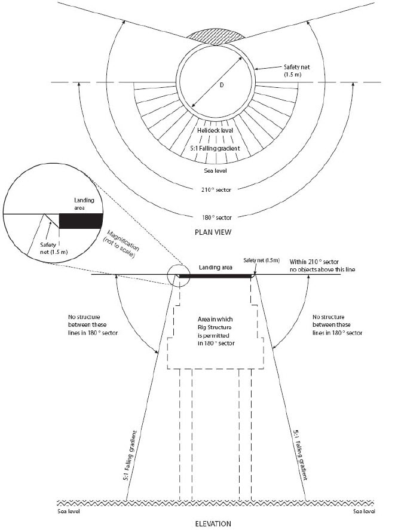
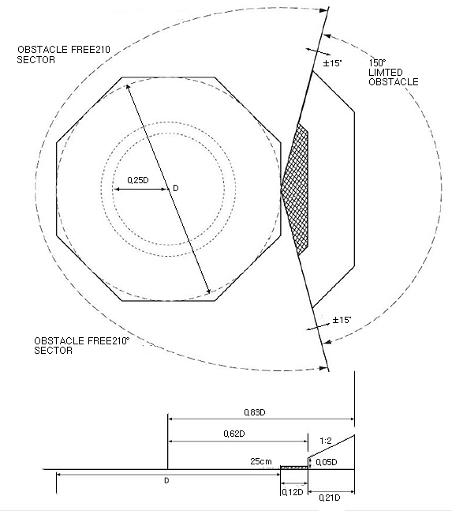
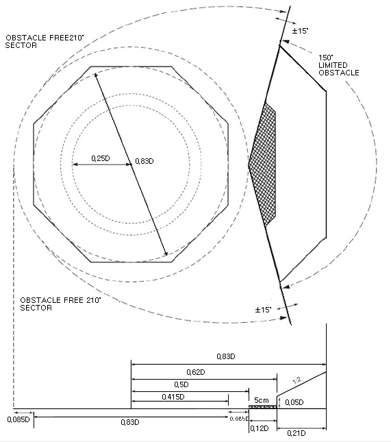
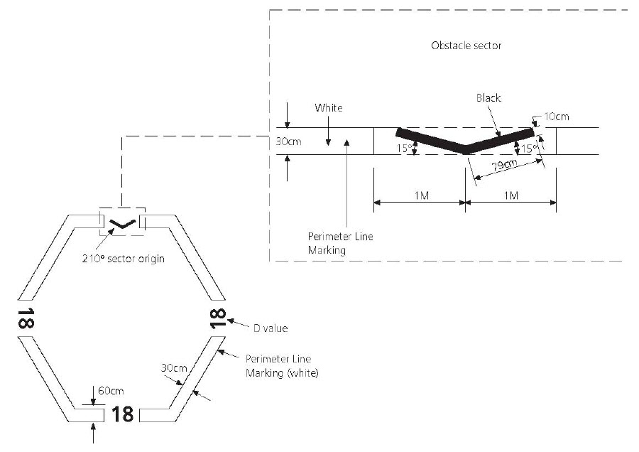

# Rules and Guidance for the Classification of Mobile Offshore Drilling Units

> RULES AND GUIDANCE FOR OFFSHORE STRUCTURES / RB-13-E / 2025 / EN / Rules

## CHAPTER 12 HELICOPTER FACILITIES

### Section 1 General

#### 101. General

Each helideck should be of sufficient size and located so as to provide a clear take-off and approach to enable the largest helicopter using the helideck to operate under the most severe conditions anticipated for helicopter operations.

### Section 2 Definitions

#### 201. General

- **1.** Final approach and take-off area (FATO) is a defined area over which the final phase of the approach manoeuvre to hover or landing of the helicopter is intended to be completed and from which the take-off manoeuvre is intended to be commenced.
- **2.** Limited obstacle sector (LOS) is a sector extending outward which is formed by that portion of the 360° arc, excluding the obstacle-free sector, the centre of which is the reference point from which the obstacle-free sector is determined. Obstacles within the limited obstacle sector are limited to specified heights.
- **3.** Obstacle is any object, or part thereof, that is located on an area intended for the movement of a helicopter on a helideck or that extends above a defined surface intended to protect a helicopter in flight.
- **4.** Obstacle-free sector is a complex surface originating at, and extending from, a reference point on the edge of the FATO of a helideck, comprised of two components, one above and one below the helideck for the purpose of flight safety within which only specified obstacles are permitted.
- **5.** Touchdown and lift-off area (TLOF) is a dynamic load-bearing area on which a helicopter may touch down or lift off. For a helideck it is presumed that the FATO and the TLOF will be coincidental.

### Section 3 Construction

#### 301. General

- **1.** The helideck should be of a design and construction, adequate for the intended service and for the appropriate prevailing climatic conditions, approved to the satisfaction of the Society.
- **2.** Except as provided for in Par 3, the helideck should meet the following provisions, with reference to the ICAO Convention, Annex 14, Volume II (Heliports), taking into account the type of helicopter used, the conditions of wind, turbulence, sea state, water temperature and icing conditions:
  - **(1)** the helideck should be of sufficient size to contain an area within which can be drawn a circle of diameter not less than D for single main rotor helicopters;
  - **(2)** a helideck obstacle-free sector should comprise of two components, one above and one below helideck level (see **Fig 12.1**):
    
    Figure 12.1 – Obstacle free areas – below landing area level
    
    Figure 12.2 Helideck obstacle limitation sector: single main rotor helicopters
    - **(A)** above helideck level: The surface should be a horizontal plane level with the elevation of the helideck surface that subtends an arc of at least 210° with the apex located on the periphery of the D reference circle extending outwards to a distance that will allow for an unobstructed departure path appropriate to the helicopter(s) the helideck is intended to serve; and
    - **(B)** below helideck level: Within the (minimum) 210° arc, the surface should additionally extend downward at a 5:1 falling gradient from the edge of the safety net below the elevation of the helideck to water level for an arc of not less than 180° that passes through the centre of the FATO and outwards to a distance that will allow for safe clearance from the obstacles below the helideck in the event of an engine failure for the type of helicopter(s) the helideck is intended to serve (see **Fig 12.1**);
  - **(3)** for single main rotor helicopters, within the 150° LOS out to a distance of 0.12 D, measured from the point of origin of the LOS, objects should not exceed a height of 0.25 m above the helideck. Beyond that arc, out to a distance of an additional 0.21 D, the maximum obstacle height is limited to a gradient of one unit vertically for each two units horizontally originating at a height of 0.05 D above the level of the helideck (see **Fig 12.2**);
  - **(4)** objects the function of which requires that they be located on the helideck within the FATO should be limited to landing nets (where required) and certain lighting systems and should not exceed the surface of the landing area by more than 0.025 m. Such objects should only be present provided they do not cause a hazard to helicopter operations; and
  - **(5)** operations by tandem main rotor helicopters should be specially considered by the Society.
- **3.** For benign climates as determined by the coastal State, taking into account the type of helicopter used, the conditions of wind, turbulence, sea state, water temperature and icing conditions, the helideck should meet the following:
  - **(1)** the helideck should be of sufficient size to contain a circle of diameter no less than 0.83 D;
  - **(2)** a helideck obstacle-free sector shall comprise of two components, one above and one below helideck level (see **Fig 12.1**):
    
    Note: Heights of 2.5cm and 5cm high shaded areas are not to scale
    **Figure 12.3 Helideck obstacle limitation sector: single main rotor helicopters for benign climate conditions as accepted by the coastal State**
    - **(A)** above helideck level: The surface should be a horizontal plane level with the elevation of the helideck surface that subtends an arc of at least 210° with the apex located on the periphery of the D reference circle extending outwards to a distance that will allow for an unobstructed departure path appropriate to the helicopter(s) the helideck is intended to serve, and
    - **(B)** below helideck level: Within the (minimum) 210° arc, the surface should additionally extend downward at a 5:1 falling gradient from the edge of the safety net below the elevation of the helideck to water level for an arc of not less than 180° that passes through the centre of the FATO and outwards to a distance that will allow for safe clearance from the obstacles below the helideck in the event of an engine failure for the type of helicopter(s) the helideck is intended to serve (see **Fig 12.1**);
  - **(3)** for single main rotor helicopters, within 0.415 D to 0.5 D objects should not exceed a height of 0.025 m. Within the 150° LOS out to a distance of 0.12 D, measured from the point of origin of the LOS, objects should not exceed a height of 0.05 m above the helideck. Beyond that arc, out to a distance of an additional 0.21 D, the LOS rises at a rate of one unit vertically for each two units horizontally originating at a height of 0.05 D above the level of the helideck (refer to figure **Fig 12.3**);
  - **(4)** objects the function of which requires that they be located on the helideck within the FATO should be limited to landing nets (where required) and certain lighting systems and should not exceed the surface of the landing area by more than 0.025 m. Such objects should only be present provided they do not cause a hazard to helicopter operations; and
  - **(5)** operations by tandem main rotor helicopters should be specially considered by the Society.
- **4.** The helideck should have a skid-resistant surface.
- **5.** Where the helideck is constructed in the form of a grating, the underdeck should be such that the ground effect is maintained.

### Section 4 Arrangements

#### 401. General

- **1.** The helideck should have recessed tie-down points for securing a helicopter.
- **2.** The periphery of the helideck should be fitted with a safety net except where structural protection exists. The net should be inclined upwards at an angle of 10° and outwards from below the edge of the helideck to a horizontal distance of 1.5 m and should not rise above the edge of the deck.
- **3.** The helideck should have both a main and an emergency personnel access route located as far apart from each other as practicable.
- **4.** Reference should be made to **Ch 10, 403.** **3** concerning helideck drainage.

### Section 5 Visual Aids

#### 501. Wind direction indicator

- **1.** A wind direction indicator should be located on the unit which, in so far as is practicable, indicates the wind conditions over the TLOF in such a way as to be free from the effects of airflow disturbances caused by nearby objects or rotor downwash. It should be visible from a helicopter in flight or in a hover over the helideck. Where the TLOF may be subject to a disturbed air flow then additional wind direction indicators located close to the area should be provided to indicate the surface wind on those areas. Placement of the wind direction indicators should not compromise obstacle-protected surfaces.
- **2.** Units on which night helicopter operations take place should have provisions to illuminate the wind direction indicators.
- **3.** A wind direction indicator should be a truncated cone made of lightweight fabric and should have the following minimum dimensions:
  - Length : 1.2 m
  - Diameter (larger end) : 0.3 m
  - Diameter (smaller end) : 0.15 m
- **4.** The colour of the wind direction indicator should be so selected as to make it clearly visible and understandable from a height of at least 200 m above the heliport, having regard to background. Where practicable, a single colour, preferably white or orange, should be used. Where a combination of two colours is required to give adequate conspicuity against changing backgrounds, they should preferably be orange and white, or red and white, and should be arranged in five alternate bands the first and last band being the darker colour.

#### 502. Heliport identification marking

A heliport identification marking should be located at the centre of the touchdown/positioning marking described in **506.** 1 to 3. It should consist of a white "H" that is 4 m high, 3 m wide, with a stroke width of 0.75 m.

#### 503. D-value marking

- **1.** The actual D-value of the helideck should be painted on the helideck inboard of the chevron provided in accordance with **507.** in alphanumeric symbols of 0.1 m in height.
- **2.** The helideck D-value should also be marked around the perimeter of the helideck in the manner shown in **Fig 12.4** in a colour contrasting (preferably white: avoid black or grey for night use) with the helideck surface. The D-value should be to the nearest whole number with 0.5 rounded down, e.g., 18.5 marked as 18. Markings for some helicopters may require special consideration.(Helidecks designed specifically for AS332L2 and EC 225 helicopters, each having a D-value of 19.5 m, should be rounded up to 20 in order to differentiate between helidecks designed specifically for L1 models.)
  
  Figure 12.4 Obstacle-free sector marking

#### 504. Maximum allowable mass marking

- **1.** A maximum allowable mass marking should be located within the TLOF and so arranged as to be readable from the preferred final approach direction, i.e. towards the obstacle-free sector origin.
- **2.** The maximum allowable mass marking should consist of a two- or three-digit number followed by a letter "t" to indicate the allowable helicopter mass in tonnes (1,000 kg). The marking should be expressed to one decimal place, rounded to the nearest 100 kg. Where States require that a maximum allowable weight is indicated in pounds, the marking should consist of a two- or three-digit number to indicate the allowable helicopter weight in thousands of pounds, rounded to the nearest 1,000 pounds.
- **3.** The height of the figures should be 0.9 m with a line width of approximately 0.12 m and be in a colour (preferably white) which contrasts with the helideck surface. Where possible the mass marking should be well separated from the installation identification marking in order to avoid possible confusion on recognition.

#### 505. TLOF perimeter marking

The TLOF perimeter marking should be located along the perimeter of the TLOF and should consist of a continuous white line with a width of at least 0.3 m. TLOF perimeter markings are typically for a 1 D or 0.83 D value (see **Fig 12.2** and **Fig 12.3**).

#### 506. Touchdown/positioning marking

- **1.** A touchdown/positioning marking should be located so that when the pilot’s seat is over the marking the whole of the undercarriage will be within the TLOF and all parts of the helicopter will be clear of any obstacle by a safe margin.
- **2.** The centre of the touchdown/positioning marking should be concentric to the centre of the TLOF.(The marking may be offset away from the origin of the obstacle-free sector by no more than 0.1 D where an aeronautical study indicates such offsetting to be beneficial, provided that the offset marking does not adversely affect the safety of operations.)
- **3.** A touchdown/positioning marking should be a yellow circle and have a line width of 1 m. The inner diameter of the circle should be half the D-value of the largest helicopter for which the TLOF is designed.

#### 507. Helideck obstacle-free sector marking

- **1.** Except as provided in Par 2, a helideck obstacle-free sector marking should be located on the TLOF perimeter marking and indicated by the use of a black chevron, each leg being 0.8 m long and 0.1 m wide forming the angle in the manner shown in **Fig 12.4** (replaced by **Res.A.1023(26)/Corr.1**). The obstacle-free sector marking should indicate the origin of the obstacle-free sector, the directions of the limits of the sector and the verified D-value of the helideck. Should there not be room to place the chevron where indicated, the chevron marking, but not the point of origin, may be displaced towards the circle centre.
- **2.** For a helideck less than 1 D (i.e. a helideck meeting **301. 3**), a helideck obstacle free sector marking should be located at a distance from the centre of the TLOF equal to the radius of the largest circle which can be drawn in the TLOF or 0.5 D whichever is greater.
- **3.** The height of the chevron should equal the width of the TLOF perimeter marking, but should be not less than 0.3 m. The chevron should be black in colour and may be painted on top of the TLOF perimeter marking in **505**.

#### 508. Unit identification markings

- **1.** The name of the unit should be clearly displayed on unit identification panels located in such positions that the unit can be readily identified from the air and sea from all normal angles and directions of approach. The height of the figures should be at least 0.9 m with a line width of approximately 0.12 m. The unit identification panels should be highly visible in all light conditions and located high up on the unit (e.g., on the derrick). Suitable illumination should be provided for use at night and in conditions of poor visibility.
- **2.** The unit’s name should be provided on the helideck and be positioned on the obstacle side of the touchdown/positioning marking with characters not less than 1.2 m in height and in a colour contrasting with the background.

#### 509. Perimeter lights

- **1.** The perimeter of the TLOF should be delineated by green lights visible omnidirectionally from on or above the landing area. These lights should be above the level of the deck but should not exceed 0.25 m in height for helidecks sized in accordance with **301.** 2 and 0.05 m in height for helidecks sized in accordance with **301.** 3. The lights should be equally spaced at intervals of not more than 3 m around the perimeter of the TLOF, coincident with the white line delineating the perimeter in **505.** 1. In the case of square or rectangular decks there should be a minimum of four lights along each side including a light at each corner of the TLOF. Flush fitting lights may be used at the inboard (150° limited obstacle sector origin) edge of the TLOF where there is a need to move a helicopter or large equipment off the TLOF.
- **2.** Perimeter lights should meet the chromaticity characteristics given in **Table 12.1**, and the vertical beam spread and intensity characteristics given in **Table 12.2**. (If higher intensity lighting is provided to assist in conditions of poor visibility during daylight, it should incorporate a control to reduce the intensity to not more than 60 cd for night use.)

  | Yellow boundary | x = 0.36 - 0.08y |
  | --- | --- |
  | White boundary | x = 0.65y |
  | Blue boundary | y = 0.9 - 0.171x |

  | Elevation | Intensity(cd) |
  | --- | --- |
  | 0 ̊ - 90 ̊ | 60 max |
  | ˃ 20 ̊ - 90 ̊ | 3 min |
  | ˃ 10 ̊ - 20 ̊ | 15 min |
  | 0 ̊ - 10 ̊ | 30 min |
  | Azimuth +180 ̊ - 180 |   |

#### 510. Helideck floodlights

Helideck floodlights should be located so as to avoid glare to pilots, and provision should be made for periodically checking their alignment. The arrangements and aiming of floodlights should be such that helideck markings are illuminated and that shadows are kept to a minimum. Floodlights should conform to the same height limitations specified in **505. 1** for perimeter lights.

#### 511. Obstacle marking and lighting

- **1.** Fixed obstacles and permanent equipment, such as crane booms or the legs of self-elevating units, which may present a hazard to helicopters, should be readily visible from the air during daylight. If a paint scheme is necessary to enhance identification by day, alternate black and white, black and yellow, or red and white bands are recommended, not less than 0.5 m nor more than 6 m wide.
- **2.** Omnidirectional red lights of at least 10 cd intensity should be fitted at suitable locations to provide the helicopter pilot with visual information on objects which may present a hazard to helicopters and on the proximity and height of objects which are higher than the landing area and which are close to it or to the limited obstacle sector boundary. Such lighting should comply with the following:
  - **(1)** Objects which are more than 15 m higher than the landing area should be fitted with intermediate red lights of the same intensity spaced at 10 m intervals down to the level of the landing area (except where such lights would be obscured by other objects).
  - **(2)** Structures such as flare booms and towers may be illuminated by floodlights as an alternative to fitting the intermediate red lights, provided that such lights should be arranged such that they will illuminate the whole of the structure and not interfere with the helicopter pilot’s night vision.
  - **(3)** On self-elevating units the leg(s) nearest the helideck may be illuminated by floodlights as an alternative to fitting the intermediate red lights, provided that such lights should be arranged such that they will not interfere with the helicopter pilot’s night vision.
  - **(4)** Alternative equivalent technologies to highlight dominant obstacles in the vicinity of the helideck may be utilized in accordance with the recommendations of the ICAO.
- **3.** An omnidirectional red light of intensity 25 to 200 cd should be fitted to the highest point of the unit and, in the case of self-elevating units, as near as practicable to the highest point of each leg. Where this is not practicable (e.g., flare towers) the light should be fitted as near to the extremity as possible.

#### 512. Status lights

- **1.** Status lights should be installed to provide warning that a condition exists on the unit which may be hazardous for the helicopter or its occupants. The status lights should be a flashing red light (or lights), visible to the pilot from any direction of approach and on any landing heading. The system should be automatically initiated when the toxic gas alarm under **Ch 6, 302.** is initiated as well as being capable of manual activation at the helideck. It should be visible at a range in excess of the distance at which the helicopter may be endangered or may be commencing a visual approach. The status light system should:
  - **(1)** be installed either on or adjacent to the helideck. Additional lights may be installed in other locations on the unit where this is necessary to meet the requirement that the signal be visible from all approach directions, i.e. 360° in azimuth;
  - **(2)** have an effective intensity of at least 700 cd between 2° and 10° above the horizontal and at least 176 cd at all other angles of elevation;
  - **(3)** be provided with a facility to enable the output of the lights (if and when activated) to be dimmed to an intensity not exceeding 60 cd while the helicopter is landed on the helideck;
  - **(4)** be visible from all possible approach directions and while the helicopter is landed on the helideck, regardless of heading with a vertical beam spread as describe above;
  - **(5)** use lights that are ‘red’ as defined by ICAO (Reference is made to the ICAO Convention, Annex 14, Volume 1, Appendix 1, Colours for aeronautical ground lights);
  - **(6)** flash at a rate of 120 flashes per minute and, if two or more lights are needed to meet this requirement, they should be synchronised to ensure an equal time gap (to within 10%) between flashes. Provision should be made to reduce the flash rate to 60 flashes per minute should a helicopter be on the helideck. The maximum duty cycle should be no greater than 50%;
  - **(7)** have facilities at the helideck to manually override the automatic activation of the system;
  - **(8)** reach full intensity in not more than three seconds at all times;
    (replaced by **Res.A.1023(26)/Corr.1**)
  - **(9)** be designed so that no single failure will prevent the system operating effectively. In the event that more than one light unit is used to meet the flash rate requirement, a reduced flash frequency of at least 60 flashes per minute is acceptable in the failed condition for a limited period; and
  - **(10)** where supplementary ‘repeater’ lights are employed for the purposes of achieving the ‘on deck’ 360° coverage in azimuth, these should have a minimum intensity of 16 cd and a maximum intensity of 60 cd for all angles of azimuth and elevation.

### Section 6 Motion Sensing System

#### 601. General

Vessel motions represent a potential hazard to helicopter operations. Surface units should be equipped with an electronic motion-sensing system capable of measuring or calculating the magnitude and rate of pitch roll and heave at the helideck about the true vertical datum. A motion-sensing system display should be located at the aeromobile VHF radiotelephone station provided in accordance with MODU Code Ch 11, 11.6, so that this information may be relayed to the helicopter pilot. The form of the report should be agreed with the aeronautical service provider.

### Section 7 Exemptions

#### 701. General

Administrations should consider exemptions from or equivalencies to the provisions of this chapter regarding markings and landing aids when:
