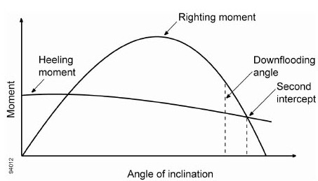

# Rules and Guidance for the Classification of Mobile Offshore Drilling Units

> RULES AND GUIDANCE FOR OFFSHORE STRUCTURES / RB-13-E / 2025 / EN / Guidance

## CHAPTER 2 CLASSIFICATION AND SURVEYS

### Section 1 General

#### 101. General

The classification and surveys of drilling systems intended to be classed with the Society or classed with the Society are to be in accordance with the requirements specified in this Chapter. In the case of items not specified in this Chapter, the requirements specified in **Pt 1** of **Rules for the Classification of Steel Ships** are to be applied.

### Section 2 Classification

#### 201. Character of classification

The class notations assigned to the drilling system classed with the Society are to be in accordance with **Pt 1, Ch 1, 201.** of **Rules for the Classification of Steel Ships** except that a notation "Drilling System" may be given as an additional installation notation.

#### 202. Maintenance of classification

- **1.** All ships classed with the Society are, for continuation of the classification, to be subjected to the periodical and other surveys, and are to be maintained in good condition in accordance with the requirements of this Chapter.
- **2.** When a ship classed with the Society makes an alteration or modification of such an extent as to influence to the ship's original performances, the plans have to be submitted for the Society's approval before the work is commenced and the alteration work has to be supervised by the Surveyor.

#### 203. Classification survey during construction

- **1.** **General**
  Drilling systems are to be examined in detail in Classification Survey during Construction in order to ascertain that they meet the appropriate requirements of the Annex.
- **2.** **Submission of plans and documents**
  - **(1)** For drilling systems, the following plans and documents are to be submitted for the approval of the Society at classification survey during construction before the work is commenced.
    - Design parameters such as design pressure and temperature, loads, maximum water depth, service conditions, etc.
    - Dimensional detailed drawings and fabrication details
    - Material specifications
    - Individual BOP (annular and ram) details to attest appropriate BOP capability with regard to drill pipe size, tool joints, casing, wire line and combination of them
    - Documentation to confirm the shear rams capability of shearing the various tubulars (sizes, grades, strengths, etc.) under the specified design conditions
    - BOP stack assembly drawings for BOP systems showing stack configuration showing all equipment, structural frame details, lift points/attachments, arrangements showing accumulators, pods, valves, piping, connectors, jumper lines, etc.
    - Design details and structural analysis for BOP structural frame and lifting attachments
    (xi) Derrick assembly drawings
    (xii) Crown block assembly drawings
    (xiii) Water table assembly drawings
    (xi) Stress analysis and other supporting calculations
    (xi) Structural analysis report
    (xii) Base plate and anchor bolt plan
    - Details on hierarchy of controls: primary, secondary, emergency
    - Volumetric capacity calculations for the accumulator systems, primary and secondary
    - Reservoir, pumps and prime movers of hydraulic power unit (HPU) reservoir details and arrangements
    - Hydraulic, pneumatic, and electrical schematics
    - Details of pressure relief system
    (xi) Description of all special valves, actuators, sensors and relays
    (xii) Shutdown logic and shutdown cause and effect charts
    (xiii) Hydrocarbon and H_2S gas detection system plans and data, including detectors, piping, set points, type of detectors, and location of alarm panels, and recalibration program for gas detectors
    - **(A)** Entire drilling system
      - **(a)** General arrangement showing locations of all machinery, equipment, structures for drilling operations and locations of all control panels and stations for drilling systems.
      - **(b)** Piping & instruments diagrams associated with the drilling systems
      - **(c)** An arrangement plan clearly indicating locations of the fire and gas monitoring and fire fighting control locations
      - **(d)** Detailed arrangements of the well test areas or location of well test equipment
      - **(e)** Escape and egress routes, including their protections, and muster stations
      - **(f)** The locations of openings (air intake, exhaust, windows, doors, etc.) for all closed spaces
      - **(g)** Ventilation arrangements
      - **(h)** HAZOP or HAZID study reports for the essential drilling systems
      - **(i)** Drawings identifying hazardous areas in accordance with **Ch 7** of the Rules.
    - **(B)** Well Control Systems
      - **(a)** Blowout preventer systems
      - **(i)** Design data (description of the well control systems, design pressure and temperature, shutdown logic, details on hierarchy of control(primary, secondary, emergency, etc.), applicable codes and standards)
        - **(ii)** Piping & instruments diagrams
        - **(iii)** Equipment technical specifications
        - **(iv)** Failure Modes and Effects Analysis, FMEA for the complete integrated drilling systems
      - **(v)** All control panel arrangements for well control of BOP systems
        - **(vi)** Design of BOP stack including the followings.
        - **(vii)** Subsea control pods drawings and associated calculations
      - **(b)** Lower marine riser package
      - **(i)** Design data (load cases and limit states for all design and operating conditions, design analysis methodology, applicable codes and standards)
        - **(ii)** Equipment technical specifications
        - **(iii)** Design analysis of mechanical-load bearing components and pressure-retaining equipment
        - **(iv)** Annular BOP
      - **(v)** Connector details
        - **(vi)** LMRP structural frame
        - **(vii)** Material specifications
      - **(c)** Choke and kill systems
      - **(i)** Design data (design pressure and temperature, applicable codes and standards)
        - **(ii)** Piping & instruments diagrams
        - **(iii)** Equipment arrangement
        - **(iv)** Equipment technical specifications
      - **(d)** Diverter systems
      - **(i)** Design data (design pressure and temperature, applicable codes and standards)
        - **(ii)** Piping & instruments diagrams
        - **(iii)** Equipment arrangement
      - **(e)** Design details for auxiliary well control equipment include kelly valves, drill pipe safety valves, drill string float valves, etc.
    - **(C)** Marine drilling riser systems
      - **(a)** Design data (load cases and limit states for all design and operating conditions, design analysis methodology, assumptions used in the global design analysis of the marine drilling riser system and design analysis of its components, applicable codes and standards)
      - **(b)** Design analysis
      - **(c)** Installation analysis
      - **(d)** Riser and its components fabrication drawings
      - **(e)** Material specifications
    - **(D)** Drill string compensation systems
      - **(a)** Design data (Load capacity, design pressure and temperature, applicable codes and standards)
      - **(b)** Piping & instruments diagrams
      - **(c)** Equipment technical specifications
    - **(E)** Bulk storage, transferring and mud circulating system
      - **(a)** Design data (design pressure and temperature, design medium, applicable codes and standards)
      - **(b)** Piping & instruments diagrams
      - **(c)** Equipment technical specifications
      - **(d)** Drawings of prime movers such as engines and motors
      - **(f)** Drawings of pumps
    - **(F)** Hoisting, lifting, pipe handling system
      - **(a)** Derrick drawings including the followings
      - **(i)** Applicable codes and standards
        - **(ii)** Derrick structure drawing
        - **(iii)** Design condition
        - **(iv)** Combined load cases and limit states for all design and operating conditions
      - **(v)** Assumptions used in the design analysis of the derrick structure and associated components
        - **(vi)** Corrosion control plans
        - **(vii)** Manufacturing specifications

#### (viii)

Design analysis methodology for the derrick structure and associated components, and component analyses including computer modeling and computer program used

        - **(ix)** Structural analysis report
      - **(x)** General arrangement drawings
      - **(b)** Crane drawings including the followings
      - **(i)** Applicable codes and standards
        - **(ii)** Equipment technical specifications
        - **(iii)** Load cases and limit states for all design and operating conditions
        - **(iv)** Wire rope specifications
      - **(v)** Material specifications
        - **(vi)** General arrangement
        - **(vii)** Crane capacity rating chart

#### (viii)

Welding details and procedures

        - **(ix)** Procedures of non-destructive testing
      - **(x)** Procedures of load tests
      - **(c)** Riser and pipe handling
      - **(i)** Applicable codes and standards
        - **(ii)** Equipment technical specifications
        - **(iii)** Design load and temperature
        - **(iv)** Prime mover power rating
      - **(v)** Assembly drawings
        - **(vi)** Equipment drawings
        - **(vii)** Dimensional detailed drawings
    - **(G)** Well testing system
      - **(a)** Well testing system drawings including the followings
      - **(i)** Descriptions of the well testing system, and well test equipment
        - **(ii)** General arrangement
        - **(iii)** Piping & instruments diagrams
        - **(iv)** Design pressure and temperature
      - **(v)** Shutdown logic
        - **(vi)** Gas dispersion and flare/heat radiation analyses
        - **(vii)** Equipment technical specifications

#### (viii)

Applicable codes and standards

      - **(b)** Well testing equipments drawings including the followings
      - **(i)** Design parameter such as design pressure, design temperature, maximum water depth, etc.
        - **(ii)** Design analysis to justify safety factor
        - **(iii)** Dimensional detailed drawings and fabrication details
        - **(iv)** Material specifications
      - **(v)** Structural design analysis for skid mounted equipment
      - **(c)** Burner booms including the followings
      - **(i)** Design conditions
        - **(ii)** Combined load cases and limit states for all design and operating conditions
        - **(iii)** Equipment list
        - **(iv)** Equipment technical specifications
      - **(v)** Assumptions used in the design analysis of the burner flare boom structure and associated components
        - **(vi)** Applicable codes and standards
        - **(vii)** Design analysis methodology for the burner flare boom structure and associated components, and component analyses including computer modeling and computer program used

#### (viii)

Material specifications

        - **(ix)** Arrangement drawings
      - **(x)** Structural drawings
    - **(H)** In addition to plans and data required by (B) to (G), following drawings are to be submitted, as applicable.
      - **(a)** Electric equipment plans and data in accordance with **Ch 2, 204. 2** (1) (B) (c) of the Rules.
      - **(b)** Control system drawing including the following.
      - **(i)** Arrangement plans showing location of units controlled, instrumentation and control devices
        - **(ii)** Specifications for control and instrumentation equipment
        - **(iii)** Set points for control system components
        - **(vi)** Control system detail including the followings
      - **(v)** FMEA for computer-based systems
        - **(vi)** Calculations for control systems demonstrating the system's ability to react adequately to anticipated occurrences, including transients
        - **(vii)** Arrangements and details of control consoles/panels

#### (viii)

Type and size of all electrical cables and wiring associated with the control systems, including voltage rating, service voltage and currents

        - **(ix)** Schematic plans and logic description of hydraulic and pneumatic control systems together with all interconnections, piping sizes and materials, including working pressures and relief-valve settings
      - **(x)** Description of all alarm and emergency tripping arrangements
      - **(c)** Documentation for flexible hoses
      - **(i)** Internal and external design pressure, minimum and maximum design temperature
        - **(ii)** Material specifications
        - **(iii)** Design analysis
        - **(iv)** Prototype testing data
      - **(d)** Documentation for piping systems including the followings
      - **(i)** Piping & instruments diagrams
        - **(ii)** Piping specifications including material specifications
        - **(iii)** Design parameters such as pressure and temperature
        - **(iv)** Pipe stress and flexibility analyses
      - **(e)** Documentation for pressure-retaining equipment including the followings
      - **(i)** Design specifications including applicable design codes and standards
        - **(ii)** Design parameters such as design pressure of internal/external, maximum and minimum design temperature, loads, etc.
        - **(iii)** Design calculations
        - **(iv)** Dimensional drawings and fabrication details
      - **(v)** Material specifications
      - **(f)** Documentation for mechanical load-bearing equipment including the followings
      - **(i)** Design specifications including applicable codes and standards
        - **(ii)** Design parameters such as loads, temperature, environmental conditions, etc.
        - **(iii)** Design analysis and calculations
        - **(iv)** Dimensional drawings and fabrication details
      - **(v)** Material specifications
  - **(2)** Plans and documents to be submitted for the approval of the Society at classification survey during construction are to comply with (3).
  - **(3)** The Society may consider manufacturer's exceptions to parts of specified codes, and standards for drilling equipment with justifications through the followings.
    In this case, the manufacturer must provide details of the exceptions to parts or sections of recognized design standards in the "Design Basis" submittal and clearly stated in detail on the manufacturer’s declaration of conformity
    - **(A)** Stress calculations/analysis
    - **(B)** Historical performance/experience data
    - **(C)** Finite element modeling/analysis
    - **(D)** Novel features in accordance with **Ch 1, 103. 3**
    - **(E)** Testing
- **3.** **Certification of equipment**
  - **(1)** The manufactured equipment and components are to be verified for satisfactory compliance with the recognized codes and standards, and the requirements of the Annex.
  - **(2)** Equipment and components of drilling systems are categorized as **Table 2.1** according to importance for safety.

    | Equipment(3) |   | Category |   |
    | --- | --- | --- | --- |
    | Equipment(3) |   | Category 1(1) | Category 2(2) |
    | Well control systems |   |   |   |
    | Blowout preventer systems | Accumulators | X |   |
    | Blowout preventer systems | Acoustic control system | X |   |
    | Blowout preventer systems | Autoshear system | X |   |
    | Blowout preventer systems | BOP stack | X |   |
    | Blowout preventer systems | BOP | X |   |
    | Blowout preventer systems | Clamps | X |   |
    | Blowout preventer systems | Hydraulic connector | X |   |
    | Blowout preventer systems | Control system/console/panel | X |   |
    | Blowout preventer systems | Control pods | X |   |
    | Blowout preventer systems | Deadman system | X |   |
    | Blowout preventer systems | Drilling spools | X |   |
    | Blowout preventer systems | Hydraulic hoses and piping | X |   |
    | Blowout preventer systems | Hydraulic power unit | X |   |
    | Blowout preventer systems | MUX cable reels | X |   |
    | Blowout preventer systems | Spacer spools | X |   |
    | Blowout preventer systems | Test stump | X |   |
    | Lower marine riser package | Annular preventer | X |   |
    | Lower marine riser package | Emergency disconnect system | X |   |
    | Lower marine riser package | Flex/ball joint | X |   |
    | Lower marine riser package | Frame | X |   |
    | Lower marine riser package | Jumper hoses | X |   |
    | Lower marine riser package | Riser adapter | X |   |
    | Lower marine riser package | Hydraulic connector | X |   |
    | Diverter systems | Control system/console/panel | X |   |
    | Diverter systems | Diverter house with annular sealing device | X |   |
    | Diverter systems | Hydraulic power unit | X |   |
    | Diverter systems | Piping system | X |   |
    | Diverter systems | Valves | X |   |
    | Choke and kill systems | Control system/console/panel | X |   |
    | Choke and kill systems | Connectors | X |   |
    | Choke and kill systems | Valves | X |   |
    | Choke and kill systems | Manifolds | X |   |
    | Choke and kill systems | Flexible hose | X |   |
    | Choke and kill systems | Piping systems | X |   |
    | Choke and kill systems | Kill unit | X |   |
    | Choke and kill systems | Hydraulic power unit | X |   |
    | Auxiliary equipments | Drill pipe safety valves | X |   |
    | Auxiliary equipments | Drill string float valves | X |   |
    | Auxiliary equipments | Non-return valve in drill string | X |   |
    | Marine drilling riser systems |   |   |   |
    | Marine drilling riser | Ball and flexible joints | X |   |
    | Marine drilling riser | Riser sections including joints | X |   |
    | Marine drilling riser | Riser tensioning unit | X |   |
    | Marine drilling riser | Telescopic arms | X |   |
    | Riser running equipment | Gimbal | X |   |
    | Riser running equipment | Riser running tool | X |   |
    | Riser running equipment | Riser spider | X |   |
    | Riser tensioning systems | Accumulators | X |   |
    | Riser tensioning systems | Air/nitrogen buffer tanks | X |   |
    | Riser tensioning systems | Compressor |   | X |
    | Riser tensioning systems | Dryers |   | X |
    | Riser tensioning systems | Control system/console/panel | X |   |
    | Riser tensioning systems | Hydraulic cylinders | X |   |
    | Riser tensioning systems | Hydraulic power unit | X |   |
    | Riser tensioning systems | Nitrogen generator | X |   |
    | Riser tensioning systems | Piping system | X |   |
    | Riser tensioning systems | Pressure vessels | X |   |
    | Riser tensioning systems | Riser tensioners | X |   |
    | Riser tensioning systems | Guideline and podline tensioners | X |   |
    | Riser tensioning systems | Riser tensioning unit | X |   |
    | Riser tensioning systems | Telescopic arms | X |   |
    | Riser tensioning systems | Sheaves | X |   |
    | Riser tensioning systems | Wire ropes |   | X |
    | Riser tensioning systems | Riser recoil | X |   |
    | Drill string compensating systems |   |   |   |
    | Drill string compensators | Accumulators | X |   |
    | Drill string compensators | Compressor |   | X |
    | Drill string compensators | Dryers |   | X |
    | Drill string compensators | Compensator assembly | X |   |
    | Drill string compensators | Control system/console/panel | X |   |
    | Drill string compensators | Hydraulic cylinders | X |   |
    | Drill string compensators | Piping systems | X |   |
    | Drill string compensators | Pressure vessels | X |   |
    | Drill string compensators | Sheaves | X |   |
    | Drill string compensators | Wire ropes |   | X |
    | Bulk storage, transferring and mud circulating systems |   |   |   |
    | Bulk storage and transferring systems | Bulk storage tanks | X |   |
    | Bulk storage and transferring systems | Piping for transfer system | X |   |
    | Mud circulating systems | Degasser | X |   |
    | Mud circulating systems | Desander and Desilter |   | X |
    | Mud circulating systems | Mud tanks |   | X |
    | Mud circulating systems | Mud pumps | X |   |
    | Mud circulating systems | Agitator |   | X |
    | Mud circulating systems | Trip tanks |   | X |
    | Mud circulating systems | Shale shakers |   | X |
    | Mud circulating systems | Chemical mixer |   | X |
    | Mud circulating systems | Circulating head | X |   |
    | Mud circulating systems | Control system/console/panel | X |   |
    | Mud circulating systems | Charging pump | X |   |
    | Mud circulating systems | Swivel | X |   |
    | Mud circulating systems | Kelly | X |   |
    | Mud circulating systems | Kelly busing |   | X |
    | Mud circulating systems | Kelly cock | X |   |
    | Mud circulating systems | Flow control valves | X |   |
    | Mud circulating systems | Internal BOP | X |   |
    | Mud circulating systems | Mud booster hoses | X |   |
    | Mud circulating systems | Mud booster piping | X |   |
    | Mud circulating systems | Mud-gas separator | X |   |
    | Mud circulating systems | Piping for circulating drilling fluid to the well | X |   |
    | Mud circulating systems | Piping for mud return |   | X |
    | Mud circulating systems | Pulsation dampeners | X |   |
    | Mud circulating systems | Rotary hoses | X |   |
    | Mud circulating systems | Safety valves at mud pump | X |   |
    | Mud circulating systems | Standpipe manifold | X |   |
    | Cementing systems | Cement pump | X |   |
    | Cementing systems | Cementing manifold | X |   |
    | Cementing systems | Flexible hoses | X |   |
    | Cementing systems | Cement pump discharge piping | X |   |
    | Cementing systems | Piping systems for mixing cement and suction to cement pump |   | X |
    | Cementing systems | Pulsation dampeners | X |   |
    | Cementing systems | Safety valves | X |   |
    | Hoisting, lifting rotating and pipe handling systems |   |   |   |
    | Hoisting systems | Derrick and mast | X |   |
    | Hoisting systems | Crown block including support beams | X |   |
    | Hoisting systems | Deadline anchors | X |   |
    | Hoisting systems | Drawworks | X |   |
    | Hoisting systems | Drill line spoolers |   | X |
    | Hoisting systems | Drilling line |   | X |
    | Hoisting systems | Elevators | X |   |
    | Hoisting systems | Links | X |   |
    | Hoisting systems | Power swivel | X |   |
    | Hoisting systems | Rotary swivel | X |   |
    | Hoisting systems | Sheaves for crown block and traveling block | X |   |
    | Hoisting systems | Traveling block including guide track and dolly | X |   |
    | Hoisting systems | Travel block hook | X |   |
    | Lifting systems | Base mounted winches | X |   |
    | Lifting systems | BOP handling crane | X |   |
    | Lifting systems | Crane type lifting equipment | X |   |
    | Lifting systems | Manrider winches | X |   |
    | Lifting systems | Personnel baskets | X |   |
    | Lifting systems | Pipe racking mechanism | X |   |
    | Lifting systems | Padeyes (permanent) | X |   |
    | Pipe handling systems | Bridge crane | X |   |
    | Pipe handling systems | Catwalk ramp | X |   |
    | Pipe handling systems | Finger board | X |   |
    | Pipe handling systems | Monkey board | X |   |
    | Pipe handling systems | Guide track and dolly | X |   |
    | Pipe handling systems | Horizontal to vertical equipment | X |   |
    | Pipe handling systems | Manipulator arms | X |   |
    | Pipe handling systems | Mechanical mousehole | X |   |
    | Pipe handling systems | Fixed mousehole |   | X |
    | Pipe handling systems | stabbing board | X |   |
    | Pipe handling systems | Wire rope | X |   |
    | Pipe handling systems | Control system/console/panel | X |   |
    | Pipe handling systems | Hydraulic power unit | X |   |
    | Pipe handling systems | Kelly spinner |   | X |
    | Pipe handling systems | Power slips |   | X |
    | Pipe handling systems | Iron roughneck/power tongs |   | X |
    | Rotary systems | Rotary table | X |   |
    | Well control systems |   |   |   |
    | Well test system | Control system/console/panel | X |   |
    | Well test system | Burner boom | X |   |
    | Well test system | High pressure pumps | X |   |
    | Well test system | Heat exchanger | X |   |
    | Well test system | Piping systems | X |   |
    | Well test system | Pressure vessels | X |   |
    | Well test system | Pumps for hydrocarbon liquid | X |   |
    | Well test system | Safety valves | X |   |
    | Equipment other than mentioned above |   |   |   |
    | Control systems | Drillers console | X |   |
    | Control systems | Components of control systems | X |   |
    | Piping systems | Class I piping systems and Class II piping systems as defined in **Pt 5, Ch 5** of **Rules for the Classification of Steel Ships** | X |   |
    | Piping systems | Class III piping systems defined in **Pt 5, Ch 5** of **Rules for the Classification of Steel Ships** |   | X |
    | Pressure vessels | Class 1 pressure vessels and Class 2 pressure vessels as defined in **Pt 5, Ch 5** of **Rules for the Classification of Steel Ships** | X |   |
    | Pressure vessels | Class 3 pressure vessels as defined in **Pt 5, Ch 5** of **Rules for the Classification of Steel Ships** |   | X |
    | (Note) (1) Category 1 : Equipment for which the Society certificate is required. (2) Category 2 : Equipment for which the manufacturers' certificate is accepted. (3) Equipment includes prime movers |   |   |   |
  - **(3)** Category 1 equipment is to comply with the followings.
    - **(A)** Plans and documents are to be submitted for the approval of the Society before the work is commenced. However, equipments design-approved in accordance with **Ch 4** of **Guidance for Approval of Manufacturing Process and Type Approval, Etc**. are not required drawing approval.
    - **(B)** Tests required in (5) are to be carried out at the plant of manufacturer.
    - **(C)** Prior to commencement of surveys, the Society is to discuss with the manufacturer at a kick off meeting the items listed as the followings.
      - **(a)** Confirmation of the main point of contacts for the manufacturer and the Society
      - **(b)** Review the project quality plans
      - **(c)** Review proposed manufacturing specification
      - **(d)** Review project manufacturing and delivery schedules
      - **(e)** Review and confirm project "hold-points"
      - **(f)** Review any proposed sub-contractor lists and qualifications
      - **(g)** Confirm specification, drawings and/or documentation associated with the manufacturing process
    - **(D)** The attending Surveyor is to perform or verify the followings.
      - **(a)** To confirm that the facilities to manufacture, fabricate or repair drilling system and equipment have and maintain an effective quality control program effectively covering design, procurement, manufacturing and testing, and meeting the requirements of a recognized standard applied to their product
      - **(b)** Welder’s qualifications
      - **(c)** Welding procedure specifications and corresponding weld procedure qualification records
      - **(d)** To verify material certificates
      - **(e)** To survey fit-up prior to major weldments
      - **(f)** To survey final weldments
      - **(g)** To witness, as far as deemed necessary, nondestructive examination tests of welds and to review records of nondestructive examinations.
      - **(h)** To review records of post-weld heat treatment, in particular for piping subjected to pressurized sour service and subject to NACE MR0175/ISO 15156 requirements
      - **(i)** To verify dimensions are as shown on approved drawings
      - **(j)** To check dimensional tolerances and alignment of mating surfaces
      - **(k)** To witness prototype testing of drilling equipment or components in accordance with the applicable API requirements.
      - **(l)** To witness pressure and proof-load testing of equipment and unit as specified in the fabrication procedures.
      - **(m)** To witness final testing and functional testing of subassemblies and completed units, as specified in the fabrication procedures.
      - **(n)** To verify all purged and pressurized systems, motor controllers, SCR banks, consoles and instrumentation and control panels are in compliance with approved drawings.
      - **(o)** To carry out other inspections as agreed upon during prefabrication meeting
      - **(p)** To review and approval final manufacturing Data Book and issue final survey report or certificate and confirm compliance with approved drawings.
    - **(E)** The materials test report of the following components is to be made available to the attending Surveyor during the manufacturing process. In general, materials associated with equipment that require Surveyor’s attendance in accordance with **Table 2.1** are to have complete traceability with materials test report
      - **(a)** Materials of pressure-retaining components
      - **(b)** All bolts and nuts for fastening
      - **(c)** Materials of primary load-bearing parts.
      - **(d)** All piping, valves and fittings with an ANSI B16.5 Class 150 or greater.
  - **(4)** For category 2 equipment, manufacturers' certificate containing the following data is to be submitted.
    - **(A)** Equipment specification
    - **(B)** statement to confirm that their products are designed, manufactured and tested in accordance with the recognized codes and standards, and the requirements of this chapter
    - **(C)** Operating limitation of the equipment
    - **(D)** Test record
  - **(5)** Equipment and components of drilling systems are to be tested in accordance with the following.
    - Static brake capacity test for all brakes operating simultaneously at 2 times SWL.
    - Static brake capacity test for each individual brake at 1.8 times SWL.
    - Dynamic brake capacity test for each individual brake at 1.25 times SWL.
    - **(A)** Pressure tests
      - **(a)** Pressure containing piping and components are to be subject to a hydrostatic pressure test at 1.5 times the design pressure, if not otherwise specified in recognized standards.
      - **(b)** For piping and component that cannot be hydraulically tested, alternative suitable test acceptable to the Society method may be applied.
      - **(c)** Well control equipment is to be subjected to the following hydraulic test.
      - **(i)** Hydrostatic tests of bodies in accordance with API Spec 16A 7.5.8.6.2
        - **(ii)** Hydrostatic tests of hydraulic operating systems in accordance with API Spec 16A 7.5.8.6.3
        - **(iii)** Closed preventer tests in accordance with API Spec 16A 7.5.8.7
        - **(iv)** Hydraulic connector tests in accordance with API Spec 16A 7.5.8.7.4
    - **(B)** Load tests
      - **(a)** Lifting appliance and load bearing components are to be subject to a load test.
      - **(b)** Load tests for Lifting appliance are to comply with **Pt 9, Ch 2, 205.** of **Rules for the Classification of Steel Ships** except that manriding equipment is to comply with the following.
      - **(i)** The load test at 2 times SWL is to be carried out.
        - **(ii)** Following brake capacity tests are to be carried out.
        - **(iii)** Other load bearing components are to comply with applicable recognized standards.
    - **(C)** Functional tests
      - **(a)** All the equipment is to be subject to functional tests in accordance with applicable recognized standards.
      - **(b)** Well control equipment is to be tested as the following.
      - **(i)** Drift test is to be carried out in accordance with API Spec 16A 7.5.8.4.
        - **(ii)** Shear ram test to verify shear capacity is to be carried out in accordance with **Ch 4, 202.** and API Spec 16A 7.5.8.7.4.
- **4.** **Onboard test**
  - **(1)** Onboard installation tests of all drilling systems are to be verified by the Surveyor and are to be in accordance with the Society agreed test procedures. The following surveys are to be carried out in attendance of the Surveyor.
    - Drawwork is to stop its rotation within the timeframe as specified in the approved manufacturer's specifications, including the specified applied voltage and amperage
    - Monitor and confirm brake holding capability including the caliper pressure, as specified in the approved manufacturer's specification.
    - Monitor and record caliper pressure, temperature, and fluid flow.
    - Visual inspection of brakes and hydraulic leakage are to be performed.
    - This test may be carried out by using a reduced number of lines with corresponding rated load and in accordance with the drawworks approved manufacturer's testing procedures.
    - **(A)** Piping systems are to be visually examined, nondestructively examined and pressure-tested in accordance with **Ch 2** of the Rules or applicable API standards.
    - **(B)** Pressure tests conducted on Group I piping systems as specified in **Pt 5, Ch 6** of **Rules for the Classification of Steel Ships** are to be preferably recorded on test charts for the duration of their tests. Minimum time for holding pressure is to be 15 minutes.
    - **(C)** All pressure relief and safety valves are to be tested.
    - **(D)** Installed choke and kill systems are to be pressure-tested at rated working pressure and also subjected to a low-pressure test at 2.07 MPa. performance tests are to be carried out.
    - **(E)** Assembly and installation of drilling derrick is to be examined, to include erection of derrick structure, welding and bolt torqueing, water table, crown block and turn-over sheaves assembly, guide rails for hoisting equipment, derrick mounted equipment and outfitting items, installation and pressure testing of drilling and related piping systems, overall dimensional control, and final alignment and bolting on the drill floor/substructure foundations.
    - **(F)** Mud pump operational test is to be carried out.
    - **(G)** Derrick
      - **(a)** Assembled and installed derrick is to be visually examined, including welding and bolting, torqueing, its water table, crown block and turnover sheaves assembly, guide rails for hoisting equipment, derrick mounted equipment, and outfitting items.
      - **(b)** Derrick dimensional control, final alignment and bolting on the drill floor/substructure foundations are to comply with manufacturer's specifications and tolerances.
      - **(c)** load test of the derrick structure is not required unless specified in the client's purchase order specification.
    - **(H)** Drawwork
      - **(a)** As a minimum, the following tests are to be performed for all drawwork brakes in accordance with the Society-approved test specifications.
      - **(i)** Rotational check: Verify rotation for both directions.
        - **(ii)** Rotational test: 100% rated drum/motor speed in both directions for a period of at least five minutes. With minimum delay between operations, repeat this step three times or in accordance with manufacturer's specifications. Bearing temperature for motor, gearbox and drum are to be monitored and recorded.
        - **(iii)** Brake burnishing test: Burnishing test is to be performed for the primary brake with consideration to brake clamping force, drum speed, RPM, or motor speed. Temperature at calipers and motor are to be monitored and recorded. The burnishing results such as percentage of lining contact, bright surface, etc. and verification of "gapping", the distance between the brakes and the brake discs, is to be performed.
        - **(iv)** Brake verification: After the brake burnishing test, individual verification of each caliper is to be performed under drum/motor load. Motor amperage and voltage, hydraulic pressure, and loads, as applicable, associated with caliper slippage are to be monitored and recorded. Each caliper must demonstrate adequate capacity as designed.
      - **(v)** Dynamic brake holding test is to be performed at 100% rated load for a period of at least 5 minutes for the primary brake. This test is to include the following:
        - **(vi)** Emergency brake test is to be performed to simulate loss of hydraulic supply or primary brake failure and verify hydraulic, or air release spring set is functional. This test is to be performed at 100% rated load.
        - **(vii)** Electromagnetic braking system tests are to be performed for compliance with approved manufacturer's specifications. Additional provisions of the drawworks electromagnetic braking system are provided in **Ch 4, 603. 2**.
      - **(b)** On self-elevating units, deflection testing of the cantilever may also qualify as the static and structural testing of drawworks.
      - **(c)** On column-stabilized or surface type units, where a full rated load test may constitute increased risk or a safety concern to the unit or personnel, alternative testing methods such as load testing at a reduced number of lines with corresponding rated load may be considered on a case-by-case basis. Request for such consideration is to be submitted to the Society and agreed upon prior to commencement of the test.
    - **(I)** Base-mounted winches and other lifting appliances
      - **(a)** Load test: After installation, the system is to be tested with a load equal to 125% of the rated capacity in the presence of the Surveyor. Satisfactory operation of power drives and brakes is to be demonstrated. After being tested, the system with all its components is to be visually examined for permanent deformation and failure.
      - **(b)** Performance test: Testing in the presence of the Surveyor is to demonstrate that rated line pull can be achieved at rated speed with the outermost layer of wire on the drum.
      - **(c)** Brake holding test: It is to be demonstrated that the brakes have the ability to stop and hold 100% of the design load. Confirmatory testing to demonstrate the braking effect of variable frequency drive AC motors is to be carried out upon installation onboard.
    - **(J)** Burner boom
      - **(a)** The adequacy of the boom's slewing and topping gear is to be demonstrated by testing after the boom‘s installation on the drilling unit. The details of the test procedure are to be agreed upon with a attending Surveyor.
      - **(b)** Functional testing of the completed burner assembly is to be carried out by pressure testing from the flexible hose connection flange to the burner head.
    - **(K)** Equipment associated with all hoisting, lifting, rotating, and pipe handling systems are to be tested in accordance with **Par 2**.
    - **(L)** All drilling systems and equipment are to be checked for proper operation.
    - **(M)** Control system and shutdowns are to be tested to the satisfaction of the Surveyor.
    - **(N)** All wiring and electrical connections are to be checked for continuity and proper workmanship in accordance with the **Ch 6** of the Rules.
  - **(2)** In addition to tests required in (1), All drilling systems are to be subject to pressure tests, load tests or functional tests according to their characteristics.
    - **(A)** Testing of well control systems
      - **(a)** The following equipments are to be subjected to a functional test.
      - **(i)** Blowout preventer systems: accumulator, acoustic control system, autoshear system, BOP stack, BOP, clamp, connector for wellhead, control system/console/panel, hydraulic control hoses, control pods, deadman system, hydraulic hose reels, hydraulic hoses and piping, hydraulic power unit, MUX cable reels
        - **(ii)** Lower marine riser package: annular preventer, emergency disconnect system, flex/ball joint, jumper hoses, riser adapter, riser connectors for BOP stack
        - **(iii)** Diverter systems: control system/console/panel, diverter house with annular sealing device, hydraulic power unit, valves
        - **(iv)** Choke and kill systems: control system/console/panel, connectors, valves, manifolds, flexible hose, emergency circulating pump, kill unit, hydraulic power unit
      - **(v)** Auxiliary equipments: drill pipe safety valves, drill string float valves, on-return valve in drill string
      - **(b)** The following equipments are to be subjected to a hydraulic test at rated working pressure.
      - **(i)** Blowout preventer systems: accumulators, acoustic control system, BOP stack, BOP, connector for wellhead, control system/console/panel(in case of hydraulic or pneumatic controls), hydraulic control hoses, control pods, drilling spools, hydraulic hose reels, hydraulic hoses and piping, hydraulic power unit, spacer spools, test stump
        - **(ii)** Lower marine riser package: annular preventer, emergency disconnect system, flex/ball joint, jumper hoses, riser adapter, riser connectors for BOP stack
        - **(iii)** Diverter systems: control system/console/panel(in case of hydraulic or pneumatic controls), diverter house with annular sealing device, hydraulic power unit, piping, valves
        - **(iv)** Choke and kill systems: control system/console/panel(hydraulic or pneumatic controls), connectors, valves, manifolds, flexible hose, piping systems, emergency circulating pump, hydraulic power unit
      - **(v)** Auxiliary equipments: drill pipe safety valves, drill string float valves, non-return valve in drill string
    - **(B)** Testing of marine drilling riser system and associated components
      - **(a)** The following equipments are to be subjected to a functional test.
      - **(i)** Marine drilling riser system: assembled marine drilling riser systems, all and flexible joints, hydraulic connectors, telescopic joint
        - **(ii)** Riser running equipment: gimbal, riser running tool, riser spider
        - **(iii)** Riser tensioning systems: accumulators, compressor, control system/console/panel, dryers, hydraulic cylinders, hydraulic power unit, nitrogen generator, piping system, riser tensioners, guideline and podline tensioners, riser tensioning unit, telescopic arms
      - **(b)** The following equipments are to be subjected to a hydraulic test at rated working pressure.
      - **(i)** Marine drilling riser system: ball and flexible joints, tensioner ring
        - **(ii)** Riser running equipment: riser spider (used as elevators/lifting)
        - **(iii)** Riser tensioning systems: accumulators, air/nitrogen buffer tanks, control system/console/panel(in case of hydraulic or pneumatic controls), hydraulic cylinders, hydraulic power unit, nitrogen generator, piping system, pressure vessels, riser tensioners, guideline and podline tensioners, riser tensioning unit, telescopic arms
      - **(c)** The following equipments are to be subjected to a pneumatic test in accordance with design codes and standards
      - **(i)** Riser tensioning systems: accumulators
    - **(C)** Testing of drill string compensators
      - **(a)** The following equipments are to be subjected to a functional test.
      - **(i)** Drill string compensators: accumulators, compressors, dryers, compensator assembly, control system/console/panel, hydraulic cylinders, piping system
      - **(b)** The following equipments are to be subjected to a hydraulic test at rated working pressure.
      - **(i)** Drill string compensators: compensator assembly, control system/console/panel(in case of hydraulic or pneumatic controls), hydraulic cylinders, piping system, pressure vessels
      - **(c)** The following equipments are to be subjected to a pneumatic test in accordance with design codes and standards
      - **(i)** Drill string compensators: accumulators
    - **(D)** Testing of bulk storage, transferring and mud circulating systems
      - **(a)** The following equipments are to be subjected to a functional test.
      - **(i)** Bulk storage and transferring systems: piping for transfer system
        - **(ii)** Mud circulating systems: agitators, chemical mixer, degasser, desander and desilter, piping systems, mud pumps, shale shakers, circulation head, control system/console/panel, charge pumps, swivel, kelly, kelly cocks, flow control valves, internal BOP, mixing pumps, mud booster hoses, mud booster piping, mud-gas separator, Piping for circulating drilling fluid to the well, pulsation dampeners, rotary hoses
        - **(iii)** Cementing systems: cement pump, centrifugal pumps for mixing cement, cementing manifold, flexible hoses, piping systems, pulsation dampeners, safety valves
      - **(b)** The following equipments are to be subjected to a hydraulic test at rated working pressure.
      - **(i)** Bulk storage and transferring systems: piping for transfer system
        - **(ii)** Mud circulating systems: degasser, piping systems(except piping from mud-gas separator to burners or vents), mud pumps, circulation head, control system/console/panel(in case of hydraulic or pneumatic controls), charge pumps, swivel, kelly, kelly bushing, kelly cocks, flow control valves, internal BOP, mud booster hoses, mud booster piping, mud-gas separator, piping for circulating drilling fluid to the well, rotary hoses, standpipe manifold
        - **(iii)** Cementing systems: cementing manifold, flexible hoses, cement pump discharge piping
      - **(c)** The following equipments are to be subjected to a pneumatic test in accordance with design codes and standards
      - **(i)** Bulk storage and transferring systems: bulk storage tanks
      - **(d)** The following equipments are to be subjected to a leak test
      - **(i)** Mud circulating systems: mud tank, trip tank
    - **(E)** Testing of hoisting, lifting rotating and pipe handling system
      - **(a)** The following equipments are to be subjected to a functional test.
      - **(i)** Hoisting systems: crown block including support beams, drawworks, drill wireline spoolers, elevators, gears for hoisting equipment with rated power of 100 kW and over, hydraulic cylinders for overhead lifting, links, power swivel, rotary swivel, sheaves for crown block and traveling block, traveling block including guide track and dolly, travel block hook, wireline unit
        - **(ii)** Lifting systems: base mounted winches, BOP handling crane, crane type lifting equipment, manrider winches, personnel baskets, pipe racking mechanism
        - **(iii)** Pipe handling systems: bridge crane, catwalk ramp, finger board, monkey board, guide track and dolly, horizontal to vertical equipment, hydraulic or air slips, hydraulic cathead, manipulator arms, mechanical mousehole, mechanical stabbing board, control system/console/panel, hydraulic power unit, Iron roughneck, kelly spinner, power slips, power tongs, tong suspension
        - **(iv)** Rotary systems : rotary table
      - **(b)** The following equipments are to be subjected to a hydraulic test at rated working pressure.
      - **(i)** Hoisting systems: hydraulic cylinders for overhead lifting, power swivel, rotary swivel
        - **(ii)** Lifting systems: base mounted winches, BOP handling crane, crane type lifting equipment, manrider winches, personnel baskets, pipe racking mechanism
        - **(iii)** Pipe handling systems: bridge crane, catwalk ramp, horizontal to vertical equipment, hydraulic or air slips, hydraulic cathead, manipulator arms, mechanical mousehole, hydraulic power unit
      - **(c)** The following equipments are to be subjected to a load test in accordance with **Pt 9, Ch 2** of **Rules for the Classification of Steel Ships**.
      - **(i)** Lifting systems: base mounted winches, BOP handling crane, pipe racking mechanism
        - **(ii)** Pipe handling systems: stabbing board
      - **(d)** The following manriding equipments are to be subjected to a load test at 200% of SWL, a static brake capacity test at 200% of SWL, a dynamic brake capacity test at 125% of SWL.
      - **(i)** Lifting systems: manrider winches, personnel baskets
    - **(F)** Testing of well test system
      - **(a)** The following equipments are to be subjected to a functional test.
      - **(i)** Well test equipments: burner boom, burner piping, control system/console/panel, electrical submersible pumps for overhauling of wells(pressure side), piping system, pressure vessels, pump, valves
      - **(b)** The following equipments are to be subjected to a hydraulic test at rated working pressure.
      - **(i)** Well test equipments: control system/console/panel(in case of hydraulic or pneumatic controls), electrical submersible pumps for overhauling of wells(pressure side), heat exchangers, piping system, pressure vessels, pumps, valves
    - **(G)** Testing of prime mover and miscellaneous
      - **(a)** The following equipments are to be subjected to a functional test.
      - **(i)** Prime mover: prime movers regardless of rated power
        - **(ii)** Miscellaneous: drillers console, control system components, BOP transporter
      - **(b)** The following equipments are to be subjected to a hydraulic test at rated working pressure.
      - **(i)** Miscellaneous: BOP transporter, expansion joints
- **5.** **Commissioning surveys of the drilling systems**
  - **(1)** Commissioning of all drilling systems is to be verified by an attending Surveyor and is to be in accordance with the Society agreed test procedures. The Surveyor are at a minimum to survey following items during the drilling system trials.
    - **(A)** Proper hook-up and testing of the entire drilling system equipment and components is completed prior to commissioning. This is to include all tests required in **Par 4.**
    - **(B)** Necessary safety precautions are taken during commissioning, which are to include checks of operational readiness of the fire and gas detection system, fire extinguishing system, ESD systems, unobstructed escape routes, etc.
    - **(C)** Necessary communication procedures are established prior to commissioning.
    - **(D)** Necessary emergency procedures are readily available to deal with any contingencies such as spillage, fire, and other hazards.
    - **(E)** Readiness of all utility support systems, including main and auxiliary sources for the drilling system, prior to commissioning. Random start-up and testing of the utility support systems to extent deemed necessary by the attending Surveyor.
    - **(F)** Readiness of the purged drilling system, and associated alarms and shutdowns, prior to commissioning, and random testing of the purged alarms systems during commissioning, to the satisfaction of the attending Surveyor.
    - **(G)** Proper operation of the mud level alarms while the drilling system is running, including random simulation of associated alarms.
    - **(H)** Proper operation of the hazardous area access and ventilation system while the drilling system is running, including random simulation of associated alarms and shutdowns.
    - **(I)** System's capability to control the flow of the well affluent in a stabilized manner, without undue control upsets, when drilling medium is introduced into the system.
    - **(J)** Satisfactory functioning of all drilling systems installed onboard and covered under this Annex. This will include witnessing proper function of the following systems, as applicable, while simulating actual drilling operations to the extent possible and practicable, and to the satisfaction of the attending Surveyor.
      - **(a)** Well control system
      - **(b)** Marine drilling riser system
      - **(c)** Drill string compensation system
      - **(d)** Bulk storage, circulating and transfer system
      - **(e)** Hoisting, lifting, rotating and pipe handling system
      - **(f)** Well test system
      - **(g)** Miscellaneous support systems
    - **(K)** Satisfactory testing of all ROV intervention functions on the subsea BOP stack during the stump test and testing at least one set of rams in initial test.
    - **(L)** Satisfactory functional testing of autoshear, deadman, and EDS systems on the subsea BOP stack during the stump test.
    - **(M)** Starting up of the permanent well test system, if applicable, including precautions taken to eliminate the risk of explosion or fire.
    - **(N)** Post-commissioned drilling system is in stabilized and satisfactory functioning order for duration of at least 12 hours.
    - **(O)** Satisfactory functioning of the emergency power equipment to ensure proper operations.

#### 204. Classification Survey after Construction

- **1.** **General**
  At the Classification Survey after Construction, the examination of drilling systems is carried out as required for the Special Survey corresponding to the age of the unit in which drilling systems are installed and the actual scantlings, etc. of the main parts of drilling systems are to be measured as necessary.
- **2.** **Submission of plans and documents**
  At the Classification Survey after Construction, plans and documents as may be required for the Classification Survey during Construction are to be submitted. If plans and documents cannot be obtained, facilities are to be given for the Surveyor to take the necessary information from the unit in which drilling systems are installed.

### Section 3 Survey

#### 301. General

- **1.** Drilling systems classed with the Society are to be subjected to the following surveys to maintain the classification. Periodical surveys of drilling systems are to be carried out at periodical surveys of the unit in which the drilling systems are installed.
  - **(1)** Special Surveys
  - **(2)** Annual Survey
  - **(3)** Occasional Surveys
- **2.** **Damage, failure and repair**
  - **(1)** Examination
    Damage, failure, deterioration or repair to the drilling system or components which affects Classification is to be submitted by the Owner for examination by the Surveyor at the first opportunity.
  - **(2)** Repairs
    Where repairs to the drilling system or components that may affect classification are planned in advance, a complete repair procedure, including the extent of the proposed repair and the need for the Surveyor’s attendance, is to be submitted to and agreed upon by the Surveyor reasonably in advance. Failure to notify the Society in advance of the repairs may result in suspension of the drilling system’s classification until such time as the repair is redone or evidence is submitted to satisfy the Surveyor that the repair was properly completed. This requirement applies also to repairs during voyage.
    This requirement is not intended to include maintenance and overhaul to hull, machinery and equipment in accordance with recommended manufacturer’s procedures and established marine practice and that does not require the Society's approval. Any repair as a result of such maintenance and overhauls that affects or may affect classification is to be noted in the ship’s log and submitted to the Surveyors.
    All repairs found necessary by the Surveyor are to be completed to his satisfaction.
- **3.** All annual and special surveys are to be carried out in accordance with an examination and test plan developed by the Owner and agreed by the Society for periodical inspection and testing of the overall drilling system.
- **4.** The examination and test plan is to explain how each system and equipment is to be examined and tested during annual and special survey.
- **5.** Maintenance records of the drilling system are to be part of the record kept onboard the drilling unit.
- **6.** When the Society is authorized to perform surveys on behalf of a governmental authority, or when requested by the Owner, items as specified by the governmental authority or the Owner will be surveyed. Reports indicating the results of such surveys will be issued.
- **7.** Annual and special surveys are to be scheduled preferably when the Owner has scheduled an overhaul of the drilling system. Annual Surveys are to be scheduled to coincide with the overhaul and testing of the BOP.

#### 302. Maintenance manuals/records

- **1.** Maintenance records are to be kept and made available for review by the attending Surveyor. The maintenance records will be reviewed to establish the scope and content of the required Annual and Special Surveys that are to be carried out by the Surveyor.
- **2.** During the service life of the drilling system, maintenance records are to be updated on a continuing basis.
- **3.** The Owner is to inform the Society of any changes to the maintenance procedures and their frequencies as may be caused, for example, by changes or additions to the original drilling equipment.

#### 303. Annual Survey

- **1.** At each Annual Survey, the Surveyor is to verify the effectiveness of various systems and equipment by visual examination and testing, as appropriate. As a minimum, the following is to be carried out to the satisfaction of the attending Surveyor.
  - **(1)** Review of Owner's maintenance manual and relevant records to confirm that a suitable maintenance program has been followed, periodical testing requirements have been carried out and that any repairs, reconditioning or renewals of well control equipment, BOP controls, riser system, pressure vessels, electrical systems, drilling hoisting system or lifting devices were carried out according to the applicable standards and the requirements of this Annex.
  - **(2)** Review of database for approved changes made to the drilling system, and examination of this equipment to the extent deemed necessary by the attending Surveyor.
  - **(3)** Exposed surfaces of the derrick, drilling hoisting systems, lifting devices, burner booms, stabbing boards, racking platforms and drilling equipment foundations are to be examined and placed in satisfactory condition, as found necessary. The inspection of the derrick and related structural members will include the following.
    - **(A)** The general condition of the structure, especially bent, missing or abraded parts and lost corrosion protection coatings.
    - **(B)** Tightness of bolts.
    - **(C)** Condition of wire ropes and fittings.
  - **(4)** Examination of all mounting hardware and the structure of base-mounted winches and other lifting devices. Magnetic Particle Inspection may be carried out as deemed necessary by the attending Surveyor.
  - **(5)** General external examination so far as accessible of the drilling systems as specified in **Ch 1, 102.** or damage, excess corrosion, fracturing or malfunctions.
  - **(6)** Protective covers, insulation, shrouds and protective guards around moving parts are to be found in place and in functional condition.
  - **(7)** Derrick walkways and ladders, drill floor and drill system machinery spaces to be surveyed with particular attention to fire and explosion hazards and confirmation that emergency escape routes are not blocked.
  - **(8)** External examination of pressure vessels and their appurtenances, including safety devices, foundations, controls, relieving gear, piping systems, flexible hose, hydraulic hoses, insulation and gauges.
  - **(9)** Examination of safety shutdown devices.
  - **(10)** General examination of all electrical and instrumentation systems, including protective devices and cable supports.
  - **(11)** Examination of mud and cement systems.
  - **(12)** Examination of the BOP test log and maintenance records.
  - **(13)** Testing of the BOP equipment in accordance with API RP 53
    - **(A)** Pressure and functional testing
    - **(B)** Control system testing
    - **(C)** Pressure testing if any shear rams were used in an emergency
  - **(14)** Review BOP inspections and maintenance records in accordance with Section 17 and Section 18 of API RP 53.

#### 304. Special Surveys

- **1.** The Special Survey is to include all items listed under the Annual Survey.
- **2.** In addition to **Par 1**, the followings are to be carried out to the satisfaction of the attending Surveyor.
  - **(1)** Review of Owner's maintenance records to verify periodical testing requirements have been carried out and that any repairs, reconditioning or renewals of well control equipment, BOP controls, riser system, pressure vessels, electrical systems, drilling hoisting system or lifting devices were carried out according to the applicable standards and the requirements of this Annex.
  - **(2)** Internal examination and thickness gauging of pressure vessels and pressure-retaining components, testing of relief valves and pressure piping systems, as considered necessary by the Surveyor.
  - **(3)** Hydrostatic testing of pressure vessels and other pressure-retaining components related to the drilling system to their maximum allowable working pressure.
  - **(4)** Hydrostatic testing of drilling system piping systems and flexible hoses to their maximum allowable working pressure.
  - **(5)** Examination and check of insulation resistance of motors that are part of the drilling system.
  - **(6)** Examination of rotating drilling machinery to verify suitable operation, free from excessive vibration.
  - **(7)** The blowout preventer is to be subjected to a complete performance test and pressure-tested to its maximum allowable working pressure.
  - **(8)** Examination of mud and cement pump fluid ends.
  - **(9)** Functional testing of derrick gear, drilling hoisting systems and derrick floor lifting devices.
  - **(10)** Close examination of the condition of welded joints on the derrick and associated structure, including nondestructive testing (including thickness gauging if required) of any suspect areas noted by the attending Surveyor.
  - **(11)** Examination of the equipment associated with the well control system and their maintenance records.
  - **(12)** Satisfactory functioning of the emergency power equipment to ensure proper operation. 
