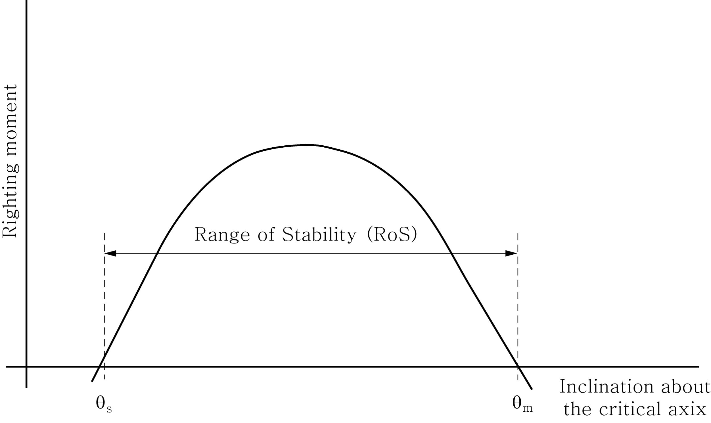

# Rules and Guidance for the Classification of Mobile Offshore Drilling Units

> RULES AND GUIDANCE FOR OFFSHORE STRUCTURES / RB-13-E / 2025 / EN / Guidance

## CHAPTER 3 MATERIALS, WELDING AND NONDESTRUCTIVE EXAMINATION

### Section 1 Materials

#### 101. General

All materials are to be suitable for their intended service conditions and defined by recognized material standard.

#### 102. Materials of structural steels

Selection of structural steel materials associated with drilling structures is to comply with the following requirements.

- **1.** Structural steels utilized for drilling structures are considered to be primary structural members or secondary structural members specified in **Ch 3** of the Rules.
- **2.** Steel for plates, shapes and structural pipe sections is to be in accordance with requirements of API RP 2A-WSD or **Ch 3** of the Rules.
- **3.** Where toughness is to be considered in material selection, the toughness testing criteria required in **Pt 2, Ch 1** of **Rules for the Classification of Steel Ships** are to be met as a minimum for the principal structural load-bearing components of derricks, masts and burner booms. If there are more stringent requirements imposed in the application of API RP 2A-WSD or API Spec 4F, then these requirements are to be applied.
- **4.** Bolts and nuts are to have corrosion characteristics comparable to the structural elements being joined and are to be manufactured and tested in accordance with recognized material standards.

#### 103. Materials of drilling equipment

Materials associated with drilling equipment and components is to comply with the following requirements.

- **1.** Materials for drilling and well control equipment are to be selected in accordance to the applicable design codes with consideration to toughness, corrosion resistance, weldability and to be suitable for their intended service conditions.
- **2.** All materials are to be defined by recognized standards.
- **3.** Materials for drilling and well control equipment are categorized as follows.
  - **(1)** Mechanical load-bearing component
  - **(2)** Pressure-retaining equipment
  - **(3)** Piping under pressure load and external loads
- **4.** Materials associated with drilling equipment or components are also to comply with the following specific criteria.
  - **(1)** **Material Properties**
    To determine the suitability of a material to withstand design stresses, the ultimate tensile strength, specified minimum yield strength, elongation and reduction of area are to be specified in accordance with recognized material standards.
  - **(2)** **Toughness**

    | minimum yield strength of material (MPa) | Minimum Absorbed Energy (ave) (J) |
    | --- | --- |
    | $\sigma _{Y}$ ≤ 450 | $\sigma _{Y}$/10 |
    | 450 < $\sigma _{Y}$ ≤ 690 | 45 |
    | 690 < $\sigma _{Y}$ | Additional requirements may be necessary.(1) |
    | Note : (1) Data related with toughness property at low temperature is to be submitted to the Society. |   |

    | minimum yield strength of material (MPa) | Minimum Absorbed Energy (ave) (J) |
    | --- | --- |
    | $\sigma _{Y}$ ≤ 450 | $\sigma _{Y}$/10,(but not less than 27 (J) |
    | 450 < $\sigma _{Y}$ ≤ 650 | 50(1) |
    | 650 < $\sigma _{Y}$ | Additional requirements may be necessary.(1)(2) |
    | Note : (1) In addition, lateral expansion opposite the notch is not to be less than 0.38 $\mathrm{mm}$. (2) Data related with toughness property at low temperature is to be submitted to the Society. |   |
    - **(A)** Mechanical Load-Bearing Component
      - **(a)** Toughness testing for mechanical load-bearing components is to be performed in accordance with relevant API or applicable recognized standards.
      - **(b)** Charpy V-Notch (CVN) impact testing is to be performed at the required temperature in the relevant API or applicable standard or the minimum design temperature, whichever is lower. For a specified MDT above 0°C, Charpy V-Notch impact testing is to be performed at 0°C.
      - **(c)** The acceptance criteria of Charpy V-Notch impact testing is to be in accordance with the relevant API, ASME or applicable recognized standard.
      - **(d)** Material for mechanical load-bearing components not covered by, or not in full compliance with API standards or applicable recognized standards, the following Charpy V-Notch criteria applies.
      - **(e)** Other CVN criteria or alternative test data, such as crack-tip opening displacement (CTOD), nil ductility transition (NDT) temperature, or related service experience will be considered if submitted to the Society prior to manufacturing.
      - **(f)** It should be noted that additional requirements for toughness. The Society may require to include additional toughness requirements of other national and international regulatory bodies in the scope of the design review and fabrication inspection where deemed necessary by the Society.
    - **(B)** Pressure-Retaining Equipment and Piping
      - **(a)** Toughness testing for pressure-retaining equipment and piping is to be performed in accordance with the relevant API, ASME or applicable recognized standard.
      - **(b)** Charpy V-Notch (CVN) impact testing is to be performed at the required temperature in the relevant API, ASME or applicable standard or the minimum design temperature, whichever is lower. For a specified MDT above 0°C, Charpy V-Notch impact testing is to be performed at 0°C.
      - **(c)** The acceptance criteria of Charpy V-Notch impact testing is to be in accordance with the relevant API, ASME or applicable recognized standard.
      - **(d)** Material for mechanical load-bearing components not covered by, or not in full compliance with API standards or applicable recognized standards, the following Charpy V-Notch criteria applies.
      - **(e)** Other CVN criteria or alternative test data, such as crack-tip opening displacement (CTOD), nil ductility transition (NDT) temperature, or related service experience will be considered if submitted to the Society prior to manufacturing.
      - **(f)** It should be noted that additional requirements for toughness. The Society may require to include additional toughness requirements of other national and international regulatory bodies in the scope of the design review and fabrication inspection where deemed necessary by the Society.
  - **(3)** Materials used in well control equipment or components that can potentially be exposed to sour or H2S service are to be selected within appropriate limits of chemical composition, heat treatment and hardness to resist sulfide stress cracking. For this purpose, selection of material is to be guided by applicable part of NACE MR0175/ISO 15156(Materials for use in H2S containing environment in oil and gas production).

#### 104. Corrosion Allowance

Where drilling systems are subjected to a corrosive or erosive environment, the design is to include corrosion allowances in accordance with the followings

- **1.** The amount of additional material needed will be determined based on the predicted rate of corrosion and the design service life of the component.
- **2.** In the absence of any standard allowance or submitted information, a corrosion allowance of 1.6 $\mathrm{mm}$ is to be utilized.

#### 105. Forming and welding of materials

- **1.** **Forming**
  Forming of materials utilized in drilling equipment and components are to comply with the following requirements.
  - **(1)** In general, for steel components, forming at temperatures around 205°C is to be avoided.
  - **(2)** Where degradation of properties is unavoidable, complete post forming heat treatment may be required.
  - **(3)** Suitable supporting data is to be provided to indicate compliance with the specified properties.
  - **(4)** For materials with specified toughness properties that are to be formed beyond 3% strain on the outer fiber, data are to be provided indicating that the toughness properties meet the minimum requirements after forming. After straining, specimens used in toughness tests are to be subjected to an artificial aging treatment of 288°C for one hour.
- **2.** **Welding**
  - **(1)** Welding of drilling equipment and components is to be in accordance with **Sec 2**.
  - **(2)** Generally, weldments subject to H_2S service are not to exceed a hardness of 22 Rockwell C in weld metal or heat-affected zone (HAZ), see NACE MR0175/ISO 15156.

#### 106. Manufacturing process

- **1.** Wrought and cast products are to be procured in accordance with written specifications that, in addition to property requirements, specify the frequency, location, orientation and types of test specimens. Nondestructive examination is to be performed if required.
- **2.** **Rolled steels**
  Plates, shapes and bars may be supplied in the as-rolled, thermo-mechanically processed, normalized, or quenched and tempered condition, depending on the intended application.
- **3.** **Steel forgings**
  - **(1)** Requirements in **Pt 2, Ch 1, Sec 6** of **Rules for the Classification of Steel Ships** is to be applied, except that a forging reduction ratio is to be not less than 3:1.
  - **(2)** Where a net change in the cross section does not occur during a portion of the forging operation, the hot working ratio representing that portion will be evaluated as a complement to the forging reduction ratio.
- **4.** **Castings**
  - **(1)** In general, cast products are to be supplied in a heat-treated condition. Samples for testing are to be taken from integrally cast coupons or appropriately designed separately cast coupons.
  - **(2)** These coupons are to be subjected to the same heat treatment as the casting.

#### 107. Sealing materials

- **1.** **Elastomeric sealants**
  - **(1)** Materials used for sealing are to be suitable for the intended operating pressures and temperatures.
  - **(2)** Age-sensitive materials for critical components are to have a defined storage life and be identified in storage as to month and year of manufacture.
- **2.** **Ring joint gaskets**
  - **(1)** Ring joint gaskets are to be of soft iron, low carbon steel or stainless steel, as required by the design standard.
  - **(2)** Gaskets that are coated with a protective coating material such as fluorocarbon or rubber for shipment and storage are to have the coatings removed prior to installation.

#### 108. Traceability of the products and materials

All materials used for major mechanical components and pressure-retaining equipment are to be furnished with documentation that states the process of manufacture. The manufacturers are responsible for maintaining this documentation on file and, upon request, are to provide this information to the Society.

- **1.** **Certified materials test report**
  - **(1)** Chemical and mechanical properties for each heat
  - **(2)** Heat treatment temperatures and time at temperature
  - **(3)** Charpy impact values and temperatures
  - **(4)** Hardness test readings (as applicable to NACE MR0175/ISO 15156)
- **2.** **Manufacturing processes**
  - **(1)** Welding records (including welding procedures specification(WPS) and Qualification)
  - **(2)** Post weld heat treatment
  - **(3)** Non-destructive examination results
  - **(4)** Hardness test results (as applied to NACE MR0175/ISO 15156)
  - **(5)** Dimensional check results
  - **(6)** Hydrostatic pressure tests

### Section 2 Welding and Nondestructive Examination

#### 201. General

- **1.** All welds in the pressure boundary(vessel wall and pipe wall) of pressure-retaining equipment and piping systems and welds in mechanical load-bearing and structural components are to be made using approved welding procedures by qualified welders and are to be inspected utilizing approved procedures by qualified technicians.
- **2.** Critical sections of primary components are to be examined for surface and volumetric flaws to the extent specified in the design code, but not to a lesser extent than that specified in this Section.
- **3.** All welders and welding operators to be employed in the manufacturing of equipment are to be properly qualified and experienced in the work proposed and the manufacturer is to employ a sufficient number of skilled supervisors to ensure a thorough supervision and control of all welding operations.
- **4.** Unless otherwise expressly specified in this Section, requirements of **Pt 2, Ch 2** of **Rules for the Classification of Steel Ships** may applied.

#### 202. Welding

- **1.** **Welding procedures specification(WPS)**
  - **(1)** A written WPS is to be prepared in accordance with ASME or ANSI/AWS D1.1 Code depending on the equipment or component.
  - **(2)** The WPS is to describe in detail all essential and nonessential variables to the welding process employed in the procedure.
  - **(3)** Welding procedure specifications are to be qualified and the procedure qualification records(PQR) documenting the following data is to be submitted to the Society.
    - **(A)** Maximum hardness values (for well bore fluid service)
    - **(B)** Minimum and average toughness values for weld heat-affected zone and weld metal
    - **(C)** Minimum tensile strength
    - **(D)** Results from other tests required by the applicable code or standard
- **2.** **Welders and welder performance qualification tests**
  - **(1)** Welders and welding operators are to be qualified by qualification tests conducted and evaluated in accordance with the applicable code for each welding process and for each position used in production welding.
  - **(2)** Welder/welding operator qualification records are to be submitted to the Society.
- **3.** **Post weld heat treatment**
  - **(1)** Accurate records of all heat treatments during fabrication, including rates of heating and cooling, hold time and soaking temperature are to be submitted to the Surveyor if required.
  - **(2)** Alternative methods of stress relief will be subject to special consideration by the Society where post-weld heat treatment is not a requirement of the applicable manufacturing code.

#### 203. Nondestructive examination

- **1.** **Non-destructive examination Procedures**
  NDE procedures specifying test method of each kind of nondestructive examination, extent of examination and acceptance criteria are to be submitted to the Society for review
- **2.** **Qualification of nondestructive technicians**
  - **(1)** The manufacturers are to certify that personnel performing and evaluating the non-destructive examination have been qualified and certified in accordance with the manufacturers' qualification system.
  - **(2)** The manufacturers' qualification system for qualification and certification of personnel performing and evaluating the non-destructive examination examinations are to be written in accordance with American Society for Nondestructive Testing (ASNT) Recommended Practice No. SNT-TC-1A or equivalent.
  - **(3)** Certification documents of non-destructive examination technicians are to be submitted to the Surveyor if required.
- **3.** **Timing of NDT**
  NDT should be conducted after Post Weld Heat Treatment
- **4.** **Extent of nondestructive examination**
  All weldments and other critical sections covered under **201.** are to be subjected to 100% visual examination and nondestructive examination for surface and volumetric defects in accordance with this Annex or the relevant design code.
  - **(1)** All highly-stressed areas of forgings and castings of primary components used in well control are to be examined for flaws by methods capable of detecting and sizing significant internal defects.
  - **(2)** Methods to detect surface flaws are also to be used in special applications. Substantiation is to be provided for areas exempted from examination in the terms of stress levels, quality control procedures at the foundry, forming or casting procedures, or documented historical data.
  - **(3)** Repair welds are to be subject to 100% surface NDE.
  - **(4)** All welds of structural members considered special are to be inspected 100% by the ultrasonic or radiographic method.
  - **(5)** Twenty percent of all welds of structural members considered primary are to be inspected by the ultrasonic or radiographic method.
  - **(6)** Welds of structural members considered to be secondary are to be inspected by the ultrasonic or radiographic method on a random basis.
  - **(7)** In locations where ultrasonic test results are not considered reliable, the use of magnetic-particle or dye-penetrant inspection as a supplement to ultrasonic inspection is to be conducted.
  - **(8)** Welds for mechanical load-bearing components or pressure-retaining equipment are to be examined by nondestructive methods capable of detecting and sizing significant surface and internal defects.
- **5.** **Methods of nondestructive examination and acceptance criteria**
  Methods of nondestructive examination and acceptance criteria is to be in accordance with the following **Table 3.1.**

  **Table 3.1 Methods of nondestructive examination and acceptance criteria**

  | Kinds | Methods of nondestructive examination | Acceptance criteria |
  | --- | --- | --- |
  | Magnetic Particle Examination | ASME Boiler and Pressure Vessel Code, Section V Article 7 ASTM E709 | ASME Boiler and Pressure Vessel Code, Section VIII, Div. 1, Appendix 6 |
  | Liquid Penetrant Examination | ASME Boiler and Pressure Vessel Code, Section V Article 6 ASTM E165 | ASME Boiler and Pressure Vessel Code, Section VIII, Div. 1, Appendix 8 ANSI/AWS D1.1, Section 6 Part C |
  | Radiographic Examination | ASME Boiler and Pressure Vessel Code, Section V Article 2 ASTM E94/E446/E186/E280 | ASME Boiler and Pressure Vessel Code, Section VIII, Div. 1, Appendix 4 ANSI/AWS D1.1, Section 6 Part C |
  | Ultrasonic Examination | ASME Boiler and Pressure Vessel Code Section V, Article 5 ASTM A388/E428/A609 | ASME Boiler and Pressure Vessel Code, Section VIII, Div. 1, Appendix 12 ANSI/AWS D1.1 Section 6 Part C API RP-2X |
  | Hardness Testing | ASTM E10/E18/E92 | NACE MR0175/ISO 15156 |

#### 204. Record retention

The manufacturer is to maintain the following records after completion, and these records are to be made available to the Surveyor upon request.

- **1.** Weld Procedure Specification
- **2.** Procedure Qualification Records
- **3.** Welder/welding operator performance test records, including the date and test results and identification of work assigned to each welder
- **4.** A record providing traceability and capable of identifying the welders who have carried out welding on particular part
- **5.** Qualification records for all personnel performing nondestructive examinations and evaluating results of examination
- **6.** Nondestructive Examination records, including radiographs 
