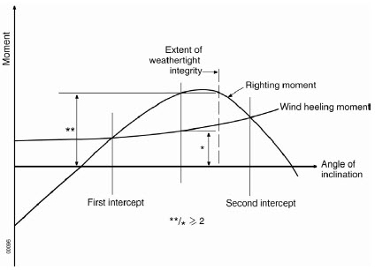

# Rules and Guidance for the Classification of Mobile Offshore Drilling Units

> RULES AND GUIDANCE FOR OFFSHORE STRUCTURES / RB-13-E / 2025 / EN / Guidance

## CHAPTER 4 DRILLING SYSTEMS

### Section 1 General

#### 101. General

- **1.** The designer of the drilling system is to evaluate the system as a whole, taking account into the interfacing and interdependence of subsystems.
- **2.** The required design plans and data to be submitted to the Society are in accordance with **Ch 2, Sec 2, 202.**

#### 102. Equipment layout

Equipment layout and work areas associated with the drilling activities are to be arranged with the following objectives.

- **1.** Safety of personnel and operation
- **2.** Separation of nonhazardous areas from those classified as hazardous areas
- **3.** Separation of fuel and ignition source as far as practical
- **4.** Minimizing the likelihood of uncontrollable releases of hydrocarbon to the environment
- **5.** Minimizing the spread of flammable liquids and gases which may result in a hazardous event and facilitating rapid removal of any accumulations
- **6.** Minimizing the probability of ignition
- **7.** Minimizing the consequences of fire and explosions
- **8.** Preventing fire escalation and equipment damage
- **9.** Providing for adequate arrangements for escape and evacuation
- **10.** Minimizing dropped objects hazards to personnel, equipment and structure
- **11.** Protection of critical systems and equipment such the followings from damage during drilling operation
  - **(1)** Electrical cables and cableways
  - **(2)** Well control equipment
  - **(3)** Exhaust ducting and air intake ducting
  - **(4)** Control and shutdown systems
  - **(5)** Safety systems, fire-gas detection, and fire fighting equipment
- **12.** Access for inspection and servicing equipments
- **13.** Safe means of egress from all machinery spaces.
- **14.** The installation of electrical equipment within hazardous areas is to be in compliance with **Ch 7** of the Rules. Combustion equipment and combustion engines are not to be located in hazardous areas.
- **15.** Equipment arrangement drawings are to show the location of all equipment, living quarters, all machinery spaces, tanks, derrick, wellheads/moon pool, flare and vents, escape route, evacuation equipment, air intake, opening to close spaces, and any fire and barrier walls.
- **16.** Additional requirements related to general arrangement and equipment layout are also to consider the applicable requirements of the Rules.

#### 103. Overpressurization protection

- **1.** Systems that may have the potential of exposure to pressure greater than for which they are designed are to be protected by suitable pressure protection devices.
- **2.** Designers are to decide design pressure taking into account of all condition encountered and select suitable overpressure protection devices.

#### 104. Fire protection and fire extinction

Fire protection, fire extinction and hazardous area are to be in compliance with applicable requirements of **Ch 7** and **Ch 10** of the Rules.

#### 105. Acceptance of manufacturer’s standards

Designs based on manufacturer’s standards may also be accepted. In such cases, complete details of the manufacturer's standard and engineering justification are to be submitted to the Society for review.

- **1.** The manufacturer is to demonstrate by way of testing or analysis that the design criteria employed results in a level of safety consistent with that of a recognized standard or code of practice.
- **2.** Where strain gauge testing, fracture analysis, proof testing or similar procedures form a part of the manufacturer's design criteria, the procedure and results are to be submitted to the Society for review.
- **3.** Historical performance data for drilling systems, subsystems, equipment or components is to be submitted to the Society for justification of designs based on manufacturer's standards.

### Section 2 Well Control System

#### 201. General

- **1.** The well control systems are consist of the following systems.
  - **(1)** Blowout preventer system
  - **(2)** Lower marine riser package (LMRP)
  - **(3)** Choke and Kill system
  - **(4)** Diverter system
  - **(5)** Auxiliary well control system
- **2.** The well control systems are to be in compliance with recognized national standards or international standards in addition to requirements of this Annex.

#### 202. Blowout preventer system

- **1.** The BOP system typically consists of ram and annular type BOPs, BOP stack structural frame, accumulators, connectors, clamps, drilling spools, spacer spools, control systems/consoles/panels, control pods, umbilical, flexible hoses (choke, kill, mud booster and hydraulic), hydraulic hoses, MUX, cable reels, rigid piping, hydraulic power units, manifold, ROV interface, test stump and testing equipment.
- **2.** **Blowout preventer stack**
  - **(1)** BOP stack configurations are to be in accordance with API RP 53 and requirements below.
  - **(2)** As a minimum, the BOP stack is to consist of the following preventers.
    - **(A)** One (1) annular preventer
    - **(B)** One (1) blind-shear ram preventer with mechanical locking device for fixed units
    - **(C)** Two (2) pipe ram preventers with mechanical locking device
    - **(D)** Two (2) shear rams for moored or dynamically-positioned units, one being a blind shear ram and the other to be a casing shear ram.
    - **(E)** All ram preventers are to be provided with locking devices
  - **(3)** The BOP stack configuration is to be able to close BOPs on all sizes of drill pipe, drill collars and casing that may be used within a drilling operation.
  - **(4)** The ram-type BOP positions and outlet arrangements on subsea BOP stacks are to provide reliable means to handle potential well control events. Specifically for floating operations, the arrangement is to provide means to:
    - **(A)** Close in on the drill string and on casing or liner and allow circulation
    - **(B)** Close and seal on open hole and allow volumetric well control operations
    - **(C)** Strip the drill string using the annular BOP
    - **(D)** Hang off the drill pipe on a ram-type BOP and control the wellbore
    - **(E)** Shear logging cable or the drill pipe and seal the wellbore
    - **(F)** Disconnect the riser from the BOP stack
    - **(G)** Circulate the well after drill pipe disconnect
    - **(H)** Circulate across the BOP stack to remove trapped gas
  - **(5)** Systems of valves are to comply with the requirements of **Par 4**.
  - **(6)** For subsea BOP, the use of drilling spools is not recommended in order to reduce the overall height of the subsea BOP stack arrangements.
  - **(7)** Spacer spools are used to provide separation between two (2) drill-through components with equal sized end connections (nominal size designation and pressure rating). Typically, they are used to allow additional space between preventers to facilitate stripping, hang off, and/or shear operations but may serve other purposes in a stack as well.
  - **(8)** Spacer spools for BOP stacks are to meet the following minimum specifications:
    - **(A)** Have a vertical bore diameter the same internal diameter as the mating equipment
    - **(B)** Have a rated working pressure equal to the rated working pressure of the mating equipment
    - **(C)** Are not to have any penetrations capable of exposing the wellbore to the environment, without dual isolation capabilities
  - **(9)** The BOP equipment is to be designed for the specific drilling envelope, and suitable for the intended facility. BOP manufacturer is to specify and to attest BOP stack minimum and maximum capability with regard to the following including shearing and, pressure/temperature capabilities:
    - **(A)** Drill pipe, tool joint, casing sizes
    - **(B)** Wire lines
    - **(C)** Water depth
    - **(D)** Pressure
    - **(F)** Temperature
  - **(10)** The BOP structural frame and lifting attachments are to be designed considering applicable loads as specified in **Ch 1, 104.** and in accordance with the requirements of API RP 2A-WSD or other recognized standards. Allowable stresses are to be in accordance with design standards and/or AISC.
- **3.** **Well control systems for blowout preventers**
  - **(1)** The control systems and components (hydraulic, pneumatic, electric, electro-hydraulic, etc.) are to comply with **Ch 6, Sec 2** and are to be in compliance with API Spec 16D, and API RP 53. This also includes response time, volumetric capacity of the accumulator system, hydraulic reservoir, pump system sizing and arrangements.
  - **(2)** the hydraulic fluids volumetric capacity of the accumulator system, pump system and reservoir capacity for well control systems are to be in compliance with API Spec 16D, and API RP 53.
  - **(3)** Well control systems and components are to comply with the functional requirements of API RP 53 for response time, pump system arrangements, and charging of accumulator systems.
  - **(4)** BOP accumulators are to have sufficient usable hydraulic fluid volume to perform the following functions and after performing the following functions, the remaining pressure is to be 1.38 MPa(200 psi) or more above the minimum precharge pressure.
    - **(A)** For subsea BOP systems
      - **(a)** to close and open one annular-type preventer and all ram-type preventers from full-open position against zero wellbore pressure, and
      - **(b)** to open hydraulic control remote valve
      - **(c)** to close all ram locking devices
    - **(B)** For surface BOP systems
      - **(a)** to close one annular-type preventer, all ram-type preventers from a full-open position, and
      - **(b)** to open hydraulic control remote valve
  - **(5)** The minimum precharge pressure for the BOP system is to be determined based on the following in accordance with API Spec 16D and API RP 53.
    - **(A)** BOP stack configuration and minimum required operator pressure
    - **(B)** Water depth
    - **(C)** Hydraulic fluid density
    - **(D)** Local regulations
    - **(F)** Operational sequence
  - **(6)** Floating installations or dynamically-positioned units require the following independent secondary well control systems and safety features. These systems are to be designed in accordance with API Spec 16D.
    - **(A)** Deadman system
    - **(B)** Autoshear system
  - **(7)** If installation is provided with acoustic control system, the system is to be designed in accordance with API Spec 16D. The acoustic control is to be a portable control unit, which can be handled by one person, and is to be available for the closing of the BOP in the event of evacuation from the facility.
  - **(8)** For surface well control systems, a reserve supply of pressurized nitrogen gas can serve as a backup means to operate functions in the event that the pump system power supply is lost.
  - **(9)** As a minimum, two (2) full-functioning well control panels are to be provided:
    - **(A)** One (1) well control panel is to be at driller's station or cabin and where it is protected from drilling activities.
    - **(B)** A second well control panel is to be located in a nonhazardous area, as defined in the Ch 8 of the Rules and API RP 505, without having to cross the drill floor or cellar deck, and is to be arranged for easy access in case of emergency.
  - **(10)** Well control panels are to be accessible and operable at all times.
  - **(11)** Well control panels are to be mutually independent and simultaneously functional (i.e., directly connected to the control system, and not connected in series).
  - **(12)** Control systems are to be arranged to ensure the operational capability upon loss of any single component. This will include the use of functionally independent actuation lines, input/output devices and the provision of system isolation.
  - **(13)** The well control panels are to include controls for at least:
    - **(A)** Close or open of all rams, annular preventers, and choke and kill valves (hydraulic control remote valve) at BOP
    - **(B)** Diverter operations
    - **(C)** Disconnect of riser connector (floating installations)
    - **(D)** Emergency disconnect (DP units)
    - **(E)** Mechanical locking of rams
  - **(14)** BOP stack is to be equipped with remotely operated vehicles(ROV) intervention equipment, which at the minimum allows the closing of one set of pipe ram, closing of one each blind-shear rams, and unlatching of the LMRP. These functions are to operate independently of the primary BOP control system.
  - **(15)** ROV interface and/or receptacles are to mate with API 17H high-low stabs. Operated control systems and interventions are to be provided for subsea BOP stack for all installations.
  - **(16)** For subsea BOP stack, adequate measure is to be provided to prevent accidental unlatching of the wellhead connector until the well is secure, such as two-hand function, two-step action, protective cover or equivalent.
- **4.** **Design requirements of blowout preventer equipment**
  - **(1)** Surface and subsea, ram and annular blowout preventers, including workover and well servicing BOPs, ram blocks, annular packing units, valves, wellhead connectors, drilling spools, adapter spools and clamps are to be designed, fabricated and tested by the respective manufacturers for compliance with API Spec 6A, Spec 16A, Spec 16C, Spec 16D and the additional requirements of this Annex.
  - **(2)** The working pressure of ram-type BOPs is to exceed the maximum anticipated surface pressure.
  - **(3)** Hydraulically-operated wellhead, riser and choke and kill line connectors are to have redundant mechanisms for unlock and disconnect.
  - **(4)** The secondary unlock and disconnect mechanism may be hydraulic or mechanical, but must operate independently of the primary unlocking and disconnect mechanism.
  - **(5)** In addition to the design conditions/loads listed in **Ch 1, 104.**, the design of preventers is to consider the following loads, as applicable:
    - **(A)** The weight of a specified length of drill string suspended in the pipe ram preventer
    - **(B)** Loads induced from the marine drilling riser
  - **(6)** On fixed units, if the tool joints cannot be sheared, the following is to be considered.
    - **(A)** Two (2) shear rams must be installed as for DP units, or
    - **(B)** Lifting or lowering of main hoisting system is to be possible in all operational conditions, including emergency operation. The main hoisting system is to be included in the emergency power source.
  - **(7)** The blind-shear rams are to be capable to seal after shearing operation.
  - **(8)** The shear rams are to be capable of shearing the largest section and highest-grade of tubulars (drill pipe, casing, wireline, etc) under the design conditions and at the rated working pressure.
  - **(9)** The annular, pipe and blind ram BOP operator design pressure is to consider the following.
    - **(A)** Well bore pressure
    - **(B)** Rated working pressure of BOP
  - **(10)** Procedures to test preventers during manufacturing and "on-site" are to be developed and submitted to the Society for review.
  - **(11)** For subsea BOP and associated components such as valves, control system components, sealing components, elastomeric components, etc., are to be designed with consideration to marine conditions and external pressure gradient due to rated water depth.
  - **(12)** All nonmetallic materials are to be suitable for the intended service conditions, such as temperature and fluid compatibility.
  - **(13)** Materials are to be in accordance with **Ch 3, Sec 1.**
  - **(14)** Welding and non-destructive examination are to be in accordance with **Ch 3, Sec 2.**
- **5.** **Operations and maintenance manuals for blowout preventer**
  - **(1)** Blowout preventer manufacturers are to provide the Owner with product operations and maintenance manuals to assist in the safe operation of each assembly on each installation.
  - **(2)** The manufacturer's recommended maintenance schedules are to be available for each component of the assembly. These schedules are to prescribe maintenance routines.

#### 203. Lower marine riser package(LMRP)

- **1.** **1**. Components of the lower marine riser package, including connectors, flex joints, and adapter spools are to be designed, fabricated, and tested by the respective manufacturers for compliance with API Spec 16F, API Spec 16R and API RP 16Q and the additional requirements of this Annex.
- **2.** **2**. An annular BOP that is included in the LMRP is to be designed, fabricated, and tested in accordance with **20** and API Spec 16A, API Spec 16D and API RP 53, and the additional requirements of this Annex.
- **3.** **3**. Lower marine riser package disconnect arrangements are to be designed for all possible operating and loading conditions. The loading conditions of the LMRP are to consider the followings.
  - **(1)** Min/max riser angle
  - **(2)** External pressure due to static head
  - **(3)** Side loads
  - **(4)** Internal pressure
  - **(5)** Bending loads
  - **(6)** Min/max top tension
  - **(7)** Currents
- **4.** **4**. The LMRP design is to consider the induced loads as defined in API Spec 16F and API RP 16Q, as a minimum, for the following modes.
  - **(1)** Installation
  - **(2)** Storage and maintenance
  - **(3)** Drilling
  - **(4)** Hang off
  - **(5)** Retrieval
  - **(6)** Drifting
- **5.** **5**. For dynamically-positioned floating units, an emergency disconnect is to be provided.
- **6.** **6**. The emergency disconnect is to initiate and complete disconnection in following sequence.
  - **(1)** Blind-shear drill string and/or casing
  - **(2)** Disconnect LMRP
  - **(3)** Close well
- **7.** **7**. For the LMRP and associated components such as valves, control system components, sealing components, elastomeric components, etc., are to be designed with consideration to marine conditions and external pressure gradient due to rated water depth.
- **8.** **8**. Adapter spools are used to connect drill-through equipment with different end connections, nominal size designation and/or pressure ratings to each other. Typical applications in a subsea stack are as followings.
  - **(1)** The connection between the LMRP and the lower stack
  - **(2)** The connection between the lowermost BOP and the wellhead connector
- **9.** **9**. Adapter spools for BOP stacks are to meet the following minimum specifications.
  - **(1)** A minimum vertical bore diameter equal to the internal diameter of the mating equipment
  - **(2)** A rated working pressure equal to the lowest rated end connection of the mating equipment
- **10.** **10**. LMRP structural frame and lifting attachments are to be designed with consideration to all applicable loading conditions. Applicable structural design code and standard including loading conditions are provided in **202. 2** (10).

#### 204. Choke and kill systems

- **1.** **General**
  - **(1)** The choke and kill system typically consist of would include the choke and kill manifolds, including their chokes, spools, flanges and valves, choke and kill lines, connectors and flexible hoses (drape hoses at moonpool area and jumper lines at LMRP), BOP stack fail-close valves, connecting piping from the cementing unit and drilling fluid manifold to the choke manifold, buffer tanks and control systems.
  - **(2)** Piping, flexible hoses are to be in accordance with the applicable standards for chock and kill system listed **Ch 1, 101. 3** and **Ch 5**.
  - **(3)** Materials are to be in accordance with the applicable standards for chock and kill system listed **Ch 1, 101. 3** and **Ch 3, Sec 1.**
  - **(4)** Welding and non-destructive examination are to be in accordance with the applicable standards for chock and kill system listed **Ch 1, 101. 3** and **Ch 3, Sec 2.**
- **2.** **Choke and kill lines**
  - **(1)** Each choke and kill line from the BOP stack to the choke manifold is to be equipped with two (2) valves installed on the BOP stack.
    - **(A)** For surface BOP stacks, one of these two valves is to be arranged for remote hydraulic operation.
    - **(B)** For subsea BOP stacks, these two valves are to be arranged for remote hydraulic operation.
    - **(C)** Hydraulically-operated valves are to be fail-close valves to seal upon failure of the control system pressure.
  - **(2)** The design pressure of the pipes, valves, flexible hoses, connectors, fittings, and the choke manifolds from the BOP stack to the isolation valve downstream of the choke is to be the same as that of the ram-type BOPs or greater.
  - **(3)** The line connected to the lowermost outlet of the BOP is to be designated as the kill line. Placement of this outlet is to be below the lowermost pipe ram, or below the test ram, if installed.
  - **(4)** One (1) choke line and one (1) kill line connection is to be located above the lower most ram BOP.
  - **(5)** The choke line, that connects the BOP stack to the choke manifold, and lines downstream of the choke are to:
    - **(A)** Be as straight as practicable; turns, if required, are to be targeted
    - **(B)** Be firmly anchored to prevent excessive dynamic effect of fluid flow and the impact of drilling solids and/or vibration
    - **(C)** Supports and fasteners located at points where piping changes direction are to be capable of restraining pipe deflection in all operating conditions
    - **(D)** Have bore of sufficient size to prevent excessive erosion or fluid friction due to velocity
- **3.** **Components of choke and kill**
  - **(1)** For rated working pressure of 20.7 MPa(3000 psi) and above, only flanged, welded or clamped connections, and rated hammer unions are to be used. However. for choke end connections, only flanged, welded or clamped connections, and rated hammer unions are to be used, regardless of rated working pressure. Requirements in **Ch 5** are to apply to piping component.
  - **(2)** For rated working pressure less than 69 MPa(10000 psi), the minimum size for the choke lines is to be 50.8 $\mathrm{mm}$(2.0 inch) nominal diameter.
  - **(3)** For rated working pressure of 69 MPa(10000 psi) and higher, the minimum size for the choke lines is to be 76.2 $\mathrm{mm}$(3.0 inch) nominal diameter.
  - **(4)** For high volume gas drilling operations, the minimum nominal diameter pipe size is to be 101.6 $\mathrm{mm}$(4.0 inch) nominal diameter.
  - **(5)** Minimum size for vent lines downstream of the choke is to be at least the same internal diameter as for the chokes end connections.
  - **(6)** When buffer tanks are utilized, provisions are to be made to isolate a failure or malfunction without interrupting flow control.
  - **(7)** All choke manifold valves subject to erosion from well control are to be full-opening and designed to operate in high pressure gas and abrasive fluid service.
- **4.** **Arrangement of choke manifold**
  - **(1)** The choke and kill manifold assembly is to include the following:
    - **(A)** The choke manifold is to be designed for a minimum of three (3) chokes, of which at least one (1) is remotely controlled and one (1) is manual.
    - **(B)** Any one of the chokes is to be capable of being isolated and replaced while the manifold is in use.
    - **(C)** Choke and kill manifold is to permit pumping or flowing through either line.
    - **(D)** A remotely controlled adjustable choke and a manual choke system to permit control through either the choke or kill line.
    - **(E)** Tie-ins to both drilling fluid and cement unit pump systems.
  - **(2)** Where changes in direction cannot be avoided downstream of the choke and kill manifolds, choke and kill lines are to be provided with targeted tees or elbows fitted with a doubler plate on the outside radius or elbows with a radius of 20 times the diameter of the pipe.
  - **(3)** Each of the manifolds' inlet and outlet lines is to be fitted with a valve. A valve immediately upstream of each choke is to be provided on the manifolds. All valves are to be in compliance with API Spec 16C, API Spec 6A, and API RP 53, and the additional requirements of this Annex.
  - **(4)** Lines downstream of the choke manifold are to permit flow direction either to a mud-gas separator, degasser, vent lines, or to test facilities, or emergency storage.
  - **(5)** Alternate flow and flare routes downstream of the choke line are to be provided so that eroded, plugged, or malfunctioning parts can be isolated for repair without interrupting flow control.
  - **(6)** In the event the capacity of the mud-gas separator is exceeded, the choke manifold is to have the capability to divert flow to alternate locations for safe discharge, such as vent lines, flare or overboard.
  - **(7)** The bleed line (the vent line that bypasses the choke) is to be at least equal to or greater than the diameter to the choke line.
  - **(8)** Additional provisions such as targeted flanges are to be provided to minimize erosion or abrasion from high velocity flow.
  - **(9)** The Joule-Thompson effects are to be considered in the design and material selections of choke and kill manifold and downstream piping and associated components.
- **5.** **Mud-gas separator**
  - **(1)** Mud-gas separator is be designed and manufactured in accordance with ASME Boiler and Pressure Vessel Code, Section VIII and **Sec 8**.
  - **(2)** Piping is to be in accordance with **Ch 5**.
  - **(3)** Materials are to be in accordance with **Ch 3, Sec 1.**
  - **(4)** Welding and non-destructive examination are to be in accordance with **Ch 3, Sec 2.**
  - **(5)** Precautions are to be taken to prevent erosion at the point the drilling fluid and gas flow impinges on the vessel wall.
  - **(6)** Mud-gas separator is to be vented to atmosphere through the vent line.
  - **(7)** The vent line is be sized and designed to minimize back pressure in order to assist with maximum separation of gas from the mud.
  - **(8)** Mud-gas separator is to be provided with high level sensor or equivalent for notification of diverting flow to overboard or alternate route.
  - **(9)** Mud-gas separator is to be equipped with the following means to prevent gas ingress through the mud discharge line and to monitor gas ingress.
    - **(A)** Means for pressure and temperature monitoring
    - **(B)** liquid seal of the following hight
      - **(a)** a minimum of 3 $\mathrm{m}$ for general purpose drilling operations.
      - **(b)** a minimum 6 $\mathrm{m}$ for high pressure and high temperature operations,
  - **(10)** For monitoring of liquid seals, the following means is to be provided.
    - **(A)** Measuring means for the differential pressure at the liquid seal, or
    - **(B)** Monitoring means for low-level of the mud-gas separator
  - **(11)** Drain is to be provided at lowest point of the mud-gas separator
  - **(12)** Sizing of the mud-gas separator is to be performed in accordance with SPE Paper No. 20430: Mud-Gas Separator Sizing and Evaluation.
  - **(13)** Design pressure of the mud-gas separator is to be determined by the vent line being filled with mud at 2.2 SG, or the specified maximum mud weight.
- **6.** **Gas vents**
  - **(1)** Vent lines from mud-gas separator are to extend 4 $\mathrm{m}$ above the crown block.
  - **(2)** The vent system is to be as straight as possible, free of obstructions, and is to be sized and arranged to minimize back pressure in the upstream equipment of vent line.
  - **(3)** A bypass line to alternate locations for safe discharge, such as vent lines, flare or overboard (port and starboard), as applicable, must be provided in case of malfunction or in the event the capacity of the mud-gas separator is exceeded.
  - **(4)** Overboard lines are to be directed for discharge in downwind directions and safe distance away from facility.
- **7.** **Choke and kill flexible hoses**
  - **(1)** Refer to the requirements contained in **Ch 5, 203.**
  - **(2)** End connectors are to be in accordance with the applicable parts of **Ch 5**.
- **8.** **Control systems for choke and kill system**
  - **(1)** The control systems and components (hydraulic, pneumatic, electric, electro-hydraulic, etc.) are to comply with **Ch 6, Sec 2** and are to be in compliance with API Spec 16C, API Spec 16D, and API RP 53, and the additional requirements of this Chapter.
  - **(2)** The choke control station is to be easily accessible and is to include all monitors necessary to furnish an overview of the well control situation.
  - **(3)** A minimum of one remote control station is to be away from the choke manifold and protected to avoid any human and equipment hazards caused by leakage from the manifold.
  - **(4)** Any remotely operated valve or choke is to be equipped with an emergency backup power source.
  - **(5)** All remote control valves are to be provided with "open" and "close" indicators on the control panel.
  - **(6)** Electrical systems are to be in accordance **Ch 6, Sec 1.**

#### 205. Diverter system

- **1.** **1**. The diverter system typically consists of annular sealing device (packer, housing), vent outlets, valves, power unit and piping, control systems/consoles/panels.
- **2.** **Diverters**
  - **(1)** A diverter with a securing element for closing around the drill string in the wellbore or open hole is to be provided when it is desired to divert wellbore fluids away from the rig floor.
  - **(2)** The diverter is to be equipped with two (2) 254 $\mathrm{mm}$ (10 in) or larger lines that are to be piped to opposite sides of the rig floor. Alternative arrangements will be specially considered and justification in accordance with **Ch 1, 103.**
- **3.** **Diverter valve assembly**
  - **(1)** Valves in the discharge piping are to be of the full opening and full bore type.
  - **(2)** Valves and their actuators are to be sized to be capable of operating the diverter valve under all design conditions.
  - **(3)** During the operational tests at the manufacturer’s plant, a full design differential pressure opening test is to be carried out for each valve and actuator combination.
  - **(4)** The diverter valve assembly and a control system are to be designed to safely vent well bore fluids at the surface or subsea.
- **4.** **Control systems for diverters**
  - **(1)** The diverter control systems and components (hydraulic, pneumatic, electric, electrohydraulic, etc.) are to comply with **Ch 6, Sec 2** and are to be in compliance with API RP 64, API RP 53 and API Spec 16D. This also includes response time, volumetric capacity of the accumulator system, hydraulic reservoir, pump system sizing and arrangements.
  - **(2)** Any remotely operated valve or choke is to be equipped with an emergency backup power source.
  - **(3)** The diverter system is to be controlled from two (2) locations; one is to be located near the driller's console/workstation and the other is to be located at an accessible location away from the well activity area and reasonably protected from physical damage from drilling activities on the drill floor. Both controls are to be arranged for ready operation by the driller.
  - **(4)** The control systems are to have interlocks so that the diverter valve opens before the annular element closes around the drill string.
  - **(5)** When the diverter element close function is activated, the return flow to the mud system is to be isolated.
  - **(6)** The range of diverter elements is to be suitable to seal on all sizes of drill string elements on which the diverter is required to operate.
  - **(7)** A relief valve is required to prevent overpressurization of the diverter packer.
  - **(8)** All valves are to be provided with "open" and "close" indicators.
  - **(9)** Electrical systems are to be in accordance with **Ch 6, Sec 1.**
- **5.** **Diverter piping**
  - **(1)** Pipe size, arrangement and support is to be determined with due consideration given to maximum pressure and maximum reaction loads, erosion resistance and the range of temperatures likely to be encountered in service.
  - **(2)** Discharge pipe slope downward from the diverter valves.
  - **(3)** Piping is to run as straight as practicable. Where changes in direction cannot be avoided, they are to be accomplished by employing targeted tees or elbows fitted with a doubler plate on the outside radius or elbows with a radius of 20 times the diameter of the pipe.
  - **(4)** Piping is to run as straight as practicable. Where changes in direction cannot be avoided, they are to be accomplished by employing targeted tees or elbows fitted with a doubler plate on the outside radius or elbows with a radius of 20 times the diameter of the pipe.
  - **(5)** Piping is to be in accordance with **Ch 5**.
  - **(6)** Materials are to be in accordance with **Ch 3, Sec 1.**
  - **(7)** Welding and non-destructive examination are to be in accordance with **Ch 3, Sec 2.**
  - **(8)** Suitable pipe supports in accordance with ASME B31.3.

#### 206. Auxiliary well control system

- **1.** Auxiliary well control equipment includes the upper and lower kelly valves, drill pipe safety valves, IBOPs, drill string float valves and kelly.
- **2.** For drilling installation using a top drive system, an automated or manual drill pipe safety valve must be installed.
- **3.** Materials are to be in accordance with **Ch 3, Sec 1.**
- **4.** Auxiliary well control equipment is to be in compliance with API Spec 7-1, API RP 53 and **Sec 5**.
- **5.** **Kelly valves**
  - **(1)** The drill string is to be equipped with two (2) kelly cocks, one of which is to be mounted below the swivel (upper kelly cock), and the other at the bottom of the power swivel or kelly (lower kelly cock).
  - **(2)** The lower kelly cock is to be sized so that it can be run through the blowout preventer stack when the blowout preventers are not installed on the seabed.
  - **(3)** Testing of kelly cocks are to be performed bi-directionally and at a low and high pressure, with the low pressure tests first.
- **6.** **Drill pipe safety valves**
  - **(1)** A full-opening manual safety valve is to be available on the rig floor to be installed into the drill string immediately in the event of a kick occurring during a trip.
  - **(2)** The wrench to operate the valve is to be readily accessible to the crew to perform this operation.
- **7.** **Internal blowout preventer (IBOP)**
  - **(1)** An internal blowout preventer or check valve that sustains a back pressure is to be provided in the drill string.
  - **(2)** IBOP is spring operated and is locked in the open position with a removable rod lock screw.
- **8.** **Drill string float valve**
  A float valve is to be installed just above the drill bit to protect the drill string from back flow or inside blowouts.

### Section 3 Marine Drilling Riser System

#### 301. General

The marine drilling riser system consists of the followings.

#### 302. Riser tensioning system

- **1.** The riser tensioning system typically consists of accumulators, air/nitrogen compressors, air/nitrogen dryers, control systems/consoles/panels, hydraulic cylinders, hydraulic power unit, piping, pressure vessels, tensioners, guideline, podline, wireline, sheaves for tensioners, telescopic arms, wire ropes, etc.
- **2.** Component specific requirements
  - **(1)** The marine drilling riser system and associated components are to be designed and fabricated in accordance with applicable sections of API Spec 16F, API RP 16Q and API Spec 16R, and the additional requirements of this Section.
  - **(2)** The manufacturer is to establish a rated capacity through appropriate design analysis and prototype testing.
  - **(3)** Design analysis is to be submitted for review, showing that the drilling riser system and all associated components will not be overstressed at the rated capacity, either in axial loading or bending, overpressure at rated tensioning capacity in specified design conditions.
  - **(4)** Piping and hoses are to be in accordance with **Ch 5**.
  - **(5)** Materials are to be in accordance with **Ch 3, Sec 1.**
  - **(6)** Welding and non-destructive examination are to be in accordance with **Ch 3, Sec 2.**
  - **(7)** Load-carrying parts are to be in accordance with **Ch 6, 603. 5**.
  - **(8)** If the locking mechanism is in the load path, it is to be in accordance with **Ch 6, 603. 5**.
  - **(9)** Hydraulic and pneumatic cylinders are to be in accordance with **Sec 8, 802**.
- **3.** Control systems for riser tensioning system
  - **(1)** Electrical systems are to be in accordance with **Ch 6, Sec 1.**
  - **(2)** Control systems are to be in accordance with **Ch 6, Sec 2.**
  - **(3)** Any remotely-operated valve is to be equipped with an emergency backup power source.
  - **(4)** Provisions for load monitoring are to be provided for riser tensioning system.
- **4.** Riser tensioning system is to equipped with riser recoil system is to limit the upward acceleration of the riser when a emergency disconnect is made at the riser.

#### 303. Marine drilling riser operating envelope

- **1.** In order to provide a set of criteria for the drilling operation, an envelope of operating parameters is to be established, preferably in the form of a chart. The chart is to clearly show the limits not to be exceeded for each marine drilling riser type in use for any combination of applied loading conditions and the anticipated environmental conditions.
- **2.** Where applicable, consideration is to be given to the limits on dynamically-positioned or turret-moored drill ships and the heading change limitations imposed by the length of the choke and kill lines, and restrictions with the slip joint fluid ring.
- **3.** The development of the chart is to take into consideration all applicable loading conditions, load effects, mechanical stops or other limitations on the marine drilling riser system and any component of the drilling riser.
- **4.** The drilling riser is to be designed so that the maximum stress intensity for the operating modes, as described in API RP 16Q, is not to be exceeded.
- **5.** The design limits or combination thereof for consideration in the design and structural analysis of the drilling riser system are to consider:
  - **(1)** Maximum stress
  - **(2)** Strain
  - **(3)** Maximum deflection or curvature
  - **(4)** Temperature
  - **(5)** Fatigue for service life
  - **(6)** Hydrostatic collapse
  - **(7)** Maximum loading on specific components
- **6.** The drilling riser loads and load effects are to be considered in the design and structural analysis of the marine drilling riser system in conjunction with the design limits indicated **Par 5**. The marine drilling riser loads effects are categorized as follows:
  - **(1)** Functional
    - **(A)** Nominal top tension
    - **(B)** Vessel constraints and/or offsets (DP, moored installations, etc.)
    - **(C)** Internal pressure
    - **(D)** External hydrostatic pressure
    - **(E)** Internally run tools
    - **(F)** Thermal
    - **(G)** Installation
    - **(H)** Vortex-induced vibration
    - **(I)** Weight of riser
    - **(J)** Hang-off
    - **(K)** Inertia
    - **(L)** Weight of attachments and/or tubing
    - **(M)** Weight of tubing contents and annulus mud
  - **(2)** Environmental
    - **(A)** Waves
    - **(B)** Wind
    - **(C)** Vessel motions
    - **(D)** Seismic
    - **(E)** Current
    - **(F)** Ice
  - **(3)** Accidental
    - **(A)** Small dropped objects
    - **(B)** Partial loss of station keeping capability
    - **(C)** Normal handling impacts
    - **(D)** Emergency disconnect
    - **(E)** Tensioner failure

#### 304. Technical requirements

- **1.** Marine drilling riser system is to be verified through global riser analysis.
- **2.** The design analyses of the individual marine drilling riser components are to be performed using loads obtained from a global drilling riser analysis.
- **3.** The marine drilling riser system and components are to be evaluated for the design conditions and service life criteria as indicated in **303.**
- **4.** The individual components of the marine drilling riser system are to be adequately designed to withstand stresses expected throughout the service life of the particular component. In design, consideration is to be given to the maximum stress, fatigue damage, maximum deflection and stability against column buckling.
- **5.** The maximum permissible deflection of the drilling riser system is to be limited to that value which would cause interference with the passage of any downhole tools that would be used in the different operating modes.
- **6.** The drilling riser running equipment, which includes the drilling riser running/handling tool, riser spider, gimbal and shock absorber (if applicable) is to be designed and rated in accordance with API Spec 8C and the additional requirements of this Annex.
- **7.** The mud boost system is to be provided with safety relief valves capable of protecting system equipment with the lowest pressure rating, including the marine drilling riser.
- **8.** Riser make-up and break-up equipment and procedures are to be subjected to the Society's review.

#### 305. Design Documentation

Design documentation are to include the reports, calculations, plans, manuals and other documentation necessary to verify the global riser analysis and structural integrity of the individual riser components. Additional documentation may be required based on the relative complexity of the marine drilling riser system or relevant conditions in the geographic area of operation.

### Section 4 Drill String Compensation System

#### 401. General

- **1.** The drill string compensation system can be categorized as active heave compensation and passive heave compensation.
- **2.** Theory of operation is to be included in design plans and data, and is to include the backup braking system and computer/control redundancy studies.

#### 402. Drill string compensation system

- **1.** The drill string compensation system typically consist of accumulators, air/nitrogen compressors, air/nitrogen dryers, compensators, control systems/consoles/panels, hydraulic cylinders, HPU, piping, pressure vessels, sheaves, wire ropes, etc.
- **2.** **Component specific requirements**
  - **(1)** Pressure retaining equipments are to be in accordance with **Sec 8**.
  - **(2)** Piping and hoses are to be in accordance with **Ch 5**.
  - **(3)** Materials are to be in accordance with **Ch 3, Sec 1.**
  - **(4)** Welding and non-destructive examination are to be in accordance with **Ch 3, Sec 2.**
  - **(5)** Load-carrying parts are to be in accordance with **Ch 6, 603. 5**.
  - **(6)** If the locking mechanism is in the load path, it is to be in accordance with **Ch 6, 603. 5**.
  - **(7)** Hydraulic and pneumatic cylinders are to be in accordance with **Sec 8, 802**.
- **3.** **Control systems for drill string compensation**
  - **(1)** Electrical systems are to be in accordance with **Ch 6, Sec 1.**
  - **(2)** Control systems are to be in accordance with **Ch 6, Sec 2.**
  - **(3)** Any remotely-operated valve is to be equipped with an emergency backup power source.

### Section 5 Bulk Storage, Circulation and Transfer Systems

#### 501. General

The bulk storage, circulation and transfer system equipment can be categorized as follows:

#### 502. Bulk storage and transfer system

- **1.** Bulk storage and transfer system typically consist of bulk storage vessels, utility air system and transfer piping.
- **2.** Provisions are to be made so that utility air used to transport cement or bulk mud is dried to a water dew point of at least 7°C below the minimum ambient air temperature.
- **3.** All utility air piping is to be designed to be purged with dry air prior to transfer operations.
- **4.** The utility air transfer piping is to be fitted with relief valves set at a pressure not greater than the working pressure of the bulk storage tanks.
- **5.** Bulk storage vessels are to be fitted with safety relief valves or rupture disks piped to a safe relief area. Unless they are fitted with a relief line to an open area, the use of rupture disks is to be limited to tanks installed in open areas.
- **6.** A P&ID or equivalent schematic of the bulk transfer system is to be clearly posted at the operator station to facilitate operation of the system during well kill circulation.
- **7.** Piping systems are to be in accordance with **Ch 5**.
- **8.** Materials are to be in accordance with **Ch 3, Sec 1.**
- **9.** Welding and non-destructive examination are to be in accordance with **Ch 3, Sec 2.**
- **10.** Electrical systems are to be in accordance with **Ch 6, Sec 1.**
- **11.** Control systems are to be in accordance with **Ch 6, Sec 2.**

#### 503. Cementing system

- **1.** The cementing system typically consist of cement pump, centrifugal pumps for mixing cement, piping to and from cement pumps, pulsation dampeners and safety valves.
- **2.** The cement pumps are to be arranged to be capable of emergency well kill circulation, using the drilling fluid transferred from the mud pits.
- **3.** Cement pump installations or modifications to existing installations are to be subjected to the Society's review.
- **4.** The interconnect lines between systems that are used only for emergency well kill circulation are to be fitted with blind or spectacle flanges, lockable valves or similar devices that can be opened as needed, but positively isolate the systems during normal operations. These flanges are to be clearly identified and labeled on the P&ID.
- **5.** The cement manifold is to be rated to the ram-type BOPs pressure rating.
- **6.** Pressure-retaining equipment is to be in accordance with **Sec 8**.
- **7.** Piping systems are to be in accordance with **Ch 5**.
- **8.** Materials are to be in accordance with **Ch 3, Sec 1.**
- **9.** Welding and non-destructive examination are to be in accordance with **Ch 3, Sec 2.**
- **10.** Electrical systems are to be in accordance with **Ch 6, Sec 1.**
- **11.** Control systems are to be in accordance with **Ch 6, Sec 2.**

#### 504. Mud return system

- **1.** Mud return system typically consists of agitators, chemical mixers, degassers, shale shakers, desanders, desilters, centrifuges, mud tanks and piping systems.
- **2.** The mud circulating piping system is to be arranged so that the mud reconditioning system may be run in a series with the degasser, desander, desilter and centrifuge.
- **3.** **Degasser**
  - **(1)** Degasser is to be provided to separate entrained gas bubbles in the drilling fluid which are too small to be removed by the mud-gas separator.
  - **(2)** Degasser is to be designed and manufactured in accordance with ASME Section VIII Boiler and Pressure Vessel Code and **Sec 8**.
  - **(3)** Typically, the degasser is designed so that it can be operated under partial vacuum to assist in removing the entrained gas.
  - **(4)** Provisions are to be provided to vent gas to the appropriate location.
  - **(5)** The drilling fluid inlet line to the degasser is to be placed close to the drilling fluid discharge line from the mud-gas separator to reduce the possibility of gas breaking out of the drilling fluid in the pit.
- **4.** Pressure-retaining equipment is to be in accordance with **Sec 8**.
- **5.** Piping systems are to be in accordance with **Ch 5**.
- **6.** Materials are to be in accordance with **Ch 3, Sec 1.**
- **7.** Welding and non-destructive examination are to be in accordance with **Ch 3, Sec 2.**
- **8.** Electrical systems are to be in accordance with **Ch 6, Sec 1.**
- **9.** Control systems are to be in accordance with **Ch 6, Sec 2.**

#### 505. Well circulation system

- **1.** Well circulation system typically consist of circulating head, kelly, kelly cock, mixing pump, mud pump, standpipe, standpipe manifold, standpipe manifold, rotary hose, swivel and piping systems.
- **2.** High-pressure mud pumps are to be fitted with safety relief valves whose maximum setting is no higher than the maximum allowable pressure of the system. Relief lines from the mud system are to be self-draining.
- **3.** Where rupture disk type pressure relief devices are installed, rupture disks are to be certified to meet a recognized standard and the disk assembly is to be subjected to survey in accordance with the manufacturer’s specifications.
- **4.** Rotary hoses in well circulation system are to be designed and constructed in accordance with **Ch 5**, **204.** and「API Spec 7K」.
- **5.** Piping systems are to be in accordance with **Ch 5**.
- **6.** Materials are to be in accordance with **Ch 3, Sec 1.**
- **7.** Welding and non-destructive examination are to be in accordance with **Ch 3, Sec 2.**
- **8.** **Mud, cement and kill pumps**
  - **(1)** Fluid ends, pressure-retaining components, and mechanical load-bearing components including, but not limited to, gears, shafting, clevis linkages, gears of all types, keyways, splines, etc. are to be in compliance with API Spec 7K or equivalent recognized standard, and the additional requirements of this Annex.
  - **(2)** Materials, Welding and non-destructive examination used for major pressure-retaining equipment of the fluid ends and mechanical load-bearing components are to be in accordance with **Ch 3**.
  - **(3)** The fluid end and associated manifolds (suction and discharge) are to be hydrostatically tested as required by **Ch 2, 203**.
  - **(4)** Motor couplings and shafting are to comply with a recognized standard and be suitable for intended service in terms of maximum power and minimum operating temperature.
  - **(5)** Materials used for discharge manifold components on mud pumps designated as kill pumps must also comply with **Ch 3, 103. 4** (2) regardless of minimum design temperature
  - **(6)** The mud pumps are to be equipped with pulsation dampening devices.
  - **(7)** Discharge high pressure piping to comply with ASME B31.3, or equivalent recognized standard, and **Ch 5**.
  - **(8)** The prime movers are to be in accordance with **Sec 9**.

### Section 6 Hoisting, Lifting, Rotating and Pipe Handling Systems

#### 601. General

Requirements of this Section are to apply to th followings

#### 602. Derricks

- **1.** **General**
  - **(1)** Except as provided below, the design and fabrication of drilling derricks/masts are to be in accordance with API Spec 4F, the Rules and the additional requirements of this Article.
  - **(2)** The following derrick/mast structural components are considered to be primary structure members specified in accordance with the **Ch 3** of the Rules.
    - **(A)** Upper section: crown shaft, main crown beam and water table beams
    - **(B)** Lower section: legs, "V" door beams, shoes and girths
    - **(C)** Main load path structural components
  - **(3)** Materials are to be in accordance with **Ch 3, Sec 1.**
  - **(4)** Welding and non-destructive examination are to be in accordance with **Ch 3, Sec 2.**
  - **(5)** Complete Data Book, as specified in Annex A-A.3 SR3 of API Spec 4F, is to be provided for the Surveyor review.
- **2.** **Design loads**
  For structural design of the derrick, design loads, definition of forces and loads, and applicable loading conditions are to be in accordance with API Spec 4F, and as specified below:
  - **(1)** Structure failure consequences are to be categorized as medium or higher, as defined in API Spec 4F for the Structural Safety Level
  - **(2)** The derrick design is to consider both fixed and pinned boundary conditions.
  - **(3)** For fixed boundary condition, the Society allows a 20% increase in allowable stresses, as provided in API Spec 4F.
  - **(4)** The Owner is required to specify the geographic region of operation, the static loads (dead weight, hook load, static rotary load, fluid load, setback loads, etc.) and dynamic loads (inertial load, dynamic amplification, erection, transportation, wind, transit, motion, acceleration, seismic, etc.) on the derrick, as required in API Spec 4F. Additionally, the following loads are also to be given consideration.
    - **(A)** The accumulation of ice and snow on a structure in increasing its dead load.
    - **(B)** The wind-induced load is to be included in the design analysis of the derrick structure and is to consider the following.
      - **(a)** The use of wind speeds higher than those provided in API Spec 4F, where required by the Owner, for regions not specified within API Spec 4F, KS B ISO 19901-1, or API Bull 2INT-MET.
      - **(b)** The minimum wind velocity for unrestricted offshore service for all normal drilling and transit conditions is not to be less than 36 $\mathrm{m}/\sec$(70 knots). For host structures other than mobile offshore drilling units, such as production unit or fixed structure, the transit conditions are to be in compliance with **Rules for the Classification of Fixed Offshore Structures**.
      - **(c)** For units unrestricted service, the wind speed to be considered in the survival case is not to be taken less than 51.4 $\mathrm{m}/\sec$(100 knots).
      - **(d)** When other static or dynamic loading conditions are proposed by the Owner/Operator, technical justification in accordance with **Ch 1, 103.** is to be applied, on a case-by-case basis.
    - **(C)** The use of a higher rated setback, where required by the operational demands of the Owner.
    - **(D)** For dynamic loading due to motion of the hull, all motion information is to be provided, as specified below, by the owner or designer as specified in API Spec 4F for installation, transit, operation, survival condition of the floating units, as applicable. The above conditions are not to be less than those specified in the Rules, **Rules for the Classification of Steel Ships** and **Rules for the Classification of Fixed Offshore Structures**.
      - **(a)** For the calculation of dynamic loading induced by floating hull motion, the vertical distance and the horizontal distance, where applicable, between the center of flotation of the host drilling unit and the center of gravity of the derrick are to be provided by the Owner to the derrick designer and are to be used in the calculations.
      - **(b)** The horizontal distance is to be considered in addition to the vertical distance in the transit condition for self-elevating drilling units.
      - **(c)** If motion analysis for floating structure is performed, the appropriate acceleration data from the analysis are to be provided for the Society's review.
- **3.** **Live loads for local structure and arrangements**
  - **(1)** The arrangement of members is to allow the free drainage of water from the structure.
  - **(2)** The following are the minimum vertical live loads that are to be considered in the design of walkways.
    - **(A)** General traffic areas: 4,500 $\mathrm{N}/m ^{2}$
    - **(B)** Working platforms: 9,000 $\mathrm{N}/m ^{2}$
    - **(C)** Storage areas: 13,000 $\mathrm{N}/m ^{2}$
  - **(3)** It is to be noted that various national and international regulatory bodies have requirements for the loading, arrangement and construction of local structure such as guardrails, ladders and walkways.
- **4.** **Allowable stresses**
  - **(1)** To prevent excessive stresses in structural members and connections, or buckling, reference is to be made to the allowable stress limits given in the AISC or other recognized standard.
  - **(2)** The extent to which fatigue has been considered in design is to be indicated in submitted design documentation.
  - **(3)** For allowable stresses in plate structures, refer to **Par 5**.
  - **(4)** Consideration is to be given in stress calculations to ensure that maximum stress loads include "Jarring Procedures".
- **5.** **Equivalent stress criteria for plate structures**
  For plate structures, members may be designed according to the equivalent stress criterion, where the equivalent stress is obtained from **Ch 3, 410.** of the Rules.
- **6.** **Bolted connections**
  - **(1)** Where bolted connections are used in the derrick, the design documentation, including torqueing procedures, is to be submitted for the Society's review.
  - **(2)** Bolted connections in the main load path such as on upper mast, foundation, and crown, etc. are to be provided with secondary retention or locking mechanism.
  - **(3)** Bolted connection designs are to consider the following.
    - **(A)** Fatigue
    - **(B)** Design loading in accordance with **Par 2**.
    - **(C)** Allowable stress in accordance with AISC
  - **(4)** Bolt torqueing procedures are to include, but not limited to, sequencing, torque loads.
  - **(5)** Bolt materials are to be selected with consideration to stress corrosion cracking, fatigue, marine environment.

#### 603. Hoisting system

- **1.** The hoisting system typically consists of crown block with its support beams, traveling block with its guide track and dolly, sheaves for crown block and traveling block, deadline anchors, drawworks, drilling hook, drilling line, drilling elevators, hydraulic cylinders for overhead lifting, pipe racking, power swivel, bells, and rotary swivel, wire rope and hoisting equipment gears.
- **2.** **Drawworks**
  - **(1)** Drawworks are to be provided with primary and emergency braking systems. Both braking systems are to be designed for full rated load at rated speed.
  - **(2)** Drawworks emergency brakes are to be of a fail-safe design.
  - **(3)** Anti-crown collision/upper limits, and lower limits are to be provided.
  - **(4)** Zone management principle is to be followed for all hoisting activity in order to provide additional safety to personnel and collision safeguard associated with drilling activities. Zone management consideration can be any one or combinations of the following.
    - **(A)** Markings
    - **(B)** Strobe light
    - **(C)** Proximity sensors
    - **(D)** Alarms
  - **(5)** Drawworks control is to be provided with deceleration parameters for upper and lower limits for the traveling block to safely stopping the load.
  - **(6)** Drawworks construction is to comply with API Spec 7F for chains and sprockets.
  - **(7)** All mechanical load-bearing components are to be in compliance with API Spec 7K.
  - **(8)** The mechanical coupling between the drawworks drum and the electromagnetic brake is to be provided with a system to prevent unintentional disengagement.
  - **(9)** Drawworks auxiliary brakes and all other electrical power and control systems are to be suitable for the intended hazardous area.
  - **(10)** For hydrodynamic brake systems, detailed drawings and supporting calculations proving that the proposed braking system is as effective as other drawworks braking systems are to be submitted for the Society's review.
  - **(11)** Electromagnetic dynamic brake systems are to be arranged to prevent inadvertent failure of the drawworks to suspend the derrick overhead load.
  - **(12)** Electromagnetic systems are to include the following provisions.
    - **(A)** Cooling water temperature and flow indicators and alarms for abnormal or upset conditions.
    - **(B)** An automatically activated emergency stop system capable of applying full braking torque to stop and lower the full rated load by the application of friction brake or by connection of the electromagnetic brake to an alternative power supply (backup battery or UPS).
    - **(C)** A system that monitors either electrical faults within the system or the kinetic energy of the traveling block arranged to actuate the emergency stop system. Where a fault monitoring system is provided, provisions are to include the following:
      - **(a)** System must be provided with emergency power source.
      - **(b)** Brake coil current
      - **(c)** Monitors that initiate emergency stop upon detection of a preset brake coil current or a brake coil current varying in proportion to the driller’s control lever position
      - **(d)** Brake coil leakage current detector
      - **(e)** Audible and visual alarms at driller's control panel to indicate when the limiting parameters of the auxiliary brake have been reached or when the emergency stop system has been activated.
      - **(f)** In the case of AC motors using variable frequency drives for braking, an abnormality in any of the connected drives is to alarm to the driller's control station.
    - **(D)** A manual emergency stop button is to be installed within reach of the driller.
  - **(13)** Electrical systems are to be in accordance with **Ch 6, Sec 1.**
  - **(14)** Control systems are to be in accordance with **Ch 6, Sec 2.**
- **3.** **Power swivels, rotary swivel, and top drives**
  - **(1)** Major mechanical load-bearing components are to be in accordance with **Par 5**.
  - **(2)** Pressure vessels are to be in accordance with **Sec 8**.
  - **(3)** Electrical systems are to be in accordance with **Ch 6, Sec 1.**
  - **(4)** Control systems are to be in accordance with **Ch 6, Sec 2.**
  - **(5)** Piping systems are to be in accordance with **Ch 5**.
  - **(6)** Gears and couplings are to comply with AGMA or equivalent and be suitable for their intended service in terms of maximum power rating, service life and minimum operating temperature.
- **4.** **Safety devices and instrumentation**
  - **(1)** The hoisting equipment is to have a weight indicator installed and the display is to be easily read from the driller's console.
  - **(2)** A safety device is to be installed to prevent the traveling block from contacting the crown block. This safety device is to be designed to be fail-safe.
  - **(3)** Testing intervals for the safety devices are to be agreed upon by the Owner but is not to be less frequent than as specified by the drawworks manufacturer.
  - **(4)** If override to the uppermost limit of travel is provided, it is to be part of the testing, accordingly.
- **5.** **Hoisting equipment specific requirements**
  - **(1)** Crown block, sheaves, traveling block, hook, rotary swivel, tubular goods elevators and other overhead hoisting equipment are to be designed in compliance with API Spec 8A or Spec 8C and the additional requirements of this Annex.
  - **(2)** The results of the prototype load test required in API Spec 8A or Spec 8C along with design calculations for the component tested are to be submitted.
  - **(3)** Materials for mechanical load-bearing or pressure-retaining equipment are to be in accordance with the material traceability and toughness requirements of **Ch 3, Sec 1.**
  - **(4)** Welding and non-destructive examination are to be in accordance with **Ch 3, Sec 2.**
  - **(5)** Wire rope is to be designed in compliance with API Spec 9A.
  - **(6)** Main load-bearing weld connections are to be full penetration. Where partial-penetration welds are utilized, validation through design and fatigue analyses, manufacturing process and procedure qualifications are required.
  - **(7)** Lighting fixtures and other equipment installed in the derrick are to be secured against vibration to prevent falling.
  - **(8)** Gears having a rated power of 100 kW and over and that are part of the critical load path are to be designed, constructed, certified and installed in accordance with AGMA or equivalent. The Society is to review the design and the gears are to be constructed under the attendance of the Surveyor.
  - **(9)** Gears having a rated power of 100 kW and over, but not part of the critical load path, and all gears having a rated power of less than 100 kW are to be designed, constructed and equipped in accordance with recognized commercial and marine practice. Acceptance of such gears will be based on manufacturer's declaration stating compliance with a recognized standard, verification of gear nameplate data and subject to a satisfactory performance test after installation conducted in the presence of the Surveyor.

#### 604. Lifting systems

- **1.** The lifting system typically consists of cranes, base-mounted winches, personnel lifting systems and other lifting systems associated with drilling activities.
- **2.** **Cranes**
  - **(1)** Cranes are to be designed, constructed, and tested in accordance with the requirements of API Spec 2C or **Pt 9, Ch 2, Sec 4** of **Rules for the Classification of Steel Ships**.
  - **(2)** When alternate codes or standards are proposed, comparative analyses are to be provided to demonstrate an equivalent level of safety to the recognized standards as listed in this Annex and to be performed in accordance **Ch 1, Sec 1, 103.**
  - **(3)** Design loads of the crane winches are to be the maximum rope tension based on the design loading or the load created by dynamic braking, in accordance with the above design code. In either case, the distribution of loading from the reeving system is to be taken into account.
  - **(4)** Allowable stresses are to be in accordance with AISC or other recognized standard.
  - **(5)** Drums and brakes are to be in accordance with API Spec 2C or **Pt 9, Ch 2, 702. 2** of **Rules for the Classification of Steel Ships**.
  - **(6)** Wire ropes are to be in accordance with API Spec 2C and API Spec 9A.
  - **(7)** Design loads of the crane cylinders are to be the loads applied by the crane boom. Allowable stresses or minimum scantlings are to be in accordance with **Pt 9, Ch 2** of **Rules for the Classification of Steel Ships**. or other recognized standard.
  - **(8)** Zone management principle is to be followed for all lifting activity in order to provide additional safety to personnel and collision safeguard associated with drilling activities.
  - **(9)** Electrical systems are to be in accordance with **Ch 6, Sec 1.**
  - **(10)** Control systems are to be in accordance with **Ch 6, Sec 2.**
  - **(11)** Pressure vessels are to be in accordance with **Sec 8**.
  - **(12)** Piping systems are to be in accordance with **Ch 5**.
  - **(13)** Materials are to be in accordance with **Ch 3, Sec 1.**
  - **(14)** Welding and non-destructive examination are to be in accordance with **Ch 3, Sec 2.**
- **3.** **Base-mounted winches and other lifting devices**
  - **(1)** Design loads considered in the design analyses are to include the following.
    - **(A)** Recommended single rope tension at specified speed, drum size and layers of wire rope
    - **(B)** Maximum load created by dynamic braking
    - **(C)** Dynamics created by drilling unit motion
  - **(2)** Design standards and factors of safety
    $F_a$ = 0.8 $\sigma_cr$ (for flat members)
    = 0.65 $\sigma_cr$ (for curved members)
    $F _{b}$ = 0.75 $\sigma_y$ ($\sigma_y$ < 0.7 $\sigma _{u}$*)*
    $F _{b}$ = 0.3($\sigma_y$ + $\sigma _{u}$*)* ($\sigma_y$ > 0.7 $\sigma _{u}$*)*
    $F _{c}$ = 0.5773 $F _{b}$
    where
    $F_a$ = allowable stress for buckling
    $F _{b}$ = allowable stress in tension or compression
    $F _{c}$ = allowable shear stress
    $\sigma_y$ = material yield stress
    $\sigma _{u}$ = material ultimate stress
    $\sigma_cr$ = critical buckling stress
    - **(A)** Bases and other structural steel components are to be designed in accordance with AISC or other recognized standard. Allowable stress for bending, tension, shear and buckling are to be as specified herein.
    - **(B)** Factors of safety for wire rope, drums, shafts and other parts are as follows.
      - **(a)** Wire rope for lifting application is to be rated in accordance with API Spec 2C.
      - **(b)** Load-carrying member allowable stress is to be no greater than the following.
      - **(c)** In addition, any combined stresses are not to exceed $\sigma _{u}$.
  - **(3)** Materials and fabrication
    - **(A)** All mechanical parts where failure could terminate the load-carrying capabilities of the systems are to be made of steel.
    - **(B)** Use of ductile iron for gears and drum and the use of aluminum for fabrication will be specially considered.
    - **(C)** Materials are to be in accordance with **Ch 3, Sec 1.**
    - **(D)** Welding and non-destructive examination are to be in accordance with **Ch 3, Sec 2.**
  - **(4)** Drums
    - **(A)** The rope at its end is to be secured to the drum in such a manner that will not damage any part of the rope and to have such a length that not less than 3 complete turns in case of an ungrooved drum, or 2 complete turns in case of a grooved drum are remaining on the drum when the complete working length of rope has been paid out.
    - **(B)** The drum end flange diameter is to have an allowance corresponding to not less than 2.5 times the rope diameter as measured from the outer rim of the outermost layer of ropes in service condition. However, where rope disengagement prevention system is provided or in case of single layer winding on the drum, this requirement may be dispensed with.
    - **(C)** The pitch circle diameter of drum is to be not less than 18 times the rope diameter.
    - **(D)** Materials are to be in accordance with **Ch 3, Sec 1.**
    - **(E)** Welding and non-destructive examination are to be in accordance with **Ch 3, Sec 2.**
  - **(5)** Wire ropes
    - **(A)** Wire ropes are to be constructed in accordance with a recognized standard applicable to the intended service, such as API Spec 2C and API Spec 9A.
    - **(B)** Usage records such as ton-mile records are to be maintained and wire rope changed out in accordance with manufacturer's recommendations.
    - **(C)** Wire ropes used in non-manriding applications are to be replaced if damage exceeds manufacturer's specifications for their rated capacity or if damage could affect smooth passage through sheaves.
  - **(6)** Brakes
    - **(A)** The power operated braking system is to operate automatically upon loss of power or when the manoeuvring is returned to its neutral position.
    - **(B)** The braking system is to be able to exert a breaking torque 50 % in excess of the torque required when the safe working load is applied to the cargo handling appliances.
    - **(C)** Thermal capacity of the brakes is to be suitable for the intended services.
    - **(D)** Brake linings containing asbestos material are not to be used.
    - **(E)** Documentation and calculations for the braking affect of the AC motors are to be submitted when they are the only backup system to the disc brakes.
- **4.** **Personnel lifting devices**
  Manriding winches are to comply with the general requirements of this Chapter. In addition, the following minimum criteria are to be complied with.
  - **(1)** The personnel rated load is to be no greater than 20% of the load calculated in accordance
    with **Par 3**.
  - **(2)** Control systems are, as a rule, to be of such design that controls automatically return to the neutral position when control operation by the operator is interrupted.
  - **(3)** Regardless of ton-miles, wire ropes used in manriding applications are to be replaced if physical damage is visible.
  - **(4)** All brakes are to be fail-safe.
  - **(5)** Brakes are to set automatically upon loss of power or when the winch lever is returned to neutral.
  - **(6)** A secondary brake is to be provided to prevent the load from falling in the event of failure of the primary automatic brake.
  - **(7)** A clutch capable of disengaging is not to be fitted.
  - **(8)** Devices are to be fitted to prevent the winch from overriding or underriding, and a secondary means of lowering personnel is to be provided in case of winch or power failure.
  - **(9)** Wire rope for personnel lifting devices is to be in accordance with API Spec 2C and API Spec 9A.
  - **(10)** Setting of upper limit is to provide at least a vertical clearance of six (6) feet from the upper block, and the lower limit is to be set so that the winch cannot be operated with number of wraps less than specified in **2** (4).
  - **(11)** All winches are to be identified as "Manrider Only" and marked with their SWL.
  - **(12)** Electrical systems are to be in accordance with **Ch 6, Sec 1.**
  - **(13)** Control systems are to be in accordance with **Ch 6, Sec 2.**
- **5.** **Lifting attachments and pad eyes**
  - **(1)** Design loads and test loads for lifting attachment are to be in accordance with the requirements of API Spec 2C and API RP 2A WSD, respectively.
  - **(2)** Allowable stresses are to be in accordance with the specified design code and standard.
- **6.** **Safety devices and instrumentation**
  - **(1)** All winches are to be marked with the maximum permissible load allowed for the winch and its system components.
  - **(2)** Where pneumatic winches are provided, the air supply lines are to be sized to operate the winch at safe working loads.
  - **(3)** An air regulator and pressure relief valve, located upstream of the non-return valves, are to be provided to limit air supply pressure to the winch, and the supply lines serving the winches are to be fitted with appropriate non-return valves and water filters before the operating valves.

#### 605. Pipe handling systems

- **1.** **General**
  - **(1)** The pipe handling systems typically consists of elevators, finger boards, stabbing boards, iron roughnecks, cranes, winches, and wire ropes.
  - **(2)** Foundations and storage racks are to be designed to withstand the maximum anticipated setback load of the racked pipe, drill collars and other intended loads.
  - **(3)** All storage racks are to be designed to prevent drill collars, pipe and other tubulars from being released from the rack. Racking stands are to have provision for drainage.
  - **(4)** Major mechanical load-bearing components are to be in accordance with **603. 5**.
  - **(5)** Hydraulic and pneumatic cylinders are to be in accordance with **Sec 8, 802**.
  - **(6)** Mechanized pipe handling systems are to have their safety controls verified on computer-based racking systems.
  - **(7)** Indexing of all mechanical movement must be verified by operational testing. This procedure is to be carried out in all available fingerboard configurations, and system safety verified.
  - **(8)** Cranes and winches are to be in accordance with **603.**
  - **(9)** Zone management principle is to be provided to protect personnels and equipments from all pipe handling activity.
  - **(10)** All safety functions are to be provided with visual and audible indicators.
  - **(11)** Electrical systems are to be in accordance with **Ch 6, Sec 1.**
  - **(12)** Control systems are to be in accordance with **Ch 6, Sec 2.**
- **2.** **Stabbing boards**
  - **(1)** Rails, masts, guides and runners
    - **(A)** The rails and masts supporting the stabbing board are to be securely attached to their supports, designed so that they are unable to open under operating conditions and capable of supporting the stabbing board in the event of the operation of the safety gear.
    - **(B)** The guides and runners are to be designed so that in the event of a roller or wheel failure, the platform cannot become detached from the mast.
    - **(C)** Upper and lower limits are to be provided and tested before use.
  - **(2)** Controls and safety
    - **(A)** The controls are to be arranged to stop the platform if the raising and lowering handle is released.
    - **(B)** Two (2) independent locking devices are to be provided. One (1) locking device is to be engaged when the lifting handle is in neutral and the second is to engage upon failure of the hoisting system.
    - **(C)** Fail-safe upper and lower limit switches are to be provided, as applicable.
    - **(D)** All platforms are to be fitted with sufficient anchoring points for safety harnesses.
    - **(E)** A non-slip surface and adequate handrails, midrails and toe-plates are to be provided on the platform.
    - **(F)** The platform is to be fitted with a lock latch mechanism that secures it when it is not in motion.
    - **(G)** Additionally, adequate safety gear of the progressive type is to be provided, and designed so that it will be engaged within free fall conditions.
    - **(H)** Where two-point operation is used, the operator station in the basket is to override the remote.
    - **(I)** A safety override at the remote station is to be installed for use in the event that the work performing personnel are incapacitated.
  - **(3)** Hoisting
    - **(A)** Hoisting is to be arranged for both raising and lowering of the platform. The arrangement is not to be such that it is possible to lower the platform by brake only.
    - **(B)** Means of lowering the man to the drill floor must be provided that will function in case of failure of the normal hoisting mechanism.
    - **(C)** A speed-controlling device is to be provided which is designed to prevent the raising and lowering of the platform at speeds in excess of the tripping speed.
    - **(D)** The factor of safety for rope or chain is not to be less than 10.
    - **(E)** If rack and pinion systems are used, they are to be designed so that the failure of either a rack or pinion will not cause the platform to fall.
    - **(F)** The hoisting system is to incorporate sufficient rope so that there are at least five (5) full turns of rope remaining on the winding drum when the platform is at its maximum level.
    - **(G)** The equipment associated with the operation of the stabbing board is to be securely anchored to the derrick structure.
    - **(H)** The anchorages for rope or chain are to be designed such that they will not be adversely affected by corrosion.

#### 606. Rotary system

- **1.** The rotary system typically consists of master bushing and the rotary table, including its skid adapters and driving unit.
- **2.** The rotary table and its components are to comply with the following requirements.
  - **(1)** All mechanical load-bearing components are to be in compliance API Spec 7K.
  - **(2)** Load-bearing beams are to be in accordance with **Ch 3, Sec 1, 102**.
  - **(3)** Materials are to be in accordance with **Ch 3, Sec 1.**
  - **(4)** Welding and non-destructive examination are to be in accordance with **Ch 3, Sec 2.**
  - **(5)** The rotary table transmission and associated motor couplings and shafting are to comply with a recognized standard and be suitable for the intended service in terms of maximum power and minimum operating temperature.
  - **(6)** Electrical systems are to be in accordance with **Ch 6, Sec 1.**
  - **(7)** Control systems are to be in accordance with **Ch 6, Sec 2.**

#### 607. Miscellaneous equipment

- **1.** Miscellaneous equipments in the drilling system could include manual tongs, horizontal BOP transporter/skidders, power slips, power tongs, catwalk, mechanical mousehole and any other handling devices used to aid in the transfer of drilling tubulars and marine drilling riser between the rotary table and storage areas.
- **2.** Major mechanical load-bearing components are to be in accordance with **603. 5**.
- **3.** Hydraulic and pneumatic cylinders are to be in accordance with **Sec 8, 802**.
- **4.** Horizontal BOP transporters are to be designed with consideration of loads, inertia, stability, pulling requirements, etc.
- **5.** All tongs are to be capable of being securely attached to the derrick mast or back-up post and anchored by appropriate means such as a wire rope line or stiff arm that will have a breaking strength greater than the force exerted by the tongs.
- **6.** Safety lines on tongs are to be positioned in such a manner that the tongs cannot rotate beyond anticipated limits.
- **7.** Power tong pressure systems are to be equipped with safety relief valves that are to be set no higher than the maximum working pressure of the system.
- **8.** Suitable NDE on all drill pipe handling and auxiliary equipment are to be carried out on a regular basis and records maintained for review by the attending Surveyors.
- **9.** Electrical systems are to be in accordance with **Ch 6, Sec 1.**
- **10.** Control systems are to be in accordance with **Ch 6, Sec 2.**
- **11.** Piping systems are to be in accordance with **Ch 5**.
- **12.** Materials are to be in accordance with **Ch 3, Sec 1.**
- **13.** Welding and non-destructive examination are to be in accordance with **Ch 3, Sec 2.**

### Section 7 Well Test System

#### 701. General

- **1.** Well test systems are the facilities installed on units for the purpose of evaluating the quality and/or quantity of the well fluid to determine whether the well is to be completed for production or plugged and abandoned.
- **2.** Well test systems consist of well control equipment, process pressure vessels, piping and electrical components, control systems, burners and gas flares and burner/flare booms.
- **3.** Systems mounted permanently for at least 30 months on the unit and are intended for extended tests or early production are also to comply with **Guidance for Floating Offshore Production Units**.
- **4.** Temporary well test system (for less than 30 months), including burner booms, burners, well test equipment, process pressure vessels, piping, burners and gas flares, and control/safety systems are also to comply with the requirements of this Section.
- **5.** In addition to the requirements of this Section, skid-mounted packaged equipment is to be in accordance with **Sec 10**.
- **6.** Individual well test equipment and skid-mounted equipment structural interface with the drilling unit is to be verified for structural adequacy in accordance with the Rules.

#### 702. Well test system

- **1.** Well control equipment such as flowheads, test trees and emergency shut down valves are to be suitable for the intended pressure. Design and fabrication are to be in accordance with recognized standards such as API Spec 6A, API Spec 16C, API Spec 6D, and API Spec 6AV1.
- **2.** Pressure-retaining equipment such as separators, heaters, treaters, nitrogen storage, surge and transfer tanks, etc., are to be in accordance with **Sec 8, 801.**
- **3.** At least two (2) relief valves or the equivalent are to be provided on test separators. The relief valve vent lines are to be led outboard at least 120 pipe diameters or connected to a suitable hydrocarbon disposal facility in accordance with **703. 2**.
- **4.** Well test oil/gas separators are to be in compliance with the requirements of API Spec 12J.
- **5.** Piping systems are to be in accordance with **Ch 5**.
- **6.** Materials are to be in accordance with **Ch 3, Sec 1.**
- **7.** Welding and non-destructive examination are to be in accordance with **Ch 3, Sec 2.**
- **8.** Flexible hoses are to be designed and constructed in accordance with **Ch 5, 204.**
- **9.** Pumps handling hydrocarbon pumps are to be in compliance with the requirements of API Std. 610.
- **10.** Control systems are to be in accordance with **Ch 6, Sec 2.**
- **11.** Electrical components are to be certified for use for their intended service and classified areas as outlined in with **703. 5.** Electrical installations are to be in accordance with **Ch 6, Sec 1.**
- **12.** The well test system burner/flare boom structure is to be in compliance with **703.**
- **13.** Skid structures are to be in accordance with **Sec 10**.

#### 703. Burner/Flare booms

- **1.** **Design loads**
  - **(1)** The loads to be considered in the design of a boom structure are to include:
    - **(A)** Dead weight of structure, piping, fittings, rigging, snow and ice, walkways, guard rails, etc.
    - **(B)** Wind loads
    - **(C)** Thermal and impulsive loads resulting from the use of the flare
    - **(D)** Vessel motion-induced loads
  - **(2)** The values of all design loads are to be listed in the submitted design documentation.
  - **(3)** Loads resulting from vessel motions and wind loads can be established using the procedures given in API Spec 4F.
  - **(4)** The derivation of loading conditions to be used in the design is to give due account of the operational requirements of the Owner, and are to reflect both the operational and stowed modes of the boom.
- **2.** **Hydrocarbon disposal facilities**
  - **(1)** The sizing and design of the hydrocarbon disposal equipment (flare, flare tips, scrubber, piping, pump, atomization equipment, etc.) are to follow the principles of API Std. 521.
  - **(2)** Two (2) flares are to be provided on opposite sides of the installation to dispose hydrocarbon in an appropriate downwind direction.
  - **(3)** Flares and burner booms are to be arranged such that the incident heat on critical surfaces does not exceed 1500 $\mathrm{BTU}/hr/ft ^{2}$.
  - **(4)** In cases where crude oil is burned and atomization is used, atomization medium supply lines are to be provided with a non-return valve or some other approved means of preventing backflow of hydrocarbon into nonhazardous piping systems.
  - **(5)** Gas flare tip flow rate is generally not to exceed 0.5 Mach. (See API STD 521).
- **3.** **Surface safety systems**
  - **(1)** A system of automatic and manual controls together with shutdown and operating procedures are to be provided in accordance with the principles of API RP 14C with due consideration given to the normal manning during well test operations.
  - **(2)** The following specific requirements are to be applied.
    - **(A)** Process system pressure, level and temperature are to be monitored.
    - **(B)** Gas detection is to be provided in process areas.
    - **(C)** Visual and audible alarms are to be set at 20% and 60% lower explosive limit and in the presence of H_2S 10 PPM and 15 PPM.
    - **(D)** Fire-fighting equipment is to be adequate to water deluge process components with at least 10.2 $\mathrm{\ell }$ per minute per square meter of component surface area.
    - **(E)** The arrangement of process components onboard is to allow for complete access to process controls and ingress for fire extinguishing agents.
    - **(F)** H_2S gas detection systems are to be provided.
    - **(G)** Each well injection line is to be provided with a check valve located at a flowhead or test tree.
- **4.** **Hazardous areas**
  - **(1)** Hazardous areas are to be in accordance with **Ch 7** of the Rules and API RP 505.
  - **(2)** Hazardous areas are to be in accordance with the following requirements.
    - **(A)** Hatches, companionways and ventilators within ten feet of classified areas are to be secured gas tight for the duration of the test program.
    - **(B)** Electrical equipment within classified areas is to be suitable for the hazard or de-energized.
    - **(C)** Areas around valves and ball and socket hammer unions are to be designated as Zone 2 for a distance of 1 m.
    - **(D)** Fired heaters and diesel driven machinery are to have air intakes located at least 3 m from any classified area.
    - **(E)** Exhausts are to be equipped with spark arresting devices and are to discharge outside classified areas.
- **5.** Operational procedures are to be submitted to the Society and are to include the following.
  - **(1)** Production test plan
  - **(2)** Manning requirements
  - **(3)** Equipment operations and testing procedures
  - **(4)** Process startup and shutdown procedures
  - **(5)** Fire-fighting procedures
  - **(6)** Emergency evacuation procedures

### Section 8 Pressure-Retaining Equipment

#### 801. Pressure vessels

- **1.** The requirements in this article are to apply to accumulators, heat exchangers, pulsation dampeners, oil-gas separators, mud-gas separator, degasser.
- **2.** Pressure vessels are to be designed, constructed, and tested in accordance with ASME Boiler and Pressure Vessel Code, Section VIII, Div. 1 or Div. 2. Alternative design codes and standards will be specially considered by the Society with justifications in accordance with **Ch 1, Sec 1, 103.**
- **3.** Well test oil/gas separators are to be in accordance with the requirements of API Spec 12J.
- **4.** Materials are to be in accordance with **Ch 3, Sec 1.**
- **5.** Welding and non-destructive examination are to be in accordance with **Ch 3, Sec 2.**
- **6.** The design is also to ensure that stresses due to acceleration forces arising out of the motion of the installation, stresses due to external nozzle loads and moments, and stresses due to any other applicable external forces, such as winds, are within the limits allowed by the design code.
- **7.** All pressure vessels, accumulators, heat exchangers, and separators are to be suitably supported and properly secured to skid structure or rig floor.

#### 802. Hydraulic cylinders

- **1.** Design and manufacturing are to be based upon the strength criteria of the ASME Boiler and Pressure Vessel Code, Section VIII, Div. 1 or Div. 2, National Fluid Power Association or other recognized standards.
- **2.** Hydraulic cylinders that are part of overhead hoisting equipment are to be in accordance with **603. 5**.
- **3.** Materials are to be in accordance with **Ch 3, Sec 1.**
- **4.** Welding and non-destructive examination are to be in accordance with **Ch 3, Sec 2.**

### Section 9 Prime Mover

#### 901. Internal Combustion Engines

- **1.** Engines and their installations are to be in accordance with NFPA Std. No. 37.
- **2.** The recommended service applications together with curves showing the recommended maximum standard brake horsepower within the recommended speed range for each service are to be submitted.
- **3.** Testing is to be performed under an approved quality assurance program or in the presence of the Surveyor.

#### 902. Electrical prime mover

- **1.** All rotating machines (if any) 100 kW and above are to be of drawing approval and tested in the presence of and inspected by the Surveyor at the plant of the manufacturer.
- **2.** For machines of less than 100 kW, the tests may be carried out by the manufacturer under the attendance of the Surveyor and whose certificate of tests may be acceptable.

### Section 10 Skid Mounted Equipment

#### 1001. General

- **1.** A typical list of skid-mounted equipment operations includes the following.
  - **(1)** Utilities and instrument air
  - **(2)** Sea water
  - **(3)** Chemical injection
  - **(4)** Pressure Wash
  - **(5)** Nitrogen generation and charging
  - **(6)** Cementing skid
  - **(7)** Hydraulics/Pneumatic pumping units
  - **(8)** Well test equipment
  - **(9)** Other temporary equipment
- **2.** Skid mounted equipment are to comply with the following requirements.
  - **(1)** Pressure retaining equipments are to be in accordance with **Sec 8**.
  - **(2)** Piping systems are to be in accordance with **Ch 5**.
  - **(3)** Materials are to be in accordance with **Ch 3, Sec 1.**
  - **(4)** Welding and non-destructive examination are to be in accordance with **Ch 3, Sec 2.**
  - **(5)** Electrical systems are to be in accordance with **Ch 6, Sec 1.**
  - **(6)** Control systems are to be in accordance with **Ch 6, Sec 2.**

#### 1002. Skid structures

- **1.** Skid structures for drilling system equipment packaged units are to be sufficiently rigid to support the mounted equipment and piping and, as required, to permit lifting during shipment without damage to the equipment or piping.
- **2.** Structural design calculations for skid units with a center of gravity height of more than 1.5 m, or a maximum operating weight in excess of 10 tons calculated in dry conditions, are to be submitted to the Society.
- **3.** Lifting attachment and/or pad eyes, including the attachment to the skid structure are to be designed in accordance with the requirements of API RP 2A WSD and **Pt 9, Ch 2, Sec 9** of **Rules for the Classification of Steel Ships**.
- **4.** Load testing of the lifting attachment and/or pad eyes, including the attachment to the skid structure is to be performed in accordance with **Ch 3, 203.**

#### 1003. Drip pans

- **1.** Drip pans are to be provided to contain liquid spills and leaks from skid-mounted equipment and piping, and to drain the liquid with adequate slope into open drain systems.
- **2.** A minimum 150 $\mathrm{mm}$ coaming around the entire perimeter of a skid is to be provided.
- **3.** Spill containment with less than 150 $\mathrm{mm}$ coaming arrangement is subject to special consideration.
- **4.** Calculations showing sufficient spillage containment for the skid are to be submitted for verification.
- **5.** Skid beams that extend above the drip pan may be considered as meeting the coaming requirement, provided that the drip pan is seal-welded to the skid beams. 
