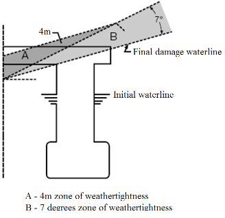

# Rules and Guidance for the Classification of Mobile Offshore Drilling Units

> RULES AND GUIDANCE FOR OFFSHORE STRUCTURES / RB-13-E / 2025 / EN / Guidance

## CHAPTER 5 PIPING SYSTEMS

### Section 1 General

#### 101. General

- **1.** The requirements of this Chapter apply to piping systems and/or associated components that form part of the drilling systems, as follows:
  - **(1)** Blowout preventer control and closing unit
  - **(2)** Choke and kill
  - **(3)** Diverter
  - **(4)** Well circulation
  - **(5)** Bulk mud and cement
  - **(6)** Well test
  - **(7)** Vent system
  - **(8)** Hydraulic piping
- **2.** Unless expressly specified otherwise, piping systems, **Ch 5, 203.** of the Rules is to be complied with.
- **3.** The manufacturer is to submit to the Society for approval P&IDs, piping specifications, design plans and data, and calculations for each piping system associated with the drilling systems listed in **Par 1**.
- **4.** Pressure-temperature ratings of valves and pipe fittings are to be in compliance with ASME B31.3, Chapter II, Paragraph 302.2 or recognized national or international standards.
- **5.** In addition to the requirements of **Par 2** to **Par 4**, individual subsystems used for drilling systems are to be complied with the specific requirements contained in **Ch 4**.

### Section 2 Design Criteria

#### 201. Piping systems

- **1.** Piping and piping components are to be designed to withstand the maximum stress that could arise from the most severe combination of pressure, temperature, and other loads or service conditions as referenced in **Par 6**.
- **2.** The minimum design wall thickness of pipes is to be in accordance with the followings.
  - **(1)** Wall thickness of pipes for ordinary piping having pressure not in excess of that allowed by ASME B16.5 PN 420(Class 2500) is to be calculated according to ASME B31.3, Chapter II, paragraph 304.
  - **(2)** Wall thickness of pipes for high pressure piping having pressure in excess of that allowed by ASME B16.5 PN 420(Class 2500)) is to be calculated according to ASME B31.3, Chapter IX, paragraph K304.
  - **(3)** In addition to Subparagraph (1) and (2), recognized national or international standards may be complied with.
- **3.** Pipe stress and flexibility analysis are to be performed in accordance with ASME B31.3 or recognized national or international standards for all applicable service conditions for the following piping systems.
  - **(1)** Choke and kill system
  - **(2)** High-pressure mud and cement system
  - **(3)** Main hoisting system (hydraulic)
  - **(4)** Well test piping system (permanent)
- **4.** Expansion joints are not to be used in high-pressure well control piping systems.
- **5.** When used, expansion joints or bellows in piping systems are to be provided with shields to prevent mechanical damage and are to be properly aligned and secured.
- **6.** The piping design is to account for, relative to the fluid being transported, internal and external pressures, transient vibrational stresses, fluid velocity and associated erosional effects, hydraulic hammer, transient temperature excursions, outside imposed impact forces and pressure pulsations, and low temperature service considerations, as applicable.
- **7.** The design wall thickness of all piping is to account for the following allowances.
  - **(1)** Mill under-tolerances (12.5% of nominal piping thickness)
  - **(2)** Allowances for threads. The nominal thread depth(dimension h of ASME B1.20.1 or equivalent) is to be applied. For machined surface or grooves where the tolerance is not specified, the tolerance is to be assumed to be 0.5 $\mathrm{mm}$ in addition to specified depth of the cut.
  - **(3)** Corrosion allowance. 3 $\mathrm{mm}$ is to be applied for mud or cement piping.
- **8.** **Alternative criteria**
  - **(1)** The Society is prepared to consider other applicable design references, alternative design methodology and industry practice for piping system and piping component designs, on a case-by-case basis, with justifications through novel features as indicated **Ch 1, Sec 1, 103.**
  - **(2)** Piping components whose dimensions are not specified by recognized standards, design details including dimensional drawings, stress calculations and material data are to be submitted to the Society for approval.
  - **(3)** The extent of nondestructive examination tests, service temperatures, material ductility and special fabrication methods are also to be considered for alternative design criteria.

#### 202. Type of connections

- **1.** **General**
  - **(1)** Piping and connections with outside diameter of 51 $\mathrm{mm}$ and above are to be made by butt-weld, flanged or screwed union.
  - **(2)** Connections for smaller piping sizes than 51 $\mathrm{mm}$ and not intended for corrosive fluids can be welded or screwed and seal welded.
  - **(3)** For piping system rated at 20.7 MPa (3000 psi) or above, such as high-pressure mud system, choke and kill system, cement system or well test system, threaded connections are not to be used.
- **2.** **Socket welds**
  - **(1)** All socket-welding connections are to be identified and specially approved by the Society.
  - **(2)** Socket-welding of piping connections intended for corrosive services is not to be used.
- **3.** **Threaded connections**
  - **(1)** Threaded connections are only to be used for instrumentation, vents, drains, or similar purposes and are not to be greater than 12.4 $\mathrm{mm}$.
  - **(2)** Threaded connections are not to be used in systems subjected to bending or vibrational loads.
  - **(3)** Flared or other approved screwed connectors by the Society may be used in higher-pressure service.
  - **(4)** All screwed connections are to be evaluated, considering the following.
    - **(A)** Pipe outer diameter and thread allowance
    - **(B)** Fluid type, corrosion and fluid leakage risk
    - **(C)** High level of vibration, pressure pulse
- **4.** **Quick connect fittings**
  Hammer lock, hammer union or other quick connect type specialty fittings are to have a rated pressure not less than the pipe system design pressure and are to conform to applicable piping codes or alternative standards.

#### 203. Flexible hoses

- **1.** Typical uses for flexible hoses and hydraulic hoses within the well control and drilling system are:
  - **(1)** Rotary and vibratory hoses
  - **(2)** Cementing hoses
  - **(3)** Riser choke and kill flexible hoses, drape hoses, and jumper hoses
  - **(4)** Hydraulic hoses for control functions, fluid power and hydraulic fluid transfers
  - **(5)** Hydrocarbon hoses for well testing
- **2.** **Flexible hoses for rotary and vibratory**
  - **(1)** Rotary and vibratory hoses for drilling services are to comply with the design, and manufactured in API Spec 7K, and the additional requirements specified in this Annex, and to be suitable for their intended service
  - **(2)** For rotary and vibratory hoses, design verification/prototype testing are to be performed in accordance with Clause 5 of API Spec 7K.
- **3.** **Flexible hoses for Choke and kill**
  - **(1)** Choke, kill and auxiliary flexible hose (drapes and jumpers) are to comply with the design, material, quality control, and prototype testing requirements specified in API Spec 16C, API Spec 16F, and the additional requirements specified in this Annex.
  - **(2)** Drape hoses at the telescopic joint are to be able to accommodate the relative movement between the riser and the drilling unit.
  - **(3)** Jumper hoses for flex/ball joints are be able to accommodate the relative movement between the riser and the BOP stack.
  - **(4)** Flexible hoses for subsea services are to be designed to withstand the external pressure for the operational depth without deforming.
- **4.** **Hydraulic hoses for control**
  - **(1)** Hydraulic hoses utilized for well control functions are to comply with the requirements of **Annex 5-9** of **Rules for the Classification of Steel Ships**, API Spec 16D and recognized industry standards.
  - **(2)** Hydraulic hoses utilized for drilling system control and hydraulic fluid transfer are to comply with the requirements of **Annex 5-9** of **Rules for the Classification of Steel Ships** or recognized industry standards.
- **5.** Gas decompression is to be considered for all flexible lines and hoses being used for conditions where gases or vapor can be present at pressure.
- **6.** **Fire resistance**
  - **(1)** Flexible lines/hydraulic hoses used for well control and are above the water line are to be fire-resistant.
  - **(2)** All flexible lines located in hazardous areas, irrespective of fluid category, are to be fire-resistant.
  - **(3)** Flammable fluids are classified as follows.
    - **(A)** Any fluid, regardless of its flash point, able to support a flame.
    - **(B)** Fuel oil, lubricating oil, and hydraulic oil (unless the hydraulic oil is specifically specified as nonflammable).
  - **(4)** Flexible lines/hydraulic hoses located subsea are not required to be fire-resistant.
  - **(5)** Fire resistance tests of flexible lines/hydraulic hoses are to be in accordance with API Spec 16C and API Spec 16D.
- **7.** End connections for flexible lines are to be designed and fabricated to the requirements of **201.** and applicable recognized codes and standards.
- **8.** Isolation valves are to be provided to prevent potential uncontrolled release of flowing medium from flexible lines to minimize the hazard.
- **9.** Material requirements for flexible hoses, including end fittings when exposed to wellbore fluids or a corrosive/erosive environment, are to be in accordance with **Ch 3, Sec 1** and applicable design codes and standards.
- **10.** Nonmetallic materials used in the manufacturing of flexible line and/or hydraulic hose assemblies are to be suitable for the intended service conditions such as temperature and fluid compatibility.
- **11.** Flexible hoses are to be accessible for on-site inspection.
- **12.** Flexible hoses are to be type approved by the Society.

### Section 3 Materials, Welding and Nondestructive Examination

#### 301. Materials

Materials are to be in accordance with the applicable design codes and standards and **Ch 3, Sec 1.** Composite materials where used in drilling piping system applications are to be of fire resistant construction and are to be designed and tested to ASME Boiler and Pressure Vessel Code, Section X.

#### 302. welding and nondestructive examination

Welding and NDE are to be in accordance with the applicable design codes and standards and the requirements of **Ch 3, Sec 2.** 
